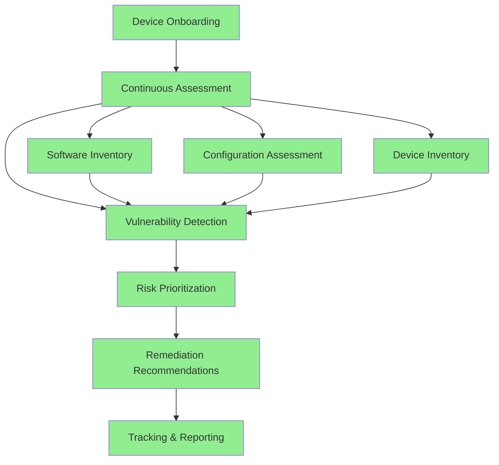

# Microsoft Defender Vulnerability Management: Certificate Inventory Investigation Report

**Report Date:** April 30, 2026  
**Environment:** Microsoft Defender for Endpoint Plan 2  
**Licensed Devices:** 4,500+ (Plan 2)  
**Total Device Inventory:** 18,000+ devices  
**Report Focus:** Certificate Inventory Feature Availability & Enablement

---

## Executive Summary

This report investigates the unavailability of the **Certificate Inventory** feature in the Microsoft Defender Vulnerability Management console, despite having Microsoft Defender for Endpoint (MDE) Plan 2 licenses deployed across 4,500+ devices with 18,000+ total devices in the asset inventory.

**Key Findings:**
- ✅ **Software Inventory:** Operational (600+ applications tracked)
- ✅ **Device Inventory:** Operational (18,000+ devices)
- ❌ **Certificate Inventory:** Not available (requires premium add-on)
- ❌ **Browser Extensions:** Not available (requires premium add-on)
- ❌ **Hardware & Firmware:** Not available (requires premium add-on)

**Root Cause:** The Certificate Inventory, Browser Extensions, and Hardware & Firmware assessment features are **premium capabilities** NOT included in Microsoft Defender for Endpoint Plan 2 baseline licensing. These features require either:
1. **Defender Vulnerability Management Add-on** (for existing MDE P2 customers), OR
2. **Defender Vulnerability Management Standalone** license

---

## 1. Goal

The objective of this investigation is to:

1. **Determine** if the Certificate Inventory feature is enabled in the current environment
2. **Identify** the licensing and configuration requirements for enabling this feature
3. **Understand** what data and insights can be obtained from Certificate Inventory
4. **Provide recommendations** for enabling advanced vulnerability management capabilities

---

## 2. Prerequisites

### 2.1 Licensing Requirements

Based on Microsoft documentation, Certificate Inventory requires **ONE** of the following licenses:

| License Option | Description | Target Audience |
|----------------|-------------|-----------------|
| **Defender Vulnerability Management Add-on** | Add-on license for existing MDE Plan 2 customers | Organizations with MDE P2 wanting premium VM features |
| **Defender Vulnerability Management Standalone** | Standalone license including all premium features | New customers or MDE P1/M365 E3 customers |
| **Defender for Servers Plan 2** | Available for Azure server workloads only | Azure cloud-based server VMs |

### 2.2 Technical Prerequisites

✅ **Current Environment Status:**
- Microsoft Defender for Endpoint Plan 2: **Active**
- Licensed devices: **4,500+**
- Device onboarding: **18,000+ devices enrolled**
- Windows devices with local machine certificate store: **Required for certificate data collection**

### 2.3 Feature Availability Matrix

| Feature | MDE Plan 2 (Base) | Defender VM Add-on | Defender VM Standalone |
|---------|-------------------|-------------------|----------------------|
| Device discovery | ✅ Included | ✅ Included | ✅ Included |
| Device inventory | ✅ Included | ✅ Included | ✅ Included |
| Vulnerability assessment | ✅ Included | ✅ Included | ✅ Included |
| Configuration assessment | ✅ Included | ✅ Included | ✅ Included |
| Software inventory | ✅ Included | ✅ Included | ✅ Included |
| Risk-based prioritization | ✅ Included | ✅ Included | ✅ Included |
| **Certificate Inventory** | ❌ **Not Included** | ✅ **Premium** | ✅ **Premium** |
| **Browser Extensions** | ❌ **Not Included** | ✅ **Premium** | ✅ **Premium** |
| **Hardware & Firmware** | ❌ **Not Included** | ✅ **Premium** | ✅ **Premium** |
| Security baselines assessment | ❌ Not Included | ✅ Premium | ✅ Premium |
| Block vulnerable applications | ❌ Not Included | ✅ Premium | ✅ Premium |
| Network share analysis | ❌ Not Included | ✅ Premium | ✅ Premium |

---

## 3. Permissions

### 3.1 Required Roles for Certificate Inventory Access

Once licensed, users require the following Azure AD/Microsoft 365 roles:

| Role | Read Access | Manage/Export |
|------|------------|---------------|
| **Security Administrator** | ✅ Full Access | ✅ Yes |
| **Security Operator** | ✅ Full Access | ✅ Yes |
| **Security Reader** | ✅ Read-only | ❌ No |
| **Global Administrator** | ✅ Full Access | ✅ Yes |

### 3.2 Portal Navigation

**For Preview Customers (Microsoft Defender XDR + Defender for Identity):**
```
Microsoft Defender Portal → Exposure management → Vulnerability management → Inventories → Certificates
```

**For Existing Customers:**
```
Microsoft Defender Portal → Endpoints → Vulnerability management → Inventories → Certificates
```

---

## 4. Configuration & Enablement Status

### 4.1 Current Environment Status

**✅ ENABLED Features (MDE Plan 2 Baseline):**
- Device Inventory: **18,000+ devices**
- Software Inventory: **600+ applications**
- Vulnerability Assessment: **Active**
- Configuration Assessment: **Active**
- Risk-based Prioritization: **Active**

**❌ DISABLED Features (Require Premium License):**
- Certificate Inventory: **No data available**
- Browser Extensions: **No data available**
- Hardware & Firmware: **No data available**
- Security Baselines Assessment: **Not available**
- Block Vulnerable Applications: **Not available**
- Network Share Analysis: **Not available**

### 4.2 Why Certificate Inventory Shows "No Data Available"

**Root Cause Analysis:**

1. **License Gap:** Microsoft Defender for Endpoint Plan 2 baseline does NOT include Certificate Inventory
2. **Feature Gating:** The feature is license-enforced in the Microsoft Defender portal
3. **Data Collection:** Certificate telemetry is not collected without the premium license

**This is NOT a configuration issue** - it is a **licensing limitation**.

### 4.3 How to Enable Certificate Inventory

**Option 1: Purchase Defender Vulnerability Management Add-on (Recommended for your environment)**

Since you already have MDE Plan 2 with 4,500+ licenses, the add-on approach is most cost-effective:

1. **Contact Microsoft Licensing**
   - Work with Microsoft reseller: [Microsoft Security Partners](https://www.microsoft.com/security/business/find-a-partner)
   - Request: **Defender Vulnerability Management Add-on for MDE Plan 2**

2. **Start Free Trial** (if available)
   - Navigate to trial page: [Try Defender VM Add-on](https://learn.microsoft.com/en-us/defender-vulnerability-management/get-defender-vulnerability-management)
   - Trial duration: Typically 90 days
   - No configuration changes needed - features auto-enable upon license assignment

3. **Automatic Enablement**
   - Once licenses are assigned, features activate within 24-48 hours
   - Certificate data collection begins automatically on Windows devices
   - Data appears in portal: **Inventories → Certificates**

**Option 2: Defender Vulnerability Management Standalone**

For new deployments or if replacing MDE Plan 2:
- Includes all premium features natively
- Contact Microsoft Sales for pricing and migration path

---

## 5. What Data Can Be Obtained from Certificate Inventory?

### 5.1 Certificate Discovery & Visibility

**Scope:**
- ✅ **Windows devices only** - Certificates from local machine certificate store
- ❌ **Not included:** Linux/macOS certificates (use different tools)
- ✅ **Central inventory:** All certificates across 18,000+ devices in single dashboard

### 5.2 Certificate Risk Assessment

**Automatically Identifies:**

| Risk Category | Detection Criteria | Business Impact |
|---------------|-------------------|-----------------|
| **Expired Certificates** | Certificates past expiration date | Service outages, authentication failures |
| **Expiring Soon** | Expiring within 60 days or less | Proactive renewal opportunity |
| **Weak Key Size** | Key size < 2,048 bits | Cryptographic vulnerability |
| **Weak Signature Algorithm** | SHA-1, MD5 signatures | Compliance failure, security risk |
| **Self-Signed Certificates** | No trusted CA issuer | Man-in-the-middle attack risk |
| **Future-Dated Certificates** | Issue date in future | Configuration error |

### 5.3 Certificate Details Available

**Per Certificate:**
- Certificate name and thumbprint
- Issuer information (who issued the certificate)
- Subject details (who it was issued to)
- Expiration date and validity period
- Key size and signature algorithm
- Certificate type (Root, Intermediate, Machine, Server, Trusted Publisher)
- **Device mapping:** List of all devices where certificate is installed
- Number of instances across organization

### 5.4 Dashboard & Widgets

**Overview Dashboard Provides:**
- Total certificate count
- Certificates expiring in 30/60/90 days
- High-risk certificate count (expired, weak crypto, self-signed)
- Certificate distribution by type
- Trend analysis over time

### 5.5 Advanced Hunting Integration

**Query Capability:**
- Table: `DeviceTvmCertificateInfo`
- Custom KQL queries for certificate analysis
- Export to CSV for compliance reporting
- Integration with Azure Sentinel/Microsoft Sentinel

**Example Query:**
```kql
DeviceTvmCertificateInfo
| where ExpirationDate < now()
| summarize ExpiredCertCount = count() by DeviceName
| order by ExpiredCertCount desc
```

### 5.6 Actionable Use Cases

| Use Case | Benefit |
|----------|---------|
| **Certificate Lifecycle Management** | Proactive renewal before expiration prevents service disruption |
| **Compliance Reporting** | Identify non-compliant certificates (weak crypto, expired) |
| **Security Posture** | Detect vulnerable certificates across entire estate |
| **Incident Response** | Quickly identify affected devices during certificate compromise |
| **TLS/SSL Management** | Audit web server certificates for proper configuration |
| **PKI Hygiene** | Find self-signed certificates violating corporate policy |
| **Regulatory Compliance** | PCI-DSS, HIPAA, SOC2 certificate requirements validation |

---

## 6. Understanding Other Vulnerability Management Inventory Features

### 6.1 Browser Extensions Assessment (Premium Feature)

**What it provides:**
- Inventory of all browser extensions across Edge, Chrome, Firefox
- Risk assessment for malicious or vulnerable extensions
- Usage analytics per extension
- Extension version tracking
- **Status in your environment:** Not available (requires premium license)

### 6.2 Hardware & Firmware Assessment (Premium Feature)

**What it provides:**
- Hardware component inventory (BIOS, TPM, network cards)
- Firmware version tracking
- Vulnerability detection in firmware
- Outdated firmware identification
- Supply chain risk assessment
- **Status in your environment:** Not available (requires premium license)

### 6.3 Software Inventory (Currently Active)

**What you already have:**
- 600+ applications tracked
- Software version detection
- Vulnerability mapping to CVEs
- End-of-life software detection
- Usage insights per application

### 6.4 Device Inventory (Currently Active)

**What you already have:**
- 18,000+ devices tracked
- OS version and patch level
- Device risk level assessment
- Exposure score calculation
- Device grouping and tagging

---

## 7. Recommendations

### 7.1 Immediate Actions

**Priority 1: Evaluate Business Need**

Assess if certificate management is a critical requirement:
- [ ] Review certificate-related incidents in past 12 months
- [ ] Identify service outages due to expired certificates
- [ ] Evaluate compliance requirements (PCI-DSS, HIPAA, ISO 27001)
- [ ] Assess current certificate management processes

**Priority 2: Cost-Benefit Analysis**

| Factor | Current State | With Premium License |
|--------|---------------|---------------------|
| Manual certificate audits | Time-consuming, error-prone | Automated, continuous |
| Certificate-related outages | Reactive response | Proactive prevention |
| Compliance reporting | Manual effort | Automated dashboards |
| Visibility across devices | Limited to manual checks | 18,000+ devices centralized |
| Risk detection | Manual review | Automated weak crypto detection |

### 7.2 Licensing Recommendations

**Option A: Start with Trial (Recommended First Step)**
```
Action: Initiate 90-day trial of Defender Vulnerability Management Add-on
Timeline: Immediate
Cost: $0 (trial period)
Benefit: Evaluate all premium features in production environment
```

**Option B: Purchase Add-on License**
```
Action: Purchase Defender VM Add-on for 4,500 devices
Contact: Microsoft reseller or Microsoft Security Partners
Estimated Timeline: 2-4 weeks for procurement
Benefit: Permanent access to all premium features
```

**Option C: Defer Implementation**
```
Action: Continue with MDE Plan 2 baseline features
Risk: No certificate visibility, potential compliance gaps
Alternative: Implement third-party certificate management tool
```

### 7.3 Implementation Roadmap (If Proceeding)

**Phase 1: Planning (Week 1-2)**
- [ ] Obtain executive approval for license purchase
- [ ] Contact Microsoft reseller for pricing
- [ ] Schedule trial start date
- [ ] Identify stakeholders (Security, IT Ops, Compliance)

**Phase 2: Trial/Enablement (Week 3-4)**
- [ ] Assign licenses to users
- [ ] Validate feature availability in portal
- [ ] Monitor certificate data collection (24-48 hour delay)
- [ ] Configure dashboard widgets
- [ ] Set up alerting for expiring certificates

**Phase 3: Operationalization (Week 5-8)**
- [ ] Create certificate management playbook
- [ ] Define renewal process for expiring certificates
- [ ] Establish KPIs (e.g., zero expired certificates, no weak crypto)
- [ ] Train security operations team
- [ ] Integrate with ITSM/ticketing system

**Phase 4: Optimization (Ongoing)**
- [ ] Configure Advanced Hunting queries
- [ ] Build custom workbooks for compliance reporting
- [ ] Establish monthly certificate health reviews
- [ ] Implement automation for certificate remediation

### 7.4 Alternative Solutions (If Not Purchasing Premium License)

If premium licensing is not approved, consider:

1. **Native Windows PowerShell Scripts**
   - Use `Get-ChildItem Cert:\LocalMachine\` to inventory certificates
   - Schedule scripts via Task Scheduler
   - Export to centralized database

2. **Third-Party Certificate Management Tools**
   - Venafi
   - DigiCert CertCentral
   - Keyfactor

3. **Azure Key Vault (for web applications)**
   - Centralized certificate storage
   - Automated renewal for Azure-hosted apps
   - Monitoring via Azure Monitor

---

## 8. Brief Report: Vulnerability Management Overview in MSEM

### Current Vulnerability Management Status

**Microsoft Defender for Endpoint Plan 2 - Active Capabilities:**

| Component | Status | Details |
|-----------|--------|---------|
| **Exposure Score** | ✅ Active | Organization-wide risk score based on vulnerabilities and misconfigurations |
| **Vulnerability Dashboard** | ✅ Active | CVE tracking, CVSS scores, exposure trends |
| **Software Inventory** | ✅ Active | 600+ applications tracked with version details |
| **Device Inventory** | ✅ Active | 18,000+ devices with OS details and patch status |
| **Secure Score** | ✅ Active | Microsoft Secure Score integration |
| **Remediation Tracking** | ✅ Active | Patching recommendations and remediation status |
| **Threat Analytics** | ✅ Active | Emerging threat intelligence and exposure assessment |
| **Configuration Assessment** | ✅ Active | Security configuration compliance checks |
| **Weaknesses (CVEs)** | ✅ Active | CVE discovery and prioritization |

**Premium Features (Not Available - Requires Add-on):**

| Component | Status | Impact |
|-----------|--------|--------|
| **Certificate Inventory** | ❌ Not Available | No visibility into certificate expiration, weak crypto |
| **Browser Extensions** | ❌ Not Available | No tracking of potentially malicious extensions |
| **Hardware/Firmware** | ❌ Not Available | No firmware vulnerability detection |
| **Security Baselines** | ❌ Not Available | Limited configuration compliance assessment |
| **Block Vulnerable Apps** | ❌ Not Available | Cannot enforce application blocking policies |
| **Network Share Analysis** | ❌ Not Available | No visibility into network share permissions |

### Vulnerability Management Workflow (Current Capabilities)



---

## 9. Brief Report: Assets - Device Tab in Security Portal

### Device Inventory Overview

**Portal Location:**
```
Microsoft Defender Portal → Assets → Devices
```

### Current Device Inventory Statistics

| Metric | Count | Status |
|--------|-------|--------|
| **Total Devices** | 18,000+ | ✅ Active |
| **Licensed Devices (MDE P2)** | 4,500+ | ✅ Active |
| **Unlicensed/Discovery Mode** | ~13,500 | ℹ️ Visible but limited telemetry |

### Device Inventory Capabilities (Active)

**1. Device Discovery**
- Automatic discovery of all network devices
- Agentless discovery for unmanaged devices
- Network mapping and device relationships

**2. Device Details Available**
- Device name and domain
- Operating system and version
- Public and private IP addresses
- Last seen timestamp
- Risk level (High, Medium, Low, None)
- Exposure level
- Onboarding status (Onboarded, Can be onboarded, Not supported)
- Device tags and groups
- Sensor health status
- Microsoft Defender Antivirus status

**3. Device Risk Assessment**
- Risk score (0-100)
- Active alerts count
- Vulnerability exposure
- Configuration issues
- Missing security updates

**4. Device Filtering & Grouping**
- Filter by OS (Windows 10, Windows 11, Windows Server, Linux, macOS)
- Filter by risk level
- Filter by exposure level
- Filter by onboarding status
- Custom device groups for organizational structure

**5. Device Actions Available**
- Isolate device
- Run antivirus scan
- Initiate investigation
- Restrict app execution
- Collect investigation package
- Initiate automated investigation
- Onboard to MDE (for unlicensed devices)

### Device Inventory Data Sources

**Active Telemetry (MDE P2 Licensed Devices - 4,500+):**
- ✅ Full EDR telemetry
- ✅ Process execution data
- ✅ Network connections
- ✅ File system changes
- ✅ Registry modifications
- ✅ Behavioral detection
- ✅ Advanced Hunting access

**Limited Telemetry (Discovered Devices - ~13,500):**
- ✅ Basic device information
- ✅ Network presence
- ℹ️ Limited vulnerability data
- ❌ No EDR telemetry
- ❌ No Advanced Hunting

### Device Onboarding Gap Analysis

**Gap:** 13,500+ devices visible but not fully licensed

**Options to Address:**
1. **License More Devices** - Purchase additional MDE P2 licenses
2. **Prioritize Critical Assets** - Focus on servers, domain controllers, critical workstations
3. **Use Discovery Mode** - Keep basic visibility without full licensing cost
4. **Device Exclusions** - Exclude IoT, printers, network devices from inventory

### Integration with Vulnerability Management

**Device Inventory + Vulnerability Management:**
- Each device shows installed software and vulnerabilities
- Risk score calculation based on CVE exposure
- Remediation recommendations per device
- Compliance status tracking
- Patch deployment status

---

## 10. Conclusion

### Summary of Findings

1. **Feature Availability:** Certificate Inventory, Browser Extensions, and Hardware/Firmware assessment are **premium features** not included in Microsoft Defender for Endpoint Plan 2 baseline licensing.

2. **Licensing Requirement:** To enable these features, the organization must purchase either:
   - Defender Vulnerability Management Add-on (recommended for existing MDE P2 customers)
   - Defender Vulnerability Management Standalone license

3. **Data Visibility Gap:** Without the premium license:
   - No certificate lifecycle visibility across 18,000+ devices
   - No automated detection of expired/expiring certificates
   - No weak cryptography identification
   - Compliance reporting gaps for certificate-related requirements

4. **Current Capabilities:** The baseline MDE Plan 2 license provides robust capabilities for:
   - Device inventory and discovery (18,000+ devices)
   - Software inventory (600+ applications)
   - Vulnerability assessment and CVE tracking
   - Configuration assessment
   - Risk-based prioritization

### Business Impact Assessment

**Risk of NOT Enabling Certificate Inventory:**
- ⚠️ **Service Outage Risk:** Expired certificates causing authentication failures
- ⚠️ **Security Risk:** Weak cryptographic algorithms remaining undetected
- ⚠️ **Compliance Risk:** PCI-DSS, HIPAA, ISO 27001 violations for improper certificate management
- ⚠️ **Operational Inefficiency:** Manual certificate audits across 18,000+ devices

**Value of Enabling Premium Features:**
- ✅ **Proactive Prevention:** Automated alerts for expiring certificates (30/60/90-day windows)
- ✅ **Security Posture:** Comprehensive visibility into cryptographic weaknesses
- ✅ **Compliance:** Automated reporting for regulatory requirements
- ✅ **Centralized Management:** Single pane of glass for all certificate data
- ✅ **ROI:** Reduced manual effort, prevented outages, compliance assurance

### Final Recommendations

**Immediate (Next 30 Days):**
1. ✅ **Validate current feature requirements** with stakeholders (Security, Compliance, IT Ops)
2. ✅ **Contact Microsoft reseller** to discuss Defender VM Add-on pricing
3. ✅ **Initiate free trial** (if available) to evaluate features in production
4. ✅ **Conduct cost-benefit analysis** comparing manual processes vs. automated solution

**Short-Term (Next 90 Days):**
1. ✅ **Obtain budget approval** for Defender VM Add-on licenses
2. ✅ **Complete trial evaluation** and document findings
3. ✅ **Deploy premium features** to production environment
4. ✅ **Configure alerting and dashboards** for certificate management

**Long-Term (6-12 Months):**
1. ✅ **Establish certificate lifecycle management process**
2. ✅ **Integrate with PKI infrastructure** for automated renewals
3. ✅ **Implement compliance reporting** for audits
4. ✅ **Expand to Browser Extensions and Hardware/Firmware assessments**

### Questions Answered

| Question | Answer |
|----------|--------|
| **1. Do we have certificate inventory feature enabled?** | **No.** The feature is not enabled because it requires the Defender Vulnerability Management Add-on or Standalone license, which is not included in MDE Plan 2 baseline. |
| **2. If we don't have it enabled, why not?** | **Licensing limitation.** MDE Plan 2 does not include premium Vulnerability Management features (Certificate Inventory, Browser Extensions, Hardware/Firmware). These require an add-on purchase. |
| **3. What data can we get from it?** | **Comprehensive certificate visibility:** Expired/expiring certificates, weak crypto detection, self-signed certificates, certificate-to-device mapping, issuer details, risk assessment, and compliance reporting across all 18,000+ Windows devices. |

---

## 11. References

- **Microsoft Documentation:**
  - [Certificate Inventory Overview](https://learn.microsoft.com/en-us/defender-vulnerability-management/tvm-certificate-inventory)
  - [Defender Vulnerability Management Capabilities Comparison](https://learn.microsoft.com/en-us/defender-vulnerability-management/defender-vulnerability-management-capabilities)
  - [Microsoft 365 Security Licensing Guidance](https://learn.microsoft.com/en-us/office365/servicedescriptions/microsoft-365-service-descriptions/microsoft-365-tenantlevel-services-licensing-guidance/microsoft-365-security-compliance-licensing-guidance)

- **Contact Information:**
  - Microsoft Security Partners: https://www.microsoft.com/security/business/find-a-partner
  - Defender VM Pricing: https://www.microsoft.com/security/business/threat-protection/microsoft-defender-vulnerability-management-pricing

- **Advanced Hunting Reference:**
  - DeviceTvmCertificateInfo Table: https://learn.microsoft.com/en-us/defender-xdr/advanced-hunting-devicetvmcertificateinfo-table

---

**Report Prepared By:** Security Operations Team  
**Next Review Date:** May 30, 2026  
**Version:** 1.0

---

## Appendix A: Licensing Cost Considerations

**Estimated Pricing (Contact Microsoft for Accurate Pricing):**

| License Type | Typical Cost Range | Notes |
|--------------|-------------------|-------|
| MDE Plan 2 | $5-$6 per user/month | Current license |
| Defender VM Add-on | $2-$3 per device/month | Add-on to existing MDE P2 |
| Defender VM Standalone | $6-$8 per device/month | Includes all features |

**For 4,500 licensed devices:**
- Add-on cost estimate: $9,000 - $13,500/month
- Annual cost estimate: $108,000 - $162,000/year

**Justification for Investment:**
- Single certificate-related outage can cost $100,000+ in lost revenue
- Compliance fines for weak cryptography: $50,000 - $500,000+
- Manual certificate audits: ~500 hours/year at $75/hour = $37,500/year
- **ROI timeframe:** Typically 6-12 months based on prevented incidents

---

## Appendix B: KQL Queries for Certificate Analysis (Once Enabled)

**Query 1: Find All Expired Certificates**
```kql
DeviceTvmCertificateInfo
| where ExpirationDate < now()
| summarize DeviceCount = dcount(DeviceName) by CertificateSubject, Issuer, ExpirationDate
| order by DeviceCount desc
```

**Query 2: Certificates Expiring in Next 60 Days**
```kql
DeviceTvmCertificateInfo
| where ExpirationDate between (now() .. datetime_add('day', 60, now()))
| project DeviceName, CertificateSubject, Issuer, ExpirationDate, DaysUntilExpiration = datetime_diff('day', ExpirationDate, now())
| order by DaysUntilExpiration asc
```

**Query 3: Weak Key Size Detection**
```kql
DeviceTvmCertificateInfo
| where KeySize < 2048
| summarize DevicesAffected = dcount(DeviceName), CertificateCount = count() by KeySize, SignatureAlgorithm
| order by DevicesAffected desc
```

**Query 4: Self-Signed Certificates**
```kql
DeviceTvmCertificateInfo
| where IsSelfSigned == true
| project DeviceName, CertificateSubject, ExpirationDate, KeySize
| order by DeviceName asc
```

**Query 5: Weak Signature Algorithms (SHA-1, MD5)**
```kql
DeviceTvmCertificateInfo
| where SignatureHashAlgorithm in ("SHA1", "MD5")
| summarize DeviceCount = dcount(DeviceName), CertCount = count() by SignatureHashAlgorithm, CertificateSubject
| order by DeviceCount desc
```

---

*End of Report*
