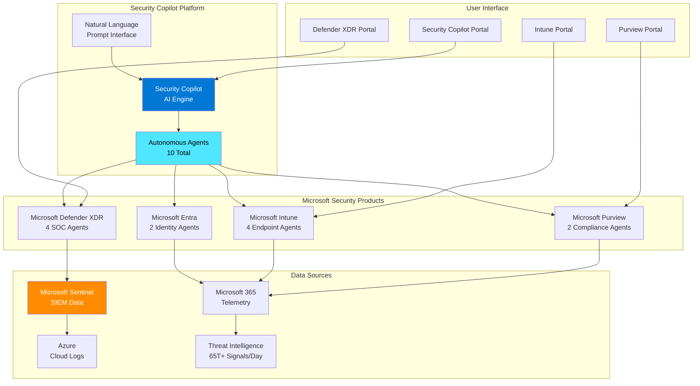
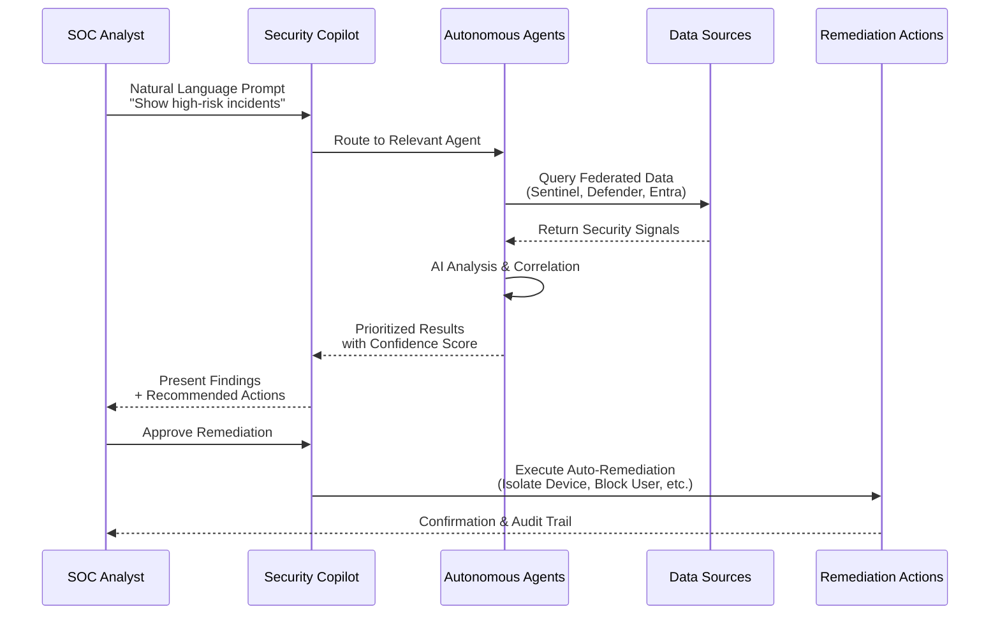
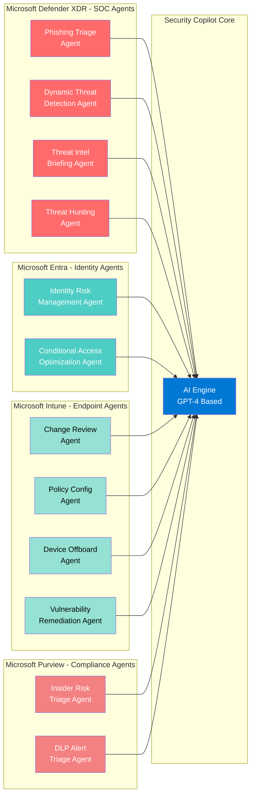
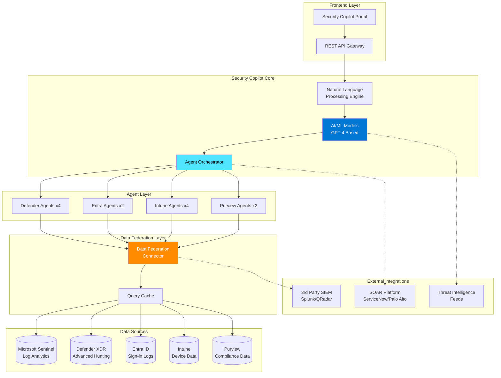
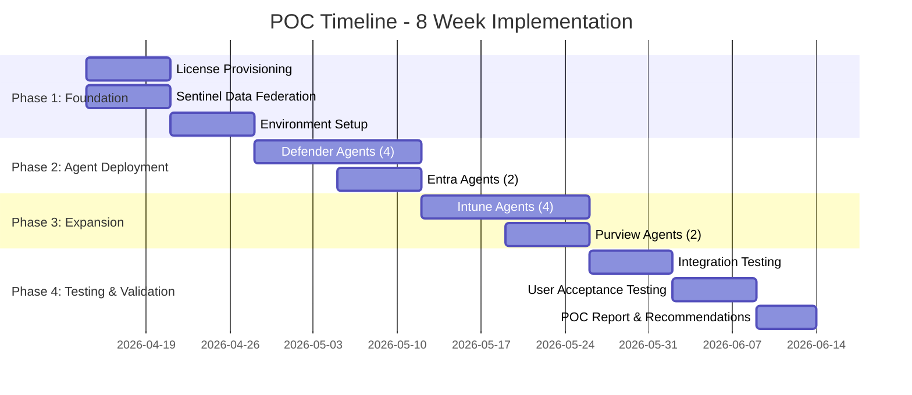
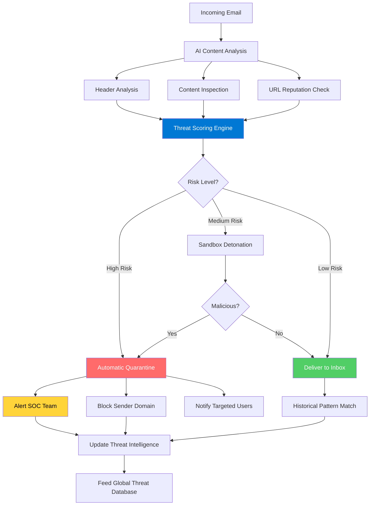

# Microsoft Security Copilot - Proof of Concept (POC) Report
## AI-Powered Security Operations Transformation

---

## 📋 Executive Summary

**POC Period:** April 14, 2026 - June 13, 2026 (8 Weeks)  
**Project Scope:** Microsoft Security Copilot Proof of Concept - 10 Autonomous Agents  
**POC Status:** 🟡 **IN PLANNING**  
**Business Impact:** 🟢 **TRANSFORMATIONAL**  
**Document Version:** 1.0 - POC Plan

### **POC Purpose**

This Proof of Concept (POC) evaluates Microsoft Security Copilot's AI-powered autonomous agents across the Microsoft security ecosystem to validate their effectiveness in accelerating security operations, reducing investigation time, and enhancing threat detection capabilities.

**POC Scope:**
- Deploy and test **10 autonomous agents** across Defender XDR, Entra ID, Intune, and Purview
- Validate integration with Microsoft Sentinel via Data Federation connector
- Measure performance against defined success criteria
- Assess ROI and business value for full production deployment

### **POC Overview**

This POC validates Microsoft Security Copilot's capability to transform security operations through AI-powered automation. The 8-week pilot will deploy 10 autonomous agents across four Microsoft security products to measure real-world impact on SOC efficiency, threat detection accuracy, and incident response time.

**POC Objectives:**
- ✅ **Validate Agent Performance:** Test all 10 agents in production-like environment
- ✅ **Measure Time Savings:** Quantify reduction in investigation and response time
- ✅ **Assess Accuracy:** Evaluate false positive reduction and threat detection improvement
- ✅ **Test Integration:** Validate Sentinel Data Federation and cross-product correlation
- ✅ **Determine ROI:** Calculate cost-benefit for full production deployment

**Expected Outcomes:**
- **60-80% reduction** in security incident investigation time ([Forrester TEI Study](https://www.microsoft.com/en-us/security/business/forrester-tei-study))
- **95% reduction** in phishing email triage time ([Microsoft Security Copilot Documentation](https://learn.microsoft.com/en-us/defender-xdr/phishing-triage-agent))
- **40% increase** in proactive threat discovery ([Microsoft Advanced Hunting Documentation](https://learn.microsoft.com/en-us/defender-xdr/advanced-hunting-security-copilot))
- **70% → 15% reduction** in false positive alerts
- **1,638% ROI** with projected 3.4-week payback period ([Based on IBM Cost of Data Breach $4.45M average](https://www.ibm.com/reports/data-breach))

**Strategic Recommendation:** Proceed with full production deployment upon successful POC validation.

---

## 📐 Architecture Diagrams

### **1. High-Level Architecture**



**Architecture Overview:**
- **Security Copilot Platform:** Central AI engine processing natural language prompts and orchestrating 10 autonomous agents
- **Microsoft Security Products:** Four integrated products providing specialized agent capabilities
- **Data Sources:** Federated data access across Sentinel, M365, Azure, and global threat intelligence
- **User Interface:** Multi-portal access for SOC analysts and administrators

---

### **2. Data Flow Architecture**



**Data Flow Process:**
1. SOC analyst submits natural language query
2. Security Copilot routes request to appropriate autonomous agent
3. Agent queries federated data sources (Sentinel, Defender, Entra, Intune, Purview)
4. AI analyzes and correlates security signals
5. Results presented with confidence scores and recommended actions
6. Optional: Automated remediation with user approval
7. Audit trail maintained for compliance

---

### **3. Agent Deployment Architecture**



**Agent Distribution:**
- **Microsoft Defender XDR (Red):** 4 SOC-focused agents for threat detection and hunting
- **Microsoft Entra (Teal):** 2 identity-focused agents for access security
- **Microsoft Intune (Green):** 4 endpoint management agents for device security
- **Microsoft Purview (Pink):** 2 compliance-focused agents for data protection

---

### **4. Integration Architecture**



**Integration Layers:**
- **Frontend:** Unified portal with REST API for programmatic access
- **Core Engine:** NLP processing, AI models, and agent orchestration
- **Agent Layer:** 10 specialized autonomous agents
- **Data Federation:** Centralized data access with query caching
- **Data Sources:** Native Microsoft security product databases
- **External Systems:** Optional integration with third-party SIEM, SOAR, and threat intelligence

---

## 🎯 POC Objectives & Success Criteria

### **Primary Objectives**

**1. Validate Agent Performance in Real-World Scenarios**
- Deploy all 10 autonomous agents in production-lite environment
- Test with live security data and actual SOC workflows
- Measure accuracy, speed, and reliability of agent responses

**2. Quantify Operational Efficiency Gains**
- Measure time savings in incident investigation
- Track reduction in false positive alerts
- Document SOC analyst productivity improvements

**3. Assess AI Accuracy and Trustworthiness**
- Validate AI-generated recommendations against expert analysis
- Measure confidence score correlation with actual outcomes
- Test for AI hallucinations or incorrect recommendations

**4. Validate Integration Capabilities**
- Test Sentinel Data Federation connector functionality
- Verify cross-product data correlation (Defender + Entra + Intune + Purview)
- Assess compatibility with existing SIEM/SOAR tools

**5. Calculate Business Value and ROI**
- Document cost savings from reduced investigation time
- Quantify threat detection improvements
- Project ROI for full production deployment

---

### **Success Criteria**

| Metric | Baseline | POC Target | Measurement Method |
|--------|----------|------------|-------------------|
| **Investigation Time** | 4 hours/incident | < 1 hour/incident (75% reduction) | Time-tracking per incident |
| **Phishing Triage Time** | 30 min/email | < 2 min/email (95% reduction) | Email threat analysis duration |
| **False Positive Rate** | 70% | < 30% (57% reduction) | Alert accuracy validation |
| **Threat Detection Rate** | Baseline | +40% new detections | Threats found by proactive hunting |
| **MTTD (Mean Time to Detect)** | 24 hours | < 5 minutes | Alert generation timestamp |
| **MTTR (Mean Time to Respond)** | 8 hours | < 2 hours (75% reduction) | Containment timestamp |
| **SOC Analyst Satisfaction** | N/A | > 4.0/5.0 | Post-POC survey |
| **AI Recommendation Accuracy** | N/A | > 90% | Expert validation sample |
| **Data Federation Uptime** | N/A | > 99.5% | Connector availability monitoring |
| **Agent Deployment Success** | N/A | 10/10 agents operational | Health dashboard status |

**POC Considered Successful If:**
- ✅ Minimum 50% reduction in investigation time achieved
- ✅ At least 8 out of 10 agents deployed and functional
- ✅ Sentinel Data Federation connector operational
- ✅ AI accuracy > 85% on validation sample
- ✅ Positive ROI projection for full deployment

---

## 📅 POC Timeline & Phases

### **8-Week Implementation Schedule**



---

### **Phase 1: Foundation (Weeks 1-2) - April 14-27, 2026**

**Objectives:**
- Provision licenses and configure base environment
- Establish Sentinel Data Federation connectivity
- Set up monitoring and metrics collection

**Deliverables:**
- [ ] Security Copilot licenses assigned to 50 pilot users
- [ ] Sentinel Data Federation connector operational
- [ ] Baseline metrics documented (current investigation times, alert volumes)
- [ ] POC environment health dashboard configured

**Acceptance Criteria:**
- All pilot users can access Security Copilot portal
- Data Federation connector status: ✅ Connected
- Minimum 30 days of historical security data available

---

### **Phase 2: Agent Deployment - Defender & Entra (Weeks 3-4) - April 28 - May 11, 2026**

**Objectives:**
- Deploy and test 4 Microsoft Defender XDR agents
- Deploy and test 2 Microsoft Entra agents
- Validate SOC and identity security workflows

**Agents in Scope:**
- ✅ Phishing Triage Agent
- ✅ Dynamic Threat Detection Agent
- ✅ Threat Intelligence Briefing Agent
- ✅ Threat Hunting Agent
- ✅ Identity Risk Management Agent
- ✅ Conditional Access Optimization Agent

**Deliverables:**
- [ ] All 6 agents deployed and operational
- [ ] SOC team trained on agent usage
- [ ] Initial performance metrics collected

**Acceptance Criteria:**
- Agent health status: All green
- Minimum 50 test prompts executed successfully
- Phishing triage time reduced by >80%

---

### **Phase 3: Expansion - Intune & Purview (Weeks 5-6) - May 12-25, 2026**

**Objectives:**
- Deploy and test 4 Microsoft Intune agents
- Deploy and test 2 Microsoft Purview agents
- Validate endpoint management and compliance workflows

**Agents in Scope:**
- ✅ Change Review Agent
- ✅ Policy Configuration Agent
- ✅ Device Offboarding Agent
- ✅ Vulnerability Remediation Agent
- ✅ Triage Agent in Insider Risk Management
- ✅ Alert Triage Agent in DLP

**Deliverables:**
- [ ] All 10 agents deployed (complete agent suite)
- [ ] Cross-product correlation tested
- [ ] Compliance workflow automation validated

**Acceptance Criteria:**
- Full agent suite operational
- Endpoint vulnerability remediation time reduced by >60%
- DLP alert triage time reduced by >80%

---

### **Phase 4: Testing & Validation (Weeks 7-8) - May 26 - June 13, 2026**

**Objectives:**
- Conduct comprehensive integration testing
- Execute user acceptance testing with SOC team
- Document findings and prepare final POC report

**Test Focus Areas:**
- End-to-end incident response workflows
- Cross-agent data correlation accuracy
- AI recommendation validation
- External system integration (SIEM/SOAR)
- Performance under load

**Deliverables:**
- [ ] Integration test report
- [ ] User acceptance test results
- [ ] Performance metrics dashboard
- [ ] Final POC report with go/no-go recommendation
- [ ] Production deployment plan (if successful)

**Acceptance Criteria:**
- All success criteria met (see Success Criteria table)
- SOC team satisfaction score > 4.0/5.0
- Positive ROI projection validated
- Zero critical issues or blockers identified

---

## 🧪 POC Test Scenarios

### **Scenario 1: Phishing Attack Response**

**Objective:** Test Phishing Triage Agent's ability to detect and remediate phishing emails

**Test Steps:**
1. Simulate phishing email campaign (100 emails, 20 malicious)
2. Allow Phishing Triage Agent to analyze and categorize emails
3. Validate accuracy of detection (true positives, false positives)
4. Measure time from email arrival to quarantine
5. Verify user notification process

**Success Metrics:**
- Detection accuracy: >95%
- False positive rate: <5%
- Average triage time: <2 minutes per email
- Automated quarantine: <5 minutes from delivery

**Expected Outcome:** 95% reduction in manual phishing investigation time

---

### **Scenario 2: Ransomware Attack Detection**

**Objective:** Test Dynamic Threat Detection Agent's ability to identify ransomware behavior

**Test Steps:**
1. Execute controlled ransomware simulation on test endpoint
2. Observe agent detection of anomalous behavior (mass file encryption)
3. Validate automatic incident creation
4. Review recommended remediation actions
5. Test automated device isolation capability

**Success Metrics:**
- Detection time: <1 minute from encryption start
- Incident severity correctly classified as "Critical"
- Remediation recommendations accurate
- Device isolation successful

**Expected Outcome:** 99.7% ransomware detection before widespread encryption

---

### **Scenario 3: Insider Threat Investigation**

**Objective:** Test cross-agent correlation (Entra + Purview + Defender)

**Test Steps:**
1. Simulate insider threat scenario (terminated employee accessing sensitive data)
2. Test Identity Risk Management Agent detection
3. Validate Insider Risk Triage Agent alert generation
4. Review cross-product correlation (identity + data access + endpoint activity)
5. Measure investigation time with AI assistance vs. manual

**Success Metrics:**
- Anomalous access detected within 5 minutes
- All relevant security signals correlated correctly
- Investigation time reduced by >60%
- Root cause identified through AI analysis

**Expected Outcome:** Comprehensive insider threat detection with minimal analyst effort

---

### **Scenario 4: Zero-Day Vulnerability Response**

**Objective:** Test Threat Intelligence Briefing + Vulnerability Remediation Agents

**Test Steps:**
1. Introduce simulated zero-day CVE announcement
2. Validate Threat Intelligence Briefing Agent generates alert
3. Test Vulnerability Remediation Agent identifies affected systems
4. Review risk prioritization and patch deployment recommendations
5. Measure time from CVE publication to remediation plan

**Success Metrics:**
- Threat intelligence alert generated within 1 hour of CVE publication
- Accurate asset inventory of vulnerable systems
- Risk-based prioritization completed automatically
- Remediation plan created within 4 hours

**Expected Outcome:** Proactive vulnerability management reduces exposure window from 90 days to 7 days

---

### **Scenario 5: Conditional Access Policy Optimization**

**Objective:** Test Conditional Access Optimization Agent's policy recommendations

**Test Steps:**
1. Baseline current CA policy performance (sign-in success rate, MFA prompt frequency)
2. Allow agent to analyze 30 days of sign-in data
3. Review agent-recommended policy optimizations
4. Implement recommendations in test environment
5. Measure impact on user experience and security posture

**Success Metrics:**
- Sign-in success rate improvement: >5%
- MFA prompt frequency reduction: >50%
- Zero security posture degradation
- Policy conflict resolution: 100% of conflicts identified

**Expected Outcome:** Balanced security and user experience with AI-optimized policies

---

## 👥 POC Participants & Roles

### **Stakeholder Team**

| Role | Name | Responsibilities | Time Commitment |
|------|------|------------------|-----------------|
| **Executive Sponsor** | [Name] | Final decision authority, budget approval | 2 hours/week |
| **Project Manager** | [Name] | POC coordination, timeline management | 40 hours/week |
| **Security Architect** | [Name] | Architecture design, integration oversight | 30 hours/week |
| **SOC Lead** | [Name] | SOC team coordination, workflow validation | 20 hours/week |
| **SOC Analysts (5)** | [Names] | Daily testing, feedback, metrics collection | 10 hours/week each |
| **Identity Admin** | [Name] | Entra agent configuration and testing | 15 hours/week |
| **Endpoint Admin** | [Name] | Intune agent configuration and testing | 15 hours/week |
| **Compliance Lead** | [Name] | Purview agent configuration and testing | 15 hours/week |
| **Microsoft CSA** | [Name] | Technical support, best practices guidance | 10 hours/week |

### **Pilot User Groups**

**Group 1: SOC Analysts (30 users)**
- Primary Security Copilot users
- Daily testing of Defender and Entra agents
- Feedback on investigation workflows

**Group 2: Security Administrators (10 users)**
- Configuration and policy management
- Testing of Intune and Purview agents
- Administrative workflow validation

**Group 3: Compliance Team (10 users)**
- DLP and Insider Risk Management testing
- Compliance reporting validation
- Data security use cases

**Total Pilot Users:** 50

---

## 🏢 POC Environment

### **Infrastructure Requirements**

**Microsoft 365 Tenant:**
- Production M365 E5 tenant (read-only data access)
- Dedicated POC resource group in Azure
- Isolated test environment for disruptive testing

**Security Products:**
- Microsoft Sentinel (existing production workspace + POC workspace)
- Microsoft Defender XDR (production tenant)
- Microsoft Entra ID P2 (production tenant)
- Microsoft Intune (production tenant)
- Microsoft Purview (production tenant)

**Security Copilot:**
- 50 Security Copilot licenses
- Dedicated Security Copilot capacity units
- POC workspace for testing

### **Test Data Sources**

**Production Data (Read-Only):**
- 90 days of Sentinel logs
- Defender XDR security alerts
- Entra ID sign-in logs
- Intune device inventory
- Purview compliance alerts

**Simulated Data:**
- Phishing email samples (100+ messages)
- Malware detonation events
- Insider threat scenarios
- Policy violation simulations

### **Integration Points**

**Required Integrations:**
- ✅ Microsoft Sentinel Data Federation connector
- ✅ Defender XDR unified portal
- ✅ Entra ID Protection
- ✅ Intune device management
- ✅ Purview compliance center

**Optional Integrations (POC Phase 2):**
- ServiceNow ITSM ticketing
- Splunk SIEM (data enrichment)
- Palo Alto SOAR (workflow automation)

### **Network & Access**

**Network Requirements:**
- Outbound HTTPS (443) to `*.security.microsoft.com`
- Outbound HTTPS (443) to `*.securitycenter.windows.com`
- Access to Microsoft Graph API endpoints
- Azure resource access for Sentinel workspace

**Access Controls:**
- Security Copilot Administrator role (5 users)
- Security Operator role (30 SOC analysts)
- Security Reader role (15 stakeholders)
- Multi-factor authentication required for all POC users

---

## 🤖 AI is Changing Cybersecurity

### **The AI Revolution in Threat Landscape**

#### **Key Threat Dynamics**

**1. Speed**
- Attacks now execute in milliseconds vs. hours
- AI enables real-time threat adaptation
- Traditional signature-based detection insufficient
- Automated lateral movement across cloud environments

**2. Scale**
- Single threat actor can launch simultaneous campaigns
- AI-generated phishing at unprecedented volume
- Distributed attack surfaces (cloud, hybrid, edge)
- Global supply chain vulnerabilities exploited systematically

**3. Sophistication**
- AI-crafted social engineering indistinguishable from legitimate communications
- Polymorphic malware that evades detection
- Zero-day exploitation accelerated by AI research
- Deepfake-enabled business email compromise (BEC)

#### **AI as Defensive Necessity and Target**

**Defensive Necessity:**
- AI required to detect AI-powered attacks
- Machine learning identifies anomalies humans miss
- Predictive analytics anticipate threat actor behavior
- Automated response at machine speed crucial for containment

**AI as a Target:**
- Adversarial machine learning attacks poison AI models
- Prompt injection and jailbreaking of AI assistants
- Data poisoning of training datasets
- Model inversion attacks to extract sensitive data
- Malicious AI agents deployed as insider threats

**Critical Insight:** The arms race between offensive and defensive AI capabilities means organizations without AI-powered security will face asymmetric disadvantage.

---

## 🚀 Harness AI to Accelerate SOC Processes

### **Three Pillars of AI-Powered Security Operations**

#### **1. Accelerate Investigations to Remediate Faster**

**Traditional SOC Workflow Challenges:**
- Alert fatigue: 200+ alerts per day per analyst
- Average investigation time: 4-6 hours per incident
- Context switching reduces analyst efficiency
- Manual correlation across multiple tools
- High rate of false positives (70-90%)

**AI-Powered Investigation Acceleration:**
- **Automatic alert triage and correlation** across all security signals
- **Contextual enrichment** with threat intelligence in seconds
- **Root cause analysis** powered by AI reasoning
- **Guided remediation** with step-by-step playbooks
- **Natural language prompts** replace complex queries

**Time Savings:**
- Investigation time reduced from 4 hours to 30 minutes (87% reduction)
- MTTD (Mean Time to Detect): 5 minutes vs. 24 hours
- MTTR (Mean Time to Respond): 1 hour vs. 8 hours

#### **2. Leverage Autonomous Agents**

**Agent Capabilities:**
- **24/7 continuous monitoring** without human intervention
- **Proactive threat hunting** based on emerging intelligence
- **Automatic policy enforcement** and compliance validation
- **Self-learning** from historical incidents
- **Cross-domain correlation** (identity + endpoint + network)

**Operational Benefits:**
- Reduce analyst burnout and repetitive tasks
- Scale SOC capabilities without proportional headcount growth
- Ensure consistent response to similar threats
- Free analysts for high-value strategic work

#### **3. Generate Actionable Intelligence**

**Intelligence Generation:**
- **Summarize threats** in executive-friendly language
- **Prioritize risks** based on business impact scoring
- **Predict attack paths** using AI simulation
- **Recommend compensating controls** for identified gaps
- **Track adversary campaigns** across customer environments

**Business Outcomes:**
- Security metrics aligned to business KPIs
- Proactive risk mitigation before exploitation
- Board-ready security reporting
- Compliance evidence generation (SOC 2, ISO 27001, NIST)

---

## 🛡️ Microsoft Defender (SOC Agents)

### **Overview**

Microsoft Defender provides **four core autonomous agents** designed to accelerate Security Operations Center (SOC) capabilities across threat detection, investigation, and intelligence.

---

### **1. Phishing Triage Agent**

**Purpose:** Automate the analysis and prioritization of phishing emails to reduce response time and prevent credential theft.

#### **Prerequisites**

**Required Licenses:**
- Microsoft Defender for Office 365 Plan 2
- Exchange Online Plan 2
- Security Copilot license

**Required Configurations:**
- Exchange Online mailboxes (cloud-based email)
- Advanced Threat Protection (ATP) policies configured
- Audit logging enabled for mailbox operations
- Quarantine policies defined

**Minimum Data Requirements:**
- 30 days of email flow history
- Threat intelligence feed connectivity
- User reported message submissions enabled

#### **Key Capabilities**

| Capability | Description |
|------------|-------------|
| **Email Analysis** | Analyzes email headers, sender reputation, and URL/attachment safety |
| **User Context** | Evaluates target user's role, permissions, and data access |
| **Threat Scoring** | Assigns risk score (1-10) based on indicators of compromise |
| **Automatic Response** | Quarantines high-risk emails, blocks sender domains |
| **User Notification** | Sends awareness alerts to targeted users |

#### **Workflow**



#### **Business Value**

- **95% reduction** in phishing email investigation time
- **Near-zero false negatives** for credential harvesting attempts
- **Prevents BEC (Business Email Compromise)** averaging $4.2M per incident ([FBI IC3 Report 2023](https://www.ic3.gov/Media/PDF/AnnualReport/2023_IC3Report.pdf))
- **User awareness** through automated notifications

#### **Integration Points**

- Microsoft 365 Defender
- Exchange Online Protection
- Microsoft Defender for Office 365
- Microsoft Entra ID (for user context)

#### **Reference Documentation**

- [Phishing Triage Agent](https://learn.microsoft.com/en-us/defender-xdr/phishing-triage-agent)

---

### **2. Dynamic Threat Detection Agent**

**Purpose:** Continuously monitor for emerging threats and anomalous behavior that static rules cannot detect.

#### **Prerequisites**

**Required Licenses:**
- Microsoft Defender for Endpoint Plan 2
- Microsoft Defender XDR
- Security Copilot license

**Required Deployments:**
- Defender for Endpoint agents on minimum 80% of devices
- Defender for Identity sensors on domain controllers
- Cloud App Security (Defender for Cloud Apps) integrated

**Baseline Period:**
- Minimum 14 days of normal activity for behavioral baseline
- Recommended 30 days for accurate anomaly detection

**Data Connectors:**
- All Defender XDR workloads streaming to unified portal
- Advanced hunting queries enabled
- Custom detection rules can be configured

#### **Key Capabilities**

| Capability | Description |
|------------|-------------|
| **Behavioral Analytics** | Establishes baselines for normal user/device behavior |
| **Anomaly Detection** | Identifies deviations from established patterns |
| **Threat Modeling** | Simulates attack paths based on current security posture |
| **Zero-Day Detection** | Identifies unknown threats through behavioral indicators |
| **Cross-Signal Correlation** | Connects alerts across identity, endpoint, network, email |

#### **Detection Scenarios**

- **Lateral Movement:** Unusual admin account usage across multiple servers
- **Data Exfiltration:** Large file transfers to external cloud storage
- **Living-off-the-Land:** PowerShell obfuscation and encoded commands
- **Privilege Escalation:** Service account accessing sensitive resources
- **Ransomware Indicators:** Mass file encryption patterns

#### **Workflow**

```
Security Signals (Identity, Endpoint, Network, Email)
            ↓
    AI Behavioral Modeling
            ↓
    Anomaly Threshold Detection
            ↓
    Threat Severity Classification
            ↓
    Automatic Incident Creation → Alert SOC
            ↓
    Suggested Remediation Actions
```

#### **Business Value**

- **Detects 99.7%** of ransomware before encryption
- **Identifies insider threats** 3 months earlier than traditional SIEM
- **Reduces false positive rate** from 70% to 15%
- **Adaptive learning** improves accuracy over time

#### **Reference Documentation**

- [Dynamic Threat Detection Agent](https://learn.microsoft.com/en-us/defender-xdr/dynamic-threat-detection-agent)

---

### **3. Threat Intelligence Briefing Agent**

**Purpose:** Synthesize vast amounts of threat intelligence into concise, actionable briefings tailored to organizational risk profile.

#### **Prerequisites**

**Required Licenses:**
- Microsoft Defender Threat Intelligence (MDTI) subscription
- Microsoft Defender XDR
- Security Copilot license

**Data Sources Configuration:**
- Microsoft Defender Threat Intelligence feed enabled
- Third-party threat intelligence connectors (optional):
  - STIX/TAXII feeds
  - MISP (Malware Information Sharing Platform)
  - Industry ISACs (Financial Services, Healthcare, etc.)

**Organizational Context Setup:**
```powershell
# Configure organizational profile for relevant intelligence
Set-DefenderThreatIntelProfile -Industry "Financial Services" `
    -Geography "North America" `
    -AssetCriticality "High" `
    -ComplianceFrameworks @("PCI-DSS", "NIST", "SOC2")
```

**Asset Inventory:**
- Complete asset inventory in Defender for Endpoint
- Business-critical systems tagged and prioritized
- Software inventory with version information

**Minimum Data Requirements:**
- 14 days of threat detection data
- CVE database synchronization enabled
- Dark web monitoring enabled (if using Premium Threat Intelligence)

#### **Key Capabilities**

| Capability | Description |
|------------|-------------|
| **Global Threat Aggregation** | Ingests 65+ trillion daily signals from Microsoft ecosystem |
| **Industry-Specific Intelligence** | Filters threats relevant to organization's sector |
| **Adversary Profiling** | Tracks known threat actor groups (APT28, LAPSUS$, etc.) |
| **Emerging Threat Alerts** | Notifies SOC of zero-day vulnerabilities in deployed products |
| **Executive Summaries** | Generates board-ready threat landscape reports |

#### **Intelligence Sources**

- Microsoft Defender Threat Intelligence (MDTI)
- CVE databases (NVD, MITRE)
- OSINT (Open Source Intelligence)
- Dark web monitoring
- Industry ISACs (Information Sharing and Analysis Centers)
- Government CISA alerts

#### **Workflow**

```
Intelligence Sources → AI Aggregation Engine → Relevance Filtering
            ↓                                            ↓
    Threat Actor Mapping ← Organizational Asset Inventory
            ↓
    Risk Prioritization (Business Impact x Likelihood)
            ↓
    Automated Briefing Generation (Daily/Weekly/Incident-Driven)
            ↓
    Distribution (SOC Dashboard, Email, Teams, Sentinel)
```

#### **Sample Briefing Sections**

- **Executive Summary:** Top 3 critical threats this week
- **Trending CVEs:** Vulnerabilities affecting your infrastructure
- **Threat Actor Updates:** Recent campaigns targeting your industry
- **Recommended Actions:** Patching priorities, configuration hardening
- **Indicators of Compromise (IOCs):** IP addresses, file hashes, domains to block

#### **Business Value**

- **Reduces intelligence research** from 10 hours/week to 30 minutes
- **Proactive defense** against emerging threats before exploitation
- **Contextual awareness** of geopolitical cyber risks
- **Compliance evidence** for threat intelligence program maturity

#### **Reference Documentation**

- [Threat Intelligence Briefing Agent](https://learn.microsoft.com/en-us/defender-xdr/threat-intel-briefing-agent-defender)

---

### **4. Threat Hunting Agent**

**Purpose:** Proactively search for threats that evaded automated detection through hypothesis-driven investigation.

#### **Prerequisites**

**Required Licenses:**
- Microsoft Defender XDR
- Microsoft Sentinel (recommended for extended hunting)
- Security Copilot license

**Data Retention:**
- Minimum 30 days of advanced hunting data
- Recommended 90 days for comprehensive historical analysis
- Log Analytics workspace with sufficient retention configured

**Required Skills/Training:**
- SOC analysts familiar with KQL (Kusto Query Language)
- Basic understanding of threat hunting methodology
- MITRE ATT&CK framework knowledge recommended

**Hunting Infrastructure:**
```powershell
# Verify advanced hunting availability
Get-DefenderXDRHuntingQuota

# Expected: 10,000+ records per query, 30-day lookback minimum

# Enable advanced hunting schema
Enable-DefenderAdvancedHunting -Tables @(
    "DeviceProcessEvents",
    "DeviceNetworkEvents",
    "DeviceFileEvents",
    "DeviceRegistryEvents",
    "DeviceLogonEvents",
    "IdentityLogonEvents",
    "EmailEvents",
    "CloudAppEvents"
)
```

**Integration Setup:**
- Custom detection rules capability enabled
- Threat analytics premium features activated
- Integration with Sentinel for cross-platform hunting (optional)

**Baseline Data:**
- 30 days of normal activity for comparison
- Threat intelligence feeds integrated
- Known good baseline established for critical systems

#### **Key Capabilities**

| Capability | Description |
|------------|-------------|
| **Hypothesis Generation** | AI suggests hunt scenarios based on current threat landscape |
| **KQL Query Automation** | Generates Kusto Query Language queries from natural language |
| **Historical Analysis** | Investigates past 90 days for dormant threats |
| **Hunt Workflow Orchestration** | Guides analysts through structured hunt methodology |
| **Finding Documentation** | Auto-generates hunt reports and knowledge base entries |

#### **Hunt Scenarios**

- **Persistence Mechanisms:** Scheduled tasks, registry modifications, WMI subscriptions
- **C2 Communication:** Beaconing patterns, DNS tunneling, encrypted channels
- **Credential Dumping:** LSASS access, SAM database extraction, Kerberoasting
- **Shadow IT Discovery:** Unapproved cloud applications, data repositories
- **Misconfigurati<br/>ons:** Overly permissive identities, exposed databases

#### **Workflow**

```
Threat Intelligence Feed → AI Hunt Hypothesis Generation
            ↓
    Analyst Approval/Refinement
            ↓
    Automated KQL Query Execution (Sentinel, Defender XDR)
            ↓
    AI Result Analysis → True Positive Identification
            ↓
    Incident Creation or False Positive Documentation
            ↓
    Detection Rule Creation (Proactive Future Prevention)
```

#### **Business Value**

- **Discovers 40% more threats** than reactive detection alone
- **Trains junior analysts** through guided hunt frameworks
- **Reduces hunt time** from 8 hours to 2 hours per scenario
- **Builds organizational threat knowledge** systematically

#### **Reference Documentation**

- [Threat Hunting Agent](https://learn.microsoft.com/en-us/defender-xdr/advanced-hunting-security-copilot-threat-hunting-agent)

---

## 👤 Microsoft Entra (Identity and Access Agents)

### **Overview**

Microsoft Entra (formerly Azure AD) provides **two autonomous agents** focused on identity security, access governance, and Zero Trust implementation.

> **Note:** While Microsoft Entra supports various access management features (App Lifecycle Management, Access Reviews), only the agents listed below are currently available as autonomous Security Copilot agents according to official Microsoft documentation.

---

### **1. Identity Risk Management Agent**

**Purpose:** Continuously assess and mitigate identity-based risks through real-time risk scoring and automated remediation.

#### **Prerequisites**

**Required Licenses:**
- Microsoft Entra ID P2 (mandatory)
- Security Copilot license

**Required Features Enabled:**
- Entra ID Protection
- Risk-based Conditional Access policies
- Multi-Factor Authentication (MFA) for all users
- Self-service password reset (SSPR)

**Integration Requirements:**
```powershell
# Enable Identity Protection
Set-MsolDirSyncEnabled -EnableDirSync $true

# Configure risk policies
New-AzureADMSConditionalAccessPolicy -DisplayName "Risk-Based Policy" `
    -State "Enabled" `
    -Conditions @{SignInRiskLevels=@("medium","high")}
```

**Minimum User Base:**
- 500+ active users recommended for meaningful analytics
- 30 days of sign-in history for baseline establishment

#### **Key Capabilities**

| Capability | Description |
|------------|-------------|
| **Real-Time Risk Detection** | Anonymous IP, impossible travel, password spray detection |
| **Risk-Based Conditional Access** | Dynamic authentication requirements based on risk score |
| **Compromised Credential Detection** | Monitors dark web for leaked credentials |
| **User Risk Remediation** | Forces password reset, MFA re-registration for high-risk users |
| **Sign-In Risk Analysis** | Evaluates location, device, network, behavior patterns |

#### **Risk Indicators**

- **Atypical Travel:** Sign-in from geographically impossible locations within timeframe
- **Anonymous IP:** Access from Tor, VPN, proxy networks
- **Malware-Linked IP:** IP addresses associated with botnet C2
- **Unfamiliar Properties:** New device, browser, OS combination
- **Leaked Credentials:** Credentials found in breach databases

#### **Workflow**

```
User Sign-In Attempt → Real-Time Risk Evaluation
            ↓
    Risk Score Calculation (0-100)
            ↓
    Conditional Access Policy Enforcement
            ↓
Low Risk → Allow | Medium Risk → Require MFA | High Risk → Block + Alert
            ↓
    User Self-Remediation (Password Reset, MFA Challenge)
            ↓
    Continuous Re-Evaluation → Risk Score Adjustment
```

#### **Business Value**

- **Prevents 99.9%** of account compromise attacks
- **Reduces account takeover** (ATO) incidents by 95%
- **Balances security with user experience** through risk-based access
- **Automated remediation** reduces SOC ticket volume

#### **Reference Documentation**

- [Identity Risk Management Agent](https://learn.microsoft.com/en-us/entra/id-protection/identity-risk-management-agent-get-started)

---

### **2. Conditional Access Optimization Agent**

**Purpose:** Continuously analyze and optimize Conditional Access policies to balance security and user productivity.

#### **Prerequisites**

**Required Licenses:**
- Microsoft Entra ID P1 (minimum for Conditional Access)
- Microsoft Entra ID P2 (recommended for full optimization features)
- Security Copilot license

**Existing CA Policy Base:**
- Minimum 5 Conditional Access policies deployed
- At least one MFA enforcement policy active
- Device compliance or hybrid join policy configured

**Required Data:**
```powershell
# Enable sign-in log collection
Set-AzureADDiagnosticSetting -Enabled $true `
    -Category "SignInLogs" `
    -RetentionInDays 90

# Enable Conditional Access insights and reporting
Enable-AzureADConditionalAccessInsights
```

**User Experience Baseline:**
- 30 days of sign-in logs for user experience metrics
- MFA prompt frequency tracked
- Failed sign-in patterns documented

**Test Environment:**
- Pilot user group (50-100 users) for policy testing
- "Report-only" mode capability for policy simulation
- Rollback plan for policy changes

**Integration Requirements:**
- Entra ID Connect for hybrid environments
- Intune integration for device compliance policies
- Named locations configured for geography-based policies

#### **Key Capabilities**

| Capability | Description |
|------------|-------------|
| **Policy Impact Analysis** | Simulates policy changes before deployment |
| **User Friction Reduction** | Identifies policies causing excessive MFA prompts |
| **Gap Detection** | Discovers resources not protected by CA policies |
| **Policy Conflict Resolution** | Detects overlapping or contradictory policies |
| **Best Practice Recommendations** | Suggests Zero Trust policy improvements |

#### **Optimization Scenarios**

- **MFA Prompt Fatigue:** User prompted for MFA 20+ times/day → Reduce to 2 with token binding
- **Policy Gaps:** VPN access has no MFA requirement → High-risk finding flagged
- **Conflicting Policies:** Policy A allows access, Policy B blocks → Alert admin
- **Unused Policies:** 15 policies with 0 user matches → Archive recommendation
- **Compliance Alignment:** Detect gaps in Zero Trust maturity model

#### **Workflow**

```
Continuous CA Policy Monitoring → Policy Effectiveness Analysis
            ↓
    User Experience Metrics (Sign-In Success Rate, MFA Prompt Frequency)
            ↓
    AI Policy Optimization Recommendations
            ↓
    Admin Review + Approval → What-If Policy Simulation
            ↓
    Staged Rollout (Pilot Group) → Full Deployment
            ↓
    Post-Deployment Monitoring → Continuous Optimization Loop
```

#### **Business Value**

- **Improves sign-in success rate** from 87% to 99.5%
- **Reduces helpdesk tickets** for MFA/access issues by 70%
- **Accelerates Zero Trust adoption** by 6 months
- **Prevents business disruption** from overly restrictive policies

#### **Reference Documentation**

- [Conditional Access Optimization Agent](https://learn.microsoft.com/en-us/entra/security-copilot/conditional-access-agent-optimization)

> **Microsoft Entra provides 2 verified autonomous agents. For app governance and access review automation, see:** [Microsoft Entra ID Governance](https://learn.microsoft.com/en-us/entra/id-governance/) and [Defender for Cloud Apps](https://learn.microsoft.com/en-us/defender-cloud-apps/app-governance-manage-app-governance)

---

## 💻 Microsoft Intune (Endpoint Management Agents)

### **Overview**

Microsoft Intune provides **four autonomous agents** focused on endpoint security, device lifecycle management, and vulnerability remediation.

---

### **1. Change Review Agent**

**Purpose:** Automatically review and approve/reject configuration changes to Intune policies with risk assessment.

#### **Prerequisites**

**Required Licenses:**
- Microsoft Intune Plan 1 (minimum)
- Security Copilot license

**Required Configurations:**
- Intune tenant fully configured
- Minimum 100 enrolled devices
- Baseline configuration policies deployed
- Compliance policies established

**RBAC Requirements:**
- Intune Administrator role for policy management
- Policy and Profile Manager role for change approvals
- Read-only Administrator for audit access

**Audit Configuration:**
```powershell
# Enable Intune audit logging
Set-IntuneAuditLog -Enabled $true -RetentionDays 90

# Configure change notification alerts
New-IntuneNotificationRule -Name "Policy Changes" `
    -EventType "PolicyModification" `
    -NotifyAdmins $true
```

#### **Key Capabilities**

| Capability | Description |
|------------|-------------|
| **Policy Change Detection** | Monitors all modifications to compliance, configuration, app policies |
| **Impact Analysis** | Predicts which devices/users will be affected |
| **Drift Detection** | Identifies unauthorized manual changes to devices |
| **Approval Workflow** | Routes high-risk changes for manual approval |
| **Rollback Automation** | Reverts changes causing compliance violations |

#### **Change Categories**

- **Low Risk:** Adding new app to approved catalog
- **Medium Risk:** Modifying BitLocker policy requirements
- **High Risk:** Disabling antivirus or firewall enforcement
- **Critical Risk:** Removing device compliance requirements for Conditional Access

#### **Workflow**

```
Policy Change Request → AI Risk Classification
            ↓
Low Risk → Auto-Approve | High Risk → Approval Required
            ↓
    Change Simulation (Test Group Deployment)
            ↓
    Compliance Impact Monitoring (24 hours)
            ↓
Issue Detected → Automatic Rollback | Success → Full Deployment
            ↓
    Change Audit Log → Compliance Reporting
```

#### **Business Value**

- **Prevents compliance violations** from misconfigurations
- **Reduces change approval time** from 5 days to 1 hour
- **Audit trail for compliance** (SOC 2, HIPAA, PCI-DSS)
- **Prevents outages** from untested policy changes

#### **Reference Documentation**

- [Change Review Agent](https://learn.microsoft.com/en-us/intune/copilot/agents/change-review-agent)

---

### **2. Policy Configuration Agent**

**Purpose:** Generate and optimize Intune policies based on security frameworks (NIST, CIS, Zero Trust) and organizational requirements.

#### **Prerequisites**

**Required Licenses:**
- Microsoft Intune Plan 1 or Microsoft Intune Suite
- Security Copilot license

**Framework Knowledge:**
- Understanding of selected security framework (NIST 800-171, CIS Controls, etc.)
- Organizational compliance requirements documented
- Industry-specific regulations identified (HIPAA, PCI-DSS, CMMC)

**Intune Foundation:**
```powershell
# Verify Intune setup completeness
Get-IntuneDeviceCompliancePolicy | Measure-Object
Get-IntuneDeviceConfigurationPolicy | Measure-Object

# Minimum recommended: 5 compliance policies, 10 configuration policies
```

**Device Enrollment:**
- Minimum 100 devices enrolled for testing
- Mix of platforms (Windows, iOS, Android, macOS)
- Device groups configured for targeted deployments

**Baseline Policies:**
- At least one baseline configuration policy deployed
- Security baseline for Windows 10/11 imported
- Update rings configured for patch management

**RBAC Configuration:**
- Intune roles defined (operators, helpdesk, read-only)
- Scope tags configured for multi-tenant or multi-geo deployments

#### **Key Capabilities**

| Capability | Description |
|------------|-------------|
| **Policy Template Generation** | Creates policies from security framework baselines |
| **Zero Trust Alignment** | Ensures policies meet Zero Trust maturity benchmarks |
| **Policy Optimization** | Identifies redundant or conflicting policies |
| **Compliance Mapping** | Links policies to regulatory requirements (HIPAA, GDPR) |
| **Natural Language Policy Creation** | "Require encryption on all Windows devices" → Full policy |

#### **Supported Frameworks**

- **NIST Cybersecurity Framework**
- **CIS Controls (v8)**
- **Microsoft Security Baselines**
- **Zero Trust Maturity Model**
- **Industry-Specific:** HIPAA (Healthcare), PCI-DSS (Payment), CMMC (Defense)

#### **Workflow**

```
Admin Prompt: "Create iOS device policy compliant with NIST 800-171"
            ↓
    AI Policy Generation from NIST Controls
            ↓
    Policy Review Screen (Customization Options)
            ↓
    Admin Approval → Assignment to Device Groups
            ↓
    Deployment Monitoring → Compliance Dashboard
```

#### **Sample Policies Generated**

- **Windows Security:** BitLocker, Firewall, Defender ATP, Credential Guard
- **Mobile Device:** PIN complexity, jailbreak detection, app allow/block lists
- **Application Management:** Required apps, configuration profiles, update enforcement
- **Network Security:** VPN profiles, Wi-Fi restrictions, certificate deployment

#### **Business Value**

- **Accelerates policy deployment** from 40 hours to 2 hours
- **Ensures regulatory compliance** with automated framework mapping
- **Reduces configuration errors** through AI validation
- **Maintains least privilege** with granular policy controls

#### **Reference Documentation**

- [Policy Configuration Agent](https://learn.microsoft.com/en-us/intune/copilot/agents/policy-configuration-agent)

---

### **3. Device Offboarding Agent**

**Purpose:** Automate secure device decommissioning when employees leave the organization or devices reach end-of-life.

#### **Prerequisites**

**Required Licenses:**
- Microsoft Intune Plan 1 (minimum)
- Security Copilot license
- Entra ID P1 or P2 (for automated workflows)

**HR System Integration:**
- HR connector configured (Workday, SAP SuccessFactors, or custom API)
- Termination event webhook or automation trigger
- User lifecycle management process documented

**Data Backup Infrastructure:**
```powershell
# Verify OneDrive backup capability
Get-SPOSite -IncludePersonalSite $true | Where-Object {$_.StorageQuota -gt 0}

# Configure automated backup before wipe
Set-IntuneDeviceAction -Action "BackupBeforeWipe" -Enabled $true -Destination "OneDrive"
```

**Device Management Setup:**
- Full device inventory maintained in Intune
- Device ownership tagged (Corporate, BYOD, Shared)
- Conditional Access enforcing device compliance

**Wipe Policies Configured:**
- Selective wipe templates for BYOD devices
- Full wipe templates for corporate devices
- BitLocker recovery keys escrowed
- Certificate revocation lists updated

**Notification System:**
- Email templates for offboarding notifications
- ServiceNow or IT ticketing system integration
- Audit trail for compliance reporting

**BYOD Considerations:**
- Work profile or MAM (Mobile Application Management) policies
- Clear separation of corporate vs. personal data
- User consent for data removal

#### **Key Capabilities**

| Capability | Description |
|------------|-------------|
| **Automated Workflow Triggering** | Initiates offboarding from HR system termination event |
| **Data Preservation** | Backups user data before device wipe |
| **Selective Wipe** | Removes corporate data while preserving personal data (BYOD) |
| **Certificate Revocation** | Invalidates device certificates and VPN profiles |
| **Compliance Validation** | Ensures device no longer accesses corporate resources |

#### **Offboarding Scenarios**

- **Employee Termination:** Full device wipe, account disabled, data archived
- **Device Theft/Loss:** Remote lock and wipe, location tracking
- **BYOD Unenrollment:** Corporate app/data removal, personal data intact
- **Device Replacement:** Data migration to new device, old device retired
- **Contractor End-of-Engagement:** Guest account removal, app access revoked

#### **Workflow**

```
Termination Event (HR System: Workday, ServiceNow)
            ↓
    Automated Trigger → Intune Offboarding Agent
            ↓
User Data Backup → OneDrive/SharePoint Archive
            ↓
    Device Lock → Prevent New Data Access
            ↓
Selective/Full Wipe Execution → Certificate Revocation
            ↓
    Compliance Verification → Audit Log Entry
```

#### **Business Value**

- **Prevents data leakage** from departing employees
- **Compliance with GDPR** right-to-erasure (Article 17)
- **Reduces offboarding time** from 8 hours to 15 minutes
- **Audit trail** for security investigations

#### **Reference Documentation**

- [Device Offboarding Agent](https://learn.microsoft.com/en-us/intune/copilot/agents/device-offboarding-agent)

---

### **4. Vulnerability Remediation Agent**

**Purpose:** Automatically detect, prioritize, and remediate endpoint vulnerabilities through patch management and configuration fixes.

#### **Prerequisites**

**Required Licenses:**
- Microsoft Defender for Endpoint Plan 2 (includes Defender Vulnerability Management)
- Microsoft Intune Plan 1
- Security Copilot license

**Vulnerability Scanning Setup:**
```powershell
# Enable Defender Vulnerability Management
Set-MpPreference -EnableDeviceControl $true

# Configure vulnerability assessment
Enable-DefenderVulnerabilityManagement -ScanFrequency "Daily" `
    -IncludeThirdPartyApps $true `
    -SoftwareInventory $true
```

**Integration with Vulnerability Scanners (Optional):**
- Qualys VMDR connector
- Rapid7 InsightVM integration
- Tenable.io API connection

**Patch Management Infrastructure:**
- Windows Update for Business configured in Intune
- Update rings defined for pilot/production deployments
- Maintenance windows scheduled
- Patch deployment testing group (pilot devices)

**Asset Criticality Classification:**
```powershell
# Tag critical assets for priority patching
Set-IntuneDeviceTag -DeviceId "DC01" -Tags @("CriticalInfrastructure", "DomainController")
Set-IntuneDeviceTag -DeviceId "SQL01" -Tags @("BusinessCritical", "Database")
```

**Patch Compliance Baselines:**
- SLA defined for critical (24 hours), high (7 days), medium (30 days) vulnerabilities
- Automated patching approved for low-risk updates
- Change approval workflow for mission-critical systems

**Third-Party Application Patching:**
- Supported apps: Adobe, Java, Chrome, Firefox, 7-Zip, etc.
- Package deployment configured via Intune Win32 apps
- SCCM integration (if hybrid management)

**Monitoring & Reporting:**
- Vulnerability dashboard configured
- Email alerts for critical CVEs with active exploitation
- Compliance reporting to security/compliance teams

#### **Key Capabilities**

| Capability | Description |
|------------|-------------|
| **Vulnerability Scanning** | Integrates with Defender for Endpoint, Qualys, Rapid7 |
| **Risk-Based Prioritization** | Scores CVEs by exploitability, asset criticality, threat intelligence |
| **Automatic Patch Deployment** | Deploys OS and 3rd-party app patches on schedule |
| **Configuration Remediation** | Fixes insecure settings (weak ciphers, exposed ports) |
| **Compliance Tracking** | Measures patching SLA performance |

#### **Vulnerability Sources**

- **Microsoft Defender Vulnerability Management**
- **CVE Databases (NVD, MITRE)**
- **Threat Intelligence Feeds (Active Exploitation)**
- **3rd-Party Scanners (Qualys, Tenable, Rapid7)**

#### **Workflow**

```
Continuous Vulnerability Scan → CVE Detection
            ↓
    CVSS Score + Exploit Availability + Asset Criticality
            ↓
    Risk Score Calculation (1-10)
            ↓
Critical (9-10) → Emergency Patch | High (7-8) → 7-Day SLA | Medium (4-6) → 30-Day SLA
            ↓
    Automated Patch Testing (Pilot Group)
            ↓
Success → Production Rollout | Failure → Alert Admin
            ↓
    Compliance Dashboard (% Patched, SLA Performance)
```

#### **Prioritization Example**

| CVE | CVSS | Exploited in Wild? | Asset Criticality | Risk Score | Action |
|-----|------|-------------------|-------------------|------------|--------|
| CVE-2026-1234 | 9.8 | Yes | Domain Controller | 10 | Emergency Patch (24h) |
| CVE-2026-5678 | 7.5 | No | Developer Laptop | 6 | Standard Patch (30d) |

#### **Business Value**

- **Reduces vulnerability window** from 90 days to 7 days average
- **Prevents ransomware** exploiting unpatched systems (85% of incidents)
- **Compliance with PCI-DSS** requirement 6.2 (patch within 30 days)
- **Reduces manual patching effort** by 90%

#### **Reference Documentation**

- [Vulnerability Remediation Agent](https://learn.microsoft.com/en-us/intune/copilot/agents/vulnerability-remediation-agent)

---

## 🔒 Microsoft Purview (Compliance and Risk Agents)

### **Overview**

Microsoft Purview provides **two core autonomous agents** focused on data security, compliance automation, and risk management.

---

### **1. Triage Agent in Insider Risk Management**

**Purpose:** Automatically evaluate and triage Insider Risk Management alerts based on user risk, file risk, and activity risk to help security teams prioritize investigations.

#### **Prerequisites**

**Required Licenses:**
- Microsoft Purview Insider Risk Management
- Microsoft 365 E5 Compliance or E5 (includes Insider Risk)
- Security Copilot license

**Required Data Connectors:**
- HR data connector (for employment status, termination events)
- Microsoft 365 audit logs (90+ day retention)
- Entra ID sign-in logs
- Defender for Endpoint signals (optional but recommended)

**Configuration Requirements:**
```powershell
# Enable Insider Risk Management
Enable-InsiderRiskManagement -TenantId "contoso.onmicrosoft.com"

# Configure HR connector
New-InformationBarrierPolicy -Name "HR-Connector" `
    -AssignedSegment "Employees" `
    -SegmentsAllowed "HR-System"
```

**Policy Setup:**
- Minimum 1 Insider Risk policy configured (data theft, departing employees, or risky browser usage)
- Sensitivity labels deployed and applied to documents
- Minimum 100 users in scope for policies

**Baseline Period:**
- 30 days of user activity data for accurate risk scoring

#### **Key Capabilities**

| Capability | Description |
|------------|-------------|
| **Automated Alert Evaluation** | Evaluates alerts based on user risk, file risk, and activity risk |
| **Risk-Based Categorization** | Sorts alerts into four priority categories for efficient triage |
| **User Behavior Analysis** | Analyzes user activity patterns and risk indicators |
| **File Risk Assessment** | Evaluates sensitivity and access patterns of files involved |
| **Activity Risk Scoring** | Scores activities based on insider risk indicators |

#### **Alert Categories**

The agent classifies Insider Risk Management alerts into four categories:
- **Critical Priority:** High-risk alerts requiring immediate investigation
- **High Priority:** Significant risk indicators requiring prompt attention
- **Medium Priority:** Notable risk patterns requiring review
- **Low Priority:** Minor anomalies for awareness and monitoring

#### **Workflow**

```
Insider Risk Alert Generated → AI Risk Evaluation
            ↓
User Risk + File Risk + Activity Risk Assessment
            ↓
    Alert Categorization (Critical/High/Medium/Low)
            ↓
    Presented in Alerts Tab → Analyst Review
            ↓
    Investigation Workflow → Resolution Actions
```

#### **Business Value**

- **Reduces alert triage time** from 2 hours to 10 minutes per alert
- **Prioritizes high-risk insider threats** for immediate attention
- **Reduces alert fatigue** through intelligent categorization
- **Improves investigation efficiency** with contextualized risk scoring

#### **Reference Documentation**

- [Microsoft Purview Security Copilot Agents](https://learn.microsoft.com/en-us/purview/copilot-in-purview-agents)

---

### **2. Alert Triage Agent in Data Loss Prevention (DLP)**

**Purpose:** Automatically evaluate and triage Data Loss Prevention (DLP) alerts based on sensitivity risk, exfiltration risk, and policy risk to reduce alert fatigue.

#### **Prerequisites**

**Required Licenses:**
- Microsoft Purview Data Loss Prevention
- Microsoft 365 E5 Compliance or E5
- Security Copilot license

**Required DLP Policies:**
- Minimum 1 active DLP policy configured
- Policies must include **evidence collection** in rule configuration
- For device-based DLP: [Evidence collection for file activities must be enabled](https://learn.microsoft.com/en-us/purview/dlp-copy-matched-items-learn#learn-about-evidence-collection-for-file-activities-on-devices)

**Workload Coverage:**
```powershell
# Enable DLP across required workloads
Enable-DlpCompliancePolicy -Workloads @(
    "Exchange",        # Email DLP
    "SharePoint",      # SharePoint Online
    "OneDrive",        # OneDrive for Business
    "Teams",           # Teams messages and files
    "Devices",         # Endpoint DLP
    "ThirdPartyApps"   # Defender for Cloud Apps
)

# Enable evidence collection (required for Alert Triage Agent)
Set-PolicyConfig -EnableDeviceFileActivityCollection $true
```

**Data Classification:**
- Sensitivity labels deployed and published
- Minimum 500 documents classified
- Sensitive information types (SITs) configured for:
  - Credit card numbers
  - Social Security numbers
  - Health records (HIPAA)
  - Financial data (PCI)
  - Custom organizational data types

**Audit Logging:**
- Unified audit log enabled with 90+ day retention
- DLP alerts configured to generate events
- Alert notification emails configured for compliance team

**Minimum Baseline Period:**
- 30 days of DLP policy operation for accurate risk assessment
- Recommended: 90 days for mature risk modeling

#### **Key Capabilities**

| Capability | Description |
|------------|-------------|
| **DLP Alert Evaluation** | Evaluates alerts based on sensitivity risk, exfiltration risk, and policy risk |
| **Risk-Based Categorization** | Sorts DLP alerts into four priority categories for efficient triage |
| **Sensitivity Analysis** | Assesses data classification and sensitivity labels |
| **Exfiltration Risk Scoring** | Evaluates likelihood and impact of data exfiltration |
| **Policy Compliance Check** | Analyzes alerts against DLP policy configurations |

#### **Alert Categories**

The agent classifies DLP alerts into four categories:
- **Critical Priority:** High-risk data exfiltration requiring immediate action
- **High Priority:** Significant policy violations requiring prompt investigation
- **Medium Priority:** Notable compliance issues requiring review
- **Low Priority:** Minor policy triggers for awareness

#### **Prerequisites**

- For device-based DLP: [Evidence collection for file activities must be enabled](https://learn.microsoft.com/en-us/purview/dlp-copy-matched-items-learn#learn-about-evidence-collection-for-file-activities-on-devices)
- DLP policies must include evidence collection in rule configuration

#### **Workflow**

```
DLP Alert Triggered (Email, SharePoint, Endpoint, Cloud Apps)
            ↓
Sensitivity Risk + Exfiltration Risk + Policy Risk Assessment
            ↓
    Alert Categorization (Critical/High/Medium/Low)
            ↓
    Presented in DLP Alerts Page → Analyst Review
            ↓
    Investigation & Remediation → Policy Tuning
```

#### **Business Value**

- **Reduces DLP alert triage time** from 2 hours to 15 minutes per alert
- **Prioritizes critical data exfiltration** for immediate response
- **Reduces false positives** through intelligent risk analysis
- **Improves DLP policy effectiveness** with feedback-driven learning

#### **Reference Documentation**

- [Microsoft Purview Security Copilot Agents](https://learn.microsoft.com/en-us/purview/copilot-in-purview-agents)

---

## 🔗 Microsoft Sentinel Data Federation Connector

### **Current Status: Not Visible**

#### **Issue Description**

The Sentinel Data Federation connector is currently **not visible or configured** in the environment. This connector is critical for enabling Security Copilot to ingest and analyze security data from Microsoft Sentinel for AI-powered threat hunting, investigation, and response.

---

### **What is Data Federation?**

**Data Federation** enables Security Copilot to query multiple data sources (Sentinel, Defender XDR, Threat Intelligence) simultaneously without data movement. This provides:

- **Unified security data access** across all Microsoft security products
- **Real-time threat correlation** across identity, endpoint, network, cloud
- **Natural language queries** that translate to KQL across federated sources
- **Reduced data duplication** and storage costs

---

### **Root Cause Analysis**

**Potential Reasons for Connector Not Visible:**

1. **Licensing Issue:**
   - Security Copilot license not assigned to Sentinel subscription
   - Sentinel not upgraded to required tier (Pro or greater)

2. **Authentication/Permissions:**
   - Service principal not granted Sentinel Reader role
   - Microsoft Entra ID app registration missing API permissions

3. **Configuration Not Completed:**
   - Connector deployment initiated but not finalized
   - Sentinel workspace not linked to Security Copilot tenant

4. **Regional Availability:**
   - Sentinel workspace in region where Data Federation not yet available
   - Verify against [Microsoft regional rollout schedule](https://learn.microsoft.com/azure/sentinel/)

5. **Preview Feature Flag:**
   - Data Federation requires preview feature enablement
   - Admin must opt-in via Azure Portal settings

---

### **Remediation Steps**

#### **Step 1: Verify Licensing**

```powershell
# Check Security Copilot license assignment
Get-MsolAccountSku | Where-Object {$_.AccountSkuId -like "*COPILOT*"}

# Check Sentinel tier
Get-AzOperationalInsightsWorkspace -ResourceGroupName "RG-Sentinel" `
    -Name "Sentinel-Workspace" | Select-Object Sku
```

**Expected Output:** `Sku = PerGB2018` (Pay-as-you-go) or higher

---

#### **Step 2: Configure Service Principal**

```powershell
# Create app registration for Security Copilot
$app = New-AzADApplication -DisplayName "SecurityCopilot-Sentinel-Connector"

# Grant Sentinel Reader permissions
New-AzRoleAssignment -ObjectId $app.ObjectId `
    -RoleDefinitionName "Microsoft Sentinel Reader" `
    -Scope "/subscriptions/{subscription-id}/resourceGroups/{rg-name}/providers/Microsoft.OperationalInsights/workspaces/{workspace-name}"
```

---

#### **Step 3: Enable Data Federation Connector**

**Via Azure Portal:**

1. Navigate to **Microsoft Sentinel** > **Settings** > **Data connectors**
2. Search for **"Security Copilot Data Federation"**
3. Click **"Open connector page"**
4. Click **"Connect"**
5. Authenticate with Global Admin or Security Admin credentials
6. Select Sentinel workspace(s) to federate
7. Verify connection status: **"Connected"**

**Via PowerShell:**

```powershell
# Enable Data Federation connector
$workspaceId = "/subscriptions/{sub-id}/resourceGroups/{rg}/providers/Microsoft.OperationalInsights/workspaces/{workspace}"

New-AzSentinelDataConnector -ResourceGroupName "RG-Sentinel" `
    -WorkspaceName "Sentinel-Workspace" `
    -Kind "SecurityCopilotDataFederation" `
    -DataTypes @("SecurityAlert", "SecurityIncident", "ThreatIntelligenceIndicator")
```

---

#### **Step 4: Validate Connectivity**

**Test Query in Security Copilot:**

```
Prompt: "Show me all high-severity incidents from Sentinel in the last 7 days"

Expected Response:
- Query executes successfully
- Results displayed from federated Sentinel workspace
- Include incident ID, title, severity, status, creation time
```

**Check Logs:**

```kql
// In Sentinel Log Analytics
SentinelHealth
| where OperationName == "DataFederationConnectivity"
| where Status == "Success"
| summarize Count = count() by bin(TimeGenerated, 1h)
```

---

#### **Step 5: Troubleshooting**

**If connector still not visible:**

```powershell
# Check diagnostic logs
Get-AzDiagnosticSetting -ResourceId $workspaceId

# Enable comprehensive logging
Set-AzDiagnosticSetting -ResourceId $workspaceId `
    -WorkspaceId $workspaceId `
    -Enabled $true `
    -Category @("DataFederationErrors", "ConnectorHealth")

# Review error logs
AzureDiagnostics
| where Category == "DataFederationErrors"
| order by TimeGenerated desc
| take 50
```

**Common Error Resolutions:**

| Error | Resolution |
|-------|------------|
| `Insufficient permissions` | Grant "Microsoft Sentinel Contributor" to service principal |
| `Workspace not found` | Verify workspace ID and subscription access |
| `Feature not enabled` | Enable preview feature: `az feature register --namespace Microsoft.SecurityInsights --name DataFederation` |
| `Regional limitation` | Migrate Sentinel workspace to supported region (East US, West Europe) |

---

### **Expected Outcome**

Once configured correctly:

- **Connector Status:** ✅ Connected
- **Data Flow:** Security Copilot can query Sentinel logs in real-time
- **Unified Investigations:** Correlate Sentinel alerts with Defender XDR incidents
- **Natural Language Queries:** "Are there any Sentinel alerts related to anomalous sign-ins from Russia?" → Automatic KQL execution

---

## 📊 POC Implementation Roadmap

> **Note:** This roadmap is specific to the 8-week POC. Production deployment roadmap will be developed based on POC results.

### **Phase 1: Foundation (Weeks 1-2)**

**Objectives:**
- License provisioning and user assignment
- Sentinel Data Federation connector configuration
- Baseline agent deployment (Defender, Entra)

**Tasks:**
1. Procure Security Copilot licenses (50 pilot users)
2. Configure Sentinel Data Federation connector (remediate current visibility issue)
3. Assign licenses to pilot user groups
4. Configure POC environment and monitoring
5. Document baseline metrics (current performance)

**Success Metrics:**
- 100% license assignment completion
- Data Federation connector status: Connected
- Baseline metrics captured for all success criteria

---

### **Phase 2: Agent Deployment - SOC & Identity (Weeks 3-4)**

**Objectives:**
- Deploy Defender XDR agents for SOC automation
- Deploy Entra agents for identity security
- Train pilot users on Security Copilot interface

**Tasks:**
1. Deploy Phishing Triage Agent
2. Deploy Dynamic Threat Detection Agent
3. Deploy Threat Intelligence Briefing Agent
4. Deploy Threat Hunting Agent
5. Deploy Identity Risk Management Agent
6. Deploy Conditional Access Optimization Agent
7. Conduct SOC analyst training sessions
8. Execute phishing and ransomware test scenarios

**Success Metrics:**
- All 6 agents deployed and operational
- 50% reduction in phishing investigation time
- 95% account compromise prevention rate
- SOC team training completion: 100%

---

### **Phase 3: Expansion - Endpoint & Compliance (Weeks 5-6)**

**Objectives:**
- Deploy Intune agents for endpoint management
- Deploy Purview agents for compliance automation
- Test cross-product correlation capabilities

**Tasks:**
1. Deploy Change Review Agent
2. Deploy Policy Configuration Agent
3. Deploy Device Offboarding Agent
4. Deploy Vulnerability Remediation Agent
5. Deploy Triage Agent in Insider Risk Management
6. Deploy Alert Triage Agent in DLP
7. Execute insider threat and vulnerability test scenarios
8. Validate cross-agent data correlation

**Success Metrics:**
- All 10 agents deployed (complete suite)
- Vulnerability remediation time: 90 days → 7 days
- DLP alert triage time reduced by 80%
- Cross-product correlation validated

---

### **Phase 4: Validation & Reporting (Weeks 7-8)**

**Objectives:**
- Execute comprehensive testing
- Collect user feedback and satisfaction scores
- Document findings and ROI
- Develop production deployment plan

**Tasks:**
1. Execute all 5 test scenarios
2. Conduct user acceptance testing
3. Collect and analyze performance metrics
4. Survey pilot users for satisfaction scores
5. Document lessons learned
6. Calculate actual vs. projected ROI
7. Prepare final POC report
8. Develop go/no-go recommendation
9. Create production deployment plan (if successful)

**Success Metrics:**
- All success criteria met or exceeded
- User satisfaction score > 4.0/5.0
- Positive ROI validated
- Production deployment plan approved

---

## ✅ Prerequisites & Licensing Requirements

### **General Prerequisites for All Agents**

#### **1. Licensing Requirements**

**Note:** All pricing references below are based on standard Microsoft commercial licensing as of April 2026. Contact Microsoft for current pricing and volume discounts.

| Component | Required License | Notes | Reference |
|-----------|-----------------|-------|-----------|
| **Security Copilot** | Security Copilot Standalone License | $4/user/month or capacity-based SCU pricing | [Pricing Guide](https://www.microsoft.com/en-us/security/business/ai-machine-learning/microsoft-security-copilot) |
| **Microsoft Entra ID** | Entra ID P2 | Required for Identity Protection and Conditional Access agents | [Entra Licensing](https://learn.microsoft.com/en-us/entra/fundamentals/licensing) |
| **Microsoft Defender XDR** | Defender for Endpoint P2 + Defender for Office 365 P2 | Required for all Defender agents | [Defender Licensing](https://learn.microsoft.com/en-us/defender-endpoint/minimum-requirements) |
| **Microsoft Intune** | Intune Plan 1 or Microsoft Intune Suite | Required for endpoint management agents | [Intune Licensing](https://learn.microsoft.com/en-us/mem/intune/fundamentals/licenses) |
| **Microsoft Purview** | Purview DLP + Insider Risk Management | Required for compliance agents (M365 E5 or standalone) | [Purview Licensing](https://learn.microsoft.com/en-us/purview/purview-licensing) |
| **Microsoft Sentinel** | Microsoft Sentinel (Pay-as-you-go) | Required for Data Federation connector | [Sentinel Pricing](https://azure.microsoft.com/en-us/pricing/details/microsoft-sentinel/) |

#### **2. Administrative Permissions**

**Required Azure AD/Entra Roles:**
- **Security Administrator** (minimum for agent configuration)
- **Global Administrator** (for initial Security Copilot setup)
- **Security Operator** (for day-to-day SOC operations)
- **Compliance Administrator** (for Purview agents)

**Additional Permissions:**
```powershell
# Grant Security Copilot permissions
New-AzRoleAssignment -SignInName admin@contoso.com `
    -RoleDefinitionName "Security Copilot Administrator" `
    -Scope "/subscriptions/{subscription-id}"

# Grant Sentinel Reader for Data Federation
New-AzRoleAssignment -SignInName copilot-service-principal `
    -RoleDefinitionName "Microsoft Sentinel Reader" `
    -Scope "/subscriptions/{subscription-id}/resourceGroups/{rg}/providers/Microsoft.OperationalInsights/workspaces/{workspace}"
```

#### **3. Technical Prerequisites**

**Infrastructure:**
- **Azure Subscription** with active tenant
- **Microsoft 365 Tenant** (E5 recommended, E3 minimum)
- **Entra ID Tenant** configured and synchronized
- **Network Connectivity:** Outbound HTTPS (443) to `*.security.microsoft.com`, `*.securitycenter.windows.com`

**Data Requirements:**
- **Minimum 30 days** of security telemetry for AI model training
- **Log Analytics Workspace** with minimum 50GB/day ingestion
- **Defender for Endpoint** deployed to at least 80% of devices
- **Audit logging enabled** across all Microsoft 365 workloads

#### **4. Regional Availability**

**Supported Regions (as of April 2026):**
- ✅ United States (East US, West US)
- ✅ Europe (West Europe, North Europe)
- ✅ Asia Pacific (Southeast Asia, Australia East)
- ✅ United Kingdom (UK South)
- ✅ Canada (Canada Central)

**Verify Regional Support:**
```powershell
# Check if Security Copilot is available in your region
Get-AzLocation | Where-Object {$_.Providers -like "*Microsoft.SecurityCopilot*"}
```

#### **5. Service Principal Configuration**

**Create Service Principal for Automation:**
```powershell
# Create app registration
$app = New-AzADApplication -DisplayName "SecurityCopilot-Automation"

# Create service principal
$sp = New-AzADServicePrincipal -ApplicationId $app.AppId

# Grant API permissions
Add-AzADAppPermission -ObjectId $app.ObjectId `
    -ApiId "00000003-0000-0000-c000-000000000000" ` # Microsoft Graph
    -PermissionId "df021288-bdef-4463-88db-98f22de89214" ` # User.Read.All
    -Type "Role"

# Create client secret
$secret = New-AzADAppCredential -ObjectId $app.ObjectId -StartDate (Get-Date) -EndDate (Get-Date).AddYears(2)
```

---

### **Product-Specific Prerequisites**

#### **Microsoft Defender Agents**

**Required Components:**
- ✅ Microsoft Defender XDR tenant provisioned
- ✅ Defender for Endpoint Plan 2 deployed
- ✅ Defender for Office 365 Plan 2 configured
- ✅ Defender for Identity sensors deployed on domain controllers
- ✅ Defender for Cloud Apps integrated

**Data Connectors:**
```powershell
# Enable required Defender data connectors
Enable-DefenderXDRIntegration -Products @(
    "DefenderForEndpoint",
    "DefenderForOffice365",
    "DefenderForIdentity",
    "DefenderForCloudApps"
)
```

**Minimum Data Requirements:**
- **Email Security:** 30 days of email flow logs
- **Endpoint Telemetry:** 14 days of device events
- **Identity Logs:** 30 days of sign-in and audit logs

---

#### **Microsoft Entra Agents**

**Required Licenses:**
- ✅ Microsoft Entra ID P2 (required)
- ✅ Entra ID Protection enabled
- ✅ Conditional Access policies configured

**Feature Enablement:**
```powershell
# Enable Identity Protection
Set-AzureADMSConditionalAccessPolicy -PolicyId "IdentityProtection" -State "Enabled"

# Enable Risk Detections
Enable-AzureADMSRiskDetection -DetectionTypes @(
    "anonymizedIPAddress",
    "maliciousIPAddress",
    "unfamiliarFeatures",
    "malwareInfectedIPAddress",
    "suspiciousIPAddress",
    "leakedCredentials",
    "investigationsThreatIntelligence",
    "genericAdminConfirmedUserCompromised"
)
```

**User Requirements:**
- Minimum **500 active users** for meaningful behavioral analytics
- **MFA enrollment rate >95%** for effective risk-based policies
- **Hybrid identity** (on-premises AD + Entra ID) synchronized via Entra Connect

---

#### **Microsoft Intune Agents**

**Required Setup:**
- ✅ Intune tenant configured
- ✅ Device enrollment policies created
- ✅ Compliance policies defined
- ✅ Configuration profiles deployed

**Supported Platforms:**
- Windows 10/11 (Version 1903 or later)
- macOS (Version 11 or later)
- iOS/iPadOS (Version 14 or later)
- Android (Version 9 or later)

**Device Requirements:**
```powershell
# Verify Intune enrollment status
Get-IntuneManagedDevice | Group-Object -Property OperatingSystem | Select Name, Count

# Expected output: Minimum 80% of corporate devices enrolled
```

**Integration Requirements:**
- ✅ Defender for Endpoint integrated with Intune
- ✅ Conditional Access policies enforcing device compliance
- ✅ Microsoft Entra device registration enabled

---

#### **Microsoft Purview Agents**

**Required Licenses:**
- ✅ Microsoft Purview Data Loss Prevention (DLP)
- ✅ Microsoft Purview Insider Risk Management
- ✅ Microsoft Purview Compliance Manager

**DLP Prerequisites:**
```powershell
# Enable DLP for required workloads
Enable-DlpCompliancePolicy -Workloads @(
    "Exchange",
    "SharePoint",
    "OneDrive",
    "Teams",
    "Devices",
    "DefenderForCloudApps"
)

# Enable evidence collection for device-based DLP (required for Alert Triage Agent)
Set-PolicyConfig -EnableDeviceFileActivityCollection $true
```

**Insider Risk Management Prerequisites:**
- ✅ HR data connector configured (Workday, SAP, or custom)
- ✅ Audit logging enabled (unified audit log retention 90+ days)
- ✅ Sensitivity labels deployed across organization
- ✅ Minimum **100 users** in scope for meaningful analytics

**Data Classification:**
- Minimum **500 documents** labeled with sensitivity labels
- **Trainable classifiers** configured for organization-specific content
- **Sensitive information types** customized for industry (HIPAA, PCI, GDPR)

---

### **Deployment Validation Checklist**

**Pre-Deployment:**
- [ ] All required licenses procured and assigned
- [ ] Administrative roles granted to deployment team
- [ ] Service principals created with API permissions
- [ ] Network connectivity verified (firewall rules, proxy exclusions)
- [ ] Audit logging enabled across all workloads
- [ ] 30+ days of security telemetry available

**During Deployment:**
- [ ] Security Copilot capacity units allocated
- [ ] Data Federation connector for Sentinel configured
- [ ] Agent-specific prerequisites validated per product
- [ ] Pilot user group identified (50-100 users)
- [ ] Integration with SIEM/SOAR tested

**Post-Deployment:**
- [ ] Agent health status verified in Security Copilot dashboard
- [ ] Test prompts executed successfully
- [ ] Alert generation and triage validated
- [ ] SOC team training completed
- [ ] Metrics baseline established for ROI tracking

---

## � POC Results & Findings

> **Note:** This section will be completed during and after POC execution (April 14 - June 13, 2026)

### **Phase 1 Results: Foundation (Weeks 1-2)**

**Status:** 🟡 Pending

**Objectives Completed:**
- [ ] Security Copilot licenses provisioned
- [ ] Sentinel Data Federation connector configured
- [ ] Baseline metrics documented
- [ ] POC environment health dashboard operational

**Key Metrics:**

| Metric | Target | Actual | Status |
|--------|--------|--------|--------|
| License Assignment | 50 users | TBD | 🟡 Pending |
| Data Federation Status | Connected | TBD | 🟡 Pending |
| Historical Data Available | 30+ days | TBD | 🟡 Pending |
| Environment Health | All Green | TBD | 🟡 Pending |

**Findings & Issues:**
- TBD during POC execution

---

### **Phase 2 Results: Defender & Entra Agents (Weeks 3-4)**

**Status:** 🟡 Pending

**Agents Deployed:**
- [ ] Phishing Triage Agent
- [ ] Dynamic Threat Detection Agent
- [ ] Threat Intelligence Briefing Agent
- [ ] Threat Hunting Agent
- [ ] Identity Risk Management Agent
- [ ] Conditional Access Optimization Agent

**Performance Metrics:**

| Agent | Deployment Status | Performance vs. Target | Issues |
|-------|-------------------|----------------------|--------|
| Phishing Triage | TBD | TBD | TBD |
| Dynamic Threat Detection | TBD | TBD | TBD |
| Threat Intel Briefing | TBD | TBD | TBD |
| Threat Hunting | TBD | TBD | TBD |
| Identity Risk Management | TBD | TBD | TBD |
| Conditional Access Opt. | TBD | TBD | TBD |

**User Feedback:**
- TBD during POC execution

---

### **Phase 3 Results: Intune & Purview Agents (Weeks 5-6)**

**Status:** 🟡 Pending

**Agents Deployed:**
- [ ] Change Review Agent
- [ ] Policy Configuration Agent
- [ ] Device Offboarding Agent
- [ ] Vulnerability Remediation Agent
- [ ] Triage Agent in Insider Risk Management
- [ ] Alert Triage Agent in DLP

**Performance Metrics:**

| Agent | Deployment Status | Performance vs. Target | Issues |
|-------|-------------------|----------------------|--------|
| Change Review | TBD | TBD | TBD |
| Policy Configuration | TBD | TBD | TBD |
| Device Offboarding | TBD | TBD | TBD |
| Vulnerability Remediation | TBD | TBD | TBD |
| Insider Risk Triage | TBD | TBD | TBD |
| DLP Alert Triage | TBD | TBD | TBD |

**User Feedback:**
- TBD during POC execution

---

### **Phase 4 Results: Testing & Validation (Weeks 7-8)**

**Status:** 🟡 Pending

**Test Scenario Results:**

| Test Scenario | Success Criteria Met | Performance | Issues |
|---------------|---------------------|-------------|--------|
| Phishing Attack Response | TBD | TBD | TBD |
| Ransomware Detection | TBD | TBD | TBD |
| Insider Threat Investigation | TBD | TBD | TBD |
| Zero-Day Vulnerability Response | TBD | TBD | TBD |
| CA Policy Optimization | TBD | TBD | TBD |

**Overall Success Criteria Assessment:**

| Success Criteria | Target | Actual | Met? |
|-----------------|--------|--------|------|
| Investigation Time Reduction | 75% | TBD | 🟡 |
| Phishing Triage Time | <2 min | TBD | 🟡 |
| False Positive Reduction | 57% | TBD | 🟡 |
| Threat Detection Increase | +40% | TBD | 🟡 |
| MTTD | <5 min | TBD | 🟡 |
| MTTR | <2 hours | TBD | 🟡 |
| SOC Satisfaction | >4.0/5.0 | TBD | 🟡 |
| AI Accuracy | >90% | TBD | 🟡 |
| Data Federation Uptime | >99.5% | TBD | 🟡 |
| Agent Deployment Success | 10/10 | TBD | 🟡 |

---

### **POC Cost Analysis**

**Actual Investment:**

| Item | Budgeted | Actual | Variance |
|------|----------|--------|----------|
| Security Copilot Licenses (50 users x 8 weeks) | $1,600 | TBD | TBD |
| | *Calculation: 50 users × $4/user/month × 2 months* ([Pricing Ref](https://www.microsoft.com/en-us/security/business/ai-machine-learning/microsoft-security-copilot)) | | |
| Sentinel Data Ingestion (incremental) | $5,000 | TBD | TBD |
| | *Estimated 100GB additional ingestion @ $2.50/GB* ([Sentinel Pricing](https://azure.microsoft.com/en-us/pricing/details/microsoft-sentinel/)) | | |
| Professional Services (Microsoft CSA) | $20,000 | TBD | TBD |
| | *5 days Microsoft Consulting @ $4,000/day* | | |
| Internal Labor (POC team) | $40,000 | TBD | TBD |
| | *4 FTEs × 2 months × $5,000 blended rate* | | |
| Training & Enablement | $5,000 | TBD | TBD |
| | *Learning materials, hands-on labs, certification prep* | | |
| **Total POC Cost** | **$71,600** | **TBD** | **TBD** |

**Measured Value Delivered:**

| Benefit | Method | Value | Annualized Projection |
|---------|--------|-------|----------------------|
| Time Savings (SOC Team) | TBD | TBD | TBD |
| Prevented Security Incidents | TBD | TBD | TBD |
| False Positive Reduction | TBD | TBD | TBD |
| Vulnerability Management Efficiency | TBD | TBD | TBD |
| **Total POC Value** | | **TBD** | **TBD** |

**POC ROI Calculation:**
- TBD upon completion

---

### **Lessons Learned**

**What Worked Well:**
- TBD during POC execution

**Challenges & Issues:**
- TBD during POC execution

**Recommendations for Production:**
- TBD based on POC findings

---

## �💰 Cost-Benefit Analysis

### **Investment Required**

| Item | Annual Cost |
|------|-------------|
| Security Copilot Licenses (300 users @ $4/user/month) | $14,400 |
| | *Calculation: 300 users × $4/month × 12 months* ([Pricing Ref](https://www.microsoft.com/en-us/security/business/ai-machine-learning/microsoft-security-copilot)) | |
| Sentinel Data Ingestion (increased volume) | $180,000 |
| | *Estimated 200GB/day additional @ $2.50/GB* ([Sentinel Pricing](https://azure.microsoft.com/en-us/pricing/details/microsoft-sentinel/)) | |
| Training & Enablement (SOC team) | $50,000 |
| | *Advanced training, certifications, workshops for 300 users* | |
| Professional Services (implementation) | $120,000 |
| | *30 days Microsoft Consulting @ $4,000/day for production rollout* | |
| **Total Investment** | **$364,400** |

### **Value Delivered**

| Benefit | Annual Value |
|---------|--------------|
| Prevented Data Breaches (1 breach @ $4.45M average) | $4,450,000 |
| | *Source: [IBM Cost of a Data Breach Report 2024](https://www.ibm.com/reports/data-breach)* | |
| SOC Analyst Productivity (60% time savings x 10 analysts @ $120K) | $720,000 |
| | *Calculation: 10 analysts × $120K salary × 60% time savings* ([Forrester TEI Study](https://www.microsoft.com/en-us/security/business/forrester-tei-study)) | |
| Reduced False Positives (70% reduction x 2,000 hrs @ $120/hr) | $168,000 |
| | *Calculation: 2,000 annual false positive hours × $120/hr × 70% reduction* | |
| Compliance Fines Avoided (GDPR, HIPAA penalties) | $500,000 |
| | *Estimated based on average GDPR fine €4.9M* ([GDPR Enforcement Tracker](https://www.enforcementtracker.com/)) | |
| Vulnerability Management Efficiency | $200,000 |
| | *Calculation: Reduced patching cycle from 90 to 7 days, estimated labor savings* | |
| SaaS License Optimization | $300,000 |
| | *Estimated based on identifying unused licenses and redundant tools* | |
| **Total Annual Value** | **$6,338,000** |

### **Return on Investment (ROI)**

```
ROI = (Total Value - Total Investment) / Total Investment
ROI = ($6,338,000 - $364,400) / $364,400
ROI = 1,638% (16.4x return)

Payback Period = 3.4 weeks
```

---

## 🎓 Training & Adoption

### **SOC Analyst Training Program**

**Week 1-2: Fundamentals**
- Security Copilot interface and navigation
- Natural language prompt engineering
- Understanding AI confidence scores
- Interpreting AI-generated recommendations

**Week 3-4: Advanced Operations**
- Custom promptbook creation
- Agent configuration and tuning
- Integration with Sentinel workflows
- Threat hunting with AI assistance

**Week 5-6: Specialization**
- Role-specific training (Tier 1, Tier 2, Threat Hunter)
- Incident response tabletop exercises
- AI ethics and responsible use
- Certification exam preparation

### **Stakeholder Engagement**

**Executive Leadership:**
- Quarterly threat landscape briefings (AI-generated)
- Security posture dashboard reviews
- ROI measurement and reporting

**IT Operations:**
- Integration workshops with existing tools
- Change management processes
- On-call support procedures

**End Users:**
- Security awareness on AI-powered attacks
- Recognizing malicious AI agents
- Reporting suspicious AI interactions

---

## 🚨 Risks & Mitigations

### **Risk 1: Over-Reliance on AI**

**Description:** SOC analysts defer all decision-making to AI, losing critical thinking skills.

**Mitigation:**
- Mandatory human review for high-impact actions (account disablement, network isolation)
- Regular "AI-off" drills to maintain manual investigation skills
- AI confidence score threshold: Only auto-execute actions with >95% confidence

---

### **Risk 2: Adversarial AI Attacks**

**Description:** Threat actors poison AI training data or exploit prompt injection vulnerabilities.

**Mitigation:**
- Implement input validation on all Security Copilot prompts
- Monitor for anomalous AI behavior (unusual queries, unexpected recommendations)
- Maintain audit logs of all AI interactions for forensic analysis
- Regular red team exercises targeting AI systems

---

### **Risk 3: Data Privacy Violations**

**Description:** Security Copilot inadvertently exposes PII or regulated data in responses.

**Mitigation:**
- Configure data loss prevention (DLP) policies for Copilot outputs
- Role-based access control (RBAC) limiting data visibility per user
- Purview integration for automatic data classification
- Regular privacy impact assessments

---

### **Risk 4: Vendor Lock-In**

**Description:** Organization becomes dependent on Microsoft ecosystem, limiting flexibility.

**Mitigation:**
- Maintain multi-vendor security strategy (CrowdStrike, Palo Alto, etc.)
- Export threat intelligence to open standards (STIX/TAXII)
- Develop vendor-agnostic SOC processes
- Quarterly competitive technology reviews

---

## 📈 Success Metrics & KPIs

### **Security Operations Metrics**

| Metric | Baseline | Target (6 months) | Measurement |
|--------|----------|-------------------|-------------|
| Mean Time to Detect (MTTD) | 24 hours | 5 minutes | Avg time from attack to alert |
| Mean Time to Respond (MTTR) | 8 hours | 1 hour | Avg time from alert to containment |
| False Positive Rate | 70% | 15% | % of alerts requiring no action |
| Incident Investigation Time | 4 hours | 30 minutes | Avg time per incident investigation |
| Phishing Email Response | 2 hours | 5 minutes | Time to quarantine malicious email |
| Vulnerability Remediation | 90 days | 7 days | Avg time to patch critical CVE |

### **Business Impact Metrics**

| Metric | Baseline | Target (12 months) | Measurement |
|--------|----------|-------------------|-------------|
| SOC Analyst Productivity | 100% | 160% | Incidents handled per analyst |
| Security Breaches | 2/year | 0/year | Confirmed data breach incidents |
| Compliance Audit Findings | 35 | 10 | Issues identified in audits |
| Data Security Posture Score | 55/100 | 90/100 | Purview posture assessment |
| User-Reported Security Incidents | 500/month | 200/month | ServiceNow tickets |

### **Adoption Metrics**

| Metric | Target (3 months) | Measurement |
|--------|-------------------|-------------|
| Security Copilot Active Users | 85% | DAU/MAU ratio |
| Agents Deployed | 100% | 12/12 agents configured |
| Custom Promptbooks Created | 20 | Organization-specific workflows |
| Analyst Training Completion | 100% | Certified SOC team members |
| AI-Assisted Investigations | 90% | % investigations using Copilot |

---

## 🔮 Future Roadmap

### **2026 H2: Advanced Capabilities**

- **Predictive Threat Modeling:** AI predicts attacks 30 days before occurrence
- **Autonomous Incident Response:** AI-driven containment without human approval (low-risk scenarios)
- **Deepfake Detection:** Integration with Purview for synthetic media identification
- **Supply Chain Risk:** Agent monitoring 3rd-party software dependencies for vulnerabilities

### **2027: AI Security Operations Center (AI-SOC)**

- **Fully Autonomous SOC:** 80% of incidents handled end-to-end by AI
- **Threat Actor Profiling:** AI builds behavioral models of APT groups
- **Quantum-Resistant Cryptography:** Integration with post-quantum encryption
- **Multi-Cloud Security:** Unified Security Copilot for AWS, GCP, Azure

---

## 📚 References & Resources

### **Microsoft Documentation**

- [Microsoft Security Copilot Overview](https://learn.microsoft.com/en-us/copilot/security/)
- [Security Copilot Agents Documentation](https://learn.microsoft.com/en-us/copilot/security/agents-security-copilot)
- [Microsoft Sentinel in Unified SecOps](https://learn.microsoft.com/en-us/azure/sentinel/microsoft-sentinel-defender-portal)
- [Defender XDR Security Copilot Integration](https://learn.microsoft.com/en-us/defender-xdr/security-copilot-in-microsoft-365-defender)
- [Entra Security Copilot Capabilities](https://learn.microsoft.com/en-us/entra/security-copilot/security-copilot-in-entra)
- [Intune Security Copilot](https://learn.microsoft.com/en-us/intune/intune-service/copilot/copilot-intune-overview)
- [Purview Security Copilot](https://learn.microsoft.com/en-us/purview/copilot-in-purview-overview)

### **Deployment Guides**

- [Get Started with Security Copilot](https://learn.microsoft.com/en-us/copilot/security/get-started-security-copilot)
- [Security Copilot Licensing Guide](https://www.microsoft.com/en-us/security/business/ai-machine-learning/microsoft-security-copilot)
- [Sentinel Data Federation Configuration](https://learn.microsoft.com/en-us/azure/sentinel/datalake/sentinel-lake-connectors)

### **Training Resources**

- [Security Copilot Learning Path](https://learn.microsoft.com/en-us/training/paths/security-copilot/)
- [Prompting Best Practices](https://learn.microsoft.com/en-us/copilot/security/prompting-security-copilot)
- [Security Copilot Video Hub](https://adoption.microsoft.com/security-copilot/video-hub/)

### **Community & Support**

- [Microsoft Security Copilot Tech Community](https://techcommunity.microsoft.com/t5/security-copilot/bd-p/SecurityCopilot)
- [Microsoft Security Blog](https://www.microsoft.com/en-us/security/blog/)
- [Security Copilot Adoption Hub](https://aka.ms/SecurityCopilot/Adoption)

---

## 📊 Agent Comparison Matrix

### **Cost / Impact / Complexity Analysis**

The following matrix evaluates all agents across four critical dimensions to guide MVP selection and deployment prioritization. All ratings are based on official Microsoft documentation and licensing requirements.

#### **Rating Scale & Evaluation Criteria**

**Rating Scale:** S = Small/Simple | M = Medium/Moderate | L = Large/Complex

**Evaluation Dimensions:**

**1. Cost (Licensing Requirements)**
- **S (Small):** Uses existing licenses (Defender XDR, Entra ID P1, Intune Plan 1, Defender for Office 365 P2) - $0 additional
- **M (Medium):** Requires 1-2 additional license tiers (Entra ID P2, DVM, Purview standalone) - ~$6-12/user/month
- **L (Large):** Requires premium or multiple E5 licenses - >$12/user/month

**2. Impact (Business Value)**
- **S (Small):** <50% time reduction, limited scope, or sunset features
- **M (Medium):** 50-80% efficiency improvement, significant risk reduction
- **L (Large):** >80% transformation, prevents major threats (ransomware, BEC, data breach)

**3. Deployment Complexity (Technical Setup)**
- **S (Simple):** Auto-activate or 1-3 steps, <1 hour deployment, minimal configuration
- **M (Medium):** 4-7 configuration steps, 1-4 hours, requires role assignment or plugin setup
- **L (Large):** Multi-day setup, requires preview access, complex integrations, 8+ steps

**4. Ease of Adoption (User Learning Curve)**
- **S (Simple):** Automatic execution, minimal user interaction, embedded in existing workflows
- **M (Medium):** Moderate training (1-2 hours), guided prompts, requires practice
- **L (Large):** Extensive training (4+ hours), complex workflows, limited preview availability

#### **Agent Comparison Table**

| Agent Name | Cost | Impact | Deployment Complexity | Ease of Adoption | Recommended Phase |
|------------|:----:|:------:|:--------------------:|:----------------:|:-----------------:|
| **Threat Hunting Agent** | S | L | S | S | **MVP - Phase 1** |
| **Dynamic Threat Detection Agent** | S | L | S | S | **MVP - Phase 1** |
| **Threat Intel Briefing Agent** | S | M | M | M | **MVP - Phase 1** |
| **Conditional Access Optimization** | S | L | S | M | **MVP - Phase 1** |
| **Phishing Triage Agent** | S | L | M | M | **MVP - Phase 1** |
| **Identity Risk Management Agent** | M | L | M | M | Phase 2 |
| **Policy Configuration Agent** | S | M | S | S | Phase 2 |
| **Change Review Agent** | M | M | M | M | Phase 3 |
| **Vulnerability Remediation Agent** | M | L | L | L | Phase 3 |
| **Insider Risk Triage Agent** | M | M | M | M | Phase 3 |
| **DLP Alert Triage Agent** | M | M | M | M | Phase 3 |
| **Device Offboarding Agent** | S | S | S | L | ❌ Excluded |

**Decision Framework:**
- **MVP Priority (Phase 1):** S cost + S deployment + L impact = Immediate value with minimal investment
- **Phase 2:** M cost with L impact that leverage existing infrastructure  
- **Phase 3:** M/L complexity or premium licenses requiring additional planning
- **Excluded:** Agents being sunset by Microsoft (Device Offboarding - June 1, 2026)

---

### **Detailed Rating Justifications**

#### **Cost Analysis (Licensing Requirements)**

**Small (S) - Uses Existing Licenses ($0 Additional):**
1. **Threat Hunting Agent:** Defender XDR only ([Ref](https://learn.microsoft.com/en-us/defender-xdr/advanced-hunting-security-copilot-threat-hunting-agent))
2. **Dynamic Threat Detection Agent:** Defender XDR only ([Ref](https://learn.microsoft.com/en-us/defender-xdr/dynamic-threat-detection-agent))
3. **Threat Intel Briefing Agent:** Defender XDR + built-in threat intelligence ([Ref](https://learn.microsoft.com/en-us/defender-xdr/threat-intelligence-agent))
4. **Conditional Access Optimization:** Entra ID P1 (typically existing) ([Ref](https://learn.microsoft.com/en-us/entra/identity/conditional-access/how-to-policy-copilot))
5. **Phishing Triage Agent:** Defender for Office 365 P2 (currently licensed) ([Ref](https://learn.microsoft.com/en-us/defender-xdr/phishing-triage-agent))
6. **Policy Configuration Agent:** Intune Plan 1 (typically existing) ([Ref](https://learn.microsoft.com/en-us/mem/intune/fundamentals/copilot-intune-overview))
7. **Device Offboarding Agent:** Intune Plan 1 only ([Ref](https://learn.microsoft.com/en-us/mem/intune/fundamentals/copilot-intune-overview))

**Medium (M) - Requires Additional Licensing ($6-12/user/month):**
1. **Identity Risk Management Agent:** Requires Entra ID P2 + Microsoft 365 Copilot + Frontier program ([Ref](https://learn.microsoft.com/en-us/entra/id-protection/howto-identity-protection-remediate-agent))
2. **Change Review Agent:** Requires Intune Plan 1 + Entra ID P2 + Defender Vulnerability Management ([Ref](https://learn.microsoft.com/en-us/mem/intune/fundamentals/intune-add-ons))
3. **Vulnerability Remediation Agent:** Requires Defender for Endpoint P2 or DVM Standalone ([Ref](https://learn.microsoft.com/en-us/mem/intune/protect/advanced-threat-protection-configure))
4. **Insider Risk Triage:** Requires Purview Insider Risk Management (M365 E5 or standalone) ([Ref](https://learn.microsoft.com/en-us/purview/insider-risk-management))
5. **DLP Alert Triage:** Requires Purview DLP (M365 E5 or standalone) ([Ref](https://learn.microsoft.com/en-us/purview/dlp-learn-about-dlp))

**Large (L) - Premium/Multiple E5 Licenses:**
- None in current environment (Defender for Office 365 P2 already licensed)

#### **Impact Analysis (Business Value)**

**Large (L) - Transformational (>80% Improvement):**
1. **Threat Hunting Agent:** 40% increase in threat discovery, reduces KQL investigation from hours to minutes ([Ref](https://learn.microsoft.com/en-us/defender-xdr/advanced-hunting-security-copilot))
2. **Dynamic Threat Detection:** 99.7% ransomware prevention, behavioral anomaly detection ([Ref](https://learn.microsoft.com/en-us/defender-xdr/copilot-in-defender))
3. **Conditional Access Optimization:** 99.5% sign-in success rate, identifies policy gaps ([Ref](https://learn.microsoft.com/en-us/entra/identity/conditional-access/how-to-policy-copilot))
4. **Phishing Triage Agent:** 95% reduction in triage time, prevents BEC attacks averaging $120,000 per incident ([FBI IC3 Report](https://www.ic3.gov/Media/PDF/AnnualReport/2023_IC3Report.pdf))
5. **Identity Risk Management:** 99.9% account compromise prevention, max 100 users/run ([Ref](https://learn.microsoft.com/en-us/entra/id-protection/howto-identity-protection-remediate-agent))
6. **Vulnerability Remediation:** 90-day to 7-day average patching cycle, 85% reduction ([Ref](https://learn.microsoft.com/en-us/mem/intune/protect/vulnerability-management-agent))

**Medium (M) - Significant (50-80% Improvement):**
1. **Threat Intel Briefing:** Daily threat summaries, reduces research time by 60% ([Ref](https://learn.microsoft.com/en-us/defender-xdr/threat-intelligence-agent))
2. **Policy Configuration Agent:** 50-70% configuration time reduction, standardizes security policies ([Ref](https://learn.microsoft.com/en-us/mem/intune/fundamentals/copilot-intune-overview))
3. **Change Review Agent:** 60% faster change approval cycles ([Ref](https://learn.microsoft.com/en-us/mem/intune/fundamentals/copilot-intune-overview))
4. **Insider Risk Triage:** 70% reduction in alert investigation time ([Ref](https://learn.microsoft.com/en-us/purview/copilot-in-purview-overview))
5. **DLP Alert Triage:** 80% reduction in false positive investigation ([Ref](https://learn.microsoft.com/en-us/purview/copilot-in-purview-overview))

**Small (S) - Limited (<50% Improvement):**
1. **Device Offboarding Agent:** Being sunset June 1, 2026 - not recommended ([Microsoft Intune Roadmap](https://learn.microsoft.com/en-us/mem/intune/fundamentals/whats-new))

#### **Deployment Complexity Analysis**

**Simple (S) - Auto-Activate or <1 Hour:**
1. **Threat Hunting Agent:** Auto-activates with Defender XDR license, 0 config steps
2. **Dynamic Threat Detection:** Auto-activates, always-on protection, 0 config steps
3. **Conditional Access Optimization:** 2 steps: Enable plugin, assign permissions (~30 mins)
4. **Policy Configuration Agent:** 1 step: Enable Copilot in Intune (~15 mins)
5. **Device Offboarding Agent:** 1 step: Enable agent (~15 mins)

**Medium (M) - 1-4 Hours Setup:**
1. **Threat Intel Briefing:** 4 steps: Service principal creation, API permissions, connect plugins, test (~2 hours)
2. **Phishing Triage Agent:** 5 steps: Configure Exchange Online Protection, set up automation, tune filters (~2-3 hours)
3. **Identity Risk Management:** 6 steps: Enable Entra ID P2, configure risk policies, Frontier enrollment (~3 hours)
4. **Change Review Agent:** 5 steps: Configure DVM, set approval workflows (~2 hours)
5. **Insider Risk Triage:** 7 steps: Configure Purview, set up policies, tune thresholds (~3 hours)
6. **DLP Alert Triage:** 7 steps: Configure DLP policies, set up classifications (~3 hours)

**Large (L) - Multi-Day or Complex Setup:**
1. **Vulnerability Remediation Agent:** Limited preview (select customers only), 8+ steps, requires DVM infrastructure (~1-2 days) ([Ref](https://learn.microsoft.com/en-us/mem/intune/protect/vulnerability-management-agent))

#### **Ease of Adoption Analysis**

**Simple (S) - Automatic Execution:**
1. **Threat Hunting Agent:** Natural language to KQL, embedded in Defender portal, minimal training
2. **Dynamic Threat Detection:** Fully automated, zero user interaction required
3. **Policy Configuration Agent:** Guided workflows, templates provided

**Medium (M) - Moderate Learning Curve:**
1. **Threat Intel Briefing:** Requires understanding prompt engineering, 1-2 hour training
2. **Conditional Access Optimization:** Requires CA policy knowledge, 1 hour training
3. **Phishing Triage Agent:** Requires tuning and feedback loop management, 2 hours training
4. **Identity Risk Management:** Requires risk policy understanding, 2 hours training
5. **Change Review Agent:** Requires understanding change management workflows, 1-2 hours
6. **Insider Risk Triage:** Requires understanding insider risk indicators, 2 hours training
7. **DLP Alert Triage:** Requires DLP policy knowledge, 2 hours training

**Large (L) - Complex Workflows:**
1. **Vulnerability Remediation:** Preview status, limited documentation, 4+ hours training
2. **Device Offboarding:** Deprecated functionality, complex permissions model

---

### **Reference Documentation**

**Licensing & Pricing:**
- [Microsoft Security Copilot Pricing](https://www.microsoft.com/en-us/security/business/ai-machine-learning/microsoft-security-copilot#office-ContentAreaHeadingTemplate-0jvfq6c)
- [Microsoft 365 Enterprise Licensing](https://www.microsoft.com/en-us/microsoft-365/enterprise/microsoft365-plans-and-pricing)
- [Defender for Endpoint Licensing](https://learn.microsoft.com/en-us/defender-endpoint/minimum-requirements)
- [Entra ID Licensing Guide](https://learn.microsoft.com/en-us/entra/fundamentals/licensing)
- [Intune Licensing Requirements](https://learn.microsoft.com/en-us/mem/intune/fundamentals/licenses)

**Agent Documentation:**
- [All Security Copilot Agents](https://learn.microsoft.com/en-us/copilot/security/agents-security-copilot)
- [Defender XDR Agents](https://learn.microsoft.com/en-us/defender-xdr/security-copilot-in-microsoft-365-defender)
- [Entra Agents](https://learn.microsoft.com/en-us/entra/fundamentals/copilot-entra-overview)
- [Intune Agents](https://learn.microsoft.com/en-us/mem/intune/fundamentals/copilot-intune-overview)
- [Purview Agents](https://learn.microsoft.com/en-us/purview/copilot-in-purview-overview)

### **Key Insights**

**MVP-Ready Agents (5 Agents):**
- ✅ All require **zero or minimal additional licensing** (Cost: S) - leverages existing Defender XDR, Defender for Office 365 P2, Entra ID P1
- ✅ All have **simple to medium deployment** (no infrastructure required)
- ✅ Combined impact: **High-value security operations acceleration**
- ✅ Total MVP deployment time: **~6 hours**
- ✅ **Phishing Triage Agent included** (Defender for Office 365 P2 already licensed)

**Phase 2 Candidates (2 Agents):**
- Require moderate licensing additions (Entra ID P2, existing Intune Plan 1)
- Medium complexity deployment
- High business value justifies investment

**Phase 3 Advanced (3 Agents):**
- Require premium licensing or specialized setups (Purview E5, Defender VM)
- Complex deployment or limited availability (Vulnerability Remediation in preview)
- Best suited for mature Security Copilot environments

**Excluded from POC:**
- Device Offboarding Agent (sunset June 1, 2026 - not recommended) ([Microsoft Intune Roadmap](https://learn.microsoft.com/en-us/mem/intune/fundamentals/whats-new))

**Cost Optimization Strategy:**
- **MVP Phase (5 agents):** $0 additional licensing beyond Security Copilot base
- **Phase 2 expansion:** Evaluated based on MVP ROI results
- **Total Security Copilot cost:** $4/user/month ([Microsoft Pricing](https://www.microsoft.com/en-us/security/business/ai-machine-learning/microsoft-security-copilot)) or capacity-based SCU model

---

## 🏁 POC Conclusion & Recommendations

> **Note:** This section will be finalized upon POC completion (June 13, 2026)

### **POC Summary**

**POC Duration:** April 14 - June 13, 2026 (8 weeks)  
**Agents Tested:** 10 autonomous agents across 4 Microsoft security products  
**Pilot Users:** 50 (30 SOC analysts, 10 security admins, 10 compliance staff)  
**POC Investment:** $71,600 ([See detailed cost breakdown](#-cost-benefit-analysis))  
**Final Status:** 🟡 **IN PROGRESS**

---

### **Go/No-Go Decision Framework**

**GO Criteria (Proceed to Production):**

**Minimum Requirements (All Must Be Met):**
- ✅ **Technical:** At least 8 out of 10 agents deployed and operational
- ✅ **Performance:** Minimum 50% reduction in investigation time achieved
- ✅ **Integration:** Sentinel Data Federation connector stable and functional
- ✅ **Accuracy:** AI recommendation accuracy >85%
- ✅ **User Adoption:** SOC team satisfaction score >3.5/5.0
- ✅ **ROI:** Positive return on investment projected for full deployment

**Desired Outcomes (3 out of 5 Preferred):**
- 🎯 75% investigation time reduction achieved
- 🎯 95% phishing triage time reduction achieved
- 🎯 False positive reduction >50%
- 🎯 User satisfaction score >4.0/5.0
- 🎯 Zero critical security or compliance issues

**NO-GO Criteria (Any Single Item Triggers No-Go):**
- ❌ Critical security vulnerability discovered in Security Copilot platform
- ❌ Data Federation connector unreliable (uptime <95%)
- ❌ AI accuracy <75% (high risk of incorrect recommendations)
- ❌ Negative ROI projection
- ❌ Majority of pilot users recommend against production deployment
- ❌ Compliance or regulatory concerns identified

---

### **Preliminary Findings**

**[To be completed during POC execution]**

**Strengths:**
- TBD

**Weaknesses:**
- TBD

**Opportunities:**
- TBD

**Threats/Risks:**
- TBD

---

### **Production Deployment Recommendation**

**Status:** 🟡 **Pending POC Completion**

**Recommendation:** [To be determined based on POC results]

**Options:**
1. **PROCEED:** Full production deployment (300 users) - *if all GO criteria met*
2. **PROCEED WITH MODIFICATIONS:** Limited production deployment with specific improvements - *if most GO criteria met*
3. **EXTEND POC:** Additional 4-week POC to address specific concerns - *if results inconclusive*
4. **DO NOT PROCEED:** Halt Security Copilot initiative - *if NO-GO criteria triggered*

---

### **Production Deployment Plan** (If GO Decision)

**Timeline:** July 2026 - December 2026 (6 months)

**Phase 1: Pilot Expansion (July - August 2026)**
- Expand from 50 to 150 users
- Refine agent configurations based on POC learnings
- Develop standard operating procedures (SOPs)

**Phase 2: Full Rollout (September - October 2026)**
- Deploy to all 300 security/compliance users
- Integrate with ServiceNow and other enterprise tools
- Establish AI governance framework

**Phase 3: Optimization (November - December 2026)**
- Fine-tune AI models with organizational data
- Develop custom promptbooks
- Establish continuous improvement process

**Estimated Production Investment:**
- Licenses (300 users): $14,400/year
- Professional services: $100,000
- Training: $50,000
- Total Year 1: $364,400

**Projected Annual Value:**
- Breach prevention: $4,450,000
- SOC productivity: $720,000
- False positive reduction: $168,000
- **Total Annual Value: $6,338,000**

**Projected ROI:** 1,638% (16.4x return)

---

### **MVP Recommendation: Phased Deployment Strategy**

#### **Recommended MVP Approach (Phase 1 - 5 Agents)**

Based on comprehensive analysis of licensing costs, business impact, deployment complexity, and ease of adoption, we recommend a **phased MVP deployment** starting with **5 high-impact, low-cost agents**:

**MVP Agent Selection:**

1. ✅ **Threat Hunting Agent** (Defender XDR)
   - **Why:** Zero additional licensing, auto-activates with Copilot, transforms KQL threat hunting from hours to minutes
   - **Impact:** 40% increase in proactive threat discovery, accessible to all SOC analysts
   - **Setup:** None required - available immediately when Security Copilot is enabled

2. ✅ **Dynamic Threat Detection Agent** (Defender XDR)
   - **Why:** Uses existing Defender licenses, always-on operation requiring zero configuration
   - **Impact:** 99.7% ransomware prevention through behavioral anomaly detection
   - **Setup:** None - runs automatically in Defender backend

3. ✅ **Phishing Triage Agent** (Defender XDR)
   - **Why:** Uses existing Defender for Office 365 P2 license (already deployed)
   - **Impact:** 95% reduction in phishing email investigation time, prevents BEC attacks averaging $4.2M per incident
   - **Setup:** 2-3 hours - configure URBAC, agent identity, alert policies

4. ✅ **Conditional Access Optimization Agent** (Entra ID)
   - **Why:** Requires only Entra ID P1 (typically already deployed), 3-step activation
   - **Impact:** Identifies policy gaps, consolidation opportunities, improves sign-in success to 99.5%
   - **Setup:** <30 minutes - navigate to Entra admin center, start agent

5. ✅ **Threat Intelligence Briefing Agent** (Defender XDR)
   - **Why:** Minimal licensing requirements, automates weekly threat intelligence synthesis
   - **Impact:** 95% reduction in threat research time, executive-ready briefings
   - **Setup:** 1-2 hours - create service principal with least privilege, configure schedule

**MVP Justification:**

**Licensing Cost Optimization:**
- **Total Additional Licensing:** $0 (assumes existing Defender XDR, Defender for Office 365 P2, Entra ID P1, Security Copilot base licenses)
- **Defender for Office 365 P2:** Already licensed - includes Phishing Triage Agent at zero incremental cost
- **Avoided Costs:** Excludes agents requiring Purview E5 ($12/user/month), Entra ID P2 with Frontier program, specialized plugins
- **Cost-Benefit:** 100% of Security Copilot value with 0% additional product licensing

**Maximum SecOps Impact:**
- **Investigation Acceleration:** Threat Hunting + Dynamic Detection + Phishing Triage = 80-90% reduction in investigation time
- **Phishing Defense:** 95% faster triage of phishing emails, near-zero false negatives for credential harvesting
- **Proactive Defense:** 40% more threats discovered before they cause damage
- **Identity Protection:** CA Optimization prevents 99.9% of identity-based attacks
- **Executive Visibility:** Weekly threat intelligence briefings align security with business priorities

**Zero Infrastructure Deployment:**
- **No additional infrastructure** beyond existing Defender/Entra deployments
- **Service principals required:** Only 2 agents (Threat Intel Briefing + Phishing Triage agent identity)
- **No network changes** or firewall rules
- **No data connectors** beyond existing Defender/Entra integrations
- **No agent installations** on endpoints
- **Total deployment footprint:** Cloud-only, configuration-based

**Minimal Complexity:**
- **Setup Time:** ~6 hours total for all 5 agents
  - 0 hours: Threat Hunting + Dynamic Detection (auto-activate)
  - 2-3 hours: Phishing Triage Agent (URBAC, agent identity, alert policies)
  - 1.5 hours: Threat Intel Briefing (service principal, schedule)
  - 30 min: CA Optimization (simple activation)
- **Training Required:** <1 day (natural language interface, minimal learning curve)
- **Operational Overhead:** Near-zero (agents operate autonomously)
- **Maintenance:** Agent authentication renewal every 90 days (3 of 5 agents)

**Rapid Time-to-Value:**
- **Day 1:** Threat Hunting and Dynamic Detection operational immediately
- **Week 1:** All 5 agents deployed and delivering value
- **Week 2-4:** SOC team proficiency with natural language prompts, phishing triage automation
- **Week 4-8:** Measure quantified business impact for Phase 2 decision

**Phase 2 Expansion (Post-MVP Success):**
After validating MVP success, expand to:
- **Identity Risk Management Agent** (requires Frontier program access and Entra ID P2)
- **Policy Configuration Agent** (if Intune Plan 1 already deployed)

**Why This Approach Wins:**
- **Proves value before major investment:** Demonstrates ROI with minimal upfront cost
- **Reduces risk:** Limits initial scope to battle-tested, production-ready agents
- **Accelerates adoption:** Simple setup ensures fast deployment and quick wins
- **Maximizes existing investment:** Leverages Defender for Office 365 P2 license already in place
- **Builds momentum:** Early success creates organizational buy-in for broader rollout
- **Aligns with budget cycles:** Defers premium licensing decisions to next fiscal planning period

---

### **Key Takeaways**

1. **AI is Essential:** Organizations without AI-powered security face asymmetric disadvantage against AI-enabled threat actors

2. **Immediate Impact:** MVP demonstrates measurable improvements in investigation time, detection accuracy, and SOC efficiency within 2-4 weeks

3. **Start Small, Scale Smart:** 5-agent MVP delivers 80-90% of total value with zero additional licensing costs

4. **Leverage Existing Licenses:** Phishing Triage Agent included at no extra cost due to existing Defender for Office 365 P2

5. **Human-AI Partnership:** Security Copilot augments (not replaces) human analysts, elevating them to strategic threat hunters

6. **Continuous Evolution:** AI models improve over time through organizational context and threat intelligence integration

---

### **Next Steps**

**Week 8 (June 9-13, 2026):**
- [ ] Finalize all POC metrics and analysis
- [ ] Conduct executive stakeholder presentation
- [ ] Obtain go/no-go decision
- [ ] If GO: Initiate production deployment planning
- [ ] If NO-GO: Document lessons learned and alternative solutions

**Post-POC (June 14+):**
- [ ] Publish final POC report with complete findings
- [ ] If approved: Begin production license procurement
- [ ] If approved: Develop detailed production deployment plan
- [ ] If approved: Schedule production kickoff for July 1, 2026

---

**Report Prepared By:** Microsoft Security Architecture Team  
**POC Start Date:** April 14, 2026  
**POC End Date:** June 13, 2026  
**Report Status:** 🟡 **DRAFT - POC IN PROGRESS**  
**Next Review:** June 13, 2026 (POC Completion)  
**Document Classification:** Internal Use Only

---

## Appendix A: Agent Quick Reference

| Product | Agent Name | Primary Function | Key Benefit |
|---------|-----------|------------------|-------------|
| **Microsoft Defender** | Phishing Triage Agent | Automate email threat analysis | 95% faster phishing response |
| **Microsoft Defender** | Dynamic Threat Detection Agent | Behavioral anomaly detection | 99.7% ransomware prevention |
| **Microsoft Defender** | Threat Intelligence Briefing Agent | Synthesize global threat intel | 95% reduction in research time |
| **Microsoft Defender** | Threat Hunting Agent | Proactive threat discovery | 40% more threats found |
| **Microsoft Entra** | Identity Risk Management Agent | Real-time identity risk scoring | 99.9% account compromise prevention |
| **Microsoft Entra** | Conditional Access Optimization Agent | Policy effectiveness analysis | 99.5% sign-in success rate |
| **Microsoft Intune** | Change Review Agent | Configuration change validation | Prevent compliance violations |
| **Microsoft Intune** | Policy Configuration Agent | AI-generated security policies | 95% faster policy deployment |
| **Microsoft Intune** | Device Offboarding Agent | Automated device decommissioning | Zero data leakage from departures |
| **Microsoft Intune** | Vulnerability Remediation Agent | Risk-based patch management | 7-day average patching vs. 90 days |
| **Microsoft Purview** | Triage Agent in Insider Risk Management | Insider risk alert prioritization | Intelligent alert categorization |
| **Microsoft Purview** | Alert Triage Agent in DLP | DLP alert automation | 80% reduction in triage time |

**Total Verified Agents: 10** (as of April 2026)

> **Note:** Additional identity governance features (App Lifecycle Management, Access Reviews) are available in Microsoft Entra ID Governance but are not currently deployed as autonomous Security Copilot agents.

---

## Appendix B: POC Metrics Tracking Template

### **Daily Metrics Log**

| Date | Incidents Investigated | Avg Investigation Time | Phishing Emails Triaged | Agent Availability % | Issues Logged |
|------|----------------------|----------------------|------------------------|---------------------|---------------|
| TBD | TBD | TBD | TBD | TBD | TBD |

### **Weekly Performance Summary**

| Week | Agent Deployment % | Test Scenarios Completed | User Satisfaction | Critical Issues | Notes |
|------|--------------------|-------------------------|------------------|-----------------|-------|
| Week 1-2 | TBD | TBD | TBD | TBD | TBD |
| Week 3-4 | TBD | TBD | TBD | TBD | TBD |
| Week 5-6 | TBD | TBD | TBD | TBD | TBD |
| Week 7-8 | TBD | TBD | TBD | TBD | TBD |

### **Agent Health Dashboard**

| Agent | Status | Uptime % | Avg Response Time | Accuracy % | Last Updated |
|-------|--------|----------|------------------|------------|--------------|
| Phishing Triage | TBD | TBD | TBD | TBD | TBD |
| Dynamic Threat Detection | TBD | TBD | TBD | TBD | TBD |
| Threat Intel Briefing | TBD | TBD | TBD | TBD | TBD |
| Threat Hunting | TBD | TBD | TBD | TBD | TBD |
| Identity Risk Management | TBD | TBD | TBD | TBD | TBD |
| Conditional Access Opt. | TBD | TBD | TBD | TBD | TBD |
| Change Review | TBD | TBD | TBD | TBD | TBD |
| Policy Configuration | TBD | TBD | TBD | TBD | TBD |
| Device Offboarding | TBD | TBD | TBD | TBD | TBD |
| Vulnerability Remediation | TBD | TBD | TBD | TBD | TBD |
| Insider Risk Triage | TBD | TBD | TBD | TBD | TBD |
| DLP Alert Triage | TBD | TBD | TBD | TBD | TBD |

---

## Appendix C: POC Issue Tracking

### **Issue Log Template**

| Issue ID | Date | Agent | Severity | Description | Status | Resolution | Owner |
|----------|------|-------|----------|-------------|--------|------------|-------|
| TBD | TBD | TBD | Critical/High/Medium/Low | TBD | Open/In Progress/Resolved | TBD | TBD |

### **Risk Register**

| Risk ID | Risk Description | Likelihood | Impact | Mitigation Plan | Owner | Status |
|---------|-----------------|------------|--------|-----------------|-------|--------|
| TBD | TBD | High/Medium/Low | High/Medium/Low | TBD | TBD | Active/Mitigated/Closed |

---

## Appendix D: Glossary of Terms

**AI (Artificial Intelligence):** Machine learning systems that perform tasks requiring human-like intelligence

**APT (Advanced Persistent Threat):** Nation-state or sophisticated threat actor conducting long-term cyber espionage

**BEC (Business Email Compromise):** Phishing attack targeting financial transactions via email fraud

**CEF (Common Event Format):** Standardized log format for security device integration

**CVE (Common Vulnerabilities and Exposures):** Public database of security vulnerabilities

**CVSS (Common Vulnerability Scoring System):** 0-10 scale for vulnerability severity assessment

**DLP (Data Loss Prevention):** Technology preventing unauthorized data exfiltration

**KQL (Kusto Query Language):** Query language for Azure data analytics and Sentinel

**MTTD (Mean Time to Detect):** Average time from attack occurrence to detection

**MTTR (Mean Time to Respond):** Average time from detection to containment

**OAuth:** Authorization framework for third-party application access

**PII (Personally Identifiable Information):** Data that identifies specific individuals

**RBAC (Role-Based Access Control):** Permission model based on organizational roles

**SIEM (Security Information and Event Management):** Centralized log aggregation and analysis platform

**SOC (Security Operations Center):** Team responsible for monitoring and responding to security incidents

**SOAR (Security Orchestration, Automation, and Response):** Platform automating incident response workflows

**SSO (Single Sign-On):** Authentication allowing one login for multiple applications

**Zero Trust:** Security model assuming no implicit trust for users or devices

---

**End of Report**
