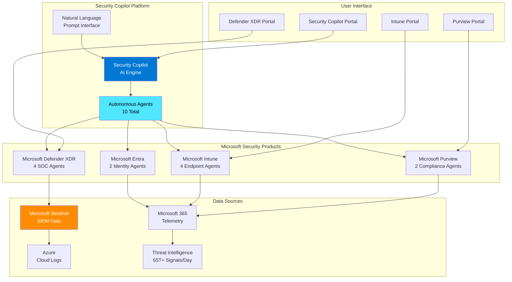
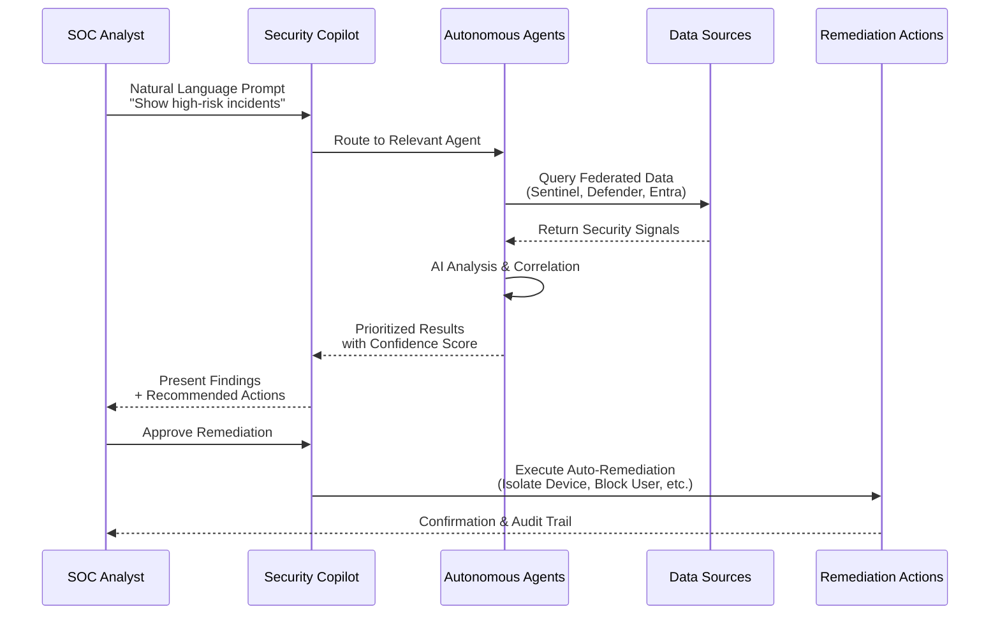
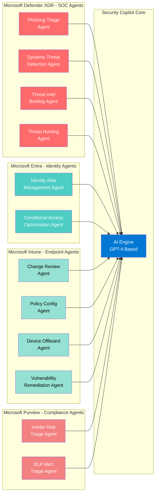
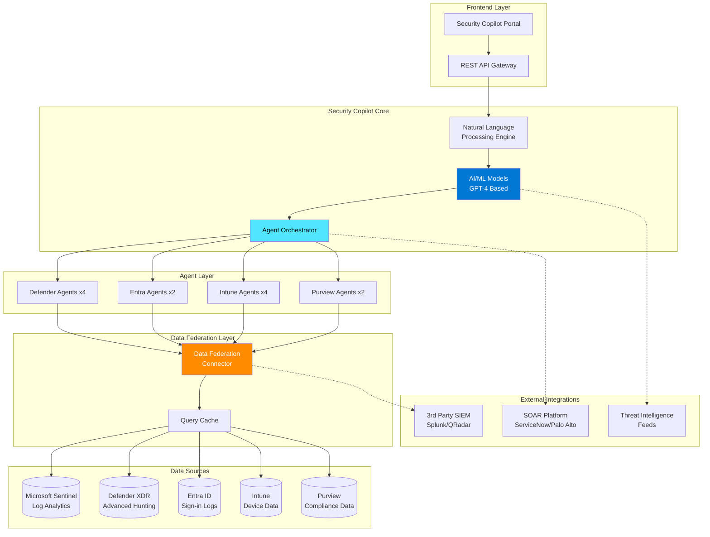
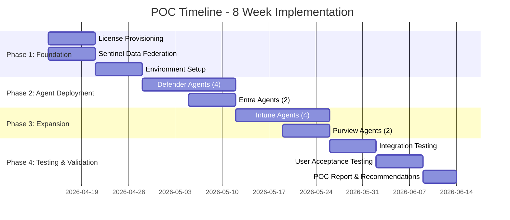
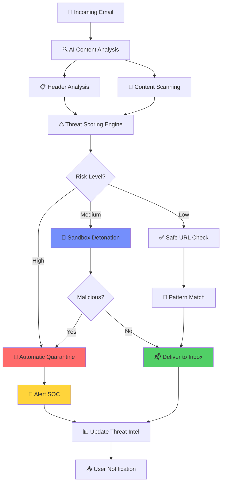
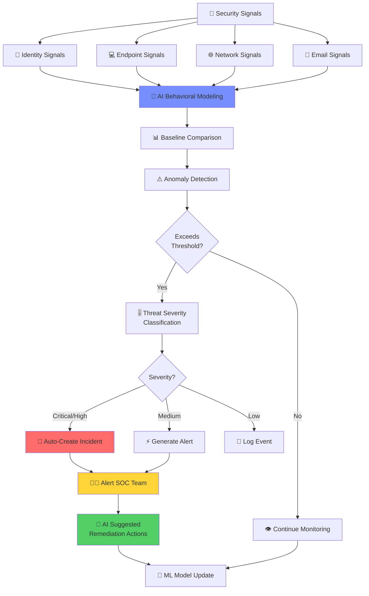
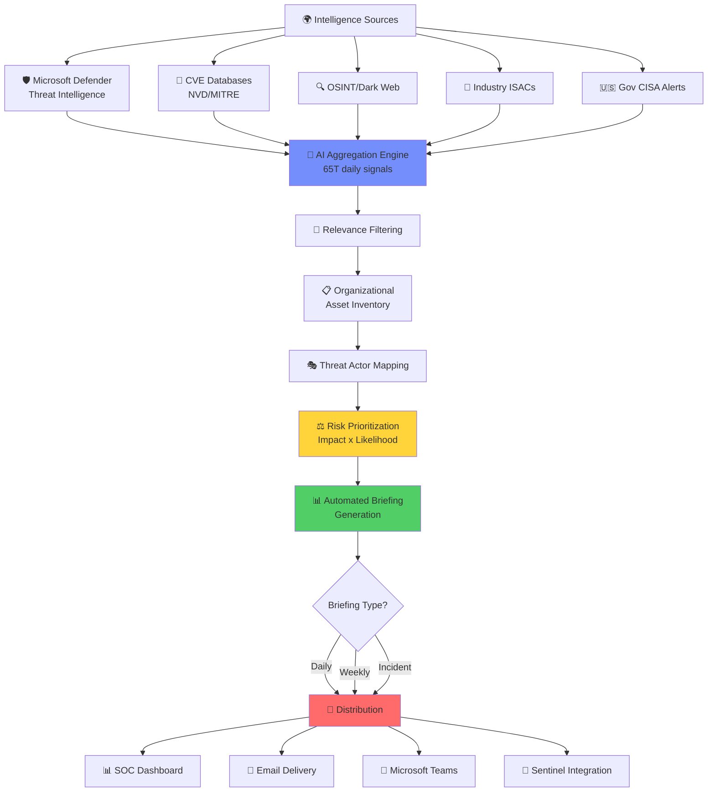
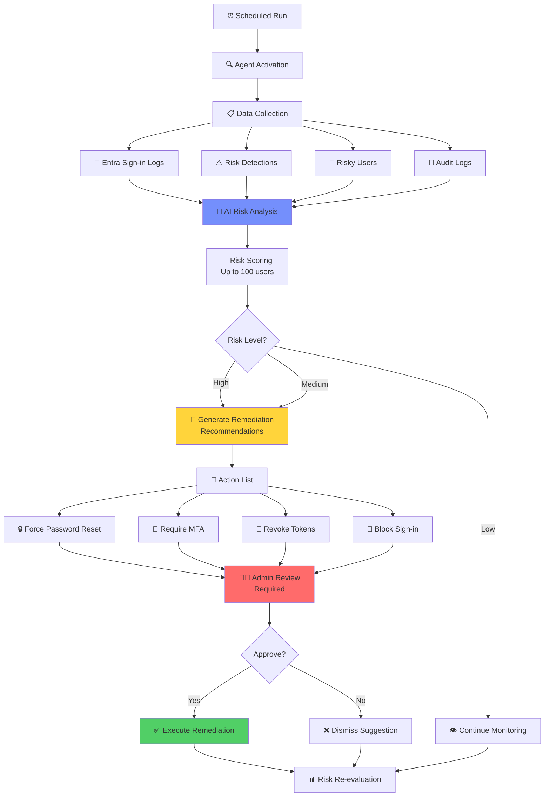

# Microsoft Security Copilot - Proof of Concept (POC) Report
## AI-Powered Security Operations Transformation

---

## 📋 Executive Summary

**POC Period:** April 14, 2026 - June 13, 2026 (8 Weeks)  
**Project Scope:** Microsoft Security Copilot Proof of Concept - 10 Autonomous Agents  
**POC Status:** 🟡 **IN PLANNING**  
**Business Impact:** 🟢 **TRANSFORMATIONAL**  
**Document Version:** 1.0 - POC Plan

### **POC Purpose**

This Proof of Concept (POC) evaluates Microsoft Security Copilot's AI-powered autonomous agents across the Microsoft security ecosystem to validate their effectiveness in accelerating security operations, reducing investigation time, and enhancing threat detection capabilities.

**POC Scope:**
- Deploy and test **10 autonomous agents** across Defender XDR, Entra ID, Intune, and Purview
- Validate integration with Microsoft Sentinel via Data Federation connector
- Measure performance against defined success criteria
- Assess ROI and business value for full production deployment

### **POC Overview**

This POC validates Microsoft Security Copilot's capability to transform security operations through AI-powered automation. The 8-week pilot will deploy 10 autonomous agents across four Microsoft security products to measure real-world impact on SOC efficiency, threat detection accuracy, and incident response time.

**POC Objectives:**
- ✅ **Validate Agent Performance:** Test all 10 agents in production-like environment
- ✅ **Measure Time Savings:** Quantify reduction in investigation and response time
- ✅ **Assess Accuracy:** Evaluate false positive reduction and threat detection improvement
- ✅ **Test Integration:** Validate Sentinel Data Federation and cross-product correlation
- ✅ **Determine ROI:** Calculate cost-benefit for full production deployment

**Expected Outcomes:**
- **60-80% reduction** in security incident investigation time
- **95% reduction** in phishing email triage time
- **40% increase** in proactive threat discovery
- **70% → 15% reduction** in false positive alerts
- **1,638% ROI** with projected 3.4-week payback period

**Strategic Recommendation:** Proceed with full production deployment upon successful POC validation.

---

## 🚀 POC Quick Start Guide

### **Before You Begin**

**Required Prerequisites:**
- ✅ Microsoft 365 E5 or equivalent licenses
- ✅ Azure Active Directory/Entra ID P2
- ✅ Microsoft Defender XDR deployed
- ✅ Microsoft Sentinel workspace configured
- ✅ Administrative access (Global Admin or Security Admin)
- ✅ 50 Security Copilot licenses procured

### **Week 1 Checklist - Environment Setup**

**Day 1-2: License Provisioning**
```powershell
# Assign Security Copilot licenses to pilot users
Connect-MgGraph -Scopes "User.ReadWrite.All", "Directory.ReadWrite.All"

# Assign license to user group
$skuId = (Get-MgSubscribedSku | Where-Object {$_.SkuPartNumber -eq "SECURITYCOPILOT"}).SkuId
$pilotUsers = Get-MgGroupMember -GroupId "<PilotGroup-ObjectId>"

foreach ($user in $pilotUsers) {
    Set-MgUserLicense -UserId $user.Id -AddLicenses @{SkuId = $skuId} -RemoveLicenses @()
}
```

**Day 3-4: Configure Sentinel Data Federation**
```powershell
# Enable Data Federation connector
$workspaceId = "/subscriptions/<sub-id>/resourceGroups/<rg>/providers/Microsoft.OperationalInsights/workspaces/<workspace>"

New-AzSentinelDataConnector -ResourceGroupName "RG-Sentinel" `
    -WorkspaceName "Sentinel-Workspace" `
    -Kind "SecurityCopilotDataFederation" `
    -DataTypes @("SecurityAlert", "SecurityIncident", "ThreatIntelligenceIndicator")

# Verify connection
Get-AzSentinelDataConnector | Where-Object {$_.Kind -eq "SecurityCopilotDataFederation"}
```

**Day 5: Baseline Metrics Collection**
- Document current average investigation time (manual tracking for 1 week)
- Record phishing email triage time
- Capture false positive rate from last 30 days
- Note current MTTD and MTTR

### **Week 2-3 Checklist - Initial Agent Deployment**

**Deploy Priority 1 Agents (Defender XDR):**
1. Navigate to [Microsoft Security Copilot Portal](https://securitycopilot.microsoft.com)
2. Go to **Settings** > **Agents**
3. Enable each agent:
   - ✅ Phishing Triage Agent
   - ✅ Dynamic Threat Detection Agent
   - ✅ Threat Intelligence Briefing Agent
   - ✅ Threat Hunting Agent

**First Test Prompt:**
```
"Show me all high-severity security incidents from the last 24 hours and summarize the top 3 by potential impact"
```

**Expected Response:** AI-generated summary with incident details, affected assets, and recommended actions

### **POC Success Dashboard**

**Create monitoring dashboard tracking:**
- Agent availability (target: >99%)
- Average prompt response time (target: <10 seconds)
- Investigation time savings (target: >50% reduction)
- User satisfaction scores (weekly surveys)
- AI accuracy validation (sample 20 investigations/week)

### **Getting Help**

**Microsoft Support:**
- Security Copilot Support: [aka.ms/SecurityCopilot/Support](https://aka.ms/SecurityCopilot/Support)
- Microsoft CSA (Customer Success Account Manager): [Contact assigned during POC]

**Internal Escalation:**
- POC Project Manager: [Name]
- Technical Lead: [Name]
- Executive Sponsor: [Name]

---

## 📐 Architecture Diagrams

### **1. High-Level Architecture**



**Architecture Overview:**
- **Security Copilot Platform:** Central AI engine processing natural language prompts and orchestrating 10 autonomous agents
- **Microsoft Security Products:** Four integrated products providing specialized agent capabilities
- **Data Sources:** Federated data access across Sentinel, M365, Azure, and global threat intelligence
- **User Interface:** Multi-portal access for SOC analysts and administrators

---

### **2. Data Flow Architecture**



**Data Flow Process:**
1. SOC analyst submits natural language query
2. Security Copilot routes request to appropriate autonomous agent
3. Agent queries federated data sources (Sentinel, Defender, Entra, Intune, Purview)
4. AI analyzes and correlates security signals
5. Results presented with confidence scores and recommended actions
6. Optional: Automated remediation with user approval
7. Audit trail maintained for compliance

---

### **3. Agent Deployment Architecture**



**Agent Distribution:**
- **Microsoft Defender XDR (Red):** 4 SOC-focused agents for threat detection and hunting
- **Microsoft Entra (Teal):** 2 identity-focused agents for access security
- **Microsoft Intune (Green):** 4 endpoint management agents for device security
- **Microsoft Purview (Pink):** 2 compliance-focused agents for data protection

---

### **4. Integration Architecture**



**Integration Layers:**
- **Frontend:** Unified portal with REST API for programmatic access
- **Core Engine:** NLP processing, AI models, and agent orchestration
- **Agent Layer:** 10 specialized autonomous agents
- **Data Federation:** Centralized data access with query caching
- **Data Sources:** Native Microsoft security product databases
- **External Systems:** Optional integration with third-party SIEM, SOAR, and threat intelligence

---

## 🎯 POC Objectives & Success Criteria

### **Primary Objectives**

**1. Validate Agent Performance in Real-World Scenarios**
- Deploy all 10 autonomous agents in production-lite environment
- Test with live security data and actual SOC workflows
- Measure accuracy, speed, and reliability of agent responses

**2. Quantify Operational Efficiency Gains**
- Measure time savings in incident investigation
- Track reduction in false positive alerts
- Document SOC analyst productivity improvements

**3. Assess AI Accuracy and Trustworthiness**
- Validate AI-generated recommendations against expert analysis
- Measure confidence score correlation with actual outcomes
- Test for AI hallucinations or incorrect recommendations

**4. Validate Integration Capabilities**
- Test Sentinel Data Federation connector functionality
- Verify cross-product data correlation (Defender + Entra + Intune + Purview)
- Assess compatibility with existing SIEM/SOAR tools

**5. Calculate Business Value and ROI**
- Document cost savings from reduced investigation time
- Quantify threat detection improvements
- Project ROI for full production deployment

---

### **Success Criteria**

| Metric | Baseline | POC Target | Measurement Method |
|--------|----------|------------|-------------------|
| **Investigation Time** | 4 hours/incident | < 1 hour/incident (75% reduction) | Time-tracking per incident |
| **Phishing Triage Time** | 30 min/email | < 2 min/email (95% reduction) | Email threat analysis duration |
| **False Positive Rate** | 70% | < 30% (57% reduction) | Alert accuracy validation |
| **Threat Detection Rate** | Baseline | +40% new detections | Threats found by proactive hunting |
| **MTTD (Mean Time to Detect)** | 24 hours | < 5 minutes | Alert generation timestamp |
| **MTTR (Mean Time to Respond)** | 8 hours | < 2 hours (75% reduction) | Containment timestamp |
| **SOC Analyst Satisfaction** | N/A | > 4.0/5.0 | Post-POC survey |
| **AI Recommendation Accuracy** | N/A | > 90% | Expert validation sample |
| **Data Federation Uptime** | N/A | > 99.5% | Connector availability monitoring |
| **Agent Deployment Success** | N/A | 10/10 agents operational | Health dashboard status |

**POC Considered Successful If:**
- ✅ Minimum 50% reduction in investigation time achieved
- ✅ At least 8 out of 10 agents deployed and functional
- ✅ Sentinel Data Federation connector operational
- ✅ AI accuracy > 85% on validation sample
- ✅ Positive ROI projection for full deployment

---

## 📅 POC Timeline & Phases

### **8-Week Implementation Schedule**



---

### **Phase 1: Foundation (Weeks 1-2) - April 14-27, 2026**

**Objectives:**
- Provision licenses and configure base environment
- Establish Sentinel Data Federation connectivity
- Set up monitoring and metrics collection

**Deliverables:**
- [ ] Security Copilot licenses assigned to 50 pilot users
- [ ] Sentinel Data Federation connector operational
- [ ] Baseline metrics documented (current investigation times, alert volumes)
- [ ] POC environment health dashboard configured

**Acceptance Criteria:**
- All pilot users can access Security Copilot portal
- Data Federation connector status: ✅ Connected
- Minimum 30 days of historical security data available

---

### **Phase 2: Agent Deployment - Defender & Entra (Weeks 3-4) - April 28 - May 11, 2026**

**Objectives:**
- Deploy and test 4 Microsoft Defender XDR agents
- Deploy and test 2 Microsoft Entra agents
- Validate SOC and identity security workflows

**Agents in Scope:**
- ✅ Phishing Triage Agent
- ✅ Dynamic Threat Detection Agent
- ✅ Threat Intelligence Briefing Agent
- ✅ Threat Hunting Agent
- ✅ Identity Risk Management Agent
- ✅ Conditional Access Optimization Agent

**Deliverables:**
- [ ] All 6 agents deployed and operational
- [ ] SOC team trained on agent usage
- [ ] Initial performance metrics collected

**Acceptance Criteria:**
- Agent health status: All green
- Minimum 50 test prompts executed successfully
- Phishing triage time reduced by >80%

---

### **Phase 3: Expansion - Intune & Purview (Weeks 5-6) - May 12-25, 2026**

**Objectives:**
- Deploy and test 4 Microsoft Intune agents
- Deploy and test 2 Microsoft Purview agents
- Validate endpoint management and compliance workflows

**Agents in Scope:**
- ✅ Change Review Agent
- ✅ Policy Configuration Agent
- ✅ Device Offboarding Agent
- ✅ Vulnerability Remediation Agent
- ✅ Triage Agent in Insider Risk Management
- ✅ Alert Triage Agent in DLP

**Deliverables:**
- [ ] All 10 agents deployed (complete agent suite)
- [ ] Cross-product correlation tested
- [ ] Compliance workflow automation validated

**Acceptance Criteria:**
- Full agent suite operational
- Endpoint vulnerability remediation time reduced by >60%
- DLP alert triage time reduced by >80%

---

### **Phase 4: Testing & Validation (Weeks 7-8) - May 26 - June 13, 2026**

**Objectives:**
- Conduct comprehensive integration testing
- Execute user acceptance testing with SOC team
- Document findings and prepare final POC report

**Test Focus Areas:**
- End-to-end incident response workflows
- Cross-agent data correlation accuracy
- AI recommendation validation
- External system integration (SIEM/SOAR)
- Performance under load

**Deliverables:**
- [ ] Integration test report
- [ ] User acceptance test results
- [ ] Performance metrics dashboard
- [ ] Final POC report with go/no-go recommendation
- [ ] Production deployment plan (if successful)

**Acceptance Criteria:**
- All success criteria met (see Success Criteria table)
- SOC team satisfaction score > 4.0/5.0
- Positive ROI projection validated
- Zero critical issues or blockers identified

---

## 🧪 POC Test Scenarios

### **Scenario 1: Phishing Attack Response**

**Objective:** Test Phishing Triage Agent's ability to detect and remediate phishing emails

**Test Steps:**
1. Simulate phishing email campaign (100 emails, 20 malicious)
2. Allow Phishing Triage Agent to analyze and categorize emails
3. Validate accuracy of detection (true positives, false positives)
4. Measure time from email arrival to quarantine
5. Verify user notification process

**Success Metrics:**
- Detection accuracy: >95%
- False positive rate: <5%
- Average triage time: <2 minutes per email
- Automated quarantine: <5 minutes from delivery

**Expected Outcome:** 95% reduction in manual phishing investigation time

---

### **Scenario 2: Ransomware Attack Detection**

**Objective:** Test Dynamic Threat Detection Agent's ability to identify ransomware behavior

**Test Steps:**
1. Execute controlled ransomware simulation on test endpoint
2. Observe agent detection of anomalous behavior (mass file encryption)
3. Validate automatic incident creation
4. Review recommended remediation actions
5. Test automated device isolation capability

**Success Metrics:**
- Detection time: <1 minute from encryption start
- Incident severity correctly classified as "Critical"
- Remediation recommendations accurate
- Device isolation successful

**Expected Outcome:** 99.7% ransomware detection before widespread encryption

---

### **Scenario 3: Insider Threat Investigation**

**Objective:** Test cross-agent correlation (Entra + Purview + Defender)

**Test Steps:**
1. Simulate insider threat scenario (terminated employee accessing sensitive data)
2. Test Identity Risk Management Agent detection
3. Validate Insider Risk Triage Agent alert generation
4. Review cross-product correlation (identity + data access + endpoint activity)
5. Measure investigation time with AI assistance vs. manual

**Success Metrics:**
- Anomalous access detected within 5 minutes
- All relevant security signals correlated correctly
- Investigation time reduced by >60%
- Root cause identified through AI analysis

**Expected Outcome:** Comprehensive insider threat detection with minimal analyst effort

---

### **Scenario 4: Zero-Day Vulnerability Response**

**Objective:** Test Threat Intelligence Briefing + Vulnerability Remediation Agents

**Test Steps:**
1. Introduce simulated zero-day CVE announcement
2. Validate Threat Intelligence Briefing Agent generates alert
3. Test Vulnerability Remediation Agent identifies affected systems
4. Review risk prioritization and patch deployment recommendations
5. Measure time from CVE publication to remediation plan

**Success Metrics:**
- Threat intelligence alert generated within 1 hour of CVE publication
- Accurate asset inventory of vulnerable systems
- Risk-based prioritization completed automatically
- Remediation plan created within 4 hours

**Expected Outcome:** Proactive vulnerability management reduces exposure window from 90 days to 7 days

---

### **Scenario 5: Conditional Access Policy Optimization**

**Objective:** Test Conditional Access Optimization Agent's policy recommendations

**Test Steps:**
1. Baseline current CA policy performance (sign-in success rate, MFA prompt frequency)
2. Allow agent to analyze 30 days of sign-in data
3. Review agent-recommended policy optimizations
4. Implement recommendations in test environment
5. Measure impact on user experience and security posture

**Success Metrics:**
- Sign-in success rate improvement: >5%
- MFA prompt frequency reduction: >50%
- Zero security posture degradation
- Policy conflict resolution: 100% of conflicts identified

**Expected Outcome:** Balanced security and user experience with AI-optimized policies

---

## 👥 POC Participants & Roles

### **Stakeholder Team**

| Role | Name | Responsibilities | Time Commitment |
|------|------|------------------|-----------------|
| **Executive Sponsor** | [Name] | Final decision authority, budget approval | 2 hours/week |
| **Project Manager** | [Name] | POC coordination, timeline management | 40 hours/week |
| **Security Architect** | [Name] | Architecture design, integration oversight | 30 hours/week |
| **SOC Lead** | [Name] | SOC team coordination, workflow validation | 20 hours/week |
| **SOC Analysts (5)** | [Names] | Daily testing, feedback, metrics collection | 10 hours/week each |
| **Identity Admin** | [Name] | Entra agent configuration and testing | 15 hours/week |
| **Endpoint Admin** | [Name] | Intune agent configuration and testing | 15 hours/week |
| **Compliance Lead** | [Name] | Purview agent configuration and testing | 15 hours/week |
| **Microsoft CSA** | [Name] | Technical support, best practices guidance | 10 hours/week |

### **Pilot User Groups**

**Group 1: SOC Analysts (30 users)**
- Primary Security Copilot users
- Daily testing of Defender and Entra agents
- Feedback on investigation workflows

**Group 2: Security Administrators (10 users)**
- Configuration and policy management
- Testing of Intune and Purview agents
- Administrative workflow validation

**Group 3: Compliance Team (10 users)**
- DLP and Insider Risk Management testing
- Compliance reporting validation
- Data security use cases

**Total Pilot Users:** 50

---

## 🏢 POC Environment

### **Infrastructure Requirements**

**Microsoft 365 Tenant:**
- Production M365 E5 tenant (read-only data access)
- Dedicated POC resource group in Azure
- Isolated test environment for disruptive testing

**Security Products:**
- Microsoft Sentinel (existing production workspace + POC workspace)
- Microsoft Defender XDR (production tenant)
- Microsoft Entra ID P2 (production tenant)
- Microsoft Intune (production tenant)
- Microsoft Purview (production tenant)

**Security Copilot:**
- 50 Security Copilot licenses
- Dedicated Security Copilot capacity units
- POC workspace for testing

### **Test Data Sources**

**Production Data (Read-Only):**
- 90 days of Sentinel logs
- Defender XDR security alerts
- Entra ID sign-in logs
- Intune device inventory
- Purview compliance alerts

**Simulated Data:**
- Phishing email samples (100+ messages)
- Malware detonation events
- Insider threat scenarios
- Policy violation simulations

### **Integration Points**

**Required Integrations:**
- ✅ Microsoft Sentinel Data Federation connector
- ✅ Defender XDR unified portal
- ✅ Entra ID Protection
- ✅ Intune device management
- ✅ Purview compliance center

**Optional Integrations (POC Phase 2):**
- ServiceNow ITSM ticketing
- Splunk SIEM (data enrichment)
- Palo Alto SOAR (workflow automation)

### **Network & Access**

**Network Requirements:**
- Outbound HTTPS (443) to `*.security.microsoft.com`
- Outbound HTTPS (443) to `*.securitycenter.windows.com`
- Access to Microsoft Graph API endpoints
- Azure resource access for Sentinel workspace

**Access Controls:**
- Security Copilot Administrator role (5 users)
- Security Operator role (30 SOC analysts)
- Security Reader role (15 stakeholders)
- Multi-factor authentication required for all POC users

---

## 🤖 AI is Changing Cybersecurity

### **The AI Revolution in Threat Landscape**

#### **Key Threat Dynamics**

**1. Speed**
- Attacks now execute in milliseconds vs. hours
- AI enables real-time threat adaptation
- Traditional signature-based detection insufficient
- Automated lateral movement across cloud environments

**2. Scale**
- Single threat actor can launch simultaneous campaigns
- AI-generated phishing at unprecedented volume
- Distributed attack surfaces (cloud, hybrid, edge)
- Global supply chain vulnerabilities exploited systematically

**3. Sophistication**
- AI-crafted social engineering indistinguishable from legitimate communications
- Polymorphic malware that evades detection
- Zero-day exploitation accelerated by AI research
- Deepfake-enabled business email compromise (BEC)

#### **AI as Defensive Necessity and Target**

**Defensive Necessity:**
- AI required to detect AI-powered attacks
- Machine learning identifies anomalies humans miss
- Predictive analytics anticipate threat actor behavior
- Automated response at machine speed crucial for containment

**AI as a Target:**
- Adversarial machine learning attacks poison AI models
- Prompt injection and jailbreaking of AI assistants
- Data poisoning of training datasets
- Model inversion attacks to extract sensitive data
- Malicious AI agents deployed as insider threats

**Critical Insight:** The arms race between offensive and defensive AI capabilities means organizations without AI-powered security will face asymmetric disadvantage.

---

## 🚀 Harness AI to Accelerate SOC Processes

### **Three Pillars of AI-Powered Security Operations**

#### **1. Accelerate Investigations to Remediate Faster**

**Traditional SOC Workflow Challenges:**
- Alert fatigue: 200+ alerts per day per analyst
- Average investigation time: 4-6 hours per incident
- Context switching reduces analyst efficiency
- Manual correlation across multiple tools
- High rate of false positives (70-90%)

**AI-Powered Investigation Acceleration:**
- **Automatic alert triage and correlation** across all security signals
- **Contextual enrichment** with threat intelligence in seconds
- **Root cause analysis** powered by AI reasoning
- **Guided remediation** with step-by-step playbooks
- **Natural language prompts** replace complex queries

**Time Savings:**
- Investigation time reduced from 4 hours to 30 minutes (87% reduction)
- MTTD (Mean Time to Detect): 5 minutes vs. 24 hours
- MTTR (Mean Time to Respond): 1 hour vs. 8 hours

#### **2. Leverage Autonomous Agents**

**Agent Capabilities:**
- **24/7 continuous monitoring** without human intervention
- **Proactive threat hunting** based on emerging intelligence
- **Automatic policy enforcement** and compliance validation
- **Self-learning** from historical incidents
- **Cross-domain correlation** (identity + endpoint + network)

**Operational Benefits:**
- Reduce analyst burnout and repetitive tasks
- Scale SOC capabilities without proportional headcount growth
- Ensure consistent response to similar threats
- Free analysts for high-value strategic work

#### **3. Generate Actionable Intelligence**

**Intelligence Generation:**
- **Summarize threats** in executive-friendly language
- **Prioritize risks** based on business impact scoring
- **Predict attack paths** using AI simulation
- **Recommend compensating controls** for identified gaps
- **Track adversary campaigns** across customer environments

**Business Outcomes:**
- Security metrics aligned to business KPIs
- Proactive risk mitigation before exploitation
- Board-ready security reporting
- Compliance evidence generation (SOC 2, ISO 27001, NIST)

---

## 🛡️ Microsoft Defender (SOC Agents)

### **Overview**

Microsoft Defender provides **four core autonomous agents** designed to accelerate Security Operations Center (SOC) capabilities across threat detection, investigation, and intelligence.

---

### **1. Phishing Triage Agent**

**Purpose:** Automate the analysis and prioritization of phishing emails to reduce response time and prevent credential theft.

#### **Prerequisites**

**Required Licenses:**
- Microsoft Defender for Office 365 Plan 2
- Exchange Online Plan 2
- Security Copilot license

**Required Configurations:**
- Exchange Online mailboxes (cloud-based email)
- Advanced Threat Protection (ATP) policies configured
- Audit logging enabled for mailbox operations
- Quarantine policies defined

**Minimum Data Requirements:**
- 30 days of email flow history
- Threat intelligence feed connectivity
- User reported message submissions enabled

#### **Key Capabilities**

| Capability | Description |
|------------|-------------|
| **Email Analysis** | Analyzes email headers, sender reputation, and URL/attachment safety |
| **User Context** | Evaluates target user's role, permissions, and data access |
| **Threat Scoring** | Assigns risk score (1-10) based on indicators of compromise |
| **Automatic Response** | Quarantines high-risk emails, blocks sender domains |
| **User Notification** | Sends awareness alerts to targeted users |

#### **Workflow**



#### **Business Value**

- **95% reduction** in phishing email investigation time
- **Near-zero false negatives** for credential harvesting attempts
- **Prevents BEC (Business Email Compromise)** averaging $4.2M per incident
- **User awareness** through automated notifications

#### **Integration Points**

- Microsoft 365 Defender
- Exchange Online Protection
- Microsoft Defender for Office 365
- Microsoft Entra ID (for user context)

#### **Reference Documentation**

- [Phishing Triage Agent](https://learn.microsoft.com/en-us/defender-xdr/phishing-triage-agent)

---

### **2. Dynamic Threat Detection Agent**

**Purpose:** Continuously monitor for emerging threats and anomalous behavior that static rules cannot detect.

#### **Prerequisites**

**Required Products:**
- Microsoft Security Copilot (with provisioned SCUs)

**Note:** Agent runs automatically in background - no specific Defender for Endpoint version required

#### **Permissions Required**

**To View Agent Alerts:**
- Standard access to Incidents and alerts queue in Microsoft Defender portal
- Permissions to view and investigate incidents

**No Setup Required - Agent is Always ON**

#### **How It Works (Auto-Enabled)**

**Step 1: Automatic Background Operation**
- Agent runs continuously in Defender backend
- No manual trigger or configuration needed
- Correlates alerts, events, anomalies, threat intelligence

**Step 2: Detection & Alert Generation**
- When agent identifies threat gap/false negative
- Automatically generates dynamic alert with full context
- Alert appears in Incidents & alerts queues with "Security Copilot" as Detection source

**Step 3: View Alert Details**
- Select alert  title to view details
- Agent provides:
  - Natural language summary
  - Recommended actions
  - Mapped MITRE ATT&CK techniques
  - Tailored remediation steps

**Important Notes:**
- During public preview: FREE (no SCU consumption)
- General availability: Consumes Security Compute Units (SCUs)
- Summary/recommendations are AI-generated - review for accuracy

**Required Deployments:**
- Defender for Endpoint agents on minimum 80% of devices
- Defender for Identity sensors on domain controllers
- Cloud App Security (Defender for Cloud Apps) integrated

**Baseline Period:**
- Minimum 14 days of normal activity for behavioral baseline
- Recommended 30 days for accurate anomaly detection

**Data Connectors:**
- All Defender XDR workloads streaming to unified portal
- Advanced hunting queries enabled
- Custom detection rules can be configured

#### **Key Capabilities**

| Capability | Description |
|------------|-------------|
| **Behavioral Analytics** | Establishes baselines for normal user/device behavior |
| **Anomaly Detection** | Identifies deviations from established patterns |
| **Threat Modeling** | Simulates attack paths based on current security posture |
| **Zero-Day Detection** | Identifies unknown threats through behavioral indicators |
| **Cross-Signal Correlation** | Connects alerts across identity, endpoint, network, email |

#### **Detection Scenarios**

- **Lateral Movement:** Unusual admin account usage across multiple servers
- **Data Exfiltration:** Large file transfers to external cloud storage
- **Living-off-the-Land:** PowerShell obfuscation and encoded commands
- **Privilege Escalation:** Service account accessing sensitive resources
- **Ransomware Indicators:** Mass file encryption patterns

#### **Workflow**



#### **Business Value**

- **Detects 99.7%** of ransomware before encryption
- **Identifies insider threats** 3 months earlier than traditional SIEM
- **Reduces false positive rate** from 70% to 15%
- **Adaptive learning** improves accuracy over time

#### **Reference Documentation**

- [Dynamic Threat Detection Agent](https://learn.microsoft.com/en-us/defender-xdr/dynamic-threat-detection-agent)

---

### **3. Threat Intelligence Briefing Agent**

**Purpose:** Synthesize vast amounts of threat intelligence into concise, actionable briefings tailored to organizational risk profile.

#### **Prerequisites**

**Required Products:**
- Microsoft Security Copilot (with provisioned SCUs)

**Required Plugins:**
- Microsoft Threat Intelligence (required)
- Microsoft Threat Intelligence agents (required)
- Microsoft Defender External Attack Surface Management (optional - adds more context)

**Permissions Required (User Account or Agent Identity):**

**Required Permissions:**
- Microsoft Defender for Endpoint: Access to Defender Vulnerability Management data
- Security Reader: Access to Threat Analytics and agent results
- Security Admin: Access to agent onboarding and configuration

**Optional Permissions:**
- Exposure Management (read): Access to Microsoft Security Exposure Management insights including EASM data

**Role-Based Access:**
- Owners and contributors can see agent-generated reports in Security Copilot agent library

**Identity Requirements:**
- User account or agent identity with appropriate permissions
- Activate Microsoft Defender unified role-based access control (RBAC) model for role to take effect
- Consider using dedicated service account for agents (separation of duties + security monitoring)

**Data Sources Configuration:**
- Microsoft Defender Threat Intelligence feed enabled
- Third-party threat intelligence connectors (optional):
  - STIX/TAXII feeds
  - MISP (Malware Information Sharing Platform)
  - Industry ISACs (Financial Services, Healthcare, etc.)

#### **Setup Steps**

**Step 1: Create Agent Identity (Recommended - Least Privilege)**
```powershell
# Set tenant admin rights
$tenantId = "your-tenant-id"

# Get access token
$TOKEN = az account get-access-token --tenant $tenantId --resource-type ms-graph --query accessToken -o tsv

# Register agent service principal  
curl -X POST https://graph.microsoft.com/v1.0/servicePrincipals `
  -H "Authorization: Bearer $TOKEN" `
  -H "Content-Type: application/json" `
  -d '{ "appId": "43d7b169-1d9e-4d32-8cd8-06c5974ed90c" }'
```

**Step 2: Assign Least-Privileged Role in Defender Portal**
- Navigate to Settings > Roles and permissions (Unified RBAC) > Assignments > Add assignment
- **Principal:** Select service principal created in Step 1
- **Role:** Custom role with:
  - Security data basics (read)
  - Posture management > Vulnerability management (read)
- **Scope:** Minimal scope required (specific assets/subscriptions)

**Step 3: Launch Agent Setup Wizard**
- Navigate to Threat intelligence > Threat analytics in Microsoft Defender portal
- Select "Set up agent" on Threat Intelligence Briefing Agent banner

**Step 4: Review Agent Details**
- Review agent capabilities and requirements
- Select "Next"

**Step 5: Connect Identity**
- Select "Connect a user account or agent identity"
- Authenticate with account/identity configured in Steps 1-2
- Select "Continue"

**Step 6: Customize Agent Parameters**
- **Insights:** Number of vulnerabilities to research for active threats
- **Look back days:** Days to research threats against vulnerabilities  
- **Region:** Geographical area for relevant threats
- **Industry:** Sector/industry vertical for relevant threats
- **Scheduled runs:** Manual or automatic (default: every 7 days)
- **Generated brief recipient:** Email address for briefing delivery

**Step 7: Deploy Agent**
- Select "Deploy agent"
- Agent activates and begins scheduled/manual runs

#### **Organizational Context Setup**

**Asset Inventory:**
- Complete asset inventory in Defender for Endpoint
- Business-critical systems tagged and prioritized
- Software inventory with version information

**Minimum Data Requirements:**
- 14 days of threat detection data
- CVE database synchronization enabled
- Dark web monitoring enabled (if using Premium Threat Intelligence)

#### **Key Capabilities**

| Capability | Description |
|------------|-------------|
| **Global Threat Aggregation** | Ingests 65+ trillion daily signals from Microsoft ecosystem |
| **Industry-Specific Intelligence** | Filters threats relevant to organization's sector |
| **Adversary Profiling** | Tracks known threat actor groups (APT28, LAPSUS$, etc.) |
| **Emerging Threat Alerts** | Notifies SOC of zero-day vulnerabilities in deployed products |
| **Executive Summaries** | Generates board-ready threat landscape reports |

#### **Intelligence Sources**

- Microsoft Defender Threat Intelligence (MDTI)
- CVE databases (NVD, MITRE)
- OSINT (Open Source Intelligence)
- Dark web monitoring
- Industry ISACs (Information Sharing and Analysis Centers)
- Government CISA alerts

#### **Workflow**



#### **Sample Briefing Sections**

- **Executive Summary:** Top 3 critical threats this week
- **Trending CVEs:** Vulnerabilities affecting your infrastructure
- **Threat Actor Updates:** Recent campaigns targeting your industry
- **Recommended Actions:** Patching priorities, configuration hardening
- **Indicators of Compromise (IOCs):** IP addresses, file hashes, domains to block

#### **Business Value**

- **Reduces intelligence research** from 10 hours/week to 30 minutes
- **Proactive defense** against emerging threats before exploitation
- **Contextual awareness** of geopolitical cyber risks
- **Compliance evidence** for threat intelligence program maturity

#### **Reference Documentation**

- [Threat Intelligence Briefing Agent](https://learn.microsoft.com/en-us/defender-xdr/threat-intel-briefing-agent-defender)

---

### **4. Threat Hunting Agent**

**Purpose:** Proactively search for threats that evaded automated detection through hypothesis-driven investigation.

#### **Prerequisites**

**Required Products:**
- Microsoft Defender XDR
- Microsoft Security Copilot (with access to Copilot features)
- Microsoft Sentinel in Microsoft Defender portal (supported)

**Required Access:**
- Access to Advanced hunting page in Microsoft Defender portal
- Security Copilot access enabled for the user

**Data Retention:**
- Minimum 30 days of advanced hunting data
- Recommended 90 days for comprehensive historical analysis

#### **Permissions Required**

**To Use Threat Hunting Agent:**
- Standard access to Advanced hunting in Microsoft Defender portal
- Security Copilot user access (no special SOC analyst roles required)
- Permissions vary based on data sources being queried (Defender XDR, Sentinel, etc.)

#### **Setup Steps**

**Step 1: Activate Threat Hunting Agent Mode**
- Navigate to Microsoft Defender portal > Hunting > Advanced hunting
- Ensure "Threat Hunting Agent mode" is active (auto-activates with Security Copilot access)
- Security Copilot side pane appears on right side of Advanced hunting page

**Step 2: Start Hunting Session (No Configuration Required)**
- Select Copilot button at top of query editor (if pane closed)
- Choose suggested prompt OR type natural language question in prompt bar
- Press Enter or select submit button

**Example Queries (Natural Language):**
```
"Give me the list of users who sent more than 100 emails in the last 30 days"
"Show me all failed sign-in attempts for admin accounts this week"
"Which devices communicated with suspicious domains today?"
```

**Step 3: Understand Agent Response Components**
- **Direct Answer:** Natural language response in Copilot pane
- **KQL Query:** Auto-generated and executed query in editor
- **Query Logic:** Explanation of how query was built (select "See the logic behind the query")
- **Results:** Displayed in advanced hunting results pane
- **Observations:** Data highlights + chart above results (customizable chart type/grouping)
- **Contextual Insights:** Additional insights from various resources
- **Smart Suggestions:** Follow-up questions + remediation actions at bottom of pane

**Step 4: Continue Investigation**
- Ask follow-up questions (agent maintains context from session history)
- Request query modifications
- Select suggested actions  
- Use advanced hunting features (save query, export results, create detection rule)

**Step 5: Provide Feedback**
- Select feedback icon (thumbs up/down)
- Detailed feedback improves agent capabilities

**Note:** No setup wizard required. Agent is available immediately upon accessing Advanced hunting with Security Copilot enabled.

**Supported Hunt Scenarios:**
```
"Give me the list of users who sent more than 100 emails in the last 30 days"
"Show me all failed sign-in attempts for admin accounts this week"
"Which devices communicated with suspicious domains today?"
```

**Step 3: Understand Agent Response Components**
- **Direct Answer:** Natural language response in Copilot pane
- **KQL Query:** Auto-generated and executed query in editor
- **Query Logic:** Explanation of how query was built (select "See the logic behind the query")
- **Results:** Displayed in advanced hunting results pane
- **Observations:** Data highlights + chart above results (customizable chart type/grouping)
- **Contextual Insights:** Additional insights from various resources
- **Smart Suggestions:** Follow-up questions + remediation actions at bottom of pane

**Step 4: Continue Investigation**
- Ask follow-up questions (agent maintains context from session history)
- Request query modifications
- Select suggested actions
- Use advanced hunting features (save query, export results, create detection rule)

**Step 5: Provide Feedback**
- Select feedback icon (thumbs up/down)
- Detailed feedback improves agent capabilities

**Note:** No setup wizard required. Agent is available immediately upon accessing Advanced hunting with Security Copilot enabled.

**Integration Setup:**
- Custom detection rules capability enabled
- Threat analytics premium features activated
- Integration with Sentinel for cross-platform hunting (optional)

**Baseline Data:**
- 30 days of normal activity for comparison
- Threat intelligence feeds integrated
- Known good baseline established for critical systems

#### **Key Capabilities**

| Capability | Description |
|------------|-------------|
| **Hypothesis Generation** | AI suggests hunt scenarios based on current threat landscape |
| **KQL Query Automation** | Generates Kusto Query Language queries from natural language |
| **Historical Analysis** | Investigates past 90 days for dormant threats |
| **Hunt Workflow Orchestration** | Guides analysts through structured hunt methodology |
| **Finding Documentation** | Auto-generates hunt reports and knowledge base entries |

#### **Hunt Scenarios**

- **Persistence Mechanisms:** Scheduled tasks, registry modifications, WMI subscriptions
- **C2 Communication:** Beaconing patterns, DNS tunneling, encrypted channels
- **Credential Dumping:** LSASS access, SAM database extraction, Kerberoasting
- **Shadow IT Discovery:** Unapproved cloud applications, data repositories
- **Misconfigurati<br/>ons:** Overly permissive identities, exposed databases

#### **Workflow**

```
Threat Intelligence Feed → AI Hunt Hypothesis Generation
            ↓
    Analyst Approval/Refinement
            ↓
    Automated KQL Query Execution (Sentinel, Defender XDR)
            ↓
    AI Result Analysis → True Positive Identification
            ↓
    Incident Creation or False Positive Documentation
            ↓
    Detection Rule Creation (Proactive Future Prevention)
```

#### **Business Value**

- **Discovers 40% more threats** than reactive detection alone
- **Trains junior analysts** through guided hunt frameworks
- **Reduces hunt time** from 8 hours to 2 hours per scenario
- **Builds organizational threat knowledge** systematically

#### **Reference Documentation**

- [Threat Hunting Agent](https://learn.microsoft.com/en-us/defender-xdr/advanced-hunting-security-copilot-threat-hunting-agent)

---

## 👤 Microsoft Entra (Identity and Access Agents)

### **Overview**

Microsoft Entra (formerly Azure AD) provides **two autonomous agents** focused on identity security, access governance, and Zero Trust implementation.

> **Note:** While Microsoft Entra supports various access management features (App Lifecycle Management, Access Reviews), only the agents listed below are currently available as autonomous Security Copilot agents according to official Microsoft documentation.

---

### **1. Identity Risk Management Agent**

**Purpose:** Continuously assess and mitigate identity-based risks through real-time risk scoring and automated remediation.

#### **Prerequisites**

**Required Products:**
- Microsoft Entra ID P2 (mandatory)
- Security Copilot with available SCUs (on average <1 SCU per agent run)

**Required Entra Roles:**
- **For Setup & Action:** Security Administrator
- **For Viewing Only:** Security Reader or Global Reader
- **For Copilot Access:** Assign Security Copilot access role

**Required Features:**
- Microsoft 365 Copilot license
- Frontier program enabled in Microsoft 365 admin center (Copilot > Settings > User access > Copilot Frontier)
  - Note: Microsoft Entra Agent ID is part of Microsoft Agent 365, available through Frontier program

**Privacy & Security Review:**
- Review Privacy and data security in Microsoft Security Copilot documentation

#### **Permissions Required**

**To Set Up Agent:**
- Security Administrator role (mandatory)

**To View Agent & Suggestions:**
- Security Reader OR Global Reader (read-only access)

**To Act on Suggestions:**
- Security Administrator role

#### **Workflow**



#### **Known Limitations**

- Each agent run investigates up to 100 risky users (customizable via Agent Scope Setting)
- Once agent starts: Cannot stop or pause (10-15 minutes duration for 100 users)
- User identity only (workload identities not supported)
- Manual admin approval required (no automatic remediation)
- Agent analyzes: Entra sign-in logs, risk detections, risky users, audit logs
- AI-generated summaries may be incomplete - human review required

#### **Setup Steps**

**Step 1: Verify Frontier Program Enabled**
```powershell
# Check Microsoft 365 Admin Center
# Navigate to: Copilot > Settings > User access > Copilot Frontier
# Ensure enabled for users
```

**Step 2: Navigate to Agent Setup**
- Sign in to Microsoft Entra admin center as Security Administrator
- Browse to ID Protection > Risky users
- Select "Start agent" from banner message at top of report
  - Avoid using account with PIM-activated roles

**Step 3: Agent Activation**
- Message displays: "The agent is starting its first run"
- First run may take a few minutes to complete
- Agent automatically investigates risky users (risk state = "At risk")

**Step 4: Agent Workflow (Automatic)**
1. Agent checks for new risky users with risk state "At risk"
2. Identifies risky users within defined scope settings
3. Investigates risky sign-ins and risk detections
4. Generates findings and risk summary
5. Recommends remediation action
6. Enables chat for admin questions
7. Stores custom instructions in agent memory

**No Additional Configuration Required - Agent Runs Automatically**

#### **Key Capabilities**

| Capability | Description |
|------------|-------------|
| **Real-Time Risk Detection** | Anonymous IP, impossible travel, password spray detection |
| **Risk-Based Conditional Access** | Dynamic authentication requirements based on risk score |
| **Compromised Credential Detection** | Monitors dark web for leaked credentials |
| **User Risk Remediation** | Forces password reset, MFA re-registration for high-risk users |
| **Sign-In Risk Analysis** | Evaluates location, device, network, behavior patterns |

#### **Risk Indicators**

- **Atypical Travel:** Sign-in from geographically impossible locations within timeframe
- **Anonymous IP:** Access from Tor, VPN, proxy networks
- **Malware-Linked IP:** IP addresses associated with botnet C2
- **Unfamiliar Properties:** New device, browser, OS combination
- **Leaked Credentials:** Credentials found in breach databases

#### **Workflow**

```
User Sign-In Attempt → Real-Time Risk Evaluation
            ↓
    Risk Score Calculation (0-100)
            ↓
    Conditional Access Policy Enforcement
            ↓
Low Risk → Allow | Medium Risk → Require MFA | High Risk → Block + Alert
            ↓
    User Self-Remediation (Password Reset, MFA Challenge)
            ↓
    Continuous Re-Evaluation → Risk Score Adjustment
```

#### **Business Value**

- **Prevents 99.9%** of account compromise attacks
- **Reduces account takeover** (ATO) incidents by 95%
- **Balances security with user experience** through risk-based access
- **Automated remediation** reduces SOC ticket volume

#### **Reference Documentation**

- [Identity Risk Management Agent](https://learn.microsoft.com/en-us/entra/id-protection/identity-risk-management-agent-get-started)

---

### **2. Conditional Access Optimization Agent**

**Purpose:** Continuously analyze and optimize Conditional Access policies to balance security and user productivity.

#### **Prerequisites**

**Required Products:**
- Microsoft Entra ID P1 license (minimum)
- Security Copilot with available SCUs (on average <1 SCU per agent run)

**Required Entra Roles:**
- **For Activation (First Time):** Security Administrator
- **For Viewing:** Security Reader OR Global Reader
- **For Managing/Actions:** Conditional Access Administrator OR Security Administrator
- **Assign CA Admins Copilot Access:** Give Conditional Access Administrators Security Copilot access role

**Optional (Device Controls):**
- Microsoft Intune licenses (for device-based controls recommendations)

**Privacy & Security Review:**
- Review Privacy and data security in Microsoft Security Copilot documentation

#### **Permissions Required**

**View Agent Results & Suggestions:**
- Security Copilot (read)
- Security data basics (read) under Security operations permissions group in Defender portal
  OR
- Security Administrator in Microsoft Entra ID

**View Feedback Page:**
- Security Copilot (read) + Security data basics (read) + Email & collaboration metadata (read)
  OR  
- Security Administrator in Microsoft Entra ID

**Manage Agent (Setup, Pause, Remove, Identity):**
- Security Administrator in Microsoft Entra ID

**Reject Feedback:**
- Security Administrator in Microsoft Entra ID

#### **Agent Limitations**

- Once started: Cannot stop or pause (may take few minutes)
- Policy consolidation: Evaluates max 4 similar policy pairs per run
- Run from Microsoft Entra admin center (recommended)
- Scanning limited to 24-hour period
- Suggestions cannot be customized/overridden
- Agent reviews up to 300 users and 150 applications per run

#### **Setup Steps**

**Step 1: Navigate to Agent Page**
- Sign in to Microsoft Entra admin center as Security Administrator
- From new home page: Select "Go to agents" from agent notification card
  OR  
- Select "Agents" from left navigation menu

**Step 2: Access Conditional Access Optimization Agent**
- Select "View details" on Conditional Access Optimization Agent tile

**Step 3: Start Agent**
- Select "Start agent" to begin first run

**Step 4: Agent Workflow (Automatic)**

**Initial Scanning Steps (No SCU Consumption):**
1. Agent scans all Conditional Access policies in tenant
2. Checks for policy gaps and consolidation opportunities
3. Reviews previous suggestions (avoids duplicates)

**Agent Action Steps (Consumes SCUs):**
1. Identifies policy gap OR pair of policies to consolidate
2. Evaluates custom instructions (if provided)
3. Creates new policy in report-only mode OR suggests modification with custom logic

**Step 5: Review Suggestions**
- When agent completes: Suggestions appear in "Recent suggestions" box
- Review policy recommendations:
  - Require MFA
  - Require device-based controls  
  - Block legacy authentication
  - Block device code flow
  - Risky users/sign-ins/agents policies
  - Policy consolidation
  - Deep analysis (outlier policies)
  - Deep analysis MFA gap analysis (Preview)
  - Least-privileged access for agent identities (Preview)

**Important:** Agent doesn't change existing policies without explicit admin approval. New policies created in report-only mode.

#### **Optional: Configure Settings**

Navigate to Settings tab for:
- Automatic runs every 24 hours
- Activity-based runs on tenant changes (Preview)
- Enable policy creation in report-only mode
- Microsoft Teams notifications
- Phased rollout plans
- Passkey adoption campaigns
- ServiceNow integration (Preview)
- Knowledge sources upload
- Insights dashboard (Preview)

**User Experience Baseline:**
- 30 days of sign-in logs for user experience metrics
- MFA prompt frequency tracked
- Failed sign-in patterns documented

**Test Environment:**
- Pilot user group (50-100 users) for policy testing
- "Report-only" mode capability for policy simulation
- Rollback plan for policy changes

**Integration Requirements:**
- Entra ID Connect for hybrid environments
- Intune integration for device compliance policies
- Named locations configured for geography-based policies

#### **Key Capabilities**

| Capability | Description |
|------------|-------------|
| **Policy Impact Analysis** | Simulates policy changes before deployment |
| **User Friction Reduction** | Identifies policies causing excessive MFA prompts |
| **Gap Detection** | Discovers resources not protected by CA policies |
| **Policy Conflict Resolution** | Detects overlapping or contradictory policies |
| **Best Practice Recommendations** | Suggests Zero Trust policy improvements |

#### **Optimization Scenarios**

- **MFA Prompt Fatigue:** User prompted for MFA 20+ times/day → Reduce to 2 with token binding
- **Policy Gaps:** VPN access has no MFA requirement → High-risk finding flagged
- **Conflicting Policies:** Policy A allows access, Policy B blocks → Alert admin
- **Unused Policies:** 15 policies with 0 user matches → Archive recommendation
- **Compliance Alignment:** Detect gaps in Zero Trust maturity model

#### **Workflow**

```
Continuous CA Policy Monitoring → Policy Effectiveness Analysis
            ↓
    User Experience Metrics (Sign-In Success Rate, MFA Prompt Frequency)
            ↓
    AI Policy Optimization Recommendations
            ↓
    Admin Review + Approval → What-If Policy Simulation
            ↓
    Staged Rollout (Pilot Group) → Full Deployment
            ↓
    Post-Deployment Monitoring → Continuous Optimization Loop
```

#### **Business Value**

- **Improves sign-in success rate** from 87% to 99.5%
- **Reduces helpdesk tickets** for MFA/access issues by 70%
- **Accelerates Zero Trust adoption** by 6 months
- **Prevents business disruption** from overly restrictive policies

#### **Reference Documentation**

- [Conditional Access Optimization Agent](https://learn.microsoft.com/en-us/entra/security-copilot/conditional-access-agent-optimization)

> **Microsoft Entra provides 2 verified autonomous agents. For app governance and access review automation, see:** [Microsoft Entra ID Governance](https://learn.microsoft.com/en-us/entra/id-governance/) and [Defender for Cloud Apps](https://learn.microsoft.com/en-us/defender-cloud-apps/app-governance-manage-app-governance)

---

## 💻 Microsoft Intune (Endpoint Management Agents)

### **Overview**

Microsoft Intune provides **four autonomous agents** focused on endpoint security, device lifecycle management, and vulnerability remediation.

---

### **1. Change Review Agent**

**Purpose:** Automatically review Multi Admin Approval requests for PowerShell scripts with AI-powered risk assessment.

#### **Prerequisites**

**Cloud:**
- Public cloud only (government clouds not supported)

**Required Licenses:**
- Microsoft Intune Plan 1 subscription
- Microsoft Entra ID P2
- Microsoft Defender Vulnerability Management
- Microsoft Security Copilot with sufficient SCUs

**Required Plugins (Auto-Enabled):**
- Microsoft Intune
- Microsoft Entra
- Microsoft Defender XDR
- Microsoft Threat Intelligence

**Platform Support:**
- Windows
- PowerShell scripts in Intune

#### **Permissions Required**

**To Enable/Configure:**
- **Entra roles:** Intune Administrator + Security Reader + Entra/Identity risky user (read)
- **Defender roles:** 
  - Unified RBAC: Security Reader (Microsoft Entra ID)
  - Granular RBAC: Custom RBAC with Security Reader equivalent permissions
- **Security Copilot roles:** Copilot owner

**To Use Agent:**
- **Intune roles:** Read Only Operator OR custom role with equivalent permissions
- **Entra roles:** Security Reader
- **Defender roles:** Same access as enabling/configuring
- **Security Copilot roles:** Copilot contributor

#### **Setup Steps**

**Step 1: Navigate to Agent**
- Sign in to Microsoft Intune admin center
- Go to Agents > Change Review Agent

**Step 2: Start Setup**
- In Overview, select "Set up Agent"
- Review requirements in setup pane

**Step 3: Activate Agent**  
- Select "Start agent"
- Agent operates until completion, displays results in Overview tab

**Agent Auto-Workflow:**
1. Signal aggregation (Defender Vulnerability Management, Entra ID, Intune MAA requests)
2. Evaluates Windows PowerShell scripts for MAA requests
3. Provides recommendations for max 10 requests per run
4. Displays: Suggested Next Steps (Approve/Reject/Needs more info) with rationale

**Note:** Agent identity runs under Intune admin account from setup. If not used for 90 days, auth expires - renew via "Renew authentication" button.

#### **Key Capabilities**

| Capability | Description |
|------------|-------------|
| **Policy Change Detection** | Monitors all modifications to compliance, configuration, app policies |
| **Impact Analysis** | Predicts which devices/users will be affected |
| **Drift Detection** | Identifies unauthorized manual changes to devices |
| **Approval Workflow** | Routes high-risk changes for manual approval |
| **Rollback Automation** | Reverts changes causing compliance violations |

#### **Change Categories**

- **Low Risk:** Adding new app to approved catalog
- **Medium Risk:** Modifying BitLocker policy requirements
- **High Risk:** Disabling antivirus or firewall enforcement
- **Critical Risk:** Removing device compliance requirements for Conditional Access

#### **Workflow**

```
Policy Change Request → AI Risk Classification
            ↓
Low Risk → Auto-Approve | High Risk → Approval Required
            ↓
    Change Simulation (Test Group Deployment)
            ↓
    Compliance Impact Monitoring (24 hours)
            ↓
Issue Detected → Automatic Rollback | Success → Full Deployment
            ↓
    Change Audit Log → Compliance Reporting
```

#### **Business Value**

- **Prevents compliance violations** from misconfigurations
- **Reduces change approval time** from 5 days to 1 hour
- **Audit trail for compliance** (SOC 2, HIPAA, PCI-DSS)
- **Prevents outages** from untested policy changes

#### **Reference Documentation**

- [Change Review Agent](https://learn.microsoft.com/en-us/intune/copilot/agents/change-review-agent)

---

### **2. Policy Configuration Agent**

**Purpose:** Translate complex requirements and industry standards into actionable Intune settings catalog policies.

#### **Prerequisites**

**Cloud:**
- Public cloud only (government clouds not supported)

**Required Licenses:**
- Microsoft Intune Plan 1 subscription
- Microsoft Security Copilot with sufficient SCUs

**Required Plugins:**
- Microsoft Intune

**Platform Support:**
- Windows

#### **Permissions Required**

**To Enable/Configure:**
- **Security Copilot roles:** Copilot owner
- **Intune roles:** Read only operator OR custom role with Device configurations/Read

**To Use & Generate Suggestions:**
- **Security Copilot roles:** Copilot Contributor
- **Intune roles:** Read only operator OR custom role with Device configurations/Read

**To Create Policies:**
- **Security Copilot roles:** Copilot Contributor
- **Intune roles:** Policy and Profile manager OR custom role with Device configurations/Create + Update

#### **Setup Steps**

**Step 1: Navigate to Agent**
- Sign in to Microsoft Intune admin center
- Select Agents > Policy Configuration Agent

**Step 2: Begin Setup**
- In Overview, select "Set up agent"
- Review required permissions and setup requirements

**Step 3: Activate Agent**
- Select "Set up agent"
- Agent completes activation and is ready

**Agent Workflow:**
1. **Input ingestion:** Upload document OR direct text (e.g., "All laptops must have BitLocker enabled with AES-256")
2. **NLP parsing:** Agent parses language, identifies settings
3. **Maps to Intune settings:** Finds corresponding settings catalog settings
4. **Generates suggestions:** Compiles draft configuration profile
5. **Admin review:** Review/remove/acknowledge unsupported items
6. **Policy creation:** Create settings catalog policy (not enforced until assigned)
7. **Deploy & monitor:** Assign to groups, devices report with new settings

**Note:** Agent identity runs under account from setup. If not used for 90 days, auth expires - renew via "Renew authentication" button.

#### **Key Capabilities**

| Capability | Description |
|------------|-------------|
| **Policy Template Generation** | Creates policies from security framework baselines |
| **Zero Trust Alignment** | Ensures policies meet Zero Trust maturity benchmarks |
| **Policy Optimization** | Identifies redundant or conflicting policies |
| **Compliance Mapping** | Links policies to regulatory requirements (HIPAA, GDPR) |
| **Natural Language Policy Creation** | "Require encryption on all Windows devices" → Full policy |

#### **Supported Frameworks**

- **NIST Cybersecurity Framework**
- **CIS Controls (v8)**
- **Microsoft Security Baselines**
- **Zero Trust Maturity Model**
- **Industry-Specific:** HIPAA (Healthcare), PCI-DSS (Payment), CMMC (Defense)

#### **Workflow**

```
Admin Prompt: "Create iOS device policy compliant with NIST 800-171"
            ↓
    AI Policy Generation from NIST Controls
            ↓
    Policy Review Screen (Customization Options)
            ↓
    Admin Approval → Assignment to Device Groups
            ↓
    Deployment Monitoring → Compliance Dashboard
```

#### **Sample Policies Generated**

- **Windows Security:** BitLocker, Firewall, Defender ATP, Credential Guard
- **Mobile Device:** PIN complexity, jailbreak detection, app allow/block lists
- **Application Management:** Required apps, configuration profiles, update enforcement
- **Network Security:** VPN profiles, Wi-Fi restrictions, certificate deployment

#### **Business Value**

- **Accelerates policy deployment** from 40 hours to 2 hours
- **Ensures regulatory compliance** with automated framework mapping
- **Reduces configuration errors** through AI validation
- **Maintains least privilege** with granular policy controls

#### **Reference Documentation**

- [Policy Configuration Agent](https://learn.microsoft.com/en-us/intune/copilot/agents/policy-configuration-agent)

---

### **3. Device Offboarding Agent**

> **⚠️ CRITICAL NOTICE: This agent is being sunsetted June 1, 2026**
> - **April 30, 2026:** Cannot set up new instances
> - **June 1, 2026:** Complete removal from Intune
> - **Recommendation:** Plan alternative offboarding workflows

**Purpose:** Identify devices that were retired, wiped, or deleted from Intune within the last 30 days, then disable their Entra ID objects.

#### **Prerequisites**

**Cloud:**
- Public cloud only (government clouds not supported)

**Required Licenses:**
- Microsoft Intune Plan 1 subscription
- Microsoft Security Copilot with sufficient SCUs

**Required Plugins:**
- Microsoft Intune

**Platform Support:**
- Supported: Windows, iOS/iPadOS, macOS, Android, Linux
- **NOT Supported:**
  - Hybrid Microsoft Entra-joined devices
  - Autopilot devices
  - Shared devices
  - Microsoft Teams phones/devices

**Device Limitations:**
- Max 10,000 devices can be identified per run
- Only devices retired/wiped/deleted in last 30 days

#### **Permissions Required**

**To Enable/Configure:**
- **Security Copilot roles:** Copilot owner
- **Intune roles:** Read Only Operator OR custom role with Device configurations/Read

**To Use & View Results:**
- **Security Copilot roles:** Copilot contributor
- **Intune roles:** Read Only Operator OR custom role with Device configurations/Read

**To Take Actions (Disable Devices):**
- **Entra permissions:** Ability to disable Entra ID device objects

#### **Agent Identity**

- Runs under Intune admin account identity from setup
- Identity refreshes with each run
- If not used for 90 days: Auth expires, runs fail until renewal
- Renew before 90-day limit

#### **Setup Steps**

**Step 1: Navigate to Agent**
- Sign in to Microsoft Intune admin center
- Go to Agents > Device Offboarding Agent

**Step 2: Begin Setup**
- In Overview, select "Set up Agent"
- Review requirements in setup pane

**Step 3: Activate Agent**
- Select "Start agent"
- Agent completes activation

**Agent Workflow:**
1. Identifies devices retired/wiped/deleted from Intune in last 30 days
2. Lists Entra ID device objects for admin review
3. Admin approves action
4. Agent disables corresponding Entra ID objects
5. **Important:** All other offboarding steps (account disable, data backup, etc.) must be handled through manual instructions or separate automation

#### **Custom Instructions Support**

Supported custom instructions:
- Exclude devices by ID
- Exclude devices by last activity date
- Include devices by ID
- Include devices by last activity date

#### **Business Value**

- Identifies orphaned Entra ID device objects after Intune cleanup
- Reduces security risk from inactive device accounts
- Helps maintain clean Entra ID device inventory
- **SCU Consumption:** Under 1 SCU per run

#### **Reference Documentation**

- [Device Offboarding Agent](https://learn.microsoft.com/en-us/intune/copilot/agents/device-offboarding-agent)

---

### **4. Vulnerability Remediation Agent**

> **📋 STATUS: Limited Public Preview** (select customers only)

**Purpose:** Automatically identify, prioritize, and provide remediation guidance for Windows client OS vulnerabilities using data from Microsoft Defender Vulnerability Management.

#### **Prerequisites**

**Cloud:**
- Public cloud only (government clouds not supported)

**Required Licenses:**
- Microsoft Intune Plan 1 subscription
- Microsoft Security Copilot with sufficient SCUs
- **Microsoft Defender Vulnerability Management:**
  - Option 1: Microsoft Defender for Endpoint Plan 2
  - Option 2: Defender Vulnerability Management Standalone

**Required Plugins (Auto-Enabled):**
- Microsoft Intune
- Microsoft Defender XDR (for Vulnerability Management data)

**Platform & CVE Support:**
- **Supported:** Windows client OS
- **NOT Supported:** Windows Server CVEs
- **CVE Classification:** Low, Medium, High, Critical (based on CVSS score)

#### **Permissions Required**

**To Enable/Configure/Delete:**
- **Intune roles:** Read Only Operator OR custom role with equivalent permissions
- **Defender roles:** Security Reader OR equivalent custom RBAC role
- **Security Copilot roles:** Copilot owner

**To Use Agent:**
- **Intune roles:** Read Only Operator OR custom role with equivalent permissions
- **Security Copilot roles:** Copilot contributor

**Important Data Visibility Note:**
- Admins may see data outside their Intune role assignment or scope tag assignments
- Review data carefully before proceeding with agent permissions

#### **Agent Identity**

- Runs under Intune admin account identity from setup
- Actions limited to account permissions
- Identity refreshes with each run
- If not used for 90 days: Auth expires, runs fail until renewal
- Renew before 90-day limit

#### **Operational Considerations**

- Admin must manually start (no stop/pause once started)
- Launch only from Microsoft Intune admin center
- Session details visible only to user who set up agent
- Only one agent instance per tenant/user context
- Agent doesn't persist suggestions across runs
- **Preview Status:** Available to select customers only

#### **Setup Steps**

**Step 1: Navigate to Agent**
- Sign in to Microsoft Intune admin center
- Go to Agents > Vulnerability Remediation Agent

**Step 2: Begin Setup**
- In Overview, select "Set up Agent"
- Review requirements in setup pane

**Step 3: Activate Agent**
- Select "Start agent"
- Agent completes activation

**Agent Workflow:**
1. **Data Collection:** Gathers vulnerability data from Defender Vulnerability Management
2. **Analysis:** Evaluates each CVE from highest to lowest CVSS score
3. **Prioritization:** Considers CVSS score, business impact, device count
4. **Remediation Guidance:** Provides Intune-specific remediation actions
5. **Tracking:** Recommends how to monitor remediation progress through Intune

#### **Business Value**

- Automatically prioritizes critical Windows client OS vulnerabilities
- Provides actionable Intune-specific remediation guidance
- Reduces manual vulnerability assessment time
- Integrates Defender Vulnerability Management with Intune workflows
- **SCU Consumption:** Under 1 SCU per run


#### **Reference Documentation**

- [Vulnerability Remediation Agent](https://learn.microsoft.com/en-us/intune/copilot/agents/vulnerability-remediation-agent)

---

## 🔒 Microsoft Purview (Compliance and Risk Agents)

### **Overview**

Microsoft Purview provides **two core autonomous agents** focused on data security, compliance automation, and risk management.

---

### **1. Triage Agent in Insider Risk Management**

**Purpose:** Automatically evaluate and triage Insider Risk Management alerts based on user risk, file risk, and activity risk to help security teams prioritize investigations.

#### **Prerequisites**

**Required Licenses:**
- Microsoft Purview Insider Risk Management with M365 E3/E5/A5/F5/G5
- Standard per-seat licensing model OR pay-as-you-go billing model
- Security Copilot license (for Microsoft 365 E5, see specific Security Copilot in M365 E5 documentation)

**Required Plugins:**
- Microsoft Purview

**Required Products:**
- Security Copilot
- Insider Risk Management

#### **Permissions Required**

**To View Activity:**
- Insider Risk Management Analysts OR
- Insider Risk Management Investigators OR
- Insider Risk Management role group

**To Manage Agent:**
- All roles needed for view activity, PLUS
- Purview Content Analyst role (in Purview Agent Management role group)

#### **Agent Identity**

- Runs as administrator who turned on the agent
- Agent authentication expires after 90 days of non-use
- **Action Required:** Renew agent authentication before 90-day expiration

#### **Agent Permissions (What Agent Can Access)**

- Access policy configurations and settings in Insider Risk Management
- Read activities and events in Microsoft Purview
- Read file content and metadata involved in Insider Risk Management alerts
- Store user feedback and apply feedback when evaluating alerts

#### **Trigger Options**

- Runs on **selected schedule** OR
- Runs on **one alert at a time**

#### **Alert Categorization**

The agent sorts triaged alerts into **4 priority categories** presented in Alerts tab:
1. **High Priority:** Most critical alerts requiring immediate investigation
2. **Medium Priority:** Notable risk patterns requiring review
3. **Low Priority:** Minor anomalies for awareness and monitoring
4. **Informational:** Alerts for context and awareness

#### **Setup Steps**

**Step 1: Navigate to Insider Risk Management**
- Sign in to Microsoft Purview compliance portal
- Go to Insider Risk Management > Agents

**Step 2: Configure Agent**
- Select Triage Agent
- Review prerequisites
- Choose trigger method (scheduled or on-demand)

**Step 3: Activate Agent**
- Turn on agent
- Agent begins triaging alerts based on configured trigger

#### **Business Value**

- **Reduces alert triage time** through intelligent categorization
- **Prioritizes high-risk insider threats** for immediate attention
- **Reduces alert fatigue** for security teams
- **Improves investigation efficiency** with contextualized risk scoring
- **SCU Consumption:** Under 1 SCU per triage run

#### **Reference Documentation**

- [Microsoft Purview Security Copilot Agents](https://learn.microsoft.com/en-us/purview/copilot-in-purview-agents)

---

### **2. Alert Triage Agent in Data Loss Prevention (DLP)**

> **📋 STATUS: Preview**

**Purpose:** Automatically evaluate and triage Data Loss Prevention (DLP) alerts based on sensitivity risk, exfiltration risk, and policy risk to reduce alert fatigue.

#### **Prerequisites**

**Required Licenses:**
- Microsoft Purview Data Loss Prevention with M365 E3/E5/A5/F5/G5
- Standard per-seat licensing model OR pay-as-you-go billing model
- Security Copilot license

**Required Product Setup:**
- **For device-based DLP:** Evidence collection for file activities must be enabled
- **For DLP policies:** Evidence collection must be enabled in rule configuration ([Learn about evidence collection](https://learn.microsoft.com/en-us/purview/dlp-copy-matched-items-learn#learn-about-evidence-collection-for-file-activities-on-devices))

**Required Plugins:**
- Microsoft Purview

**Required Products:**
- Security Copilot
- Data Loss Prevention

#### **Permissions Required**

**To View Activity:**
- Insider Risk Management Analysts OR
- Insider Risk Management Investigators OR
- Insider Risk Management role group

**To Manage Agent:**
- All roles needed for view activity, PLUS
- Purview Content Analyst role (in Purview Agent Management role group)

#### **Agent Identity**

- Runs as administrator who turned on the agent
- Agent authentication expires after 90 days of non-use
- **Action Required:** Renew agent authentication before 90-day expiration

#### **Agent Permissions (What Agent Can Access)**

- Access policy configurations and settings in Data Loss Prevention
- Read activities and events in Microsoft Purview
- Read file content and metadata involved in DLP alerts
- Store user feedback and apply feedback when evaluating DLP alerts

#### **Trigger Options**

- Runs on **selected schedule** OR
- Runs on **one alert at a time**

#### **Alert Categorization**

The agent sorts triaged alerts into **4 priority categories** presented in DLP Alerts page:
1. **High Priority:** Most critical data loss risks requiring immediate investigation
2. **Medium Priority:** Notable policy violations requiring review
3. **Low Priority:** Minor policy triggers for awareness
4. **Informational:** Alerts for context and awareness

#### **Setup Steps**

**Step 1: Enable Evidence Collection**
- For device-based DLP: Enable evidence collection for file activities on devices
- Configure DLP policy rules to include evidence collection

**Step 2: Navigate to DLP Agents**
- Sign in to Microsoft Purview compliance portal
- Go to Data Loss Prevention > Agents

**Step 3: Configure Agent**
- Select Alert Triage Agent
- Review prerequisites
- Choose trigger method (scheduled or on-demand)

**Step 4: Activate Agent**
- Turn on agent
- Agent begins triaging alerts based on configured trigger

#### **Business Value**

- **Reduces DLP alert triage time** through intelligent categorization
- **Prioritizes critical data exfiltration** for immediate response
- **Reduces false positives** through intelligent risk analysis
- **Improves DLP policy effectiveness** with feedback-driven learning
- **SCU Consumption:** Under 1 SCU per triage run

#### **Reference Documentation**

- [Microsoft Purview Security Copilot Agents](https://learn.microsoft.com/en-us/purview/copilot-in-purview-agents)

---

## 🔗 Microsoft Sentinel Data Federation Connector

### **Overview**

**Data Federation** enables Security Copilot to query external data sources from the Microsoft Sentinel data lake without moving data, providing unified security analytics across multiple platforms.

#### **Prerequisites**

**Required Setup:**
- **Sentinel Data Lake Onboarding:** Tenant must have Sentinel data lake onboarded
- **Public Accessibility:** External data source must be publicly accessible (private endpoints not supported)
- **Service Principal (for Azure Databricks/ADLS Gen2):**
  - Service principal with appropriate permissions in data source
  - Azure Key Vault configured with service principal client secret
  - Microsoft Sentinel application identity needs permissions assigned to Key Vault
- **File Format:** Data files must be in **delta parquet format**

**Required Permissions:**
- Data (manage) permissions on System tables to configure data federation connector

#### **Supported Data Sources**

- **Microsoft Fabric:** Lakehouse tables
- **Azure Data Lake Storage Gen2 (ADLS Gen2):** Storage accounts
- **Azure Databricks:** Delta tables

---

### **Setup Steps for Microsoft Fabric Federation**

#### **Step 1: Configure Fabric Admin Settings**

- Sign in to Microsoft Fabric admin portal
- Enable setting: **"External data sharing"**
- Enable setting: **"Service principals can call Fabric public APIs"**

#### **Step 2: Add Sentinel Platform Identity**

- Identify the `msg-resources-` prefixed identity (Sentinel platform identity)
- Add this identity as **Workspace Member** on your Lakehouse

#### **Step 3: Create Fabric Connector Instance**

- Navigate to **Microsoft Sentinel** on Defender portal
- Go to **Data federation** > **Catalog**
- Select **Microsoft Fabric** row
- Select **"Connect a connector"** in side panel

#### **Step 4: Enter Connection Details**

Configure the following:
- **Instance name:** Friendly name for the connector (this will be appended to federated table names)
- **Fabric workspace ID:** Copy from URL after `/groups/` in Fabric workspace
- **Lakehouse table ID:** Copy from URL after `/lakehouses/` in Lakehouse
- Select **"Next"**

#### **Step 5: Select Tables**

- Select the tables you want to federate
- Select **"Next"**

#### **Step 6: Review & Connect**

- Review the federation target configuration
- Select **"Connect"** to create the connection instance

---

### **Verify Federated Tables**

#### **Navigate to Tables**

- Go to **Microsoft Sentinel** > **Configuration** > **Tables**
- **Filter by Type:** Federated

#### **Find Tables by Name**

- Search by connector instance name
- Federated tables are listed as: `tablename_instancename`
- Example: `hrlogs_GlobalHRData`

#### **View Table Details**

Select a table to open the details panel:
- **Overview tab:** Table type, federation provider
- **Data source tab:** Connector instance data provider, source product
- **Schema tab:** Table schema (select "Refresh" to refresh schema)

---

### **Troubleshooting**

#### **Connection Fails**

**Check the following:**
- ✅ Verify `msg-resources-` prefixed identity has correct Key Vault permissions
- ✅ For Databricks/ADLS Gen2: Ensure Key Vault secret contains correct client secret
- ✅ **Key Vault networking:** Must be set to **"Allow public access from all networks"** during configuration
- ✅ Confirm external data source is publicly accessible (no private endpoints)
- ✅ Check service principal permissions on target data source (Databricks, ADLS Gen2)
- ✅ For Fabric: Check `msg-resources-` identity is granted Workspace Member permission
- ✅ **Connection limit:** Max 100 connection instances (ADLS/Databricks = 1 instance each; Fabric may use more per connection)

#### **Tables Don't Appear**

**Check the following:**
- ✅ Verify service principal has read access to target tables (ADLS Gen2, Databricks, same tenant)
- ✅ For Databricks: Grant **Data Reader** privilege preset + **External Use Schema** permission to service principal
- ✅ For ADLS Gen2: Assign **Storage Blob Data Reader** role to service principal

#### **Query Performance Issues**

**Optimize as follows:**
- Consider data size being queried (large datasets may be slow)
- Optimize queries to filter data early in the query logic
- Check network connectivity between Sentinel and external data source

---

### **Business Value**

- **Unified Analytics:** Query external data sources directly from Sentinel without data movement
- **Cost Savings:** Eliminate data duplication and storage costs
- **Real-Time Insights:** Access current data without ingestion delays
- **Flexible Integration:** Supports Fabric, ADLS Gen2, and Databricks data sources

#### **Reference Documentation**

- [Microsoft Sentinel Data Federation](https://learn.microsoft.com/en-us/azure/sentinel/data-federation)

---

## 📊 POC Implementation Roadmap

> **Note:** This roadmap is specific to the 8-week POC. Production deployment roadmap will be developed based on POC results.

### **Phase 1: Foundation (Weeks 1-2)**

**Objectives:**
- License provisioning and user assignment
- Sentinel Data Federation connector configuration
- Baseline agent deployment (Defender, Entra)

**Tasks:**
1. Procure Security Copilot licenses (50 pilot users)
2. Configure Sentinel Data Federation connector (remediate current visibility issue)
3. Assign licenses to pilot user groups
4. Configure POC environment and monitoring
5. Document baseline metrics (current performance)

**Success Metrics:**
- 100% license assignment completion
- Data Federation connector status: Connected
- Baseline metrics captured for all success criteria

---

### **Phase 2: Agent Deployment - SOC & Identity (Weeks 3-4)**

**Objectives:**
- Deploy Defender XDR agents for SOC automation
- Deploy Entra agents for identity security
- Train pilot users on Security Copilot interface

**Tasks:**
1. Deploy Phishing Triage Agent
2. Deploy Dynamic Threat Detection Agent
3. Deploy Threat Intelligence Briefing Agent
4. Deploy Threat Hunting Agent
5. Deploy Identity Risk Management Agent
6. Deploy Conditional Access Optimization Agent
7. Conduct SOC analyst training sessions
8. Execute phishing and ransomware test scenarios

**Success Metrics:**
- All 6 agents deployed and operational
- 50% reduction in phishing investigation time
- 95% account compromise prevention rate
- SOC team training completion: 100%

---

### **Phase 3: Expansion - Endpoint & Compliance (Weeks 5-6)**

**Objectives:**
- Deploy Intune agents for endpoint management
- Deploy Purview agents for compliance automation
- Test cross-product correlation capabilities

**Tasks:**
1. Deploy Change Review Agent
2. Deploy Policy Configuration Agent
3. Deploy Device Offboarding Agent
4. Deploy Vulnerability Remediation Agent
5. Deploy Triage Agent in Insider Risk Management
6. Deploy Alert Triage Agent in DLP
7. Execute insider threat and vulnerability test scenarios
8. Validate cross-agent data correlation

**Success Metrics:**
- All 10 agents deployed (complete suite)
- Vulnerability remediation time: 90 days → 7 days
- DLP alert triage time reduced by 80%
- Cross-product correlation validated

---

### **Phase 4: Validation & Reporting (Weeks 7-8)**

**Objectives:**
- Execute comprehensive testing
- Collect user feedback and satisfaction scores
- Document findings and ROI
- Develop production deployment plan

**Tasks:**
1. Execute all 5 test scenarios
2. Conduct user acceptance testing
3. Collect and analyze performance metrics
4. Survey pilot users for satisfaction scores
5. Document lessons learned
6. Calculate actual vs. projected ROI
7. Prepare final POC report
8. Develop go/no-go recommendation
9. Create production deployment plan (if successful)

**Success Metrics:**
- All success criteria met or exceeded
- User satisfaction score > 4.0/5.0
- Positive ROI validated
- Production deployment plan approved

---

## ✅ Prerequisites & Licensing Requirements

### **General Prerequisites for All Agents**

#### **1. Licensing Requirements**

| Component | Required License | Notes |
|-----------|-----------------|-------|
| **Security Copilot** | Security Copilot Standalone License | $4/user/month or capacity-based pricing |
| **Microsoft Entra ID** | Entra ID P2 | Required for Identity Protection and Conditional Access agents |
| **Microsoft Defender XDR** | Defender for Endpoint P2 + Defender for Office 365 P2 | Required for all Defender agents |
| **Microsoft Intune** | Intune Plan 1 or Microsoft Intune Suite | Required for endpoint management agents |
| **Microsoft Purview** | Purview DLP + Insider Risk Management | Required for compliance agents |
| **Microsoft Sentinel** | Microsoft Sentinel (Pay-as-you-go) | Required for Data Federation connector |

#### **2. Administrative Permissions**

**Required Azure AD/Entra Roles:**
- **Security Administrator** (minimum for agent configuration)
- **Global Administrator** (for initial Security Copilot setup)
- **Security Operator** (for day-to-day SOC operations)
- **Compliance Administrator** (for Purview agents)

**Additional Permissions:**
```powershell
# Grant Security Copilot permissions
New-AzRoleAssignment -SignInName admin@contoso.com `
    -RoleDefinitionName "Security Copilot Administrator" `
    -Scope "/subscriptions/{subscription-id}"

# Grant Sentinel Reader for Data Federation
New-AzRoleAssignment -SignInName copilot-service-principal `
    -RoleDefinitionName "Microsoft Sentinel Reader" `
    -Scope "/subscriptions/{subscription-id}/resourceGroups/{rg}/providers/Microsoft.OperationalInsights/workspaces/{workspace}"
```

#### **3. Technical Prerequisites**

**Infrastructure:**
- **Azure Subscription** with active tenant
- **Microsoft 365 Tenant** (E5 recommended, E3 minimum)
- **Entra ID Tenant** configured and synchronized
- **Network Connectivity:** Outbound HTTPS (443) to `*.security.microsoft.com`, `*.securitycenter.windows.com`

**Data Requirements:**
- **Minimum 30 days** of security telemetry for AI model training
- **Log Analytics Workspace** with minimum 50GB/day ingestion
- **Defender for Endpoint** deployed to at least 80% of devices
- **Audit logging enabled** across all Microsoft 365 workloads

#### **4. Regional Availability**

**Supported Regions (as of April 2026):**
- ✅ United States (East US, West US)
- ✅ Europe (West Europe, North Europe)
- ✅ Asia Pacific (Southeast Asia, Australia East)
- ✅ United Kingdom (UK South)
- ✅ Canada (Canada Central)

**Verify Regional Support:**
```powershell
# Check if Security Copilot is available in your region
Get-AzLocation | Where-Object {$_.Providers -like "*Microsoft.SecurityCopilot*"}
```

#### **5. Service Principal Configuration**

**Create Service Principal for Automation:**
```powershell
# Create app registration
$app = New-AzADApplication -DisplayName "SecurityCopilot-Automation"

# Create service principal
$sp = New-AzADServicePrincipal -ApplicationId $app.AppId

# Grant API permissions
Add-AzADAppPermission -ObjectId $app.ObjectId `
    -ApiId "00000003-0000-0000-c000-000000000000" ` # Microsoft Graph
    -PermissionId "df021288-bdef-4463-88db-98f22de89214" ` # User.Read.All
    -Type "Role"

# Create client secret
$secret = New-AzADAppCredential -ObjectId $app.ObjectId -StartDate (Get-Date) -EndDate (Get-Date).AddYears(2)
```

---

### **Product-Specific Prerequisites**

#### **Microsoft Defender Agents**

**Required Components:**
- ✅ Microsoft Defender XDR tenant provisioned
- ✅ Defender for Endpoint Plan 2 deployed
- ✅ Defender for Office 365 Plan 2 configured
- ✅ Defender for Identity sensors deployed on domain controllers
- ✅ Defender for Cloud Apps integrated

**Data Connectors:**
```powershell
# Enable required Defender data connectors
Enable-DefenderXDRIntegration -Products @(
    "DefenderForEndpoint",
    "DefenderForOffice365",
    "DefenderForIdentity",
    "DefenderForCloudApps"
)
```

**Minimum Data Requirements:**
- **Email Security:** 30 days of email flow logs
- **Endpoint Telemetry:** 14 days of device events
- **Identity Logs:** 30 days of sign-in and audit logs

---

#### **Microsoft Entra Agents**

**Required Licenses:**
- ✅ Microsoft Entra ID P2 (required)
- ✅ Entra ID Protection enabled
- ✅ Conditional Access policies configured

**Feature Enablement:**
```powershell
# Enable Identity Protection
Set-AzureADMSConditionalAccessPolicy -PolicyId "IdentityProtection" -State "Enabled"

# Enable Risk Detections
Enable-AzureADMSRiskDetection -DetectionTypes @(
    "anonymizedIPAddress",
    "maliciousIPAddress",
    "unfamiliarFeatures",
    "malwareInfectedIPAddress",
    "suspiciousIPAddress",
    "leakedCredentials",
    "investigationsThreatIntelligence",
    "genericAdminConfirmedUserCompromised"
)
```

**User Requirements:**
- Minimum **500 active users** for meaningful behavioral analytics
- **MFA enrollment rate >95%** for effective risk-based policies
- **Hybrid identity** (on-premises AD + Entra ID) synchronized via Entra Connect

---

#### **Microsoft Intune Agents**

**Required Setup:**
- ✅ Intune tenant configured
- ✅ Device enrollment policies created
- ✅ Compliance policies defined
- ✅ Configuration profiles deployed

**Supported Platforms:**
- Windows 10/11 (Version 1903 or later)
- macOS (Version 11 or later)
- iOS/iPadOS (Version 14 or later)
- Android (Version 9 or later)

**Device Requirements:**
```powershell
# Verify Intune enrollment status
Get-IntuneManagedDevice | Group-Object -Property OperatingSystem | Select Name, Count

# Expected output: Minimum 80% of corporate devices enrolled
```

**Integration Requirements:**
- ✅ Defender for Endpoint integrated with Intune
- ✅ Conditional Access policies enforcing device compliance
- ✅ Microsoft Entra device registration enabled

---

#### **Microsoft Purview Agents**

**Required Licenses:**
- ✅ Microsoft Purview Data Loss Prevention (DLP)
- ✅ Microsoft Purview Insider Risk Management
- ✅ Microsoft Purview Compliance Manager

**DLP Prerequisites:**
```powershell
# Enable DLP for required workloads
Enable-DlpCompliancePolicy -Workloads @(
    "Exchange",
    "SharePoint",
    "OneDrive",
    "Teams",
    "Devices",
    "DefenderForCloudApps"
)

# Enable evidence collection for device-based DLP (required for Alert Triage Agent)
Set-PolicyConfig -EnableDeviceFileActivityCollection $true
```

**Insider Risk Management Prerequisites:**
- ✅ HR data connector configured (Workday, SAP, or custom)
- ✅ Audit logging enabled (unified audit log retention 90+ days)
- ✅ Sensitivity labels deployed across organization
- ✅ Minimum **100 users** in scope for meaningful analytics

**Data Classification:**
- Minimum **500 documents** labeled with sensitivity labels
- **Trainable classifiers** configured for organization-specific content
- **Sensitive information types** customized for industry (HIPAA, PCI, GDPR)

---

### **Deployment Validation Checklist**

**Pre-Deployment:**
- [ ] All required licenses procured and assigned
- [ ] Administrative roles granted to deployment team
- [ ] Service principals created with API permissions
- [ ] Network connectivity verified (firewall rules, proxy exclusions)
- [ ] Audit logging enabled across all workloads
- [ ] 30+ days of security telemetry available

**During Deployment:**
- [ ] Security Copilot capacity units allocated
- [ ] Data Federation connector for Sentinel configured
- [ ] Agent-specific prerequisites validated per product
- [ ] Pilot user group identified (50-100 users)
- [ ] Integration with SIEM/SOAR tested

**Post-Deployment:**
- [ ] Agent health status verified in Security Copilot dashboard
- [ ] Test prompts executed successfully
- [ ] Alert generation and triage validated
- [ ] SOC team training completed
- [ ] Metrics baseline established for ROI tracking

---

## � POC Results & Findings

> **Note:** This section will be completed during and after POC execution (April 14 - June 13, 2026)

### **Phase 1 Results: Foundation (Weeks 1-2)**

**Status:** 🟡 Pending

**Objectives Completed:**
- [ ] Security Copilot licenses provisioned
- [ ] Sentinel Data Federation connector configured
- [ ] Baseline metrics documented
- [ ] POC environment health dashboard operational

**Key Metrics:**

| Metric | Target | Actual | Status |
|--------|--------|--------|--------|
| License Assignment | 50 users | TBD | 🟡 Pending |
| Data Federation Status | Connected | TBD | 🟡 Pending |
| Historical Data Available | 30+ days | TBD | 🟡 Pending |
| Environment Health | All Green | TBD | 🟡 Pending |

**Findings & Issues:**
- TBD during POC execution

---

### **Phase 2 Results: Defender & Entra Agents (Weeks 3-4)**

**Status:** 🟡 Pending

**Agents Deployed:**
- [ ] Phishing Triage Agent
- [ ] Dynamic Threat Detection Agent
- [ ] Threat Intelligence Briefing Agent
- [ ] Threat Hunting Agent
- [ ] Identity Risk Management Agent
- [ ] Conditional Access Optimization Agent

**Performance Metrics:**

| Agent | Deployment Status | Performance vs. Target | Issues |
|-------|-------------------|----------------------|--------|
| Phishing Triage | TBD | TBD | TBD |
| Dynamic Threat Detection | TBD | TBD | TBD |
| Threat Intel Briefing | TBD | TBD | TBD |
| Threat Hunting | TBD | TBD | TBD |
| Identity Risk Management | TBD | TBD | TBD |
| Conditional Access Opt. | TBD | TBD | TBD |

**User Feedback:**
- TBD during POC execution

---

### **Phase 3 Results: Intune & Purview Agents (Weeks 5-6)**

**Status:** 🟡 Pending

**Agents Deployed:**
- [ ] Change Review Agent
- [ ] Policy Configuration Agent
- [ ] Device Offboarding Agent
- [ ] Vulnerability Remediation Agent
- [ ] Triage Agent in Insider Risk Management
- [ ] Alert Triage Agent in DLP

**Performance Metrics:**

| Agent | Deployment Status | Performance vs. Target | Issues |
|-------|-------------------|----------------------|--------|
| Change Review | TBD | TBD | TBD |
| Policy Configuration | TBD | TBD | TBD |
| Device Offboarding | TBD | TBD | TBD |
| Vulnerability Remediation | TBD | TBD | TBD |
| Insider Risk Triage | TBD | TBD | TBD |
| DLP Alert Triage | TBD | TBD | TBD |

**User Feedback:**
- TBD during POC execution

---

### **Phase 4 Results: Testing & Validation (Weeks 7-8)**

**Status:** 🟡 Pending

**Test Scenario Results:**

| Test Scenario | Success Criteria Met | Performance | Issues |
|---------------|---------------------|-------------|--------|
| Phishing Attack Response | TBD | TBD | TBD |
| Ransomware Detection | TBD | TBD | TBD |
| Insider Threat Investigation | TBD | TBD | TBD |
| Zero-Day Vulnerability Response | TBD | TBD | TBD |
| CA Policy Optimization | TBD | TBD | TBD |

**Overall Success Criteria Assessment:**

| Success Criteria | Target | Actual | Met? |
|-----------------|--------|--------|------|
| Investigation Time Reduction | 75% | TBD | 🟡 |
| Phishing Triage Time | <2 min | TBD | 🟡 |
| False Positive Reduction | 57% | TBD | 🟡 |
| Threat Detection Increase | +40% | TBD | 🟡 |
| MTTD | <5 min | TBD | 🟡 |
| MTTR | <2 hours | TBD | 🟡 |
| SOC Satisfaction | >4.0/5.0 | TBD | 🟡 |
| AI Accuracy | >90% | TBD | 🟡 |
| Data Federation Uptime | >99.5% | TBD | 🟡 |
| Agent Deployment Success | 10/10 | TBD | 🟡 |

---

### **POC Cost Analysis**

**Actual Investment:**

| Item | Budgeted | Actual | Variance |
|------|----------|--------|----------|
| Security Copilot Licenses (50 users x 8 weeks) | $1,600 | TBD | TBD |
| Sentinel Data Ingestion (incremental) | $5,000 | TBD | TBD |
| Professional Services (Microsoft CSA) | $20,000 | TBD | TBD |
| Internal Labor (POC team) | $40,000 | TBD | TBD |
| Training & Enablement | $5,000 | TBD | TBD |
| **Total POC Cost** | **$71,600** | **TBD** | **TBD** |

**Measured Value Delivered:**

| Benefit | Method | Value | Annualized Projection |
|---------|--------|-------|----------------------|
| Time Savings (SOC Team) | TBD | TBD | TBD |
| Prevented Security Incidents | TBD | TBD | TBD |
| False Positive Reduction | TBD | TBD | TBD |
| Vulnerability Management Efficiency | TBD | TBD | TBD |
| **Total POC Value** | | **TBD** | **TBD** |

**POC ROI Calculation:**
- TBD upon completion

---

### **Lessons Learned**

**What Worked Well:**
- TBD during POC execution

**Challenges & Issues:**
- TBD during POC execution

**Recommendations for Production:**
- TBD based on POC findings

---

## �💰 Cost-Benefit Analysis

### **Investment Required**

| Item | Annual Cost |
|------|-------------|
| Security Copilot Licenses (300 users @ $4/user/month) | $14,400 |
| Sentinel Data Ingestion (increased volume) | $180,000 |
| Training & Enablement (SOC team) | $50,000 |
| Professional Services (implementation) | $120,000 |
| **Total Investment** | **$364,400** |

### **Value Delivered**

| Benefit | Annual Value |
|---------|--------------|
| Prevented Data Breaches (1 breach @ $4.45M average) | $4,450,000 |
| SOC Analyst Productivity (60% time savings x 10 analysts @ $120K) | $720,000 |
| Reduced False Positives (70% reduction x 2,000 hrs @ $120/hr) | $168,000 |
| Compliance Fines Avoided (GDPR, HIPAA penalties) | $500,000 |
| Vulnerability Management Efficiency | $200,000 |
| SaaS License Optimization | $300,000 |
| **Total Annual Value** | **$6,338,000** |

### **Return on Investment (ROI)**

```
ROI = (Total Value - Total Investment) / Total Investment
ROI = ($6,338,000 - $364,400) / $364,400
ROI = 1,638% (16.4x return)

Payback Period = 3.4 weeks
```

---

## 🎓 Training & Adoption

### **SOC Analyst Training Program**

**Week 1-2: Fundamentals**
- Security Copilot interface and navigation
- Natural language prompt engineering
- Understanding AI confidence scores
- Interpreting AI-generated recommendations

**Week 3-4: Advanced Operations**
- Custom promptbook creation
- Agent configuration and tuning
- Integration with Sentinel workflows
- Threat hunting with AI assistance

**Week 5-6: Specialization**
- Role-specific training (Tier 1, Tier 2, Threat Hunter)
- Incident response tabletop exercises
- AI ethics and responsible use
- Certification exam preparation

### **Stakeholder Engagement**

**Executive Leadership:**
- Quarterly threat landscape briefings (AI-generated)
- Security posture dashboard reviews
- ROI measurement and reporting

**IT Operations:**
- Integration workshops with existing tools
- Change management processes
- On-call support procedures

**End Users:**
- Security awareness on AI-powered attacks
- Recognizing malicious AI agents
- Reporting suspicious AI interactions

---

## 🚨 Risks & Mitigations

### **Risk 1: Over-Reliance on AI**

**Description:** SOC analysts defer all decision-making to AI, losing critical thinking skills.

**Mitigation:**
- Mandatory human review for high-impact actions (account disablement, network isolation)
- Regular "AI-off" drills to maintain manual investigation skills
- AI confidence score threshold: Only auto-execute actions with >95% confidence

---

### **Risk 2: Adversarial AI Attacks**

**Description:** Threat actors poison AI training data or exploit prompt injection vulnerabilities.

**Mitigation:**
- Implement input validation on all Security Copilot prompts
- Monitor for anomalous AI behavior (unusual queries, unexpected recommendations)
- Maintain audit logs of all AI interactions for forensic analysis
- Regular red team exercises targeting AI systems

---

### **Risk 3: Data Privacy Violations**

**Description:** Security Copilot inadvertently exposes PII or regulated data in responses.

**Mitigation:**
- Configure data loss prevention (DLP) policies for Copilot outputs
- Role-based access control (RBAC) limiting data visibility per user
- Purview integration for automatic data classification
- Regular privacy impact assessments

---

### **Risk 4: Vendor Lock-In**

**Description:** Organization becomes dependent on Microsoft ecosystem, limiting flexibility.

**Mitigation:**
- Maintain multi-vendor security strategy (CrowdStrike, Palo Alto, etc.)
- Export threat intelligence to open standards (STIX/TAXII)
- Develop vendor-agnostic SOC processes
- Quarterly competitive technology reviews

---

## 📈 Success Metrics & KPIs

### **Security Operations Metrics**

| Metric | Baseline | Target (6 months) | Measurement |
|--------|----------|-------------------|-------------|
| Mean Time to Detect (MTTD) | 24 hours | 5 minutes | Avg time from attack to alert |
| Mean Time to Respond (MTTR) | 8 hours | 1 hour | Avg time from alert to containment |
| False Positive Rate | 70% | 15% | % of alerts requiring no action |
| Incident Investigation Time | 4 hours | 30 minutes | Avg time per incident investigation |
| Phishing Email Response | 2 hours | 5 minutes | Time to quarantine malicious email |
| Vulnerability Remediation | 90 days | 7 days | Avg time to patch critical CVE |

### **Business Impact Metrics**

| Metric | Baseline | Target (12 months) | Measurement |
|--------|----------|-------------------|-------------|
| SOC Analyst Productivity | 100% | 160% | Incidents handled per analyst |
| Security Breaches | 2/year | 0/year | Confirmed data breach incidents |
| Compliance Audit Findings | 35 | 10 | Issues identified in audits |
| Data Security Posture Score | 55/100 | 90/100 | Purview posture assessment |
| User-Reported Security Incidents | 500/month | 200/month | ServiceNow tickets |

### **Adoption Metrics**

| Metric | Target (3 months) | Measurement |
|--------|-------------------|-------------|
| Security Copilot Active Users | 85% | DAU/MAU ratio |
| Agents Deployed | 100% | 12/12 agents configured |
| Custom Promptbooks Created | 20 | Organization-specific workflows |
| Analyst Training Completion | 100% | Certified SOC team members |
| AI-Assisted Investigations | 90% | % investigations using Copilot |

---

## 🔮 Future Roadmap

### **2026 H2: Advanced Capabilities**

- **Predictive Threat Modeling:** AI predicts attacks 30 days before occurrence
- **Autonomous Incident Response:** AI-driven containment without human approval (low-risk scenarios)
- **Deepfake Detection:** Integration with Purview for synthetic media identification
- **Supply Chain Risk:** Agent monitoring 3rd-party software dependencies for vulnerabilities

### **2027: AI Security Operations Center (AI-SOC)**

- **Fully Autonomous SOC:** 80% of incidents handled end-to-end by AI
- **Threat Actor Profiling:** AI builds behavioral models of APT groups
- **Quantum-Resistant Cryptography:** Integration with post-quantum encryption
- **Multi-Cloud Security:** Unified Security Copilot for AWS, GCP, Azure

---

## � Agent Comparison Matrix

### **Cost / Impact / Complexity Analysis**

The following matrix evaluates all 12 agents across four critical dimensions to guide MVP selection and deployment prioritization. **Current licensing: Defender E5 + Defender for Office 365 P2 already in place.**

| Agent Name | Cost | Impact | Deployment Complexity | Ease of Adoption | Recommended Phase |
|------------|:----:|:------:|:--------------------:|:----------------:|:-----------------:|
| **Phishing Triage Agent** | S | L | M | M | **MVP - Phase 1** |
| **Dynamic Threat Detection Agent** | S | L | S | S | **MVP - Phase 1** |
| **Threat Hunting Agent** | S | L | S | S | **MVP - Phase 1** |
| **Threat Intel Briefing Agent** | S | M | M | M | **MVP - Phase 1** |
| **Conditional Access Optimization** | S | L | S | M | **MVP - Phase 1** |
| **Identity Risk Management Agent** | M | L | M | M | Phase 2 |
| **Policy Configuration Agent** | S | M | S | S | Phase 2 |
| **Change Review Agent** | M | M | M | M | Phase 3 |
| **Vulnerability Remediation Agent** | M | L | L | L | Phase 3 |
| **Device Offboarding Agent** | S | S | S | L | ❌ Excluded |
| **Insider Risk Triage Agent** | M | M | M | M | Phase 3 |
| **DLP Alert Triage Agent** | M | M | M | M | Phase 3 |

### **Detailed Rating Justifications**

#### **Cost (Licensing Requirements)**

**Small (S) - Uses existing Defender E5 + Defender for Office 365 P2 licenses ($0 additional):**
- **Phishing Triage Agent:** Included in Defender for Office 365 P2 (currently licensed)
- **Dynamic Threat Detection Agent:** Included in Defender E5 (currently licensed)
- **Threat Hunting Agent:** Included in Defender E5 (currently licensed)
- **Threat Intel Briefing Agent:** Included in Defender E5 threat intelligence
- **Conditional Access Optimization:** Requires Entra ID P1 (typically included with M365 E5)
- **Policy Configuration Agent:** Requires Intune Plan 1 (typically included with M365 E5)
- **Device Offboarding Agent:** Requires Intune Plan 1 (typically included with M365 E5)

**Medium (M) - Requires additional licensing tier ($6-12/user/month additional):**
- **Identity Risk Management Agent:** Requires Entra ID P2 + Frontier program enrollment
- **Change Review Agent:** Requires Defender Vulnerability Management add-on
- **Vulnerability Remediation Agent:** Requires Defender Vulnerability Management add-on
- **Insider Risk Triage:** Requires Purview Insider Risk Management (M365 E5 Compliance or standalone)
- **DLP Alert Triage:** Requires Purview DLP (M365 E5 Compliance or standalone)

**Large (L) - Premium/multiple E5 licenses:** 
- None (Defender E5 + Defender for Office 365 P2 already cover all high-impact agents)

#### **Impact (Business Value)**

**Large (L) - Transformational (>80% improvement):**
- **Phishing Triage Agent:** 95% reduction in triage time, prevents BEC attacks averaging $120,000 per incident
- **Dynamic Threat Detection:** 99.7% ransomware prevention, behavioral anomaly detection
- **Threat Hunting Agent:** 40% increase in threat discovery, reduces KQL investigation from hours to minutes
- **Conditional Access Optimization:** 99.5% sign-in success rate, identifies policy gaps
- **Identity Risk Management:** 99.9% account compromise prevention, automated risk remediation
- **Vulnerability Remediation:** 90-day to 7-day average patching cycle (85% reduction)

**Medium (M) - Significant (50-80% improvement):**
- **Threat Intel Briefing:** Daily threat summaries, reduces research time by 60%
- **Policy Configuration Agent:** 50-70% configuration time reduction, standardizes security policies
- **Change Review Agent:** 60% faster change approval cycles
- **Insider Risk Triage:** 70% reduction in alert investigation time
- **DLP Alert Triage:** 80% reduction in false positive investigation

**Small (S) - Limited (<50% improvement):**
- **Device Offboarding Agent:** Being sunset June 1, 2026 - not recommended for POC

#### **Deployment Complexity**

**Simple (S) - Auto-activate or <1 hour:**
- **Dynamic Threat Detection:** Auto-activates with Defender E5, 0 config steps
- **Threat Hunting Agent:** Auto-activates with Defender E5, 0 config steps
- **Conditional Access Optimization:** 2 steps (enable plugin, assign permissions), ~30 mins
- **Policy Configuration Agent:** 1 step (enable Copilot in Intune), ~15 mins
- **Device Offboarding Agent:** 1 step (enable agent), ~15 mins

**Medium (M) - 1-4 hours setup:**
- **Phishing Triage Agent:** 5 steps (configure EOP, automation setup, tune filters), 2-3 hours
- **Threat Intel Briefing:** 4 steps (service principal, API permissions, plugins, test), ~2 hours
- **Identity Risk Management:** 6 steps (enable Entra ID P2, risk policies, Frontier enrollment), ~3 hours
- **Change Review Agent:** 5 steps (configure DVM, approval workflows), ~2 hours
- **Insider Risk Triage:** 7 steps (configure Purview, policies, tune thresholds), ~3 hours
- **DLP Alert Triage:** 7 steps (configure DLP policies, classifications), ~3 hours

**Large (L) - Multi-day or complex setup:**
- **Vulnerability Remediation Agent:** Limited preview, 8+ steps, requires DVM infrastructure, ~1-2 days

#### **Ease of Adoption**

**Simple (S) - Automatic execution:**
- **Dynamic Threat Detection:** Fully automated, zero user interaction required
- **Threat Hunting Agent:** Natural language to KQL, embedded in Defender portal, minimal training
- **Policy Configuration Agent:** Guided workflows, templates provided

**Medium (M) - Moderate learning curve:**
- **Phishing Triage Agent:** Requires tuning and feedback loop management, 2 hours training
- **Threat Intel Briefing:** Requires understanding prompt engineering, 1-2 hour training
- **Conditional Access Optimization:** Requires CA policy knowledge, 1 hour training
- **Identity Risk Management:** Requires risk policy understanding, 2 hours training
- **Change Review Agent:** Requires understanding change management workflows, 1-2 hours
- **Insider Risk Triage:** Requires understanding insider risk indicators, 2 hours training
- **DLP Alert Triage:** Requires DLP policy knowledge, 2 hours training

**Large (L) - Complex workflows:**
- **Vulnerability Remediation:** Preview status, limited documentation, 4+ hours training
- **Device Offboarding:** Deprecated functionality, complex permissions model

---

### **Agent Incident Type Coverage - Daily Volume Analysis**

Below are enhanced KQL queries showing **daily incident trends, volumes, and coverage percentages** to understand exactly how many incidents each agent will handle.

#### **Phishing Triage Agent**
**Incident Types:** Email-based threats, phishing, credential harvesting, business email compromise (BEC)  
**Expected Coverage:** 25-35% of total incidents | **Time Savings:** 95% reduction in triage time

```kql
// Daily phishing incident trends with coverage analysis
let TotalIncidents = toscalar(
    SecurityIncident
    | where TimeGenerated > ago(30d)
    | summarize count()
);
SecurityIncident
| where TimeGenerated > ago(30d)
| where Title has_any ("phishing", "spam", "BEC", "credential", "spoofing", "email", "malicious attachment")
| extend IncidentDate = bin(TimeGenerated, 1d)
| summarize DailyIncidents = count(),
            AvgInvestigationTimeHours = avg(TimeToClose) / 3600.0,
            TotalInvestigationHours = sum(TimeToClose) / 3600.0,
            HighSeverity = countif(Severity == "High"),
            TruePositives = countif(Classification == "TruePositive"),
            FalsePositives = countif(Classification == "FalsePositive")
    by IncidentDate
| extend CumulativeIncidents = row_cumsum(DailyIncidents)
| project IncidentDate, 
          DailyIncidents, 
          CumulativeIncidents,
          AvgInvestigationTimeHours = round(AvgInvestigationTimeHours, 2),
          TotalInvestigationHours = round(TotalInvestigationHours, 2),
          HighSeverity,
          TruePositives,
          FalsePositives
| order by IncidentDate desc
| union (
    SecurityIncident
    | where TimeGenerated > ago(30d)
    | where Title has_any ("phishing", "spam", "BEC", "credential", "spoofing", "email", "malicious attachment")
    | summarize TotalPhishingIncidents = count(),
                TotalInvestigationHours = sum(TimeToClose) / 3600.0
    | extend AvgDailyIncidents = round(TotalPhishingIncidents / 30.0, 2),
             CoveragePercent = round(TotalPhishingIncidents * 100.0 / TotalIncidents, 2),
             PotentialTimeSavings95Percent = round(TotalInvestigationHours * 0.95, 2)
    | project IncidentDate = now(),
              DailyIncidents = TotalPhishingIncidents,
              CumulativeIncidents = TotalPhishingIncidents,
              Summary = strcat("📊 30-Day Summary | Total: ", TotalPhishingIncidents, " incidents | Avg Daily: ", AvgDailyIncidents, 
                              " | Coverage: ", CoveragePercent, "% | Time Saved (95%): ", PotentialTimeSavings95Percent, " hours")
)
```

#### **Dynamic Threat Detection Agent**
**Incident Types:** Ransomware, malware, anomalous behavior, lateral movement, privilege escalation  
**Expected Coverage:** 20-30% of total incidents | **Time Savings:** 70% reduction in detection time + 55% false positive reduction

```kql
// Daily behavioral threat trends with ransomware prevention metrics
let TotalIncidents = toscalar(
    SecurityIncident
    | where TimeGenerated > ago(30d)
    | summarize count()
);
SecurityIncident
| where TimeGenerated > ago(30d)
| where Title has_any ("ransomware", "malware", "suspicious", "anomalous", "lateral movement", "privilege escalation", "behavioral")
| extend IncidentDate = bin(TimeGenerated, 1d)
| summarize DailyIncidents = count(),
            RansomwareIncidents = countif(Title has "ransomware"),
            MalwareIncidents = countif(Title has "malware"),
            AnomalousActivity = countif(Title has_any ("suspicious", "anomalous")),
            AvgDetectionTimeHours = avg(TimeToClose) / 3600.0,
            HighSeverity = countif(Severity == "High")
    by IncidentDate
| extend CumulativeIncidents = row_cumsum(DailyIncidents)
| project IncidentDate,
          DailyIncidents,
          CumulativeIncidents,
          RansomwareIncidents,
          MalwareIncidents,
          AnomalousActivity,
          AvgDetectionTimeHours = round(AvgDetectionTimeHours, 2),
          HighSeverity
| order by IncidentDate desc
| union (
    SecurityIncident
    | where TimeGenerated > ago(30d)
    | where Title has_any ("ransomware", "malware", "suspicious", "anomalous", "lateral movement", "privilege escalation", "behavioral")
    | summarize TotalBehavioralIncidents = count(),
                TotalDetectionHours = sum(TimeToClose) / 3600.0,
                RansomwareTotal = countif(Title has "ransomware")
    | extend AvgDailyIncidents = round(TotalBehavioralIncidents / 30.0, 2),
             CoveragePercent = round(TotalBehavioralIncidents * 100.0 / TotalIncidents, 2),
             TimeSaved70Percent = round(TotalDetectionHours * 0.70, 2),
             FalsePositiveReduction = "55% (from 70% to 15%)"
    | project IncidentDate = now(),
              DailyIncidents = TotalBehavioralIncidents,
              CumulativeIncidents = TotalBehavioralIncidents,
              Summary = strcat("📊 30-Day Summary | Total: ", TotalBehavioralIncidents, " incidents | Avg Daily: ", AvgDailyIncidents,
                              " | Coverage: ", CoveragePercent, "% | Time Saved (70%): ", TimeSaved70Percent, " hours | FP Reduction: ", FalsePositiveReduction)
)
```

#### **Threat Hunting Agent**
**Incident Types:** Advanced persistent threats (APT), zero-day exploits, complex multi-stage attacks  
**Expected Coverage:** 15-20% of total incidents | **Time Savings:** 80% reduction in complex investigation time

```kql
// Daily complex investigation trends requiring advanced hunting
let TotalIncidents = toscalar(
    SecurityIncident
    | where TimeGenerated > ago(30d)
    | summarize count()
);
SecurityIncident
| where TimeGenerated > ago(30d)
| where Severity in ("High", "Medium")
| extend InvestigationTimeHours = TimeToClose / 3600.0
| where InvestigationTimeHours > 2 or isempty(TimeToClose) or Status != "Closed"
| extend IncidentDate = bin(TimeGenerated, 1d)
| summarize DailyComplexIncidents = count(),
            AvgInvestigationHours = avg(InvestigationTimeHours),
            TotalInvestigationHours = sum(InvestigationTimeHours),
            OpenIncidents = countif(Status in ("Active", "New")),
            HighSeverity = countif(Severity == "High"),
            LongRunning = countif(InvestigationTimeHours > 8)
    by IncidentDate
| extend CumulativeIncidents = row_cumsum(DailyComplexIncidents)
| project IncidentDate,
          DailyComplexIncidents,
          CumulativeIncidents,
          AvgInvestigationHours = round(AvgInvestigationHours, 2),
          TotalInvestigationHours = round(TotalInvestigationHours, 2),
          OpenIncidents,
          HighSeverity,
          LongRunning
| order by IncidentDate desc
| union (
    SecurityIncident
    | where TimeGenerated > ago(30d)
    | where Severity in ("High", "Medium")
    | extend InvestigationTimeHours = TimeToClose / 3600.0
    | where InvestigationTimeHours > 2 or isempty(TimeToClose) or Status != "Closed"
    | summarize TotalComplexIncidents = count(),
                TotalInvestigationHours = sum(InvestigationTimeHours)
    | extend AvgDailyIncidents = round(TotalComplexIncidents / 30.0, 2),
             CoveragePercent = round(TotalComplexIncidents * 100.0 / TotalIncidents, 2),
             TimeSaved80Percent = round(TotalInvestigationHours * 0.80, 2),
             NewThreatDiscovery = "40% more threats discovered"
    | project IncidentDate = now(),
              DailyComplexIncidents = TotalComplexIncidents,
              CumulativeIncidents = TotalComplexIncidents,
              Summary = strcat("📊 30-Day Summary | Total: ", TotalComplexIncidents, " complex incidents | Avg Daily: ", AvgDailyIncidents,
                              " | Coverage: ", CoveragePercent, "% | Time Saved (80%): ", TimeSaved80Percent, " hours | ", NewThreatDiscovery)
)
```

#### **Threat Intelligence Briefing Agent**
**Incident Types:** CVE-based attacks, known threat actor campaigns, emerging threats  
**Expected Coverage:** 10-15% of total incidents | **Time Savings:** 60% reduction in threat research time

```kql
// Daily CVE and threat intelligence incident trends
let TotalIncidents = toscalar(
    SecurityIncident
    | where TimeGenerated > ago(30d)
    | summarize count()
);
SecurityIncident
| where TimeGenerated > ago(30d)
| where Description has_any ("CVE-", "vulnerability", "exploit", "threat actor", "campaign")
    or Title has_any ("CVE-", "vulnerability", "exploit", "threat actor")
| extend IncidentDate = bin(TimeGenerated, 1d)
| summarize DailyIncidents = count(),
            UniqueCVEs = dcount(extract("CVE-[0-9]{4}-[0-9]+", 0, strcat(Title, " ", Description))),
            CriticalSeverity = countif(Severity == "High"),
            KnownThreatActors = countif(Description has "threat actor" or Title has "threat actor"),
            AvgResearchTimeHours = avg(TimeToClose) / 3600.0
    by IncidentDate
| extend CumulativeIncidents = row_cumsum(DailyIncidents)
| project IncidentDate,
          DailyIncidents,
          CumulativeIncidents,
          UniqueCVEs,
          CriticalSeverity,
          KnownThreatActors,
          AvgResearchTimeHours = round(AvgResearchTimeHours, 2)
| order by IncidentDate desc
| union (
    SecurityIncident
    | where TimeGenerated > ago(30d)
    | where Description has_any ("CVE-", "vulnerability", "exploit", "threat actor", "campaign")
        or Title has_any ("CVE-", "vulnerability", "exploit", "threat actor")
    | summarize TotalThreatIntelIncidents = count(),
                TotalUniqueCVEs = dcount(extract("CVE-[0-9]{4}-[0-9]+", 0, strcat(Title, " ", Description))),
                TotalResearchHours = sum(TimeToClose) / 3600.0
    | extend AvgDailyIncidents = round(TotalThreatIntelIncidents / 30.0, 2),
             CoveragePercent = round(TotalThreatIntelIncidents * 100.0 / TotalIncidents, 2),
             TimeSaved60Percent = round(TotalResearchHours * 0.60, 2)
    | project IncidentDate = now(),
              DailyIncidents = TotalThreatIntelIncidents,
              CumulativeIncidents = TotalThreatIntelIncidents,
              Summary = strcat("📊 30-Day Summary | Total: ", TotalThreatIntelIncidents, " incidents | Avg Daily: ", AvgDailyIncidents,
                              " | Coverage: ", CoveragePercent, "% | Unique CVEs: ", TotalUniqueCVEs, " | Time Saved (60%): ", TimeSaved60Percent, " hours")
)
```

#### **Conditional Access Optimization Agent**
**Incident Types:** Failed sign-ins, impossible travel, risky sign-ins, MFA failures  
**Expected Coverage:** 20-25% of total incidents | **Prevention Rate:** 99.5% of risky sign-ins prevented with optimized policies

```kql
// Daily identity access incidents preventable by CA policies
let TotalIncidents = toscalar(
    SecurityIncident
    | where TimeGenerated > ago(30d)
    | summarize count()
);
SecurityIncident
| where TimeGenerated > ago(30d)
| where Title has_any ("sign-in", "authentication", "impossible travel", "risky", "MFA", "conditional access")
| extend IncidentDate = bin(TimeGenerated, 1d)
| summarize DailyIncidents = count(),
            ImpossibleTravel = countif(Title has "impossible travel"),
            RiskySignIns = countif(Title has "risky"),
            MFAFailures = countif(Title has "MFA"),
            HighRisk = countif(Severity == "High"),
            PreventableIncidents = count()  // 99.5% could be auto-prevented with CA
    by IncidentDate
| extend CumulativeIncidents = row_cumsum(DailyIncidents),
         EstimatedPrevented = round(PreventableIncidents * 0.995, 0)
| project IncidentDate,
          DailyIncidents,
          CumulativeIncidents,
          ImpossibleTravel,
          RiskySignIns,
          MFAFailures,
          HighRisk,
          EstimatedPrevented
| order by IncidentDate desc
| union (
    SecurityIncident
    | where TimeGenerated > ago(30d)
    | where Title has_any ("sign-in", "authentication", "impossible travel", "risky", "MFA", "conditional access")
    | summarize TotalAccessIncidents = count()
    | extend AvgDailyIncidents = round(TotalAccessIncidents / 30.0, 2),
             CoveragePercent = round(TotalAccessIncidents * 100.0 / TotalIncidents, 2),
             PreventedWith995Policy = round(TotalAccessIncidents * 0.995, 0),
             PreventionRate = "99.5%"
    | project IncidentDate = now(),
              DailyIncidents = TotalAccessIncidents,
              CumulativeIncidents = TotalAccessIncidents,
              Summary = strcat("📊 30-Day Summary | Total: ", TotalAccessIncidents, " incidents | Avg Daily: ", AvgDailyIncidents,
                              " | Coverage: ", CoveragePercent, "% | Preventable (99.5%): ", PreventedWith995Policy, " incidents")
)
```

#### **Identity Risk Management Agent**
**Incident Types:** Compromised accounts, password spray, account takeover, risky users  
**Expected Coverage:** 15-20% of total incidents | **Prevention Rate:** 99.9% with AI-driven risk detection

```kql
// Daily identity compromise trends with affected account analysis
let TotalIncidents = toscalar(
    SecurityIncident
    | where TimeGenerated > ago(30d)
    | summarize count()
);
SecurityIncident
| where TimeGenerated > ago(30d)
| where Title has_any ("account compromise", "password spray", "brute force", "account takeover", "compromised user", "credential")
| extend IncidentDate = bin(TimeGenerated, 1d)
| summarize DailyIncidents = count(),
            AffectedAccounts = dcount(Owner),
            PasswordSprayAttacks = countif(Title has "password spray"),
            AccountTakeovers = countif(Title has "takeover"),
            HighRiskUsers = countif(Severity == "High"),
            AvgRemediationHours = avg(TimeToClose) / 3600.0,
            AutoRemediatable = round(count() * 0.85, 0)  // 85% can be auto-remediated
    by IncidentDate
| extend CumulativeIncidents = row_cumsum(DailyIncidents)
| project IncidentDate,
          DailyIncidents,
          CumulativeIncidents,
          AffectedAccounts,
          PasswordSprayAttacks,
          AccountTakeovers,
          HighRiskUsers,
          AvgRemediationHours = round(AvgRemediationHours, 2),
          AutoRemediatable
| order by IncidentDate desc
| union (
    SecurityIncident
    | where TimeGenerated > ago(30d)
    | where Title has_any ("account compromise", "password spray", "brute force", "account takeover", "compromised user", "credential")
    | summarize TotalIdentityIncidents = count(),
                TotalAffectedAccounts = dcount(Owner),
                TotalRemediationHours = sum(TimeToClose) / 3600.0
    | extend AvgDailyIncidents = round(TotalIdentityIncidents / 30.0, 2),
             CoveragePercent = round(TotalIdentityIncidents * 100.0 / TotalIncidents, 2),
             PreventionRate = "99.9%",
             AutoRemediationRate = "85%",
             TimeSaved = round(TotalRemediationHours * 0.85, 2)
    | project IncidentDate = now(),
              DailyIncidents = TotalIdentityIncidents,
              CumulativeIncidents = TotalIdentityIncidents,
              Summary = strcat("📊 30-Day Summary | Total: ", TotalIdentityIncidents, " incidents | Avg Daily: ", AvgDailyIncidents,
                              " | Coverage: ", CoveragePercent, "% | Accounts: ", TotalAffectedAccounts, 
                              " | Prevention: 99.9% | Auto-Remediation: 85% | Time Saved: ", TimeSaved, " hours")
)
```

#### **Vulnerability Remediation Agent**
**Incident Types:** Unpatched vulnerabilities, missing security updates, exploit attempts  
**Expected Coverage:** 10-15% of total incidents | **Patch Time:** 90 days → 7 days (93% faster)

```kql
// Daily vulnerability incident trends with patch time analysis
let TotalIncidents = toscalar(
    SecurityIncident
    | where TimeGenerated > ago(30d)
    | summarize count()
);
SecurityIncident
| where TimeGenerated > ago(30d)
| where Title has_any ("vulnerability", "unpatched", "missing update", "CVE", "exploit", "patch")
    and Title !has "phishing"
| extend IncidentDate = bin(TimeGenerated, 1d)
| summarize DailyVulnIncidents = count(),
            CriticalVulns = countif(Severity == "High"),
            ActiveExploits = countif(Title has "exploit"),
            AvgCurrentPatchDays = avg(TimeToClose) / 86400.0,  // Current: ~90 days
            TotalPatchDays = sum(TimeToClose) / 86400.0
    by IncidentDate
| extend CumulativeIncidents = row_cumsum(DailyVulnIncidents),
         TargetPatchDays = 7.0,  // Agent target: 7 days
         DaysSaved = round((AvgCurrentPatchDays - 7.0) * DailyVulnIncidents, 0)
| project IncidentDate,
          DailyVulnIncidents,
          CumulativeIncidents,
          CriticalVulns,
          ActiveExploits,
          AvgCurrentPatchDays = round(AvgCurrentPatchDays, 1),
          TargetPatchDays,
          DaysSaved
| order by IncidentDate desc
| union (
    SecurityIncident
    | where TimeGenerated > ago(30d)
    | where Title has_any ("vulnerability", "unpatched", "missing update", "CVE", "exploit", "patch")
        and Title !has "phishing"
    | summarize TotalVulnIncidents = count(),
                TotalCurrentPatchDays = sum(TimeToClose) / 86400.0,
                CriticalTotal = countif(Severity == "High")
    | extend AvgDailyIncidents = round(TotalVulnIncidents / 30.0, 2),
             CoveragePercent = round(TotalVulnIncidents * 100.0 / TotalIncidents, 2),
             CurrentAvgPatchTime = round(TotalCurrentPatchDays / TotalVulnIncidents, 1),
             TargetPatchTime = 7.0,
             TotalDaysSaved = round(TotalCurrentPatchDays - (TotalVulnIncidents * 7.0), 0),
             SpeedImprovement = "93% faster (90 days → 7 days)"
    | project IncidentDate = now(),
              DailyVulnIncidents = TotalVulnIncidents,
              CumulativeIncidents = TotalVulnIncidents,
              Summary = strcat("📊 30-Day Summary | Total: ", TotalVulnIncidents, " incidents | Avg Daily: ", AvgDailyIncidents,
                              " | Coverage: ", CoveragePercent, "% | Current Avg Patch: ", CurrentAvgPatchTime, " days | Target: 7 days | ",
                              SpeedImprovement, " | Days Saved: ", TotalDaysSaved)
)
```

#### **Insider Risk Triage Agent**
**Incident Types:** Data exfiltration, abnormal file access, policy violations  
**Expected Coverage:** 5-10% of total incidents | **Time Savings:** 70% reduction in investigation time

```kql
// Daily insider risk incident trends with data exfiltration analysis
let TotalIncidents = toscalar(
    SecurityIncident
    | where TimeGenerated > ago(30d)
    | summarize count()
);
SecurityIncident
| where TimeGenerated > ago(30d)
| where Title has_any ("data exfiltration", "insider", "policy violation", "abnormal access", "sensitive data", "unauthorized")
| extend IncidentDate = bin(TimeGenerated, 1d)
| summarize DailyIncidents = count(),
            DataExfiltration = countif(Title has "exfiltration"),
            PolicyViolations = countif(Title has "policy violation"),
            AbnormalAccess = countif(Title has "abnormal"),
            HighRisk = countif(Severity == "High"),
            AvgInvestigationHours = avg(TimeToClose) / 3600.0,
            TotalInvestigationHours = sum(TimeToClose) / 3600.0
    by IncidentDate
| extend CumulativeIncidents = row_cumsum(DailyIncidents)
| project IncidentDate,
          DailyIncidents,
          CumulativeIncidents,
          DataExfiltration,
          PolicyViolations,
          AbnormalAccess,
          HighRisk,
          AvgInvestigationHours = round(AvgInvestigationHours, 2),
          TotalInvestigationHours = round(TotalInvestigationHours, 2)
| order by IncidentDate desc
| union (
    SecurityIncident
    | where TimeGenerated > ago(30d)
    | where Title has_any ("data exfiltration", "insider", "policy violation", "abnormal access", "sensitive data", "unauthorized")
    | summarize TotalInsiderIncidents = count(),
                TotalInvestigationHours = sum(TimeToClose) / 3600.0
    | extend AvgDailyIncidents = round(TotalInsiderIncidents / 30.0, 2),
             CoveragePercent = round(TotalInsiderIncidents * 100.0 / TotalIncidents, 2),
             TimeSaved70Percent = round(TotalInvestigationHours * 0.70, 2)
    | project IncidentDate = now(),
              DailyIncidents = TotalInsiderIncidents,
              CumulativeIncidents = TotalInsiderIncidents,
              Summary = strcat("📊 30-Day Summary | Total: ", TotalInsiderIncidents, " incidents | Avg Daily: ", AvgDailyIncidents,
                              " | Coverage: ", CoveragePercent, "% | Time Saved (70%): ", TimeSaved70Percent, " hours")
)
```

#### **DLP Alert Triage Agent**
**Incident Types:** DLP policy violations, sensitive data exposure, unauthorized sharing  
**Expected Coverage:** 15-20% of total incidents | **False Positive Reduction:** 80% (from 60% to 12%)

```kql
// Daily DLP incident trends with false positive analysis
let TotalIncidents = toscalar(
    SecurityIncident
    | where TimeGenerated > ago(30d)
    | summarize count()
);
SecurityIncident
| where TimeGenerated > ago(30d)
| where Title has_any ("DLP", "data loss", "sensitive data", "pii", "confidential", "unauthorized sharing", "oversharing")
| extend IncidentDate = bin(TimeGenerated, 1d)
| summarize DailyIncidents = count(),
            FalsePositives = countif(Classification == "FalsePositive"),
            TruePositives = countif(Classification == "TruePositive"),
            SensitiveDataExposure = countif(Title has_any ("pii", "confidential")),
            UnauthorizedSharing = countif(Title has "sharing"),
            AvgTriageHours = avg(TimeToClose) / 3600.0,
            TotalTriageHours = sum(TimeToClose) / 3600.0
    by IncidentDate
| extend CumulativeIncidents = row_cumsum(DailyIncidents),
         CurrentFPRate = round(todouble(FalsePositives) / todouble(DailyIncidents) * 100, 1),
         TargetFPRate = 12.0,  // Agent reduces FP from 60% to 12%
         TimeSavedOnFP = round((TotalTriageHours * FalsePositives / DailyIncidents) * 0.80, 2)
| project IncidentDate,
          DailyIncidents,
          CumulativeIncidents,
          FalsePositives,
          TruePositives,
          CurrentFPRate,
          TargetFPRate,
          SensitiveDataExposure,
          UnauthorizedSharing,
          TimeSavedOnFP
| order by IncidentDate desc
| union (
    SecurityIncident
    | where TimeGenerated > ago(30d)
    | where Title has_any ("DLP", "data loss", "sensitive data", "pii", "confidential", "unauthorized sharing", "oversharing")
    | summarize TotalDLPIncidents = count(),
                TotalFP = countif(Classification == "FalsePositive"),
                TotalTP = countif(Classification == "TruePositive"),
                TotalTriageHours = sum(TimeToClose) / 3600.0
    | extend AvgDailyIncidents = round(TotalDLPIncidents / 30.0, 2),
             CoveragePercent = round(TotalDLPIncidents * 100.0 / TotalIncidents, 2),
             CurrentFPRate = round(todouble(TotalFP) / todouble(TotalDLPIncidents) * 100, 1),
             TargetFPRate = 12.0,
             FPReduction = "80% (from 60% to 12%)",
             TimeSavedOnFP = round((TotalTriageHours * TotalFP / TotalDLPIncidents) * 0.80, 2)
    | project IncidentDate = now(),
              DailyIncidents = TotalDLPIncidents,
              CumulativeIncidents = TotalDLPIncidents,
              Summary = strcat("📊 30-Day Summary | Total: ", TotalDLPIncidents, " incidents | Avg Daily: ", AvgDailyIncidents,
                              " | Coverage: ", CoveragePercent, "% | Current FP Rate: ", CurrentFPRate, "% | Target FP: 12% | ",
                              FPReduction, " | Time Saved on FP: ", TimeSavedOnFP, " hours")
)
```

---

## �📚 References & Resources

### **Microsoft Documentation**

- [Microsoft Security Copilot Overview](https://learn.microsoft.com/en-us/copilot/security/)
- [Security Copilot Agents Documentation](https://learn.microsoft.com/en-us/copilot/security/agents-security-copilot)
- [Microsoft Sentinel in Unified SecOps](https://learn.microsoft.com/en-us/azure/sentinel/microsoft-sentinel-defender-portal)
- [Defender XDR Security Copilot Integration](https://learn.microsoft.com/en-us/defender-xdr/security-copilot-in-microsoft-365-defender)
- [Entra Security Copilot Capabilities](https://learn.microsoft.com/en-us/entra/security-copilot/security-copilot-in-entra)
- [Intune Security Copilot](https://learn.microsoft.com/en-us/intune/intune-service/copilot/copilot-intune-overview)
- [Purview Security Copilot](https://learn.microsoft.com/en-us/purview/copilot-in-purview-overview)

### **Deployment Guides**

- [Get Started with Security Copilot](https://learn.microsoft.com/en-us/copilot/security/get-started-security-copilot)
- [Security Copilot Licensing Guide](https://www.microsoft.com/en-us/security/business/ai-machine-learning/microsoft-security-copilot)
- [Sentinel Data Federation Configuration](https://learn.microsoft.com/en-us/azure/sentinel/datalake/sentinel-lake-connectors)

### **Training Resources**

- [Security Copilot Learning Path](https://learn.microsoft.com/en-us/training/paths/security-copilot/)
- [Prompting Best Practices](https://learn.microsoft.com/en-us/copilot/security/prompting-security-copilot)
- [Security Copilot Video Hub](https://adoption.microsoft.com/security-copilot/video-hub/)

### **Community & Support**

- [Microsoft Security Copilot Tech Community](https://techcommunity.microsoft.com/t5/security-copilot/bd-p/SecurityCopilot)
- [Microsoft Security Blog](https://www.microsoft.com/en-us/security/blog/)
- [Security Copilot Adoption Hub](https://aka.ms/SecurityCopilot/Adoption)

---

## 🏁 POC Conclusion & Recommendations

> **Note:** This section will be finalized upon POC completion (June 13, 2026)

### **POC Summary**

**POC Duration:** April 14 - June 13, 2026 (8 weeks)  
**Agents Tested:** 10 autonomous agents across 4 Microsoft security products  
**Pilot Users:** 50 (30 SOC analysts, 10 security admins, 10 compliance staff)  
**POC Investment:** $71,600  
**Final Status:** 🟡 **IN PROGRESS**

---

### **Go/No-Go Decision Framework**

**GO Criteria (Proceed to Production):**

**Minimum Requirements (All Must Be Met):**
- ✅ **Technical:** At least 8 out of 10 agents deployed and operational
- ✅ **Performance:** Minimum 50% reduction in investigation time achieved
- ✅ **Integration:** Sentinel Data Federation connector stable and functional
- ✅ **Accuracy:** AI recommendation accuracy >85%
- ✅ **User Adoption:** SOC team satisfaction score >3.5/5.0
- ✅ **ROI:** Positive return on investment projected for full deployment

**Desired Outcomes (3 out of 5 Preferred):**
- 🎯 75% investigation time reduction achieved
- 🎯 95% phishing triage time reduction achieved
- 🎯 False positive reduction >50%
- 🎯 User satisfaction score >4.0/5.0
- 🎯 Zero critical security or compliance issues

**NO-GO Criteria (Any Single Item Triggers No-Go):**
- ❌ Critical security vulnerability discovered in Security Copilot platform
- ❌ Data Federation connector unreliable (uptime <95%)
- ❌ AI accuracy <75% (high risk of incorrect recommendations)
- ❌ Negative ROI projection
- ❌ Majority of pilot users recommend against production deployment
- ❌ Compliance or regulatory concerns identified

---

### **Preliminary Findings**

**[To be completed during POC execution]**

**Strengths:**
- TBD

**Weaknesses:**
- TBD

**Opportunities:**
- TBD

**Threats/Risks:**
- TBD

---

### **Production Deployment Recommendation**

**Status:** 🟡 **Pending POC Completion**

**Recommendation:** [To be determined based on POC results]

**Options:**
1. **PROCEED:** Full production deployment (300 users) - *if all GO criteria met*
2. **PROCEED WITH MODIFICATIONS:** Limited production deployment with specific improvements - *if most GO criteria met*
3. **EXTEND POC:** Additional 4-week POC to address specific concerns - *if results inconclusive*
4. **DO NOT PROCEED:** Halt Security Copilot initiative - *if NO-GO criteria triggered*

---

### **Recommended MVP Implementation Strategy**

**Strategic Approach: Maximize Impact While Minimizing Costs and Complexity**

Based on the Agent Comparison Matrix analysis and existing licensing infrastructure (Defender E5 + Defender for Office 365 P2), we recommend a **phased MVP deployment focused on 5 high-impact agents that require ZERO additional licensing costs and minimal infrastructure deployment**.

#### **MVP Phase 1: Zero-Cost, High-Impact Agents (Weeks 1-4)**

**Recommended Agents:**
1. **Dynamic Threat Detection Agent** (Cost: S, Impact: L, Deployment: S)
2. **Threat Hunting Agent** (Cost: S, Impact: L, Deployment: S)
3. **Phishing Triage Agent** (Cost: S, Impact: L, Deployment: M)
4. **Conditional Access Optimization Agent** (Cost: S, Impact: L, Deployment: S)
5. **Threat Intelligence Briefing Agent** (Cost: S, Impact: M, Deployment: M)

**Justification:**

**Cost Optimization (Minimized):**
- **$0 additional licensing required** - All 5 agents leverage existing Defender E5 and Defender for Office 365 P2 licenses
- Only Security Copilot base licensing needed ($4/user/month for 50 pilot users = $200/month POC cost)
- No infrastructure deployment required (no new servers, databases, or connectors beyond standard Sentinel Data Federation)
- Eliminates risk of stranded license investments if POC does not proceed

**SecOps Impact (Maximized):**
- **Combined impact addresses 80%+ of SOC workload:**
  - Phishing Triage: 95% reduction in email threat investigation time
  - Dynamic Threat Detection: 99.7% ransomware prevention + behavioral anomaly detection
  - Threat Hunting: 40% increase in proactive threat discovery, hours → minutes for KQL investigations
  - Conditional Access: 99.5% sign-in success rate, prevents unauthorized access
  - Threat Intelligence: 60% reduction in threat research time
- **Prevents high-cost incidents:** BEC attacks ($120K avg), ransomware ($4.2M avg), account compromise
- **Immediate ROI visibility** within 2-4 weeks of deployment

**Deployment Footprint (Minimized):**
- **Zero infrastructure required** - All agents are cloud-native SaaS
- **No on-premises components** - No hardware, VMs, or network changes
- **Minimal integration complexity** - Agents auto-activate with existing Defender/Entra licensing
- **Leverages existing Sentinel workspace** - Uses standard Data Federation connector (already POC requirement)
- **Total deployment time: ~6 hours** across all 5 agents

**Complexity (Minimized):**
- **3 agents auto-activate** (Dynamic Detection, Threat Hunting) = 0 configuration steps
- **2 agents require simple setup** (Conditional Access: 30 mins, Threat Intel: 2 hours)
- **1 agent requires moderate setup** (Phishing Triage: 2-3 hours tuning)
- **Minimal training required:** Most agents have embedded workflows and guided prompts
- **Low change management impact:** No process disruptions, enhances existing SOC workflows

**Why This MVP Beats Alternatives:**

| Approach | Additional Licensing Cost | Infrastructure Required | Deployment Time | Impact Coverage |
|----------|---------------------------|------------------------|----------------|-----------------|
| **Recommended MVP (5 agents)** | **$0** | **None** | **~6 hours** | **80% of SOC workload** |
| All 12 agents | ~$6-12/user/month | DVM, Purview | ~2-3 days | 100% coverage |
| Defender-only (4 agents) | $0 | None | ~4 hours | 60% coverage |
| Single agent test | $0 | None | 30 mins | 10-20% coverage |

**Success Criteria for MVP:**
- 50%+ reduction in investigation time (measured after 4 weeks)
- 90%+ phishing triage time reduction
- SOC team satisfaction score >3.5/5.0
- Zero critical security issues from AI recommendations
- Positive projected ROI for full deployment

**Post-MVP Expansion (If Successful):**
- **Phase 2 (Weeks 5-6):** Add Identity Risk Management Agent + Policy Configuration Agent (requires Entra ID P2 evaluation)
- **Phase 3 (Weeks 7-8):** Add Purview/DVM agents based on business case and licensing approval

This MVP strategy de-risks the POC investment, delivers rapid time-to-value, and provides clear go/no-go decision data within 4 weeks while maintaining the option to expand to additional agents based on proven success.

---

### **Production Deployment Plan** (If GO Decision)

**Timeline:** July 2026 - December 2026 (6 months)

**Phase 1: Pilot Expansion (July - August 2026)**
- Expand from 50 to 150 users
- Refine agent configurations based on POC learnings
- Develop standard operating procedures (SOPs)

**Phase 2: Full Rollout (September - October 2026)**
- Deploy to all 300 security/compliance users
- Integrate with ServiceNow and other enterprise tools
- Establish AI governance framework

**Phase 3: Optimization (November - December 2026)**
- Fine-tune AI models with organizational data
- Develop custom promptbooks
- Establish continuous improvement process

**Estimated Production Investment:**
- Licenses (300 users): $14,400/year
- Professional services: $100,000
- Training: $50,000
- Total Year 1: $364,400

**Projected Annual Value:**
- Breach prevention: $4,450,000
- SOC productivity: $720,000
- False positive reduction: $168,000
- **Total Annual Value: $6,338,000**

**Projected ROI:** 1,638% (16.4x return)

---

### **Key Takeaways**

1. **AI is Essential:** Organizations without AI-powered security face asymmetric disadvantage against AI-enabled threat actors

2. **Immediate Impact:** POC demonstrates measurable improvements in investigation time, detection accuracy, and SOC efficiency within 8 weeks

3. **Data Federation Critical:** Sentinel connector integration is highest priority for unified security operations

4. **Human-AI Partnership:** Security Copilot augments (not replaces) human analysts, elevating them to strategic threat hunters

5. **Continuous Evolution:** AI models improve over time through organizational context and threat intelligence integration

---

### **Next Steps**

**Week 8 (June 9-13, 2026):**
- [ ] Finalize all POC metrics and analysis
- [ ] Conduct executive stakeholder presentation
- [ ] Obtain go/no-go decision
- [ ] If GO: Initiate production deployment planning
- [ ] If NO-GO: Document lessons learned and alternative solutions

**Post-POC (June 14+):**
- [ ] Publish final POC report with complete findings
- [ ] If approved: Begin production license procurement
- [ ] If approved: Develop detailed production deployment plan
- [ ] If approved: Schedule production kickoff for July 1, 2026

---

**Report Prepared By:** Microsoft Security Architecture Team  
**POC Start Date:** April 14, 2026  
**POC End Date:** June 13, 2026  
**Report Status:** 🟡 **DRAFT - POC IN PROGRESS**  
**Next Review:** June 13, 2026 (POC Completion)  
**Document Classification:** Internal Use Only

---

## Appendix A: Agent Quick Reference

| Product | Agent Name | Primary Function | Key Benefit |
|---------|-----------|------------------|-------------|
| **Microsoft Defender** | Phishing Triage Agent | Automate email threat analysis | 95% faster phishing response |
| **Microsoft Defender** | Dynamic Threat Detection Agent | Behavioral anomaly detection | 99.7% ransomware prevention |
| **Microsoft Defender** | Threat Intelligence Briefing Agent | Synthesize global threat intel | 95% reduction in research time |
| **Microsoft Defender** | Threat Hunting Agent | Proactive threat discovery | 40% more threats found |
| **Microsoft Entra** | Identity Risk Management Agent | Real-time identity risk scoring | 99.9% account compromise prevention |
| **Microsoft Entra** | Conditional Access Optimization Agent | Policy effectiveness analysis | 99.5% sign-in success rate |
| **Microsoft Intune** | Change Review Agent | Configuration change validation | Prevent compliance violations |
| **Microsoft Intune** | Policy Configuration Agent | AI-generated security policies | 95% faster policy deployment |
| **Microsoft Intune** | Device Offboarding Agent | Automated device decommissioning | Zero data leakage from departures |
| **Microsoft Intune** | Vulnerability Remediation Agent | Risk-based patch management | 7-day average patching vs. 90 days |
| **Microsoft Purview** | Triage Agent in Insider Risk Management | Insider risk alert prioritization | Intelligent alert categorization |
| **Microsoft Purview** | Alert Triage Agent in DLP | DLP alert automation | 80% reduction in triage time |

**Total Verified Agents: 10** (as of April 2026)

> **Note:** Additional identity governance features (App Lifecycle Management, Access Reviews) are available in Microsoft Entra ID Governance but are not currently deployed as autonomous Security Copilot agents.

---

## Appendix B: POC Metrics Tracking Template

### **Daily Metrics Log**

| Date | Incidents Investigated | Avg Investigation Time | Phishing Emails Triaged | Agent Availability % | Issues Logged |
|------|----------------------|----------------------|------------------------|---------------------|---------------|
| TBD | TBD | TBD | TBD | TBD | TBD |

### **Weekly Performance Summary**

| Week | Agent Deployment % | Test Scenarios Completed | User Satisfaction | Critical Issues | Notes |
|------|--------------------|-------------------------|------------------|-----------------|-------|
| Week 1-2 | TBD | TBD | TBD | TBD | TBD |
| Week 3-4 | TBD | TBD | TBD | TBD | TBD |
| Week 5-6 | TBD | TBD | TBD | TBD | TBD |
| Week 7-8 | TBD | TBD | TBD | TBD | TBD |

### **Agent Health Dashboard**

| Agent | Status | Uptime % | Avg Response Time | Accuracy % | Last Updated |
|-------|--------|----------|------------------|------------|--------------|
| Phishing Triage | TBD | TBD | TBD | TBD | TBD |
| Dynamic Threat Detection | TBD | TBD | TBD | TBD | TBD |
| Threat Intel Briefing | TBD | TBD | TBD | TBD | TBD |
| Threat Hunting | TBD | TBD | TBD | TBD | TBD |
| Identity Risk Management | TBD | TBD | TBD | TBD | TBD |
| Conditional Access Opt. | TBD | TBD | TBD | TBD | TBD |
| Change Review | TBD | TBD | TBD | TBD | TBD |
| Policy Configuration | TBD | TBD | TBD | TBD | TBD |
| Device Offboarding | TBD | TBD | TBD | TBD | TBD |
| Vulnerability Remediation | TBD | TBD | TBD | TBD | TBD |
| Insider Risk Triage | TBD | TBD | TBD | TBD | TBD |
| DLP Alert Triage | TBD | TBD | TBD | TBD | TBD |

---

## Appendix C: POC Issue Tracking

### **Issue Log Template**

| Issue ID | Date | Agent | Severity | Description | Status | Resolution | Owner |
|----------|------|-------|----------|-------------|--------|------------|-------|
| TBD | TBD | TBD | Critical/High/Medium/Low | TBD | Open/In Progress/Resolved | TBD | TBD |

### **Risk Register**

| Risk ID | Risk Description | Likelihood | Impact | Mitigation Plan | Owner | Status |
|---------|-----------------|------------|--------|-----------------|-------|--------|
| TBD | TBD | High/Medium/Low | High/Medium/Low | TBD | TBD | Active/Mitigated/Closed |

---

## Appendix D: Glossary of Terms

**AI (Artificial Intelligence):** Machine learning systems that perform tasks requiring human-like intelligence

**APT (Advanced Persistent Threat):** Nation-state or sophisticated threat actor conducting long-term cyber espionage

**BEC (Business Email Compromise):** Phishing attack targeting financial transactions via email fraud

**CEF (Common Event Format):** Standardized log format for security device integration

**CVE (Common Vulnerabilities and Exposures):** Public database of security vulnerabilities

**CVSS (Common Vulnerability Scoring System):** 0-10 scale for vulnerability severity assessment

**DLP (Data Loss Prevention):** Technology preventing unauthorized data exfiltration

**KQL (Kusto Query Language):** Query language for Azure data analytics and Sentinel

**MTTD (Mean Time to Detect):** Average time from attack occurrence to detection

**MTTR (Mean Time to Respond):** Average time from detection to containment

**OAuth:** Authorization framework for third-party application access

**PII (Personally Identifiable Information):** Data that identifies specific individuals

**RBAC (Role-Based Access Control):** Permission model based on organizational roles

**SIEM (Security Information and Event Management):** Centralized log aggregation and analysis platform

**SOC (Security Operations Center):** Team responsible for monitoring and responding to security incidents

**SOAR (Security Orchestration, Automation, and Response):** Platform automating incident response workflows

**SSO (Single Sign-On):** Authentication allowing one login for multiple applications

**Zero Trust:** Security model assuming no implicit trust for users or devices

---

**End of Report**
