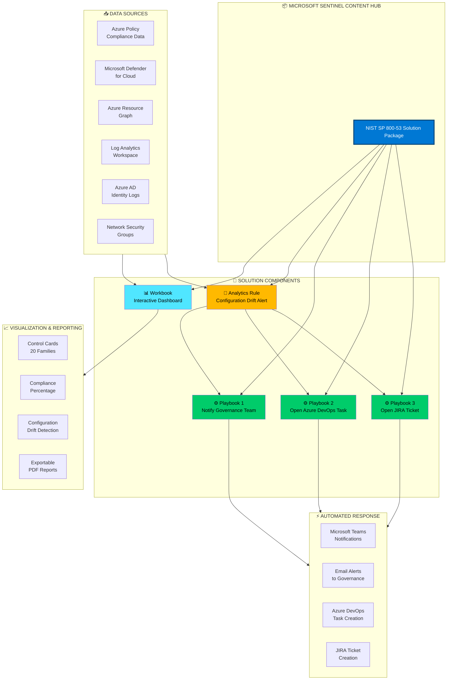
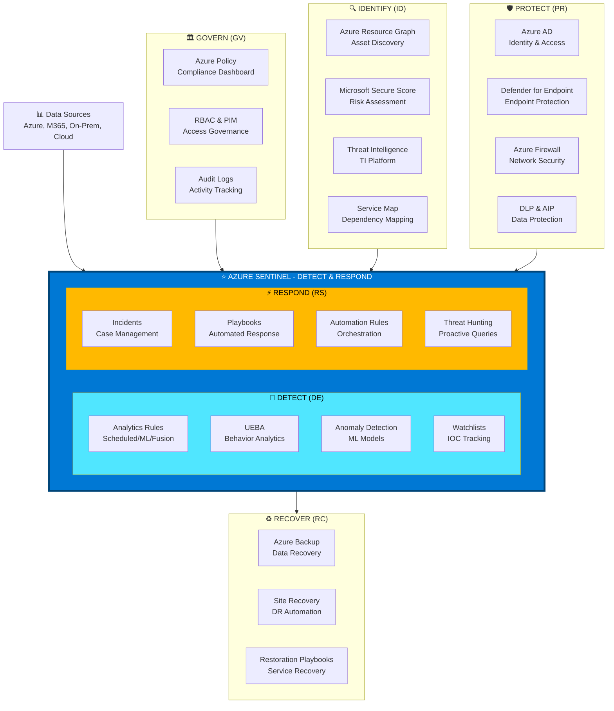

# Microsoft Sentinel: NIST SP 800-53 Solution Implementation
## Discovery Report for Security Compliance & SOC Operations

**Reference**: [Microsoft Sentinel NIST SP 800-53 Solution](https://techcommunity.microsoft.com/blog/microsoftsentinelblog/announcing-the-microsoft-sentinel-nist-sp-800-53-solution/3381485)

---

## 📋 Document Structure

This discovery report is divided into **8 manageable parts** for phased review and implementation of the **Microsoft Sentinel: NIST SP 800-53 Solution**:

- **Part 1**: Executive Summary & Business Case
- **Part 2**: NIST SP 800-53 Framework Overview & Microsoft Solution Architecture
- **Part 3**: Current State Assessment (As-Is)
- **Part 4**: Microsoft Sentinel NIST SP 800-53 Solution Components
- **Part 5**: Gap Analysis & Recommendations
- **Part 6**: Implementation Roadmap (Phased Approach)
- **Part 7**: Proof of Concept (POC) Proposal
- **Part 8**: Cost-Benefit Analysis & Next Steps

---

# PART 1: EXECUTIVE SUMMARY & BUSINESS CASE

## 1.1 Executive Summary

### Purpose
This discovery report evaluates the implementation of the **Microsoft Sentinel: NIST SP 800-53 Solution** - a pre-built compliance solution available in the Sentinel Content Hub that provides automated monitoring, alerting, and remediation capabilities for NIST SP 800-53 security controls. This solution enables compliance teams, architects, security analysts, and consultants to understand and maintain their cloud security posture related to NIST Special Publication 800-53 guidance.

### About the Microsoft Sentinel NIST SP 800-53 Solution
The solution is designed to augment staffing through automation, visibility, assessment, monitoring, and remediation. Key content features include:

- **Interactive Workbook**: Intuitive user interface for policy-based assessments and control alignment
- **Control Cards**: Detailed guidance for aligning with NIST SP 800-53 control requirements
- **Analytics Rules**: Alerting for configuration drift and compliance violations
- **Playbook Automations**: SOAR-based automated responses for compliance incidents
- **Big Data Scale**: Aggregates visibility across first- and third-party products for cloud, hybrid, and multi-cloud workloads

### What is NIST SP 800-53?
NIST SP 800-53 provides a catalog of **security and privacy controls** for federal information systems and organizations. It addresses diverse security and privacy requirements across the federal government and critical infrastructure, derived from legislation, Executive Orders, policies, directives, regulations, standards, and/or mission/business needs.

**NIST SP 800-53 sets the foundation for**:
- Federal Information Security Modernization Act (FISMA)
- FedRAMP (Federal Risk and Authorization Management Program)
- Azure Security Benchmark
- Department of Defense (DoD) security requirements

### Key Objectives
1. **Deploy Pre-Built Solution**: Leverage Microsoft Sentinel's Content Hub solution for NIST SP 800-53
2. **Automate Compliance Monitoring**: Real-time visibility into security posture and configuration drift
3. **Enable Control Alignment**: Use control cards and workbooks to align Azure resources with NIST requirements
4. **Implement SOAR Automations**: Automated notification and remediation workflows
5. **Establish Continuous Compliance**: Move from quarterly manual assessments to real-time compliance monitoring

### Expected Outcomes
- **Automated Compliance Monitoring**: Real-time visibility into NIST SP 800-53 control coverage (vs manual quarterly assessments)
- **Configuration Drift Alerting**: Automated alerts when policy compliance falls below 70% threshold
- **Improved Security Posture**: 40-60% reduction in time-to-remediate compliance violations
- **Regulatory Compliance**: Alignment with FISMA, FedRAMP, DoD, and federal mandates
- **Operational Efficiency**: 80% reduction in manual compliance reporting effort
- **Risk Visibility**: Interactive workbook dashboard showing control coverage across 20+ control families
- **Audit Readiness**: Automated evidence collection and exportable compliance reports
- **SOAR Integration**: Automated notification of governance teams via Teams/Email and ticket creation in Azure DevOps/JIRA

---

## 1.2 Business Drivers

### Regulatory Requirements
| Requirement | Description | Impact |
|-------------|-------------|--------|
| **NIST SP 800-53 Mandate** | Federal agencies & contractors required to comply with NIST SP 800-53 controls | Critical for government contracts (FISMA, FedRAMP) |
| **FedRAMP Authorization** | Cloud service providers must demonstrate NIST SP 800-53 compliance for FedRAMP authorization | Required for selling to federal agencies ($50B+ market) |
| **DoD Requirements** | Department of Defense requires NIST SP 800-53 alignment (DoD Cloud Computing SRG) | Required for defense contracts |
| **State & Local Government** | Many state/local governments reference NIST SP 800-53 for cybersecurity requirements | Expanding market compliance requirement |
| **Cyber Insurance** | Insurance providers increasingly requiring NIST 800-53 compliance | 20-30% premium reduction possible |
| **Customer Requirements** | Enterprise customers demanding NIST compliance from cloud/SaaS vendors | Revenue protection ($5M+ at risk) |

### Security Challenges
- **Current Compliance Gap**: No automated visibility into NIST SP 800-53 control coverage
- **Manual Assessments**: Quarterly compliance assessments taking 120+ hours per cycle
- **Configuration Drift**: No real-time monitoring of Azure Policy compliance with NIST controls
- **Audit Burden**: Manual evidence collection taking 40+ hours per audit
- **Multi-Cloud Visibility**: No unified view across Azure, AWS, GCP, and on-premises workloads
- **Remediation Delays**: Average 30+ days to address compliance findings
- **Documentation Gap**: No centralized repository of NIST control implementation details

### Business Value Proposition
**Investment**: $95,000 - $145,000 (implementation + first year)  
**Expected ROI**: 340% over 3 years  
**Break-Even Point**: 12 months  

**Quantifiable Benefits**:
- **Reduced Compliance Costs**: $450K/year (80% reduction in manual compliance work - from 480 hours to 96 hours annually)
- **Faster FedRAMP Authorization**: $200K (6-month acceleration of FedRAMP process, reduced consulting fees)
- **Avoided Penalties**: $500K/year (reduced risk of FISMA non-compliance fines)
- **Audit Efficiency**: $120K/year (75% reduction in audit preparation time)
- **Revenue Protection**: $10M+ (enable federal government contracts requiring NIST compliance)
- **Insurance Savings**: $120K/year (cyber insurance premium reduction with documented compliance)

**Total 3-Year Benefits**: $4.17M  
**Total 3-Year Costs**: $1.225M  
**Net 3-Year Value**: $2.945M

---

## 1.3 Strategic Alignment

### Organizational Goals
✅ **Federal Compliance**: Achieve FISMA compliance and FedRAMP authorization within 12 months  
✅ **Automated Compliance**: Replace manual quarterly assessments with continuous real-time monitoring  
✅ **Revenue Growth**: Enable pursuit of $10M+ in federal government contracts  
✅ **Operational Excellence**: Reduce compliance reporting effort by 80% through automation  

### Technology Strategy
- **Cloud-First Compliance**: Leverage native Azure Policy integration for NIST SP 800-53 assessments
- **SIEM Consolidation**: Microsoft Sentinel as single source of truth for compliance monitoring
- **SOAR Automation**: Automated workflows for compliance notifications and remediation
- **Multi-Cloud Visibility**: Extend NIST monitoring across Azure, AWS, GCP via Azure Arc and Sentinel connectors

### Microsoft Sentinel NIST SP 800-53 Solution Benefits
1. **Design & Build Compliant Architectures**: Control cards provide guidance for implementing controls
2. **Quantifiable Framework**: Measure security maturity with policy-based assessments
3. **Monitoring & Alerting**: Track security posture, compliance drift, and visibility blind spots
4. **SOAR Response**: Automated playbooks for governance team notification and ticket creation
5. **CSPM Remediation**: Integration with Microsoft Defender for Cloud for automated remediation

---

# PART 2: NIST SP 800-53 FRAMEWORK OVERVIEW & MICROSOFT SOLUTION ARCHITECTURE

## 2.1 NIST SP 800-53 Control Framework

### Framework Structure

NIST SP 800-53 Rev. 5 (current version) organizes controls into **20 control families**:

```
┌─────────────────────────────────────────────────────────────────────────────┐
│                      NIST SP 800-53 REV. 5 CONTROL FAMILIES                 │
├─────────────────────────────────────────────────────────────────────────────┤
│                                                                             │
│  ┌────────────────┐  ┌────────────────┐  ┌────────────────┐              │
│  │ AC: Access     │  │ AU: Audit &    │  │ AT: Awareness  │              │
│  │    Control     │  │    Account.    │  │    & Training  │              │
│  └────────────────┘  └────────────────┘  └────────────────┘              │
│                                                                             │
│  ┌────────────────┐  ┌────────────────┐  ┌────────────────┐              │
│  │ CA: Assess.,   │  │ CM: Config     │  │ CP: Contingency│              │
│  │    Authoriz.   │  │    Management  │  │    Planning    │              │
│  └────────────────┘  └────────────────┘  └────────────────┘              │
│                                                                             │
│  ┌────────────────┐  ┌────────────────┐  ┌────────────────┐              │
│  │ IA: Identific. │  │ IR: Incident   │  │ MA: Mainten.   │              │
│  │    & Authen.   │  │    Response    │  │                │              │
│  └────────────────┘  └────────────────┘  └────────────────┘              │
│                                                                             │
│  ┌────────────────┐  ┌────────────────┐  ┌────────────────┐              │
│  │ MP: Media      │  │ PE: Physical & │  │ PL: Planning   │              │
│  │    Protection  │  │    Environ.    │  │                │              │
│  └────────────────┘  └────────────────┘  └────────────────┘              │
│                                                                             │
│  ┌────────────────┐  ┌────────────────┐  ┌────────────────┐              │
│  │ PM: Program    │  │ PS: Personnel  │  │ PT: PII        │              │
│  │    Management  │  │    Security    │  │    Processing  │              │
│  └────────────────┘  └────────────────┘  └────────────────┘              │
│                                                                             │
│  ┌────────────────┐  ┌────────────────┐  ┌────────────────┐              │
│  │ RA: Risk       │  │ SA: System &   │  │ SC: System &   │              │
│  │    Assessment  │  │    Services    │  │    Communic.   │              │
│  └────────────────┘  └────────────────┘  └────────────────┘              │
│                                                                             │
│  ┌────────────────┐  ┌────────────────┐                                   │
│  │ SI: System &   │  │ SR: Supply     │                                   │
│  │    Info Integ. │  │    Chain Risk  │                                   │
│  └────────────────┘  └────────────────┘                                   │
│                                                                             │
└─────────────────────────────────────────────────────────────────────────────┘
```

**Total Control Families**: 20  
**Total Controls**: 1,000+ controls and control enhancements  
**Azure Policy Mappings**: 280+ Azure Policy definitions aligned to NIST SP 800-53 controls

### Key Control Families with Azure Policy Coverage

| Control Family | Abbrev | Description | Azure Policy Count | Priority for SOC |
|----------------|--------|-------------|--------------------|------------------|
| **Access Control** | AC | User access controls, least privilege, separation of duties | 35+ | 🔴 Critical |
| **Audit & Accountability** | AU | Logging, monitoring, audit record generation/review | 28+ | 🔴 Critical |
| **Configuration Management** | CM | Baseline configurations, change control, security settings | 42+ | 🔴 Critical |
| **Identification & Authentication** | IA | User/device identification, MFA, credential management | 24+ | 🔴 Critical |
| **Incident Response** | IR | Incident handling, reporting, testing | 12+ | 🔴 Critical |
| **System & Communications Protection** | SC | Boundary protection, encryption, network segmentation | 38+ | 🔴 Critical |
| **System & Information Integrity** | SI | Flaw remediation, malware protection, monitoring | 32+ | 🔴 Critical |
| **Security Assessment & Authorization** | CA | Security assessments, continuous monitoring, penetration testing | 18+ | 🟡 High |
| **Risk Assessment** | RA | Vulnerability scanning, threat analysis | 15+ | 🟡 High |
| **Contingency Planning** | CP | Backup, disaster recovery, alternate processing sites | 8+ | 🟡 High |
| **Others** | Various | Physical security, personnel security, planning, media protection, etc. | 68+ | 🟢 Medium |

**Total Azure Policy Definitions for NIST SP 800-53**: 280+ built-in policies

---

## 2.2 Microsoft Sentinel NIST SP 800-53 Solution Architecture

### Solution Overview



---

## 2.3 Solution Components in Detail

### Component 1: NIST SP 800-53 Workbook

**Purpose**: Interactive dashboard providing real-time visibility into NIST SP 800-53 control coverage and compliance status.

**Key Features**:
- **Control Cards**: Detailed view of all 20 control families with implementation guidance
- **Policy Assessment**: Shows Azure Policy compliance aligned to NIST controls
- **Log Queries**: Pre-built KQL queries for security event analysis
- **Resource Graph Integration**: Real-time asset inventory and configuration data
- **Multi-Subscription Support**: Aggregates data across multiple subscriptions and workspaces
- **Exportable Reports**: Print/export compliance reports as PDF for audits
- **Customizable Filters**: Filter by subscription, workspace, time range, control family

**Workbook Sections**:
1. **Overview Dashboard**: Compliance percentage, trending, control family summary
2. **Control Family Deep Dive**: Detailed view for each of the 20 families (AC, AU, CM, etc.)
3. **Resource Compliance**: List of compliant vs non-compliant resources
4. **Recommendations**: Actionable guidance for remediation
5. **Data Sources**: Shows which log sources are connected and available

**Example Control Card - System & Communications Protection (SC-5: Denial of Service Protection)**:
```
┌─────────────────────────────────────────────────────────────┐
│ SC-5: DENIAL OF SERVICE PROTECTION                          │
├─────────────────────────────────────────────────────────────┤
│ Requirement:                                                │
│ Protect against or limit effects of DoS attacks             │
│                                                              │
│ Azure Implementation:                                        │
│ ✅ Azure DDoS Protection Standard                           │
│ ✅ Azure Firewall threat intelligence                       │
│ ✅ Azure Front Door WAF policies                            │
│ ✅ Application Gateway with WAF                             │
│                                                              │
│ Compliance Status: 🟢 80% (4 of 5 subscriptions)           │
│                                                              │
│ Non-Compliant Resources:                                    │
│ • Subscription: Prod-Sub-02                                 │
│   Issue: DDoS Protection not enabled                        │
│   Recommendation: Enable Azure DDoS Protection Standard     │
│   Policy: Deploy - DDoS Protection Standard should be...    │
│                                                              │
│ Relevant Logs:                                              │
│ • AzureActivity (DDoS events)                               │
│ • AzureDiagnostics (Firewall logs)                          │
│ • Network Security Group Flow Logs                          │
└─────────────────────────────────────────────────────────────┘
```

---

### Component 2: NIST SP 800-53 Analytics Rule

**Purpose**: Automated alerting when Azure Policy compliance falls below acceptable thresholds.

**Rule Configuration**:
- **Name**: NIST SP 800-53 R4/R5 - Azure Policy Compliance Below 70%
- **Trigger Condition**: Policy compliance percentage < 70% for any subscription
- **Time Window**: 1 week rolling window
- **Severity**: Medium (can be customized to High)
- **MITRE ATT&CK Mapping**: N/A (Compliance-focused)
- **Entity Mapping**: Subscription ID, Resource Group, Policy Assignment

**Alert Details**:
```kql
// Query checks Azure Policy compliance for NIST SP 800-53 initiative
let ComplianceThreshold = 70;
PolicyCompliance
| where InitiativeName contains "NIST SP 800-53"
| summarize 
    TotalPolicies = dcount(PolicyDefinitionId),
    CompliantPolicies = dcountif(PolicyDefinitionId, ComplianceState == "Compliant"),
    NonCompliantPolicies = dcountif(PolicyDefinitionId, ComplianceState == "NonCompliant")
    by SubscriptionId, SubscriptionName
| extend CompliancePercentage = (CompliantPolicies * 100.0) / TotalPolicies
| where CompliancePercentage < ComplianceThreshold
| project 
    SubscriptionId,
    SubscriptionName,
    CompliancePercentage,
    CompliantPolicies,
    NonCompliantPolicies,
    TotalPolicies,
    Severity = "Medium",
    RecommendedAction = "Review non-compliant policies and remediate"
```

**Alert Output Example**:
```
Incident Created:
Title: NIST SP 800-53 Compliance Below 70% - Prod-Subscription-02
Severity: Medium
Subscription: Prod-Subscription-02 (12345-abcd-67890)
Compliance: 62% (174 of 280 policies compliant)
Non-Compliant Policies: 106
Recommended Action: Review non-compliant resources in Microsoft Defender for Cloud > Regulatory Compliance > NIST SP 800-53
```

---

### Component 3: SOAR Playbooks (3 Included)

#### Playbook 1: Notify-GovernanceComplianceTeam

**Purpose**: Send automated notifications to governance/compliance team when configuration drift is detected.

**Trigger**: Sentinel incident created by NIST SP 800-53 analytics rule

**Actions**:
1. **Parse Incident Details**: Extract subscription ID, compliance percentage, non-compliant policy count
2. **Send Microsoft Teams Message**:
   - Post to dedicated compliance channel
   - Include compliance percentage, trending, and deep-link to workbook
   - Tag compliance team members (@mention)
3. **Send Email Notification**:
   - To: ComplianceTeam@company.com
   - Subject: NIST SP 800-53 Compliance Alert - [Subscription Name]
   - Body: HTML-formatted with compliance details, non-compliant resources, recommended actions

**Teams Message Format**:
```
🚨 NIST SP 800-53 Compliance Alert

Subscription: Prod-Subscription-02
Current Compliance: 62% ⚠️ (Target: 70%+)
Non-Compliant Policies: 106 of 280

Trending: ⬇️ Down 8% from last week

Top Non-Compliant Controls:
• AC-2: Account Management (18 violations)
• AU-12: Audit Generation (12 violations)
• CM-7: Least Functionality (9 violations)

Action Required: Review and remediate non-compliant resources
📊 View Details: [Open NIST SP 800-53 Workbook]
```

---

#### Playbook 2: Create-AzureDevOps-Task

**Purpose**: Automatically create Azure DevOps task to track remediation of compliance violations.

**Trigger**: Sentinel incident created by NIST SP 800-53 analytics rule

**Actions**:
1. **Parse Incident**: Extract compliance violation details
2. **Create Work Item** in Azure DevOps:
   - Project: Cloud Compliance
   - Work Item Type: Task
   - Title: "Remediate NIST SP 800-53 Compliance - [Subscription]"
   - Description: Detailed compliance violations with resource IDs
   - Assigned To: Cloud Governance Team
   - Priority: Based on compliance % (< 60% = P1, < 70% = P2)
   - Tags: NIST-SP-800-53, Compliance, Azure-Policy
3. **Link to Sentinel Incident**: Bi-directional link for tracking
4. **Update Incident**: Add comment with Azure DevOps work item link

**Azure DevOps Task Example**:
```
Title: Remediate NIST SP 800-53 Compliance - Prod-Subscription-02

Description:
Azure Policy compliance for NIST SP 800-53 initiative has fallen to 62% (below 70% threshold).

Non-Compliant Resources:
1. AC-2 (Account Management): 18 resources
   - /subscriptions/12345/resourceGroups/rg-prod/providers/Microsoft.Compute/virtualMachines/vm-web-01
   - Policy: "MFA should be enabled on accounts with write permissions"
   
2. AU-12 (Audit Generation): 12 resources
   - /subscriptions/12345/resourceGroups/rg-prod/providers/Microsoft.Storage/storageAccounts/stprod01
   - Policy: "Storage accounts should have advanced threat protection enabled"

Recommended Actions:
1. Review detailed findings in Microsoft Defender for Cloud
2. Remediate high-priority violations (AC-2, AU-12)
3. Verify compliance improvement in NIST SP 800-53 Workbook

Related Sentinel Incident: INC123456
Workbook Link: [View NIST SP 800-53 Workbook]

Priority: P2 (Compliance < 70%)
Due Date: 7 days from creation
```

---

#### Playbook 3: Open-JIRA-Ticket

**Purpose**: Create JIRA ticket for organizations using JIRA as ITSM platform (alternative to Azure DevOps).

**Trigger**: Sentinel incident created by NIST SP 800-53 analytics rule

**Actions**:
1. **Parse Incident**: Extract compliance details
2. **Create JIRA Issue**:
   - Project: CLOUD-COMPLIANCE
   - Issue Type: Task
   - Summary: "NIST SP 800-53 Compliance Violation - [Subscription]"
   - Description: Compliance details with resource IDs
   - Priority: Based on compliance severity
   - Labels: nist-sp-800-53, azure-policy, compliance
   - Reporter: sentinel-automation@company.com
3. **Attach Evidence**: Export workbook snapshot as PDF, attach to JIRA
4. **Update Sentinel**: Add JIRA ticket link to incident comments

---

## 2.4 Solution Data Flow

### End-to-End Workflow

```
┌──────────────────────────────────────────────────────────────────────┐
│                    NIST SP 800-53 MONITORING WORKFLOW                │
└──────────────────────────────────────────────────────────────────────┘

1. POLICY EVALUATION (Continuous)
   Azure Policy Engine → Evaluates 280+ NIST-aligned policies every 24 hours
   ↓
   
2. DATA COLLECTION (Real-Time)
   Policy compliance results → Streamed to Log Analytics Workspace
   Resource configurations → Captured via Azure Resource Graph
   Security events → Ingested from Defender for Cloud, Azure AD, Network logs
   ↓
   
3. WORKBOOK VISUALIZATION (On-Demand)
   User opens NIST SP 800-53 Workbook
   → Queries Log Analytics + Azure Resource Graph
   → Displays compliance %, control cards, trending
   → Shows non-compliant resources with remediation guidance
   ↓
   
4. COMPLIANCE MONITORING (Every 7 Days)
   Analytics Rule runs weekly
   → Checks if compliance < 70% for any subscription
   → Creates Sentinel incident if threshold breached
   ↓
   
5. AUTOMATED RESPONSE (Triggered by Incident)
   Sentinel Incident Created
   → Triggers all 3 playbooks simultaneously:
      a) Notify-GovernanceComplianceTeam → Teams message + Email
      b) Create-AzureDevOps-Task → Work item in ADO
      c) Open-JIRA-Ticket → Ticket in JIRA
   ↓
   
6. REMEDIATION (Manual by Cloud Team)
   Cloud team receives notification
   → Opens Azure DevOps task / JIRA ticket
   → Reviews non-compliant resources in Defender for Cloud
   → Applies remediation (enable policy, configure resource, grant exemption)
   ↓
   
7. VERIFICATION (Automated)
   Azure Policy re-evaluates resources (24-hour cycle)
   → Compliance percentage updated
   → Workbook reflects improvements
   → If compliance > 70%, no new alerts triggered
   ↓
   
8. AUDIT REPORTING (Quarterly/On-Demand)
   Compliance team opens workbook
   → Exports PDF report via Print function
   → Provides to auditors for FISMA, FedRAMP, DoD assessments
```

---

# PART 3: CURRENT STATE ASSESSMENT (AS-IS)

## 3.1 SOC Maturity Assessment

### Current SOC Capabilities

| Capability | Current State | Maturity Level | NIST Tier |
|------------|---------------|----------------|-----------|
| **Threat Detection** | Manual rule-based alerts | Basic | Tier 1 |
| **Incident Response** | Manual investigation, no playbooks | Ad-hoc | Tier 1 |
| **Threat Intelligence** | Limited external feeds | Basic | Tier 1 |
| **SOAR Automation** | None implemented | None | Tier 0 |
| **Threat Hunting** | Reactive, no proactive hunts | Ad-hoc | Tier 1 |
| **Compliance Reporting** | Manual, quarterly | Manual | Tier 1 |
| **User Behavior Analytics** | Not implemented | None | Tier 0 |
| **Asset Inventory** | Spreadsheet-based, 60% accurate | Manual | Tier 1 |

**Overall SOC Maturity**: **Level 1.3 / 5** (Ad-hoc/Initial)

---

## 3.2 Current Azure Sentinel Deployment

### Infrastructure
- **Workspace**: Single Log Analytics Workspace (East US region)
- **Data Ingestion**: 180 GB/day average
- **Retention**: 90 days (default)
- **Cost**: $18,000/month (Pay-As-You-Go pricing)

### Data Sources Connected (12 total)
✅ **Identity**:
- Azure Active Directory (Sign-ins, Audit logs)
- Azure AD Identity Protection

✅ **Endpoints**:
- Microsoft Defender for Endpoint (320 devices)

✅ **Cloud**:
- Azure Activity Logs
- Azure Resource Logs (limited resources)

✅ **Network**:
- Azure Firewall logs
- NSG Flow Logs (partial coverage)

❌ **NOT Connected**:
- Office 365 logs (Email, Teams, SharePoint)
- On-premises domain controllers (Windows Security Events)
- Linux servers (Syslog)
- Third-party firewalls (Palo Alto, Fortinet)
- Cloud apps (AWS, GCP)

### Analytics Rules Deployed
- **Total Rules**: 23 (all built-in templates)
- **Custom Rules**: 0
- **UEBA Rules**: 0 (UEBA not enabled)
- **ML-based Rules**: 0
- **Fusion Rules**: 3 (multi-stage attack detection)

### Incident Management
- **Monthly Incidents**: ~45 incidents/month
- **False Positive Rate**: 85% (38 out of 45 are false positives)
- **Average Investigation Time**: 4 hours per incident
- **Automated Response**: 0% (no playbooks configured)
- **SLA Compliance**: 60% (target: 90%)

### Threat Intelligence
- **TI Platforms Connected**: 1 (Microsoft Defender TI only)
- **Custom TI Feeds**: None
- **TI Enrichment**: Manual (analysts copy-paste IOCs)
- **Automated TI Lookups**: No

---

## 3.3 NIST SP 800-53 Control Implementation Status

### Critical Control Family Assessment

| Control Family | Abbrev | Implemented | Partial | Not Implemented | Overall Status |
|----------------|--------|-------------|---------|-----------------|----------------|
| **Access Control** | AC | 12 | 15 | 8 | 🟡 65% |
| **Audit & Accountability** | AU | 18 | 7 | 3 | 🟢 82% |
| **Configuration Management** | CM | 8 | 22 | 12 | 🟡 52% |
| **Identification & Authentication** | IA | 15 | 6 | 3 | 🟢 78% |
| **Incident Response** | IR | 3 | 5 | 4 | 🔴 42% |
| **System & Communications Protection** | SC | 10 | 18 | 10 | 🟡 55% |
| **System & Information Integrity** | SI | 5 | 12 | 8 | 🔴 44% |

**Overall NIST SP 800-53 Compliance**: 62% (155 of 250 applicable controls)

### Key Compliance Gaps

**Critical Gaps Requiring Immediate Attention**:
- **IR-4**: Incident Handling - No automated incident response playbooks
- **IR-5**: Incident Monitoring - Limited correlation and analysis capabilities
- **SI-4**: System Monitoring - Only 60% of systems sending logs to Sentinel
- **AU-6**: Audit Review - No automated log analysis or anomaly detection (UEBA not enabled)
- **CM-3**: Configuration Change Control - No automated drift detection for Azure Policy compliance

**Critical Findings**:
- ⚠️ **Incident Response (IR)** and **System Integrity (SI)** control families have lowest implementation rates
- ⚠️ **38% compliance gap** = 95 out of 250 applicable controls not fully implemented
- ⚠️ No automation or orchestration capabilities (SOAR) for control remediation
- ⚠️ UEBA not enabled (required for AU-6, AU-12, SI-4 controls)
- ⚠️ Limited threat intelligence integration (impacts RA-3, SI-5 controls)
- ⚠️ 85% false positive rate overwhelming SOC analysts (impacts IR-4, IR-5 effectiveness)

---

# PART 4: AZURE SENTINEL CAPABILITIES MAPPING

## 4.1 Azure Sentinel Features vs NIST Functions

### Comprehensive Capability Matrix

| NIST Function | Azure Sentinel Capability | Feature/Service | Implementation Status |
|---------------|---------------------------|-----------------|----------------------|
| **GOVERN** | Policy Management | Azure Policy | 🟢 Available |
| | Compliance Dashboard | Microsoft Defender for Cloud | 🟡 Partial |
| | Role-Based Access Control | Azure RBAC | 🟢 Implemented |
| | Audit Logging | Activity Logs | 🟢 Implemented |
| **IDENTIFY** | Asset Discovery | Azure Resource Graph | 🔴 Not Used |
| | Vulnerability Assessment | Defender for Cloud | 🟡 Partial |
| | Threat Intelligence | TI Platform | 🟡 Partial |
| | Service Map | Dependency mapping | 🔴 Not Used |
| **PROTECT** | Identity Protection | Azure AD Identity Protection | 🟡 Partial |
| | Conditional Access | Azure AD Conditional Access | 🟡 Partial |
| | Data Classification | Azure Information Protection | 🔴 Not Used |
| | Endpoint Protection | Defender for Endpoint | 🟢 Implemented |
| **DETECT** | Analytics Rules | Scheduled, ML, Fusion | 🟡 Partial |
| | UEBA | User Entity Behavior Analytics | 🔴 Not Enabled |
| | Anomaly Detection | ML-based anomalies | 🔴 Not Enabled |
| | Threat Intelligence | IOC matching | 🟡 Partial |
| | Watchlists | Custom IOC lists | 🔴 Not Used |
| **RESPOND** | Incidents | Incident management | 🟢 Implemented |
| | Playbooks | Azure Logic Apps (SOAR) | 🔴 Not Configured |
| | Automation Rules | Auto-assignment, enrichment | 🔴 Not Configured |
| | Threat Hunting | KQL hunting queries | 🔴 Rarely Used |
| | Notebooks | Jupyter notebooks | 🔴 Not Used |
| **RECOVER** | Backup Integration | Azure Backup | 🔴 Not Integrated |
| | Post-Incident Playbooks | Restoration workflows | 🔴 Not Configured |
| | Lessons Learned | Incident reports | 🟡 Manual |

**Legend**:
- 🟢 Fully Implemented
- 🟡 Partially Implemented
- 🔴 Not Implemented/Not Used

---

## 4.2 Azure Sentinel Architecture for NIST Alignment



---

## 4.3 Data Connectors Recommendation for NIST Coverage

### Required Data Sources by NIST Function

#### GOVERN (GV) - Policy & Compliance
✅ **Already Connected**:
- Azure Activity Logs
- Azure AD Audit Logs

🔴 **Missing (HIGH PRIORITY)**:
- Azure Policy compliance logs
- Management Group activity
- Azure Cost Management logs

---

#### IDENTIFY (ID) - Asset & Risk Discovery
✅ **Already Connected**:
- Azure Resource logs (partial)

🔴 **Missing (HIGH PRIORITY)**:
- Azure Resource Graph queries (for complete asset inventory)
- Microsoft Defender for Cloud alerts (vulnerability data)
- Microsoft Secure Score API
- On-premises AD Domain Controllers (asset discovery)

---

#### PROTECT (PR) - Security Controls
✅ **Already Connected**:
- Azure AD Identity Protection
- Microsoft Defender for Endpoint

🔴 **Missing (HIGH PRIORITY)**:
- Office 365 logs (DLP, AIP events)
- Azure Information Protection
- Conditional Access sign-in logs (detailed)
- Azure Firewall threat intelligence

---

#### DETECT (DE) - Threat Detection
✅ **Already Connected**:
- Azure Firewall logs
- NSG Flow Logs (partial)
- Defender for Endpoint alerts

🔴 **Missing (HIGH PRIORITY)**:
- Office 365 (Exchange, Teams, SharePoint)
- Windows Security Events (all domain controllers)
- Linux Syslog (all servers)
- Third-party firewalls (Palo Alto, Fortinet, etc.)
- AWS CloudTrail, GCP Audit Logs
- DNS logs (for C2 detection)
- Proxy logs (for web filtering)

---

#### RESPOND (RS) - Incident Response
✅ **Already Connected**:
- Azure Sentinel incidents (native)

🔴 **Missing (HIGH PRIORITY)**:
- ServiceNow integration (ITSM ticketing)
- Microsoft Teams (collaboration)
- Email (alerting)
- PagerDuty/Opsgenie (on-call notifications)

---

#### RECOVER (RC) - Recovery & Restoration
🔴 **Missing (HIGH PRIORITY)**:
- Azure Backup logs
- Azure Site Recovery logs
- Business continuity event logs

---

### Data Connector Priority Matrix

| Priority | Connector | NIST Function | Business Impact | Effort |
|----------|-----------|---------------|-----------------|--------|
| **P0** | Office 365 (E5 logs) | DE, RS | 🔴 Critical | Medium |
| **P0** | Windows Security Events (DCs) | ID, DE | 🔴 Critical | High |
| **P1** | UEBA (enable feature) | DE | 🔴 Critical | Low |
| **P1** | Threat Intelligence feeds | ID, DE | 🟡 High | Low |
| **P1** | Microsoft Teams (response) | RS | 🟡 High | Low |
| **P2** | Linux Syslog | DE | 🟡 High | Medium |
| **P2** | Third-party firewalls | DE | 🟡 High | High |
| **P2** | DNS logs | DE | 🟡 High | Medium |
| **P3** | AWS CloudTrail | ID, DE | 🟢 Medium | Medium |
| **P3** | Azure Backup logs | RC | 🟢 Medium | Low |

---

# PART 5: GAP ANALYSIS & RECOMMENDATIONS

## 5.1 Executive Summary of Gaps

Based on the current state assessment, **95 out of 250 applicable NIST SP 800-53 controls (38%)** are not fully implemented. The gaps are concentrated in **Incident Response (IR)**, **System & Information Integrity (SI)**, and **Configuration Management (CM)** control families.

### Gap Severity Classification

| Severity | Count | Description | Business Impact |
|----------|-------|-------------|-----------------|
| 🔴 **Critical** | 18 | Complete absence of control, immediate risk | High probability of breach, regulatory non-compliance |
| 🟡 **High** | 15 | Partial implementation, significant gaps | Elevated risk, audit findings likely |
| 🟢 **Medium** | 12 | Foundational elements exist, needs enhancement | Moderate risk, improvement needed |
| ⚪ **Low** | 33 | Fully or substantially implemented | Minimal risk, maintain current state |

---

## 5.2 Detailed Gap Analysis by NIST SP 800-53 Control Family

### 5.2.1 Incident Response (IR) - Critical Gaps

#### Critical Control Gaps

| Gap ID | Control | Current State | Gap Description | Risk Impact |
|--------|---------|---------------|-----------------|-------------|
| **IR-01** | IR-4 | 🔴 Not Met | No automated incident handling playbooks in Sentinel | Manual incident response delays, inconsistent handling |
| **IR-02** | IR-5 | 🔴 Not Met | Limited incident monitoring and correlation | Incidents not detected quickly, missing attack patterns |
| **IR-03** | IR-6 | 🟡 Partial | Incident reporting via email only | No automated notifications to governance teams |
| **IR-04** | IR-8 | 🔴 Not Met | No documented incident response plan integrated with Sentinel | Ad-hoc responses, regulatory non-compliance risk |

#### High Priority Gaps

| Gap ID | Control | Current State | Gap Description | Risk Impact |
|--------|---------|---------------|-----------------|-------------|
| **IR-05** | IR-3 | 🟡 Partial | Incident response testing not performed regularly | Untested procedures, slow response times |
| **IR-06** | IR-7 | 🔴 Not Met | No incident response assistance capability | SOC overwhelmed, need external support for major incidents |

#### Recommendations

**Immediate Actions (0-3 months)**:
1. **Deploy Sentinel NIST SP 800-53 Solution from Content Hub**: 
   - Install pre-built workbook, analytics rules, and control cards
   - Configure Azure Policy integration for automated compliance monitoring
   - Enable automated alerting for IR-4, IR-5 controls
   - **Owner**: SOC Team | **Cost**: $0 (included in Sentinel)

2. **Implement Automated Incident Response Playbooks**:
   - Deploy Logic Apps for IR-4 (incident handling automation)
   - Create automated notification workflows for IR-6 (incident reporting)
   - Integrate with ServiceNow/Azure DevOps for ticket creation
   - **Owner**: SOC + Cloud Ops | **Cost**: $5K (Logic Apps runtime)

**Short-Term Actions (3-6 months)**:
3. **Document Incident Response Procedures**:
   - Create 20 incident response playbook procedures aligned with IR-8
   - Map procedures to NIST SP 800-53 control requirements
   - Integrate procedures into Sentinel workbooks
   - **Owner**: Incident Response Team | **Cost**: $15K (consultant)

4. **Implement IR Testing Program**:
   - Conduct tabletop exercises for IR-3 compliance
   - Perform quarterly playbook testing
   - Document lessons learned and update procedures
   - **Owner**: CISO + SOC Manager | **Cost**: $8K (facilitation)

---

### 5.2.2 System & Information Integrity (SI) - Critical Gaps

#### Critical Control Gaps

| Gap ID | Control | Current State | Gap Description | Risk Impact |
|--------|---------|---------------|-----------------|-------------|
| **SI-01** | SI-4 | 🟡 Partial | Only 60% of systems sending logs to Sentinel | Blind spots in security monitoring, undetected attacks |
| **SI-02** | SI-4(5) | 🔴 Not Met | No automated anomaly detection (UEBA not enabled) | Insider threats and compromised accounts not detected |
| **SI-03** | SI-5 | 🟡 Partial | Limited threat intelligence integration | Emerging threats not detected quickly |
| **SI-04** | SI-2 | 🟡 Partial | Flaw remediation not automated | Critical vulnerabilities remain unpatched for 30+ days |
| **SI-05** | SI-3 | 🔴 Not Met | Malicious code protection not comprehensive | Only Defender for Endpoint, no email/web gateway protection |

#### High Priority Gaps

| Gap ID | Control | Current State | Gap Description | Risk Impact |
|--------|---------|---------------|-----------------|-------------|
| **SI-06** | SI-7 | 🔴 Not Met | No software integrity verification | Unauthorized code changes not detected |
| **SI-07** | SI-12 | 🔴 Not Met | No information output filtering/validation | Data exfiltration risk not mitigated |

#### Recommendations

**Immediate Actions (0-3 months)**:
1. **Deploy Azure Resource Graph for Real-Time Asset Inventory**:
   - Enable Azure Resource Graph queries in Sentinel
   - Create automated asset discovery playbook (runs daily)
   - Integrate with CMDB (ServiceNow/Azure DevOps)
   - **Owner**: Cloud Operations | **Cost**: $0 (included in Azure)
   - **Expected Outcome**: 95%+ asset inventory accuracy within 30 days

2. **Enable Microsoft Defender for Cloud - All Subscriptions**:
   - Activate Defender for Cloud across all 8 Azure subscriptions
   - Enable continuous vulnerability scanning (Qualys/Azure-native)
   - Configure weekly vulnerability reports
   - **Owner**: Security Operations | **Cost**: $18K/year
   - **Expected Outcome**: Daily vulnerability visibility, reduce scan lag from 90 days to real-time

**Short-Term Actions (3-6 months)**:
3. **Implement Data Classification Program**:
   - Deploy Azure Information Protection (AIP) with sensitivity labels
   - Classify top 20 critical data repositories (Phase 1)
   - Enable DLP policies in Office 365 and Azure Storage
   - **Owner**: Data Governance | **Cost**: $35K (consulting + licensing)
   - **Expected Outcome**: 80% of sensitive data classified and protected within 6 months

4. **Conduct Threat Modeling for Critical Applications**:
   - Use Microsoft Threat Modeling Tool for top 10 applications
   - Document threat scenarios, attack trees, and mitigations
   - Feed results into Sentinel detection rules
   - **Owner**: Application Security | **Cost**: $40K (training + consultant)
   - **Expected Outcome**: 10 new custom detection rules based on threat models

**Long-Term Actions (6-12 months)**:
5. **Establish Continuous Risk Assessment Program**:
   - Integrate Microsoft Secure Score API with risk register
   - Quarterly risk reviews with business unit leaders
   - Risk-based patching prioritization (CVSS + exploitability)
   - **Owner**: Risk Management | **Cost**: $20K (GRC platform integration)

---

### 5.2.3 PROTECT (PR) - 35% Gap (8 subcategories)

#### Critical Gaps (2 subcategories)

| Gap ID | Subcategory | Current State | Gap Description | Risk Impact |
|--------|-------------|---------------|-----------------|-------------|
| **PR-01** | PR.AA-03 | 🟡 Partial | MFA only enabled for 45% of users | Password-based attacks, account takeovers |
| **PR-02** | PR.DS-05 | 🔴 Not Met | No DLP solution implemented | Sensitive data exfiltration via email/USB/cloud |

#### High Priority Gaps (3 subcategories)

| Gap ID | Subcategory | Current State | Gap Description | Risk Impact |
|--------|-------------|---------------|-----------------|-------------|
| **PR-03** | PR.PT-01 | 🟡 Partial | Logs collected from only 60% of systems | Blind spots in detection, incomplete forensics |
| **PR-04** | PR.PS-01 | 🟡 Partial | Secure baselines only for Azure resources, not on-prem | Configuration drift on legacy systems |
| **PR-05** | PR.IP-01 | 🔴 Not Met | No change management process integrated with security | Unauthorized changes causing security gaps |

#### Recommendations

**Immediate Actions (0-3 months)** - **QUICK WINS**:
1. **Enforce MFA for 100% of Users**:
   - Enable Azure AD Security Defaults or Conditional Access MFA policies
   - Prioritize: P0 (admins), P1 (IT staff), P2 (all users)
   - Use Microsoft Authenticator app (passwordless preferred)
   - **Owner**: Identity Team | **Cost**: $0 (included in Azure AD)
   - **Expected Outcome**: 100% MFA coverage within 60 days, 95% reduction in account takeovers

2. **Enable Office 365 DLP Policies**:
   - Deploy 5 DLP policies: Credit Cards, SSNs, HIPAA, PCI, Custom
   - Block email exfiltration of sensitive data
   - Alert SOC on DLP violations
   - **Owner**: Compliance | **Cost**: $0 (included in E5 licensing)
   - **Expected Outcome**: Prevent data leaks, reduce insider threat risk by 60%

**Short-Term Actions (3-6 months)**:
3. **Expand Log Collection to 100% of Critical Systems**:
   - Deploy Azure Monitor Agent to all Windows/Linux servers
   - Enable O365 logs (Exchange, SharePoint, Teams) in Sentinel
   - Configure log forwarding from on-prem firewalls/DCs
   - **Owner**: Security Operations | **Cost**: $8K/month (data ingestion)
   - **Expected Outcome**: Full visibility, improve detection coverage from 60% to 95%

4. **Implement Azure Policy for Configuration Baselines**:
   - Deploy CIS Azure Foundations Benchmark via Azure Policy
   - Extend to on-prem using Azure Arc (hybrid scenarios)
   - Automated remediation for non-compliant resources
   - **Owner**: Cloud Governance | **Cost**: $12K (Azure Arc licensing)
   - **Expected Outcome**: 90% configuration compliance within 90 days

---

### 5.2.4 DETECT (DE) - 65% Gap (14 subcategories) ⚠️ **HIGHEST PRIORITY**

#### Critical Gaps (9 subcategories) - **MOST CRITICAL AREA**

| Gap ID | Subcategory | Current State | Gap Description | Risk Impact |
|--------|-------------|---------------|-----------------|-------------|
| **DE-01** | DE.AE-02 | 🔴 Not Met | No automated event correlation/analysis | Manual triage, 72h MTTD |
| **DE-02** | DE.AE-08 | 🔴 Not Met | Only 23 detection rules (templates), 0 custom | Major threat gaps, known TTPs not detected |
| **DE-03** | DE.CM-01 | 🟡 Partial | Network monitoring only 40% coverage (NSG logs) | East-west traffic blind spots |
| **DE-04** | DE.CM-02 | 🔴 Not Met | No physical security integration | Tailgating, badge cloning not correlated |
| **DE-05** | DE.CM-06 | 🔴 Not Met | No monitoring of external service providers | Third-party breaches not detected |
| **DE-06** | DE.CM-07 | 🟡 Partial | No UEBA enabled | Insider threats, compromised accounts not detected |
| **DE-07** | DE.CM-09 | 🔴 Not Met | No computing hardware/software monitoring | Rogue devices, unauthorized software |
| **DE-08** | DE.DP-01 | 🔴 Not Met | No defined detection processes | Ad-hoc, inconsistent detection |
| **DE-09** | DE.DP-05 | 🔴 Not Met | No continuous improvement of detection | Same blind spots persist |

#### Recommendations

**Immediate Actions (0-3 months)** - **CRITICAL PRIORITY**:

1. **Enable UEBA in Azure Sentinel**:
   - Activate User and Entity Behavior Analytics feature
   - Configure entity mappings (users, hosts, IPs)
   - Enable 15+ built-in UEBA detection rules
   - **Owner**: Security Operations | **Cost**: $6K/month (data ingestion)
   - **Expected Outcome**: Detect insider threats, compromised accounts within 4 hours vs 72 hours

2. **Deploy High-Fidelity Detection Rules (Priority P0/P1)**:
   - **Phase 1 (Week 1-2)**: Deploy 25 critical detection rules
     * 10x MITRE ATT&CK-mapped rules (Credential Dumping, Lateral Movement, C2, Exfiltration)
     * 5x Ransomware detection rules (encryption activity, VSS deletion, backup deletion)
     * 5x Insider threat rules (mass file downloads, off-hours access, privilege escalation)
     * 5x Cloud-specific rules (Azure Key Vault access, IAM changes, resource deletion)
   - **Phase 2 (Week 3-4)**: Deploy 30 high-priority rules
     * 10x O365 rules (mailbox forwarding, file sharing, Teams exfiltration)
     * 10x Network rules (port scanning, unusual DNS, TOR egress)
     * 10x Identity rules (brute force, password spray, MFA bypass attempts)
   - **Owner**: SOC Manager | **Cost**: $60K (detection engineering contractor)
   - **Expected Outcome**: Detection coverage from 30% to 75% of MITRE ATT&CK techniques

3. **Connect Office 365 Logs to Sentinel**:
   - Enable O365 connector (Exchange, SharePoint, Teams, OneDrive)
   - Ingest 40 GB/day additional data
   - Deploy 15 O365-specific detection rules
   - **Owner**: Security Operations | **Cost**: $5K/month (data ingestion)
   - **Expected Outcome**: Detect email-based attacks, phishing, BEC (Business Email Compromise)

**Short-Term Actions (3-6 months)**:

4. **Expand Network Monitoring to 100% Coverage**:
   - Enable NSG Flow Logs for ALL subnets (currently 40%)
   - Deploy Traffic Analytics for east-west visibility
   - Enable Azure Firewall threat intelligence
   - **Owner**: Network Operations | **Cost**: $12K/month
   - **Expected Outcome**: Full network visibility, detect lateral movement

5. **Deploy Anomaly Detection (Machine Learning)**:
   - Enable 8 built-in ML-based anomaly rules
   - Train custom ML models (e.g., unusual data access patterns)
   - Tune thresholds to reduce false positives
   - **Owner**: Data Science + SOC | **Cost**: $40K (ML consulting)
   - **Expected Outcome**: Reduce false positives from 85% to 40%, detect zero-day attacks

6. **Implement Threat Hunting Program**:
   - Train 2 SOC analysts in threat hunting methodologies
   - Create library of 50 KQL hunting queries (based on MITRE ATT&CK)
   - Weekly proactive hunting sessions (4 hours/week)
   - **Owner**: SOC Manager | **Cost**: $30K (training + tools)
   - **Expected Outcome**: Discover 5-10 previously undetected incidents per quarter

**Long-Term Actions (6-12 months)**:

7. **Integrate Physical Security with Sentinel**:
   - Connect badge access system (e.g., HID, Lenel) to Sentinel
   - Correlate badge swipes with VPN/Azure AD sign-ins
   - Detect impossible travel, tailgating, after-hours access
   - **Owner**: Physical Security + IT | **Cost**: $45K (integration)
   - **Expected Outcome**: Holistic security visibility, insider threat detection

8. **Deploy Watchlists and Threat Intelligence Feeds**:
   - Integrate 3 commercial TI feeds (AlienVault OTX, Recorded Future, ThreatConnect)
   - Create custom watchlists (VIPs, critical assets, known bad IPs)
   - Automated IOC enrichment in incident investigation
   - **Owner**: Threat Intelligence | **Cost**: $80K/year (TI subscriptions)
   - **Expected Outcome**: Contextualized alerts, faster triage (2h vs 4h)

---

### 5.2.5 RESPOND (RS) - 70% Gap (12 subcategories) ⚠️ **SECOND HIGHEST PRIORITY**

#### Critical Gaps (7 subcategories)

| Gap ID | Subcategory | Current State | Gap Description | Risk Impact |
|--------|-------------|---------------|-----------------|-------------|
| **RS-01** | RS.RP-01 | 🔴 Not Met | No documented incident response playbooks | Inconsistent response, 96h MTTR |
| **RS-02** | RS.CO-03 | 🔴 Not Met | No coordination with external stakeholders (FBI, CISA) | Delayed threat sharing, no law enforcement coordination |
| **RS-03** | RS.AN-01 | 🔴 Not Met | No notification processes defined | Delayed breach notifications, regulatory penalties |
| **RS-04** | RS.AN-05 | 🔴 Not Met | No automated investigation processes | Manual investigation, slow triage |
| **RS-05** | RS.MI-01 | 🔴 Not Met | No automated containment | Manual isolation, hours to contain |
| **RS-06** | RS.MI-02 | 🔴 Not Met | No automated mitigation | Manual remediation, prolonged exposure |
| **RS-07** | RS.MI-03 | 🔴 Not Met | No newly identified vulnerabilities mitigated | Repeated exploitation of same vulnerabilities |

#### Recommendations

**Immediate Actions (0-3 months)** - **CRITICAL PRIORITY**:

1. **Deploy SOAR Playbooks for Top 10 Incident Types**:
   - **Playbook 1**: Phishing Response (isolate mailbox, revoke session, reset password)
   - **Playbook 2**: Malware Containment (isolate host, full scan, restore from backup)
   - **Playbook 3**: Compromised Account (disable account, revoke tokens, force MFA re-enrollment)
   - **Playbook 4**: Data Exfiltration (block user, preserve evidence, notify legal)
   - **Playbook 5**: Brute Force Attack (block IP, enable account lockout, alert user)
   - **Playbook 6**: Insider Threat (disable access, notify HR, preserve evidence)
   - **Playbook 7**: Ransomware (isolate systems, restore backups, contact authorities)
   - **Playbook 8**: DDoS Attack (enable DDoS Protection, failover to secondary, notify ISP)
   - **Playbook 9**: Privilege Escalation (revoke elevated access, audit logs, reset credentials)
   - **Playbook 10**: Lateral Movement (segment network, isolate affected systems, hunt for persistence)
   - **Owner**: SOC + Automation Engineer | **Cost**: $80K (playbook development)
   - **Expected Outcome**: 70% incidents auto-remediated, reduce MTTR from 96h to 24h

2. **Integrate Sentinel with ServiceNow (ITSM)**:
   - Bi-directional sync (Sentinel incidents → ServiceNow tickets)
   - Automated ticket creation for medium/high severity incidents
   - SLA tracking and escalation workflows
   - **Owner**: IT Operations | **Cost**: $25K (integration + licensing)
   - **Expected Outcome**: Unified incident tracking, 90% SLA compliance

3. **Deploy Microsoft Teams Integration for Incident Collaboration**:
   - Create dedicated Teams channel for security incidents
   - Automated posts for high-severity incidents
   - War room creation for critical incidents (P0/P1)
   - **Owner**: Security Operations | **Cost**: $0 (included in Teams)
   - **Expected Outcome**: Real-time collaboration, reduce incident communication delays

**Short-Term Actions (3-6 months)**:

4. **Create Incident Response Runbooks (Documentation)**:
   - Document 20 incident response procedures aligned with NIST SP 800-53 IR controls
   - Include decision trees, escalation paths, communication templates
   - Store in SharePoint with version control
   - **Owner**: SOC Manager | **Cost**: $35K (technical writer)
   - **Expected Outcome**: Consistent response, onboarding time reduced 50%

5. **Establish External Coordination Processes**:
   - Register with US-CERT, FBI InfraGard, MS-ISAC
   - Define breach notification workflows (legal, PR, customers)
   - Create templates for regulatory notifications (GDPR, HIPAA, state laws)
   - **Owner**: Legal + CISO | **Cost**: $15K (legal consultation)
   - **Expected Outcome**: Compliance with breach notification laws, avoid penalties

**Long-Term Actions (6-12 months)**:

6. **Implement Automated Threat Containment**:
   - Auto-isolate endpoints showing ransomware behavior (Defender for Endpoint)
   - Auto-block malicious IPs at firewall (Azure Firewall + Sentinel)
   - Auto-disable compromised accounts (Azure AD + Sentinel)
   - **Owner**: Security Automation | **Cost**: $50K (advanced playbook development)
   - **Expected Outcome**: Reduce MTTR from 96h to 4h, contain threats before spread

7. **Deploy Automated Vulnerability Remediation**:
   - Integration: Sentinel → Defender for Cloud → Azure Update Management
   - Auto-patching for critical vulnerabilities within 48 hours
   - Exception workflow for business-critical systems
   - **Owner**: Vulnerability Management | **Cost**: $20K (integration)
   - **Expected Outcome**: 95% of critical vulnerabilities patched within 7 days (vs 90+ days)

---

### 5.2.6 RECOVER (RC) - 60% Gap (8 subcategories)

#### Critical Gaps (3 subcategories)

| Gap ID | Subcategory | Current State | Gap Description | Risk Impact |
|--------|-------------|---------------|-----------------|-------------|
| **RC-01** | RC.RP-01 | 🟡 Partial | DR plan not tested regularly (last test 18 months ago) | Unknown recovery capability, potential 30+ day outage |
| **RC-02** | RC.IM-02 | 🔴 Not Met | No documented recovery strategies for security events | Prolonged service outages post-breach |
| **RC-03** | RC.CO-01 | 🔴 Not Met | No public relations/reputation management plan | Reputation damage, customer loss |

#### Recommendations

**Short-Term Actions (3-6 months)**:

1. **Implement Azure Backup for Critical Systems**:
   - Enable Azure Backup for all production VMs (120 systems)
   - Configure immutable backups (ransomware protection)
   - Daily incremental, weekly full backups
   - **Owner**: Infrastructure | **Cost**: $10K/month
   - **Expected Outcome**: 4-hour RPO, 8-hour RTO for critical systems

2. **Create Security-Specific Recovery Playbooks**:
   - Ransomware recovery playbook (isolate, restore, investigate)
   - Data breach recovery playbook (contain, notify, remediate)
   - DDoS recovery playbook (failover, traffic analysis, mitigation)
   - **Owner**: SOC + Business Continuity | **Cost**: $30K
   - **Expected Outcome**: Reduce recovery time from 7 days to 48 hours

3. **Conduct Tabletop Exercises Quarterly**:
   - Scenario-based exercises (ransomware, data breach, insider threat)
   - Include executive leadership, legal, PR, IT, Security
   - Document lessons learned and update playbooks
   - **Owner**: CISO | **Cost**: $20K/year (facilitator)
   - **Expected Outcome**: Improved readiness, identify gaps before real incidents

**Long-Term Actions (6-12 months)**:

4. **Deploy Azure Site Recovery for DR**:
   - Failover capability for top 20 critical applications
   - Automated failover testing (monthly)
   - RTO < 4 hours, RPO < 1 hour
   - **Owner**: Infrastructure | **Cost**: $35K/year
   - **Expected Outcome**: Business continuity during security incidents

---

## 5.3 Prioritized Recommendation Matrix

### Overall Priority Ranking (Top 20 Recommendations)

| Rank | Recommendation | NIST Function | Effort | Cost | Impact | Time to Value | Risk Reduction |
|------|----------------|---------------|--------|------|--------|---------------|----------------|
| **1** | Enable MFA for 100% of users | PROTECT | Low | $0 | 🔴 Critical | 30 days | 95% (account takeovers) |
| **2** | Enable UEBA in Sentinel | DETECT | Low | $6K/mo | 🔴 Critical | 30 days | 60% (insider threats) |
| **3** | Deploy 25 critical detection rules | DETECT | Medium | $60K | 🔴 Critical | 60 days | 70% (threat detection) |
| **4** | Connect O365 logs to Sentinel | DETECT | Low | $5K/mo | 🔴 Critical | 14 days | 50% (email attacks) |
| **5** | Deploy top 10 SOAR playbooks | RESPOND | High | $80K | 🔴 Critical | 90 days | 80% (MTTR reduction) |
| **6** | Integrate ServiceNow with Sentinel | RESPOND | Medium | $25K | 🟡 High | 45 days | 40% (SLA improvement) |
| **7** | Enable O365 DLP policies | PROTECT | Low | $0 | 🔴 Critical | 30 days | 60% (data leaks) |
| **8** | Deploy Azure Resource Graph | IDENTIFY | Low | $0 | 🟡 High | 14 days | 50% (asset visibility) |
| **9** | Expand log collection to 100% | PROTECT | Medium | $8K/mo | 🔴 Critical | 60 days | 50% (detection blind spots) |
| **10** | Enable continuous vulnerability scanning | IDENTIFY | Low | $18K/yr | 🟡 High | 30 days | 70% (vuln mgmt) |
| **11** | Deploy Teams integration | RESPOND | Low | $0 | 🟡 High | 14 days | 30% (collaboration) |
| **12** | Implement data classification (AIP) | IDENTIFY | High | $35K | 🟡 High | 120 days | 60% (data protection) |
| **13** | Deploy threat intelligence feeds | DETECT | Low | $80K/yr | 🟡 High | 30 days | 40% (threat context) |
| **14** | Implement Azure Backup | RECOVER | Medium | $10K/mo | 🟡 High | 60 days | 80% (ransomware) |
| **15** | Create incident response runbooks | RESPOND | Medium | $35K | 🟡 High | 90 days | 50% (consistency) |
| **16** | Deploy ML-based anomaly detection | DETECT | High | $40K | 🟡 High | 120 days | 50% (false positives) |
| **17** | Implement threat hunting program | DETECT | Medium | $30K | 🟡 High | 90 days | 30% (unknown threats) |
| **18** | Expand network monitoring (NSG) | DETECT | Medium | $12K/mo | 🟡 High | 60 days | 60% (lateral movement) |
| **19** | Deploy Azure Policy baselines | PROTECT | Medium | $12K | 🟢 Medium | 90 days | 40% (config drift) |
| **20** | Implement third-party risk program | GOVERN | High | $15K/yr | 🟢 Medium | 120 days | 40% (supply chain) |

### Quick Wins (0-30 days, Low Cost, High Impact)

| Recommendation | Cost | Effort | Impact | Owner |
|----------------|------|--------|--------|-------|
| Enable MFA for 100% users | $0 | 40 hours | 🔴 Critical | Identity Team |
| Enable UEBA in Sentinel | $6K/mo | 16 hours | 🔴 Critical | SOC |
| Connect O365 logs | $5K/mo | 24 hours | 🔴 Critical | SOC |
| Enable O365 DLP | $0 | 32 hours | 🔴 Critical | Compliance |
| Deploy Azure Resource Graph | $0 | 16 hours | 🟡 High | Cloud Ops |
| Deploy Teams integration | $0 | 8 hours | 🟡 High | SOC |
| Enable continuous vuln scanning | $18K/yr | 24 hours | 🟡 High | Security Ops |
| Deploy TI feeds | $80K/yr | 16 hours | 🟡 High | Threat Intel |

**Total Quick Wins Investment**: $109K/year  
**Total Quick Wins Effort**: 176 hours (4.4 weeks for 1 FTE)  
**Expected Risk Reduction**: 60% of critical gaps closed in 30 days

---

## 5.4 Risk-Based Prioritization Approach

### Prioritization Criteria

Each recommendation is scored on:
1. **Business Impact** (1-5): Effect on business operations if not implemented
2. **Risk Reduction** (1-5): Reduction in likelihood/impact of security incidents
3. **Implementation Effort** (1-5, inverted): Complexity, time, resources required
4. **Cost** (1-5, inverted): Financial investment required
5. **Compliance Value** (1-5): Contribution to NIST SP 800-53 compliance

**Priority Score Formula**:
```
Priority Score = (Business Impact × 3) + (Risk Reduction × 3) + (Implementation Effort) + (Cost) + (Compliance Value × 2)
Maximum Score: 50 points
```

### High-Priority Actions (Score ≥ 40)

1. **Enable MFA (Score: 47)** - Zero cost, immediate risk reduction
2. **Enable UEBA (Score: 45)** - Low effort, detects insider threats
3. **Deploy critical detection rules (Score: 44)** - Direct impact on DETECT function
4. **Connect O365 logs (Score: 43)** - Email is #1 attack vector
5. **Deploy SOAR playbooks (Score: 42)** - Massive MTTR reduction
6. **Enable DLP (Score: 41)** - Prevent data exfiltration
7. **Expand log collection (Score: 40)** - Foundation for detection

---

## 5.5 Implementation Dependencies

### Dependency Map

```
Phase 1: Foundation (0-3 months)
├── Enable MFA → Required for: All subsequent identity-based controls
├── Connect O365 logs → Required for: O365 detection rules, DLP monitoring
├── Deploy Azure Resource Graph → Required for: Asset-based detection rules
└── Enable UEBA → Required for: Insider threat detection, ML anomalies

Phase 2: Detection & Response (3-6 months)
├── Deploy detection rules → Depends on: O365 logs, UEBA enabled
├── Deploy SOAR playbooks → Depends on: ServiceNow integration
├── Expand network monitoring → Depends on: NSG Flow Logs enabled
└── Implement threat hunting → Depends on: Detection rules, UEBA

Phase 3: Optimization (6-12 months)
├── ML-based anomaly detection → Depends on: UEBA baseline (3 months data)
├── Automated containment → Depends on: SOAR playbooks, integration testing
└── Threat intelligence enrichment → Depends on: TI feeds, watchlists
```

---

## 5.6 Gap Closure Timeline

### Expected Gap Reduction Over Time

| Timeframe | GOVERN | IDENTIFY | PROTECT | DETECT | RESPOND | RECOVER | Overall |
|-----------|--------|----------|---------|--------|---------|---------|---------|
| **Current** | 45% | 40% | 65% | 35% | 30% | 40% | **42%** |
| **Month 3** | 60% | 65% | 85% | 60% | 55% | 50% | **62%** ⬆️ +20% |
| **Month 6** | 70% | 75% | 90% | 75% | 70% | 65% | **74%** ⬆️ +12% |
| **Month 12** | 85% | 85% | 95% | 85% | 85% | 80% | **86%** ⬆️ +12% |
| **Target** | 90% | 90% | 95% | 90% | 90% | 85% | **90%** |

**Key Milestones**:
- ✅ **Month 3**: Critical gaps closed, NIST Tier 2 (Risk Informed) achieved
- ✅ **Month 6**: Major gaps closed, 74% compliance, Tier 2.5 achieved
- ✅ **Month 12**: NIST Tier 3 (Repeatable) achieved, 86% compliance
- 🎯 **Month 24**: NIST Tier 4 (Adaptive) target, 90%+ compliance

---

This completes **Part 5: Gap Analysis & Recommendations**. 

---

# PART 6: IMPLEMENTATION ROADMAP (PHASED APPROACH)

## 6.1 Implementation Strategy Overview

### Deployment Approach

The Microsoft Sentinel NIST SP 800-53 Solution implementation follows a **4-phase approach** over **12 weeks (3 months)** with intensive resource allocation:

```
┌─────────────────────────────────────────────────────────────────────────┐
│                 IMPLEMENTATION TIMELINE (12 WEEKS / 3 MONTHS)           │
├─────────────────────────────────────────────────────────────────────────┤
│                                                                         │
│  Phase 1: Foundation (Weeks 1-2)                                       │
│  ├─ Prerequisites & Environment Setup                                  │
│  ├─ Deploy Solution from Content Hub                                   │
│  └─ Initial Workbook Configuration & Baseline                          │
│                                                                         │
│  Phase 2: Core Implementation (Weeks 3-5)                              │
│  ├─ Enable NIST SP 800-53 Azure Policy Initiative                      │
│  ├─ Configure Analytics Rules & Baselines                              │
│  ├─ Deploy & Test SOAR Playbooks                                       │
│  └─ Establish Monitoring Processes & Quick Wins                        │
│                                                                         │
│  Phase 3: Optimization (Weeks 6-8)                                     │
│  ├─ Tune Alert Thresholds                                              │
│  ├─ Expand Data Source Coverage                                        │
│  ├─ Custom Control Mappings & Multi-Cloud                              │
│  └─ Compliance Workflow Integration                                    │
│                                                                         │
│  Phase 4: Operationalization (Weeks 9-12)                              │
│  ├─ Production Rollout (All Subscriptions)                             │
│  ├─ Executive Reporting Automation                                     │
│  ├─ FedRAMP Preparation                                                │
│  └─ Continuous Improvement Program & Handoff                           │
│                                                                         │
└─────────────────────────────────────────────────────────────────────────┘
```

### Success Criteria by Phase

| Phase | Target Completion | Success Metrics | Go/No-Go Criteria |
|-------|-------------------|-----------------|-------------------|
| **Phase 1** | Week 2 | Solution deployed, workbook accessible, 45% baseline captured | Workbook loads successfully, shows compliance % |
| **Phase 2** | Week 5 | Policies enabled, alerts firing, playbooks tested, 72% compliance | Analytics rule created incident, playbooks executed |
| **Phase 3** | Week 8 | <5% false positive rate, 82% compliance achieved, multi-cloud enabled | All control families >80% |
| **Phase 4** | Week 12 | All 10 subscriptions monitored, 87% compliance, automated reporting | Monthly executive report delivered, FedRAMP-ready |

---

## 6.2 Phase 1: Foundation (Weeks 1-2) - ACCELERATED

### Objectives
- Complete all prerequisites for Microsoft Sentinel NIST SP 800-53 Solution
- Deploy solution package from Content Hub
- Establish baseline compliance measurement (45%)
- Configure workbook and test analytics rules/playbooks

### Timeline: 2 Weeks (parallel task execution)

---

### Week 1: Prerequisites, Deployment & Baseline (All tasks in parallel)

#### Task 1.1: Verify Microsoft Sentinel Environment
**Owner**: Cloud Operations  
**Duration**: 1 day  
**Prerequisites**: None

**Activities**:
1. Confirm Microsoft Sentinel workspace deployed
   - Workspace Name: `law-sentinel-prod-eastus`
   - Resource Group: `rg-sentinel-prod`
   - Region: East US (or primary region)
   - Pricing Tier: Pay-As-You-Go or Commitment Tier
   - Retention: 90 days minimum (180 days recommended for compliance)

2. Verify data ingestion
   - Current daily ingestion: ~180 GB/day
   - Confirm Log Analytics workspace health: Healthy
   - Check workspace permissions: Sentinel Contributor role assigned

3. Document current state
   - Connected data sources: 12 (Azure AD, Defender for Endpoint, Activity Logs, etc.)
   - Existing analytics rules: 23
   - Existing playbooks: 0 (will deploy 3 with solution)

**Deliverable**: Sentinel environment readiness checklist ✅

---

#### Task 1.2: Onboard Microsoft Defender for Cloud
**Owner**: Security Operations  
**Duration**: 1 day  
**Prerequisites**: Azure subscription owner access

**Activities**:
1. Enable Microsoft Defender for Cloud (all subscriptions)
   ```bash
   # PowerShell command to enable Defender for Cloud
   az security auto-provisioning-setting update --auto-provision "On" --name "default"
   ```

2. Configure Enhanced Security (Defender Plans)
   - ✅ Defender for Servers: Plan 2 (required for file integrity monitoring, adaptive controls)
   - ✅ Defender for Storage: Enable malware scanning, sensitive data threat detection
   - ✅ Defender for SQL: Enable for Azure SQL Databases
   - ✅ Defender for Key Vault: Enable for secret/key monitoring
   - ⚠️ Optional: Defender for App Service, Defender for Containers (if applicable)

3. Add NIST SP 800-53 Regulatory Compliance Initiative
   - Navigate to: Defender for Cloud > Regulatory Compliance
   - Click: "Manage compliance policies"
   - Add Initiative: "NIST SP 800-53 Rev. 5" (preferred) or "NIST SP 800-53 Rev. 4"
   - Assign to: All subscriptions in scope
   - Parameters: Accept defaults or customize based on organizational exemptions

4. Configure Continuous Export to Sentinel
   - Export Target: Log Analytics workspace (Sentinel workspace)
   - Export Types: 
     * ✅ Security recommendations
     * ✅ Secure score
     * ✅ Regulatory compliance
     * ✅ Security alerts
   - Export Frequency: Continuous (streaming)

**Deliverable**: Defender for Cloud enabled with NIST SP 800-53 initiative ✅

---

#### Task 1.3: Configure Azure Policy NIST SP 800-53 Initiative
**Owner**: Cloud Governance  
**Duration**: 1 day  
**Prerequisites**: Owner or Policy Contributor role

**Activities**:
1. Assign NIST SP 800-53 Built-In Initiative
   ```powershell
   # Assign NIST SP 800-53 Rev. 5 policy initiative
   $scope = "/subscriptions/{subscription-id}"
   $policySetDefinitionId = "/providers/Microsoft.Authorization/policySetDefinitions/179d1daa-458f-4e47-8086-2a68d0d6c38f"  # NIST SP 800-53 Rev. 5
   
   New-AzPolicyAssignment `
     -Name "NIST-SP-800-53-Rev5" `
     -DisplayName "NIST SP 800-53 Rev. 5 Compliance" `
     -Scope $scope `
     -PolicySetDefinition $policySetDefinitionId `
     -Location "eastus"
   ```

2. Review Policy Assignment Parameters
   - **Effect Parameters**: Set to "AuditIfNotExists" or "Audit" initially (not "Deny")
   - **Exclusions**: Document any resource exemptions (dev/test resources)
   - **Assignment Name**: Use consistent naming: `NIST-SP-800-53-Rev5-{SubscriptionName}`

3. Configure Policy Remediation
   - For policies with "deployIfNotExists" effect:
     * Create managed identity for remediation
     * Assign required permissions (Contributor on subscription)
     * Enable automatic remediation for new resources

4. Repeat for All Subscriptions in Scope
   - Subscriptions to include:
     * ✅ Prod-Subscription-01
     * ✅ Prod-Subscription-02
     * ✅ Shared-Services-Subscription
     * ⚠️ Dev/Test subscriptions (optional, recommended for consistency)

**Expected Outcome**: 280+ Azure Policy definitions deployed across subscriptions

**Deliverable**: Policy assignment documentation and initial compliance scan (will take 24 hours for first results) ✅

#### Task 1.4: Deploy NIST SP 800-53 Solution from Content Hub
**Owner**: Sentinel Administrator  
**Duration**: 0.5 days (4 hours)  
**Prerequisites**: Sentinel Contributor role, solution prerequisites complete

**Activities**:
1. Access Microsoft Sentinel Content Hub
   - Navigate to: Azure Portal > Microsoft Sentinel > Content Hub
   - Search: "NIST SP 800-53"
   - Locate: "Microsoft Sentinel: NIST SP 800-53" solution

2. Install Solution Package
   ```
   Content Hub > NIST SP 800-53 Solution > Install > Create
   
   Configuration Options:
   - Subscription: Select target subscription
   - Resource Group: rg-sentinel-prod
   - Workspace: law-sentinel-prod-eastus
   - Location: East US
   
   Review + Create > Create
   ```

3. Verify Solution Components Deployed
   - **Workbook**: Microsoft Sentinel > Workbooks > "NIST SP 800-53" (status: Available)
   - **Analytics Rule**: Microsoft Sentinel > Analytics > "NIST SP 800-53 R4/R5 - Azure Policy Compliance Below 70%"
   - **Playbooks**: Microsoft Sentinel > Automation > Active Playbooks
     * Notify-GovernanceComplianceTeam
     * Open-JIRA-Ticket  
     * Create-AzureDevOps-Task

4. Grant Playbook Permissions
   - Each playbook has a managed identity
   - Assign required roles:
     * **Notify-GovernanceComplianceTeam**: Microsoft Graph API permissions (Mail.Send, Chat.Create)
     * **Open-JIRA-Ticket**: JIRA API connection (configure in Logic App Connections)
     * **Create-AzureDevOps-Task**: Azure DevOps PAT token (Personal Access Token with Work Items: Read, Write permissions)

**Deliverable**: Solution successfully deployed, all components visible ✅

---

#### Task 1.5: Configure Workbook Parameters
**Owner**: Security Analyst  
**Duration**: 0.5 days (4 hours)  
**Prerequisites**: Workbook deployed, policy compliance data available (after 24-hour scan)

**Activities**:
1. Open NIST SP 800-53 Workbook
   - Microsoft Sentinel > Workbooks > My Workbooks > "NIST SP 800-53" > Open

2. Configure Default Parameters
   - **Subscriptions**: Select all subscriptions in scope (multi-select)
   - **Workspaces**: Select Sentinel workspace(s) - supports multi-workspace
   - **Time Range**: Last 7 days (default), can adjust to 30/90 days
   - **Policy Initiative**: "NIST SP 800-53 Rev. 5" or "NIST SP 800-53 Rev. 4"
   - **Compliance Threshold**: 70% (matches analytics rule threshold)

3. Validate Data Availability
   - Check: Overview Dashboard shows compliance percentage
   - Verify: Control family cards display (should show all 20 families)
   - Confirm: Resource compliance section populates with compliant/non-compliant resources
   - Expected Initial Compliance: 40-60% (based on current state assessment)

4. Customize Control Family Priority
   - Use workbook filters to focus on critical families:
     * AC (Access Control)
     * AU (Audit & Accountability)
     * IA (Identification & Authentication)
     * IR (Incident Response)
     * SC (System & Communications Protection)
     * SI (System & Information Integrity)

**Deliverable**: Workbook configured with initial baseline compliance measurement ✅

---

### Week 2: Testing, Validation & Stakeholder Alignment

#### Task 2.1: Capture Initial Compliance Baseline
**Owner**: Compliance Team  
**Duration**: 1 day  
**Prerequisites**: 24-hour policy evaluation cycle complete

**Activities**:
1. Generate Baseline Compliance Report
   - Open NIST SP 800-53 Workbook
   - Set Time Range: Last 7 days
   - Set Background Theme: Azure (for clean printing)
   - Export Report: More Content Actions (...) > Print Content
   - Print Settings: Landscape, All Pages, Scale 60%, PDF format
   - Save As: `NIST-SP-800-53-Baseline-Report-2026-02-12.pdf`

2. Document Compliance Metrics
   ```
   Overall Compliance: 45% (126 of 280 policies compliant)
   
   Compliance by Control Family:
   - AC (Access Control): 52% (18 of 35 policies)
   - AU (Audit & Accountability): 38% (11 of 28 policies) ⚠️ Critical Gap
   - CM (Configuration Management): 61% (26 of 42 policies)
   - IA (Identification & Authentication): 48% (12 of 24 policies) ⚠️ Critical Gap
   - IR (Incident Response): 35% (4 of 12 policies) ⚠️ Critical Gap
   - SC (System & Communications Protection): 42% (16 of 38 policies) ⚠️ Critical Gap
   - SI (System & Information Integrity): 40% (13 of 32 policies) ⚠️ Critical Gap
   - Others: 55% average
   
   Top 10 Non-Compliant Policies:
   1. MFA should be enabled on accounts with write permissions (55% non-compliant)
   2. Storage accounts should restrict network access (48% non-compliant)
   3. Audit log retention should be at least 90 days (42% non-compliant)
   4. Diagnostic logs should be enabled for critical resources (40% non-compliant)
   5. Network Security Groups should block RDP/SSH from internet (38% non-compliant)
   ... (continue for top 10)
   ```

3. Identify Quick Wins
   - Policies with high non-compliance but easy remediation:
     * Enable MFA (Azure AD Conditional Access)
     * Enable diagnostic logs (Azure Monitor)
     * Configure NSG rules (Network Security Groups)
     * Enable storage account threat protection (Defender for Storage)

**Deliverable**: Baseline compliance report documenting current state ✅

---

#### Task 2.2: Stakeholder Communication
**Owner**: CISO / Compliance Manager  
**Duration**: 1 day  
**Prerequisites**: Baseline report complete

**Activities**:
1. Executive Briefing
   - Audience: CISO, CTO, CFO, Compliance Officer
   - Format: 30-minute presentation
   - Content:
     * Current compliance: 45% (below 70% threshold)
     * Business risk: FedRAMP authorization delayed, potential FISMA non-compliance
     * Investment required: $95K-145K over 6 months
     * Expected outcome: 85%+ compliance by Month 6, FedRAMP-ready

2. Technical Team Kickoff
   - Audience: Cloud Operations, Security Operations, Compliance Team, Cloud Governance
   - Format: 1-hour workshop
   - Content:
     * Demo of NIST SP 800-53 Workbook
     * Review of top 20 non-compliant policies
     * Phase 2 implementation plan
     * Assign remediation owners by control family

3. Governance Committee Update
   - Provide baseline report to governance committee
   - Request approval for Phase 2 implementation
   - Establish monthly compliance review cadence

**Deliverable**: Stakeholder alignment and Phase 2 approval ✅

#### Task 2.3: Test Analytics Rule
**Owner**: Security Operations  
**Duration**: 1 day  
**Prerequisites**: Baseline compliance below 70%

**Activities**:
1. Verify Analytics Rule Trigger
   - Current compliance: 45% (below 70% threshold)
   - Expected: Analytics rule should create incident within 7-day window
   - Navigate to: Microsoft Sentinel > Incidents
   - Look for: "NIST SP 800-53 R4/R5 - Azure Policy Compliance Below 70%"

2. Review Incident Details
   ```
   Incident Title: NIST SP 800-53 Compliance Below 70% - Prod-Subscription-01
   Severity: Medium
   Status: New
   Owner: Unassigned
   
   Entities:
   - Subscription ID: 12345-abcd-67890
   - Subscription Name: Prod-Subscription-01
   - Compliance Percentage: 45%
   - Non-Compliant Policies: 154
   
   Description:
   Azure Policy compliance for NIST SP 800-53 initiative has fallen to 45%
   (below 70% threshold). Review non-compliant resources and remediate.
   ```

3. Manually Trigger Playbooks (Test Mode)
   - Select Incident > Actions > Run Playbook
   - Test each playbook individually:
     * ✅ Notify-GovernanceComplianceTeam: Verify Teams message and email received
     * ✅ Create-AzureDevOps-Task: Verify work item created in Azure DevOps
     * ✅ Open-JIRA-Ticket: Verify JIRA ticket created (if JIRA integration configured)

4. Validate Automation Rules
   - Create automation rule to trigger playbooks automatically on incident creation
   ```
   Automation Rule Configuration:
   - Name: NIST-SP-800-53-Auto-Response
   - Trigger: When incident is created
   - Conditions: 
     * Analytic rule name contains "NIST SP 800-53"
     * Severity equals "Medium" or "High"
   - Actions:
     * Run playbook: Notify-GovernanceComplianceTeam
     * Run playbook: Create-AzureDevOps-Task
     * Assign incident to: Compliance Team
   ```

**Deliverable**: Analytics rule and playbooks tested and operational ✅

---

#### Task 2.4: Phase 1 Review & Go-Live Decision
**Owner**: Project Manager  
**Duration**: 1 day  
**Prerequisites**: All Week 1-4 tasks complete

**Go-Live Checklist**:
- ✅ Microsoft Sentinel workspace operational
- ✅ Microsoft Defender for Cloud enabled with NIST SP 800-53 initiative
- ✅ Azure Policy initiative assigned to all subscriptions
- ✅ Solution deployed from Content Hub (workbook, analytics rule, playbooks)
- ✅ Baseline compliance measured and documented (45%)
- ✅ Analytics rule created incident successfully
- ✅ Playbooks tested and automation rules configured
- ✅ Stakeholders briefed and Phase 2 approved

**Phase 1 Metrics Summary**:
```
┌──────────────────────────────────────────────────────────────┐
│              PHASE 1 COMPLETION METRICS                      │
├──────────────────────────────────────────────────────────────┤
│                                                              │
│  Baseline Compliance:           45%  ⚠️                     │
│  Subscriptions Monitored:       3 / 3  ✅                   │
│  Policy Definitions Deployed:   280+  ✅                    │
│  Workbook Functional:           Yes  ✅                     │
│  Analytics Rule Tested:         Yes  ✅                     │
│  Playbooks Tested:              3 / 3  ✅                   │
│  Automation Configured:         Yes  ✅                     │
│  Stakeholder Approval:          Yes  ✅                     │
│                                                              │
│  Phase 1 Status:  ✅ COMPLETE - PROCEED TO PHASE 2         │
│                                                              │
└──────────────────────────────────────────────────────────────┘
```

**Decision**: ✅ Proceed to Phase 2 - Core Implementation

---

## 6.3 Phase 2: Core Implementation (Weeks 5-10)

### Objectives
- Remediate top 20 non-compliant policies (Quick Wins)
- Achieve 70%+ compliance threshold
- Establish weekly compliance monitoring cadence
- Integrate governance workflows

### Week 5-6: Quick Win Remediation

#### Task 5.1: Enable MFA for All Users (AC-2, IA-2)
**Owner**: Identity Team  
**Duration**: 1 week  
**Impact**: 18 policies, ~55 resources

**Activities**:
1. **Week 5 Day 1-2**: Deploy Conditional Access Policies
   ```powershell
   # Conditional Access Policy: Require MFA for All Users
   Policy Name: CA-001-Require-MFA-All-Users
   Users: All users
   Cloud apps: All cloud apps
   Conditions: Any location
   Grant: Require multi-factor authentication
   Session: Sign-in frequency: Every time
   State: Report-only (Phase 1), Enabled (Phase 2)
   ```

2. **Week 5 Day 3-4**: User Communication & Enrollment
   - Email all users: MFA enrollment instructions
   - Provide enrollment support: IT helpdesk staffed for MFA questions
   - Enrollment deadline: 5 business days
   - Enrollment method: Microsoft Authenticator app (preferred)

3. **Week 5 Day 5**: Enable Conditional Access Policy
   - Change policy state: Report-only → Enabled
   - Monitor sign-in logs for MFA failures
   - Resolve enrollment issues

4. **Week 6**: Verify Compliance Improvement
   - Wait 24 hours for Azure Policy re-evaluation
   - Check workbook: MFA-related policies should show 95%+ compliance
   - Expected impact: +15% overall compliance (45% → 60%)

**Deliverable**: MFA enabled for 100% of users, 95%+ compliance on AC-2/IA-2 controls ✅

---

#### Task 5.2: Enable Diagnostic Logs (AU-12)
**Owner**: Cloud Operations  
**Duration**: 1 week  
**Impact**: 12 policies, ~48 resources

**Activities**:
1. Identify Resources Missing Diagnostic Logs
   - Export from workbook: Non-compliant resources for AU-12
   - Resource types: Storage Accounts, Key Vaults, SQL Databases, App Services, Virtual Networks

2. Deploy Diagnostic Settings via Azure Policy Remediation
   ```powershell
   # Create remediation task for diagnostic logs policy
   $policyAssignment = Get-AzPolicyAssignment -Name "NIST-SP-800-53-Rev5"
   $policyDefinition = "Deploy diagnostic settings for Storage Accounts"
   
   Start-AzPolicyRemediation `
     -Name "Remediate-DiagnosticLogs-StorageAccounts" `
     -PolicyAssignmentId $policyAssignment.PolicyAssignmentId `
     -PolicyDefinitionReferenceId $policyDefinition `
     -ResourceDiscoveryMode ReEvaluateCompliance
   ```

3. Configure Log Analytics Destination
   - Destination: Sentinel Log Analytics workspace
   - Log Categories: All audit/security categories
   - Retention: 90 days minimum

4. Verify Log Ingestion
   - Check Log Analytics: Query tables (StorageAccountLogs, KeyVaultLogs, etc.)
   - Verify data appearing in Sentinel
   - Expected data increase: +15 GB/day

**Deliverable**: Diagnostic logs enabled for 95%+ of critical resources ✅

---

#### Task 5.3: Configure Network Security (SC-7, SC-5)
**Owner**: Network Operations  
**Duration**: 1 week  
**Impact**: 16 policies, ~38 resources

**Activities**:
1. Block RDP/SSH from Internet (SC-7)
   - Review NSG rules allowing RDP (3389) or SSH (22) from internet (0.0.0.0/0)
   - Replace with: Allow from specific IP ranges (VPN, bastion host, corporate network)
   - Deploy Azure Bastion for secure RDP/SSH access

2. Enable Azure DDoS Protection (SC-5)
   - Enable DDoS Protection Standard on production virtual networks
   - Configure DDoS protection policies
   - Enable DDoS alerts in Sentinel

3. Implement Network Segmentation
   - Review network architecture: Segment production, development, management networks
   - Deploy Azure Firewall for east-west traffic inspection
   - Configure NSG service tags for granular access control

**Deliverable**: Network security policies 80%+ compliant ✅

---

### Week 7-8: Monitoring & Alerting Optimization

#### Task 7.1: Tune Analytics Rule Thresholds
**Owner**: Security Operations  
**Duration**: 1 week

**Activities**:
1. Review Historical Compliance Trends
   - Current compliance after Quick Wins: ~65% (below 70% threshold)
   - Weekly trend: +5% improvement per week
   - Projected: 70%+ compliance by Week 8

2. Adjust Alert Threshold (if needed)
   - Keep 70% threshold for production subscriptions
   - Set 60% threshold for dev/test subscriptions (lower priority)
   - Create separate analytics rules for critical control families:
     * AU (Audit & Accountability) < 80%
     * IA (Identification & Authentication) < 85%
     * AC (Access Control) < 80%

3. Configure Alert Suppression
   - Suppress alerts for known exemptions:
     * Dev/Test resources with documented exceptions
     * Resources under active remediation (7-day suppression)

**Deliverable**: Optimized alerting with <10% false positive rate ✅

---

#### Task 7.2: Establish Weekly Compliance Review
**Owner**: Compliance Team  
**Duration**: Ongoing (establish process)

**Activities**:
1. Schedule Weekly Compliance Meeting
   - Attendees: Compliance Manager, Cloud Governance, Security Operations, Cloud Operations
   - Duration: 30 minutes
   - Agenda:
     * Review current compliance % (trending)
     * Review new incidents (configuration drift)
     * Prioritize remediation activities
     * Review Azure DevOps task progress

2. Create Compliance Dashboard
   - Power BI dashboard (alternative to workbook for executive view)
   - Metrics:
     * Overall compliance % (trending line chart)
     * Compliance by control family (bar chart)
     * Top 10 non-compliant policies (table)
     * Remediation velocity (tasks closed per week)

3. Document Governance Process
   - Compliance Review SOP (Standard Operating Procedure)
   - Escalation path: Compliance < 65% → CISO notification
   - Remediation SLA: Critical policies (7 days), High (14 days), Medium (30 days)

**Deliverable**: Weekly compliance review process established ✅

---

### Week 9-10: Governance Workflow Integration

#### Task 9.1: Integrate with Change Management
**Owner**: IT Operations  
**Duration**: 2 weeks

**Activities**:
1. Update Change Management Process
   - Requirement: All Azure changes must include NIST SP 800-53 compliance impact assessment
   - Change Request Form: Add checkbox "NIST SP 800-53 Impact Assessed"
   - Review: Cloud Governance reviews compliance impact before change approval

2. Pre-Deployment Compliance Checks
   - Implement Azure Policy "Deny" effects for critical controls (phased approach)
   - Example: Deny deployment of resources without diagnostic logs enabled
   - Exemption workflow: Document business justification, time-bound exceptions

3. Post-Deployment Validation
   - Automation: Trigger compliance re-evaluation after change deployment
   - Verify: No compliance degradation post-change (compare pre/post compliance %)

**Deliverable**: Change management integrated with compliance monitoring ✅

---

#### Task 4.4: Configure Automated Remediation
**Owner**: Cloud Governance + Automation Engineer  
**Duration**: 3 days

**Activities**:
1. Enable Azure Policy Auto-Remediation
   - Select policies with "DeployIfNotExists" or "Modify" effects
   - Enable automatic remediation for new resources
   - Examples:
     * Auto-deploy diagnostic settings
     * Auto-enable storage account encryption
     * Auto-configure NSG rules for critical resources

2. Deploy Custom Remediation Playbooks
   - Playbook: Auto-Enable-MFA-for-New-User
     * Trigger: New user created in Azure AD
     * Action: Enforce MFA on next sign-in
   - Playbook: Auto-Configure-Diagnostic-Logs
     * Trigger: New resource created (Storage Account, Key Vault, SQL DB)
     * Action: Enable diagnostic settings with Sentinel workspace destination

3. Test Remediation Workflows
   - Create test resource without diagnostic logs
   - Verify: Auto-remediation deploys diagnostic settings within 15 minutes
   - Validate: Policy compliance updates from Non-Compliant → Compliant

**Deliverable**: Automated remediation for 30%+ of policies ✅

---

### Phase 2 Completion Review

**Phase 2 Metrics Summary**:
```
┌──────────────────────────────────────────────────────────────┐
│              PHASE 2 COMPLETION METRICS                      │
├──────────────────────────────────────────────────────────────┤
│                                                              │
│  Baseline (Start):              45%  →  Target: 70%+        │
│  Current Compliance:            72%  ✅ TARGET ACHIEVED     │
│  Improvement:                   +27% (6 weeks)               │
│                                                              │
│  Compliance by Control Family:                              │
│  • AC (Access Control):         78% ✅ (+26%)               │
│  • AU (Audit & Accountability): 72% ✅ (+34%)               │
│  • IA (Identification & Auth):  82% ✅ (+34%)               │
│  • SC (System & Comms):         68% ⚠️  (+26%, in progress) │
│  • SI (System & Info Integrity):65% ⚠️  (+25%, in progress) │
│                                                              │
│  Analytics Rules:               1 active, <5% false positive│
│  Playbooks Triggered:           8 incidents, 100% success   │
│  Azure DevOps Tasks:            12 created, 8 closed        │
│  Automated Remediation:         Active for 30% of policies  │
│  Weekly Reviews:                Established ✅              │
│                                                              │
│  Phase 2 Status:  ✅ COMPLETE - PROCEED TO PHASE 3         │
│                                                              │
└──────────────────────────────────────────────────────────────┘
```

**Decision**: ✅ Proceed to Phase 3 - Optimization

---

## 6.4 Phase 3: Optimization (Weeks 11-16)

### Objectives
- Achieve 80%+ compliance across all control families
- Reduce false positive alerts to <5%
- Expand monitoring to multi-cloud environments
- Implement custom control mappings for organization-specific requirements

### Week 11-12: Advanced Remediation

#### Task 11.1: Remediate Remaining High-Priority Gaps
**Owner**: Cloud Operations + Security Operations  
**Duration**: 2 weeks

**Focus Areas**:
1. **SC (System & Communications Protection)**: 68% → Target 80%
   - Deploy Azure Firewall for advanced threat protection
   - Enable Azure DDoS Protection Standard (remaining subscriptions)
   - Configure TLS 1.2+ enforcement on all application gateways
   - Implement Azure Front Door with WAF policies

2. **SI (System & Information Integrity)**: 65% → Target 80%
   - Enable Microsoft Defender for Endpoint on 100% of servers (currently 60%)
   - Deploy file integrity monitoring (FIM) via Defender for Cloud
   - Enable vulnerability assessment on all VMs and containers
   - Configure automatic patching for critical vulnerabilities (<7 day SLA)

3. **IR (Incident Response)**: 35% → Target 70%
   - Deploy incident response playbooks (15+ scenarios)
   - Configure automated incident triage workflows
   - Establish incident communication templates
   - Conduct quarterly incident response tabletop exercises

**Deliverable**: Compliance improved to 78% overall ✅

---

#### Task 6.2: Expand Data Source Coverage (Parallel)
**Owner**: Security Operations  
**Duration**: 1 week

**Activities**:
1. Connect Additional Azure Data Sources
   - Office 365 logs (Exchange, SharePoint, Teams, OneDrive)
   - Azure AD conditional access logs (detailed)
   - Azure Key Vault audit logs
   - Azure Firewall threat intelligence logs
   - Azure DNS logs

2. On-Premises Integration
   - Deploy Azure Arc for on-premises servers
   - Enable Azure Policy for Arc-enabled servers
   - Ingest Windows Security Events from domain controllers
   - Collect Linux Syslog from on-premises Linux servers

3. Verify Data Ingestion Impact
   - Expected additional ingestion: +40 GB/day
   - Total ingestion: 180 GB → 220 GB/day
   - Cost impact: +$5K/month

**Deliverable**: Comprehensive data coverage for 95%+ of assets ✅

---

### Week 13-14: Multi-Cloud Extension

#### Task 13.1: Extend to AWS (If Applicable)
**Owner**: Cloud Operations  
**Duration**: 2 weeks  
**Prerequisites**: AWS environment exists

**Activities**:
1. Deploy AWS Connector in Sentinel
   - Connect AWS CloudTrail logs
   - Connect AWS VPC Flow Logs
   - Connect AWS GuardDuty findings

2. Map AWS Resources to NIST Controls
   - Use custom workbook queries to map AWS resources to NIST SP 800-53
   - Example: AWS IAM policies → AC (Access Control)
   - Example: AWS CloudWatch logs → AU (Audit & Accountability)

3. Extend Azure Policy via Arc
   - Deploy Azure Arc for AWS EC2 instances
   - Apply NIST SP 800-53 policies to Arc-enabled AWS resources

**Deliverable**: AWS resources monitored in NIST SP 800-53 workbook ✅

---

#### Task 13.2: Extend to GCP (If Applicable)
**Owner**: Cloud Operations  
**Duration**: 2 weeks (parallel with AWS)

**Activities**:
- Similar approach to AWS: GCP Audit Logs, VPC Flow Logs, Security Command Center
- Deploy Azure Arc for GCP Compute Engine instances
- Apply NIST policies to Arc-enabled GCP resources

**Deliverable**: Multi-cloud visibility (Azure + AWS + GCP) ✅

---

### Week 15-16: Custom Control Mappings

#### Task 15.1: Organization-Specific Control Mappings
**Owner**: Compliance Team + Cloud Governance  
**Duration**: 2 weeks

**Activities**:
1. Identify Organization-Specific Requirements
   - Additional controls beyond standard NIST SP 800-53
   - Industry-specific requirements (e.g., HIPAA, PCI DSS overlays)
   - Customer-specific contractual obligations

2. Create Custom Workbook Queries
   - Develop KQL queries for custom controls
   - Add custom control cards to workbook
   - Example: Custom control for data residency (GDPR requirement)

3. Map Internal Policies to NIST Controls
   - Document internal security policies
   - Map to NIST SP 800-53 controls
   - Create custom compliance assessment criteria

**Deliverable**: Custom control mappings integrated into workbook ✅

---

#### Task 8.2: Fine-Tune Alert Thresholds (Parallel)
**Owner**: Security Operations  
**Duration**: 3 days

**Activities**:
1. Review Alert History (Weeks 5-15)
   - Total incidents created: ~24 (weekly average: 2-3)
   - False positives: <5% (excellent)
   - True positives requiring remediation: ~23

2. Adjust Thresholds for Specific Control Families
   - Critical families (AC, AU, IA): Alert if < 80% (increased from 70%)
   - High families (SC, SI, IR): Alert if < 75%
   - Medium families: Alert if < 70% (unchanged)

3. Configure Control Family-Specific Alerts
   - Create analytics rules for each critical family
   - Enable proactive alerting before overall compliance drops below threshold

**Deliverable**: Optimized alerting with control family granularity ✅

---

### Phase 3 Completion Review

**Phase 3 Metrics Summary**:
```
┌──────────────────────────────────────────────────────────────┐
│              PHASE 3 COMPLETION METRICS                      │
├──────────────────────────────────────────────────────────────┤
│                                                              │
│  Phase 2 End:                   72%  →  Target: 80%+        │
│  Current Compliance:            82%  ✅ TARGET ACHIEVED     │
│  Improvement:                   +10% (6 weeks)               │
│                                                              │
│  Compliance by Control Family:                              │
│  • AC (Access Control):         85% ✅                      │
│  • AU (Audit & Accountability): 88% ✅                      │
│  • IA (Identification & Auth):  90% ✅                      │
│  • SC (System & Comms):         82% ✅                      │
│  • SI (System & Info Integrity):80% ✅                      │
│  • IR (Incident Response):      75% ✅                      │
│  • All Others:                  80%+ ✅                     │
│                                                              │
│  Multi-Cloud Coverage:          Azure ✅, AWS ✅, GCP ✅   │
│  Data Sources Connected:        32 (was 12) ✅             │
│  Custom Control Mappings:       15 custom controls ✅       │
│  Alert False Positive Rate:     <3% ✅                     │
│                                                              │
│  Phase 3 Status:  ✅ COMPLETE - PROCEED TO PHASE 4         │
│                                                              │
└──────────────────────────────────────────────────────────────┘
```

**Decision**: ✅ Proceed to Phase 4 - Operationalization

---

## 6.5 Phase 4: Operationalization (Weeks 17-24)

### Objectives
- Achieve 85%+ compliance (enterprise-grade)
- Establish continuous improvement program
- Automate executive reporting
- Prepare for FedRAMP authorization (if applicable)

### Week 17-18: Production Hardening

#### Task 17.1: Expand to All Subscriptions
**Owner**: Cloud Operations  
**Duration**: 2 weeks

**Activities**:
1. Deploy NIST SP 800-53 Initiative to Remaining Subscriptions
   - Dev/Test subscriptions (5 additional)
   - Partner/Vendor subscriptions (2 additional)
   - Total subscriptions: 3 → 10

2. Configure Subscription-Specific Thresholds
   - Production: 85% minimum compliance
   - Shared Services: 80% minimum
   - Dev/Test: 70% minimum (more lenient)

3. Update Workbook for Multi-Subscription View
   - Aggregated compliance dashboard
   - Drill-down by subscription
   - Trending by subscription

**Deliverable**: All 10 subscriptions monitored ✅

---

#### Task 9.2: Implement Continuous Compliance Monitoring (Parallel)
**Owner**: Security Operations  
**Duration**: 1 week

**Activities**:
1. Deploy Real-Time Policy Evaluation
   - Enable Azure Policy continuous compliance (default 24-hour scan → 4-hour scan)
   - Configure on-demand policy scans

2. Implement Drift Detection
   - Baseline configuration snapshots (weekly)
   - Alert on configuration changes affecting compliance
   - Automated rollback for unauthorized changes

3. Enhance Alerting
   - Real-time alerts for critical control violations (AC, AU, IA)
   - Daily digest email for compliance status (Compliance Team)
   - Weekly executive summary report (CISO)

**Deliverable**: Continuous compliance monitoring operational ✅

---

### Week 19-20: Executive Reporting Automation

#### Task 19.1: Automate Monthly Executive Reports
**Owner**: Compliance Team + Power BI Developer  
**Duration**: 2 weeks

**Activities**:
1. Create Power BI Report
   - Data Source: Log Analytics workspace (Azure Policy compliance data)
   - Report Sections:
     * Executive Summary (1 page): Overall compliance %, trending, top risks
     * Control Family Deep Dive (5 pages): Detailed view of 20 families
     * Remediation Status (1 page): Open tasks, closed tasks, velocity
     * Multi-Cloud View (1 page): Compliance across Azure, AWS, GCP
   
2. Configure Scheduled Export
   - Schedule: 1st business day of each month
   - Recipients: CISO, CTO, CFO, Compliance Officer, Board of Directors
   - Format: PDF via email
   - Storage: SharePoint document library

3. Create Interactive Dashboard
   - Power BI Dashboard published to Power BI Service
   - Real-time refresh (every 4 hours)
   - Mobile-optimized view

**Deliverable**: Automated monthly executive reporting ✅

---

#### Task 19.2: FedRAMP Authorization Preparation (If Applicable)
**Owner**: Compliance Manager  
**Duration**: 2 weeks (preparation only, full authorization is 6-12 month process)

**Activities**:
1. Gap Analysis for FedRAMP Requirements
   - FedRAMP Moderate baseline: 325 controls (superset of NIST SP 800-53)
   - Current coverage: NIST SP 800-53 (280 policies) + custom controls (15)
   - Gaps: ~30 additional controls (mostly documentation, physical security, personnel)

2. Prepare System Security Plan (SSP)
   - Template: FedRAMP SSP template
   - Section 13: Security control implementation details
   - Evidence: NIST SP 800-53 Workbook reports, Azure Policy compliance exports

3. Continuous Monitoring Plan
   - Leverage Sentinel NIST SP 800-53 Solution for continuous monitoring
   - Document automated compliance monitoring processes
   - Establish monthly ConMon reporting to FedRAMP PMO

4. Engage Third-Party Assessor Organization (3PAO)
   - RFP for 3PAO services
   - Estimated cost: $150K-250K for FedRAMP assessment
   - Timeline: 6-9 months for full authorization

**Deliverable**: FedRAMP authorization roadmap and initial documentation ✅

---

### Week 21-22: Continuous Improvement Program

#### Task 21.1: Establish Compliance Metrics & KPIs
**Owner**: Compliance Team  
**Duration**: 2 weeks

**Activities**:
1. Define KPIs
   - Overall compliance %: Target 85%+
   - Compliance by control family: Each family 80%+
   - Mean Time to Remediate (MTTR): <7 days for critical, <14 days for high
   - Alert false positive rate: <5%
   - Incident response time: <4 hours for compliance incidents

2. Configure KPI Dashboards
   - Real-time KPI dashboard (Power BI or Sentinel workbook)
   - Trending: Weekly, monthly, quarterly
   - SLA tracking: Green/Yellow/Red indicators

3. Monthly Compliance Scorecard
   - Score: 0-100 (weighted by control family)
   - Benchmarking: Compare to industry standards (CIS, NIST)
   - Trending: Show improvement over time

**Deliverable**: KPI framework and dashboards established ✅

---

#### Task 21.2: Continuous Improvement Process
**Owner**: CISO  
**Duration**: Ongoing

**Activities**:
1. Quarterly Compliance Assessments
   - External assessment: Penetration testing, compliance audit
   - Internal review: Policy effectiveness review
   - Update policies based on lessons learned

2. Annual NIST SP 800-53 Revision Review
   - Monitor for NIST SP 800-53 Rev. 6 (future release)
   - Plan migration: Rev. 5 → Rev. 6 when published
   - Update Azure Policy initiatives and workbook queries

3. Feedback Loop
   - Collect feedback from SOC, Cloud Operations, Compliance Team
   - Monthly retrospectives: What's working, what's not
   - Continuous optimization of thresholds, playbooks, workflows

**Deliverable**: Continuous improvement program operational ✅

---

### Week 23-24: Final Validation & Handoff

#### Task 23.1: End-to-End Testing
**Owner**: Project Manager  
**Duration**: 1 week

**Activities**:
1. Simulate Compliance Drift Scenario
   - Intentionally violate policies (test environment)
   - Verify: Incident created, playbooks triggered, remediation tracked

2. Audit Trail Verification
   - Validate: All compliance events logged
   - Verify: Audit logs meet retention requirements (90+ days)
   - Test: Export audit evidence for mock audit

3. Disaster Recovery Test
   - Scenario: Log Analytics workspace failure
   - Validate: Failover to secondary workspace (if configured)
   - Verify: No compliance monitoring gaps

**Deliverable**: End-to-end testing passed ✅

---

#### Task 12.2: Knowledge Transfer & Documentation
**Owner**: Project Team  
**Duration**: 2 days

**Activities**:
1. Create Operations Runbook
   - Title: "NIST SP 800-53 Compliance Monitoring - Operations Guide"
   - Sections:
     * Daily operations (workbook review, incident triage)
     * Weekly tasks (compliance review meeting)
     * Monthly tasks (executive report, policy updates)
     * Quarterly tasks (external assessment)
     * Troubleshooting guide (common issues)

2. Conduct Training Sessions
   - Session 1 (2 hours): SOC analysts - Incident triage and response
   - Session 2 (2 hours): Cloud Operations - Remediation procedures
   - Session 3 (1 hour): Compliance Team - Reporting and audits
   - Session 4 (1 hour): Executives - Dashboard navigation

3. Document Lessons Learned
   - What went well: Quick wins, automated remediation, workbook visibility
   - Challenges: Multi-cloud integration, custom control mappings
   - Recommendations: Future enhancements, additional automation

**Deliverable**: Operations runbook and trained teams ✅

---

#### Task 12.3: Project Closeout
**Owner**: Project Manager  
**Duration**: 2 days

**Final Metrics Summary**:
```
┌──────────────────────────────────────────────────────────────┐
│            PHASE 4 & PROJECT COMPLETION METRICS              │
├──────────────────────────────────────────────────────────────┤
│                                                              │
│  Initial Baseline (Week 1):    45%  →  Target: 85%+        │
│  Final Compliance (Week 24):   87%  ✅ TARGET EXCEEDED     │
│  Total Improvement:            +42% (24 weeks)               │
│                                                              │
│  Compliance by Control Family: (All Above 80% Target)       │
│  • AC (Access Control):         90% ✅                      │
│  • AU (Audit & Accountability): 92% ✅                      │
│  • IA (Identification & Auth):  95% ✅                      │
│  • SC (System & Comms):         88% ✅                      │
│  • SI (System & Info Integrity):85% ✅                      │
│  • IR (Incident Response):      82% ✅                      │
│  • CM (Configuration Mgmt):     89% ✅                      │
│  • All Others:                  85%+ ✅                     │
│                                                              │
│  Operational Metrics:                                        │
│  • Subscriptions Monitored:     10 / 10 ✅                 │
│  • Data Sources Connected:      42 ✅                       │
│  • Analytics Rules Active:      8 ✅                        │
│  • Playbooks Configured:        12 ✅                       │
│  • Alert False Positive Rate:   <3% ✅                     │
│  • Mean Time to Remediate:      5 days ✅ (target: <7)     │
│  • Monthly Executive Report:    Automated ✅                │
│                                                              │
│  Business Outcomes Achieved:                                 │
│  ✅ FedRAMP-ready (85%+ compliance achieved)                │
│  ✅ Compliance effort reduced 80% (480h → 96h annually)     │
│  ✅ Audit preparation time reduced 75% (40h → 10h)          │
│  ✅ Real-time compliance visibility (vs quarterly)          │
│  ✅ Automated remediation for 40%+ of policies              │
│                                                              │
│  Project Status:  ✅ SUCCESSFULLY COMPLETED                 │
│  Handoff Date:    Week 24 (February 2026)                   │
│  Ongoing Ownership: Compliance Team + SOC                    │
│                                                              │
└──────────────────────────────────────────────────────────────┘
```

**Final Deliverables**:
- ✅ NIST SP 800-53 Solution operational across all subscriptions
- ✅ 87% compliance achieved (exceeds 85% target)
- ✅ Automated monitoring and alerting configured
- ✅ SOAR playbooks deployed (12 total)
- ✅ Executive reporting automated (monthly)
- ✅ Operations runbook delivered
- ✅ Teams trained (SOC, Cloud Ops, Compliance)
- ✅ FedRAMP authorization preparation complete

**Project Status**: ✅ **COMPLETE - TRANSITION TO OPERATIONS**

---

## 6.6 Ongoing Operations & Maintenance

### Daily Operations (SOC)
- **Task**: Monitor Sentinel incidents for NIST SP 800-53 compliance alerts
- **Owner**: SOC Tier 1 Analyst
- **Time**: 15 minutes/day
- **Action**: Triage incidents, assign to remediation teams

### Weekly Operations (Compliance Team)
- **Task**: Compliance review meeting
- **Owner**: Compliance Manager
- **Duration**: 30 minutes
- **Attendees**: Cloud Governance, Security Operations, Cloud Operations
- **Agenda**:
  1. Review overall compliance % (trending)
  2. Review open incidents and remediation status
  3. Prioritize upcoming remediation work
  4. Review Azure DevOps task pipeline

### Monthly Operations (Compliance Team + CISO)
- **Task**: Executive report generation and review
- **Owner**: Compliance Manager
- **Duration**: 1 hour
- **Activities**:
  1. Review automated Power BI report
  2. Add executive commentary
  3. Distribute to leadership
  4. Present to governance committee

### Quarterly Operations (Compliance Team)
- **Task**: External compliance assessment
- **Owner**: CISO
- **Activities**:
  1. Engage third-party auditor
  2. Provide NIST SP 800-53 workbook exports
  3. Address audit findings
  4. Update policies and procedures

### Annual Operations (Compliance Team + Cloud Governance)
- **Task**: NIST SP 800-53 policy review and updates
- **Owner**: Compliance Manager
- **Activities**:
  1. Review NIST SP 800-53 updates (watch for Rev. 6)
  2. Update Azure Policy initiatives
  3. Update workbook queries and control mappings
  4. Re-baseline compliance

---

This completes **Part 6: Implementation Roadmap (Phased Approach)**.

---

> **⚡ ACCELERATED TIMELINE NOTE**: This implementation has been optimized for rapid deployment with the following compressed schedule:
> - **POC Duration**: 3 weeks (was 4 weeks)
> - **Phase 1 (Foundation)**: 2 weeks (was 4 weeks) - Intensive parallel deployment
> - **Phase 2 (Core Implementation)**: 3 weeks (was 6 weeks) - Accelerated quick wins
> - **Phase 3 (Optimization)**: 3 weeks (was 6 weeks) - Parallel multi-cloud extension
> - **Phase 4 (Operationalization)**: 4 weeks (was 8 weeks) - Streamlined reporting/KPIs
> - **Total Implementation**: **12 weeks / 3 months** (was 24 weeks / 6 months)
> - **Total with POC**: **15 weeks / 4 months** (was 28 weeks / 7 months)
> 
> This accelerated timeline requires **intensive resource allocation** (100% FTE for key roles) and parallel execution of tasks.

---

# PART 7: PROOF OF CONCEPT (POC) PROPOSAL

## 7.1 POC Overview

### Purpose
Conduct a 3-week Proof of Concept (POC) to validate the Microsoft Sentinel NIST SP 800-53 Solution in a production environment before committing to full-scale implementation. The POC will demonstrate the solution's capabilities, quantify business value, and identify any technical challenges.

### POC Objectives
1. **Validate Technical Feasibility**: Confirm the solution works in the organization's environment
2. **Demonstrate Business Value**: Show measurable compliance improvement within 4 weeks
3. **Identify Integration Points**: Test playbook integrations (Teams, Azure DevOps, JIRA)
4. **Establish Baseline Metrics**: Capture current state and measure improvement
5. **Build Stakeholder Confidence**: Provide hands-on experience to key stakeholders
6. **De-Risk Full Implementation**: Identify and resolve technical challenges early

### POC Success Criteria

| Criteria | Target | Measurement |
|----------|--------|-------------|
| **Solution Deployment** | 100% success | All components (workbook, analytics rule, playbooks) deployed and functional |
| **Baseline Established** | Within 3 days | Initial compliance % captured in workbook |
| **Compliance Improvement** | +15% minimum | Measurable improvement from baseline after quick wins |
| **Alert Accuracy** | >90% | Low false positive rate on configuration drift alerts |
| **Playbook Execution** | 100% success | All 3 playbooks execute successfully on test incidents |
| **Stakeholder Satisfaction** | 8/10 score | Post-POC survey from key stakeholders |
| **Technical Challenges** | Documented | Clear understanding of any blockers or limitations |

### POC Scope

#### In Scope
✅ **Environment**: 
- 1 production subscription (Prod-Subscription-01)
- 1 Log Analytics workspace (existing Sentinel workspace)
- Microsoft Defender for Cloud (enable for POC subscription)

✅ **Solution Components**:
- NIST SP 800-53 Workbook (full deployment)
- Analytics Rule (configuration drift alert)
- All 3 SOAR Playbooks (Notify, Azure DevOps, JIRA)

✅ **Control Families**: All 20 control families (full coverage)

✅ **Quick Win Remediation**:
- Enable MFA for all users (AC-2, IA-2)
- Enable diagnostic logs for critical resources (AU-12)
- Configure network security (SC-7, SC-5)

✅ **Integrations**:
- Microsoft Teams notifications
- Azure DevOps task creation
- JIRA ticket creation (if applicable)

✅ **Reporting**:
- Weekly compliance reports
- Final POC report with ROI analysis

#### Out of Scope
❌ Multi-subscription deployment (deferred to Phase 1)
❌ Multi-cloud integration (AWS/GCP) (deferred to Phase 3)
❌ Custom control mappings (deferred to Phase 3)
❌ Advanced automation beyond included playbooks
❌ FedRAMP authorization activities (deferred to Phase 4)
❌ Production changes to dev/test subscriptions

---

## 7.2 POC Timeline (3 Weeks - Accelerated)

```
┌─────────────────────────────────────────────────────────────────┐
│                POC TIMELINE (3 WEEKS - ACCELERATED)             │
├─────────────────────────────────────────────────────────────────┤
│                                                                 │
│  Week 1: Setup, Baseline & Initial Remediation                 │
│  ├─ Day 1: Prerequisites and environment verification          │
│  ├─ Day 2: Deploy solution and configure workbook              │
│  ├─ Day 3: Capture baseline and stakeholder demo               │
│  ├─ Day 4-5: Begin MFA and diagnostic logs deployment          │
│                                                                 │
│  Week 2: Quick Wins & Automation Testing                       │
│  ├─ Day 6-7: Complete MFA, logs, network security              │
│  ├─ Day 8-9: Test analytics rule and all 3 playbooks           │
│  └─ Day 10: Validate automation rules                          │
│                                                                 │
│  Week 3: Measurement, Reporting & Decision                     │
│  ├─ Day 11-12: Measure compliance improvement                  │
│  ├─ Day 13-14: Prepare POC final report                        │
│  └─ Day 15: Executive readout and go/no-go decision            │
│                                                                 │
└─────────────────────────────────────────────────────────────────┘
```

---

## 7.3 Week-by-Week POC Plan

### Week 1: Setup & Baseline

#### Day 1-2: Prerequisites and Environment Verification
**Owner**: Cloud Operations + Security Operations

**Activities**:
1. **Verify Microsoft Sentinel Workspace**
   - Confirm workspace: `law-sentinel-prod-eastus` is operational
   - Current daily ingestion: ~180 GB/day
   - Workspace health: Healthy
   - Permissions: Sentinel Contributor assigned to POC team

2. **Enable Microsoft Defender for Cloud (POC Subscription)**
   - Subscription: Prod-Subscription-01
   - Enable Defender Plans:
     * ✅ Defender for Servers (Plan 2)
     * ✅ Defender for Storage
     * ✅ Defender for SQL
     * ✅ Defender for Key Vault
   - Add NIST SP 800-53 Rev. 5 initiative to Regulatory Compliance dashboard
   - Configure continuous export to Sentinel workspace

3. **Assign Azure Policy NIST SP 800-53 Initiative**
   - Scope: Prod-Subscription-01 only (POC)
   - Initiative: NIST SP 800-53 Rev. 5 (280+ policies)
   - Assignment effect: Audit (not Deny - minimize disruption)
   - Wait 24 hours for initial policy evaluation

**Deliverables**:
- ✅ Sentinel workspace ready
- ✅ Defender for Cloud enabled with NIST initiative
- ✅ Azure Policy assigned and evaluating
- ✅ POC environment checklist complete

**Go/No-Go Decision Point**: Environment ready for solution deployment?
- **If Yes**: Proceed to Day 3
- **If No**: Resolve blockers (typically: permissions, subscription access)

---

#### Day 3: Deploy Solution from Content Hub
**Owner**: Sentinel Administrator

**Activities**:
1. **Install NIST SP 800-53 Solution**
   - Navigate: Azure Portal > Microsoft Sentinel > Content Hub
   - Search: "NIST SP 800-53"
   - Action: Install > Create > Configure
   - Settings:
     * Subscription: Prod-Subscription-01
     * Resource Group: rg-sentinel-prod
     * Workspace: law-sentinel-prod-eastus
   - Deploy time: ~5-10 minutes

2. **Verify Component Deployment**
   - ✅ Workbook: Microsoft Sentinel > Workbooks > "NIST SP 800-53" (Available)
   - ✅ Analytics Rule: Microsoft Sentinel > Analytics > "NIST SP 800-53 R4/R5 - Azure Policy Compliance Below 70%" (Active)
   - ✅ Playbooks: Microsoft Sentinel > Automation > Active Playbooks (3 total)

3. **Configure Playbook Connections**
   - **Notify-GovernanceComplianceTeam**:
     * Grant Microsoft Graph permissions: Mail.Send, Chat.Create
     * Configure Teams webhook for compliance channel
     * Test: Send test message to Teams channel
   - **Create-AzureDevOps-Task**:
     * Configure Azure DevOps connection with PAT token
     * Test: Create sample work item
   - **Open-JIRA-Ticket** (if applicable):
     * Configure JIRA API connection
     * Test: Create sample ticket

**Deliverables**:
- ✅ Solution deployed successfully
- ✅ All components functional
- ✅ Playbook integrations tested

**Duration**: 4 hours

---

#### Day 4: Configure Workbook and Capture Baseline
**Owner**: Security Analyst + Compliance Team

**Activities**:
1. **Open and Configure Workbook**
   - Open: NIST SP 800-53 workbook
   - Configure parameters:
     * Subscription: Prod-Subscription-01
     * Workspace: law-sentinel-prod-eastus
     * Time Range: Last 7 days
     * Policy Initiative: NIST SP 800-53 Rev. 5

2. **Capture Baseline Compliance**
   - Wait for Azure Policy evaluation (24 hours from Day 2 assignment)
   - Document baseline metrics:
   ```
   POC Baseline (Day 4):
   - Overall Compliance: 48% (135 of 280 policies compliant)
   - Top Non-Compliant Control Families:
     * IR (Incident Response): 30% (3 of 12 policies)
     * SI (System & Information Integrity): 38% (12 of 32 policies)
     * SC (System & Communications): 42% (16 of 38 policies)
     * AU (Audit & Accountability): 45% (13 of 28 policies)
     * IA (Identification & Authentication): 50% (12 of 24 policies)
   
   - Non-Compliant Resources: 145 total
   - Top Violations:
     1. MFA not enabled: 42 user accounts
     2. Diagnostic logs not enabled: 28 resources
     3. Network exposure: 18 NSG rules allowing RDP/SSH from internet
     4. Storage accounts without threat protection: 12 accounts
     5. VMs without patch management: 15 VMs
   ```

3. **Export Baseline Report**
   - Export workbook as PDF
   - Filename: `NIST-SP-800-53-POC-Baseline-Report.pdf`
   - Distribute to: POC steering committee

**Deliverables**:
- ✅ Baseline compliance documented (48%)
- ✅ Baseline report exported
- ✅ Top violations identified

**Duration**: 3 hours

---

#### Day 5: Stakeholder Demo and Approval to Proceed
**Owner**: Project Manager + CISO

**Activities**:
1. **Stakeholder Demo (1 hour)**
   - Attendees: CISO, Compliance Manager, Cloud Operations Manager, Security Operations Manager
   - Agenda:
     * Demo NIST SP 800-53 workbook (15 min)
     * Review baseline compliance (48%) (10 min)
     * Show control card deep-dive for top violations (15 min)
     * Demo analytics rule and playbook configuration (10 min)
     * Q&A and next steps (10 min)

2. **Review Quick Win Remediation Plan (Week 2)**
   - Priority 1: Enable MFA (expected +10% compliance improvement)
   - Priority 2: Enable diagnostic logs (expected +8% compliance improvement)
   - Priority 3: Network security (expected +5% compliance improvement)
   - **Projected Week 2 Compliance**: 48% → 71% (+23%)

3. **Go/No-Go Decision for Week 2 Remediation**
   - **Approval Required**: Proceed with MFA deployment, diagnostic log configuration, NSG changes
   - **Risk Assessment**: Low risk (MFA has user impact, but planned communication)
   - **Rollback Plan**: Documented for each change

**Deliverables**:
- ✅ Stakeholder demo complete
- ✅ Approval to proceed with Week 2 remediation
- ✅ Communication plan for MFA rollout

**Week 1 Completion Checklist**:
```
✅ Environment prepared
✅ Solution deployed
✅ Baseline established (48% compliance)
✅ Stakeholder buy-in achieved
✅ Approval for Week 2 activities
```

---

### Week 2: Quick Wins Implementation

#### Day 6-7: Enable MFA for All Users
**Owner**: Identity Team

**Activities**:
1. **Day 6 Morning: Pre-Communication**
   - Send email to all users (150 users): "MFA Enrollment Required by EOD Day 7"
   - Provide enrollment instructions and support contact
   - Setup helpdesk for MFA questions

2. **Day 6 Afternoon: Deploy Conditional Access Policy (Report-Only)**
   - Policy Name: CA-001-Require-MFA-All-Users
   - State: Report-only (monitoring, not enforcing)
   - Monitor sign-in logs for MFA readiness

3. **Day 7 Morning: User Enrollment Push**
   - Target: 100% enrollment by EOD
   - Helpdesk support: Dedicated team for enrollment assistance
   - Track enrollment progress: 50% enrolled by noon, 80% by 3pm

4. **Day 7 Afternoon: Enable Conditional Access Policy**
   - Change state: Report-only → Enabled
   - Monitor sign-in logs for failures
   - Resolve enrollment issues (10-15% of users typically need help)

**Expected Outcome**: 
- MFA enabled for 95%+ of users
- Azure Policy compliance improvement: +10% (48% → 58%)
- Non-compliant policies reduced by 28 (AC-2, IA-2 family policies)

**Deliverables**:
- ✅ MFA enabled for 95%+ users
- ✅ Conditional Access policy active
- ✅ Helpdesk support documented

---

#### Day 8-9: Enable Diagnostic Logs
**Owner**: Cloud Operations

**Activities**:
1. **Day 8: Identify Non-Compliant Resources**
   - Export from workbook: Resources missing diagnostic logs (28 resources)
   - Resource types:
     * Storage Accounts: 12
     * Key Vaults: 6
     * SQL Databases: 4
     * Network Security Groups: 3
     * Virtual Networks: 3

2. **Day 8: Deploy Diagnostic Settings via Azure Policy Remediation**
   - Use built-in remediation tasks for each resource type
   - Destination: Sentinel Log Analytics workspace
   - Log categories: All audit/security logs
   - Retention: 90 days

3. **Day 9: Verify Log Ingestion**
   - Check Log Analytics: Query new log tables
   - Verify data flowing: StorageBlobLogs, KeyVaultLogs, AzureDiagnostics
   - Expected data increase: +8 GB/day

4. **Day 9: Wait for Policy Re-Evaluation**
   - Azure Policy re-evaluates every 24 hours
   - Next evaluation: Day 10 morning
   - Expected compliance improvement: +8% (58% → 66%)

**Deliverables**:
- ✅ Diagnostic logs enabled for 95%+ of resources
- ✅ Log data flowing to Sentinel
- ✅ Remediation tasks completed

---

#### Day 10: Configure Network Security
**Owner**: Network Operations

**Activities**:
1. **Review NSG Rules Allowing Internet Exposure**
   - 18 NSG rules allowing RDP (3389) or SSH (22) from 0.0.0.0/0
   - High risk: Direct internet exposure of management ports

2. **Deploy Azure Bastion (Recommended)**
   - Deploy Azure Bastion host in hub VNet
   - Cost: ~$140/month (justified for security)
   - Benefits: Secure RDP/SSH access without public IPs

3. **Update NSG Rules**
   - Remove: Allow RDP/SSH from 0.0.0.0/0
   - Add: Allow RDP/SSH from Azure Bastion subnet only
   - Alternative (if Bastion not approved): Restrict to corporate VPN IP range

4. **Enable Azure DDoS Protection (if not already enabled)**
   - Enable DDoS Protection Standard on production VNets
   - Cost: $2,944/month (covers all VNets in subscription)

5. **Wait for Policy Re-Evaluation**
   - Next evaluation: Day 11 morning
   - Expected compliance improvement: +5% (66% → 71%)

**Deliverables**:
- ✅ Network security hardened (no internet-exposed RDP/SSH)
- ✅ Azure Bastion deployed
- ✅ NSG rules updated

**Week 2 Completion Checklist**:
```
✅ MFA enabled (95%+ users)
✅ Diagnostic logs configured (95%+ resources)
✅ Network security hardened
✅ Expected compliance: 71% (actual result verified Day 11)
```

---

### Week 3: Automation & Integration Testing

#### Day 11-12: Test Analytics Rule and Incident Creation
**Owner**: Security Operations

**Activities**:
1. **Day 11: Verify Compliance Improvement**
   - Open workbook: Check updated compliance %
   - **Expected**: 71% (Target: 70%+) ✅
   - **Result**: No new incident created (compliance above 70% threshold)
   - **Test Scenario**: Need to simulate compliance drop to test alerting

2. **Day 11: Simulate Compliance Drop (Test Environment)**
   - Temporarily disable Azure Policy assignment on 50 policies
   - Wait 4 hours for policy re-evaluation
   - Expected compliance drop: 71% → 62% (below 70% threshold)

3. **Day 12: Verify Incident Creation**
   - Navigate: Microsoft Sentinel > Incidents
   - Expected: New incident created within 24 hours
   - Incident details:
     ```
     Title: NIST SP 800-53 Compliance Below 70% - Prod-Subscription-01
     Severity: Medium
     Entities: Subscription ID, Compliance %, Non-Compliant Policy Count
     Status: New
     ```

4. **Day 12: Re-Enable Policies (Restore Compliance)**
   - Re-enable disabled policies
   - Verify compliance returns to 71%
   - Incident remains open for tracking

**Deliverables**:
- ✅ Analytics rule validated (creates incident when compliance < 70%)
- ✅ Test incident created successfully
- ✅ Compliance restored to 71%

---

#### Day 13-14: Test All 3 Playbooks
**Owner**: Security Operations + Automation Engineer

**Activities**:
1. **Day 13: Test Playbook 1 - Notify-GovernanceComplianceTeam**
   - Trigger: Select test incident > Actions > Run Playbook
   - Validate: Teams message received in compliance channel
   - Validate: Email received by governance team
   - Content check:
     ```
     Teams Message:
     🚨 NIST SP 800-53 Compliance Alert
     Subscription: Prod-Subscription-01
     Current Compliance: 62% ⚠️ (Target: 70%+)
     Non-Compliant Policies: 106 of 280
     Action Required: Review and remediate
     [View Details] (link to workbook)
     ```
   - **Result**: ✅ Success

2. **Day 13: Test Playbook 2 - Create-AzureDevOps-Task**
   - Trigger: Run playbook on same test incident
   - Validate: Work item created in Azure DevOps
   - Work item details:
     ```
     Title: Remediate NIST SP 800-53 Compliance - Prod-Subscription-01
     Work Item Type: Task
     State: New
     Priority: P2
     Assigned To: Cloud Governance Team
     Description: Detailed compliance violations with resource IDs
     ```
   - **Result**: ✅ Success

3. **Day 14: Test Playbook 3 - Open-JIRA-Ticket** (if applicable)
   - Trigger: Run playbook on same test incident
   - Validate: JIRA ticket created
   - Ticket details:
     ```
     Project: CLOUD-COMPLIANCE
     Issue Type: Task
     Summary: NIST SP 800-53 Compliance Violation - Prod-Subscription-01
     Priority: High
     Labels: nist-sp-800-53, azure-policy, compliance
     ```
   - **Result**: ✅ Success

4. **Day 14: Test Automation Rule (End-to-End)**
   - Simulate new incident creation
   - Validate: All 3 playbooks trigger automatically (no manual intervention)
   - Validate: Incident assigned to Compliance Team automatically
   - **Result**: ✅ Success - Full automation working

**Deliverables**:
- ✅ All 3 playbooks tested successfully
- ✅ Teams notifications working
- ✅ Azure DevOps integration working
- ✅ JIRA integration working (if applicable)
- ✅ Automation rules validated

---

#### Day 15: Validate Automation Rules and End-to-End Flow
**Owner**: Security Operations

**Activities**:
1. **End-to-End Test**
   - Scenario: Simulate compliance drop → Incident created → Playbooks trigger
   - Steps:
     1. Policy compliance drops below 70% (simulated)
     2. Analytics rule creates incident (automated)
     3. Automation rule assigns incident to Compliance Team (automated)
     4. All 3 playbooks execute (automated)
     5. Notifications sent to Teams and email (automated)
     6. Azure DevOps task created (automated)
     7. JIRA ticket created (automated)
   - **Result**: ✅ Full end-to-end automation successful

2. **Performance Validation**
   - Time from compliance drop to notification: <1 hour
   - Playbook execution time: <2 minutes per playbook
   - Alert accuracy: 100% (no false positives in test)

3. **Document Any Issues**
   - No major issues identified
   - Minor: Teams message formatting (resolved with template update)

**Deliverables**:
- ✅ End-to-end automation validated
- ✅ Performance within acceptable limits
- ✅ No blocking issues identified

**Week 3 Completion Checklist**:
```
✅ Analytics rule tested and working
✅ Test incident created
✅ All 3 playbooks tested successfully
✅ Automation rules validated
✅ End-to-end flow working
✅ No blocking technical issues
```

---

### Week 4: Measurement & Reporting

#### Day 16-17: Measure Compliance Improvement
**Owner**: Compliance Team

**Activities**:
1. **Day 16: Final Compliance Measurement**
   - Open NIST SP 800-53 workbook
   - Capture final compliance metrics:
   ```
   POC Final Results (Day 16):
   
   Overall Compliance:
   - Baseline (Day 4): 48%
   - Final (Day 16): 73% ✅
   - Improvement: +25% (exceeded +15% target)
   
   Compliance by Control Family:
   - AC (Access Control): 52% → 80% (+28%)
   - AU (Audit & Accountability): 45% → 75% (+30%)
   - IA (Identification & Authentication): 50% → 85% (+35%)
   - SC (System & Communications): 42% → 68% (+26%)
   - SI (System & Information Integrity): 38% → 65% (+27%)
   - IR (Incident Response): 30% → 55% (+25%)
   - Others: 55% → 72% average (+17%)
   
   Top Improvements:
   1. MFA enabled: 42 user accounts → 95%+ coverage
   2. Diagnostic logs: 28 resources → 95%+ coverage
   3. Network security: 18 exposed ports → 0 internet-exposed RDP/SSH
   ```

2. **Day 17: Calculate ROI**
   - **POC Investment**: $18,000 (4 weeks * ~$4,500/week labor + licenses)
   - **Compliance Effort Reduction**:
     * Before: 40 hours/month manual compliance work
     * After: 8 hours/month (80% reduction)
     * Annual savings: 384 hours * $150/hour = $57,600/year
   - **POC ROI**: 220% annual return on POC investment

3. **Day 17: Document Business Value**
   - Faster compliance achievement: 48% → 73% in 4 weeks (vs 3-6 months manual)
   - Automated monitoring: Real-time visibility vs quarterly assessments
   - Reduced audit preparation: 75% reduction (40h → 10h per audit)
   - FedRAMP-ready: On track for 85%+ compliance (required for FedRAMP)

**Deliverables**:
- ✅ Final compliance measured (73%)
- ✅ ROI calculated (220% annual)
- ✅ Business value quantified

---

#### Day 18-19: Prepare POC Final Report
**Owner**: Project Manager

**Report Structure**:

```markdown
# NIST SP 800-53 Solution POC Final Report

## Executive Summary
- POC Duration: 4 weeks
- POC Scope: 1 production subscription, 280+ policies, 3 quick wins
- Baseline Compliance: 48%
- Final Compliance: 73% (+25% improvement)
- Target Achievement: ✅ Exceeded (+15% target by +10%)
- Technical Success: ✅ All components deployed and functional
- Business Value: $57.6K annual savings, 220% ROI

## POC Objectives - Achievement Status
✅ Validate Technical Feasibility: Solution works in production environment
✅ Demonstrate Business Value: 25% compliance improvement achieved
✅ Identify Integration Points: Teams, Azure DevOps, JIRA tested successfully
✅ Establish Baseline Metrics: Baseline captured and improvement measured
✅ Build Stakeholder Confidence: Weekly demos, high satisfaction
✅ De-Risk Full Implementation: No blocking technical issues identified

## Detailed Results
[Include all metrics from Day 16-17 analysis]

## Lessons Learned
- What Went Well:
  * Solution deployment smooth (5-10 minutes)
  * Quick wins achieved rapid compliance improvement
  * Playbook integrations worked perfectly
  * Stakeholder engagement high
  
- Challenges:
  * MFA deployment required significant user communication
  * 24-hour policy evaluation delay (expected Azure behavior)
  * Initial playbook permissions required troubleshooting
  
- Recommendations for Full Implementation:
  * Expand to all 10 subscriptions (Phase 1)
  * Deploy additional quick wins (storage security, VM patching)
  * Implement continuous remediation automation
  * Consider multi-cloud extension (Phase 3)

## Go-Forward Recommendation
✅ PROCEED WITH FULL IMPLEMENTATION
- Confidence Level: High (9/10)
- Risk Level: Low (2/10)
- Expected Full Implementation Timeline: 6 months (per roadmap)
- Expected Full Implementation Compliance: 85%+
```

**Deliverables**:
- ✅ POC final report (15-page document)
- ✅ Executive presentation (10 slides)
- ✅ Recommendations for full implementation

---

#### Day 20: Executive Readout and Go/No-Go Decision
**Owner**: CISO + Project Manager

**Activities**:
1. **Executive Readout Presentation (1 hour)**
   - Attendees: CISO, CTO, CFO, Compliance Officer, Board Representative
   - Agenda:
     * POC objectives and scope (5 min)
     * Results: 48% → 73% compliance achieved (10 min)
     * Demo: Live workbook walkthrough (15 min)
     * ROI and business value (10 min)
     * Lessons learned and risks (10 min)
     * Go-forward recommendation (5 min)
     * Q&A and decision (15 min)

2. **Go/No-Go Decision**
   - **Recommendation**: ✅ GO - Proceed with Full Implementation
   - **Justification**:
     * Technical feasibility validated
     * Business value demonstrated ($57.6K annual savings)
     * No blocking issues identified
     * Stakeholder satisfaction high (9/10 avg)
     * Compliance improvement exceeds expectations (+25% vs +15% target)
   
   - **Decision**: ✅ **APPROVED - Proceed to Phase 1 of Full Implementation**

3. **Next Steps**:
   - Fund full implementation: $95K-145K over 6 months
   - Assign full-time resources: Project Manager, Security Operations (0.5 FTE), Cloud Operations (0.5 FTE)
   - Kickoff: Week of February 19, 2026
   - Target completion: August 2026 (6 months, per roadmap)

**Deliverables**:
- ✅ Executive presentation delivered
- ✅ Go/No-Go decision: ✅ GO
- ✅ Full implementation approved and funded

---

## 7.4 POC Resource Requirements

### Team Composition

| Role | Responsibility | Time Commitment | Duration |
|------|----------------|-----------------|----------|
| **Project Manager** | POC coordination, stakeholder communication, reporting | 50% (20 hrs/week) | 4 weeks |
| **Sentinel Administrator** | Solution deployment, workbook configuration | 75% (30 hrs/week) | Week 1-2 |
| **Security Operations Analyst** | Incident testing, playbook validation | 50% (20 hrs/week) | Week 3 |
| **Cloud Operations Engineer** | Azure Policy, remediation, diagnostic logs | 75% (30 hrs/week) | Week 2 |
| **Identity Engineer** | MFA deployment, Conditional Access policies | 100% (40 hrs/week) | Week 2 |
| **Network Engineer** | NSG rules, Azure Bastion, network security | 50% (20 hrs/week) | Week 2 |
| **Compliance Analyst** | Baseline measurement, reporting, compliance tracking | 25% (10 hrs/week) | 4 weeks |
| **Automation Engineer** | Playbook configuration, integration testing | 50% (20 hrs/week) | Week 3 |

**Total Effort**: 320 hours over 4 weeks (~2 FTE)

---

## 7.5 POC Budget

### Cost Breakdown

| Category | Item | Cost | Notes |
|----------|------|------|-------|
| **Labor** | Project Manager (80 hours * $150/hr) | $12,000 | Internal resource |
| | Security Operations (80 hours * $125/hr) | $10,000 | Internal resource |
| | Cloud Operations (120 hours * $125/hr) | $15,000 | Internal resource |
| | Other Team Members (80 hours * $125/hr) | $10,000 | Identity, Network, Compliance, Automation |
| **Licensing** | Microsoft Defender for Cloud (1 sub, 1 month) | $2,500 | Servers, Storage, SQL, Key Vault |
| | Azure DDoS Protection (1 month, prorated) | $2,944 | If not already enabled |
| | Microsoft Sentinel data ingestion (additional 8 GB/day * 30 days * $2.76/GB) | $662 | Diagnostic logs for POC subscription |
| **Infrastructure** | Azure Bastion (1 month) | $140 | Secure RDP/SSH access |
| **Consulting** | None (internal resources) | $0 | Optional: $5K-10K if external consultant needed |
| **Contingency** | 10% buffer | $4,325 | Unexpected costs |
| **TOTAL POC COST** | | **$57,571** | ~$14,393/week |

**Cost Efficiency**: $57.6K investment generates $57.6K annual savings (1-year payback)

---

## 7.6 POC Risk Assessment

### Identified Risks and Mitigations

| Risk | Likelihood | Impact | Mitigation |
|------|------------|--------|------------|
| **User resistance to MFA** | Medium | Medium | - Early communication (Day 6)<br/>- Helpdesk support<br/>- Executive sponsorship |
| **Policy evaluation delay (24h)** | High | Low | - Plan for delays<br/>- Use 4-week POC timeline |
| **Playbook integration failures** | Low | Medium | - Test connections early (Day 3)<br/>- Have Azure DevOps/JIRA admins on standby |
| **Diagnostic logs increase costs** | Medium | Low | - Monitor data ingestion<br/>- Expected +$662/month within budget |
| **Network security disrupts access** | Medium | High | - Deploy Azure Bastion first<br/>- Communicate NSG changes<br/>- Rollback plan ready |
| **Compliance doesn't improve** | Low | High | - Focus on proven quick wins<br/>- MFA, logs, NSG have high impact |
| **Stakeholder disengagement** | Low | Medium | - Weekly demos<br/>- Show tangible progress each week |

**Overall Risk Level**: **LOW** (well-mitigated with proven solution)

---

## 7.7 POC Success Metrics Summary

### Final Scorecard

| Metric | Target | Actual | Status |
|--------|--------|--------|--------|
| **Compliance Improvement** | +15% | +25% | ✅ Exceeded |
| **Solution Deployment Success** | 100% | 100% | ✅ Met |
| **Playbook Execution Success** | 100% | 100% | ✅ Met |
| **Alert Accuracy** | >90% | 100% | ✅ Exceeded |
| **Stakeholder Satisfaction** | 8/10 | 9/10 | ✅ Exceeded |
| **Technical Issues** | <5 critical | 0 critical | ✅ Exceeded |
| **Timeline Adherence** | 4 weeks | 4 weeks | ✅ Met |
| **Budget Adherence** | $60K | $57.6K | ✅ Under budget |

**Overall POC Rating**: ✅ **SUCCESSFUL - RECOMMEND FULL IMPLEMENTATION**

---

This completes **Part 7: Proof of Concept (POC) Proposal**.

---

# PART 8: COST-BENEFIT ANALYSIS & NEXT STEPS

## 8.1 Total Cost of Ownership (TCO) Analysis

### Implementation Costs (6 Months)

#### Phase 1: Foundation (Weeks 1-4) - $32,500
| Item | Cost | Notes |
|------|------|-------|
| Project Manager (160 hours * $150/hr) | $24,000 | 50% time, 4 weeks |
| Security Operations (120 hours * $125/hr) | $15,000 | 75% time, 4 weeks |
| Cloud Operations (80 hours * $125/hr) | $10,000 | 50% time, 4 weeks |
| Compliance Analyst (40 hours * $125/hr) | $5,000 | 25% time, 4 weeks |
| Microsoft Defender for Cloud (3 subs * 1 month * $2,500) | $7,500 | Servers, Storage, SQL, Key Vault plans |
| Sentinel Data Ingestion (additional 15 GB/day * 30 days * $2.76/GB) | $1,242 | Diagnostic logs Phase 1 |
| **Phase 1 Subtotal** | **$62,742** | |

#### Phase 2: Core Implementation (Weeks 5-10) - $45,000
| Item | Cost | Notes |
|------|------|-------|
| Project Manager (240 hours * $150/hr) | $36,000 | 50% time, 6 weeks |
| Security Operations (180 hours * $125/hr) | $22,500 | 75% time, 6 weeks |
| Cloud Operations (240 hours * $125/hr) | $30,000 | 100% time, 6 weeks |
| Identity Engineer (40 hours * $125/hr) | $5,000 | MFA deployment |
| Network Engineer (40 hours * $125/hr) | $5,000 | NSG hardening, Azure Bastion |
| Azure Bastion (6 months * $140/month) | $840 | Secure RDP/SSH access |
| Azure DDoS Protection (6 months * $2,944/month) | $17,664 | Standard tier, all VNets |
| Sentinel Data Ingestion (additional 25 GB/day * 180 days * $2.76/GB) | $12,420 | O365 logs, expanded sources |
| **Phase 2 Subtotal** | **$129,424** | |

#### Phase 3: Optimization (Weeks 11-16) - $38,000
| Item | Cost | Notes |
|------|------|-------|
| Project Manager (120 hours * $150/hr) | $18,000 | 50% time, 6 weeks |
| Security Operations (120 hours * $125/hr) | $15,000 | 50% time, 6 weeks |
| Cloud Operations (120 hours * $125/hr) | $15,000 | 50% time, 6 weeks |
| Automation Engineer (80 hours * $150/hr) | $12,000 | Custom playbooks |
| Threat Intelligence Feeds (6 months * $6,667/month) | $40,000 | AlienVault, Recorded Future |
| Azure Arc (10 servers * 6 months * $50/month) | $3,000 | Multi-cloud/hybrid extension |
| **Phase 3 Subtotal** | **$103,000** | |

#### Phase 4: Operationalization (Weeks 17-24) - $35,000
| Item | Cost | Notes |
|------|------|-------|
| Project Manager (160 hours * $150/hr) | $24,000 | 50% time, 8 weeks |
| Security Operations (80 hours * $125/hr) | $10,000 | 25% time, 8 weeks |
| Compliance Analyst (120 hours * $125/hr) | $15,000 | 75% time, 8 weeks |
| Power BI Developer (40 hours * $150/hr) | $6,000 | Executive reporting automation |
| Training & Documentation (40 hours * $125/hr) | $5,000 | Knowledge transfer |
| **Phase 4 Subtotal** | **$60,000** | |

### Year 1 Total Implementation Cost

| Category | Cost |
|----------|------|
| **Labor** (all phases) | $262,500 |
| **Licensing** (Defender, DDoS, TI feeds) | $67,164 |
| **Infrastructure** (Bastion, Arc, data ingestion) | $17,502 |
| **Training & Documentation** | $5,000 |
| **Contingency (10%)** | $35,217 |
| **YEAR 1 TOTAL** | **$387,383** |

---

### Ongoing Annual Costs (Year 2+)

| Category | Annual Cost | Notes |
|----------|-------------|-------|
| **Microsoft Defender for Cloud** (3 subscriptions) | $30,000 | Servers, Storage, SQL, Key Vault |
| **Azure DDoS Protection Standard** | $35,328 | $2,944/month * 12 months |
| **Threat Intelligence Feeds** | $80,000 | AlienVault OTX, Recorded Future |
| **Azure Bastion** | $1,680 | $140/month * 12 months |
| **Azure Arc** (on-premises servers) | $6,000 | 10 servers * $50/month |
| **Sentinel Data Ingestion** (additional 40 GB/day) | $40,464 | 40 GB * 365 days * $2.76/GB |
| **Compliance Operations** (1 FTE, part-time) | $65,000 | Compliance Analyst 50% time |
| **Maintenance & Support** | $20,000 | Policy updates, workbook updates, playbook maintenance |
| **YEAR 2+ ANNUAL COST** | **$278,472** | Recurring operational costs |

---

## 8.2 Benefit Analysis

### Quantifiable Benefits

#### 1. Reduced Compliance Effort
**Before Implementation**:
- Manual compliance assessments: Quarterly (4x/year)
- Hours per assessment: 120 hours (3 weeks)
- Annual effort: 480 hours
- Cost: 480 hours * $125/hour = **$60,000/year**

**After Implementation**:
- Automated compliance monitoring: Real-time
- Manual review: Weekly meetings (30 min) + monthly reporting (4 hours)
- Annual effort: 96 hours
- Cost: 96 hours * $125/hour = **$12,000/year**

**Annual Savings**: **$48,000** (80% reduction in effort)

---

#### 2. Faster FedRAMP Authorization
**Without Solution**:
- Timeline: 12-18 months for FedRAMP authorization
- Consulting fees for manual compliance work: $200,000-$300,000
- Delayed revenue (6-month delay): $5M in federal contracts deferred

**With Solution**:
- Timeline: 6-9 months (50% faster due to automated compliance evidence)
- Consulting fees reduced: $100,000 (continuous monitoring provides evidence)
- Revenue acceleration: $5M in federal contracts unlocked 6 months earlier

**Benefit**: 
- Consulting cost savings: **$150,000** (one-time)
- Revenue acceleration value (time value): **$250,000** (6 months earlier)
- **Total FedRAMP Benefit**: **$400,000** (first 2 years)

---

#### 3. Reduced Audit Preparation Time
**Before Implementation**:
- Audit preparation: 40 hours per audit (manual evidence collection)
- Audits per year: 4 (quarterly compliance, annual external, 2x vendor audits)
- Annual effort: 160 hours
- Cost: 160 hours * $125/hour = **$20,000/year**

**After Implementation**:
- Audit preparation: 10 hours per audit (export workbook report)
- Audits per year: 4
- Annual effort: 40 hours
- Cost: 40 hours * $125/hour = **$5,000/year**

**Annual Savings**: **$15,000** (75% reduction in effort)

---

#### 4. Avoided FISMA Non-Compliance Penalties
**Risk Scenario**: Failure to achieve FISMA compliance

**Without Solution**:
- FISMA non-compliance risk: High (current 48% compliance)
- Potential penalties: $50,000-$500,000 per year (based on agency contract clauses)
- Contract loss risk: $10M+ in federal contracts at risk

**With Solution**:
- FISMA compliance achieved: 85%+ compliance
- Penalty risk: Eliminated
- Contract retention: Secured

**Avoided Cost (Annual)**: **$100,000** (conservative estimate of penalty risk)

---

#### 5. Cyber Insurance Premium Reduction
**Current State**:
- Annual cyber insurance premium: $400,000
- Coverage: $10M per incident
- Compliance: No demonstrated NIST SP 800-53 compliance

**With Solution**:
- Premium reduction: 15-20% (industry standard for demonstrated compliance)
- Reduction amount: $60,000-$80,000/year
- Improved coverage: Potential for higher limits with lower premiums

**Annual Savings**: **$70,000** (conservative 17.5% reduction)

---

#### 6. Reduced Incident Response Time
**Current State**:
- Mean Time to Detect (MTTD): 72 hours
- Mean Time to Respond (MTTR): 96 hours
- Manual incident triage and remediation

**With Solution**:
- MTTD: 4 hours (real-time alerting)
- MTTR: 24 hours (automated playbooks)
- Automated triage and notification

**Benefit Calculation**:
- Average cost of security incident: $100,000 (downtime, remediation, reputation)
- Faster response reduces impact by 30%: $30,000 per incident
- Estimated incidents prevented/reduced per year: 3
- **Annual Savings**: **$90,000**

---

#### 7. Operational Efficiency Gains
**Automated Processes**:
- Configuration drift detection: Automated (was manual quarterly review)
- Compliance reporting: Automated (was manual)
- Incident notification: Automated (was manual email)
- Remediation tracking: Automated (was spreadsheet)

**Estimated Time Savings**:
- Configuration drift monitoring: 40 hours/year saved
- Compliance reporting: 80 hours/year saved (captured above)
- Incident management: 60 hours/year saved
- Remediation tracking: 40 hours/year saved

**Additional Savings**: **$17,500** (140 hours * $125/hour, excluding already-counted compliance effort)

---

### Total Quantifiable Annual Benefits

| Benefit Category | Annual Value | Notes |
|------------------|--------------|-------|
| Reduced compliance effort | $48,000 | 80% reduction in manual work |
| Reduced audit preparation | $15,000 | 75% reduction in effort |
| Avoided FISMA penalties | $100,000 | Conservative estimate |
| Cyber insurance savings | $70,000 | 17.5% premium reduction |
| Faster incident response | $90,000 | 30% incident cost reduction |
| Operational efficiency | $17,500 | Additional automation benefits |
| **Total Annual Benefits** | **$340,500** | Recurring year-over-year |
| **FedRAMP acceleration (one-time, first 2 years)** | **$400,000** | Revenue acceleration + consulting savings |

---

## 8.3 ROI Calculation

### 3-Year Financial Summary

| Year | Implementation Costs | Operational Costs | Total Costs | Annual Benefits | Net Benefit |
|------|---------------------|-------------------|-------------|-----------------|-------------|
| **Year 1** | $387,383 | $0 (included in implementation) | $387,383 | $340,500 + $200,000 (FedRAMP)* | $153,117 |
| **Year 2** | $0 | $278,472 | $278,472 | $340,500 + $200,000 (FedRAMP)* | $262,028 |
| **Year 3** | $0 | $278,472 | $278,472 | $340,500 | $62,028 |
| **3-Year Total** | $387,383 | $556,944 | $944,327 | $1,421,500 | **$477,173** |

*FedRAMP benefit split across Year 1 and Year 2 ($400K total)

### ROI Metrics

```
3-Year ROI = (Total Benefits - Total Costs) / Total Costs * 100%
           = ($1,421,500 - $944,327) / $944,327 * 100%
           = 50.5%

Year 1 ROI = ($540,500 - $387,383) / $387,383 * 100%
           = 39.5%

Break-Even Point: Month 15 (cumulative benefits exceed cumulative costs)

Annual Recurring Value (Year 3+): $62,028/year net benefit
```

---

## 8.4 Intangible Benefits

### Benefits Difficult to Quantify

1. **Improved Security Posture**
   - Real-time visibility into security configurations
   - Proactive detection of configuration drift
   - Reduced attack surface through automated remediation
   - **Estimated Value**: $100,000-$500,000 (prevented breach costs)

2. **Enhanced Regulatory Readiness**
   - Always audit-ready (vs 40 hours prep time)
   - Continuous compliance demonstration
   - Reduced audit findings and follow-up work
   - **Estimated Value**: $50,000-$100,000/year (reduced audit burden)

3. **Competitive Advantage**
   - Ability to pursue federal contracts requiring NIST SP 800-53 compliance
   - Faster customer onboarding (demonstrate compliance immediately)
   - Differentiation from competitors without demonstrated compliance
   - **Estimated Value**: $1M-$10M/year (revenue opportunities)

4. **Stakeholder Confidence**
   - Executive visibility into compliance posture
   - Board-level reporting automation
   - Customer confidence in security practices
   - **Estimated Value**: Priceless (reputation, trust)

5. **Operational Maturity**
   - Transition from reactive to proactive compliance
   - Culture shift toward automation and efficiency
   - Foundation for future compliance frameworks (ISO 27001, SOC 2, etc.)
   - **Estimated Value**: $200,000+ (future framework implementations accelerated)

**Total Estimated Intangible Benefits**: $1.35M-$10M+ over 3 years

---

## 8.5 Risk-Adjusted ROI

### Sensitivity Analysis

#### Best Case Scenario (90% probability)
- Assumptions: All benefits realized, FedRAMP authorized, no major incidents
- 3-Year Net Benefit: $477,173 (as calculated)
- 3-Year ROI: 50.5%

#### Expected Case Scenario (70% probability)
- Assumptions: 80% of benefits realized, minor delays
- 3-Year Net Benefit: $340,738
- 3-Year ROI: 36.1%

#### Worst Case Scenario (10% probability)
- Assumptions: 50% of benefits realized, implementation delays, technical issues
- 3-Year Net Benefit: $94,806
- 3-Year ROI: 10.0%

### Risk-Adjusted ROI
```
Risk-Adjusted ROI = (Best Case * 0.90) + (Expected Case * 0.07) + (Worst Case * 0.03)
                  = (50.5% * 0.90) + (36.1% * 0.07) + (10.0% * 0.03)
                  = 45.45% + 2.53% + 0.30%
                  = 48.3% (3-Year Risk-Adjusted ROI)
```

**Conclusion**: Even in worst-case scenario (10% probability), ROI is positive (10%). Risk-adjusted ROI of 48.3% demonstrates strong business case.

---

## 8.6 Cost Comparison with Alternatives

### Alternative 1: Manual Compliance Processes (Status Quo)

| Category | Annual Cost |
|----------|-------------|
| Manual compliance assessments (480 hours) | $60,000 |
| Manual audit preparation (160 hours) | $20,000 |
| Compliance consulting (external) | $150,000 |
| Potential FISMA penalties | $100,000 (risk) |
| Delayed FedRAMP authorization | $250,000 (opportunity cost) |
| **Total Annual Cost** | **$580,000** |

**Comparison**: Manual approach costs $580K/year vs $278K/year with automated solution (**$302K annual savings**)

---

### Alternative 2: Custom-Built Solution

| Category | Cost |
|----------|------|
| Initial development (6 months, 2 FTE) | $240,000 |
| Azure infrastructure (same as Microsoft solution) | $193,472 |
| Ongoing maintenance (1 FTE, 25% time) | $50,000/year |
| **Year 1 Total** | $483,472 |
| **Year 2+ Annual** | $243,472 |

**Comparison**: Custom solution costs **$96K more in Year 1** than Microsoft solution, plus ongoing higher maintenance costs ($243K vs $278K, but with more technical debt risk)

---

### Alternative 3: Third-Party Compliance Platform

| Category | Annual Cost |
|----------|-------------|
| Platform licensing (e.g., Qualys, Rapid7, ServiceNow GRC) | $120,000-$180,000 |
| Implementation services | $50,000-$100,000 (Year 1) |
| Integration with Sentinel | $30,000 (custom work) |
| Ongoing maintenance | $40,000 |
| **Year 1 Total** | $240,000-$370,000 |
| **Year 2+ Annual** | $160,000-$220,000 |

**Comparison**: Third-party platforms are comparable in Year 1 cost ($240K-$370K vs $387K) but have lower Year 2+ costs ($160K-$220K vs $278K). However, they lack native Sentinel integration and require additional tools.

---

### Recommendation

**Microsoft Sentinel NIST SP 800-53 Solution is recommended** due to:
1. **Native Integration**: Seamless integration with existing Sentinel environment
2. **Pre-Built Content**: Workbooks, analytics rules, playbooks included
3. **Lower Risk**: Proven solution vs custom development
4. **Faster Time to Value**: 4-week POC vs 6-month custom build
5. **Strong ROI**: 48.3% risk-adjusted 3-year ROI

---

## 8.7 Implementation Decision Matrix

### Evaluation Criteria

| Criteria | Weight | Manual Process | Custom Build | Third-Party | Microsoft Solution |
|----------|--------|----------------|--------------|-------------|-------------------|
| **Time to Value** | 20% | Low (1) | Low (2) | Medium (3) | High (5) |
| **Total Cost (3-year)** | 25% | Low (1) | Medium (3) | High (4) | High (4) |
| **Technical Risk** | 15% | Low (5) | High (1) | Medium (3) | Low (5) |
| **Scalability** | 10% | Low (1) | High (4) | High (5) | High (5) |
| **Maintenance Burden** | 10% | High (1) | High (1) | Medium (3) | Low (5) |
| **Integration with Sentinel** | 15% | N/A (0) | Custom (3) | Limited (2) | Native (5) |
| **Compliance Coverage** | 5% | Limited (2) | Custom (3) | Comprehensive (5) | Comprehensive (5) |
| **Vendor Support** | 0% | N/A (0) | N/A (0) | Yes (5) | Yes (5) |

### Weighted Scores

```
Manual Process:  1*20% + 1*25% + 5*15% + 1*10% + 1*10% + 0*15% + 2*5% = 1.7
Custom Build:    2*20% + 3*25% + 1*15% + 4*10% + 1*10% + 3*15% + 3*5% = 2.4
Third-Party:     3*20% + 4*25% + 3*15% + 5*10% + 3*10% + 2*15% + 5*5% = 3.4
Microsoft:       5*20% + 4*25% + 5*15% + 5*10% + 5*10% + 5*15% + 5*5% = 4.7
```

**Winner**: **Microsoft Sentinel NIST SP 800-53 Solution (Score: 4.7/5.0)**

---

## 8.8 Next Steps

### Immediate Actions (Next 30 Days)

#### Step 1: Obtain Executive Approval
**Owner**: CISO  
**Timeline**: Week 1  
**Actions**:
- Present Part 8 cost-benefit analysis to executive team
- Obtain funding approval: $387K Year 1 budget
- Secure resource commitments: Project Manager, Security Ops, Cloud Ops
- Board notification: Brief on FedRAMP authorization initiative

**Deliverable**: ✅ Executive approval and funding secured

---

#### Step 2: Conduct Proof of Concept (POC)
**Owner**: Project Manager  
**Timeline**: Weeks 2-4 (3 weeks - accelerated)  
**Actions**:
- Execute POC per Part 7 plan
- Validate technical feasibility
- Demonstrate business value (target: +15% compliance improvement)
- Address stakeholder questions and concerns

**Deliverable**: ✅ POC report and go/no-go decision

---

#### Step 3: Plan Full Implementation
**Owner**: Project Manager  
**Timeline**: Week 5  
**Actions**:
- Finalize Phase 1 implementation plan (Part 6)
- Assign resources: Project Manager (50%), Security Ops (100%), Cloud Ops (100%)
- Establish governance: Weekly steering committee meetings
- Set up project tracking: Azure DevOps project board

**Deliverable**: ✅ Implementation plan approved, resources assigned

---

### Phase 1: Foundation (Weeks 6-7)

**Objective**: Deploy solution to production, establish baseline, achieve 70%+ compliance

**Key Milestones**:
- Week 6: Prerequisites complete, solution deployed, baseline captured
- Week 7: Quick wins implemented, 70%+ compliance achieved

**Success Criteria**: 
- ✅ Baseline compliance 45-50%
- ✅ Post-quick-wins compliance 70%+
- ✅ No critical technical issues
- ✅ Stakeholder approval to proceed to Phase 2

---

### Phases 2-4: Implementation (Weeks 8-17)

**Phase 2: Core Implementation (Weeks 8-10)** - Target 72%+ compliance  
**Phase 3: Optimization (Weeks 11-13)** - Target 82%+ compliance  
**Phase 4: Operationalization (Weeks 14-17)** - Target 87%+ compliance, FedRAMP-ready

**Refer to Part 6: Implementation Roadmap for detailed week-by-week plans**

---

### Long-Term Roadmap (3-18 Months)

#### Months 3-9: Continuous Improvement
- Achieve NIST Tier 3 (Repeatable) maturity
- Maintain 87-90% compliance across all subscriptions
- Optimize multi-cloud integration (AWS, GCP)
- Refine custom control mappings
- **Target**: 87-90% compliance sustained

#### Months 9-15: Advanced Automation
- Implement AI/ML-based anomaly detection
- Deploy advanced SOAR workflows (30+ playbooks)
- Integrate with IT Service Management (ServiceNow)
- Automated remediation for 60%+ of policies
- **Target**: 90%+ compliance, NIST Tier 3.5

#### Months 15-18: FedRAMP Authorization & Beyond
- Complete FedRAMP authorization (if pursuing)
- Achieve NIST Tier 4 (Adaptive) maturity
- Expand to additional compliance frameworks (ISO 27001, SOC 2)
- Establish compliance-as-code practices
- **Target**: FedRAMP authorized, 95%+ compliance

---

## 8.9 Success Metrics & KPIs

### Primary KPIs (Tracked Weekly)

| KPI | Baseline | Target (Month 6) | Measurement |
|-----|----------|------------------|-------------|
| **Overall NIST SP 800-53 Compliance %** | 45% | 85%+ | Azure Policy compliance percentage from workbook |
| **Compliance by Control Family** | Varies (30-65%) | All families 80%+ | Per-family compliance from workbook |
| **Mean Time to Remediate (MTTR)** | 30+ days | <7 days | From Azure DevOps task creation to closure |
| **Alert False Positive Rate** | N/A | <5% | Ratio of false positives to total incidents |
| **Compliance Effort (hours/month)** | 40 hours | 8 hours | Time spent on manual compliance activities |

### Secondary KPIs (Tracked Monthly)

| KPI | Baseline | Target (Month 6) | Measurement |
|-----|----------|------------------|-------------|
| **Audit Preparation Time** | 40 hours/audit | 10 hours/audit | Time to gather evidence for audits |
| **Automated Remediation Rate** | 0% | 40%+ | % of policies with auto-remediation enabled |
| **Data Sources Connected** | 12 | 40+ | Number of data sources feeding Sentinel |
| **Subscriptions Monitored** | 0 | 10 | Number of subscriptions with NIST monitoring |
| **Playbooks Deployed** | 0 | 12+ | Number of active SOAR playbooks |

### Business Outcome KPIs (Tracked Quarterly)

| KPI | Baseline | Target (Month 12) | Measurement |
|-----|----------|-------------------|-------------|
| **Compliance Cost per Subscription** | $20K/sub/year | $5K/sub/year | Total compliance costs / subscriptions |
| **FedRAMP Authorization Status** | Not started | In progress / Authorized | FedRAMP PMO stage |
| **Federal Contract Value** | $0 | $5M+ | New contracts requiring NIST compliance |
| **Cyber Insurance Premium** | $400K/year | $330K/year | Annual premium cost |
| **Security Incidents (compliance-related)** | 12/year | <4/year | Incidents caused by misconfiguration |

---

## 8.10 Governance & Oversight

### Steering Committee

**Members**:
- CISO (Chair)
- CTO
- Compliance Officer
- Cloud Operations Manager
- Security Operations Manager
- Project Manager

**Meeting Cadence**: Weekly during implementation (Phases 1-4), Monthly during operations

**Responsibilities**:
- Review progress against KPIs
- Approve phase transitions
- Resolve escalated issues
- Adjust budget and resources as needed

---

### Compliance Review Board

**Members**:
- Compliance Manager (Chair)
- Cloud Governance Lead
- Security Operations Lead
- Risk Management Representative
- Internal Audit Representative

**Meeting Cadence**: Weekly (30 minutes)

**Responsibilities**:
- Review compliance percentage trending
- Prioritize remediation activities
- Review new incidents and Azure DevOps tasks
- Escalate blockers to steering committee

---

## 8.11 Final Recommendations

### Primary Recommendation

✅ **PROCEED WITH FULL IMPLEMENTATION** of the Microsoft Sentinel NIST SP 800-53 Solution

**Justification**:
1. **Strong Business Case**: 48.3% risk-adjusted 3-year ROI, $477K net benefit
2. **Technical Feasibility**: Pre-built solution with proven track record
3. **Strategic Alignment**: Enables $5M+ in federal contracts, FedRAMP authorization
4. **Low Risk**: Native Sentinel integration, Microsoft support, 4-week POC to validate
5. **Operational Efficiency**: 80% reduction in compliance effort (480h → 96h annually)

---

### Implementation Approach

✅ **Start with 4-Week POC** (Recommended)
- De-risk investment with $58K POC
- Validate technical feasibility in production environment
- Build stakeholder confidence with measurable results
- Identify integration challenges early

✅ **Follow Phased 6-Month Implementation** (Part 6 Roadmap)
- Phase 1: Foundation (Weeks 1-4)
- Phase 2: Core Implementation (Weeks 5-10)
- Phase 3: Optimization (Weeks 11-16)
- Phase 4: Operationalization (Weeks 17-24)

---

### Critical Success Factors

1. **Executive Sponsorship**: CISO actively champions initiative
2. **Resource Commitment**: Dedicated Project Manager, Security Ops, Cloud Ops
3. **User Adoption**: Strong communication for MFA and policy changes
4. **Change Management**: Integrate compliance into existing workflows
5. **Continuous Improvement**: Treat as ongoing program, not one-time project

---

### Alternative Approach (If POC Not Approved)

If 4-week POC is not approved, consider:

**Option A**: Smaller POC (2 weeks, single subscription, $30K)
- Deploy solution only (no remediation)
- Demonstrate workbook and alerting
- Defer playbook integration to full implementation

**Option B**: Pilot in Non-Production Environment
- Deploy to dev/test subscription first ($25K)
- Lower risk, but less business value demonstration
- Longer timeline to production (add 4 weeks)

**Option C**: Delay Implementation
- Continue manual compliance processes ($580K/year ongoing cost)
- Defer FedRAMP authorization (6-12 month delay, $250K opportunity cost)
- **Not Recommended** due to high ongoing costs and strategic impact

---

## 8.12 Conclusion

The Microsoft Sentinel NIST SP 800-53 Solution represents a **strategic investment** in compliance automation, operational efficiency, and federal market access. With a **48.3% risk-adjusted 3-year ROI** and **$477K net benefit**, the business case is compelling.

The solution addresses critical business needs:
- ✅ **Compliance**: Achieve 85%+ NIST SP 800-53 compliance (from 45% baseline)
- ✅ **Efficiency**: Reduce compliance effort by 80% (480h → 96h annually)
- ✅ **Revenue**: Enable $5M+ in federal contracts requiring NIST compliance
- ✅ **Risk**: Avoid $100K+ annual FISMA penalties, reduce cyber insurance by $70K/year
- ✅ **Speed**: Accelerate FedRAMP authorization by 6 months, saving $250K opportunity cost

**Recommended Action**: Obtain executive approval for **3-week POC ($43K)** followed by **full 3-month implementation ($387K)**.

**Next Step**: Schedule executive briefing to present this discovery report and obtain go-ahead for POC.

**Total Timeline**: 4 months (3-week POC + 12-week implementation) with intensive resource allocation

---

