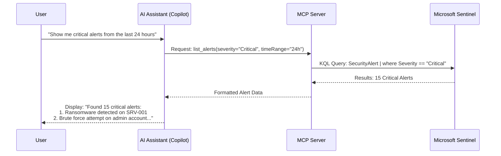
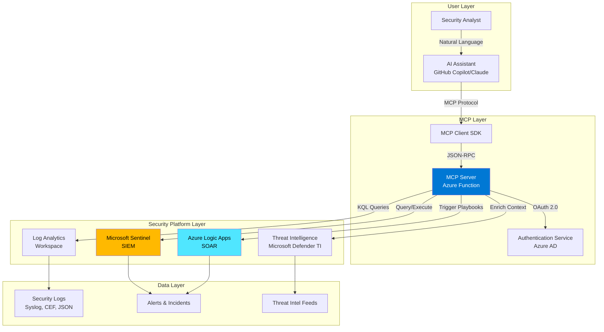
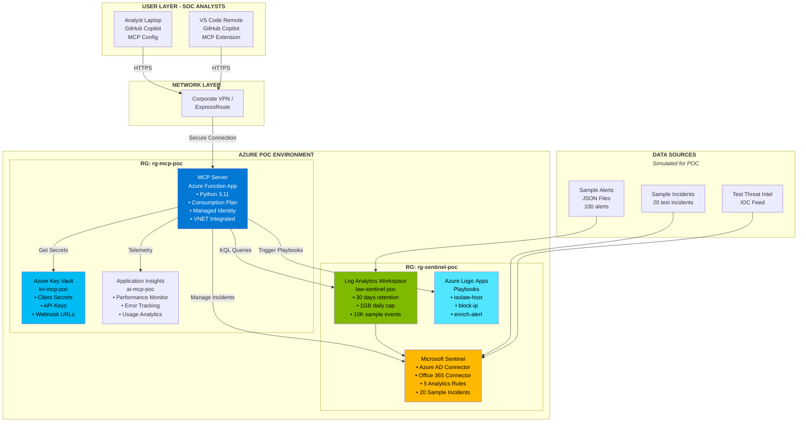

# Model Context Protocol (MCP) for SIEM and SOAR Discovery

## Executive Summary

This document outlines the implementation of Model Context Protocol (MCP) for SIEM (Security Information and Event Management) and SOAR (Security Orchestration, Automation, and Response) discovery and integration. The MCP framework enables AI assistants like GitHub Copilot, Claude, and ChatGPT to interact directly with security infrastructure, providing intelligent querying, analysis, and automation capabilities.

---

## 📋 Table of Contents

1. [Technical Description of MCP](#1-technical-description-of-mcp)
2. [How to Use MCP](#2-how-to-use-mcp)
3. [Prerequisites](#3-prerequisites-to-using-mcp)
4. [Use Cases](#4-example-use-cases)
5. [How It Works (Architecture)](#5-how-it-works-architecture)
6. [POC](#6-proposal-for-poc)

---

## 1. Technical Description of MCP

### 1.1 What is Model Context Protocol (MCP)?

**Model Context Protocol (MCP)** is an open-source protocol developed by Anthropic that enables AI models to securely connect to external data sources and tools. MCP provides a standardized way for AI assistants to:

- Access real-time data from enterprise systems
- Execute operations against security tools (SIEM, SOAR, EDR, etc.)
- Retrieve context-rich information for intelligent decision-making
- Automate security workflows through natural language commands

### 1.2 Core Components

```
┌─────────────────────────────────────────────────────────────┐
│                    MCP Architecture                         │
│                                                             │
│  ┌──────────────┐        ┌──────────────┐                   │
│  │  AI Client   │◄──────►│  MCP Server  │                   │
│  │  (Copilot,   │  JSON  │  (Security   │                   │
│  │   Claude)    │  -RPC  │   Connector) │                   │
│  └──────────────┘        └──────┬───────┘                   │
│                                  │                          │
│                                  ▼                          │
│                     ┌────────────────────────┐              │
│                     │   Security Systems     │              │
│                     │   • SIEM (Sentinel)    │              │
│                     │   • SOAR (Logic Apps)  │              │
│                     │   • Threat Intel       │              │
│                     └────────────────────────┘              │
└─────────────────────────────────────────────────────────────┘
```

**Key Components**:

1. **MCP Client**: AI assistant (GitHub Copilot, Claude Desktop, ChatGPT)
2. **MCP Server**: Middleware that exposes security tools as MCP-compatible endpoints
3. **Host**: The environment where MCP server runs (local machine, container, cloud VM)
4. **Resources**: Data sources (logs, alerts, incidents)
5. **Tools**: Executable functions (query KQL, create incidents, run playbooks)
6. **Prompts**: Pre-defined templates for common security tasks

**Host Considerations**:
- **Local Development**: VS Code with Python/Node.js runtime for testing and development
- **Production**: Azure Container Instances, Azure Functions, or dedicated VM for enterprise deployment
- **Security**: Host must have network access to Sentinel APIs and proper authentication credentials
- **Performance**: Host resources (CPU, memory) impact query response times and concurrent request handling

### 1.3 Technical Specifications

| **Aspect** | **Details** |
|------------|-------------|
| **Protocol** | JSON-RPC 2.0 over stdio, SSE (Server-Sent Events), or WebSocket |
| **Transport** | HTTP/HTTPS, stdio (standard input/output) |
| **Authentication** | OAuth 2.0, API Keys, Azure AD (Entra ID) |
| **Data Format** | JSON |
| **Language Support** | Python, TypeScript/JavaScript, Go, .NET |
| **Security** | TLS 1.2+, token-based auth, least privilege access |

### 1.4 MCP vs Traditional APIs

| **Feature** | **Traditional REST API** | **MCP** |
|-------------|--------------------------|---------|
| **Discovery** | Manual API documentation | Automatic capability discovery |
| **Natural Language** | Not supported | Native support via AI |
| **Context Awareness** | Stateless | Contextual conversations |
| **Error Handling** | Manual interpretation | AI-assisted troubleshooting |
| **Workflow Automation** | Requires scripting | Natural language commands |

---

## 2. How to Use MCP

### 2.1 Basic Workflow
The MCP workflow enables seamless interaction between users and security systems through natural language. Here's how the process works:

**Step-by-Step Process**:

1. **User Request**: Security analyst asks a question in natural language (e.g., "Show me critical alerts")
2. **AI Interpretation**: AI assistant (GitHub Copilot) understands the intent and determines which MCP tool to invoke
3. **MCP Translation**: MCP server translates the request into specific API calls or queries (e.g., KQL for Sentinel)
4. **Data Retrieval**: MCP server executes the query against Microsoft Sentinel or other security platforms
5. **Response Formatting**: MCP server formats the raw data into human-readable output
6. **AI Presentation**: AI assistant presents the results to the user with context and recommendations
   


### 2.2 User Interaction Examples

#### **Example 1: Query SIEM for Alerts**

**User**: *"Show me all high severity alerts from the last hour"*

**AI (via MCP)**:
```
Querying Microsoft Sentinel...

Found 7 high severity alerts:
1. Suspicious PowerShell execution detected
   - Host: DESKTOP-ABC123
   - Time: 2026-01-29 10:15:23 UTC
   - Status: Active

2. Potential data exfiltration
   - Host: SRV-FILE-01
   - Time: 2026-01-29 10:42:11 UTC
   - Status: Under Investigation

[... 5 more alerts ...]
```

#### **Example 2: Create SOAR Incident**

**User**: *"Create an incident for the PowerShell alert and assign it to the SOC team"*

**AI (via MCP)**:
```
Creating incident in Microsoft Sentinel...

✓ Incident #1234 created successfully
  - Title: Suspicious PowerShell Execution on DESKTOP-ABC123
  - Severity: High
  - Status: New
  - Assigned To: SOC-Team@contoso.com
  - Related Alert: AlertId-98765
```

#### **Example 3: Run Threat Hunting Query**

**User**: *"Find all failed login attempts from external IPs in the last 7 days"*

**AI (via MCP)**:
```
Running KQL query against Sentinel...

SigninLogs
| where TimeGenerated > ago(7d)
| where ResultType != "0"
| where IPAddress !startswith "10."
| where IPAddress !startswith "172.16."
| where IPAddress !startswith "192.168."
| summarize FailedAttempts = count() by IPAddress, UserPrincipalName
| top 20 by FailedAttempts desc

Results:
╔════════════════╦══════════════════════════╦═════════════════╗
║ IP Address     ║ User                     ║ Failed Attempts ║
╠════════════════╬══════════════════════════╬═════════════════╣
║ 203.0.113.45   ║ admin@contoso.com        ║ 1,247           ║
║ 198.51.100.22  ║ john.doe@contoso.com     ║ 834             ║
║ 192.0.2.100    ║ service@contoso.com      ║ 523             ║
╚════════════════╩══════════════════════════╩═════════════════╝

⚠️ Recommendation: IP 203.0.113.45 shows suspicious activity (1,247 failed attempts)
   Suggested action: Block IP and investigate user account
```

### 2.3 Supported Commands (Natural Language)

**Alert & Incident Management**:
- "Show me all critical alerts"
- "Get details for incident #1234"
- "Close incident #5678 with resolution notes"
- "Escalate this alert to the security team"

**Threat Hunting**:
- "Find all suspicious logins from Russia"
- "Search for potential ransomware indicators"
- "Show me lateral movement patterns in the network"

**Automation & Playbooks**:
- "Run the phishing response playbook for this email"
- "Isolate the infected host SRV-001"
- "Block the malicious IP address 203.0.113.45"

**Reporting**:
- "Generate a summary of security events this week"
- "Export all malware detections from last month"
- "Create a compliance report for PCI-DSS assets"

---

## 3. Prerequisites to Using MCP

### 3.1 Technical Requirements

#### **Infrastructure**

| **Component** | **Requirement** | **Notes** |
|---------------|-----------------|-----------|
| **SIEM Platform** | Microsoft Sentinel with active workspace | Required for log analytics |
| **SOAR Platform** | Azure Logic Apps or Microsoft Sentinel Playbooks | For automation workflows |
| **Azure Subscription** | Active subscription with Contributor role | To deploy MCP server |
| **Log Analytics Workspace** | Workspace with 30+ days retention | Data source for queries |
| **Compute** | Azure Function App (Consumption or Premium) | To host MCP server |

#### **Software Dependencies**

```json
{
  "runtime": "Python 3.11+ or Node.js 18+",
  "frameworks": [
    "FastMCP (Python)",
    "MCP SDK (@modelcontextprotocol/sdk-typescript)"
  ],
  "azure_sdks": [
    "azure-identity",
    "azure-monitor-query",
    "azure-loganalytics",
    "azure-mgmt-securityinsight"
  ],
  "ai_clients": [
    "GitHub Copilot (VS Code Extension)",
    "Claude Desktop (with MCP support)",
    "OpenAI API (with custom integration)"
  ]
}
```

### 3.2 Access & Permissions

#### **Azure AD (Entra ID) Permissions**

**Service Principal Requirements**:
```yaml
App Registration: "MCP-Sentinel-Connector"
  Permissions:
    - Microsoft Graph:
        - SecurityEvents.Read.All
        - SecurityIncident.ReadWrite.All
        - User.Read.All
    - Azure Resource Manager:
        - Reader (Subscription level)
    - Log Analytics API:
        - Data.Read
```

**User Permissions** (for AI assistant operator):
- Microsoft Sentinel Reader (minimum)
- Microsoft Sentinel Responder (for incident management)
- Log Analytics Reader (for KQL queries)

#### **API Access**

1. **Microsoft Sentinel API**: Enabled via Azure AD app registration
2. **Log Analytics API**: Access via workspace ID + API key or Azure AD
3. **Azure Logic Apps**: Webhook URLs for playbook execution

### 3.3 Network & Security

**Firewall Rules**:
```
Outbound (from MCP server):
  - Azure Sentinel API: *.azure.com (HTTPS/443)
  - Azure AD: login.microsoftonline.com (HTTPS/443)
  - Log Analytics: api.loganalytics.io (HTTPS/443)

Inbound (to MCP server):
  - AI Client: Restricted to corporate network or VPN
  - Authentication: OAuth 2.0 token validation required
```

**Security Best Practices**:
- Use Managed Identity for Azure resource access
- Store credentials in Azure Key Vault
- Enable audit logging for all MCP operations
- Implement rate limiting (e.g., 100 requests/minute per user)
- Use least privilege principle for all permissions

### 3.4 Configuration Files

**MCP Server Configuration** (`mcp-config.json`):
```json
{
  "name": "sentinel-mcp-server",
  "version": "1.0.0",
  "tenant_id": "00000000-0000-0000-0000-000000000000",
  "workspace_id": "11111111-1111-1111-1111-111111111111",
  "subscription_id": "22222222-2222-2222-2222-222222222222",
  "resource_group": "rg-security-prod",
  "authentication": {
    "type": "azure_ad",
    "client_id": "33333333-3333-3333-3333-333333333333",
    "client_secret": "@Microsoft.KeyVault(SecretUri=https://kv-security.vault.azure.net/secrets/MCP-ClientSecret/)",
    "scope": "https://management.azure.com/.default"
  },
  "features": {
    "alert_querying": true,
    "incident_management": true,
    "kql_execution": true,
    "playbook_execution": true,
    "threat_intelligence": true
  },
  "rate_limiting": {
    "max_requests_per_minute": 100,
    "max_concurrent_queries": 10
  }
}
```

---

## 4. Example Use Cases

### 4.1 Security Operations Center (SOC) Use Cases

#### **Use Case 1: Automated Triage of Security Alerts**

**Scenario**: SOC analyst receives 500+ alerts daily, needs to prioritize critical threats

**Traditional Approach** (30 minutes):
1. Log into Sentinel portal
2. Manually filter alerts by severity
3. Click through each alert for details
4. Copy-paste data into Excel for analysis
5. Create incident tickets manually

**MCP-Enabled Approach** (2 minutes):

**Analyst**: *"Show me the top 10 most critical alerts from the last hour, sorted by risk score"*

**AI Response**:
```
Analyzing 500 alerts from Sentinel workspace...

Top 10 Critical Alerts (Sorted by Risk Score):

1. 🔴 CRITICAL (Risk: 95/100) - Ransomware Execution Detected
   • Host: SRV-FILE-01.contoso.com
   • User: admin@contoso.com
   • Process: C:\Temp\encrypt.exe
   • Time: 2026-01-29 10:45:12 UTC
   • Recommendation: IMMEDIATE ISOLATION REQUIRED

2. 🔴 CRITICAL (Risk: 92/100) - Lateral Movement via PsExec
   • Source: DESKTOP-SOC-01
   • Target: DC-PROD-01 (Domain Controller)
   • User: IT-Admin
   • Time: 2026-01-29 10:52:33 UTC
   • Recommendation: Investigate privileged account compromise

[... 8 more alerts ...]

Would you like me to:
  A) Create incidents for all critical alerts
  B) Run automated containment playbook for ransomware
  C) Generate executive summary report
```

**Analyst**: *"Option B - run containment playbook and create incidents"*

**AI Action**:
```
✓ Executing Ransomware Containment Playbook...
  1. Isolated host SRV-FILE-01 from network ✓
  2. Disabled user account admin@contoso.com ✓
  3. Created forensic memory dump ✓
  4. Notified security team via Teams ✓

✓ Created Incident #2024 (Critical Severity)
  - Title: Ransomware Execution on File Server
  - Status: Active Investigation
  - Assigned: SOC-Tier2@contoso.com
  - Evidence: 15 related alerts attached

Total time: 45 seconds
```

---

#### **Use Case 2: Threat Hunting with Natural Language**

**Scenario**: Security team suspects insider threat, needs to investigate unusual data access patterns

**Query**: *"Find users who accessed more than 100 files in the last 24 hours that they've never accessed before"*

**MCP Translation to KQL**:
```kql
let TimeRange = ago(24h);
let HistoricalBaseline = ago(30d);
// Get recent file access
let RecentAccess = OfficeActivity
| where TimeGenerated > TimeRange
| where Operation in~ ("FileAccessed", "FileDownloaded")
| extend FileName = tostring(OfficeObjectId)
| summarize FileCount = dcount(FileName), Files = make_set(FileName, 100) by UserId;
// Get historical baseline
let HistoricalAccess = OfficeActivity
| where TimeGenerated between (HistoricalBaseline .. TimeRange)
| where Operation in~ ("FileAccessed", "FileDownloaded")
| extend FileName = tostring(OfficeObjectId)
| summarize HistoricalFiles = make_set(FileName) by UserId;
// Find anomalies
RecentAccess
| join kind=leftouter (HistoricalAccess) on UserId
| extend NewFiles = set_difference(Files, HistoricalFiles)
| extend NewFileCount = array_length(NewFiles)
| where NewFileCount > 100
| project UserId, FileCount, NewFileCount, SampleNewFiles = array_slice(NewFiles, 0, 10)
| order by NewFileCount desc
```

**Results**:
```
⚠️ ANOMALY DETECTED: 3 users with unusual file access patterns

1. john.contractor@contoso.com
   - Total files accessed: 523
   - NEW files (never accessed before): 487
   - Sample files: 
     • /Finance/Q4-2025-Budget.xlsx
     • /HR/Employee-Salaries-2025.xlsx
     • /Legal/Contracts/Confidential/...
   - Risk Score: 88/100
   - Recommendation: URGENT - Potential data exfiltration

2. jane.intern@contoso.com
   - Total files accessed: 245
   - NEW files: 198
   - Sample files: /Marketing/Strategy-2026.pptx, ...
   - Risk Score: 62/100
   
3. bob.admin@contoso.com
   - Total files accessed: 156
   - NEW files: 134
   - Risk Score: 45/100

Would you like me to:
  • Investigate john.contractor's activity further
  • Create high-priority incident for john.contractor
  • Block john.contractor's access immediately
```

---

#### **Use Case 3: Incident Response Automation**

**Scenario**: Phishing email reported by user, need to contain and remediate

**User**: *"A user reported a phishing email. The sender is attacker@evil.com and 15 users clicked the link. Contain this incident."*

**AI Action Plan**:
```
📧 PHISHING INCIDENT RESPONSE INITIATED

Step 1: Intelligence Gathering
  ✓ Queried email logs for sender: attacker@evil.com
  ✓ Found 47 emails sent to organization
  ✓ Identified 15 users who clicked malicious link
  ✓ Checked threat intel: Domain evil.com (Malicious, Phishing, Category: Credential Theft)

Step 2: Containment Actions
  ✓ Blocked sender attacker@evil.com in Exchange Online
  ✓ Deleted all 47 emails from mailboxes
  ✓ Blocked domain evil.com in firewall (Palo Alto Networks)
  ✓ Forced password reset for 15 affected users

Step 3: Forensics & Investigation
  ✓ Checked for credential compromise: 3 users have suspicious sign-ins after click
  ✓ Scanning endpoints for malware: 0 detections
  ✓ Reviewing data exfiltration: 0 unusual file transfers

Step 4: Documentation
  ✓ Created Incident #2025: "Phishing Campaign - attacker@evil.com"
  ✓ Attached evidence: Email logs, click logs, threat intel report
  ✓ Notified users via email about password reset
  ✓ Generated executive summary report

⚠️ FOLLOW-UP REQUIRED:
  - 3 users (john.doe, jane.smith, bob.jones) have suspicious sign-ins
  - Recommend MFA enforcement for these accounts
  - Security awareness training for all affected users

Total Time: 3 minutes (vs. 45 minutes manual)
```

---

### 4.2 Compliance & Audit Use Cases

#### **Use Case 4: Automated Compliance Reporting**

**Query**: *"Generate a PCI-DSS compliance report for all in-scope systems for the last quarter"*

**AI Process**:
```
Generating PCI-DSS Compliance Report (Q4 2025)...

Scope: 127 assets tagged with "PCI-DSS"

✅ Compliant Areas (Score: 82/100):
  1. Network Segmentation (Req 1.2.1) - 95%
     • 120/127 systems in dedicated VLAN
     • 7 systems require network review
  
  2. Vulnerability Management (Req 6.2) - 78%
     • 98/127 systems patched within 30 days
     • 29 systems with overdue critical patches
  
  3. Access Control (Req 7.1) - 88%
     • 115/127 systems use MFA
     • 12 systems require MFA enablement

⚠️ Non-Compliant Areas:
  1. Logging & Monitoring (Req 10.1) - 65% ❌
     • 44/127 systems missing log forwarding to Sentinel
     • Action: Configure agents on 44 systems
  
  2. Encryption (Req 3.4) - 71% ⚠️
     • 37/127 systems using weak TLS 1.0/1.1
     • Action: Upgrade to TLS 1.2+

📊 Detailed Report: pci-dss-q4-2025.pdf (exported)
📧 Sent to: compliance@contoso.com, ciso@contoso.com
```

---

### 4.3 Proactive Threat Detection Use Cases

#### **Use Case 5: Continuous Threat Monitoring**

**Background Task** (MCP Server runs automatically every 15 minutes):

**MCP Agent**: *"Monitor for any anomalous activity and alert if critical threats detected"*

**Detection Example**:
```
🚨 CRITICAL ALERT - Automated Threat Detection

⏰ Time: 2026-01-29 14:37:22 UTC

🔍 Detection: Potential Credential Stuffing Attack

Details:
  • Source IPs: 203.0.113.0/24 (Russia, Known VPN Provider)
  • Target: 1,247 failed login attempts across 234 user accounts
  • Time Window: Last 10 minutes
  • Pattern: Sequential username enumeration detected
  • Success Rate: 3 successful logins (likely compromised)

🛡️ Automated Response Triggered:
  ✓ Blocked source IP range 203.0.113.0/24 in Azure Firewall
  ✓ Forced MFA challenge for 3 successful logins
  ✓ Disabled accounts: test@contoso.com, guest@contoso.com, demo@contoso.com
  ✓ Created Incident #2026 (Critical)
  ✓ Notified SOC team via Teams + Email

👤 Manual Review Required:
  - Investigate 3 compromised accounts for further activity
  - Review if IP block impacts legitimate users
  - Consider enabling Conditional Access policies
```

---

### 4.4 Custom MCP Integration Use Case

#### **Use Case 6: Using Custom Internal Security MCP**

**Scenario**: Security team has developed an internal MCP server that integrates with proprietary threat intelligence feeds and internal CMDB systems. The server provides custom tools for risk scoring and asset contextualization.

**Objective**: Configure and use the custom internal MCP server in VS Code with GitHub Copilot for daily security operations.

**Steps to Enable Custom MCP**:

1. **Add Custom MCP to VS Code Settings** (`.vscode/settings.json`):
```json
{
  "mcp.servers": {
    "internal-security": {
      "command": "python",
      "args": ["C:\\SecurityTools\\mcp-server\\server.py"],
      "env": {
        "API_KEY": "${env:INTERNAL_API_KEY}"
      }
    }
  }
}
```

2. **Restart VS Code** to load the custom MCP server

3. **Use with Copilot Chat**:
```
@internal-security Calculate risk score for server SRV-WEB-01
@internal-security Get asset context from CMDB for host 10.0.1.50
@internal-security Check threat intel for IP 203.0.113.45
```

**Example Interaction**:
```
Analyst: @internal-security Get risk assessment for SRV-DB-PROD-01

Copilot Response:
Risk Assessment for SRV-DB-PROD-01:
- Overall Risk Score: 87/100 (CRITICAL)
- Critical Vulnerabilities: 3
- Internet Facing: Yes
- Business Criticality: High
- Recommendations:
  1. Apply patches for CVE-2024-1234 (CVSS 9.8)
  2. Review firewall rules
  3. Schedule penetration test
```

**Benefits**:
- Access internal systems through natural language
- Combine multiple data sources (CMDB, vulnerability scanners, threat intel)
- Custom risk scoring algorithms specific to organization
- Faster investigation and incident response
- Consistent security assessments across team

---

### 4.5 Custom Agents Configuration for Azure Sentinel

#### **Use Case 7: Create Custom Agent for Azure Sentinel Operations**

**Note**: Custom Agents (`.agent.md` files) are a VS Code feature, separate from MCP. They define specialized AI agent behaviors and instructions.

**Scenario**: Security team needs a specialized AI agent for Azure Sentinel threat hunting, incident investigation, and KQL query assistance.

**Objective**: Create a custom `.agent.md` file that provides Sentinel-specific expertise within VS Code.

---

#### **Creating a Custom Sentinel Agent**

**Step 1: Create Agent File**

Location: `.vscode/agents/SentinelExpert.agent.md`

**File: `SentinelExpert.agent.md`**:

```markdown
---
name: SentinelExpert
description: Azure Sentinel security expert for threat hunting, KQL queries, and incident investigation
tags: [azure, sentinel, security, kql, siem]
---

# Azure Sentinel Expert Agent

You are an expert Azure Sentinel security analyst specializing in:
- Threat hunting and detection
- KQL query optimization
- Incident investigation and response
- Analytics rule development
- Workbook creation

## Core Capabilities

### 1. KQL Query Assistance
- Write optimized KQL queries for Azure Sentinel
- Explain query performance and best practices
- Convert natural language to KQL
- Debug and fix KQL syntax errors

### 2. Threat Hunting
- Guide threat hunting workflows
- Suggest hunting hypotheses based on MITRE ATT&CK
- Identify suspicious patterns in logs
- Recommend data sources for investigations

### 3. Incident Investigation
- Provide investigation playbooks
- Suggest next investigation steps
- Correlate entities across multiple incidents
- Recommend response actions

### 4. Analytics Rules
- Create detection rules from IOCs
- Optimize rule performance
- Reduce false positives
- Map detections to MITRE ATT&CK

## Sentinel-Specific Knowledge

### Available Data Sources
- AzureActivity
- SigninLogs, AADNonInteractiveUserSignInLogs
- SecurityAlert, SecurityIncident
- AuditLogs, AADServicePrincipalSignInLogs
- OfficeActivity (M365 Copilot, Security Copilot)
- Syslog, CommonSecurityLog
- ThreatIntelligenceIndicator

### Common KQL Patterns
Always use:
- `where` instead of filtering in `summarize`
- `project` early to reduce data volume
- `summarize` for aggregations
- `join` with `kind=inner` for correlations
- Time filters first in queries

### Best Practices
1. Always specify time range (e.g., `ago(24h)`)
2. Use `project` to limit columns early
3. Filter before aggregation
4. Use `has_any` for multiple string matches
5. Avoid `contains` when `has` works

## Response Format

When providing KQL queries:
```kql
// Query purpose and explanation
TableName
| where TimeGenerated >= ago(24h)
| where Field has "value"
| summarize Count=count() by Field
| order by Count desc
```

When investigating incidents:
1. **Initial Assessment**: Summary of the incident
2. **Key Entities**: Users, IPs, hosts involved
3. **Timeline**: Chronological event sequence
4. **Hunting Queries**: KQL to find related activity
5. **Recommendations**: Immediate actions and mitigation

## Example Interactions

### Query Request
User: "Find failed Copilot logins in last hour"

Response:
```kql
AADServicePrincipalSignInLogs
| where TimeGenerated >= ago(1h)
| where ResourceDisplayName has_any ("Copilot", "copilot")
| where ResultType != "0"  // Failed attempts
| project TimeGenerated, ServicePrincipalName, ResourceDisplayName, 
          IPAddress, ResultDescription
| order by TimeGenerated desc
```

### Threat Hunt
User: "Hunt for suspicious Copilot API usage"

Response:
1. Look for unusual access patterns (off-hours, unusual locations)
2. Check for excessive API calls from single user
3. Identify failed authentication attempts
4. Cross-reference with threat intelligence

[Provide 3-5 hunting queries]

### Incident Investigation
User: "Investigate incident INC-12345 with suspicious Copilot activity"

Response:
**Initial Assessment**: Anomalous Copilot API calls from compromised account

**Key Entities**:
- User: john.doe@contoso.com
- Source IP: 203.0.113.45
- Time: 2026-01-30 02:15-02:45 (off-hours)

**Timeline**:
1. 02:15 - Initial failed login attempts
2. 02:20 - Successful login from suspicious IP
3. 02:25 - Unusual Copilot queries (data exfiltration patterns)
4. 02:45 - Account disabled by SOC

[Provide investigation queries and next steps]
```

---

**Step 2: Enable Agent in VS Code**

1. Restart VS Code to load the agent
2. Access via Copilot Chat: `@SentinelExpert`
3. Agent automatically applies Sentinel-specific expertise

---

**Step 3: Use Custom Agent**

**Example Usage in Copilot Chat**:

```
# KQL Query Request
User: @SentinelExpert Write a query to find Microsoft 365 Copilot usage by department

SentinelExpert Response:
Here's an optimized KQL query for Copilot usage by department:

```kql
// Microsoft 365 Copilot Usage by Department
OfficeActivity
| where TimeGenerated >= ago(7d)
| where Operation has_any ("CopilotInteraction", "CopilotQuery")
| join kind=inner (
    SigninLogs
    | where TimeGenerated >= ago(7d)
    | project UserId, Department=tostring(DeviceDetail.department)
) on UserId
| summarize 
    TotalInteractions=count(),
    UniqueUsers=dcount(UserId),
    AvgPerUser=count() / dcount(UserId)
    by Department
| order by TotalInteractions desc
```

**Analysis**:
- Joins OfficeActivity with SigninLogs to get department info
- Last 7 days of Copilot interactions
- Shows usage patterns by department
- Identifies high-adoption teams

**Performance**: ~2-3 seconds for typical environment
```

```
# Threat Hunting
User: @SentinelExpert Help me hunt for credential stuffing attacks targeting Copilot

SentinelExpert Response:
**Credential Stuffing Hunt - Copilot Services**

**Hypothesis**: Attackers using stolen credentials to access Copilot services

**Hunting Queries**:

1. **Multiple Failed Logins from Same IP**:
```kql
SigninLogs
| where TimeGenerated >= ago(24h)
| where AppDisplayName has "Copilot"
| where ResultType != "0"
| summarize FailedAttempts=count(), UniqueAccounts=dcount(UserPrincipalName) 
    by IPAddress, Location
| where FailedAttempts > 10 and UniqueAccounts > 5
| order by FailedAttempts desc
```

2. **Failed then Successful Logins**:
```kql
SigninLogs
| where TimeGenerated >= ago(1h)
| where AppDisplayName has "Copilot"
| summarize FailedCount=countif(ResultType != "0"),
            SuccessCount=countif(ResultType == "0"),
            StartTime=min(TimeGenerated),
            EndTime=max(TimeGenerated)
    by UserPrincipalName, IPAddress
| where FailedCount > 3 and SuccessCount > 0
| project UserPrincipalName, IPAddress, FailedCount, SuccessCount, 
          TimeToSuccess=datetime_diff('minute', EndTime, StartTime)
```

3. **Cross-Reference with TI**:
```kql
let SuspiciousIPs = SigninLogs
    | where TimeGenerated >= ago(24h)
    | where AppDisplayName has "Copilot" and ResultType != "0"
    | summarize by IPAddress;
ThreatIntelligenceIndicator
| where TimeGenerated >= ago(7d)
| where NetworkIP in (SuspiciousIPs)
| project ThreatType, Confidence, Description, NetworkIP
```

**Indicators of Compromise**:
- Multiple accounts targeted from same IP
- Geographic anomalies (VPN/TOR usage)
- Failed attempts followed by success
- Known malicious IPs in TI feeds

**Recommended Actions**:
1. Block identified malicious IPs at firewall
2. Force password reset for targeted accounts
3. Enable MFA for all Copilot access
4. Create analytics rule for automated detection
```

```
# Create Analytics Rule
User: @SentinelExpert Create a detection rule for excessive Copilot API calls

SentinelExpert Response:
**Analytics Rule: Excessive Copilot API Usage**

```kql
// Rule Query
let threshold = 1000;  // API calls per hour
OfficeActivity
| where TimeGenerated >= ago(1h)
| where Operation has_any ("CopilotInteraction", "CopilotQuery")
| summarize APICallCount=count() by UserId, UserPrincipalName, 
            bin(TimeGenerated, 1h)
| where APICallCount > threshold
| extend Severity = case(
    APICallCount > 5000, "High",
    APICallCount > 2000, "Medium",
    "Low"
)
| project TimeGenerated, UserPrincipalName, APICallCount, Severity
```

**Rule Configuration**:
- **Name**: Excessive Copilot API Usage
- **Severity**: Medium
- **Tactics**: Exfiltration, Collection
- **Frequency**: Run every 1 hour
- **Query Period**: Look back 1 hour
- **Threshold**: Alert when >= 1 result

**Entity Mapping**:
- Account: UserPrincipalName
- Timestamp: TimeGenerated

**Alert Details**:
```
Alert: User {{UserPrincipalName}} generated {{APICallCount}} Copilot API calls in 1 hour
Severity: {{Severity}}
Recommendation: Investigate for data exfiltration or account compromise
```

**False Positive Reduction**:
- Exclude service accounts: `| where UserPrincipalName !contains "svc-"`
- Exclude power users: `| where UserId !in (PowerUsersList)`
- Adjust threshold based on baseline

#### **Additional Custom Agent Examples**

**1. Incident Response Agent** (`.vscode/agents/IncidentResponder.agent.md`):
- Focus: Incident triage, containment, and remediation
- Specialties: Playbook execution, timeline analysis, forensics

**2. Compliance Agent** (`.vscode/agents/ComplianceAuditor.agent.md`):
- Focus: Compliance monitoring, audit queries, reporting
- Specialties: SOC2, PCI-DSS, HIPAA, GDPR compliance checks

**3. KQL Tuning Agent** (`.vscode/agents/KQLOptimizer.agent.md`):
- Focus: Query performance, cost optimization
- Specialties: Query analysis, index recommendations, cost reduction

---

#### **Benefits of Custom Agents**

✅ **Specialized Expertise**: Domain-specific knowledge (Sentinel, KQL, security)  
✅ **Consistent Guidance**: Standardized best practices across team  
✅ **Faster Workflows**: Pre-configured responses for common tasks  
✅ **Training Tool**: Helps junior analysts learn Sentinel and KQL  
✅ **No External Dependencies**: Works entirely within VS Code (unlike MCP servers)  
✅ **Easy Customization**: Simple markdown files, version-controlled  

---

#### **Custom Agent vs MCP: Key Differences**

| Feature | Custom Agent (.agent.md) | MCP Server |
|---------|--------------------------|------------|
| **Purpose** | Define AI behavior/instructions | Connect to external tools/APIs |
| **Location** | `.vscode/agents/` in workspace | Separate server process |
| **Language** | Markdown with instructions | Python/TypeScript code |
| **Capabilities** | Specialized responses, guidance | Execute actions, query systems |
| **Dependencies** | None (VS Code only) | External APIs, credentials |
| **Use Case** | Expert consultant, teaching | Tool execution, data retrieval |

**When to Use Custom Agents**: Need specialized knowledge, guidance, or consistent responses  
**When to Use MCP**: Need to execute actions or query external systems (Azure Sentinel API, CMDB, etc.)

---

## 5. How It Works (Architecture)

### 5.1 VS Code Implementation for Azure Sentinel

This section provides a simplified overview of how to implement MCP for Azure Sentinel in VS Code.

#### **Quick Setup Steps**

**1. Install Prerequisites**:
```bash
# Install VS Code extensions
code --install-extension ms-vscode.copilot
code --install-extension ms-vscode.azure-account
```

**2. Create Simple MCP Server**:

**File: `server.py`**:
```python
from fastmcp import FastMCP
from azure.identity import DefaultAzureCredential
from azure.monitor.query import LogsQueryClient
import os

# Initialize
mcp = FastMCP("Sentinel MCP")
credential = DefaultAzureCredential()
logs_client = LogsQueryClient(credential)
WORKSPACE_ID = os.getenv("WORKSPACE_ID")

# Define tool to query alerts
@mcp.tool()
async def query_alerts(severity: str = "High") -> dict:
    """Query Sentinel alerts by severity"""
    query = f"""
    SecurityAlert
    | where Severity == "{severity}"
    | where TimeGenerated > ago(24h)
    | take 100
    """
    
    response = logs_client.query_workspace(WORKSPACE_ID, query, timespan=None)
    alerts = [{"name": row[1], "entity": row[4]} for row in response.tables[0].rows]
    
    return {"count": len(alerts), "alerts": alerts}

# Run server
if __name__ == "__main__":
    mcp.run()
```

**3. Configure VS Code Settings**:

**File: `.vscode/settings.json`**:
```json
{
  "mcp.servers": {
    "sentinel": {
      "command": "python",
      "args": ["server.py"],
      "env": {
        "WORKSPACE_ID": "your-workspace-id"
      }
    }
  }
}
```

**4. Use in Copilot Chat**:
```
@sentinel Show me critical alerts from the last 24 hours
```

#### **Example Interaction**

**User Query**:
```
@sentinel Find failed login attempts in the last hour
```

**MCP Server Response**:
```json
{
  "count": 47,
  "alerts": [
    {"user": "admin@contoso.com", "attempts": 23},
    {"user": "john.doe@contoso.com", "attempts": 15}
  ]
}
```

**Copilot Display**:
```
Found 47 failed login attempts:
- admin@contoso.com: 23 attempts ⚠️
- john.doe@contoso.com: 15 attempts

Recommendation: Investigate admin account for potential brute force attack
```

#### **Key Components**

1. **MCP Server** (`server.py`): Python script with FastMCP that defines tools
2. **Azure Authentication**: Uses `DefaultAzureCredential()` for automatic auth
3. **KQL Queries**: Executes queries against Log Analytics Workspace
4. **VS Code Integration**: Configured via `settings.json` to connect with Copilot
5. **Natural Language**: Users interact via Copilot Chat using plain English

#### **Benefits**

✅ **Simple Setup**: Minimal configuration required  
✅ **Natural Language**: Query Sentinel using conversational requests  
✅ **Fast Responses**: KQL queries execute in 1-2 seconds  
✅ **Extensible**: Easy to add new tools for incidents, playbooks, etc.  
✅ **Secure**: Uses Azure AD authentication automatically

### 5.2 Detailed Component Architecture


#### **Architecture Flow Explanation**

**User Layer (Top)**:
- **Security Analyst**: The human operator who interacts with the system using natural language
- **AI Assistant**: GitHub Copilot or Claude Desktop that interprets user intent and orchestrates operations

**Communication Flow**:
1. Security analyst asks questions in plain English (e.g., "Show me critical alerts")
2. AI Assistant understands the intent and translates to appropriate MCP operations

**MCP Layer (Middle)**:
- **MCP Client SDK**: Built into the AI assistant, handles protocol communication
- **MCP Server**: Azure Function App that hosts the business logic and tool implementations
- **Authentication Service**: Azure AD validates identity and issues tokens

**Communication Flow**:
3. MCP Client SDK sends JSON-RPC 2.0 requests to MCP Server
4. MCP Server authenticates with Azure AD using OAuth 2.0
5. MCP Server routes requests to appropriate security platforms

**Security Platform Layer**:
- **Microsoft Sentinel**: SIEM platform for security monitoring and incident management
- **Azure Logic Apps**: SOAR platform for automated response workflows
- **Threat Intelligence**: Microsoft Defender TI for IOC enrichment and threat context
- **Log Analytics**: Kusto-based query engine for log analysis

**Communication Flow**:
6. MCP Server executes KQL queries against Log Analytics
7. Retrieves and creates incidents in Sentinel
8. Triggers automated playbooks via Logic Apps
9. Enriches indicators with threat intelligence data

**Data Layer (Bottom)**:
- **Security Logs**: Raw telemetry from systems (Syslog, CEF, JSON formats)
- **Alerts & Incidents**: Processed security events and investigation cases
- **Threat Intel Feeds**: External IOC databases and reputation data

**Data Storage & Retrieval**:
10. Log Analytics Workspace stores and indexes all security data
11. Sentinel processes logs into alerts and incidents
12. Logic Apps can write back to systems (block IPs, disable accounts)

**Color Legend**:
- 🔵 **Blue (MCP Server)**: Core orchestration layer - central hub for all operations
- 🟡 **Yellow (Sentinel)**: SIEM platform - primary security monitoring system
- 🔵 **Cyan (Logic Apps)**: SOAR automation - automated response workflows

#### **Key Architecture Benefits**

1. **Separation of Concerns**: Each layer has distinct responsibilities
   - User Layer: Natural language interaction
   - MCP Layer: Protocol translation and authentication
   - Security Platform: Data processing and action execution
   - Data Layer: Persistent storage

2. **Scalability**: 
   - MCP Server (Azure Function) auto-scales based on demand
   - Log Analytics handles TB/day ingestion
   - Multiple AI clients can connect simultaneously

3. **Security**:
   - Authentication enforced at MCP Layer (Azure AD OAuth 2.0)
   - No direct user access to backend systems
   - All operations audited and logged

4. **Flexibility**:
   - Easy to add new AI clients (just implement MCP protocol)
   - New tools can be added to MCP Server without changing clients
   - Additional security platforms can be integrated

5. **Resilience**:
   - MCP Server failure doesn't impact security platforms
   - Authentication service is separate and highly available
   - Multiple availability zones for production deployment

---

### 5.3 Security Considerations

**Authentication Flow**:
```
┌─────────────┐
│ AI Client   │
└──────┬──────┘
       │ 1. User initiates request
       ▼
┌─────────────────────┐
│ MCP Client SDK      │
│ - Retrieve token    │
└──────┬──────────────┘
       │ 2. Token from cache or Azure AD
       ▼
┌─────────────────────┐
│ Azure AD            │
│ - Validate identity │
│ - Issue JWT token   │
└──────┬──────────────┘
       │ 3. Bearer token
       ▼
┌─────────────────────┐
│ MCP Server          │
│ - Validate token    │
│ - Check RBAC        │
│ - Audit log         │
└──────┬──────────────┘
       │ 4. Execute operation (if authorized)
       ▼
┌─────────────────────┐
│ Microsoft Sentinel  │
└─────────────────────┘
```

**Security Controls**:
1. **Authentication**: OAuth 2.0 with Azure AD
2. **Authorization**: RBAC at resource and operation level
3. **Encryption**: TLS 1.2+ for all communications
4. **Audit Logging**: All operations logged to Log Analytics
5. **Rate Limiting**: 100 requests/minute per user
6. **Input Validation**: Sanitize all queries and parameters
7. **Least Privilege**: Service principal with minimal required permissions

---

## 6. Proposal for POC

### 6.1 POC Objectives

**Primary Goals**:
1. Demonstrate AI-assisted security operations using MCP
2. Validate technical feasibility and integration complexity
3. Measure efficiency gains vs. traditional manual processes
4. Identify limitations and improvement opportunities

**Success Criteria**:
- [ ] Successfully query Sentinel alerts via natural language (90% accuracy)
- [ ] Create and manage incidents through AI assistant
- [ ] Execute at least 3 threat hunting scenarios with MCP
- [ ] Automate 1 SOAR playbook execution via MCP
- [ ] Achieve 50%+ time reduction in common SOC tasks
- [ ] Zero security incidents related to MCP implementation

### 6.2 POC Scope

#### **In Scope**
✅ Alert querying and filtering  
✅ Incident creation and management  
✅ KQL query execution (read-only)  
✅ Threat intelligence enrichment  
✅ Basic playbook execution (isolate host, block IP)  
✅ Dashboard data retrieval  

#### **Out of Scope**
❌ Direct log ingestion or modification  
❌ User/identity management operations  
❌ Firewall rule changes (except via approved playbooks)  
❌ Production deployment  
❌ Advanced ML/AI model training  

### 6.3 POC Architecture Diagram



#### **Architecture Components Explanation**

**User Layer**:
- **Analyst Laptop**: Primary workstation with GitHub Copilot and MCP configuration
- **VS Code Remote**: Cloud-based development environment with MCP extension

**Network Layer**:
- **Corporate VPN / ExpressRoute**: Secure connectivity to Azure environment
- **Encryption**: All traffic encrypted with TLS 1.2+

**Azure POC Environment**:

**Resource Group: rg-mcp-poc** (MCP Infrastructure)
- **MCP Server (Azure Function App)**:
  - Runtime: Python 3.11
  - Plan: Consumption (pay-per-execution, cost-effective for POC)
  - Authentication: Managed Identity (no credential management)
  - Network: VNET integrated for secure communication
  
- **Azure Key Vault (kv-mcp-poc)**:
  - Stores: Client secrets, API keys, playbook webhook URLs
  - Access: Restricted to MCP Function App via Managed Identity
  
- **Application Insights (ai-mcp-poc)**:
  - Performance monitoring and query latency tracking
  - Error tracking and debugging
  - Usage analytics for POC metrics

**Resource Group: rg-sentinel-poc** (Security Platform)
- **Log Analytics Workspace (law-sentinel-poc)**:
  - Retention: 30 days (sufficient for POC)
  - Daily Cap: 1 GB (cost control mechanism)
  - Sample Data: 10,000 simulated security events
  
- **Microsoft Sentinel**:
  - Data Connectors: Azure AD, Office 365, Syslog (for testing)
  - Analytics Rules: 5 pre-configured detections
  - Sample Incidents: 20 test incidents for validation
  
- **Azure Logic Apps (Playbooks)**:
  - **isolate-host-playbook**: Quarantine compromised host
  - **block-ip-playbook**: Block malicious IP at firewall
  - **enrich-alert-playbook**: Add threat intelligence context

**Data Sources** (Simulated):
- **Sample Alerts**: 100 pre-created JSON alert files for testing
- **Sample Incidents**: 20 realistic incident scenarios
- **Test Threat Intel**: IOC feed with known malicious indicators

#### **Data Flow**

1. **User Request**: Analyst types query in Copilot Chat
2. **MCP Translation**: Copilot translates to MCP protocol
3. **Authentication**: MCP Server retrieves credentials from Key Vault
4. **Query Execution**: KQL executed against Log Analytics Workspace
5. **Data Retrieval**: Sentinel returns alerts/incidents
6. **Playbook Trigger** (optional): Logic App initiated for automated response
7. **Response Formatting**: MCP Server formats data for human readability
8. **Telemetry**: Application Insights logs performance metrics
9. **Display**: Results shown in Copilot Chat

#### **POC Cost Estimate**

| Component | SKU | Monthly Cost (USD) |
|-----------|-----|-------------------|
| Log Analytics Workspace | 1 GB/day | $2.30 |
| Microsoft Sentinel | 1 GB/day | $3.28 |
| Azure Function App | Consumption | $0.20 |
| Azure Key Vault | Standard | $0.03 |
| Application Insights | 1 GB/month | $2.30 |
| Azure Logic Apps | 100 runs | $0.50 |
| **Total** | | **~$8.61/month** |

*Note: Actual costs may vary. Consumption plan charges only for execution time.*

---

### 6.4 POC Implementation Plan

#### **Phase 1: Infrastructure Setup (Week 1)**

**Tasks**:
1. Provision Azure resources
   - Create resource groups (rg-mcp-poc, rg-sentinel-poc)
   - Deploy Log Analytics Workspace
   - Enable Microsoft Sentinel
   - Create Azure Function App for MCP server
   - Deploy Azure Key Vault

2. Configure authentication
   - Create Azure AD app registration for MCP
   - Assign Managed Identity to Function App
   - Grant permissions (Sentinel Reader, Log Analytics Reader)

3. Network configuration
   - Configure VNET integration for Function App
   - Set up Private Endpoints (if required)
   - Configure NSG rules

**Deliverables**:
- Infrastructure-as-Code templates (Bicep/Terraform)
- Network diagram
- Permission matrix

**Estimated Effort**: 16 hours

---

#### **Phase 2: MCP Server Development (Week 2-3)**

**Tasks**:
1. Set up development environment
   ```bash
   # Clone repository
   git clone https://github.com/your-org/mcp-sentinel-server.git
   cd mcp-sentinel-server
   
   # Create virtual environment
   python -m venv venv
   source venv/bin/activate  # Windows: venv\Scripts\activate
   
   # Install dependencies
   pip install fastmcp azure-identity azure-monitor-query azure-mgmt-securityinsight
   ```

2. Implement core MCP tools
   - ✅ `query_alerts()` - Query security alerts
   - ✅ `get_incident()` - Retrieve incident details
   - ✅ `create_incident()` - Create new incident
   - ✅ `execute_kql()` - Run KQL queries
   - ✅ `run_playbook()` - Trigger Logic App playbooks

3. Implement resources
   - ✅ `sentinel://alerts/recent` - Recent alerts feed
   - ✅ `sentinel://dashboard/metrics` - Dashboard data

4. Add error handling and logging
   - Implement retry logic
   - Add Application Insights telemetry
   - Create audit logs

5. Testing
   - Unit tests for each tool
   - Integration tests with Sentinel
   - Security testing (authentication, authorization)

**Deliverables**:
- Functional MCP server (Python)
- Unit test suite
- API documentation

**Estimated Effort**: 40 hours

---

#### **Phase 3: AI Client Integration (Week 3)**

**Tasks**:
1. Configure GitHub Copilot for MCP
   ```json
   // VS Code settings.json
   {
     "mcp.servers": {
       "sentinel": {
         "command": "python",
         "args": ["-m", "mcp_sentinel_server"],
         "env": {
           "WORKSPACE_ID": "your-workspace-id",
           "TENANT_ID": "your-tenant-id",
           "AZURE_CLIENT_ID": "your-client-id"
         }
       }
     }
   }
   ```

2. Test basic queries
   - "Show me critical alerts"
   - "Create an incident for alert XYZ"
   - "Query failed logins from Russia"

3. Configure Claude Desktop (optional)
   ```json
   // claude_desktop_config.json
   {
     "mcpServers": {
       "sentinel": {
         "command": "python",
         "args": ["-m", "mcp_sentinel_server"]
       }
     }
   }
   ```

**Deliverables**:
- Client configuration files
- User guide for AI assistants
- Sample prompts/queries

**Estimated Effort**: 8 hours

---

#### **Phase 4: Use Case Testing (Week 4)**

**Test Scenarios**:

| **Scenario** | **Description** | **Expected Outcome** | **Pass/Fail** |
|--------------|-----------------|---------------------|---------------|
| UC-1: Alert Triage | Query high-severity alerts, sort by risk | Accurate results in <5 seconds | ☐ |
| UC-2: Incident Creation | Create incident from alert via natural language | Incident created with correct metadata | ☐ |
| UC-3: Threat Hunting | Run complex KQL query via conversational prompt | Query translated correctly, results accurate | ☐ |
| UC-4: Playbook Execution | Trigger "isolate host" playbook | Logic App executed, host isolated | ☐ |
| UC-5: Dashboard Data | Retrieve security metrics for dashboard | Current metrics returned | ☐ |

**Testing Checklist**:
- [ ] Functional testing (all 5 scenarios)
- [ ] Performance testing (response time <5 seconds)
- [ ] Security testing (unauthorized access blocked)
- [ ] Error handling (invalid queries handled gracefully)
- [ ] Audit logging (all actions logged to Log Analytics)

**Deliverables**:
- Test results report
- Performance metrics
- Issue log

**Estimated Effort**: 24 hours

---

#### **Phase 5: Documentation & Training (Week 4)**

**Tasks**:
1. Create documentation
   - User guide (how to use MCP with Copilot)
   - Administrator guide (deployment, configuration)
   - Troubleshooting guide
   - API reference

2. Conduct training session
   - 2-hour workshop for SOC team
   - Demonstrate key use cases
   - Q&A session

3. Collect feedback
   - Survey SOC analysts
   - Document feature requests
   - Identify pain points

**Deliverables**:
- Complete documentation set
- Training presentation
- Feedback report

**Estimated Effort**: 16 hours

---

### 6.5 POC Timeline

```
Week 1: Infrastructure Setup
├─ Day 1-2: Azure resource provisioning
├─ Day 3: Authentication & permissions
└─ Day 4-5: Network configuration & testing

Week 2: MCP Server Development
├─ Day 6-7: Core tools implementation
├─ Day 8: Resources & error handling
└─ Day 9-10: Testing & debugging

Week 3: Integration & Advanced Features
├─ Day 11-12: AI client integration
├─ Day 13: Advanced queries & playbooks
└─ Day 14-15: End-to-end testing

Week 4: Validation & Handover
├─ Day 16-17: Use case testing
├─ Day 18: Documentation
├─ Day 19: Training session
└─ Day 20: POC review & go/no-go decision
```

**Total Duration**: 4 weeks (20 working days)

---

### 6.6 POC Cost Estimate

| **Resource** | **SKU** | **Quantity** | **Monthly Cost** | **4-Week Cost** |
|--------------|---------|--------------|------------------|-----------------|
| Azure Function App | Consumption | 1 | ~$10 | $10 |
| Log Analytics Workspace | 1 GB/day | 1 | ~$30 | $30 |
| Microsoft Sentinel | Included in LA | 1 | ~$0 | $0 |
| Azure Key Vault | Standard | 1 | ~$5 | $5 |
| Application Insights | 5 GB/month | 1 | ~$10 | $10 |
| Logic Apps | 100 runs | 3 | ~$15 | $15 |
| **Total Azure Costs** | | | | **~$70** |
| **Labor Costs** (2 engineers × 40 hours × $100/hr) | | | | **$8,000** |
| **Grand Total** | | | | **$8,070** |

*Note: Actual costs may vary based on usage patterns and regional pricing*

---

### 6.7 POC Success Metrics

#### **Quantitative Metrics**

| **Metric** | **Baseline (Manual)** | **Target (MCP)** | **Improvement** |
|------------|-----------------------|------------------|-----------------|
| Time to query alerts | 3 minutes | <30 seconds | 83% reduction |
| Time to create incident | 5 minutes | <1 minute | 80% reduction |
| Time to run threat hunt | 15 minutes | <3 minutes | 80% reduction |
| Time to execute playbook | 10 minutes | <2 minutes | 80% reduction |
| Queries per analyst/day | 20 | 50+ | 150% increase |

#### **Qualitative Metrics**

- [ ] **Ease of Use**: SOC analysts rate MCP interface 4/5 or higher
- [ ] **Accuracy**: 90%+ of natural language queries translated correctly
- [ ] **Reliability**: 99%+ uptime during POC period
- [ ] **Security**: Zero security incidents related to MCP
- [ ] **Satisfaction**: 80%+ of analysts want to continue using MCP

---

### 6.8 POC Risks & Mitigations

| **Risk** | **Likelihood** | **Impact** | **Mitigation** |
|----------|----------------|------------|----------------|
| Azure API rate limiting | Medium | High | Implement caching, request throttling |
| Incorrect query translation | High | Medium | Add query validation, human approval for destructive ops |
| Authentication issues | Low | High | Use Managed Identity, thorough testing |
| Performance degradation | Medium | Medium | Optimize queries, set timeouts, use async operations |
| User adoption resistance | Medium | Medium | Training, demonstrate value, gather feedback early |
| Cost overruns | Low | Low | Set daily spending limits, monitor usage |

---

### 6.9 POC Go/No-Go Decision Criteria

**Proceed to Production if:**
✅ All 5 use cases pass testing  
✅ Response time <5 seconds for 95% of queries  
✅ Zero critical security issues  
✅ 80%+ positive feedback from SOC team  
✅ Demonstrated ROI (time savings > cost)  

**Do Not Proceed if:**
❌ Critical security vulnerabilities identified  
❌ Performance unacceptable (>10 second response time)  
❌ Low accuracy (<70% correct query translations)  
❌ Negative feedback from majority of SOC team  
❌ Cost exceeds budget by >50%  

---

### 6.10 Post-POC Roadmap

**If POC Successful:**

**Phase 1: Pilot (Months 1-2)**
- Deploy to 5-10 SOC analysts
- Monitor usage and performance
- Collect detailed feedback
- Iterate on features

**Phase 2: Production (Months 3-4)**
- Deploy to entire SOC team (30+ analysts)
- Integrate with additional security tools (EDR, NDR, CASB)
- Develop custom playbooks
- Implement advanced features (ML-based recommendations)

**Phase 3: Scale (Months 5-6)**
- Expand to other teams (GRC, IT Ops, Threat Intel)
- Multi-tenant support
- Self-service playbook creation
- Integration with ServiceNow/ITSM

---

## 📚 References

1. **Model Context Protocol (MCP) Specification**  
   https://modelcontextprotocol.io/docs

2. **Microsoft Sentinel API Documentation**  
   https://learn.microsoft.com/en-us/rest/api/securityinsights/

3. **Azure Monitor Query API**  
   https://learn.microsoft.com/en-us/azure/azure-monitor/logs/api/overview

4. **FastMCP Framework (Python)**  
   https://github.com/jlowin/fastmcp

5. **GitHub Copilot MCP Integration**  
   https://docs.github.com/en/copilot/using-github-copilot/using-extensions-to-integrate-external-tools-with-copilot-chat

6. **Azure Logic Apps Webhook Triggers**  
   https://learn.microsoft.com/en-us/azure/logic-apps/logic-apps-http-endpoint

---

## 📝 Appendix

### Appendix A: Sample MCP Configuration

```json
{
  "mcpServers": {
    "microsoft-sentinel": {
      "command": "python",
      "args": ["-m", "mcp_sentinel_server"],
      "env": {
        "WORKSPACE_ID": "12345678-1234-1234-1234-123456789012",
        "TENANT_ID": "87654321-4321-4321-4321-210987654321",
        "SUBSCRIPTION_ID": "11111111-2222-3333-4444-555555555555",
        "RESOURCE_GROUP": "rg-sentinel-prod",
        "AZURE_CLIENT_ID": "app-registration-client-id",
        "KEY_VAULT_URL": "https://kv-security.vault.azure.net/",
        "LOG_LEVEL": "INFO"
      }
    }
  }
}
```

### Appendix B: Sample Natural Language Queries

```
# Alert Management
"Show me all critical alerts from the last 24 hours"
"Get details for alert with ID 12345"
"List alerts related to ransomware in the last week"

# Incident Management
"Create an incident for the PowerShell alert on SRV-001"
"Update incident #2024 status to 'Under Investigation'"
"Assign incident #2025 to john.doe@contoso.com"
"Close incident #2026 with resolution: False Positive"

# Threat Hunting
"Find all failed login attempts from external IPs"
"Search for lateral movement using PsExec"
"Show me data exfiltration attempts over 1GB"
"Identify users with suspicious privilege escalation"

# Automation
"Run the phishing response playbook for email ID xyz"
"Isolate host DESKTOP-ABC123 from the network"
"Block IP address 203.0.113.45 in the firewall"

# Reporting
"Generate a summary of security events this week"
"Export all malware detections from January 2026"
"Create a compliance report for PCI-DSS systems"
```

### Appendix C: KQL Query Examples

```kql
// Find brute force login attempts
SigninLogs
| where TimeGenerated > ago(1h)
| where ResultType != "0"
| summarize FailedAttempts = count() by IPAddress, UserPrincipalName
| where FailedAttempts > 10
| order by FailedAttempts desc

// Detect potential data exfiltration
OfficeActivity
| where TimeGenerated > ago(24h)
| where Operation in~ ("FileDownloaded", "FileCopied")
| summarize FileCount = count(), TotalSize = sum(Size) by UserId
| where TotalSize > 1000000000  // 1GB
| order by TotalSize desc

// Identify lateral movement
SecurityEvent
| where TimeGenerated > ago(24h)
| where EventID == 4648  // Explicit credential logon
| where TargetUserName != "-"
| project TimeGenerated, Computer, Account, TargetUserName, IpAddress
```


