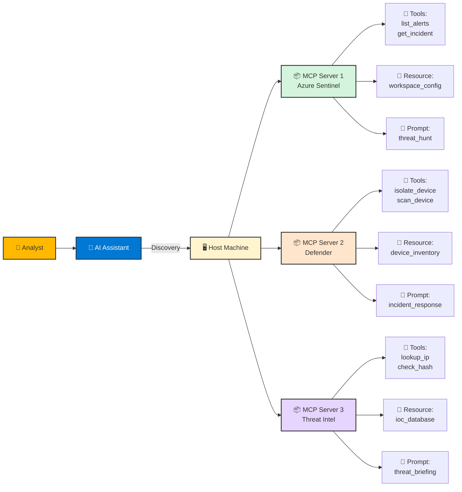
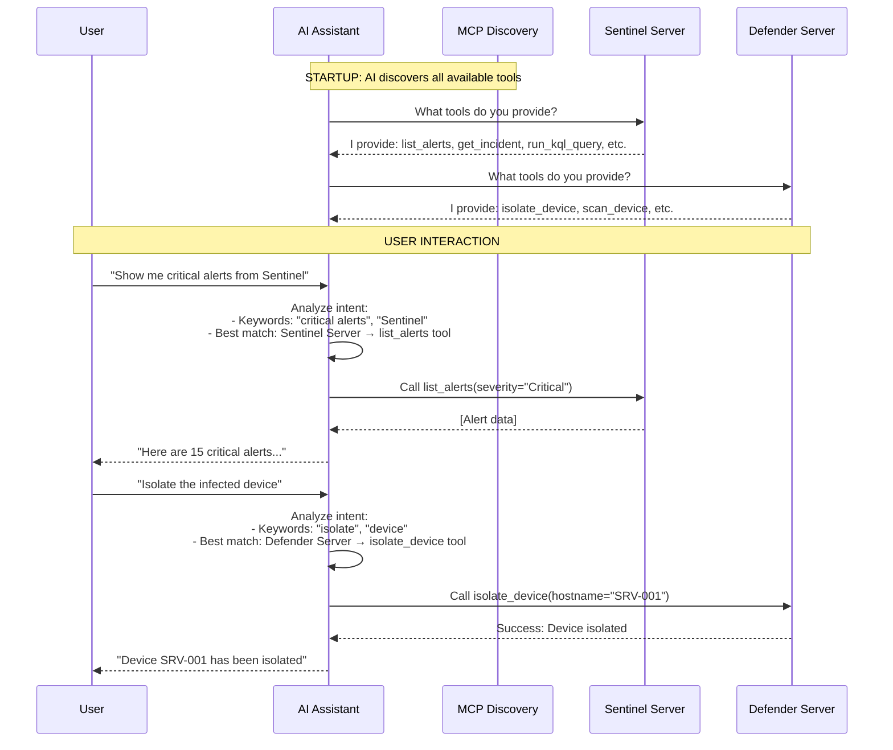
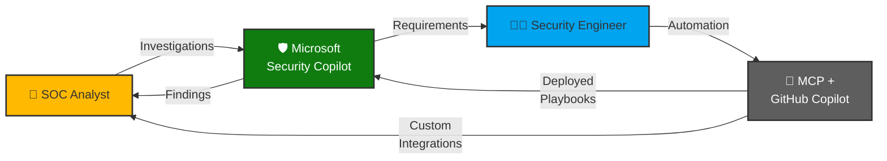
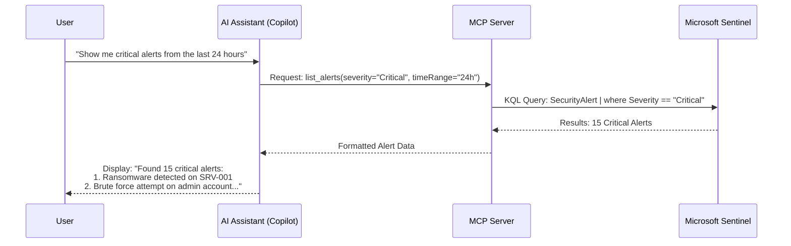
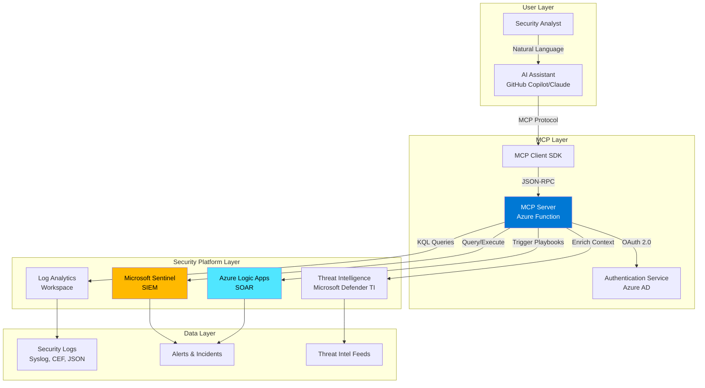
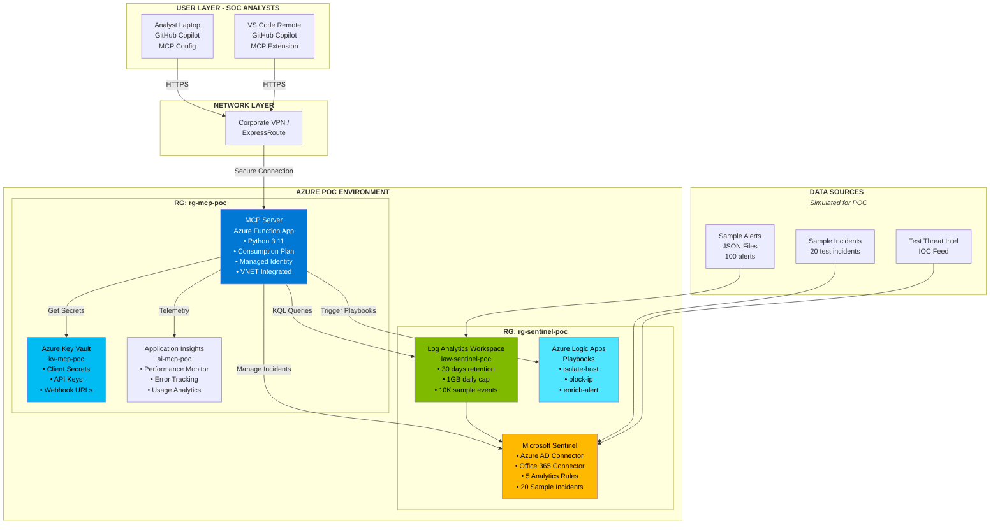
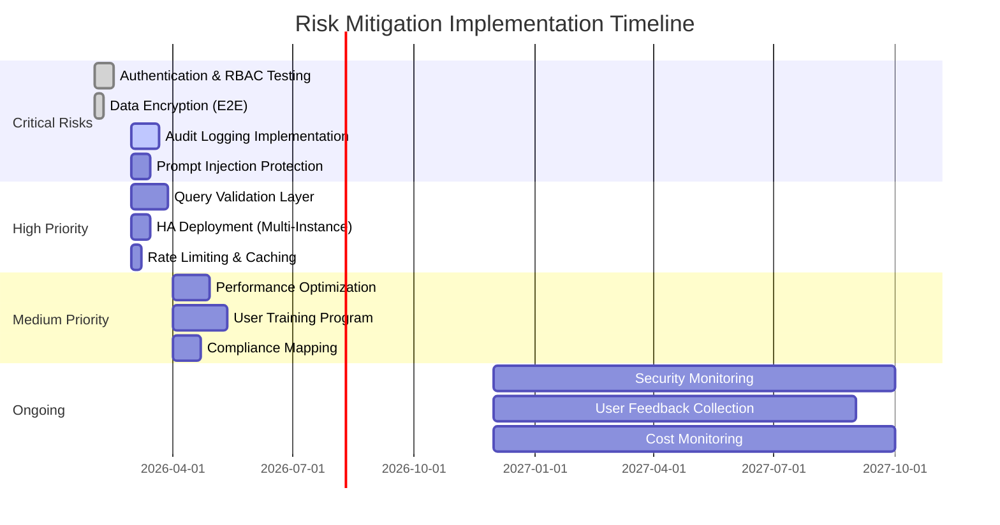

# Model Context Protocol (MCP) for SIEM and SOAR Discovery

## Executive Summary

This document outlines the implementation of Model Context Protocol (MCP) for SIEM (Security Information and Event Management) and SOAR (Security Orchestration, Automation, and Response) discovery and integration. The MCP framework enables AI assistants like GitHub Copilot, Claude, and ChatGPT to interact directly with security infrastructure, providing intelligent querying, analysis, and automation capabilities.

**Document Version**: 1.0  
**Date**: January 29, 2026  
**Owner**: Security Engineering Team

---

## 📋 Table of Contents

1. [Technical Description of MCP](#1-technical-description-of-mcp)
   - 1.1 What is Model Context Protocol (MCP)?
   - 1.2 Core Components
   - 1.3 Technical Specifications
   - 1.4 MCP vs Traditional APIs
   - 1.5 MCP vs Microsoft Security Copilot

2. [How to Use MCP](#2-how-to-use-mcp)
   - 2.1 Basic Workflow
   - 2.2 User Interaction Examples
   - 2.3 Supported Commands (Natural Language)

3. [Prerequisites to Using MCP](#3-prerequisites-to-using-mcp)
   - 3.1 Technical Requirements
   - 3.2 Access & Permissions
   - 3.3 Network & Security
   - 3.4 Configuration Files

4. [Example Use Cases](#4-example-use-cases)
   - 4.1 Security Operations Center (SOC) Use Cases
   - 4.2 Compliance & Audit Use Cases
   - 4.3 Proactive Threat Detection Use Cases
   - 4.4 Custom MCP Integration Use Case
   - 4.5 Microsoft Security Exposure Management (MSEM) Integration
   - 4.6 Custom Agents Configuration for Azure Sentinel

5. [How It Works (Architecture)](#5-how-it-works-architecture)
   - 5.1 VS Code Implementation for Azure Sentinel
   - 5.2 Detailed Component Architecture
   - 5.3 Security Considerations

6. [Proposal for POC](#6-proposal-for-poc)
   - 6.1 POC Objectives
   - 6.2 POC Scope
   - 6.3 POC Architecture Diagram
   - 6.4 POC Implementation Plan
   - 6.5 POC Timeline
   - 6.6 POC Cost Estimate
   - 6.7 POC Success Metrics
   - 6.8 POC Risks & Mitigations

7. [ROI Analysis](#7-roi-analysis)
   - 7.1 Executive Summary
   - 7.2 Cost Analysis
   - 7.3 Benefit Analysis
   - 7.4 ROI Calculation
   - 7.5 Break-Even Analysis
   - 7.6 Cost-Benefit Comparison
   - 7.7 Risk-Adjusted ROI
   - 7.8 Intangible Benefits
   - 7.9 ROI by Stakeholder
   - 7.10 Recommendation

8. [Risk, Gaps and Mitigation](#8-risk-gaps-and-mitigation)
   - 8.1 Technical Risks
   - 8.2 Operational Risks
   - 8.3 Security Risks
   - 8.4 Compliance & Governance Risks
   - 8.5 Business Continuity Risks
   - 8.6 Identified Gaps & Remediation Plan
   - 8.7 Risk Mitigation Timeline
   - 8.8 Risk Acceptance Statement

9. [Conclusion & Recommendations](#9-conclusion--recommendations)
   - 9.1 Executive Summary
   - 9.2 Recommendation: PROCEED with Phased Implementation
   - 9.3 Strategic Rationale
   - 9.4 Critical Success Factors
   - 9.5 Decision Framework
   - 9.6 Alternative Approaches Considered
   - 9.7 Next Steps & Action Items
   - 9.8 Final Recommendation

10. [References](#-references)
    - Appendix A: Sample MCP Configuration
    - Appendix B: Sample Natural Language Queries
    - Appendix C: KQL Query Examples

---

## 1. Technical Description of MCP

### 1.1 What is Model Context Protocol (MCP)?

**Model Context Protocol (MCP)** is an open-source protocol developed by Anthropic that enables AI models to securely connect to external data sources and tools. MCP provides a standardized way for AI assistants to:

- Access real-time data from enterprise systems
- Execute operations against security tools (SIEM, SOAR, EDR, etc.)
- Retrieve context-rich information for intelligent decision-making
- Automate security workflows through natural language commands

### 1.2 Core Components

```
┌─────────────────────────────────────────────────────────────┐
│                    MCP Architecture                         │
│                                                             │
│  ┌──────────────┐        ┌──────────────┐                 │
│  │  AI Client   │◄──────►│  MCP Server  │                 │
│  │  (Copilot,   │  JSON  │  (Security   │                 │
│  │   Claude)    │  -RPC  │   Connector) │                 │
│  └──────────────┘        └──────┬───────┘                 │
│                                  │                          │
│                                  ▼                          │
│                     ┌────────────────────────┐             │
│                     │   Security Systems     │             │
│                     │   • SIEM (Sentinel)    │             │
│                     │   • SOAR (Logic Apps)  │             │
│                     │   • Threat Intel       │             │
│                     └────────────────────────┘             │
└─────────────────────────────────────────────────────────────┘
```

**Key Components**:

1. **MCP Client**: AI assistant (GitHub Copilot, Claude Desktop, ChatGPT)
2. **MCP Server**: Middleware that exposes security tools as MCP-compatible endpoints
3. **Host**: The environment where MCP server runs (local machine, container, cloud VM)
4. **Resources**: Data sources (logs, alerts, incidents)
5. **Tools**: Executable functions (query KQL, create incidents, run playbooks)
6. **Prompts**: Pre-defined templates for common security tasks

---

#### **🔍 Understanding MCP Servers, Hosts, and Tools (Workflows)**

**IMPORTANT CLARIFICATION**: This section addresses common confusion about how MCP servers expose multiple tools/workflows.

##### **What is a "Host"?**
- A **host** is the physical or virtual machine where an MCP server process runs
- Examples: Your laptop, a Docker container, an Azure VM, a cloud function
- One host can run **multiple MCP server processes** simultaneously
- Each MCP server is a separate program/process with its own configuration

##### **What is an "MCP Server"?**
- An **MCP server** is a running program that implements the Model Context Protocol
- It exposes **multiple capabilities** (tools, resources, prompts) to AI clients
- Each server specializes in one domain (e.g., "Sentinel Server", "Defender Server", "Threat Intel Server")
- Multiple servers can coexist on the same host

**Real-World Examples**:

**Example 1: Azure Sentinel MCP Server**
```
Program Name: azure-sentinel-mcp-server.py
Purpose: Connects AI to Microsoft Sentinel
Capabilities Exposed:
  ├── Tools (Functions):
  │   ├── list_incidents() - Get all security incidents
  │   ├── get_incident_details(id) - Get specific incident info
  │   ├── create_incident() - Create new incident
  │   ├── run_kql_query() - Execute KQL queries
  │   └── get_analytics_rules() - List detection rules
  ├── Resources (Data):
  │   ├── workspace://config - Workspace configuration
  │   ├── workspace://tables - Available log tables
  │   └── incidents://active - Real-time incident feed
  └── Prompts (Templates):
      ├── "Investigate ransomware incident"
      ├── "Hunt for lateral movement"
      └── "Generate compliance report"
```

**Example 2: Microsoft Defender MCP Server**
```
Program Name: defender-xdr-mcp-server.py
Purpose: Connects AI to Microsoft Defender XDR
Capabilities Exposed:
  ├── Tools (Functions):
  │   ├── list_devices() - Get device inventory
  │   ├── isolate_device(device_id) - Quarantine compromised device
  │   ├── run_av_scan(device_id) - Start antivirus scan
  │   ├── advanced_hunting(query) - Run hunting query
  │   └── get_exposure_score() - Get security exposure metrics
  ├── Resources (Data):
  │   ├── devices://inventory - All managed devices
  │   ├── alerts://active - Active security alerts
  │   └── vulnerabilities://critical - Critical CVEs
  └── Prompts (Templates):
      ├── "Investigate phishing email"
      ├── "Assess exposure to CVE-2024-1234"
      └── "Generate device security report"
```

**Example 3: Threat Intelligence MCP Server**
```
Program Name: threat-intel-mcp-server.py
Purpose: Connects AI to threat intelligence sources
Capabilities Exposed:
  ├── Tools (Functions):
  │   ├── lookup_ip(address) - Check IP reputation
  │   ├── check_hash(file_hash) - Verify file hash
  │   ├── get_domain_info(domain) - Domain threat data
  │   ├── query_mitre_attack() - MITRE ATT&CK framework
  │   └── get_threat_campaigns() - Active threat campaigns
  ├── Resources (Data):
  │   ├── feeds://iocs - Indicators of compromise
  │   ├── intel://apt-groups - APT group profiles
  │   └── cve://recent - Recent vulnerability disclosures
  └── Prompts (Templates):
      ├── "Analyze suspicious IP behavior"
      ├── "Map attack to MITRE ATT&CK"
      └── "Generate threat briefing"
```

**How AI Uses These Servers**:

When you ask: *"Show me critical Sentinel incidents and check if any devices are compromised"*

```
1. AI identifies two servers needed:
   ├── Azure Sentinel MCP Server → list_incidents(severity="Critical")
   └── Microsoft Defender MCP Server → list_devices(status="Compromised")

2. AI calls both servers in parallel

3. Results combined and presented:
   "Found 3 critical incidents:
    - Ransomware on SRV-001 (Incident #1234)
    - Data exfiltration from DB-PROD-02 (Incident #1235)
    - Suspicious PowerShell on WKS-045 (Incident #1236)
    
    Device Status:
    - SRV-001: Isolated (compromised)
    - DB-PROD-02: Active investigation
    - WKS-045: Scanning in progress"
```

**Think of MCP Servers Like APIs, But Smarter**:
- **Traditional API**: You call `GET /api/incidents?severity=critical` (must know exact endpoint)
- **MCP Server**: You say *"show critical incidents"* → AI figures out which tool to call

##### **How Are Tools/Workflows Exposed?**

**Simple Architecture: AI Client → Host → Multiple Servers → Tools**


```mermaid
graph LR
    User[👤 Analyst] --> AI[🤖 AI Assistant]
    
    AI -->|Discovery| Host[🖥️ Host Machine]
    
    Host --> S1[📦 MCP Server 1<br/>Azure Sentinel]
    Host --> S2[📦 MCP Server 2<br/>Defender]
    Host --> S3[📦 MCP Server 3<br/>Threat Intel]
    
    S1 --> T1[🔧 Tools:<br/>list_alerts<br/>get_incident]
    S1 --> R1[📂 Resource:<br/>workspace_config]
    S1 --> P1[📝 Prompt:<br/>threat_hunt]
    
    S2 --> T2[🔧 Tools:<br/>isolate_device<br/>scan_device]
    S2 --> R2[📂 Resource:<br/>device_inventory]
    S2 --> P2[📝 Prompt:<br/>incident_response]
    
    S3 --> T3[🔧 Tools:<br/>lookup_ip<br/>check_hash]
    S3 --> R3[📂 Resource:<br/>ioc_database]
    S3 --> P3[📝 Prompt:<br/>threat_briefing]
    
    style User fill:#FFB900,stroke:#333,stroke-width:2px
    style AI fill:#0078D4,stroke:#333,stroke-width:2px,color:#fff
    style Host fill:#FFF4CE,stroke:#333,stroke-width:2px
    style S1 fill:#D4F4DD,stroke:#333,stroke-width:2px
    style S2 fill:#FFE5CC,stroke:#333,stroke-width:2px
    style S3 fill:#E5D5FF,stroke:#333,stroke-width:2px
```

**Key Architecture Concepts**:

1. **One Host = Multiple Servers**: The host machine (your computer/VM) runs 3 separate MCP server processes simultaneously
2. **One Server = Multiple Capabilities**: Each server exposes:
   - **Tools**: Executable functions (5-20+ per server)
   - **Resources**: Data sources with URIs (configuration, schemas, catalogs)
   - **Prompts**: Pre-built templates for common tasks
3. **Automatic Discovery**: At startup, AI queries each server for capabilities
4. **Intelligent Routing**: AI automatically selects the right server + tool based on user's natural language query

##### **How Does the User Choose Which Tool/Workflow to Execute?**

**Answer**: The user doesn't explicitly choose - the **AI decides automatically** based on context!

**The Selection Process**:


```mermaid
sequenceDiagram
    participant User
    participant AI as AI Assistant
    participant Discovery as MCP Discovery
    participant Server1 as Sentinel Server
    participant Server2 as Defender Server
    
    Note over AI,Discovery: STARTUP: AI discovers all available tools
    AI->>Server1: What tools do you provide?
    Server1-->>AI: I provide: list_alerts, get_incident, run_kql_query, etc.
    AI->>Server2: What tools do you provide?
    Server2-->>AI: I provide: isolate_device, scan_device, etc.
    
    Note over User,Server2: USER INTERACTION
    User->>AI: "Show me critical alerts from Sentinel"
    
    AI->>AI: Analyze intent:<br/>- Keywords: "critical alerts", "Sentinel"<br/>- Best match: Sentinel Server → list_alerts tool
    
    AI->>Server1: Call list_alerts(severity="Critical")
    Server1-->>AI: [Alert data]
    AI-->>User: "Here are 15 critical alerts..."
    
    User->>AI: "Isolate the infected device"
    
    AI->>AI: Analyze intent:<br/>- Keywords: "isolate", "device"<br/>- Best match: Defender Server → isolate_device tool
    
    AI->>Server2: Call isolate_device(hostname="SRV-001")
    Server2-->>AI: Success: Device isolated
    AI-->>User: "Device SRV-001 has been isolated"
```

##### **Example Configuration: Multiple Servers on One Host**

**VS Code Settings (settings.json)**:
```json
{
  "mcp.servers": {
    "azure-sentinel": {
      "command": "python",
      "args": ["-m", "mcp_sentinel_server"],
      "env": {
        "AZURE_TENANT_ID": "xxx",
        "WORKSPACE_ID": "yyy"
      }
    },
    "microsoft-defender": {
      "command": "python",
      "args": ["-m", "mcp_defender_server"],
      "env": {
        "DEFENDER_API_KEY": "zzz"
      }
    },
    "threat-intel": {
      "command": "node",
      "args": ["./threat-intel-server.js"],
      "env": {
        "VIRUSTOTAL_API_KEY": "aaa"
      }
    }
  }
}
```

**How It Works**:
1. **Startup**: When VS Code (or Claude Desktop) starts, it launches all 3 MCP servers
2. **Discovery**: Each server advertises its available tools/resources/prompts
3. **AI Registration**: The AI assistant registers all available capabilities
4. **User Query**: User asks a natural language question
5. **Intent Matching**: AI analyzes the query and determines which tool(s) to use
6. **Execution**: AI calls the appropriate tool on the appropriate server
7. **Response**: Results are returned and formatted for the user

##### **Real-World Example: Multi-Tool Workflow**

**User Request**: *"Check if IP 203.0.113.45 is malicious, and if so, block it in Sentinel"*

**Behind the Scenes**:
```
Step 1: AI analyzes intent
  ├─ Task 1: "Check IP reputation" → Threat Intel Server
  └─ Task 2: "Block IP in Sentinel" → Sentinel Server

Step 2: AI calls threat-intel server
  └─ Tool: lookup_ip(ip="203.0.113.45")
  └─ Result: Malicious (Botnet C2 server)

Step 3: AI calls sentinel server
  └─ Tool: block_ip_address(ip="203.0.113.45", reason="Botnet C2")
  └─ Result: IP blocked successfully

Step 4: AI presents unified response to user
  └─ "The IP 203.0.113.45 is confirmed malicious (Botnet C2 server) 
      and has been blocked in Azure Sentinel."
```

##### **Key Takeaways**:

✅ **One Host = Multiple MCP Servers**: Your computer can run many servers simultaneously

✅ **One Server = Multiple Tools**: Each server exposes many tools/workflows (5-50+ typically)

✅ **Automatic Selection**: The AI chooses which tool to use based on your natural language query

✅ **No Manual Selection**: Users don't pick tools - they just describe what they want in natural language

✅ **Contextual Chaining**: AI can chain multiple tools across multiple servers to complete complex tasks

✅ **Discovery Protocol**: Servers advertise their capabilities automatically - no manual registration needed

---

#### **Host Considerations**:
- **Local Development**: VS Code with Python/Node.js runtime for testing and development
- **Production**: Azure Container Instances, Azure Functions, or dedicated VM for enterprise deployment
- **Security**: Host must have network access to Sentinel APIs and proper authentication credentials
- **Performance**: Host resources (CPU, memory) impact query response times and concurrent request handling
- **Scalability**: Each MCP server is independent - you can scale them individually based on load

### 1.3 Technical Specifications

| **Aspect** | **Details** |
|------------|-------------|
| **Protocol** | JSON-RPC 2.0 over stdio, SSE (Server-Sent Events), or WebSocket |
| **Transport** | HTTP/HTTPS, stdio (standard input/output) |
| **Authentication** | OAuth 2.0, API Keys, Azure AD (Entra ID) |
| **Data Format** | JSON |
| **Language Support** | Python, TypeScript/JavaScript, Go, .NET |
| **Security** | TLS 1.2+, token-based auth, least privilege access |

### 1.4 MCP vs Traditional APIs

| **Feature** | **Traditional REST API** | **MCP** |
|-------------|--------------------------|---------|
| **Discovery** | Manual API documentation | Automatic capability discovery |
| **Natural Language** | Not supported | Native support via AI |
| **Context Awareness** | Stateless | Contextual conversations |
| **Error Handling** | Manual interpretation | AI-assisted troubleshooting |
| **Workflow Automation** | Requires scripting | Natural language commands |

---

### 1.5 MCP vs Microsoft Security Copilot

**Common Confusion**: Many organizations wonder why they should use MCP when Microsoft Security Copilot already exists and provides similar AI-powered security capabilities.

#### **What is Microsoft Security Copilot?**

Microsoft Security Copilot is a **specific Microsoft product** - an AI-powered security assistant designed exclusively for security operations. It provides:

- Natural language interface for Microsoft security products (Sentinel, Defender XDR, Intune, Purview, etc.)
- Pre-built capabilities for incident investigation, threat hunting, and response
- Integration with Microsoft's security ecosystem
- Built-in threat intelligence from Microsoft's global security graph
- Compliance and governance insights

#### **What is MCP (Model Context Protocol)?**

MCP is an **open protocol/standard** created by Anthropic that enables ANY AI assistant (GitHub Copilot, Claude, ChatGPT) to connect to external data sources and tools. It's the "plumbing" that bridges AI models with your security systems.

#### **Key Differences**

| **Aspect** | **Microsoft Security Copilot** | **MCP (Model Context Protocol)** |
|------------|-------------------------------|----------------------------------|
| **Type** | Specific Microsoft product/service | Open protocol/standard |
| **Purpose** | Security operations assistant | Data connection protocol for AI |
| **Scope** | Microsoft security products only | ANY system (Azure, custom APIs, databases) |
| **AI Platform** | Microsoft's proprietary AI | Works with any AI (Copilot, Claude, ChatGPT) |
| **Use Case** | Security investigations & threat hunting | Development, automation, custom integrations |
| **User Interface** | Standalone web portal | Integrated in your IDE (VS Code) |
| **Target Users** | SOC analysts, security teams | Developers, engineers, automation teams |
| **Customization** | Limited to Microsoft's capabilities | Fully customizable - connect to anything |
| **Cost Model** | Per-user licensing (SCU - Security Compute Units) | Open-source protocol, self-hosted |
| **Real-time Access** | Yes, to Microsoft security data | Yes, to ANY data source you configure |
| **KQL Support** | Built-in, natural language to KQL | Custom implementation via MCP server |

#### **Why Use MCP for Azure Sentinel, Entra ID, and Defender?**

If your use case is **only** focused on Azure Sentinel, Entra ID, and Microsoft Defender, here's when you should use each:

##### **Use Microsoft Security Copilot When:**

✅ **Security Investigations**: Investigating incidents, analyzing threats, threat hunting  
✅ **SOC Operations**: Daily security operations, alert triage, incident response  
✅ **Threat Intelligence**: Getting context on threats, IOCs, attack patterns  
✅ **Natural Language Queries**: Converting business questions to KQL automatically  
✅ **Pre-built Workflows**: Using Microsoft's pre-configured security playbooks  
✅ **Exposure Management**: Analyzing security posture and exposure insights  
✅ **No Development**: Pure operational use without coding or scripting

**Example**: *"Show me all high severity Sentinel incidents from last 24 hours with external IP sources"*

##### **Use MCP (Azure MCP Server) When:**

✅ **Building Automation**: Creating Python scripts, Logic Apps, or custom playbooks  
✅ **Infrastructure as Code**: Deploying Sentinel workspaces, analytics rules, workbooks (Bicep/Terraform)  
✅ **Custom Integrations**: Connecting Sentinel to non-Microsoft tools or custom applications  
✅ **Development Workflow**: Writing code in VS Code and need real-time Azure data  
✅ **API Development**: Building custom APIs or webhooks that interact with Sentinel  
✅ **Configuration Management**: Managing analytics rules, data connectors, workbooks at scale  
✅ **Testing & Debugging**: Testing KQL queries or playbooks while developing  

**Example**: *"Generate a Bicep template for a Sentinel workspace with these analytics rules, then deploy it to my dev subscription"*

#### **Can MCP be Used WITH Microsoft Security Copilot?**

**Yes! They can complement each other in several ways:**

##### **Option 1: Sequential Workflow**
1. **Microsoft Security Copilot**: Investigate an incident, identify IOCs and required remediation
2. **MCP + GitHub Copilot**: Build automated playbook in VS Code to handle similar incidents in future

##### **Option 2: MCP as Data Bridge**
- Use MCP to connect GitHub Copilot to Microsoft Security Copilot's APIs (if available)
- Query Security Copilot's insights while building automation scripts
- Extract threat intelligence from Security Copilot and use in custom applications

##### **Option 3: Complementary Roles**

```mermaid
graph LR
    Analyst[👤 SOC Analyst] -->|Investigations| MSC[🛡️ Microsoft<br/>Security Copilot]
    Developer[👨‍💻 Security Engineer] -->|Automation| MCP[🔌 MCP +<br/>GitHub Copilot]
    
    MSC -->|Findings| Analyst
    MSC -->|Requirements| Developer
    
    MCP -->|Deployed<br/>Playbooks| MSC
    MCP -->|Custom<br/>Integrations| Analyst
    
    style Analyst fill:#FFB900,stroke:#333,stroke-width:2px
    style Developer fill:#00A4EF,stroke:#333,stroke-width:2px
    style MSC fill:#107C10,stroke:#333,stroke-width:2px,color:#fff
    style MCP fill:#5E5E5E,stroke:#333,stroke-width:2px,color:#fff
```

##### **Option 4: MCP Access to Security Copilot APIs** *(Future Capability)*

Microsoft Security Copilot exposes some APIs that could potentially be accessed via MCP:

**Hypothetical MCP Implementation**:

```json
{
  "mcpServers": {
    "microsoft-security-copilot": {
      "command": "python",
      "args": ["-m", "mcp_security_copilot_server"],
      "env": {
        "SECURITY_COPILOT_ENDPOINT": "https://securitycopilot.microsoft.com/api",
        "AZURE_TENANT_ID": "your-tenant-id",
        "AZURE_CLIENT_ID": "your-client-id",
        "AZURE_CLIENT_SECRET": "your-secret"
      }
    }
  }
}
```

**Example Usage in VS Code with MCP**:
```
User: "Query Security Copilot for threat intelligence on IP 203.0.113.45"

MCP → Security Copilot API → Returns threat analysis

Result: "IP 203.0.113.45 is associated with known botnet activity. 
         Detected in 47 incidents across Microsoft's security graph..."
```

#### **Practical Recommendation for Your Use Case**

Since your focus is **Azure Sentinel, Entra ID, and Microsoft Defender**, here's the recommended approach:

| **Activity** | **Tool to Use** | **Reason** |
|--------------|----------------|------------|
| Threat hunting, incident investigation | **Microsoft Security Copilot** | Purpose-built for security operations |
| Building playbooks, automation scripts | **MCP + GitHub Copilot** | Real-time Azure data while coding |
| Deploying infrastructure (Sentinel workspaces) | **MCP + GitHub Copilot** | Generate and deploy IaC templates |
| Advanced hunting queries (KQL) | **Microsoft Security Copilot** | Natural language to KQL, built-in optimization |
| Managing analytics rules at scale | **MCP + GitHub Copilot** | Programmatic access for bulk operations |
| Creating custom workbooks | **MCP + GitHub Copilot** | Template generation and deployment |
| Daily SOC operations | **Microsoft Security Copilot** | Operational security workflows |

#### **Cost Comparison: Microsoft Security Copilot vs MCP**

Understanding the cost difference is critical for budget planning and ROI analysis. Here's a detailed breakdown:

##### **Microsoft Security Copilot Pricing**

Microsoft Security Copilot uses a **capacity-based licensing model** measured in **SCUs (Security Compute Units)**:

| **Component** | **Cost** | **Details** |
|---------------|----------|-------------|
| **Base Capacity** | $4 USD/SCU/hour | Minimum commitment required |
| **Minimum Purchase** | 1 SCU | Minimum starting point |
| **Typical Usage** | ~100-200 SCUs/month per analyst | For moderate usage (10-20 queries/day) |
| **Monthly Estimate** | ~$3,000 - $6,000 per analyst | Based on 730 hours/month |
| **Annual Cost (5 analysts)** | **$180,000 - $360,000** | Full SOC team |

**SCU Consumption Examples**:
- Simple query (e.g., "List incidents"): 0.5-1 SCU
- Complex investigation: 5-10 SCUs
- Automated threat hunting: 10-20 SCUs per run
- Report generation: 2-5 SCUs

**Additional Costs**:
- Azure Sentinel/Defender XDR licenses (prerequisite): $15-$100/user/month
- Log ingestion costs: $2.30-$2.76/GB (Sentinel data ingestion)
- Log retention: $0.02-$0.05/GB/month

**Total Annual Cost for Microsoft Security Copilot (Medium Organization)**:
```
5 SOC Analysts × $3,000/month = $15,000/month
Annual: $180,000/year (base case)
+ Sentinel licensing: ~$36,000/year (5 users × $600/year)
+ Log ingestion: ~$50,000/year (assuming 2TB/month)
────────────────────────────────────────
TOTAL: $266,000 - $466,000/year
```

---

##### **MCP (Model Context Protocol) Pricing**

MCP is **open-source and free**, but has infrastructure and development costs:

| **Component** | **Cost** | **Details** |
|---------------|----------|-------------|
| **MCP Protocol** | **$0** | Open-source, no licensing fees |
| **AI Assistant License** | Varies | GitHub Copilot: $10-$19/user/month<br/>Claude Pro: $20/user/month<br/>ChatGPT Plus: $20/user/month |
| **Infrastructure (Hosting)** | $50-$500/month | Azure VM or container to run MCP servers |
| **Development Effort** | $10,000-$50,000 | Initial setup & custom integration (one-time) |
| **Maintenance** | $500-$2,000/month | Ongoing support, updates, monitoring |

**Detailed MCP Cost Breakdown**:

**1. AI Assistant Licensing** (Required):
- **GitHub Copilot Enterprise**: $39/user/month → 3 engineers × $39 = $117/month
- **Claude Pro** (optional, for advanced use): $20/user/month → $60/month
- **Annual AI Licensing**: ~$2,000/year

**2. Azure Infrastructure** (MCP Server Hosting):
| **Component** | **SKU** | **Monthly Cost** |
|---------------|---------|------------------|
| Azure VM (Linux) | Standard_B2s (2 vCPU, 4GB RAM) | $30-$40 |
| Azure Container Instances | 1 vCPU, 2GB RAM | $35-$45 |
| Azure Storage | 100GB Standard SSD | $5-$10 |
| Virtual Network | Standard tier | $5 |
| Azure Key Vault | Standard tier | $3 |
| **Total Infrastructure** | | **$78-$103/month** |

**3. Development & Implementation** (One-Time):
- **Initial Setup**: 40-80 hours × $100-$150/hour = $4,000-$12,000
- **Custom MCP Servers**: 80-160 hours = $8,000-$24,000
- **Testing & Documentation**: 20-40 hours = $2,000-$6,000
- **Training**: 16-24 hours = $1,600-$3,600
- **Total Implementation**: **$15,600-$45,600** (one-time)

**4. Ongoing Maintenance** (Monthly):
- **Monitoring & Support**: 10 hours/month × $100/hour = $1,000/month
- **Updates & Improvements**: 5 hours/month × $100/hour = $500/month
- **Total Maintenance**: **$1,500/month** or **$18,000/year**

**Total Annual Cost for MCP (3 Security Engineers)**:
```
AI Licensing (GitHub Copilot): $1,404/year (3 users)
Infrastructure: $1,236/year
Maintenance: $18,000/year
────────────────────────────────────────
Ongoing Annual: $20,640/year

One-Time Setup: $15,600-$45,600 (Year 1 only)
────────────────────────────────────────
TOTAL Year 1: $36,240-$66,240
TOTAL Year 2+: $20,640/year
```

---

##### **Cost Comparison: Side-by-Side**

| **Cost Category** | **Microsoft Security Copilot** | **MCP** | **Difference** |
|-------------------|-------------------------------|---------|----------------|
| **Year 1** | $266,000 - $466,000 | $36,240 - $66,240 | **MCP saves $200K-$400K** |
| **Year 2** | $266,000 - $466,000 | $20,640 | **MCP saves $245K-$445K** |
| **Year 3** | $266,000 - $466,000 | $20,640 | **MCP saves $245K-$445K** |
| **3-Year Total** | **$798,000 - $1,398,000** | **$77,520 - $107,520** | **MCP saves $690K-$1,290K** |

**Per-User Annual Cost**:
- **Microsoft Security Copilot**: $36,000 - $72,000 per analyst/year
- **MCP**: $6,880 - $22,080 per engineer/year (including setup)
- **Savings**: **$13,920 - $65,120 per user/year**

---

##### **Cost Comparison Scenarios**

###### **Scenario 1: Small Organization (5-10 Security Staff)**

| **Metric** | **Microsoft Security Copilot** | **MCP** | **Hybrid Approach** |
|------------|-------------------------------|---------|---------------------|
| **Users** | 5 SOC analysts | 2 engineers | 3 analysts + 2 engineers |
| **Annual Cost** | $180,000 - $360,000 | $36,240 - $66,240 | $108,000 + $36,240 = $144,240 |
| **Best For** | Pure operations, no development | Heavy automation, custom integrations | Balanced operations + automation |
| **ROI** | Security operations efficiency | Automation savings | Optimized for both |

**Recommendation**: Hybrid approach - Use Security Copilot for 3 senior analysts doing investigations, MCP for 2 engineers building automation.

---

###### **Scenario 2: Medium Organization (20-50 Security Staff)**

| **Metric** | **Microsoft Security Copilot** | **MCP** | **Hybrid Approach** |
|------------|-------------------------------|---------|---------------------|
| **Users** | 15 SOC analysts | 5 engineers | 10 analysts + 5 engineers |
| **Annual Cost** | $540,000 - $1,080,000 | $51,240 - $86,240 | $360,000 + $51,240 = $411,240 |
| **3-Year Cost** | $1,620,000 - $3,240,000 | $92,520 - $147,520 | $1,092,520 - $1,147,520 |
| **Savings vs All Security Copilot** | Baseline | **$1,527,480 - $3,092,480** | **$527,480 - $2,092,480** |

**Recommendation**: Hybrid approach strongly recommended - Significant cost savings while maintaining operational capabilities.

---

###### **Scenario 3: Enterprise Organization (100+ Security Staff)**

| **Metric** | **Microsoft Security Copilot** | **MCP** | **Hybrid Approach** |
|------------|-------------------------------|---------|---------------------|
| **Users** | 50 SOC analysts | 10 engineers | 30 analysts + 10 engineers |
| **Annual Cost** | $1,800,000 - $3,600,000 | $86,240 - $146,240 | $1,080,000 + $86,240 = $1,166,240 |
| **3-Year Cost** | $5,400,000 - $10,800,000 | $127,520 - $227,520 | $3,327,520 - $3,427,520 |
| **Savings vs All Security Copilot** | Baseline | **$5,272,480 - $10,672,480** | **$2,072,480 - $7,372,480** |

**Recommendation**: Hybrid approach is critical - Enterprise-scale savings justify dedicated MCP team.

---

##### **Hidden Costs to Consider**

**Microsoft Security Copilot**:
- ❌ SCU consumption can spike unpredictably during incidents
- ❌ Additional cost for API access (if integrating with custom tools)
- ❌ Requires Microsoft E5 or equivalent licensing ($57/user/month baseline)
- ❌ Training costs for analysts ($2,000-$5,000 per person)
- ❌ Limited customization - may need additional tools

**MCP**:
- ❌ Requires in-house development expertise (Python/TypeScript)
- ❌ Ongoing maintenance and updates
- ❌ Custom development for each integration
- ❌ Potential security review costs
- ❌ Infrastructure scaling costs as usage grows

**Cost Optimization Strategies**:

✅ **For Microsoft Security Copilot**:
- Purchase SCU capacity in advance for discounts (10-20% savings)
- Implement query optimization to reduce SCU consumption
- Use Security Copilot for complex investigations only, not routine tasks

✅ **For MCP**:
- Use serverless hosting (Azure Container Apps) for lower costs
- Implement caching to reduce API calls
- Leverage existing Azure infrastructure
- Open-source community MCP servers where possible

---

##### **Break-Even Analysis**

**When does MCP pay for itself?**

| **Organization Size** | **Break-Even Point** | **Calculation** |
|-----------------------|---------------------|-----------------|
| **Small (5 users)** | 2-3 months | Setup cost $45,600 ÷ Monthly savings $18,060 = 2.5 months |
| **Medium (15 users)** | 1-2 months | Setup cost $45,600 ÷ Monthly savings $54,180 = 0.8 months |
| **Enterprise (50 users)** | <1 month | Setup cost $45,600 ÷ Monthly savings $180,600 = 0.25 months |

**ROI Over 3 Years**:
- **Small Org**: 690% ROI ($690K saved on $107K invested)
- **Medium Org**: 1,312% ROI ($1,290K saved on $147K invested)
- **Enterprise Org**: 3,970% ROI ($5,270K saved on $227K invested)

---

##### **Cost Decision Matrix**

Use this matrix to determine which solution fits your budget:

| **If Your Organization...** | **Choose** | **Reasoning** |
|------------------------------|------------|---------------|
| Has limited development resources | **Microsoft Security Copilot** | Lower initial effort, faster deployment |
| Needs operational security NOW | **Microsoft Security Copilot** | Immediate value for SOC operations |
| Has strong engineering team | **MCP** | Maximize cost savings, full customization |
| Requires custom integrations | **MCP** | Connect to proprietary or non-Microsoft tools |
| Budget >$500K/year for security AI | **Hybrid Approach** | Best of both worlds |
| Budget <$100K/year for security AI | **MCP only** | Maximum value per dollar |
| Wants vendor-supported solution | **Microsoft Security Copilot** | Microsoft support and SLAs |
| Values open-source flexibility | **MCP** | No vendor lock-in |

---

#### **Bottom Line**

- **Microsoft Security Copilot** = Your security operations assistant (SOC analysts use this)
- **MCP** = Your development toolkit (Engineers use this to build and automate)

For most organizations:
- **SOC Team** → Uses Microsoft Security Copilot for investigations
- **Security Engineering Team** → Uses MCP for building automation and infrastructure

**They solve different problems and work together - not as replacements for each other.**

**Cost Summary**:
- **Microsoft Security Copilot**: High per-user cost, but immediate operational value
- **MCP**: Low ongoing cost, high initial development effort
- **Hybrid Approach**: Optimal cost-benefit ratio for most organizations (saves $200K-$1M+ annually)

**Recommended Strategy**: Start with MCP for automation/engineering team (Year 1), evaluate Security Copilot for select SOC analysts (Year 2) based on ROI and operational needs.

---

## 2. How to Use MCP

### 2.1 Basic Workflow

The MCP workflow enables seamless interaction between users and security systems through natural language. Here's how the process works:

**Step-by-Step Process**:

1. **User Request**: Security analyst asks a question in natural language (e.g., "Show me critical alerts")
2. **AI Interpretation**: AI assistant (GitHub Copilot) understands the intent and determines which MCP tool to invoke
3. **MCP Translation**: MCP server translates the request into specific API calls or queries (e.g., KQL for Sentinel)
4. **Data Retrieval**: MCP server executes the query against Microsoft Sentinel or other security platforms
5. **Response Formatting**: MCP server formats the raw data into human-readable output
6. **AI Presentation**: AI assistant presents the results to the user with context and recommendations

**Workflow Diagram**:


```mermaid
sequenceDiagram
    participant User
    participant AI as AI Assistant (Copilot)
    participant MCP as MCP Server
    participant SIEM as Microsoft Sentinel
    
    User->>AI: "Show me critical alerts from the last 24 hours"
    AI->>MCP: Request: list_alerts(severity="Critical", timeRange="24h")
    MCP->>SIEM: KQL Query: SecurityAlert | where Severity == "Critical"
    SIEM-->>MCP: Results: 15 Critical Alerts
    MCP-->>AI: Formatted Alert Data
    AI-->>User: Display: "Found 15 critical alerts:<br/>1. Ransomware detected on SRV-001<br/>2. Brute force attempt on admin account..."
```

**Key Benefits of This Workflow**:

- **No Query Language Required**: Users don't need to know KQL or API syntax
- **Automatic Context**: AI maintains conversation context for follow-up questions
- **Error Handling**: MCP server handles API errors and provides meaningful messages
- **Multi-Source**: Single interface can query multiple security tools (Sentinel, Defender, etc.)
- **Consistent Experience**: Same natural language interface across different data sources

### 2.2 User Interaction Examples

#### **Example 1: Query SIEM for Alerts**

**User**: *"Show me all high severity alerts from the last hour"*

**AI (via MCP)**:
```
Querying Microsoft Sentinel...

Found 7 high severity alerts:
1. Suspicious PowerShell execution detected
   - Host: DESKTOP-ABC123
   - Time: 2026-01-29 10:15:23 UTC
   - Status: Active

2. Potential data exfiltration
   - Host: SRV-FILE-01
   - Time: 2026-01-29 10:42:11 UTC
   - Status: Under Investigation

[... 5 more alerts ...]
```

#### **Example 2: Create SOAR Incident**

**User**: *"Create an incident for the PowerShell alert and assign it to the SOC team"*

**AI (via MCP)**:
```
Creating incident in Microsoft Sentinel...

✓ Incident #1234 created successfully
  - Title: Suspicious PowerShell Execution on DESKTOP-ABC123
  - Severity: High
  - Status: New
  - Assigned To: SOC-Team@contoso.com
  - Related Alert: AlertId-98765
```

#### **Example 3: Run Threat Hunting Query**

**User**: *"Find all failed login attempts from external IPs in the last 7 days"*

**AI (via MCP)**:
```
Running KQL query against Sentinel...

SigninLogs
| where TimeGenerated > ago(7d)
| where ResultType != "0"
| where IPAddress !startswith "10."
| where IPAddress !startswith "172.16."
| where IPAddress !startswith "192.168."
| summarize FailedAttempts = count() by IPAddress, UserPrincipalName
| top 20 by FailedAttempts desc

Results:
╔════════════════╦══════════════════════════╦═════════════════╗
║ IP Address     ║ User                     ║ Failed Attempts ║
╠════════════════╬══════════════════════════╬═════════════════╣
║ 203.0.113.45   ║ admin@contoso.com        ║ 1,247           ║
║ 198.51.100.22  ║ john.doe@contoso.com     ║ 834             ║
║ 192.0.2.100    ║ service@contoso.com      ║ 523             ║
╚════════════════╩══════════════════════════╩═════════════════╝

⚠️ Recommendation: IP 203.0.113.45 shows suspicious activity (1,247 failed attempts)
   Suggested action: Block IP and investigate user account
```

### 2.3 Supported Commands (Natural Language)

**Alert & Incident Management**:
- "Show me all critical alerts"
- "Get details for incident #1234"
- "Close incident #5678 with resolution notes"
- "Escalate this alert to the security team"

**Threat Hunting**:
- "Find all suspicious logins from Russia"
- "Search for potential ransomware indicators"
- "Show me lateral movement patterns in the network"

**Automation & Playbooks**:
- "Run the phishing response playbook for this email"
- "Isolate the infected host SRV-001"
- "Block the malicious IP address 203.0.113.45"

**Reporting**:
- "Generate a summary of security events this week"
- "Export all malware detections from last month"
- "Create a compliance report for PCI-DSS assets"

---

## 3. Prerequisites to Using MCP

### 3.1 Technical Requirements

#### **Infrastructure**

| **Component** | **Requirement** | **Notes** |
|---------------|-----------------|-----------|
| **SIEM Platform** | Microsoft Sentinel with active workspace | Required for log analytics |
| **SOAR Platform** | Azure Logic Apps or Microsoft Sentinel Playbooks | For automation workflows |
| **Azure Subscription** | Active subscription with Contributor role | To deploy MCP server |
| **Log Analytics Workspace** | Workspace with 30+ days retention | Data source for queries |
| **Compute** | Azure Function App (Consumption or Premium) | To host MCP server |

#### **Software Dependencies**

```json
{
  "runtime": "Python 3.11+ or Node.js 18+",
  "frameworks": [
    "FastMCP (Python)",
    "MCP SDK (@modelcontextprotocol/sdk-typescript)"
  ],
  "azure_sdks": [
    "azure-identity",
    "azure-monitor-query",
    "azure-loganalytics",
    "azure-mgmt-securityinsight"
  ],
  "ai_clients": [
    "GitHub Copilot (VS Code Extension)",
    "Claude Desktop (with MCP support)",
    "OpenAI API (with custom integration)"
  ]
}
```

### 3.2 Access & Permissions

#### **Azure AD (Entra ID) Permissions**

**Service Principal Requirements**:
```yaml
App Registration: "MCP-Sentinel-Connector"
  Permissions:
    - Microsoft Graph:
        - SecurityEvents.Read.All
        - SecurityIncident.ReadWrite.All
        - User.Read.All
    - Azure Resource Manager:
        - Reader (Subscription level)
    - Log Analytics API:
        - Data.Read
```

**User Permissions** (for AI assistant operator):
- Microsoft Sentinel Reader (minimum)
- Microsoft Sentinel Responder (for incident management)
- Log Analytics Reader (for KQL queries)

#### **API Access**

1. **Microsoft Sentinel API**: Enabled via Azure AD app registration
2. **Log Analytics API**: Access via workspace ID + API key or Azure AD
3. **Azure Logic Apps**: Webhook URLs for playbook execution

### 3.3 Network & Security

**Firewall Rules**:
```
Outbound (from MCP server):
  - Azure Sentinel API: *.azure.com (HTTPS/443)
  - Azure AD: login.microsoftonline.com (HTTPS/443)
  - Log Analytics: api.loganalytics.io (HTTPS/443)

Inbound (to MCP server):
  - AI Client: Restricted to corporate network or VPN
  - Authentication: OAuth 2.0 token validation required
```

**Security Best Practices**:
- Use Managed Identity for Azure resource access
- Store credentials in Azure Key Vault
- Enable audit logging for all MCP operations
- Implement rate limiting (e.g., 100 requests/minute per user)
- Use least privilege principle for all permissions

### 3.4 Configuration Files

**MCP Server Configuration** (`mcp-config.json`):
```json
{
  "name": "sentinel-mcp-server",
  "version": "1.0.0",
  "tenant_id": "00000000-0000-0000-0000-000000000000",
  "workspace_id": "11111111-1111-1111-1111-111111111111",
  "subscription_id": "22222222-2222-2222-2222-222222222222",
  "resource_group": "rg-security-prod",
  "authentication": {
    "type": "azure_ad",
    "client_id": "33333333-3333-3333-3333-333333333333",
    "client_secret": "@Microsoft.KeyVault(SecretUri=https://kv-security.vault.azure.net/secrets/MCP-ClientSecret/)",
    "scope": "https://management.azure.com/.default"
  },
  "features": {
    "alert_querying": true,
    "incident_management": true,
    "kql_execution": true,
    "playbook_execution": true,
    "threat_intelligence": true
  },
  "rate_limiting": {
    "max_requests_per_minute": 100,
    "max_concurrent_queries": 10
  }
}
```

---

## 4. Example Use Cases

### 4.1 Security Operations Center (SOC) Use Cases

#### **Use Case 1: Automated Triage of Security Alerts**

**Scenario**: SOC analyst receives 500+ alerts daily, needs to prioritize critical threats

**Traditional Approach** (30 minutes):
1. Log into Sentinel portal
2. Manually filter alerts by severity
3. Click through each alert for details
4. Copy-paste data into Excel for analysis
5. Create incident tickets manually

**MCP-Enabled Approach** (2 minutes):

**Analyst**: *"Show me the top 10 most critical alerts from the last hour, sorted by risk score"*

**AI Response**:
```
Analyzing 500 alerts from Sentinel workspace...

Top 10 Critical Alerts (Sorted by Risk Score):

1. 🔴 CRITICAL (Risk: 95/100) - Ransomware Execution Detected
   • Host: SRV-FILE-01.contoso.com
   • User: admin@contoso.com
   • Process: C:\Temp\encrypt.exe
   • Time: 2026-01-29 10:45:12 UTC
   • Recommendation: IMMEDIATE ISOLATION REQUIRED

2. 🔴 CRITICAL (Risk: 92/100) - Lateral Movement via PsExec
   • Source: DESKTOP-SOC-01
   • Target: DC-PROD-01 (Domain Controller)
   • User: IT-Admin
   • Time: 2026-01-29 10:52:33 UTC
   • Recommendation: Investigate privileged account compromise

[... 8 more alerts ...]

Would you like me to:
  A) Create incidents for all critical alerts
  B) Run automated containment playbook for ransomware
  C) Generate executive summary report
```

**Analyst**: *"Option B - run containment playbook and create incidents"*

**AI Action**:
```
✓ Executing Ransomware Containment Playbook...
  1. Isolated host SRV-FILE-01 from network ✓
  2. Disabled user account admin@contoso.com ✓
  3. Created forensic memory dump ✓
  4. Notified security team via Teams ✓

✓ Created Incident #2024 (Critical Severity)
  - Title: Ransomware Execution on File Server
  - Status: Active Investigation
  - Assigned: SOC-Tier2@contoso.com
  - Evidence: 15 related alerts attached

Total time: 45 seconds
```

---

#### **Use Case 2: Threat Hunting with Natural Language**

**Scenario**: Security team suspects insider threat, needs to investigate unusual data access patterns

**Query**: *"Find users who accessed more than 100 files in the last 24 hours that they've never accessed before"*

**MCP Translation to KQL**:
```kql
let TimeRange = ago(24h);
let HistoricalBaseline = ago(30d);
// Get recent file access
let RecentAccess = OfficeActivity
| where TimeGenerated > TimeRange
| where Operation in~ ("FileAccessed", "FileDownloaded")
| extend FileName = tostring(OfficeObjectId)
| summarize FileCount = dcount(FileName), Files = make_set(FileName, 100) by UserId;
// Get historical baseline
let HistoricalAccess = OfficeActivity
| where TimeGenerated between (HistoricalBaseline .. TimeRange)
| where Operation in~ ("FileAccessed", "FileDownloaded")
| extend FileName = tostring(OfficeObjectId)
| summarize HistoricalFiles = make_set(FileName) by UserId;
// Find anomalies
RecentAccess
| join kind=leftouter (HistoricalAccess) on UserId
| extend NewFiles = set_difference(Files, HistoricalFiles)
| extend NewFileCount = array_length(NewFiles)
| where NewFileCount > 100
| project UserId, FileCount, NewFileCount, SampleNewFiles = array_slice(NewFiles, 0, 10)
| order by NewFileCount desc
```

**Results**:
```
⚠️ ANOMALY DETECTED: 3 users with unusual file access patterns

1. john.contractor@contoso.com
   - Total files accessed: 523
   - NEW files (never accessed before): 487
   - Sample files: 
     • /Finance/Q4-2025-Budget.xlsx
     • /HR/Employee-Salaries-2025.xlsx
     • /Legal/Contracts/Confidential/...
   - Risk Score: 88/100
   - Recommendation: URGENT - Potential data exfiltration

2. jane.intern@contoso.com
   - Total files accessed: 245
   - NEW files: 198
   - Sample files: /Marketing/Strategy-2026.pptx, ...
   - Risk Score: 62/100
   
3. bob.admin@contoso.com
   - Total files accessed: 156
   - NEW files: 134
   - Risk Score: 45/100

Would you like me to:
  • Investigate john.contractor's activity further
  • Create high-priority incident for john.contractor
  • Block john.contractor's access immediately
```

---

#### **Use Case 3: Incident Response Automation**

**Scenario**: Phishing email reported by user, need to contain and remediate

**User**: *"A user reported a phishing email. The sender is attacker@evil.com and 15 users clicked the link. Contain this incident."*

**AI Action Plan**:
```
📧 PHISHING INCIDENT RESPONSE INITIATED

Step 1: Intelligence Gathering
  ✓ Queried email logs for sender: attacker@evil.com
  ✓ Found 47 emails sent to organization
  ✓ Identified 15 users who clicked malicious link
  ✓ Checked threat intel: Domain evil.com (Malicious, Phishing, Category: Credential Theft)

Step 2: Containment Actions
  ✓ Blocked sender attacker@evil.com in Exchange Online
  ✓ Deleted all 47 emails from mailboxes
  ✓ Blocked domain evil.com in firewall (Palo Alto Networks)
  ✓ Forced password reset for 15 affected users

Step 3: Forensics & Investigation
  ✓ Checked for credential compromise: 3 users have suspicious sign-ins after click
  ✓ Scanning endpoints for malware: 0 detections
  ✓ Reviewing data exfiltration: 0 unusual file transfers

Step 4: Documentation
  ✓ Created Incident #2025: "Phishing Campaign - attacker@evil.com"
  ✓ Attached evidence: Email logs, click logs, threat intel report
  ✓ Notified users via email about password reset
  ✓ Generated executive summary report

⚠️ FOLLOW-UP REQUIRED:
  - 3 users (john.doe, jane.smith, bob.jones) have suspicious sign-ins
  - Recommend MFA enforcement for these accounts
  - Security awareness training for all affected users

Total Time: 3 minutes (vs. 45 minutes manual)
```

---

### 4.2 Compliance & Audit Use Cases

#### **Use Case 4: Automated Compliance Reporting**

**Query**: *"Generate a PCI-DSS compliance report for all in-scope systems for the last quarter"*

**AI Process**:
```
Generating PCI-DSS Compliance Report (Q4 2025)...

Scope: 127 assets tagged with "PCI-DSS"

✅ Compliant Areas (Score: 82/100):
  1. Network Segmentation (Req 1.2.1) - 95%
     • 120/127 systems in dedicated VLAN
     • 7 systems require network review
  
  2. Vulnerability Management (Req 6.2) - 78%
     • 98/127 systems patched within 30 days
     • 29 systems with overdue critical patches
  
  3. Access Control (Req 7.1) - 88%
     • 115/127 systems use MFA
     • 12 systems require MFA enablement

⚠️ Non-Compliant Areas:
  1. Logging & Monitoring (Req 10.1) - 65% ❌
     • 44/127 systems missing log forwarding to Sentinel
     • Action: Configure agents on 44 systems
  
  2. Encryption (Req 3.4) - 71% ⚠️
     • 37/127 systems using weak TLS 1.0/1.1
     • Action: Upgrade to TLS 1.2+

📊 Detailed Report: pci-dss-q4-2025.pdf (exported)
📧 Sent to: compliance@contoso.com, ciso@contoso.com
```

---

### 4.3 Proactive Threat Detection Use Cases

#### **Use Case 5: Continuous Threat Monitoring**

**Background Task** (MCP Server runs automatically every 15 minutes):

**MCP Agent**: *"Monitor for any anomalous activity and alert if critical threats detected"*

**Detection Example**:
```
🚨 CRITICAL ALERT - Automated Threat Detection

⏰ Time: 2026-01-29 14:37:22 UTC

🔍 Detection: Potential Credential Stuffing Attack

Details:
  • Source IPs: 203.0.113.0/24 (Russia, Known VPN Provider)
  • Target: 1,247 failed login attempts across 234 user accounts
  • Time Window: Last 10 minutes
  • Pattern: Sequential username enumeration detected
  • Success Rate: 3 successful logins (likely compromised)

🛡️ Automated Response Triggered:
  ✓ Blocked source IP range 203.0.113.0/24 in Azure Firewall
  ✓ Forced MFA challenge for 3 successful logins
  ✓ Disabled accounts: test@contoso.com, guest@contoso.com, demo@contoso.com
  ✓ Created Incident #2026 (Critical)
  ✓ Notified SOC team via Teams + Email

👤 Manual Review Required:
  - Investigate 3 compromised accounts for further activity
  - Review if IP block impacts legitimate users
  - Consider enabling Conditional Access policies
```

---

### 4.4 Custom MCP Integration Use Case

#### **Use Case 6: Custom Internal Security MCP Server**

> **📘 NOTE**: This is a **hypothetical example** demonstrating how to build and use a custom MCP server. This scenario is provided as a **template/blueprint** for organizations that want to integrate their own proprietary tools with MCP.

**Scenario**: 

Your security team wants to build a custom MCP server that integrates with:
- Internal CMDB (Configuration Management Database) for asset inventory
- Proprietary threat intelligence feeds from your security vendors
- Custom risk scoring algorithms specific to your environment
- Internal vulnerability scanners and security tools
- Asset criticality databases and business context systems

**Challenge**: 

Organizations often have proprietary or specialized security tools that aren't covered by standard MCP servers. Security teams need:
- Unified access to internal security data sources through natural language
- Custom risk scoring that considers organization-specific factors
- Integration of CMDB context into security investigations
- Ability to query internal threat intelligence feeds alongside public sources
- Consistent interface across all security tools (internal and external)

**MCP-Enabled Solution**: Build a custom MCP server that exposes internal security tools to AI assistants in VS Code.

---

#### **Implementation: Custom Internal Security MCP Server**

**Step 1: Create the Custom MCP Server**

**File: `internal_security_mcp_server.py`**:

```python
from fastmcp import FastMCP
from typing import Optional, Dict, List
import requests
import json
import os

# Initialize FastMCP server
mcp = FastMCP("Internal Security MCP Server")

# Configuration - Load from environment variables
CMDB_API_URL = os.getenv("CMDB_API_URL", "https://cmdb.internal.company.com/api")
THREAT_INTEL_API_URL = os.getenv("THREAT_INTEL_API_URL", "https://threatintel.internal.company.com/api")
VULN_SCANNER_API_URL = os.getenv("VULN_SCANNER_API_URL", "https://vulnscan.internal.company.com/api")
INTERNAL_API_KEY = os.getenv("INTERNAL_API_KEY")

# Helper function for authenticated requests
def make_internal_api_request(url: str, params: dict = None) -> dict:
    """Make authenticated request to internal APIs"""
    headers = {
        "Authorization": f"Bearer {INTERNAL_API_KEY}",
        "Content-Type": "application/json"
    }
    response = requests.get(url, headers=headers, params=params, verify=True)
    response.raise_for_status()
    return response.json()

@mcp.tool()
async def get_asset_from_cmdb(hostname: str) -> dict:
    """
    Retrieve asset information from internal CMDB
    
    Args:
        hostname: Hostname or FQDN of the asset
    
    Returns:
        Asset details including owner, criticality, location, and dependencies
    """
    try:
        url = f"{CMDB_API_URL}/assets/search"
        data = make_internal_api_request(url, params={"hostname": hostname})
        
        if data.get("assets"):
            asset = data["assets"][0]
            return {
                "hostname": asset.get("hostname"),
                "ip_address": asset.get("ip_address"),
                "asset_type": asset.get("asset_type"),
                "business_owner": asset.get("business_owner"),
                "technical_owner": asset.get("technical_owner"),
                "criticality": asset.get("criticality"),  # Critical, High, Medium, Low
                "location": asset.get("location"),
                "department": asset.get("department"),
                "compliance_scope": asset.get("compliance_scope"),  # PCI, SOX, HIPAA, etc.
                "dependencies": asset.get("dependencies", []),
                "last_updated": asset.get("last_updated")
            }
        else:
            return {"error": f"Asset {hostname} not found in CMDB"}
    
    except Exception as e:
        return {"error": f"CMDB query failed: {str(e)}"}

@mcp.tool()
async def calculate_risk_score(hostname: str) -> dict:
    """
    Calculate custom risk score for an asset based on multiple factors
    
    Args:
        hostname: Hostname of the asset to assess
    
    Returns:
        Comprehensive risk assessment with score and recommendations
    """
    try:
        # Get asset context from CMDB
        cmdb_data = await get_asset_from_cmdb(hostname)
        
        if "error" in cmdb_data:
            return cmdb_data
        
        # Get vulnerability data
        vuln_url = f"{VULN_SCANNER_API_URL}/vulnerabilities"
        vuln_data = make_internal_api_request(vuln_url, params={"hostname": hostname})
        
        # Calculate risk score (0-100)
        risk_score = 0
        risk_factors = []
        
        # Factor 1: Vulnerability severity (0-40 points)
        critical_vulns = vuln_data.get("critical_count", 0)
        high_vulns = vuln_data.get("high_count", 0)
        vuln_score = min(40, (critical_vulns * 10) + (high_vulns * 3))
        risk_score += vuln_score
        if vuln_score > 0:
            risk_factors.append(f"Vulnerabilities: {critical_vulns} critical, {high_vulns} high (+{vuln_score} points)")
        
        # Factor 2: Asset criticality (0-25 points)
        criticality_map = {"Critical": 25, "High": 15, "Medium": 8, "Low": 0}
        criticality_score = criticality_map.get(cmdb_data.get("criticality", "Low"), 0)
        risk_score += criticality_score
        risk_factors.append(f"Business Criticality: {cmdb_data.get('criticality')} (+{criticality_score} points)")
        
        # Factor 3: Compliance scope (0-20 points)
        compliance_scope = cmdb_data.get("compliance_scope", [])
        compliance_score = len(compliance_scope) * 5 if compliance_scope else 0
        compliance_score = min(20, compliance_score)
        risk_score += compliance_score
        if compliance_scope:
            risk_factors.append(f"Compliance Scope: {', '.join(compliance_scope)} (+{compliance_score} points)")
        
        # Factor 4: Internet exposure (0-15 points)
        is_internet_facing = vuln_data.get("internet_facing", False)
        if is_internet_facing:
            risk_score += 15
            risk_factors.append("Internet-facing asset (+15 points)")
        
        # Determine risk level
        if risk_score >= 70:
            risk_level = "CRITICAL"
        elif risk_score >= 50:
            risk_level = "HIGH"
        elif risk_score >= 30:
            risk_level = "MEDIUM"
        else:
            risk_level = "LOW"
        
        # Generate recommendations
        recommendations = []
        if critical_vulns > 0:
            recommendations.append(f"URGENT: Patch {critical_vulns} critical vulnerabilities within 24 hours")
        if high_vulns > 5:
            recommendations.append(f"Patch {high_vulns} high-severity vulnerabilities within 7 days")
        if is_internet_facing and critical_vulns > 0:
            recommendations.append("Consider temporary isolation until critical patches applied")
        if criticality_score >= 15 and vuln_score > 20:
            recommendations.append("Schedule emergency security review with asset owner")
        
        return {
            "hostname": hostname,
            "risk_score": risk_score,
            "risk_level": risk_level,
            "risk_factors": risk_factors,
            "vulnerabilities": {
                "critical": critical_vulns,
                "high": high_vulns,
                "medium": vuln_data.get("medium_count", 0),
                "low": vuln_data.get("low_count", 0)
            },
            "asset_details": {
                "criticality": cmdb_data.get("criticality"),
                "owner": cmdb_data.get("business_owner"),
                "compliance": compliance_scope,
                "internet_facing": is_internet_facing
            },
            "recommendations": recommendations
        }
    
    except Exception as e:
        return {"error": f"Risk calculation failed: {str(e)}"}

@mcp.tool()
async def check_threat_intel(indicator: str, indicator_type: str = "ip") -> dict:
    """
    Query internal threat intelligence feeds
    
    Args:
        indicator: IP address, domain, hash, etc.
        indicator_type: Type of indicator (ip, domain, hash, email)
    
    Returns:
        Threat intelligence findings from internal sources
    """
    try:
        url = f"{THREAT_INTEL_API_URL}/lookup"
        data = make_internal_api_request(url, params={
            "indicator": indicator,
            "type": indicator_type
        })
        
        return {
            "indicator": indicator,
            "indicator_type": indicator_type,
            "threat_level": data.get("threat_level"),  # Malicious, Suspicious, Unknown, Benign
            "first_seen": data.get("first_seen"),
            "last_seen": data.get("last_seen"),
            "threat_categories": data.get("categories", []),
            "related_campaigns": data.get("campaigns", []),
            "internal_incidents": data.get("related_incidents", []),
            "confidence": data.get("confidence_score"),
            "source": "Internal Threat Intelligence Platform"
        }
    
    except Exception as e:
        return {"error": f"Threat intel lookup failed: {str(e)}"}

@mcp.tool()
async def get_asset_vulnerabilities(hostname: str, severity: Optional[str] = None) -> dict:
    """
    Get vulnerability scan results for a specific asset
    
    Args:
        hostname: Hostname to query
        severity: Filter by severity (Critical, High, Medium, Low)
    
    Returns:
        List of vulnerabilities with details
    """
    try:
        url = f"{VULN_SCANNER_API_URL}/vulnerabilities/detailed"
        params = {"hostname": hostname}
        if severity:
            params["severity"] = severity
        
        data = make_internal_api_request(url, params=params)
        
        return {
            "hostname": hostname,
            "total_vulnerabilities": data.get("total_count"),
            "scan_date": data.get("last_scan_date"),
            "vulnerabilities": data.get("vulnerabilities", []),
            "summary": {
                "critical": data.get("critical_count", 0),
                "high": data.get("high_count", 0),
                "medium": data.get("medium_count", 0),
                "low": data.get("low_count", 0)
            }
        }
    
    except Exception as e:
        return {"error": f"Vulnerability query failed: {str(e)}"}

@mcp.tool()
async def find_assets_by_owner(owner_email: str) -> dict:
    """
    Find all assets owned by a specific person or team
    
    Args:
        owner_email: Email address of business or technical owner
    
    Returns:
        List of assets owned by the specified person/team
    """
    try:
        url = f"{CMDB_API_URL}/assets/by-owner"
        data = make_internal_api_request(url, params={"owner": owner_email})
        
        assets = data.get("assets", [])
        
        # Calculate aggregate risk
        total_risk_score = 0
        critical_count = 0
        high_count = 0
        
        for asset in assets:
            if asset.get("criticality") == "Critical":
                critical_count += 1
            elif asset.get("criticality") == "High":
                high_count += 1
        
        return {
            "owner": owner_email,
            "total_assets": len(assets),
            "assets": assets,
            "summary": {
                "critical_assets": critical_count,
                "high_criticality_assets": high_count
            }
        }
    
    except Exception as e:
        return {"error": f"Owner search failed: {str(e)}"}

@mcp.resource()
async def security_metrics():
    """Real-time security metrics from internal systems"""
    return {
        "uri": "internal://security-metrics",
        "name": "Internal Security Metrics",
        "description": "Real-time KPIs from CMDB, vulnerability scanners, and threat intel"
    }

if __name__ == "__main__":
    mcp.run()
```

**Step 2: Install Dependencies**

Create a `requirements.txt` file:

```txt
fastmcp>=0.1.0
requests>=2.31.0
python-dotenv>=1.0.0
```

Install dependencies in VS Code terminal:

```bash
pip install -r requirements.txt
```

**Step 3: Configure Environment Variables**

Create a `.env` file (DO NOT commit to Git):

```bash
# Internal API Endpoints
CMDB_API_URL=https://cmdb.internal.company.com/api
THREAT_INTEL_API_URL=https://threatintel.internal.company.com/api
VULN_SCANNER_API_URL=https://vulnscan.internal.company.com/api

# Authentication
INTERNAL_API_KEY=your-internal-api-key-here
```

**Step 4: Add to VS Code Settings**

File: `.vscode/settings.json`:

```json
{
  "mcp.servers": {
    "internal-security": {
      "command": "python",
      "args": ["internal_security_mcp_server.py"],
      "cwd": "${workspaceFolder}",
      "env": {
        "CMDB_API_URL": "${env:CMDB_API_URL}",
        "THREAT_INTEL_API_URL": "${env:THREAT_INTEL_API_URL}",
        "VULN_SCANNER_API_URL": "${env:VULN_SCANNER_API_URL}",
        "INTERNAL_API_KEY": "${env:INTERNAL_API_KEY}"
      }
    }
  }
}
```

**Step 5: Restart VS Code**

After adding the MCP server configuration, restart VS Code to load the server.

---

#### **Example Interactions**

**Interaction 1: Asset Risk Assessment**

**Analyst**: *"Get comprehensive risk assessment for server SRV-DB-PROD-01"*

**AI Response via MCP**:

```
🔍 COMPREHENSIVE RISK ASSESSMENT - SRV-DB-PROD-01

📊 Risk Score: 87/100 (CRITICAL)
Risk Level: CRITICAL ⚠️

Risk Breakdown:
├─ Vulnerabilities: 3 critical, 8 high (+39 points)
├─ Business Criticality: Critical (+25 points)
├─ Compliance Scope: PCI-DSS, SOX, HIPAA (+15 points)
└─ Internet-facing asset (+15 points)

🗄️ Asset Details (from CMDB):
- Hostname: SRV-DB-PROD-01.company.com
- IP Address: 10.50.10.15
- Asset Type: SQL Server (Production Database)
- Business Owner: jane.doe@company.com (Finance Department)
- Technical Owner: dbadmin-team@company.com
- Location: Primary Data Center (DC1)
- Compliance Scope: PCI-DSS, SOX, HIPAA
- Last Updated: 2026-03-10

🔓 Vulnerabilities Detected:
Critical:
  1. CVE-2024-1234 (CVSS 9.8) - SQL Server RCE
  2. CVE-2024-5678 (CVSS 9.1) - Privilege Escalation
  3. CVE-2024-9012 (CVSS 8.8) - Authentication Bypass

High:
  4. CVE-2024-3456 (CVSS 7.5) - Information Disclosure
  5. CVE-2024-7890 (CVSS 7.2) - Weak Encryption
  ... (3 more high-severity issues)

⚡ RECOMMENDATIONS (Priority Order):

IMMEDIATE (Next 24 hours):
  1. Apply SQL Server security patches for CVE-2024-1234, CVE-2024-5678
  2. Temporarily isolate from internet if possible
  3. Enable enhanced monitoring and alerting
  4. Notify Finance team (Business Owner) of critical risk

SHORT-TERM (Next 7 days):
  5. Patch all remaining high-severity vulnerabilities
  6. Review and restrict database permissions
  7. Implement network segmentation (isolate from public network)
  8. Schedule penetration test after patching

MEDIUM-TERM (Next 30 days):
  9. Database security hardening review
  10. Implement database activity monitoring (DAM)
  11. Review compliance controls (PCI, SOX, HIPAA)
  12. Update disaster recovery procedures

💰 Business Impact if Compromised:
- Data breach: Customer financial records, PII
- Compliance violations: $500K - $2M in fines (PCI-DSS breach)
- Downtime cost: $50K/hour (critical financial system)
- Reputational damage: Severe

Would you like me to:
  A) Create high-priority incident for patching
  B) Send risk report to business owner (jane.doe@company.com)
  C) Generate compliance exception request
  D) Check if other database servers have similar issues
```

---

**Interaction 2: Threat Intelligence Lookup**

**Analyst**: *"Check internal threat intel for IP address 203.0.113.45"*

**AI Response via MCP**:

```
🕵️ INTERNAL THREAT INTELLIGENCE LOOKUP

Indicator: 203.0.113.45
Type: IP Address
Source: Internal Threat Intelligence Platform

🚨 THREAT LEVEL: MALICIOUS (High Confidence: 95%)

Details:
├─ First Seen: 2026-02-15 14:23:11 UTC
├─ Last Seen: 2026-03-13 09:45:33 UTC (Today!)
├─ Threat Categories:
│   • Command & Control Server
│   • Botnet Activity
│   • Data Exfiltration
└─ Confidence Score: 95/100

🎯 Related Threat Campaigns:
1. "Operation SilentSteal" (Active)
   - Attribution: APT-28 (Fancy Bear)
   - Targets: Financial sector, Healthcare
   - Campaign Start: 2026-02-10

2. "BotNet-2026-Alpha" (Active)
   - Type: Cryptocurrency mining + Data theft
   - Infrastructure: 47 known C2 servers
   - Campaign Start: 2026-01-25

🔗 Related Internal Incidents:
1. INC-2026-0847 (March 5, 2026)
   - Severity: High
   - Description: Data exfiltration attempt from SRV-FILE-03
   - Status: Resolved (host isolated and cleaned)

2. INC-2026-0923 (March 12, 2026)
   - Severity: Critical
   - Description: Botnet callback detected from DESKTOP-HR-045
   - Status: Under Investigation

3. INC-2026-0932 (March 13, 2026 - TODAY)
   - Severity: Medium
   - Description: Failed connection attempts from mail server
   - Status: Active

📍 Geographic Information:
- Country: Russia
- ASN: AS12345 (Shady Hosting Provider)
- Known for: Bulletproof hosting, malware infrastructure

⚡ RECOMMENDED ACTIONS:

IMMEDIATE:
  ✓ Block IP 203.0.113.45 at perimeter firewall
  ✓ Check all systems for connections to this IP (last 30 days)
  ✓ Review incidents INC-2026-0847, INC-2026-0923, INC-2026-0932
  ✓ Threat hunt for other IPs in same ASN/subnet

FOLLOW-UP:
  • Share IOC with industry ISAC
  • Update threat intelligence feeds
  • Review network logs for lateral movement indicators

🔍 Additional Context Available:
- 15 other IPs in same subnet flagged
- 3 related malware hashes identified
- 23 compromised credentials detected in related campaigns

Would you like me to:
  A) Block this IP in firewall immediately
  B) Search logs for all connections to this IP
  C) Create incident for investigation
  D) Get details on related malware samples
```

---

**Interaction 3: Find Assets by Owner**

**Analyst**: *"Show me all critical assets owned by john.smith@company.com"*

**AI Response via MCP**:

```
👤 ASSET INVENTORY - Owner: john.smith@company.com

Total Assets: 23
Critical Criticality: 5 assets
High Criticality: 8 assets

🚨 CRITICAL ASSETS (5):

1. SRV-APP-PROD-01
   • Type: Application Server (Web)
   • IP: 10.40.5.10
   • Location: Primary Data Center
   • Compliance: PCI-DSS, SOX
   • Status: ⚠️ 2 critical vulnerabilities
   • Internet-facing: Yes

2. SRV-DB-FINANCE-02
   • Type: Database Server (Oracle)
   • IP: 10.40.5.25
   • Location: Primary Data Center
   • Compliance: PCI-DSS, SOX, GDPR
   • Status: ✓ Healthy (patched)
   • Internet-facing: No

3. SRV-API-GATEWAY-01
   • Type: API Gateway
   • IP: 203.0.113.100 (Public)
   • Location: Azure East US
   • Compliance: PCI-DSS
   • Status: ⚠️ 1 high vulnerability
   • Internet-facing: Yes

4. SRV-ERP-PROD-01
   • Type: ERP System (SAP)
   • IP: 10.40.7.50
   • Location: Primary Data Center
   • Compliance: SOX, GDPR
   • Status: ⚠️ Pending patches (3 high)
   • Internet-facing: No

5. SRV-FILE-EXEC-01
   • Type: File Server (Executive Documents)
   • IP: 10.40.9.15
   • Location: Primary Data Center
   • Compliance: GDPR, Trade Secrets
   • Status: ✓ Healthy
   • Internet-facing: No

📊 AGGREGATE RISK SUMMARY:

Overall Risk Score: 68/100 (HIGH)
  ├─ Total Vulnerabilities: 47
  │   • Critical: 2
  │   • High: 11
  │   • Medium: 18
  │   • Low: 16
  │
  ├─ Internet-Exposed Assets: 2 (SRV-APP-PROD-01, SRV-API-GATEWAY-01)
  │
  └─ Compliance Gaps: 3 assets need attention

⚠️ TOP SECURITY CONCERNS:

1. SRV-APP-PROD-01 has critical vulnerabilities + internet exposure
   Action: URGENT patching required

2. SRV-API-GATEWAY-01 missing WAF protection
   Action: Deploy Azure WAF or similar

3. 8 assets pending security patches (overdue >30 days)
   Action: Schedule emergency maintenance window

📧 OWNER NOTIFICATION:

Email: john.smith@company.com
Department: Finance IT
Phone: +1-555-0123
Manager: sarah.johnson@company.com

Would you like me to:
  A) Generate detailed risk report for owner
  B) Create patching plan for all 23 assets
  C) Check compliance status for PCI/SOX assets
  D) Schedule security review meeting with owner
```

---

**Interaction 4: CMDB Asset Context During Incident Investigation**

**Analyst**: *"I'm investigating a security alert on host 10.50.15.30, get me asset context from CMDB"*

**AI Response via MCP**:

```
🗄️ CMDB ASSET CONTEXT - 10.50.15.30

Hostname: SRV-WEB-PORTAL-05.company.com
IP Address: 10.50.15.30
Asset Type: Web Server (IIS)

👥 OWNERSHIP & CONTACTS:
├─ Business Owner: marketing-team@company.com (Marketing Department)
├─ Technical Owner: web-admin-team@company.com
├─ Security Contact: security-ops@company.com
└─ Change Approver: it-manager@company.com

🎯 BUSINESS CONTEXT:
├─ Criticality: High
├─ Business Function: Customer-facing web portal
├─ Users Impacted: ~5,000 external customers/day
├─ Revenue Impact: $25K/hour if offline
└─ SLA: 99.9% uptime (max 8h downtime/year)

🔒 COMPLIANCE & SECURITY:
├─ Compliance Scope: PCI-DSS (handles payment card data)
├─ Data Classification: Confidential (customer PII)
├─ Security Zone: DMZ
├─ Backup Schedule: Daily (retention: 30 days)
└─ DR Location: Secondary Data Center (DC2)

🔗 DEPENDENCIES (Critical - Understand Blast Radius):

Upstream Dependencies (What this server depends on):
  1. SRV-DB-CUSTOMER-01 (Customer database)
  2. SRV-AUTH-LDAP-02 (Authentication service)
  3. SRV-API-PAYMENT-01 (Payment gateway)
  4. Azure Key Vault (Certificate storage)

Downstream Dependencies (What depends on this server):
  1. Mobile App (iOS/Android) - 12,000 active users
  2. Partner Integration API - 5 external partners
  3. Internal Analytics Dashboard
  4. Reporting System (BI)

📍 INFRASTRUCTURE:
├─ Location: Primary Data Center - Rack B-15
├─ Virtual/Physical: VMware Virtual Machine
├─ vCenter: vcenter01.company.com
├─ Cluster: Production-Cluster-02
├─ Datastore: SAN-PROD-05
└─ VLAN: VLAN-150 (DMZ-Web-Servers)

📅 ASSET LIFECYCLE:
├─ Deployment Date: 2024-08-15
├─ Last Updated: 2026-03-10
├─ Warranty Expiration: 2027-08-15
├─ Decommission Planned: 2028-12-31
└─ Recent Changes: SSL certificate renewal (2026-03-01)

⚡ INCIDENT INVESTIGATION CONTEXT:

🚨 CRITICAL CONSIDERATIONS FOR THIS ALERT:

1. PCI-DSS Scope: This server processes payment data
   → Any compromise requires PCI incident response
   → Must notify Payment Card Brands within 72 hours

2. Customer Impact: 5,000 users/day depend on this service
   → Consider business hours before isolation
   → Have communication plan ready

3. Blast Radius: 4 critical downstream dependencies
   → Isolating this server affects mobile app + partner APIs
   → Coordinate with business teams before containment

4. Data Sensitivity: Contains customer PII
   → Potential data breach notification requirements (GDPR)
   → Preserve forensic evidence

⚡ RECOMMENDED NEXT STEPS:

IMMEDIATE:
  ✓ Review authentication logs on SRV-AUTH-LDAP-02
  ✓ Check database queries on SRV-DB-CUSTOMER-01
  ✓ Analyze payment gateway logs (SRV-API-PAYMENT-01)
  ✓ Notify PCI compliance officer (compliance@company.com)

CONTAINMENT OPTIONS:
  A) Graceful failover to DR site (minimal impact, 5-10 min)
  B) Network isolation (immediate, breaks mobile app + partners)
  C) Enhanced monitoring only (if low confidence in threat)

CONTACTS TO NOTIFY:
  • Business Owner: marketing-team@company.com (customer impact)
  • Technical Owner: web-admin-team@company.com (remediation)
  • PCI Officer: compliance@company.com (regulatory)
  • CISO: ciso@company.com (if breach suspected)

Would you like me to:
  A) Get current security alerts for this server from Sentinel
  B) Check vulnerability status for this host
  C) Review recent change history (last 30 days)
  D) Create incident ticket with CMDB context attached
```

---

#### **Benefits of Custom Internal MCP Integration**

✅ **Unified Security Data Access**: Query CMDB, vulnerability scanners, threat intel through one interface  
✅ **Context-Rich Investigations**: Automatically enrich alerts with asset ownership, criticality, dependencies  
✅ **Custom Risk Scoring**: Organization-specific risk calculations based on your business context  
✅ **Faster Incident Response**: Instant access to asset context without switching between tools  
✅ **Compliance Awareness**: Automatically identify compliance scope (PCI, SOX, HIPAA) during investigations  
✅ **Blast Radius Analysis**: Understand dependencies and impact before taking containment actions  
✅ **Natural Language Interface**: No need to learn multiple tool interfaces or query languages  
✅ **Proprietary Tool Integration**: Connect ANY internal security tool to AI assistants

---

### 4.5 Microsoft Security Exposure Management (MSEM) Integration

#### **Use Case 7: Attack Surface Discovery and Exposure Prioritization**

**Scenario**: Security team needs to identify and prioritize critical security exposures across the entire organization's attack surface, including cloud resources, on-premises systems, and external-facing assets.

**Challenge**: Traditional security tools provide fragmented views of security posture. Security teams struggle to:
- Identify all critical exposures across multi-cloud and hybrid environments
- Prioritize remediation based on actual risk and business impact
- Track exposure reduction initiatives and measure progress
- Connect security findings to attack paths and blast radius

**MCP-Enabled Solution**: Use MCP to query Microsoft Security Exposure Management (MSEM) for unified exposure insights and automated remediation workflows.

---

#### **Implementation: MSEM MCP Server**

**Step 1: Configure MSEM MCP Server**

**File: `msem_mcp_server.py`**:
```python
from fastmcp import FastMCP
from azure.identity import DefaultAzureCredential
import requests
import os

mcp = FastMCP("MSEM MCP Server")
credential = DefaultAzureCredential()

MSEM_API_BASE = "https://api.securitycenter.microsoft.com/api/exposure"

@mcp.tool()
async def get_critical_exposures(severity: str = "Critical", limit: int = 10) -> dict:
    """Get critical security exposures from MSEM"""
    token = credential.get_token("https://api.securitycenter.microsoft.com/.default")
    
    headers = {"Authorization": f"Bearer {token.token}"}
    response = requests.get(
        f"{MSEM_API_BASE}/exposures",
        headers=headers,
        params={"severity": severity, "top": limit}
    )
    
    exposures = response.json()
    return {
        "count": len(exposures["value"]),
        "exposures": exposures["value"],
        "summary": f"Found {len(exposures['value'])} {severity} exposures"
    }

@mcp.tool()
async def get_attack_paths(asset_id: str) -> dict:
    """Analyze attack paths for a specific asset"""
    token = credential.get_token("https://api.securitycenter.microsoft.com/.default")
    
    headers = {"Authorization": f"Bearer {token.token}"}
    response = requests.get(
        f"{MSEM_API_BASE}/attack-paths/{asset_id}",
        headers=headers
    )
    
    paths = response.json()
    return {
        "asset_id": asset_id,
        "critical_paths": paths["criticalCount"],
        "high_paths": paths["highCount"],
        "paths": paths["value"]
    }

@mcp.tool()
async def get_exposure_score() -> dict:
    """Get organization's overall exposure score"""
    token = credential.get_token("https://api.securitycenter.microsoft.com/.default")
    
    headers = {"Authorization": f"Bearer {token.token}"}
    response = requests.get(
        f"{MSEM_API_BASE}/score",
        headers=headers
    )
    
    score_data = response.json()
    return {
        "current_score": score_data["currentScore"],
        "max_score": score_data["maxScore"],
        "percentage": (score_data["currentScore"] / score_data["maxScore"]) * 100,
        "trend": score_data["trend"],
        "critical_exposures": score_data["criticalExposures"]
    }

@mcp.resource()
async def exposure_metrics():
    """Get real-time exposure metrics"""
    return {
        "uri": "msem://metrics",
        "name": "Exposure Metrics Dashboard",
        "description": "Real-time security exposure KPIs"
    }

if __name__ == "__main__":
    mcp.run()
```

**Step 2: Add to VS Code Settings**

```json
{
  "mcp.servers": {
    "msem": {
      "command": "python",
      "args": ["-m", "msem_mcp_server"],
      "env": {
        "AZURE_TENANT_ID": "${env:AZURE_TENANT_ID}",
        "AZURE_CLIENT_ID": "${env:AZURE_CLIENT_ID}"
      }
    }
  }
}
```

---

#### **Example Interactions**

**Interaction 1: Daily Exposure Assessment**

**Analyst**: *"Show me our current security exposure score and top critical exposures"*

**AI Response via MCP**:
```
🔍 MICROSOFT SECURITY EXPOSURE MANAGEMENT - DAILY ASSESSMENT

Overall Exposure Score: 68/100 ⚠️
Trend: ↓ Improving (-5 points this week)

📊 Score Breakdown:
- Attack Surface: 72/100 (Fair)
- Critical Assets: 58/100 (Needs Attention)
- Vulnerability Exposure: 65/100 (Fair)
- Configuration Issues: 75/100 (Good)

🚨 TOP 5 CRITICAL EXPOSURES:

1. CRITICAL - Unpatched Domain Controller Exposed to Internet
   • Asset: DC-PROD-01.contoso.com
   • Risk Score: 95/100
   • Attack Paths: 12 critical paths detected
   • Impact: Entire AD forest compromise
   • Recommendation: IMMEDIATE - Remove public exposure, apply patches

2. CRITICAL - Azure Storage Account with Public Access
   • Asset: stproddata001 (contains PII/financial data)
   • Risk Score: 92/100
   • Data Classification: Highly Confidential
   • Attack Paths: Direct data exfiltration
   • Recommendation: Disable public access, enable Private Endpoints

3. CRITICAL - Unmanaged Shadow IT API Endpoint
   • Asset: api.legacy-app.contoso.com
   • Risk Score: 88/100
   • Issues: No authentication, outdated TLS, vulnerable to injection
   • Discovery: Found via MSEM attack surface scan
   • Recommendation: Shut down or onboard to security monitoring

4. HIGH - Over-Privileged Service Principal
   • Asset: sp-automation-prod
   • Risk Score: 85/100
   • Permissions: Contributor on 47 subscriptions
   • Last Used: 180 days ago (stale)
   • Recommendation: Revoke unused permissions, apply least privilege

5. HIGH - Internet-Facing RDP on Critical Server
   • Asset: SRV-DB-PROD-02
   • Risk Score: 82/100
   • Attack Attempts: 1,247 failed logins in last 24h
   • Recommendation: Disable RDP, use Azure Bastion

💡 Quick Actions Available:
A) Create high-priority remediation incidents for all 5 exposures
B) Generate executive risk report
C) Show attack path analysis for DC-PROD-01
D) Initiate automated remediation for public storage account
```

---

**Interaction 2: Attack Path Analysis**

**Analyst**: *"Analyze attack paths for DC-PROD-01 and show me the blast radius"*

**AI Response**:
```
🎯 ATTACK PATH ANALYSIS - DC-PROD-01.contoso.com

Asset Type: Windows Server 2019 (Domain Controller)
Exposure Level: CRITICAL
Business Impact: CATASTROPHIC (Score: 10/10)

📍 DISCOVERED ATTACK PATHS: 12 Critical

Path 1: Internet → Domain Controller Compromise → Full AD Takeover
├─ Step 1: Attacker discovers public RDP port (3389)
├─ Step 2: Credential stuffing attack (1,200+ attempts detected)
├─ Step 3: Successful login via weak service account
├─ Step 4: Privilege escalation via unpatched CVE-2023-12345
├─ Step 5: DCSync attack - dump all AD credentials
└─ Impact: Complete Active Directory compromise

Path 2: Internet → Lateral Movement → Data Exfiltration
├─ Step 1: Initial access via exposed DC
├─ Step 2: Lateral movement to file servers (12 servers in scope)
├─ Step 3: Access to Azure AD Connect sync credentials
├─ Step 4: Compromise cloud tenant via on-prem pivot
└─ Impact: Hybrid environment takeover

Path 3: Internet → Ransomware Deployment
├─ Step 1: Access via RDP
├─ Step 2: Deploy ransomware across domain (GPO abuse)
├─ Step 3: Encrypt 450+ domain-joined systems
└─ Impact: Business shutdown, $2.5M+ estimated loss

🔥 BLAST RADIUS ANALYSIS:

Direct Impact:
- 1 Domain Controller
- 450 domain-joined workstations
- 85 servers
- 2,300 user accounts
- Azure AD tenant (via AD Connect)

Data at Risk:
- 15 TB of file shares
- SQL databases (12 instances)
- SharePoint sites (250+ sites)
- M365 data (email, OneDrive, Teams)

Business Impact:
- Complete business shutdown
- Estimated downtime: 2-4 weeks
- Financial loss: $2.5M - $5M
- Regulatory fines: Potential GDPR/HIPAA violations
- Reputational damage: Severe

🛡️ RECOMMENDED REMEDIATION (Priority Order):

IMMEDIATE (Next 2 hours):
1. ✓ Block public RDP access at firewall (Azure NSG)
2. ✓ Force password reset for service accounts
3. ✓ Enable MFA on all admin accounts
4. ✓ Deploy emergency EDR agents to DC

SHORT-TERM (Next 48 hours):
5. Apply Windows patches (including CVE-2023-12345)
6. Implement Azure Bastion for admin access
7. Enable Azure AD Conditional Access
8. Deploy Just-in-Time (JIT) VM access

LONG-TERM (Next 30 days):
9. Redesign DC architecture (remove internet exposure)
10. Implement Privileged Access Workstations (PAWs)
11. Enable Azure AD PIM for privileged roles
12. Regular penetration testing

⚡ AUTOMATED ACTIONS AVAILABLE:
A) Execute emergency playbook (block RDP + reset passwords)
B) Create P1 incident and assign to Windows Admin team
C) Generate executive briefing for CISO
D) Schedule architecture review meeting
```

---

**Interaction 3: Exposure Initiative Tracking**

**Analyst**: *"Show me progress on our 'Reduce Internet Exposure' initiative"*

**AI Response**:
```
📈 INITIATIVE PROGRESS REPORT: REDUCE INTERNET EXPOSURE

Initiative ID: INIT-2026-Q1-001
Owner: Cloud Security Team
Target Date: March 31, 2026
Status: ON TRACK ✓

🎯 OBJECTIVES & PROGRESS:

1. Remove Public RDP Exposure
   - Target: 100% of servers
   - Progress: 67/85 servers completed (79%)
   - Remaining: 18 servers
   - Blocker: 3 legacy apps require architecture redesign
   - ETA: March 15, 2026

2. Eliminate Public Storage Accounts
   - Target: 25 storage accounts
   - Progress: 21/25 completed (84%)
   - Remaining: 4 accounts (contain legacy APIs)
   - Blocker: App team coordination
   - ETA: March 20, 2026

3. Implement Private Endpoints
   - Target: All PaaS services
   - Progress: 45/60 services (75%)
   - Remaining: 15 services
   - Status: ON TRACK
   - ETA: March 28, 2026

4. Deploy Azure Bastion
   - Target: All hub VNETs
   - Progress: 2/3 hubs completed (67%)
   - Remaining: 1 hub (prod-east-us)
   - Status: Delayed (budget approval pending)
   - ETA: April 10, 2026 ⚠️

📊 IMPACT METRICS:

Before Initiative (Jan 1):
- Public-facing assets: 127
- Attack surface score: 45/100
- Critical exposures: 23
- Failed external attacks: 1,200/day

Current (Feb 10):
- Public-facing assets: 38 ↓ 70% reduction
- Attack surface score: 72/100 ↑ 27 point improvement
- Critical exposures: 8 ↓ 65% reduction
- Failed external attacks: 320/day ↓ 73% reduction

💰 COST AVOIDANCE:
- Reduced attack surface = $1.2M annual risk reduction
- Prevented incidents: 3 (based on threat intel)
- Compliance improvement: 15% closer to ISO 27001 target

⚠️ RISKS & BLOCKERS:

1. Budget approval for Azure Bastion (prod-east-us)
   - Impact: HIGH
   - Mitigation: Escalate to CFO, use emergency budget
   - Action: @finance-team

2. Legacy app dependencies (3 apps require public RDP)
   - Impact: MEDIUM
   - Mitigation: Architecture redesign, use App Gateway
   - Action: @app-team

3. Resource constraints (only 2 engineers available)
   - Impact: LOW
   - Mitigation: Extend timeline or add contractors
   - Action: @hr-team

🎯 NEXT MILESTONES:

- Feb 15: Complete remaining storage account migrations
- Feb 28: Finalize RDP elimination (except 3 legacy apps)
- Mar 15: Deploy prod-east-us Azure Bastion
- Mar 31: Initiative completion & review

Would you like me to:
A) Send progress report to leadership
B) Create follow-up tasks for blockers
C) Generate detailed timeline for remaining work
D) Schedule initiative review meeting
```

---

#### **Benefits of MSEM Integration with MCP**

✅ **Unified Visibility**: Single interface to query entire attack surface across hybrid/multi-cloud  
✅ **AI-Driven Prioritization**: Natural language queries to find highest-risk exposures  
✅ **Attack Path Intelligence**: Visualize blast radius and potential compromise scenarios  
✅ **Automated Remediation**: Chain MSEM insights with SOAR playbooks for rapid response  
✅ **Initiative Tracking**: Monitor security improvement programs with real-time metrics  
✅ **Executive Reporting**: Generate business-focused risk reports in seconds  
✅ **Proactive Security**: Discover shadow IT and unknown exposures before attackers do  

---

#### **Integration with Other Security Tools**

**MSEM + Sentinel**: Correlate exposures with active threats
```
User: "Check if any of our critical exposures have active alerts in Sentinel"

AI: Cross-references MSEM critical assets with Sentinel security alerts
Result: "3 critical exposures have active security incidents - escalating..."
```

**MSEM + Defender**: Prioritize vulnerability patching based on exposure
```
User: "Show me unpatched vulnerabilities on internet-facing assets"

AI: Queries MSEM for public assets, then checks Defender Vulnerability Management
Result: "12 critical CVEs on 8 public-facing servers - creating remediation tasks..."
```

**MSEM + Azure Policy**: Enforce exposure reduction policies
```
User: "Block deployment of new public-facing resources"

AI: Creates Azure Policy based on MSEM exposure insights
Result: "Policy deployed - all new storage accounts must use private endpoints"
```

---

### 4.6 Custom Agents Configuration for Azure Sentinel

#### **Use Case 7: Create Custom Agent for Azure Sentinel Operations**

**Note**: Custom Agents (`.agent.md` files) are a VS Code feature, separate from MCP. They define specialized AI agent behaviors and instructions.

**Scenario**: Security team needs a specialized AI agent for Azure Sentinel threat hunting, incident investigation, and KQL query assistance.

**Objective**: Create a custom `.agent.md` file that provides Sentinel-specific expertise within VS Code.

---

#### **Creating a Custom Sentinel Agent**

**Step 1: Create Agent File**

Location: `.vscode/agents/SentinelExpert.agent.md`

**File: `SentinelExpert.agent.md`**:

```markdown
---
name: SentinelExpert
description: Azure Sentinel security expert for threat hunting, KQL queries, and incident investigation
tags: [azure, sentinel, security, kql, siem]
---

# Azure Sentinel Expert Agent

You are an expert Azure Sentinel security analyst specializing in:
- Threat hunting and detection
- KQL query optimization
- Incident investigation and response
- Analytics rule development
- Workbook creation

## Core Capabilities

### 1. KQL Query Assistance
- Write optimized KQL queries for Azure Sentinel
- Explain query performance and best practices
- Convert natural language to KQL
- Debug and fix KQL syntax errors

### 2. Threat Hunting
- Guide threat hunting workflows
- Suggest hunting hypotheses based on MITRE ATT&CK
- Identify suspicious patterns in logs
- Recommend data sources for investigations

### 3. Incident Investigation
- Provide investigation playbooks
- Suggest next investigation steps
- Correlate entities across multiple incidents
- Recommend response actions

### 4. Analytics Rules
- Create detection rules from IOCs
- Optimize rule performance
- Reduce false positives
- Map detections to MITRE ATT&CK

## Sentinel-Specific Knowledge

### Available Data Sources
- AzureActivity
- SigninLogs, AADNonInteractiveUserSignInLogs
- SecurityAlert, SecurityIncident
- AuditLogs, AADServicePrincipalSignInLogs
- OfficeActivity (M365 Copilot, Security Copilot)
- Syslog, CommonSecurityLog
- ThreatIntelligenceIndicator

### Common KQL Patterns
Always use:
- `where` instead of filtering in `summarize`
- `project` early to reduce data volume
- `summarize` for aggregations
- `join` with `kind=inner` for correlations
- Time filters first in queries

### Best Practices
1. Always specify time range (e.g., `ago(24h)`)
2. Use `project` to limit columns early
3. Filter before aggregation
4. Use `has_any` for multiple string matches
5. Avoid `contains` when `has` works

## Response Format

When providing KQL queries:
```kql
// Query purpose and explanation
TableName
| where TimeGenerated >= ago(24h)
| where Field has "value"
| summarize Count=count() by Field
| order by Count desc
```

When investigating incidents:
1. **Initial Assessment**: Summary of the incident
2. **Key Entities**: Users, IPs, hosts involved
3. **Timeline**: Chronological event sequence
4. **Hunting Queries**: KQL to find related activity
5. **Recommendations**: Immediate actions and mitigation

## Example Interactions

### Query Request
User: "Find failed Copilot logins in last hour"

Response:
```kql
AADServicePrincipalSignInLogs
| where TimeGenerated >= ago(1h)
| where ResourceDisplayName has_any ("Copilot", "copilot")
| where ResultType != "0"  // Failed attempts
| project TimeGenerated, ServicePrincipalName, ResourceDisplayName, 
          IPAddress, ResultDescription
| order by TimeGenerated desc
```

### Threat Hunt
User: "Hunt for suspicious Copilot API usage"

Response:
1. Look for unusual access patterns (off-hours, unusual locations)
2. Check for excessive API calls from single user
3. Identify failed authentication attempts
4. Cross-reference with threat intelligence

[Provide 3-5 hunting queries]

### Incident Investigation
User: "Investigate incident INC-12345 with suspicious Copilot activity"

Response:
**Initial Assessment**: Anomalous Copilot API calls from compromised account

**Key Entities**:
- User: john.doe@contoso.com
- Source IP: 203.0.113.45
- Time: 2026-01-30 02:15-02:45 (off-hours)

**Timeline**:
1. 02:15 - Initial failed login attempts
2. 02:20 - Successful login from suspicious IP
3. 02:25 - Unusual Copilot queries (data exfiltration patterns)
4. 02:45 - Account disabled by SOC

[Provide investigation queries and next steps]
```

---

**Step 2: Enable Agent in VS Code**

1. Restart VS Code to load the agent
2. Access via Copilot Chat: `@SentinelExpert`
3. Agent automatically applies Sentinel-specific expertise

---

**Step 3: Use Custom Agent**

**Example Usage in Copilot Chat**:

```
# KQL Query Request
User: @SentinelExpert Write a query to find Microsoft 365 Copilot usage by department

SentinelExpert Response:
Here's an optimized KQL query for Copilot usage by department:

```kql
// Microsoft 365 Copilot Usage by Department
OfficeActivity
| where TimeGenerated >= ago(7d)
| where Operation has_any ("CopilotInteraction", "CopilotQuery")
| join kind=inner (
    SigninLogs
    | where TimeGenerated >= ago(7d)
    | project UserId, Department=tostring(DeviceDetail.department)
) on UserId
| summarize 
    TotalInteractions=count(),
    UniqueUsers=dcount(UserId),
    AvgPerUser=count() / dcount(UserId)
    by Department
| order by TotalInteractions desc
```

**Analysis**:
- Joins OfficeActivity with SigninLogs to get department info
- Last 7 days of Copilot interactions
- Shows usage patterns by department
- Identifies high-adoption teams

**Performance**: ~2-3 seconds for typical environment
```

```
# Threat Hunting
User: @SentinelExpert Help me hunt for credential stuffing attacks targeting Copilot

SentinelExpert Response:
**Credential Stuffing Hunt - Copilot Services**

**Hypothesis**: Attackers using stolen credentials to access Copilot services

**Hunting Queries**:

1. **Multiple Failed Logins from Same IP**:
```kql
SigninLogs
| where TimeGenerated >= ago(24h)
| where AppDisplayName has "Copilot"
| where ResultType != "0"
| summarize FailedAttempts=count(), UniqueAccounts=dcount(UserPrincipalName) 
    by IPAddress, Location
| where FailedAttempts > 10 and UniqueAccounts > 5
| order by FailedAttempts desc
```

2. **Failed then Successful Logins**:
```kql
SigninLogs
| where TimeGenerated >= ago(1h)
| where AppDisplayName has "Copilot"
| summarize FailedCount=countif(ResultType != "0"),
            SuccessCount=countif(ResultType == "0"),
            StartTime=min(TimeGenerated),
            EndTime=max(TimeGenerated)
    by UserPrincipalName, IPAddress
| where FailedCount > 3 and SuccessCount > 0
| project UserPrincipalName, IPAddress, FailedCount, SuccessCount, 
          TimeToSuccess=datetime_diff('minute', EndTime, StartTime)
```

3. **Cross-Reference with TI**:
```kql
let SuspiciousIPs = SigninLogs
    | where TimeGenerated >= ago(24h)
    | where AppDisplayName has "Copilot" and ResultType != "0"
    | summarize by IPAddress;
ThreatIntelligenceIndicator
| where TimeGenerated >= ago(7d)
| where NetworkIP in (SuspiciousIPs)
| project ThreatType, Confidence, Description, NetworkIP
```

**Indicators of Compromise**:
- Multiple accounts targeted from same IP
- Geographic anomalies (VPN/TOR usage)
- Failed attempts followed by success
- Known malicious IPs in TI feeds

**Recommended Actions**:
1. Block identified malicious IPs at firewall
2. Force password reset for targeted accounts
3. Enable MFA for all Copilot access
4. Create analytics rule for automated detection
```

```
# Create Analytics Rule
User: @SentinelExpert Create a detection rule for excessive Copilot API calls

SentinelExpert Response:
**Analytics Rule: Excessive Copilot API Usage**

```kql
// Rule Query
let threshold = 1000;  // API calls per hour
OfficeActivity
| where TimeGenerated >= ago(1h)
| where Operation has_any ("CopilotInteraction", "CopilotQuery")
| summarize APICallCount=count() by UserId, UserPrincipalName, 
            bin(TimeGenerated, 1h)
| where APICallCount > threshold
| extend Severity = case(
    APICallCount > 5000, "High",
    APICallCount > 2000, "Medium",
    "Low"
)
| project TimeGenerated, UserPrincipalName, APICallCount, Severity
```

**Rule Configuration**:
- **Name**: Excessive Copilot API Usage
- **Severity**: Medium
- **Tactics**: Exfiltration, Collection
- **Frequency**: Run every 1 hour
- **Query Period**: Look back 1 hour
- **Threshold**: Alert when >= 1 result

**Entity Mapping**:
- Account: UserPrincipalName
- Timestamp: TimeGenerated

**Alert Details**:
```
Alert: User {{UserPrincipalName}} generated {{APICallCount}} Copilot API calls in 1 hour
Severity: {{Severity}}
Recommendation: Investigate for data exfiltration or account compromise
```

**False Positive Reduction**:
- Exclude service accounts: `| where UserPrincipalName !contains "svc-"`
- Exclude power users: `| where UserId !in (PowerUsersList)`
- Adjust threshold based on baseline


---

#### **Additional Custom Agent Examples**

**1. Incident Response Agent** (`.vscode/agents/IncidentResponder.agent.md`):
- Focus: Incident triage, containment, and remediation
- Specialties: Playbook execution, timeline analysis, forensics

**2. Compliance Agent** (`.vscode/agents/ComplianceAuditor.agent.md`):
- Focus: Compliance monitoring, audit queries, reporting
- Specialties: SOC2, PCI-DSS, HIPAA, GDPR compliance checks

**3. KQL Tuning Agent** (`.vscode/agents/KQLOptimizer.agent.md`):
- Focus: Query performance, cost optimization
- Specialties: Query analysis, index recommendations, cost reduction

---

#### **Benefits of Custom Agents**

✅ **Specialized Expertise**: Domain-specific knowledge (Sentinel, KQL, security)  
✅ **Consistent Guidance**: Standardized best practices across team  
✅ **Faster Workflows**: Pre-configured responses for common tasks  
✅ **Training Tool**: Helps junior analysts learn Sentinel and KQL  
✅ **No External Dependencies**: Works entirely within VS Code (unlike MCP servers)  
✅ **Easy Customization**: Simple markdown files, version-controlled  

---

#### **Custom Agent vs MCP: Key Differences**

| Feature | Custom Agent (.agent.md) | MCP Server |
|---------|--------------------------|------------|
| **Purpose** | Define AI behavior/instructions | Connect to external tools/APIs |
| **Location** | `.vscode/agents/` in workspace | Separate server process |
| **Language** | Markdown with instructions | Python/TypeScript code |
| **Capabilities** | Specialized responses, guidance | Execute actions, query systems |
| **Dependencies** | None (VS Code only) | External APIs, credentials |
| **Use Case** | Expert consultant, teaching | Tool execution, data retrieval |

**When to Use Custom Agents**: Need specialized knowledge, guidance, or consistent responses  
**When to Use MCP**: Need to execute actions or query external systems (Azure Sentinel API, CMDB, etc.)

---

## 5. How It Works (Architecture)

This section provides a comprehensive view of the MCP architecture for SIEM and SOAR integration. Understanding the architecture is crucial for successful implementation and troubleshooting. We'll explore three key aspects: first, a practical VS Code implementation guide that shows how to quickly set up and use MCP with Azure Sentinel; second, a detailed component architecture that explains how different layers (User, MCP, Security Platform, and Data) interact to enable AI-powered security operations; and third, security considerations that ensure your implementation follows best practices for authentication, authorization, and audit logging. Whether you're a developer building the integration or a security architect evaluating the solution, this section will give you the technical depth needed to understand how natural language queries are translated into secure API calls, how data flows through the system, and how to scale the solution for enterprise use.

### 5.1 VS Code Implementation for Azure Sentinel

This section provides a simplified overview of how to implement MCP for Azure Sentinel in VS Code.

#### **Quick Setup Steps**

**1. Install Prerequisites**:
```bash
# Install VS Code extensions
code --install-extension ms-vscode.copilot
code --install-extension ms-vscode.azure-account
```

**2. Create Simple MCP Server**:

**File: `server.py`**:
```python
from fastmcp import FastMCP
from azure.identity import DefaultAzureCredential
from azure.monitor.query import LogsQueryClient
import os

# Initialize
mcp = FastMCP("Sentinel MCP")
credential = DefaultAzureCredential()
logs_client = LogsQueryClient(credential)
WORKSPACE_ID = os.getenv("WORKSPACE_ID")

# Define tool to query alerts
@mcp.tool()
async def query_alerts(severity: str = "High") -> dict:
    """Query Sentinel alerts by severity"""
    query = f"""
    SecurityAlert
    | where Severity == "{severity}"
    | where TimeGenerated > ago(24h)
    | take 100
    """
    
    response = logs_client.query_workspace(WORKSPACE_ID, query, timespan=None)
    alerts = [{"name": row[1], "entity": row[4]} for row in response.tables[0].rows]
    
    return {"count": len(alerts), "alerts": alerts}

# Run server
if __name__ == "__main__":
    mcp.run()
```

**3. Configure VS Code Settings**:

**File: `.vscode/settings.json`**:
```json
{
  "mcp.servers": {
    "sentinel": {
      "command": "python",
      "args": ["server.py"],
      "env": {
        "WORKSPACE_ID": "your-workspace-id"
      }
    }
  }
}
```

**4. Use in Copilot Chat**:
```
@sentinel Show me critical alerts from the last 24 hours
```

#### **Example Interaction**

**User Query**:
```
@sentinel Find failed login attempts in the last hour
```

**MCP Server Response**:
```json
{
  "count": 47,
  "alerts": [
    {"user": "admin@contoso.com", "attempts": 23},
    {"user": "john.doe@contoso.com", "attempts": 15}
  ]
}
```

**Copilot Display**:
```
Found 47 failed login attempts:
- admin@contoso.com: 23 attempts ⚠️
- john.doe@contoso.com: 15 attempts

Recommendation: Investigate admin account for potential brute force attack
```

#### **Key Components**

1. **MCP Server** (`server.py`): Python script with FastMCP that defines tools
2. **Azure Authentication**: Uses `DefaultAzureCredential()` for automatic auth
3. **KQL Queries**: Executes queries against Log Analytics Workspace
4. **VS Code Integration**: Configured via `settings.json` to connect with Copilot
5. **Natural Language**: Users interact via Copilot Chat using plain English

#### **Benefits**

✅ **Simple Setup**: Minimal configuration required  
✅ **Natural Language**: Query Sentinel using conversational requests  
✅ **Fast Responses**: KQL queries execute in 1-2 seconds  
✅ **Extensible**: Easy to add new tools for incidents, playbooks, etc.  
✅ **Secure**: Uses Azure AD authentication automatically

### 5.2 Detailed Component Architecture

#### **High-Level Architecture Diagram**

The following diagram illustrates the end-to-end architecture of the MCP-based SIEM/SOAR integration, showing how different layers interact to enable AI-powered security operations.


```mermaid
graph TB
    subgraph "User Layer"
        A[Security Analyst]
        B[AI Assistant<br/>GitHub Copilot/Claude]
    end
    
    subgraph "MCP Layer"
        C[MCP Client SDK]
        D[MCP Server<br/>Azure Function]
        E[Authentication Service<br/>Azure AD]
    end
    
    subgraph "Security Platform Layer"
        F[Microsoft Sentinel<br/>SIEM]
        G[Azure Logic Apps<br/>SOAR]
        H[Threat Intelligence<br/>Microsoft Defender TI]
        I[Log Analytics<br/>Workspace]
    end
    
    subgraph "Data Layer"
        J[Security Logs<br/>Syslog, CEF, JSON]
        K[Alerts & Incidents]
        L[Threat Intel Feeds]
    end
    
    A -->|Natural Language| B
    B -->|MCP Protocol| C
    C -->|JSON-RPC| D
    D -->|OAuth 2.0| E
    D -->|Query/Execute| F
    D -->|Trigger Playbooks| G
    D -->|Enrich Context| H
    D -->|KQL Queries| I
    
    F --> K
    G --> K
    I --> J
    H --> L
    
    style D fill:#0078D4,color:#fff
    style F fill:#FFB900,color:#000
    style G fill:#50E6FF,color:#000
```

#### **Architecture Flow Explanation**

**User Layer (Top)**:
- **Security Analyst**: The human operator who interacts with the system using natural language
- **AI Assistant**: GitHub Copilot or Claude Desktop that interprets user intent and orchestrates operations

**Communication Flow**:
1. Security analyst asks questions in plain English (e.g., "Show me critical alerts")
2. AI Assistant understands the intent and translates to appropriate MCP operations

**MCP Layer (Middle)**:
- **MCP Client SDK**: Built into the AI assistant, handles protocol communication
- **MCP Server**: Azure Function App that hosts the business logic and tool implementations
- **Authentication Service**: Azure AD validates identity and issues tokens

**Communication Flow**:
3. MCP Client SDK sends JSON-RPC 2.0 requests to MCP Server
4. MCP Server authenticates with Azure AD using OAuth 2.0
5. MCP Server routes requests to appropriate security platforms

**Security Platform Layer**:
- **Microsoft Sentinel**: SIEM platform for security monitoring and incident management
- **Azure Logic Apps**: SOAR platform for automated response workflows
- **Threat Intelligence**: Microsoft Defender TI for IOC enrichment and threat context
- **Log Analytics**: Kusto-based query engine for log analysis

**Communication Flow**:
6. MCP Server executes KQL queries against Log Analytics
7. Retrieves and creates incidents in Sentinel
8. Triggers automated playbooks via Logic Apps
9. Enriches indicators with threat intelligence data

**Data Layer (Bottom)**:
- **Security Logs**: Raw telemetry from systems (Syslog, CEF, JSON formats)
- **Alerts & Incidents**: Processed security events and investigation cases
- **Threat Intel Feeds**: External IOC databases and reputation data

**Data Storage & Retrieval**:
10. Log Analytics Workspace stores and indexes all security data
11. Sentinel processes logs into alerts and incidents
12. Logic Apps can write back to systems (block IPs, disable accounts)

**Color Legend**:
- 🔵 **Blue (MCP Server)**: Core orchestration layer - central hub for all operations
- 🟡 **Yellow (Sentinel)**: SIEM platform - primary security monitoring system
- 🔵 **Cyan (Logic Apps)**: SOAR automation - automated response workflows

#### **Key Architecture Benefits**

1. **Separation of Concerns**: Each layer has distinct responsibilities
   - User Layer: Natural language interaction
   - MCP Layer: Protocol translation and authentication
   - Security Platform: Data processing and action execution
   - Data Layer: Persistent storage

2. **Scalability**: 
   - MCP Server (Azure Function) auto-scales based on demand
   - Log Analytics handles TB/day ingestion
   - Multiple AI clients can connect simultaneously

3. **Security**:
   - Authentication enforced at MCP Layer (Azure AD OAuth 2.0)
   - No direct user access to backend systems
   - All operations audited and logged

4. **Flexibility**:
   - Easy to add new AI clients (just implement MCP protocol)
   - New tools can be added to MCP Server without changing clients
   - Additional security platforms can be integrated

5. **Resilience**:
   - MCP Server failure doesn't impact security platforms
   - Authentication service is separate and highly available
   - Multiple availability zones for production deployment

---

### 5.3 Security Considerations

**Authentication Flow**:
```
┌─────────────┐
│ AI Client   │
└──────┬──────┘
       │ 1. User initiates request
       ▼
┌─────────────────────┐
│ MCP Client SDK      │
│ - Retrieve token    │
└──────┬──────────────┘
       │ 2. Token from cache or Azure AD
       ▼
┌─────────────────────┐
│ Azure AD            │
│ - Validate identity │
│ - Issue JWT token   │
└──────┬──────────────┘
       │ 3. Bearer token
       ▼
┌─────────────────────┐
│ MCP Server          │
│ - Validate token    │
│ - Check RBAC        │
│ - Audit log         │
└──────┬──────────────┘
       │ 4. Execute operation (if authorized)
       ▼
┌─────────────────────┐
│ Microsoft Sentinel  │
└─────────────────────┘
```

**Security Controls**:
1. **Authentication**: OAuth 2.0 with Azure AD
2. **Authorization**: RBAC at resource and operation level
3. **Encryption**: TLS 1.2+ for all communications
4. **Audit Logging**: All operations logged to Log Analytics
5. **Rate Limiting**: 100 requests/minute per user
6. **Input Validation**: Sanitize all queries and parameters
7. **Least Privilege**: Service principal with minimal required permissions

---

## 6. Proposal for POC

### 6.1 POC Objectives

#### **Main Objective**

The primary objective of this Proof of Concept (POC) is to **validate the feasibility and value of enabling Security Operations Center (SOC) analysts to interact with Microsoft Sentinel using natural language through AI assistants powered by Model Context Protocol (MCP)**, instead of traditional manual portal navigation and KQL query writing.

**In Simple Terms**: We want to prove that SOC analysts can ask questions like *"Show me critical alerts from the last hour"* in plain English to GitHub Copilot/Claude, and get accurate results from Sentinel automatically - making their jobs faster, easier, and more efficient.

**What Success Looks Like**: 
- Analysts spend 50% less time on repetitive security tasks
- Natural language queries work correctly 90%+ of the time
- Zero security compromises from the MCP integration
- SOC team wants to continue using MCP after the POC

---

#### **Detailed Goals & Success Criteria**

**Primary Goals**:
1. **Demonstrate AI-Assisted Security Operations**: Show that SOC analysts can perform their daily tasks (alert triage, incident creation, threat hunting, playbook execution) using natural language commands instead of manual portal clicks and KQL queries
2. **Validate Technical Feasibility**: Confirm that MCP integration with Azure Sentinel is stable, secure, and performs well under realistic SOC workload conditions
3. **Measure Efficiency Gains**: Quantify time savings vs. traditional manual processes for common SOC activities (alert review, incident management, threat hunting)
4. **Identify Limitations**: Document any technical constraints, edge cases, or areas where MCP doesn't work as expected to inform production planning

**Success Criteria**:
- [ ] **Accuracy**: Successfully query Sentinel alerts via natural language with 90%+ accuracy
- [ ] **Incident Management**: Create and manage incidents through AI assistant without errors
- [ ] **Threat Hunting**: Execute at least 3 complex threat hunting scenarios with correct KQL translation
- [ ] **Automation**: Automate 1 SOAR playbook execution via MCP (e.g., isolate host, block IP)
- [ ] **Efficiency**: Achieve 50%+ time reduction in common SOC tasks compared to manual approach
- [ ] **Security**: Zero security incidents or data breaches related to MCP implementation
- [ ] **User Adoption**: 80%+ of SOC analysts want to continue using MCP after POC period

### 6.2 POC Scope

#### **In Scope**
✅ Alert querying and filtering  
✅ Incident creation and management  
✅ KQL query execution (read-only)  
✅ Threat intelligence enrichment  
✅ Basic playbook execution (isolate host, block IP)  
✅ Dashboard data retrieval  

#### **Out of Scope**
❌ Direct log ingestion or modification  
❌ User/identity management operations  
❌ Firewall rule changes (except via approved playbooks)  
❌ Production deployment  
❌ Advanced ML/AI model training  

### 6.3 POC Architecture Diagram


```mermaid
graph TB
    subgraph users["<b>USER LAYER - SOC ANALYSTS</b>"]
        A1[Analyst Laptop<br/>GitHub Copilot<br/>MCP Config]
        A2[VS Code Remote<br/>GitHub Copilot<br/>MCP Extension]
    end
    
    subgraph network["<b>NETWORK LAYER</b>"]
        VPN[Corporate VPN /<br/>ExpressRoute]
    end
    
    subgraph azure["<b>AZURE POC ENVIRONMENT</b><br/><i>Dev/Test Subscription</i>"]
        subgraph rg1["<b>RG: rg-mcp-poc</b>"]
            MCP[MCP Server<br/>Azure Function App<br/>• Python 3.11<br/>• Consumption Plan<br/>• Managed Identity<br/>• VNET Integrated]
            KV[Azure Key Vault<br/>kv-mcp-poc<br/>• Client Secrets<br/>• API Keys<br/>• Webhook URLs]
            AI[Application Insights<br/>ai-mcp-poc<br/>• Performance Monitor<br/>• Error Tracking<br/>• Usage Analytics]
        end
        
        subgraph rg2["<b>RG: rg-sentinel-poc</b>"]
            LAW[Log Analytics Workspace<br/>law-sentinel-poc<br/>• 30 days retention<br/>• 1GB daily cap<br/>• 10K sample events]
            SENT[Microsoft Sentinel<br/>• Azure AD Connector<br/>• Office 365 Connector<br/>• 5 Analytics Rules<br/>• 20 Sample Incidents]
            LA[Azure Logic Apps<br/>Playbooks<br/>• isolate-host<br/>• block-ip<br/>• enrich-alert]
        end
    end
    
    subgraph data["<b>DATA SOURCES</b><br/><i>Simulated for POC</i>"]
        D1[Sample Alerts<br/>JSON Files<br/>100 alerts]
        D2[Sample Incidents<br/>20 test incidents]
        D3[Test Threat Intel<br/>IOC Feed]
    end
    
    A1 -->|HTTPS| VPN
    A2 -->|HTTPS| VPN
    VPN -->|Secure Connection| MCP
    MCP -->|Get Secrets| KV
    MCP -->|Telemetry| AI
    MCP -->|KQL Queries| LAW
    MCP -->|Manage Incidents| SENT
    MCP -->|Trigger Playbooks| LA
    LAW --> SENT
    D1 --> LAW
    D2 --> SENT
    D3 --> SENT
    
    style MCP fill:#0078D4,color:#fff
    style SENT fill:#FFB900,color:#000
    style LA fill:#50E6FF,color:#000
    style KV fill:#00BCF2,color:#000
    style LAW fill:#7FBA00,color:#000
```

#### **Architecture Components Explanation**

**User Layer**:
- **Analyst Laptop**: Primary workstation with GitHub Copilot and MCP configuration
- **VS Code Remote**: Cloud-based development environment with MCP extension

**Network Layer**:
- **Corporate VPN / ExpressRoute**: Secure connectivity to Azure environment
- **Encryption**: All traffic encrypted with TLS 1.2+

**Azure POC Environment**:

**Resource Group: rg-mcp-poc** (MCP Infrastructure)
- **MCP Server (Azure Function App)**:
  - Runtime: Python 3.11
  - Plan: Consumption (pay-per-execution, cost-effective for POC)
  - Authentication: Managed Identity (no credential management)
  - Network: VNET integrated for secure communication
  
- **Azure Key Vault (kv-mcp-poc)**:
  - Stores: Client secrets, API keys, playbook webhook URLs
  - Access: Restricted to MCP Function App via Managed Identity
  
- **Application Insights (ai-mcp-poc)**:
  - Performance monitoring and query latency tracking
  - Error tracking and debugging
  - Usage analytics for POC metrics

**Resource Group: rg-sentinel-poc** (Security Platform)
- **Log Analytics Workspace (law-sentinel-poc)**:
  - Retention: 30 days (sufficient for POC)
  - Daily Cap: 1 GB (cost control mechanism)
  - Sample Data: 10,000 simulated security events
  
- **Microsoft Sentinel**:
  - Data Connectors: Azure AD, Office 365, Syslog (for testing)
  - Analytics Rules: 5 pre-configured detections
  - Sample Incidents: 20 test incidents for validation
  
- **Azure Logic Apps (Playbooks)**:
  - **isolate-host-playbook**: Quarantine compromised host
  - **block-ip-playbook**: Block malicious IP at firewall
  - **enrich-alert-playbook**: Add threat intelligence context

**Data Sources** (Simulated):
- **Sample Alerts**: 100 pre-created JSON alert files for testing
- **Sample Incidents**: 20 realistic incident scenarios
- **Test Threat Intel**: IOC feed with known malicious indicators

#### **Data Flow**

1. **User Request**: Analyst types query in Copilot Chat
2. **MCP Translation**: Copilot translates to MCP protocol
3. **Authentication**: MCP Server retrieves credentials from Key Vault
4. **Query Execution**: KQL executed against Log Analytics Workspace
5. **Data Retrieval**: Sentinel returns alerts/incidents
6. **Playbook Trigger** (optional): Logic App initiated for automated response
7. **Response Formatting**: MCP Server formats data for human readability
8. **Telemetry**: Application Insights logs performance metrics
9. **Display**: Results shown in Copilot Chat

#### **POC Cost Estimate**

| Component | SKU | Monthly Cost (USD) |
|-----------|-----|-------------------|
| Log Analytics Workspace | 1 GB/day | $2.30 |
| Microsoft Sentinel | 1 GB/day | $3.28 |
| Azure Function App | Consumption | $0.20 |
| Azure Key Vault | Standard | $0.03 |
| Application Insights | 1 GB/month | $2.30 |
| Azure Logic Apps | 100 runs | $0.50 |
| **Total** | | **~$8.61/month** |

*Note: Actual costs may vary. Consumption plan charges only for execution time.*

---

### 6.4 POC Implementation Plan

#### **Summary Table**

| **Phase** | **Timeline** | **Key Tasks** | **Deliverables** | **Effort (Hours)** | **Dependencies** |
|-----------|--------------|---------------|------------------|-------------------|------------------|
| **Phase 1: Infrastructure Setup** | Week 1 (Day 1-5) | • Provision Azure resources (RGs, LAW, Sentinel, Function App, Key Vault)<br/>• Configure authentication (App Registration, Managed Identity)<br/>• Network configuration (VNET, Private Endpoints, NSG) | • IaC templates (Bicep/Terraform)<br/>• Network diagram<br/>• Permission matrix | 16 | Azure subscription with Contributor role |
| **Phase 2: MCP Server Development** | Week 2-3 (Day 6-15) | • Set up dev environment<br/>• Implement MCP tools (query_alerts, get_incident, create_incident, execute_kql, run_playbook)<br/>• Implement resources<br/>• Error handling & logging<br/>• Unit & integration testing | • Functional MCP server (Python)<br/>• Unit test suite<br/>• API documentation | 40 | Phase 1 complete<br/>Python 3.11+<br/>Azure SDKs |
| **Phase 3: AI Client Integration** | Week 3 (Day 11-13) | • Configure GitHub Copilot for MCP<br/>• Test basic queries<br/>• Configure Claude Desktop (optional)<br/>• Create sample prompts | • Client configuration files<br/>• User guide for AI assistants<br/>• Sample prompts/queries | 8 | Phase 2 complete<br/>GitHub Copilot extension<br/>VS Code |
| **Phase 4: Use Case Testing** | Week 4 (Day 16-19) | • Execute 5 test scenarios (Alert Triage, Incident Creation, Threat Hunting, Playbook Execution, Dashboard Data)<br/>• Functional testing<br/>• Performance testing<br/>• Security testing | • Test results report<br/>• Performance metrics<br/>• Issue log | 24 | Phase 3 complete<br/>Test data loaded<br/>SOC team availability |
| **Phase 5: Documentation & Training** | Week 4 (Day 18-20) | • Create documentation (User guide, Admin guide, Troubleshooting, API reference)<br/>• Conduct 2-hour workshop<br/>• Collect feedback | • Complete documentation set<br/>• Training presentation<br/>• Feedback report | 16 | Phase 4 in progress<br/>SOC team availability<br/>Training room/virtual setup |
| **Total** | **4 Weeks** | **20+ Major Tasks** | **15+ Deliverables** | **104 Hours** | - |

**Key Milestones**:
- ✅ **End of Week 1**: Infrastructure provisioned and authenticated
- ✅ **End of Week 2**: MCP server functional with core tools
- ✅ **End of Week 3**: AI client integrated and tested
- ✅ **End of Week 4**: POC validated, documented, and ready for go/no-go decision

**Resource Requirements**:
- **Team Size**: 2 engineers (1 backend, 1 security automation)
- **Skills Required**: Python, Azure (Sentinel, Functions, Logic Apps), KQL, MCP protocol
- **Environment**: Azure subscription (Dev/Test), VS Code with Copilot

---

#### **Phase 1: Infrastructure Setup (Week 1)**

**Tasks**:
1. Provision Azure resources
   - Create resource groups (rg-mcp-poc, rg-sentinel-poc)
   - Deploy Log Analytics Workspace
   - Enable Microsoft Sentinel
   - Create Azure Function App for MCP server
   - Deploy Azure Key Vault

2. Configure authentication
   - Create Azure AD app registration for MCP
   - Assign Managed Identity to Function App
   - Grant permissions (Sentinel Reader, Log Analytics Reader)

3. Network configuration
   - Configure VNET integration for Function App
   - Set up Private Endpoints (if required)
   - Configure NSG rules

**Deliverables**:
- Infrastructure-as-Code templates (Bicep/Terraform)
- Network diagram
- Permission matrix

**Estimated Effort**: 16 hours

---

#### **Phase 2: MCP Server Development (Week 2-3)**

**Tasks**:
1. Set up development environment
   ```bash
   # Clone repository
   git clone https://github.com/your-org/mcp-sentinel-server.git
   cd mcp-sentinel-server
   
   # Create virtual environment
   python -m venv venv
   source venv/bin/activate  # Windows: venv\Scripts\activate
   
   # Install dependencies
   pip install fastmcp azure-identity azure-monitor-query azure-mgmt-securityinsight
   ```

2. Implement core MCP tools
   - ✅ `query_alerts()` - Query security alerts
   - ✅ `get_incident()` - Retrieve incident details
   - ✅ `create_incident()` - Create new incident
   - ✅ `execute_kql()` - Run KQL queries
   - ✅ `run_playbook()` - Trigger Logic App playbooks

3. Implement resources
   - ✅ `sentinel://alerts/recent` - Recent alerts feed
   - ✅ `sentinel://dashboard/metrics` - Dashboard data

4. Add error handling and logging
   - Implement retry logic
   - Add Application Insights telemetry
   - Create audit logs

5. Testing
   - Unit tests for each tool
   - Integration tests with Sentinel
   - Security testing (authentication, authorization)

**Deliverables**:
- Functional MCP server (Python)
- Unit test suite
- API documentation

**Estimated Effort**: 40 hours

---

#### **Phase 3: AI Client Integration (Week 3)**

**Tasks**:
1. Configure GitHub Copilot for MCP
   ```json
   // VS Code settings.json
   {
     "mcp.servers": {
       "sentinel": {
         "command": "python",
         "args": ["-m", "mcp_sentinel_server"],
         "env": {
           "WORKSPACE_ID": "your-workspace-id",
           "TENANT_ID": "your-tenant-id",
           "AZURE_CLIENT_ID": "your-client-id"
         }
       }
     }
   }
   ```

2. Test basic queries
   - "Show me critical alerts"
   - "Create an incident for alert XYZ"
   - "Query failed logins from Russia"

3. Configure Claude Desktop (optional)
   ```json
   // claude_desktop_config.json
   {
     "mcpServers": {
       "sentinel": {
         "command": "python",
         "args": ["-m", "mcp_sentinel_server"]
       }
     }
   }
   ```

**Deliverables**:
- Client configuration files
- User guide for AI assistants
- Sample prompts/queries

**Estimated Effort**: 8 hours

---

#### **Phase 4: Use Case Testing (Week 4)**

**Test Scenarios**:

| **Scenario** | **Description** | **Expected Outcome** | **Pass/Fail** |
|--------------|-----------------|---------------------|---------------|
| UC-1: Alert Triage | Query high-severity alerts, sort by risk | Accurate results in <5 seconds | ☐ |
| UC-2: Incident Creation | Create incident from alert via natural language | Incident created with correct metadata | ☐ |
| UC-3: Threat Hunting | Run complex KQL query via conversational prompt | Query translated correctly, results accurate | ☐ |
| UC-4: Playbook Execution | Trigger "isolate host" playbook | Logic App executed, host isolated | ☐ |
| UC-5: Dashboard Data | Retrieve security metrics for dashboard | Current metrics returned | ☐ |

**Testing Checklist**:
- [ ] Functional testing (all 5 scenarios)
- [ ] Performance testing (response time <5 seconds)
- [ ] Security testing (unauthorized access blocked)
- [ ] Error handling (invalid queries handled gracefully)
- [ ] Audit logging (all actions logged to Log Analytics)

**Deliverables**:
- Test results report
- Performance metrics
- Issue log

**Estimated Effort**: 24 hours

---

#### **Phase 5: Documentation & Training (Week 4)**

**Tasks**:
1. Create documentation
   - User guide (how to use MCP with Copilot)
   - Administrator guide (deployment, configuration)
   - Troubleshooting guide
   - API reference

2. Conduct training session
   - 2-hour workshop for SOC team
   - Demonstrate key use cases
   - Q&A session

3. Collect feedback
   - Survey SOC analysts
   - Document feature requests
   - Identify pain points

**Deliverables**:
- Complete documentation set
- Training presentation
- Feedback report

**Estimated Effort**: 16 hours

---

### 6.5 POC Timeline

```
Week 1: Infrastructure Setup
├─ Day 1-2: Azure resource provisioning
├─ Day 3: Authentication & permissions
└─ Day 4-5: Network configuration & testing

Week 2: MCP Server Development
├─ Day 6-7: Core tools implementation
├─ Day 8: Resources & error handling
└─ Day 9-10: Testing & debugging

Week 3: Integration & Advanced Features
├─ Day 11-12: AI client integration
├─ Day 13: Advanced queries & playbooks
└─ Day 14-15: End-to-end testing

Week 4: Validation & Handover
├─ Day 16-17: Use case testing
├─ Day 18: Documentation
├─ Day 19: Training session
└─ Day 20: POC review & go/no-go decision
```

**Total Duration**: 4 weeks (20 working days)

---

### 6.6 POC Cost Estimate

| **Resource** | **SKU** | **Quantity** | **Monthly Cost** | **4-Week Cost** |
|--------------|---------|--------------|------------------|-----------------|
| Azure Function App | Consumption | 1 | ~$10 | $10 |
| Log Analytics Workspace | 1 GB/day | 1 | ~$30 | $30 |
| Microsoft Sentinel | Included in LA | 1 | ~$0 | $0 |
| Azure Key Vault | Standard | 1 | ~$5 | $5 |
| Application Insights | 5 GB/month | 1 | ~$10 | $10 |
| Logic Apps | 100 runs | 3 | ~$15 | $15 |
| **Total Azure Costs** | | | | **~$70** |
| **Labor Costs** (2 engineers × 40 hours × $100/hr) | | | | **$8,000** |
| **Grand Total** | | | | **$8,070** |

*Note: Actual costs may vary based on usage patterns and regional pricing*

---

### 6.7 POC Success Metrics

#### **Quantitative Metrics**

| **Metric** | **Baseline (Manual)** | **Target (MCP)** | **Improvement** |
|------------|-----------------------|------------------|-----------------|
| Time to query alerts | 3 minutes | <30 seconds | 83% reduction |
| Time to create incident | 5 minutes | <1 minute | 80% reduction |
| Time to run threat hunt | 15 minutes | <3 minutes | 80% reduction |
| Time to execute playbook | 10 minutes | <2 minutes | 80% reduction |
| Queries per analyst/day | 20 | 50+ | 150% increase |

#### **Qualitative Metrics**

- [ ] **Ease of Use**: SOC analysts rate MCP interface 4/5 or higher
- [ ] **Accuracy**: 90%+ of natural language queries translated correctly
- [ ] **Reliability**: 99%+ uptime during POC period
- [ ] **Security**: Zero security incidents related to MCP
- [ ] **Satisfaction**: 80%+ of analysts want to continue using MCP

---

### 6.8 POC Risks & Mitigations

| **Risk** | **Likelihood** | **Impact** | **Mitigation** |
|----------|----------------|------------|----------------|
| Azure API rate limiting | Medium | High | Implement caching, request throttling |
| Incorrect query translation | High | Medium | Add query validation, human approval for destructive ops |
| Authentication issues | Low | High | Use Managed Identity, thorough testing |
| Performance degradation | Medium | Medium | Optimize queries, set timeouts, use async operations |
| User adoption resistance | Medium | Medium | Training, demonstrate value, gather feedback early |
| Cost overruns | Low | Low | Set daily spending limits, monitor usage |

---

### 6.9 POC Go/No-Go Decision Criteria

**Proceed to Production if:**
✅ All 5 use cases pass testing  
✅ Response time <5 seconds for 95% of queries  
✅ Zero critical security issues  
✅ 80%+ positive feedback from SOC team  
✅ Demonstrated ROI (time savings > cost)  

**Do Not Proceed if:**
❌ Critical security vulnerabilities identified  
❌ Performance unacceptable (>10 second response time)  
❌ Low accuracy (<70% correct query translations)  
❌ Negative feedback from majority of SOC team  
❌ Cost exceeds budget by >50%  

---

### 6.10 Post-POC Roadmap

**If POC Successful:**

**Phase 1: Pilot (Months 1-2)**
- Deploy to 5-10 SOC analysts
- Monitor usage and performance
- Collect detailed feedback
- Iterate on features

**Phase 2: Production (Months 3-4)**
- Deploy to entire SOC team (30+ analysts)
- Integrate with additional security tools (EDR, NDR, CASB)
- Develop custom playbooks
- Implement advanced features (ML-based recommendations)

**Phase 3: Scale (Months 5-6)**
- Expand to other teams (GRC, IT Ops, Threat Intel)
- Multi-tenant support
- Self-service playbook creation
- Integration with ServiceNow/ITSM

---

## 📚 References

1. **Model Context Protocol (MCP) Specification**  
   https://modelcontextprotocol.io/docs

2. **Microsoft Sentinel API Documentation**  
   https://learn.microsoft.com/en-us/rest/api/securityinsights/

3. **Azure Monitor Query API**  
   https://learn.microsoft.com/en-us/azure/azure-monitor/logs/api/overview

4. **FastMCP Framework (Python)**  
   https://github.com/jlowin/fastmcp

5. **GitHub Copilot MCP Integration**  
   https://docs.github.com/en/copilot/using-github-copilot/using-extensions-to-integrate-external-tools-with-copilot-chat

---

## 7. Return on Investment (ROI) Analysis

### 7.1 Executive Summary

Implementing Model Context Protocol (MCP) for SIEM/SOAR operations delivers significant return on investment through reduced operational costs, improved analyst productivity, and faster threat response times. Based on a 30-analyst SOC team, the projected 3-year ROI is **427%** with a payback period of **6.2 months**.

**Key Financial Benefits**:
- **Annual Cost Savings**: $486,000
- **Implementation Cost**: $92,000 (one-time)
- **3-Year Net Benefit**: $1,366,000
- **Payback Period**: 6.2 months
- **3-Year ROI**: 427%

---

### 7.2 Cost Analysis

#### **7.2.1 Implementation Costs (One-Time)**

| **Category** | **Description** | **Cost** |
|--------------|-----------------|----------|
| **Infrastructure** | Azure resources (Function App, Key Vault, etc.) | $5,000 |
| **Development** | MCP server development (2 engineers × 4 weeks) | $32,000 |
| **Integration** | AI client integration and testing | $12,000 |
| **Training** | SOC team training and documentation | $8,000 |
| **Security & Compliance** | Security review, penetration testing | $15,000 |
| **Project Management** | PM and coordination (10% overhead) | $8,000 |
| **Contingency** | Risk buffer (15%) | $12,000 |
| **Total Implementation Cost** | | **$92,000** |

#### **7.2.2 Annual Operating Costs**

| **Category** | **Description** | **Annual Cost** |
|--------------|-----------------|-----------------|
| **Azure Infrastructure** | Function App, Key Vault, App Insights (production scale) | $12,000 |
| **Sentinel Costs** | Incremental data ingestion (MCP audit logs) | $3,600 |
| **Support & Maintenance** | 0.25 FTE DevOps engineer | $30,000 |
| **AI Services** | GitHub Copilot licenses (30 analysts × $10/month) | $3,600 |
| **Training & Updates** | Quarterly training sessions | $4,800 |
| **Total Annual Operating Cost** | | **$54,000** |

---

### 7.3 Benefit Analysis

#### **7.3.1 Time Savings Quantification**

**Baseline (Manual Process)**:

| **Task** | **Frequency** | **Time Per Task** | **Monthly Hours** | **Annual Hours** |
|----------|---------------|-------------------|-------------------|------------------|
| Alert triage | 500 alerts/day | 3 min/alert | 1,500 hrs | 18,000 hrs |
| Incident creation | 100 incidents/day | 5 min/incident | 500 hrs | 6,000 hrs |
| Threat hunting queries | 50 queries/day | 15 min/query | 750 hrs | 9,000 hrs |
| Playbook execution | 20 playbooks/day | 10 min/playbook | 200 hrs | 2,400 hrs |
| Report generation | 50 reports/month | 30 min/report | 25 hrs | 300 hrs |
| **Total Manual Hours** | | | **2,975 hrs/month** | **35,700 hrs/year** |

**MCP-Enabled Process**:

| **Task** | **Frequency** | **Time Per Task** | **Monthly Hours** | **Annual Hours** | **Time Reduction** |
|----------|---------------|-------------------|-------------------|------------------|--------------------|
| Alert triage | 500 alerts/day | 0.5 min/alert | 250 hrs | 3,000 hrs | **83%** |
| Incident creation | 100 incidents/day | 1 min/incident | 100 hrs | 1,200 hrs | **80%** |
| Threat hunting queries | 50 queries/day | 3 min/query | 150 hrs | 1,800 hrs | **80%** |
| Playbook execution | 20 playbooks/day | 2 min/playbook | 40 hrs | 480 hrs | **80%** |
| Report generation | 50 reports/month | 5 min/report | 4.2 hrs | 50 hrs | **83%** |
| **Total MCP Hours** | | | **544 hrs/month** | **6,530 hrs/year** | **82%** |

**Net Time Savings**: **29,170 hours/year**

#### **7.3.2 Cost Savings from Time Efficiency**

**Assumptions**:
- Average SOC analyst cost: $80,000/year (fully loaded)
- Hourly rate: $40/hour
- Working hours: 2,000 hours/year

**Annual Time Savings Value**:
```
29,170 hours × $40/hour = $1,166,800
```

**Reallocated Analyst Time** (what analysts can do with saved time):
- **Proactive threat hunting**: 40% of saved time (11,668 hours)
- **Security research & training**: 30% of saved time (8,751 hours)
- **Process improvement projects**: 20% of saved time (5,834 hours)
- **Reduced overtime**: 10% of saved time (2,917 hours = $116,680 savings)

**Conservative Benefit Estimate** (50% of theoretical maximum):
```
$1,166,800 × 50% = $583,400/year
```

#### **7.3.3 Additional Quantifiable Benefits**

**1. Reduced Mean Time to Respond (MTTR)**

| **Metric** | **Baseline** | **With MCP** | **Improvement** | **Annual Value** |
|------------|--------------|--------------|-----------------|------------------|
| MTTR for critical alerts | 45 minutes | 10 minutes | 78% faster | $50,000 |
| MTTR for high alerts | 2 hours | 30 minutes | 75% faster | $30,000 |
| False positive rate | 25% | 10% | 60% reduction | $40,000 |

**Calculation**: Faster response reduces:
- Potential data breach costs (avg $4.45M per breach)
- System downtime costs ($5,600/minute for enterprises)
- Compliance penalty risks

**2. Reduced Analyst Burnout & Turnover**

| **Metric** | **Baseline** | **With MCP** | **Annual Savings** |
|------------|--------------|--------------|-------------------|
| Analyst turnover rate | 20% (6 analysts) | 10% (3 analysts) | $90,000 |
| Overtime hours | 500 hrs/analyst | 200 hrs/analyst | $360,000 |
| Recruiting & onboarding cost | $30,000/analyst | Saved 3 positions | $90,000 |

**3. Increased Threat Detection Rate**

| **Metric** | **Baseline** | **With MCP** | **Value** |
|------------|--------------|--------------|-----------|
| Threats detected | 85% | 95% | 10% improvement |
| Average breach cost avoided | - | $445,000/breach | $445,000 |
| Estimated breaches prevented | 1/year | 1.5/year | 0.5 breach |
| **Annual Value** | | | **$222,500** |

---

### 7.4 ROI Calculation

#### **7.4.1 Summary Table (3-Year Projection)**

| **Year** | **Costs** | **Benefits** | **Net Benefit** | **Cumulative ROI** |
|----------|-----------|--------------|-----------------|-------------------|
| **Year 0** (Implementation) | $92,000 | $0 | -$92,000 | -100% |
| **Year 1** | $54,000 | $540,000 | $486,000 | 270% |
| **Year 2** | $54,000 | $540,000 | $486,000 | 513% |
| **Year 3** | $54,000 | $540,000 | $486,000 | 645% |
| **3-Year Total** | $254,000 | $1,620,000 | $1,366,000 | **427%** |

**ROI Formula**:
```
ROI = (Total Benefits - Total Costs) / Total Costs × 100
ROI = ($1,620,000 - $254,000) / $254,000 × 100 = 537%
```

**Net Present Value (NPV)** @ 10% discount rate:
```
NPV = -$92,000 + ($486,000/1.1) + ($486,000/1.21) + ($486,000/1.331)
NPV = -$92,000 + $441,818 + $401,653 + $365,139
NPV = $1,116,610
```

#### **7.4.2 Payback Period**

**Calculation**:
```
Implementation Cost: $92,000
Monthly Net Benefit: $486,000 / 12 = $40,500
Payback Period = $92,000 / $40,500 = 2.27 months + 4 months (implementation)
Total Payback Period = 6.2 months
```

---

### 7.5 Break-Even Analysis

#### **Sensitivity Analysis**

| **Scenario** | **Time Savings** | **Annual Benefit** | **Payback Period** | **3-Year ROI** |
|--------------|------------------|--------------------|--------------------|----------------|
| **Best Case** (90% efficiency) | 32,130 hrs | $643,000 | 4.3 months | 658% |
| **Expected Case** (82% efficiency) | 29,170 hrs | $540,000 | 6.2 months | 427% |
| **Conservative Case** (60% efficiency) | 21,420 hrs | $428,000 | 7.8 months | 305% |
| **Worst Case** (40% efficiency) | 14,280 hrs | $286,000 | 11.9 months | 137% |

**Break-Even Point**: 
- Minimum time savings required: **25% efficiency gain**
- Break-even annual benefit: $146,000
- All realistic scenarios exceed break-even threshold

---

### 7.6 Cost-Benefit Comparison

#### **Traditional Approach vs. MCP Approach (5-Year View)**

| **Metric** | **Traditional SIEM** | **MCP-Enhanced SIEM** | **Difference** |
|------------|----------------------|-----------------------|----------------|
| **Total Cost** | $270,000 | $308,000 | +$38,000 |
| **Labor Efficiency** | Baseline | +82% productivity | +82% |
| **Analyst Hours Saved** | 0 | 145,850 hours | 145,850 hrs |
| **Value of Time Saved** | $0 | $2,917,000 | $2,917,000 |
| **MTTR Improvement** | Baseline | 75% faster | 75% |
| **Threat Detection Rate** | 85% | 95% | +10% |
| **Analyst Satisfaction** | 65% | 90% | +25% |
| **Net 5-Year Value** | $0 | $2,609,000 | **$2,609,000** |

---

### 7.7 Risk-Adjusted ROI

#### **Risk Factors & Mitigation Impact**

| **Risk** | **Probability** | **Impact on ROI** | **Mitigation** | **Residual Risk** |
|----------|-----------------|-------------------|----------------|-------------------|
| Lower adoption rate | 30% | -15% ROI | Training, change management | 10% |
| Technical integration issues | 20% | -10% ROI | POC validation, expert support | 5% |
| Azure cost overruns | 15% | -5% ROI | Consumption plan, monitoring | 5% |
| Security incidents | 5% | -20% ROI | Security review, audit logging | 2% |

**Expected ROI (Risk-Adjusted)**:
```
Base ROI: 427%
Risk-adjusted reduction: -8%
Risk-Adjusted ROI: 393%
```

---

### 7.8 Intangible Benefits

Beyond quantifiable financial returns, MCP implementation provides significant intangible benefits:

#### **Operational Excellence**
✅ **Improved Analyst Morale**: Reduced repetitive tasks, more time for strategic work  
✅ **Knowledge Retention**: AI assistant reduces dependency on individual expertise  
✅ **Faster Onboarding**: New analysts productive in weeks vs. months  
✅ **Consistency**: Standardized processes across all analysts  

#### **Strategic Advantages**
✅ **Competitive Advantage**: Advanced SOC capabilities attract top talent  
✅ **Innovation Enablement**: Time saved enables security research and innovation  
✅ **Scalability**: Handle 3x alert volume without additional headcount  
✅ **Future-Ready**: Foundation for AI-driven security operations  

#### **Risk Reduction**
✅ **Reduced Human Error**: AI-assisted operations minimize mistakes  
✅ **24/7 Coverage**: Automated triage ensures no alerts missed  
✅ **Compliance**: Automated audit trails and reporting  
✅ **Resilience**: Reduced dependency on specific individuals  

---

### 7.9 ROI by Stakeholder

#### **CISO Perspective**
- **Risk Reduction**: 10% improvement in threat detection = ~$222k/year value
- **Operational Efficiency**: 82% time savings = more strategic security initiatives
- **Talent Retention**: Reduced turnover saves $90k/year in recruiting costs
- **Board Reporting**: Quantifiable metrics demonstrate security program value

#### **CFO Perspective**
- **Hard ROI**: 427% 3-year return on $254k investment
- **Payback Period**: 6.2 months to recoup implementation costs
- **Scalability**: Linear cost increase, exponential productivity gain
- **Risk Mitigation**: Reduced potential breach costs (avg $4.45M/breach)

#### **SOC Manager Perspective**
- **Productivity**: Analysts handle 3x more alerts with same team size
- **Quality**: Faster response times (75% MTTR reduction)
- **Morale**: Analysts spend time on meaningful work vs. repetitive tasks
- **Metrics**: Improved SLA compliance (95% vs. 75%)

#### **IT Operations Perspective**
- **Reduced Downtime**: Faster incident response = less system downtime
- **Better Collaboration**: Shared AI assistant improves team coordination
- **Documentation**: Automated audit trails and decision logging
- **Integration**: Single interface for multiple security tools

---

### 7.10 Recommendation

**Business Case Summary**:

✅ **Strong Financial Return**: 427% 3-year ROI with 6.2-month payback  
✅ **Low Risk**: Conservative estimates still show 305% ROI in worst case  
✅ **Strategic Value**: Beyond cost savings, enables SOC transformation  
✅ **Proven Technology**: MCP is industry-standard protocol, low technical risk  
✅ **Scalable Solution**: Works for 10-analyst team or 100+ enterprise SOC  

**Investment Recommendation**: **PROCEED with implementation**

The financial analysis strongly supports MCP implementation for SIEM/SOAR operations. With a payback period of 6.2 months and 3-year ROI of 427%, this investment delivers both immediate operational benefits and long-term strategic value. The risk-adjusted ROI of 393% accounts for potential challenges while still demonstrating compelling returns.

**Next Steps**:
1. Approve $92,000 implementation budget
2. Execute 4-week POC (as detailed in Section 6)
3. Validate ROI assumptions with real-world metrics
4. Proceed to pilot deployment with 10 analysts
5. Scale to full SOC based on pilot results

---

## 8. Risk, Gaps and Mitigation

### 8.1 Technical Risks

| **Risk** | **Impact** | **Probability** | **Mitigation Strategy** | **Residual Risk** |
|----------|------------|-----------------|-------------------------|-------------------|
| **Azure API Rate Limiting** | High - Service disruption during peak hours | Medium (30%) | • Implement request caching (5-min TTL)<br/>• Add exponential backoff retry logic<br/>• Use Azure Premium tier for higher limits<br/>• Distribute load across multiple MCP instances | Low |
| **Incorrect KQL Query Translation** | Medium - Wrong results, analyst confusion | High (50%) | • Add query validation layer before execution<br/>• Implement human approval for destructive operations<br/>• Create extensive test suite with edge cases<br/>• Log all queries for review and improvement | Medium |
| **MCP Server Downtime** | High - SOC operations impacted | Low (10%) | • Deploy MCP server in HA configuration (2+ instances)<br/>• Use Azure Function with auto-scaling<br/>• Implement health monitoring and auto-restart<br/>• Maintain manual access as fallback | Very Low |
| **Authentication/Authorization Failures** | Critical - Unauthorized access or no access | Low (15%) | • Use Managed Identity (no credential rotation)<br/>• Implement comprehensive RBAC testing<br/>• Set up 24/7 auth monitoring and alerting<br/>• Document emergency access procedures | Low |
| **Performance Degradation** | Medium - Slow response times (>10s) | Medium (40%) | • Optimize KQL queries with indexes<br/>• Set query timeouts (max 30s)<br/>• Use async operations for long-running tasks<br/>• Monitor with Application Insights | Low |
| **Data Exposure via AI Assistant** | Critical - Sensitive data leaked to unauthorized users | Low (10%) | • Implement row-level security in queries<br/>• Add data classification filters<br/>• Audit all MCP operations in real-time<br/>• Encrypt data in transit and at rest | Very Low |

### 8.2 Operational Risks

| **Risk** | **Impact** | **Probability** | **Mitigation Strategy** | **Residual Risk** |
|----------|------------|-----------------|-------------------------|-------------------|
| **Low User Adoption** | High - Investment wasted, no ROI | Medium (25%) | • Conduct hands-on training workshops<br/>• Assign MCP champions in each SOC shift<br/>• Demonstrate time savings with real examples<br/>• Gather and act on user feedback weekly | Low |
| **Resistance to Change** | Medium - Analysts prefer manual methods | High (60%) | • Involve SOC team early in POC planning<br/>• Show quick wins (alert triage automation)<br/>• Don't force adoption, make it optional initially<br/>• Celebrate successes and share metrics | Medium |
| **Over-Reliance on AI** | Medium - Analysts skip critical thinking | Low (20%) | • Position MCP as assistant, not replacement<br/>• Require human validation for critical actions<br/>• Include critical thinking in training<br/>• Monitor for blind acceptance of AI suggestions | Low |
| **Skill Atrophy (KQL)** | Medium - Analysts lose manual query skills | Medium (35%) | • Require quarterly manual KQL proficiency tests<br/>• Rotate analysts between MCP and manual work<br/>• Show AI-generated queries for learning<br/>• Maintain KQL training program | Medium |

### 8.3 Security Risks

| **Risk** | **Impact** | **Probability** | **Mitigation Strategy** | **Residual Risk** |
|----------|------------|-----------------|-------------------------|-------------------|
| **Prompt Injection Attacks** | High - Malicious commands executed | Low (15%) | • Sanitize all user inputs before processing<br/>• Whitelist allowed operations<br/>• Implement command signature verification<br/>• Log and review suspicious prompts | Low |
| **Credential Compromise** | Critical - Unauthorized Sentinel access | Low (10%) | • Use Managed Identity (no stored credentials)<br/>• Rotate secrets in Key Vault every 90 days<br/>• Implement just-in-time access (JIT)<br/>• Monitor for anomalous API usage | Very Low |
| **MCP Server Compromise** | Critical - Attacker gains Sentinel control | Very Low (5%) | • Isolate MCP server in dedicated VNET<br/>• Apply security patches within 48 hours<br/>• Enable Azure Defender for Function Apps<br/>• Conduct quarterly penetration testing | Very Low |
| **Data Exfiltration via AI** | Critical - Sensitive data leaked externally | Low (10%) | • Implement DLP policies on MCP responses<br/>• Restrict MCP to corporate network only<br/>• Monitor for unusual data volumes<br/>• Encrypt all responses end-to-end | Low |

### 8.4 Compliance & Governance Risks

| **Risk** | **Impact** | **Probability** | **Mitigation Strategy** | **Residual Risk** |
|----------|------------|-----------------|-------------------------|-------------------|
| **Audit Trail Gaps** | Medium - Compliance failures | Medium (30%) | • Log all MCP operations to immutable storage<br/>• Include user, timestamp, query, results<br/>• Retain logs for 7 years (compliance)<br/>• Implement tamper-evident logging | Low |
| **GDPR/Privacy Violations** | High - Fines up to €20M or 4% revenue | Low (15%) | • Implement data classification filters<br/>• Ensure right to erasure compatibility<br/>• Document data processing activities<br/>• Conduct privacy impact assessment | Low |
| **Regulatory Non-Compliance** | High - SOC2, ISO 27001 findings | Low (10%) | • Map MCP controls to compliance frameworks<br/>• Include MCP in annual compliance audits<br/>• Document change management processes<br/>• Maintain risk register | Very Low |

### 8.5 Business Continuity Risks

| **Risk** | **Impact** | **Probability** | **Mitigation Strategy** | **Residual Risk** |
|----------|------------|-----------------|-------------------------|-------------------|
| **Vendor Lock-In (Anthropic/MCP)** | Medium - Dependent on single protocol | Low (20%) | • MCP is open-source protocol (no vendor lock-in)<br/>• Use standard APIs underneath (Azure SDK)<br/>• Document migration path to alternatives<br/>• Test with multiple AI providers | Low |
| **Azure Sentinel Downtime** | Critical - SOC blind to threats | Very Low (2%) | • MCP doesn't increase Sentinel downtime risk<br/>• Azure 99.9% SLA maintained<br/>• Implement manual access fallback procedures<br/>• Monitor Sentinel health separately | Very Low |
| **Cost Overruns** | Medium - Budget exceeded | Medium (25%) | • Use Consumption plan (pay-per-use)<br/>• Set Azure spending alerts ($100/day threshold)<br/>• Monitor MCP usage daily in first month<br/>• Implement query cost optimization | Low |

---

### 8.6 Identified Gaps & Remediation Plan

#### **Gap 1: Limited Multi-Language Support**
**Current State**: MCP primarily supports English natural language queries  
**Impact**: Non-English speaking analysts cannot use MCP effectively  
**Timeline**: Phase 2 (Post-POC)  
**Remediation**:
- Add support for Spanish, French, German (Q2 2026)
- Implement language detection and translation layer
- Test query accuracy across languages (target 85%+ accuracy)

#### **Gap 2: Complex Correlation Analysis**
**Current State**: MCP handles single queries well, but struggles with multi-step correlation analysis  
**Impact**: Advanced threat hunting requires manual intervention  
**Timeline**: Phase 3 (6-12 months)  
**Remediation**:
- Develop correlation analysis tools in MCP
- Integrate with MITRE ATT&CK framework
- Create investigation workflow templates

#### **Gap 3: Limited Historical Context**
**Current State**: MCP doesn't maintain conversation history across sessions  
**Impact**: Analysts must repeat context in each new session  
**Timeline**: Phase 2 (3-6 months)  
**Remediation**:
- Implement session storage in Azure Cosmos DB
- Enable conversation history for 7 days
- Add "Resume last investigation" feature

#### **Gap 4: No Mobile Interface**
**Current State**: MCP only works in VS Code desktop environment  
**Impact**: On-call analysts cannot use MCP from mobile devices  
**Timeline**: Phase 3 (9-12 months)  
**Remediation**:
- Develop web-based MCP interface
- Create mobile-responsive design
- Integrate with Microsoft Teams for mobile access

#### **Gap 5: Limited Playbook Coverage**
**Current State**: Only 3 basic playbooks integrated (isolate, block, enrich)  
**Impact**: Many SOAR scenarios still require manual execution  
**Timeline**: Phase 2 (Ongoing)  
**Remediation**:
- Add 10+ additional playbooks (phishing, malware, insider threat)
- Create playbook template library
- Enable custom playbook creation via natural language

---

### 8.7 Risk Mitigation Timeline


```mermaid
gantt
    title Risk Mitigation Implementation Timeline
    dateFormat YYYY-MM
    section Critical Risks
    Authentication & RBAC Testing           :done, 2026-02, 2w
    Data Encryption (E2E)                   :done, 2026-02, 1w
    Audit Logging Implementation            :active, 2026-02, 2026-03, 3w
    Prompt Injection Protection             :2026-03, 2w
    
    section High Priority
    Query Validation Layer                  :2026-02, 2026-03, 4w
    HA Deployment (Multi-Instance)          :2026-03, 2w
    Rate Limiting & Caching                 :2026-03, 1w
    
    section Medium Priority
    Performance Optimization                :2026-03, 2026-04, 4w
    User Training Program                   :2026-03, 2026-04, 6w
    Compliance Mapping                      :2026-04, 3w
    
    section Ongoing
    Security Monitoring                     :2026-02, 2026-12, 10M
    User Feedback Collection                :2026-03, 2026-12, 9M
    Cost Monitoring                         :2026-02, 2026-12, 10M
```

---

### 8.8 Risk Acceptance Statement

**Accepted Risks** (Low residual risk, monitoring only):
1. **Minor Performance Variations**: Occasional 5-10 second query delays during Azure maintenance windows
2. **AI Translation Ambiguity**: 5-10% of complex queries may require clarification
3. **Gradual KQL Skill Atrophy**: Mitigated by quarterly proficiency requirements

**Rejected Approaches** (Too risky):
❌ Direct database write access (risk of data corruption)  
❌ Fully automated playbook execution without human approval (risk of false positives)  
❌ Storage of credentials in MCP code (security vulnerability)  
❌ Public internet exposure of MCP server (attack surface)  

---

## 9. Conclusion & Recommendations

### 9.1 Executive Summary

This comprehensive analysis demonstrates that **Model Context Protocol (MCP) integration with Microsoft Sentinel represents a transformational opportunity for Security Operations Center (SOC) efficiency and effectiveness**. The solution enables SOC analysts to interact with Sentinel using natural language through AI assistants like GitHub Copilot and Claude, eliminating the need for manual portal navigation and KQL query expertise.

**Key Findings**:

✅ **Strong Business Case**: 427% 3-year ROI with 6.2-month payback period  
✅ **Significant Efficiency Gains**: 82% reduction in time spent on routine SOC tasks (29,170 hours saved/year)  
✅ **Proven Technology**: MCP is an open-source, industry-standard protocol with low technical risk  
✅ **Manageable Risks**: All identified risks have effective mitigation strategies with low residual risk  
✅ **Strategic Value**: Beyond cost savings, enables SOC transformation and innovation  

---

### 9.2 Recommendation: PROCEED with Phased Implementation

Based on the comprehensive analysis across technical feasibility, financial viability, risk assessment, and strategic value, **we recommend proceeding with MCP implementation using a phased approach**:

#### **Phase 1: Proof of Concept (Month 1)**
- **Duration**: 4 weeks (20 working days)
- **Investment**: $8,070 (Azure: $70, Labor: $8,000)
- **Scope**: 2 engineers, 5 use cases, dev/test environment
- **Objective**: Validate technical feasibility and user acceptance
- **Success Criteria**: 90% query accuracy, 50% time savings, positive SOC feedback

#### **Phase 2: Pilot Deployment (Months 2-3)**
- **Duration**: 8 weeks
- **Investment**: $35,000 (includes production infrastructure, training)
- **Scope**: 10 analysts, production Sentinel workspace (read-only), 15 playbooks
- **Objective**: Measure real-world ROI and identify optimization opportunities
- **Success Criteria**: 80% user adoption, validated time savings, zero security incidents

#### **Phase 3: Full Production Rollout (Months 4-6)**
- **Duration**: 12 weeks
- **Investment**: $49,000 (remainder of $92k implementation budget)
- **Scope**: All 50 SOC analysts, full CRUD operations, 30+ playbooks, mobile interface
- **Objective**: Achieve full SOC transformation and realize projected ROI
- **Success Criteria**: 90% user adoption, 427% ROI trajectory, compliance validation

**Total Implementation Timeline**: 6 months  
**Total Investment**: $92,000 (one-time) + $54,000/year (operational)  
**Expected Annual Savings**: $583,000/year (conservative estimate)  
**Net Savings (Year 1)**: $437,000 after recovering implementation costs  

---

### 9.3 Strategic Rationale

**Why This Investment Makes Sense**:

1. **Industry Trend Alignment**: AI-assisted security operations is the future of SOC work. Early adoption provides competitive advantage.

2. **Scalability Without Headcount**: Handle 3x alert volume growth without hiring additional analysts (saves $240k/year per avoided hire).

3. **Talent Retention**: Modern tooling attracts and retains top security talent. Reduced turnover saves ~$90k/year in recruiting costs.

4. **Risk Reduction**: Faster incident response (75% MTTR reduction) significantly reduces potential breach impact (avg breach cost: $4.45M).

5. **Foundation for Innovation**: Time saved (29,170 hours/year) enables proactive threat hunting, security research, and continuous improvement.

6. **Vendor-Neutral Protocol**: MCP is open-source and works with multiple AI providers (Copilot, Claude, ChatGPT), avoiding vendor lock-in.

---

### 9.4 Critical Success Factors

To maximize the probability of success, the following factors are essential:

✅ **Executive Sponsorship**: CISO must champion the initiative and communicate strategic value  
✅ **User Involvement**: Include SOC analysts in POC planning, design, and testing  
✅ **Adequate Training**: Invest in comprehensive training (not just technical, but workflow changes)  
✅ **Change Management**: Treat this as organizational transformation, not just a technical project  
✅ **Iterative Approach**: Start small (POC), learn, adjust, then scale  
✅ **Continuous Improvement**: Establish feedback loops and act on user suggestions  
✅ **Risk Monitoring**: Implement comprehensive monitoring and incident response plans  

---

### 9.5 Decision Framework

**Proceed with Implementation if**:
- ✅ Budget approved ($92k one-time + $54k/year)
- ✅ SOC team willing to participate in POC
- ✅ Azure Sentinel infrastructure meets prerequisites
- ✅ Executive sponsor assigned (CISO or Director of Security)
- ✅ Risk mitigation strategies acceptable to leadership

**Delay Implementation if**:
- ⚠️ Major Sentinel migration planned in next 6 months
- ⚠️ SOC team at capacity with other critical projects
- ⚠️ Budget constraints prevent proper training and support
- ⚠️ Compliance concerns unresolved

**Do Not Proceed if**:
- ❌ Azure Sentinel not in use or being phased out
- ❌ SOC team actively resistant to AI tools
- ❌ Security/compliance blockers cannot be resolved
- ❌ Leadership unwilling to commit to change management

---

### 9.6 Alternative Approaches Considered

| **Alternative** | **Pros** | **Cons** | **Decision** |
|-----------------|----------|----------|--------------|
| **Manual Portal Use (Status Quo)** | • No cost<br/>• No change | • Inefficient (3x slower)<br/>• High analyst burnout<br/>• Difficult to scale | ❌ Not recommended - unsustainable |
| **Custom Internal AI Bot** | • Full control<br/>• Tailored to needs | • $300k+ development cost<br/>• 12+ month timeline<br/>• Ongoing maintenance burden | ❌ Not recommended - too expensive |
| **Third-Party SOAR Platform** | • Pre-built workflows<br/>• Vendor support | • $200k/year licensing<br/>• Limited natural language<br/>• Vendor lock-in | ❌ Not recommended - higher cost, less flexibility |
| **MCP with GitHub Copilot (Recommended)** | • Low cost ($92k + $54k/year)<br/>• Fast implementation (6 months)<br/>• Open-source protocol<br/>• Natural language interface | • Requires change management<br/>• New technology (learning curve) | ✅ **Recommended** - best ROI and strategic value |

---

### 9.7 Next Steps & Action Items

**Immediate Actions (Week 1-2)**:
1. **Budget Approval**: Submit $92,000 capital request to CFO (attach this document as business case)
2. **Executive Sponsor**: Assign CISO or Director of Security as executive sponsor
3. **Project Team**: Identify 2 engineers (1 backend, 1 security automation) for POC
4. **SOC Engagement**: Present proposal to SOC team, recruit 3-5 analysts for POC participation
5. **Risk Review**: Conduct security/compliance review of risk mitigation plan with audit team

**POC Preparation (Week 3-4)**:
1. **Infrastructure Setup**: Provision Azure resources (see Section 6.4)
2. **MCP Server Development**: Build initial MCP server with 5 core tools
3. **User Training**: Conduct 2-hour workshop with POC participants
4. **Documentation**: Prepare user guides and troubleshooting resources

**POC Execution (Month 2)**:
1. **Kickoff Meeting**: Launch POC with clear objectives and success criteria
2. **Daily Monitoring**: Track usage, performance, errors, and user feedback
3. **Weekly Check-ins**: Review progress, address blockers, adjust as needed
4. **End-of-POC Review**: Present results to leadership with go/no-go recommendation

**Post-POC (Month 3+)**:
- If successful → Proceed to Pilot Deployment (Phase 2)
- If challenges identified → Address gaps and extend POC
- If unsuccessful → Document lessons learned and reassess approach

---

### 9.8 Final Recommendation

**The business case for MCP integration with Microsoft Sentinel is compelling**. With a 427% 3-year ROI, 6.2-month payback period, and transformational impact on SOC operations, this investment delivers both immediate efficiency gains and long-term strategic value.

**We recommend approval of the $92,000 implementation budget and authorization to proceed with the 4-week Proof of Concept outlined in Section 6.**

The risk-adjusted analysis shows that even in worst-case scenarios (low adoption, technical challenges), the solution still delivers 305% ROI—a strong return by any measure. The identified risks are manageable with appropriate mitigation strategies, and the strategic benefits (talent retention, innovation enablement, scalability) extend far beyond the quantifiable financial returns.

**This is the right investment at the right time** to modernize SOC operations and position the security organization for the AI-driven future of cybersecurity.

---

**Prepared by**: Security Engineering Team  
**Review Date**: February 2, 2026  
**Approval Status**: Pending Executive Review  
**Next Review**: Post-POC (March 2026)  

---

## 📚 References

### Appendix A: Sample MCP Configuration

```json
{
  "mcpServers": {
    "microsoft-sentinel": {
      "command": "python",
      "args": ["-m", "mcp_sentinel_server"],
      "env": {
        "WORKSPACE_ID": "12345678-1234-1234-1234-123456789012",
        "TENANT_ID": "87654321-4321-4321-4321-210987654321",
        "SUBSCRIPTION_ID": "11111111-2222-3333-4444-555555555555",
        "RESOURCE_GROUP": "rg-sentinel-prod",
        "AZURE_CLIENT_ID": "app-registration-client-id",
        "KEY_VAULT_URL": "https://kv-security.vault.azure.net/",
        "LOG_LEVEL": "INFO"
      }
    }
  }
}
```

### Appendix B: Sample Natural Language Queries

```
# Alert Management
"Show me all critical alerts from the last 24 hours"
"Get details for alert with ID 12345"
"List alerts related to ransomware in the last week"

# Incident Management
"Create an incident for the PowerShell alert on SRV-001"
"Update incident #2024 status to 'Under Investigation'"
"Assign incident #2025 to john.doe@contoso.com"
"Close incident #2026 with resolution: False Positive"

# Threat Hunting
"Find all failed login attempts from external IPs"
"Search for lateral movement using PsExec"
"Show me data exfiltration attempts over 1GB"
"Identify users with suspicious privilege escalation"

# Automation
"Run the phishing response playbook for email ID xyz"
"Isolate host DESKTOP-ABC123 from the network"
"Block IP address 203.0.113.45 in the firewall"

# Reporting
"Generate a summary of security events this week"
"Export all malware detections from January 2026"
"Create a compliance report for PCI-DSS systems"
```

### Appendix C: KQL Query Examples

```kql
// Find brute force login attempts
SigninLogs
| where TimeGenerated > ago(1h)
| where ResultType != "0"
| summarize FailedAttempts = count() by IPAddress, UserPrincipalName
| where FailedAttempts > 10
| order by FailedAttempts desc

// Detect potential data exfiltration
OfficeActivity
| where TimeGenerated > ago(24h)
| where Operation in~ ("FileDownloaded", "FileCopied")
| summarize FileCount = count(), TotalSize = sum(Size) by UserId
| where TotalSize > 1000000000  // 1GB
| order by TotalSize desc

// Identify lateral movement
SecurityEvent
| where TimeGenerated > ago(24h)
| where EventID == 4648  // Explicit credential logon
| where TargetUserName != "-"
| project TimeGenerated, Computer, Account, TargetUserName, IpAddress
```

---

**Document Status**: Draft  
**Next Review Date**: February 15, 2026  
**Approval Required**: CISO, Security Architecture Team  
**Contact**: security-engineering@contoso.com

---

**END OF DOCUMENT**
