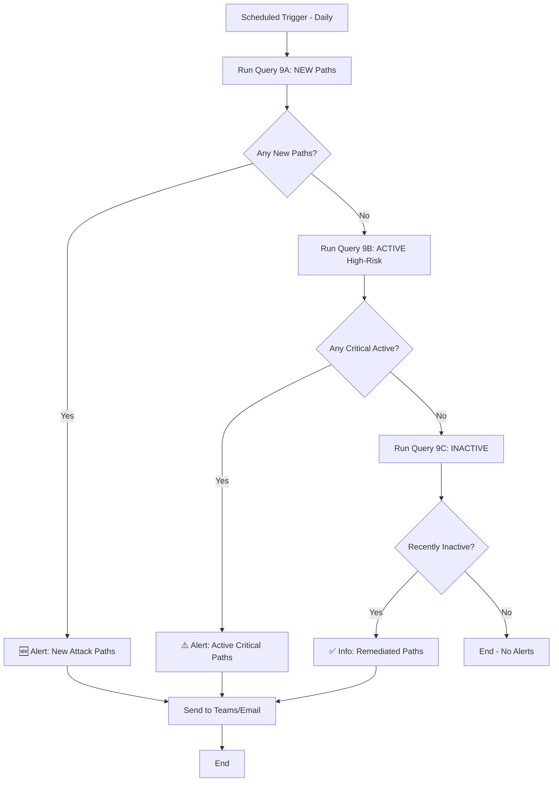

# MSEM Attack Path Chain Queries

This guide shows how to construct **complete attack path chains** by following edges through nodes, matching what MSEM portal displays.

## 🎯 Key Insights (Updated)

### Attack Path Grouping
**MSEM groups attack paths by EntryPoint (device) → unique FinalTarget:**
- One EntryPoint can have multiple paths to different FinalTargets
- **FinalTarget = High-value resources** (storage accounts, key vaults)
- **Intermediate nodes** (users, cookies) are NOT counted as targets
- Each complete chain = Unique attack path
- Status calculated per EntryPoint based on `firstSeenByInventory` + `lastSeen`

### Attack Path Structure (CRITICAL!)
**Multi-hop chains** (not simple 2-hop):
```
Device (EntryPoint)
   ↓ Edge 1
Intermediate Node 1 (e.g., entra-userCookie)
   ↓ Edge 2
Intermediate Node 2 (e.g., user)  ← Users are INTERMEDIATE, not targets!
   ↓ Edge 3
FinalTarget (storage/keyvault)     ← THIS is the target
```

**Example from real data**:
- device (a3f79) → entra-userCookie (36c56) → user (dbc6c) → storage account (2e17099)

### Status Logic (Discovered from MSEM Logs)
- **New**: firstSeen ≤ 7 days AND lastSeen = today
- **Active**: firstSeen > 7 days AND lastSeen = today
- **Inactive**: firstSeen > 7 days AND lastSeen > 7 days

### Critical Field Locations
- ✅ `exposureScore`: `NodeProperties.rawData.exposureScore` (string)
- ✅ `criticalityLevel`: `NodeProperties.rawData.criticalityLevel.criticalityLevel` ⚠️ **Double nested!**
- ✅ `deviceName`: `NodeProperties.rawData.deviceName`
- ✅ `firstSeenByInventory`: `NodeProperties.rawData.firstSeenByInventory` (Status calculation)
- ✅ `lastSeen`: `NodeProperties.rawData.lastSeen` (Status calculation)

### Recommended Queries
- ⭐ **Query 7B**: Multi-hop paths to storage/keyvault (all statuses)
- ⭐ **Query 7C**: NEW multi-hop paths to storage/keyvault (ALERTS)
- ⚠️ **Query 8, 9A, 9B, 9C**: 2-hop queries (may show users as targets - less accurate)

---

## ⚡ Quick Start - What to Use

**For Logic App Alerts**: Use **Query 7C** 
- Shows: Device → userCookie → user → **storage/keyvault**
- Filters: NEW paths only (discovered ≤ 7 days)
- Target: Only high-value resources (storage accounts, key vaults)
- Users are intermediate nodes, NOT targets ✅

**For Analysis**: Use **Query 7B**
- Same as 7C but shows all statuses (NEW/ACTIVE/INACTIVE)
- Great for dashboards and trending

---

## 🔗 Understanding Attack Path Structure

### Basic Structure
```
Node (Device) 
   ↓ Edge (can rdp)
Node (User Cookie) 
   ↓ Edge (can authenticate as)
Node (User) 
   ↓ Edge (has permission to)
Node (Storage Account)
```

### Data Structure
- **Nodes**: `ExposureGraphNodes` → NodeId, NodeName, NodeLabel (type), Categories, **NodeProperties** (JSON with rawData)
  - NodeProperties.rawData contains: exposureScore (string: High/Medium/Low/None), deviceName, lastSeen, firstSeenByInventory
- **Edges**: `ExposureGraphEdges` → SourceNodeId, TargetNodeId, EdgeLabel (relationship type)
- **Path**: Chain of Nodes connected by Edges

---
- **Edges**: `ExposureGraphEdges` -> EdgeLabel in ('contains', 'can authenticate to','member of','has role on','has credentials of', 'can authenticate as','frequently logged in','can impersonate as','affecting','runs on','routes traffic to', 'can rdp', 'can admin to', 'has permission to', 'can execute code')
- **Nodes**: `ExposureGraphNodes` -> NodeLabel in ('user','ec2.instance','computer-account','entra-userCookie','device', 'group','subscriptions', 'microsoft.logic/workflows','manageidentity','aws-userCookie','serviceprincipal','Microsoft Entra OAth App','resourcegroups','microsoft.hybridcompute/machines','microsoft.network/virtualnetworks','mdcSecurityRecommendation','mdcManagementRecommendation','Cve','microsoft.network/virtualnetworks/subnets','SaaS Application','mdcAuditingRecommendation','IP address','microsoft.keyvault/vaults','FileShare','microsoft.web/serverfarms','microsoft.resources/deployments','azure-logic-app-shared-access-signature','microsoft.authorization/locks','microsoft.compute/virtualmachines','microsoft.network/networkinterfaces','microsoft.web/site_azurefunction','microsoft.operationalinsights/workspaces','dataSensitivityScan','aws-access-key','microsoft.storage/storageaccounts','mdcSoftwareScanningtool','mde-healthFinding','ad-domain','microft.network/publicipaddresses','microsoft.network/networksecuritygroups','microsoft.automation/automationaccounts')

### Additional Node Fields (Entry Point Devices - in NodeProperties.rawData)
- **exposureScore**: MSEM calculated exposure score (Medium, Low, High, None) - `tostring(NodeProperties.rawData.exposureScore)`
- **deviceName**: Device name (alternative to NodeName) - `tostring(NodeProperties.rawData.deviceName)`
- **lastSeen**: Last time device was seen - `NodeProperties.rawData.lastSeen`
- **firstSeenByInventory**: When device first appeared in MSEM - `NodeProperties.rawData.firstSeenByInventory`
- **criticalityLevel**: Asset criticality level - `tostring(NodeProperties.rawData.criticalityLevel.criticalityLevel)` ⚠️ **Double nested!**

**Access Pattern**: Extract nested fields using `NodeProperties.rawData.<fieldname>` and convert types as needed
**Note**: criticalityLevel is double-nested: `NodeProperties.rawData.criticalityLevel.criticalityLevel`

### Attack Path Grouping Structure
**MSEM groups attack paths by EntryPoint (device) with unique Targets:**
- One EntryPoint → Multiple Targets = Multiple attack paths
- Each EntryPoint-Target combination = Unique attack path
- AttackPathId = `hash_sha256(EntryPointNodeId | EdgeLabel | TargetNodeId)`

## 📊 Query 1: Simple 2-Hop Attack Paths

**Purpose**: Find direct attack paths (Source → Target)

```kql
// Get 2-hop attack paths with node details
let Edges = ExposureGraphEdges
    | where EdgeLabel in (
        'can authenticate as', 'can rdp', 'can admin to', 'has permission to', 'can execute code',
        'can authenticate to', 'has credentials of', 'can impersonate as', 'frequently logged in',
        'has role on', 'member of'
    )
    | extend SourceNodeId = tostring(SourceNodeId), TargetNodeId = tostring(TargetNodeId)
    | project SourceNodeId, TargetNodeId, EdgeLabel;
let Nodes = ExposureGraphNodes
    | extend NodeId = tostring(NodeId)
    | extend 
        exposureScore = tostring(NodeProperties.rawData.exposureScore),
        deviceName = tostring(NodeProperties.rawData.deviceName),
        lastSeen = todatetime(NodeProperties.rawData.lastSeen),
        firstSeenByInventory = todatetime(NodeProperties.rawData.firstSeenByInventory),
        criticalityLevel = tostring(NodeProperties.rawData.criticalityLevel.criticalityLevel)
    | project NodeId, NodeName, NodeLabel, Categories, exposureScore, deviceName, lastSeen, firstSeenByInventory, criticalityLevel;
Edges
| join kind=inner (Nodes) on $left.SourceNodeId == $right.NodeId
| project-rename SourceNodeName = NodeName, SourceNodeType = NodeLabel, SourceCategories = Categories, 
    SourceExposure = exposureScore, SourceDeviceName = deviceName, 
    SourceLastSeen = lastSeen, SourceFirstSeen = firstSeenByInventory, SourceCriticalityLevel = criticalityLevel
| join kind=inner (Nodes) on $left.TargetNodeId == $right.NodeId
| project-rename TargetNodeName = NodeName, TargetNodeType = NodeLabel, TargetCategories = Categories,
    TargetExposure = exposureScore, TargetDeviceName = deviceName,
    TargetLastSeen = lastSeen, TargetFirstSeen = firstSeenByInventory, TargetCriticalityLevel = criticalityLevel
| extend 
    AttackPathName = strcat(SourceNodeName, ' → ', TargetNodeName),
    AttackPathDescription = strcat(SourceNodeType, ' can access ', TargetNodeType, ' via ', EdgeLabel),
    PathLength = 2,
    // Enhanced risk scoring with CriticalityLevel and exposureScore
    BaseRiskScore = case(
        // Critical: Key infrastructure and secrets
        TargetNodeType in ('microsoft.keyvault/vaults', 'microsoft.storage/storageaccounts', 'aws-access-key', 'serviceprincipal'), 95,
        // High: Compute and logic resources
        TargetNodeType in ('microsoft.compute/virtualmachines', 'ec2.instance', 'microsoft.logic/workflows', 'microsoft.automation/automationaccounts'), 85,
        // High: Identity resources
        TargetNodeType in ('user', 'manageidentity', 'Microsoft Entra OAth App', 'entra-userCookie', 'aws-userCookie'), 80,
        // Medium: Network and groups
        TargetNodeType in ('microsoft.network/virtualnetworks', 'group', 'subscriptions', 'resourcegroups'), 65,
        // Medium: Other Azure resources
        TargetNodeType has_any ('microsoft.', 'aws-'), 60,
        40
    ),
    ExposureBonus = case(
        TargetExposure == 'High', 15,
        TargetExposure == 'Medium', 10,
        TargetExposure == 'Low', 5,
        0  // None or empty
    )
| extend 
    RiskScore = BaseRiskScore + ExposureBonus,
    RiskLevel = case(
        BaseRiskScore + ExposureBonus >= 95, 'Critical',
        BaseRiskScore + ExposureBonus >= 80, 'High',
        BaseRiskScore + ExposureBonus >= 60, 'Medium',
        'Low'
    )
| project 
    AttackPathName,
    AttackPathDescription,
    PathLength,
    RiskScore,
    RiskLevel,
    SourceNodeId,
    SourceNodeName,
    SourceNodeType,
    SourceExposure,
    SourceCriticalityLevel,
    SourceDeviceName,
    EdgeLabel,
    TargetNodeId,
    TargetNodeName,
    TargetNodeType,
    TargetExposure,
    TargetCriticalityLevel,
    TargetDeviceName,
    SourceCategories,
    TargetCategories,
    TargetLastSeen,
    TargetFirstSeen
| order by RiskScore desc
| take 100
```

---

## 📊 Query 2: Multi-Hop Attack Paths (3+ Hops)

**Purpose**: Construct complete attack path chains by recursively following edges

```kql
// Build 3-hop attack paths
let Edges = ExposureGraphEdges
    | where EdgeLabel in ('can authenticate as', 'can authenticate to', 'has credentials of', 'can impersonate as', 'frequently logged in', 'can rdp', 'can admin to', 'has permission to', 'can execute code', 'has role on', 'member of')
    | extend SourceNodeId = tostring(SourceNodeId), TargetNodeId = tostring(TargetNodeId)
    | project SourceNodeId, TargetNodeId, EdgeLabel;
let Nodes = ExposureGraphNodes
    | extend NodeId = tostring(NodeId)
    | project NodeId, NodeName, NodeLabel, Categories;
// Hop 1: Start → Intermediate1
let Hop1 = Edges
    | join kind=inner (Nodes) on $left.SourceNodeId == $right.NodeId
    | project 
        StartNodeId = SourceNodeId,
        StartNodeName = NodeName,
        StartNodeType = NodeLabel,
        Edge1 = EdgeLabel,
        Intermediate1Id = TargetNodeId;
// Hop 2: Intermediate1 → Intermediate2
let Hop2 = Hop1
    | join kind=inner (Edges) on $left.Intermediate1Id == $right.SourceNodeId
    | join kind=inner (Nodes) on $left.Intermediate1Id == $right.NodeId
    | project 
        StartNodeId,
        StartNodeName,
        StartNodeType,
        Edge1,
        Intermediate1Id,
        Intermediate1Name = NodeName,
        Intermediate1Type = NodeLabel,
        Edge2 = EdgeLabel,
        Intermediate2Id = TargetNodeId;
// Hop 3: Intermediate2 → End
let Hop3 = Hop2
    | join kind=inner (Edges) on $left.Intermediate2Id == $right.SourceNodeId
    | join kind=inner (Nodes) on $left.Intermediate2Id == $right.NodeId
    | project 
        StartNodeId,
        StartNodeName,
        StartNodeType,
        Edge1,
        Intermediate1Id,
        Intermediate1Name,
        Intermediate1Type,
        Edge2,
        Intermediate2Id,
        Intermediate2Name = NodeName,
        Intermediate2Type = NodeLabel,
        Edge3 = EdgeLabel,
        EndNodeId = TargetNodeId;
// Final: Get end node details
Hop3
| join kind=inner (Nodes) on $left.EndNodeId == $right.NodeId
| project 
    AttackPathName = strcat(StartNodeName, ' → ', Intermediate1Name, ' → ', Intermediate2Name, ' → ', NodeName),
    AttackStory = strcat(
        'Attacker starts from ', StartNodeType, ' (', StartNodeName, '), ',
        'uses ', Edge1, ' to access ', Intermediate1Type, ' (', Intermediate1Name, '), ',
        'then ', Edge2, ' to reach ', Intermediate2Type, ' (', Intermediate2Name, '), ',
        'and finally ', Edge3, ' to compromise ', NodeLabel, ' (', NodeName, ')'
    ),
    PathLength = 4,
    StartNode = StartNodeName,
    StartNodeType,
    Hop1_Edge = Edge1,
    Hop1_Node = Intermediate1Name,
    Hop1_NodeType = Intermediate1Type,
    Hop2_Edge = Edge2,
    Hop2_Node = Intermediate2Name,
    Hop2_NodeType = Intermediate2Type,
    Hop3_Edge = Edge3,
    EndNode = NodeName,
    EndNodeType = NodeLabel,
    RiskScore = case(
        NodeLabel in ('microsoft.keyvault/vaults', 'microsoft.storage/storageaccounts', 'aws-access-key', 'serviceprincipal', 'azure-logic-app-shared-access-signature'), 95,
        NodeLabel in ('microsoft.compute/virtualmachines', 'ec2.instance', 'microsoft.logic/workflows', 'microsoft.automation/automationaccounts', 'microsoft.hybridcompute/machines'), 85,
        NodeLabel in ('user', 'manageidentity', 'Microsoft Entra OAuth App', 'entra-userCookie', 'aws-userCookie', 'computer-account'), 80,
        NodeLabel in ('microsoft.network/virtualnetworks', 'microsoft.network/networksecuritygroups', 'group', 'subscriptions', 'resourcegroups', 'IP address'), 65,
        NodeLabel startswith 'microsoft.' or NodeLabel startswith 'aws-', 60,
        50
    )
| extend RiskLevel = case(
    RiskScore >= 90, 'Critical',
    RiskScore >= 75, 'High',
    RiskScore >= 60, 'Medium',
    'Low'
)
| order by RiskScore desc
| take 50
```

---

## 📊 Query 3: Attack Paths to Critical Resources

**Purpose**: Find all paths leading to high-value targets (storage accounts, key vaults, etc.)

```kql
// Find paths ending at critical Azure resources
let CriticalResourceTypes = dynamic([
    'microsoft.storage/storageaccounts',
    'microsoft.keyvault/vaults',
    'microsoft.compute/virtualmachines',
    'microsoft.logic/workflows',
    'microsoft.automation/automationaccounts',
    'ec2.instance',
    'aws-access-key',
    'serviceprincipal',
    'manageidentity',
    'azure-logic-app-shared-access-signature'
]);
let CriticalNodes = ExposureGraphNodes
    | extend NodeId = tostring(NodeId)
    | where NodeLabel has_any (CriticalResourceTypes)
    | project NodeId, CriticalNodeName = NodeName, CriticalNodeType = NodeLabel, Categories;
let Edges = ExposureGraphEdges
    | where EdgeLabel in ('can authenticate as', 'can authenticate to', 'has credentials of', 'can impersonate as', 'frequently logged in', 'can rdp', 'can admin to', 'has permission to', 'can execute code', 'has role on', 'member of', 'contains', 'affecting')
    | extend SourceNodeId = tostring(SourceNodeId), TargetNodeId = tostring(TargetNodeId);
let Nodes = ExposureGraphNodes
    | extend NodeId = tostring(NodeId)
    | project NodeId, NodeName, NodeLabel;
// Find edges leading to critical resources
Edges
| join kind=inner (CriticalNodes) on $left.TargetNodeId == $right.NodeId
| join kind=inner (Nodes) on $left.SourceNodeId == $right.NodeId
| summarize 
    IncomingPaths = count(),
    EdgeTypes = make_set(EdgeLabel),
    SourceNodes = make_set(NodeName),
    SourceTypes = make_set(NodeLabel)
    by TargetNodeId, CriticalNodeName, CriticalNodeType, Categories
| extend 
    RiskScore = IncomingPaths * 10 + array_length(Categories) * 5,
    AttackPathDescription = strcat(
        IncomingPaths, ' attack path(s) lead to ', CriticalNodeType, ' "', CriticalNodeName, '" ',
        'via ', array_length(EdgeTypes), ' different method(s)'
    )
| extend RiskLevel = case(
    RiskScore >= 100, 'Critical',
    RiskScore >= 50, 'High',
    RiskScore >= 20, 'Medium',
    'Low'
)
| project 
    CriticalResource = CriticalNodeName,
    ResourceType = CriticalNodeType,
    IncomingAttackPaths = IncomingPaths,
    AttackMethods = EdgeTypes,
    ExposureCategories = Categories,
    RiskScore,
    RiskLevel,
    AttackPathDescription,
    SourceNodeTypes = SourceTypes
| order by RiskScore desc
```

---

## 📊 Query 4: Attack Path Summary (Matches MSEM Dashboard)

**Purpose**: Get counts and statistics matching MSEM overview page

```kql
// Attack path summary statistics
let Edges = ExposureGraphEdges
    | where EdgeLabel in ('can authenticate as', 'can authenticate to', 'has credentials of', 'can impersonate as', 'frequently logged in', 'can rdp', 'can admin to', 'has permission to', 'can execute code', 'has role on', 'member of')
    | extend SourceNodeId = tostring(SourceNodeId), TargetNodeId = tostring(TargetNodeId);
let Nodes = ExposureGraphNodes
    | extend NodeId = tostring(NodeId);
let PathStats = Edges
    | join kind=inner (Nodes) on $left.TargetNodeId == $right.NodeId
    | extend 
        IsCriticalTarget = NodeLabel in ('microsoft.keyvault/vaults', 'microsoft.storage/storageaccounts', 'aws-access-key', 'serviceprincipal', 'azure-logic-app-shared-access-signature', 'microsoft.compute/virtualmachines', 'ec2.instance', 'microsoft.logic/workflows', 'microsoft.automation/automationaccounts'),
        IsHighRiskEdge = EdgeLabel in ('can admin to', 'has permission to', 'can execute code', 'can authenticate as', 'has credentials of')
    | summarize 
        TotalAttackPaths = count(),
        CriticalTargetPaths = countif(IsCriticalTarget),
        HighRiskPaths = countif(IsHighRiskEdge),
        UniqueTargets = dcount(TargetNodeId),
        UniqueEdgeTypes = dcount(EdgeLabel)
        by EdgeLabel;
PathStats
| extend 
    Timestamp = now(),
    PathCategory = case(
        EdgeLabel == 'can admin to', 'Administrative Access',
        EdgeLabel == 'can rdp', 'Remote Access',
        EdgeLabel in ('can authenticate as', 'can authenticate to', 'has credentials of', 'can impersonate as'), 'Authentication',
        EdgeLabel == 'has permission to', 'Permission-Based',
        EdgeLabel == 'can execute code', 'Code Execution',
        EdgeLabel in ('member of', 'has role on'), 'Group Membership',
        EdgeLabel == 'frequently logged in', 'User Activity',
        'Other'
    )
| project 
    Timestamp,
    PathCategory,
    EdgeType = EdgeLabel,
    TotalAttackPaths,
    CriticalTargetPaths,
    HighRiskPaths,
    UniqueTargets,
    RiskScore = (CriticalTargetPaths * 10) + (HighRiskPaths * 5)
| order by RiskScore desc
```

---

## 📊 Query 5: Device-to-Resource Attack Paths (Your Example)

**Purpose**: Find paths from devices to cloud resources (like your example)

```kql
// Paths starting from devices and ending at cloud resources
let StartDevices = ExposureGraphNodes
    | extend NodeId = tostring(NodeId)
    | where NodeLabel in ('device', 'microsoft.compute/virtualmachines', 'microsoft.hybridcompute/machines', 'ec2.instance', 'computer-account')
    | project DeviceNodeId = NodeId, DeviceName = NodeName;
let EndResources = ExposureGraphNodes
    | extend NodeId = tostring(NodeId)
    | where NodeLabel in ('microsoft.storage/storageaccounts', 'microsoft.keyvault/vaults', 'microsoft.logic/workflows', 'microsoft.automation/automationaccounts', 'serviceprincipal', 'manageidentity', 'aws-access-key')
    | project ResourceNodeId = NodeId, ResourceName = NodeName, ResourceType = NodeLabel;
let Edges = ExposureGraphEdges
    | where EdgeLabel in ('can authenticate as', 'can authenticate to', 'has credentials of', 'can impersonate as', 'frequently logged in', 'can rdp', 'can admin to', 'has permission to', 'can execute code', 'has role on', 'member of')
    | extend SourceNodeId = tostring(SourceNodeId), TargetNodeId = tostring(TargetNodeId);
// Build 2-hop paths: Device → Intermediate → Resource
let Hop1 = Edges
    | join kind=inner (StartDevices) on $left.SourceNodeId == $right.DeviceNodeId
    | project DeviceNodeId, DeviceName, Edge1 = EdgeLabel, IntermediateId = TargetNodeId;
let Hop2 = Hop1
    | join kind=inner (Edges) on $left.IntermediateId == $right.SourceNodeId
    | join kind=inner (ExposureGraphNodes | extend NodeId = tostring(NodeId) | project NodeId, NodeName, NodeLabel) 
        on $left.IntermediateId == $right.NodeId
    | project DeviceNodeId, DeviceName, Edge1, IntermediateId, IntermediateName = NodeName, IntermediateType = NodeLabel, 
        Edge2 = EdgeLabel, ResourceNodeId = TargetNodeId;
// Match with end resources
Hop2
| join kind=inner (EndResources) on $left.ResourceNodeId == $right.ResourceNodeId
| extend 
    AttackPathName = strcat(DeviceName, ' → ', IntermediateName, ' → ', ResourceName),
    AttackStory = strcat(
        'Device "', DeviceName, '" ', Edge1, ' ', IntermediateType, ' "', IntermediateName, 
        '" which ', Edge2, ' ', ResourceType, ' "', ResourceName, '"'
    ),
    PathLength = 3,
    RiskScore = case(
        ResourceType in ('microsoft.keyvault/vaults', 'microsoft.storage/storageaccounts', 'aws-access-key'), 95,
        ResourceType in ('microsoft.logic/workflows', 'microsoft.automation/automationaccounts', 'serviceprincipal'), 85,
        ResourceType in ('manageidentity', 'Microsoft Entra OAuth App'), 80,
        70
    ),
    RiskLevel = case(
        ResourceType in ('microsoft.keyvault/vaults', 'microsoft.storage/storageaccounts', 'aws-access-key'), 'Critical',
        ResourceType in ('microsoft.logic/workflows', 'microsoft.automation/automationaccounts', 'serviceprincipal'), 'High',
        'Medium'
    )
| project 
    AttackPathName,
    AttackStory,
    PathLength,
    RiskScore,
    RiskLevel,
    StartDevice = DeviceName,
    IntermediateEntity = IntermediateName,
    IntermediateType,
    TargetResource = ResourceName,
    ResourceType,
    Edge1,
    Edge2
| order by RiskScore desc
| take 100
```

---

## 📊 Query 6: Generate Attack Path Metadata (Name, Description, Risk)

**Purpose**: Create enriched attack path metadata similar to MSEM UI

```kql
// Generate attack path metadata with risk assessment
let Edges = ExposureGraphEdges
    | where EdgeLabel in ('can authenticate as', 'can authenticate to', 'has credentials of', 'can impersonate as', 'frequently logged in', 'can rdp', 'can admin to', 'has permission to', 'can execute code', 'has role on', 'member of')
    | extend SourceNodeId = tostring(SourceNodeId), TargetNodeId = tostring(TargetNodeId);
let Nodes = ExposureGraphNodes
    | extend NodeId = tostring(NodeId)
    | extend 
        // Extract from NodeProperties.rawData
        exposureScore = tostring(NodeProperties.rawData.exposureScore),
        deviceName = tostring(NodeProperties.rawData.deviceName),
        lastSeen = todatetime(NodeProperties.rawData.lastSeen),
        firstSeenByInventory = todatetime(NodeProperties.rawData.firstSeenByInventory),
        criticalityLevel = tostring(NodeProperties.rawData.criticalityLevel.criticalityLevel)
    | extend 
        IsHighValue = NodeLabel in ('microsoft.keyvault/vaults', 'microsoft.storage/storageaccounts', 'aws-access-key', 'serviceprincipal', 'azure-logic-app-shared-access-signature', 'microsoft.compute/virtualmachines', 'ec2.instance', 'microsoft.logic/workflows', 'microsoft.automation/automationaccounts'),
        IsSensitive = array_length(Categories) >= 3,
        IsPrivileged = NodeLabel in ('user', 'manageidentity', 'serviceprincipal', 'Microsoft Entra OAuth App', 'group', 'computer-account')
    | project NodeId, NodeName, NodeLabel, Categories, IsHighValue, IsSensitive, IsPrivileged, exposureScore, deviceName, lastSeen, firstSeenByInventory, criticalityLevel;
Edges
| join kind=inner (Nodes) on $left.SourceNodeId == $right.NodeId
| project-rename 
    SourceName = NodeName, SourceType = NodeLabel, SourceIsHighValue = IsHighValue, 
    SourceIsSensitive = IsSensitive, SourceCategories = Categories, SourceIsPrivileged = IsPrivileged,
    SourceExposure = exposureScore, SourceDeviceName = deviceName,
    SourceLastSeen = lastSeen, SourceFirstSeen = firstSeenByInventory, SourceCriticalityLevel = criticalityLevel
| join kind=inner (Nodes) on $left.TargetNodeId == $right.NodeId
| project-rename 
    TargetName = NodeName, TargetType = NodeLabel, TargetIsHighValue = IsHighValue, 
    TargetIsSensitive = IsSensitive, TargetCategories = Categories, TargetIsPrivileged = IsPrivileged,
    TargetExposure = exposureScore, TargetDeviceName = deviceName,
    TargetLastSeen = lastSeen, TargetFirstSeen = firstSeenByInventory, TargetCriticalityLevel = criticalityLevel
| extend 
    // Generate attack path ID (similar to MSEM)
    AttackPathId = strcat(SourceNodeId, '_to_', TargetNodeId),
    
    // Generate human-readable name
    AttackPathName = strcat(SourceName, ' → ', TargetName),
    
    // Generate description
    AttackPathDescription = strcat(
        SourceType, ' can access ', TargetType, ' via "', EdgeLabel, '"'
    ),
    
    // Generate attack story
    AttackStory = strcat(
        'An attacker with access to ', SourceType, ' "', SourceName, '" ',
        'can leverage ', EdgeLabel, ' relationship ',
        'to compromise ', TargetType, ' "', TargetName, '"',
        case(
            TargetIsHighValue, '. This target is a high-value cloud resource.',
            TargetIsSensitive, '. This target has multiple exposure categories.',
            ''
        )
    ),
    
    // Calculate risk score
    BaseRisk = 20,
    TargetValueRisk = case(TargetIsHighValue, 40, 0),
    SensitivityRisk = array_length(TargetCategories) * 10,
    ExposureRisk = case(
        TargetExposure == 'High', 20,
        TargetExposure == 'Medium', 15,
        TargetExposure == 'Low', 10,
        0  // None or empty
    ),
    EdgeRisk = case(
        EdgeLabel in ('can admin to', 'can execute code', 'has credentials of'), 30,
        EdgeLabel in ('has permission to', 'can rdp', 'can authenticate as', 'can impersonate as'), 20,
        EdgeLabel in ('can authenticate to', 'has role on', 'frequently logged in'), 15,
        EdgeLabel == 'member of', 10,
        5
    ),
    
    PathLength = 2
| extend 
    TotalRiskScore = BaseRisk + TargetValueRisk + SensitivityRisk + ExposureRisk + EdgeRisk,
    RiskLevel = case(
        BaseRisk + TargetValueRisk + SensitivityRisk + ExposureRisk + EdgeRisk >= 100, 'Critical',
        BaseRisk + TargetValueRisk + SensitivityRisk + ExposureRisk + EdgeRisk >= 80, 'High',
        BaseRisk + TargetValueRisk + SensitivityRisk + ExposureRisk + EdgeRisk >= 50, 'Medium',
        'Low'
    ),
    
    // Remediation guidance
    RemediationGuidance = case(
        EdgeLabel == 'can admin to', 'Review and restrict administrative access',
        EdgeLabel == 'can execute code', 'Implement code execution controls',
        EdgeLabel == 'has permission to', 'Review and minimize permissions',
        EdgeLabel == 'can rdp', 'Secure RDP access with MFA and network controls',
        EdgeLabel in ('can authenticate as', 'can authenticate to'), 'Review authentication delegation',
        EdgeLabel == 'has credentials of', 'Secure credential storage and rotation',
        EdgeLabel == 'can impersonate as', 'Review impersonation permissions',
        EdgeLabel == 'has role on', 'Review role assignments',
        EdgeLabel == 'member of', 'Review group membership',
        EdgeLabel == 'frequently logged in', 'Monitor user activity patterns',
        'Review and restrict access'
    )
| project 
    Timestamp = now(),
    AttackPathId,
    AttackPathName,
    AttackPathDescription,
    AttackStory,
    PathLength,
    TotalRiskScore,
    RiskLevel,
    EdgeType = EdgeLabel,
    SourceNodeId,
    SourceName,
    SourceType,
    SourceExposure,
    SourceCriticalityLevel,
    SourceDeviceName,
    SourceFirstSeen,
    TargetNodeId,
    TargetName,
    TargetType,
    TargetExposure,
    TargetCriticalityLevel,
    TargetDeviceName,
    TargetFirstSeen,
    SourceCategories,
    TargetCategories,
    RemediationGuidance
| order by TotalRiskScore desc
| take 100
```

---

## 📊 Query 7: New Entry Point Devices (Detect Recent Threats)

**Purpose**: Find newly discovered entry point devices and their attack paths

```kql
// Find entry point devices discovered in last 7 days
let RecentDevices = ExposureGraphNodes
    | extend NodeId = tostring(NodeId)
    | where NodeLabel in ('device', 'microsoft.compute/virtualmachines', 'microsoft.hybridcompute/machines', 'ec2.instance', 'computer-account')
    | extend 
        // Extract from NodeProperties.rawData
        exposureScore = tostring(NodeProperties.rawData.exposureScore),
        deviceName = tostring(NodeProperties.rawData.deviceName),
        lastSeen = todatetime(NodeProperties.rawData.lastSeen),
        firstSeenByInventory = todatetime(NodeProperties.rawData.firstSeenByInventory)
    | where isnotempty(firstSeenByInventory)
    | where firstSeenByInventory >= ago(7d)  // Discovered in last 7 days
    | project 
        DeviceNodeId = NodeId, 
        DeviceName = coalesce(deviceName, NodeName), 
        DeviceType = NodeLabel, 
        exposureScore, 
        firstSeenByInventory, 
        lastSeen, 
        Categories;
let Edges = ExposureGraphEdges
    | where EdgeLabel in ('can authenticate as', 'can authenticate to', 'has credentials of', 'can impersonate as', 'frequently logged in', 'can rdp', 'can admin to', 'has permission to', 'can execute code', 'has role on', 'member of')
    | extend SourceNodeId = tostring(SourceNodeId), TargetNodeId = tostring(TargetNodeId);
let Nodes = ExposureGraphNodes
    | extend NodeId = tostring(NodeId)
    | project NodeId, NodeName, NodeLabel, Categories;
// Find all attack paths FROM these new devices
Edges
| join kind=inner (RecentDevices) on $left.SourceNodeId == $right.DeviceNodeId
| join kind=inner (Nodes) on $left.TargetNodeId == $right.NodeId
| extend 
    AttackPathId = strcat(DeviceNodeId, '_to_', TargetNodeId),
    AttackPathName = strcat(DeviceName, ' [NEW] → ', NodeName),
    AttackPathDescription = strcat('Newly discovered ', DeviceType, ' can access ', NodeLabel, ' via ', EdgeLabel),
    AttackStory = strcat(
        'NEW ENTRY POINT: Device "', DeviceName, '" was first discovered on ', format_datetime(firstSeenByInventory, 'yyyy-MM-dd'), '. ',
        'This device can ', EdgeLabel, ' ', NodeLabel, ' "', NodeName, '". ',
        case(
            exposureScore == 'High', 'Device has HIGH exposure score. ',
            exposureScore == 'Medium', 'Device has MEDIUM exposure score. ',
            exposureScore == 'Low', 'Device has LOW exposure score. ',
            ''
        ),
        'Immediate review recommended.'
    ),
    DaysSinceDiscovery = datetime_diff('day', now(), firstSeenByInventory),
    // Enhanced risk scoring for NEW devices
    BaseRiskScore = case(
        NodeLabel in ('microsoft.keyvault/vaults', 'microsoft.storage/storageaccounts', 'aws-access-key', 'serviceprincipal'), 95,
        NodeLabel in ('microsoft.compute/virtualmachines', 'ec2.instance', 'microsoft.logic/workflows', 'microsoft.automation/automationaccounts'), 85,
        NodeLabel in ('user', 'manageidentity', 'Microsoft Entra OAuth App', 'entra-userCookie', 'aws-userCookie'), 80,
        NodeLabel in ('microsoft.network/virtualnetworks', 'group', 'subscriptions', 'resourcegroups'), 65,
        60
    ),
    NewDeviceBonus = 25,  // Additional risk because it's a NEW entry point
    ExposureBonus = case(
        exposureScore == 'High', 20,
        exposureScore == 'Medium', 15,
        exposureScore == 'Low', 10,
        0  // None or empty
    )
| extend 
    TotalRiskScore = BaseRiskScore + NewDeviceBonus + ExposureBonus,
    RiskLevel = case(
        BaseRiskScore + NewDeviceBonus + ExposureBonus >= 110, 'Critical',
        BaseRiskScore + NewDeviceBonus + ExposureBonus >= 90, 'High',
        BaseRiskScore + NewDeviceBonus + ExposureBonus >= 70, 'Medium',
        'Low'
    ),
    RemediationGuidance = strcat(
        'IMMEDIATE ACTION - New entry point discovered. ',
        case(
            EdgeLabel == 'can admin to', 'Review and restrict administrative access. ',
            EdgeLabel == 'can execute code', 'Implement code execution controls. ',
            EdgeLabel == 'has permission to', 'Review and minimize permissions. ',
            EdgeLabel == 'can rdp', 'Secure RDP access with MFA. ',
            EdgeLabel in ('can authenticate as', 'can authenticate to'), 'Review authentication delegation. ',
            EdgeLabel == 'has credentials of', 'Secure credential storage. ',
            ''
        ),
        'Verify device legitimacy and isolate if suspicious.'
    )
| project 
    Timestamp = now(),
    AlertSeverity = 'High - New Entry Point',
    AttackPathId,
    AttackPathName,
    AttackPathDescription,
    AttackStory,
    TotalRiskScore,
    RiskLevel,
    DeviceNodeId,
    DeviceName,
    DeviceType,
    exposureScore,
    firstSeenByInventory,
    DaysSinceDiscovery,
    lastSeen,
    EdgeType = EdgeLabel,
    TargetNodeId,
    TargetName = NodeName,
    TargetType = NodeLabel,
    RemediationGuidance,
    DeviceCategories = Categories,
    TargetCategories = Categories1
| order by TotalRiskScore desc, DaysSinceDiscovery asc
```

---

## 🎯 Logic App Recommendation - Status Already Available! ✅

**Great News**: MSEM calculates Status from existing fields - no complex storage needed!

**Status Logic** (from MSEM actual behavior):
- **New**: `firstSeenByInventory` within 7 days AND `lastSeen` = today
- **Active**: `firstSeenByInventory` > 7 days ago AND `lastSeen` = today
- **Inactive**: Both `firstSeenByInventory` and `lastSeen` > 7 days ago

**Implementation**: Use Query 8 (all statuses) or Query 9A/9B/9C (filtered by status)

---

## 📊 Query 7B: Multi-Hop Attack Paths to High-Value Targets (⭐ MATCHING MSEM STRUCTURE)

**Purpose**: Build complete 3-hop attack path chains from devices through intermediate nodes to storage/keyvault

**Structure**: Device → Intermediate1 (userCookie/etc) → Intermediate2 (user/etc) → FinalTarget (storage/keyvault)

**Example from your data**:
- Device (a3f79) → entra-userCookie (36c56) → user (dbc6c) → storage account (2e17099)

```kql
// Build multi-hop attack paths: Device -> Intermediates -> High-Value Resource
// Users/Cookies are intermediate nodes, NOT final targets
let HighValueTargets = dynamic([
    'microsoft.storage/storageaccounts',
    'microsoft.keyvault/vaults'
]);
let Edges = ExposureGraphEdges
    | where EdgeLabel in ('can authenticate as', 'can authenticate to', 'has credentials of', 'can impersonate as', 'frequently logged in', 'can rdp', 'can admin to', 'has permission to', 'can execute code', 'has role on', 'member of')
    | extend SourceNodeId = tostring(SourceNodeId), TargetNodeId = tostring(TargetNodeId);
let Nodes = ExposureGraphNodes
    | extend NodeId = tostring(NodeId)
    | extend 
        exposureScore = tostring(NodeProperties.rawData.exposureScore),
        deviceName = tostring(NodeProperties.rawData.deviceName),
        lastSeen = todatetime(NodeProperties.rawData.lastSeen),
        firstSeenByInventory = todatetime(NodeProperties.rawData.firstSeenByInventory),
        criticalityLevel = tostring(NodeProperties.rawData.criticalityLevel.criticalityLevel)
    | project NodeId, NodeName, NodeLabel, exposureScore, deviceName, lastSeen, firstSeenByInventory, criticalityLevel;
// EntryPoint: Device nodes only
let EntryPoints = Nodes
    | where NodeLabel in ('device', 'microsoft.compute/virtualmachines', 'microsoft.hybridcompute/machines', 'ec2.instance', 'computer-account')
    | extend 
        DaysSinceFirstSeen = datetime_diff('day', now(), firstSeenByInventory),
        DaysSinceLastSeen = datetime_diff('day', now(), lastSeen),
        IsLastSeenToday = datetime_diff('day', now(), lastSeen) == 0
    | project 
        EntryPointId = NodeId, 
        EntryPointName = coalesce(deviceName, NodeName),
        EntryPointType = NodeLabel,
        EntryPointExposure = exposureScore,
        EntryPointCriticalityLevel = criticalityLevel,
        EntryPointFirstSeen = firstSeenByInventory,
        EntryPointLastSeen = lastSeen,
        DaysSinceFirstSeen,
        DaysSinceLastSeen,
        IsLastSeenToday;
// FinalTarget: High-Value Resources ONLY
let FinalTargets = Nodes
    | where NodeLabel has_any (HighValueTargets)
    | project 
        FinalTargetId = NodeId,
        FinalTargetName = NodeName,
        FinalTargetType = NodeLabel,
        FinalTargetCriticalityLevel = criticalityLevel;
// Hop 1: EntryPoint (device) -> Intermediate1
let Hop1 = Edges
    | join kind=inner (EntryPoints) on $left.SourceNodeId == $right.EntryPointId
    | project 
        EntryPointId, EntryPointName, EntryPointType, EntryPointExposure, EntryPointCriticalityLevel,
        EntryPointFirstSeen, EntryPointLastSeen, DaysSinceFirstSeen, DaysSinceLastSeen, IsLastSeenToday,
        Edge1 = EdgeLabel,
        Intermediate1Id = TargetNodeId;
// Hop 2: Intermediate1 -> Intermediate2
let Hop2 = Hop1
    | join kind=inner (Edges) on $left.Intermediate1Id == $right.SourceNodeId
    | join kind=inner (Nodes) on $left.Intermediate1Id == $right.NodeId
    | project 
        EntryPointId, EntryPointName, EntryPointType, EntryPointExposure, EntryPointCriticalityLevel,
        EntryPointFirstSeen, EntryPointLastSeen, DaysSinceFirstSeen, DaysSinceLastSeen, IsLastSeenToday,
        Edge1,
        Intermediate1Id,
        Intermediate1Name = NodeName,
        Intermediate1Type = NodeLabel,
        Edge2 = EdgeLabel,
        Intermediate2Id = TargetNodeId;
// Hop 3: Intermediate2 -> FinalTarget
let Hop3 = Hop2
    | join kind=inner (Edges) on $left.Intermediate2Id == $right.SourceNodeId
    | join kind=inner (Nodes) on $left.Intermediate2Id == $right.NodeId
    | project 
        EntryPointId, EntryPointName, EntryPointType, EntryPointExposure, EntryPointCriticalityLevel,
        EntryPointFirstSeen, EntryPointLastSeen, DaysSinceFirstSeen, DaysSinceLastSeen, IsLastSeenToday,
        Edge1, Intermediate1Id, Intermediate1Name, Intermediate1Type,
        Edge2,
        Intermediate2Id,
        Intermediate2Name = NodeName,
        Intermediate2Type = NodeLabel,
        Edge3 = EdgeLabel,
        FinalTargetId = TargetNodeId;
// Match with high-value targets ONLY
Hop3
| join kind=inner (FinalTargets) on FinalTargetId
| extend 
    // Generate consistent attack path ID
    AttackPathId = hash_sha256(strcat(EntryPointId, '|', Intermediate1Id, '|', Intermediate2Id, '|', FinalTargetId)),
    
    // Human-readable path name
    AttackPathName = strcat(EntryPointName, ' → ', Intermediate1Name, ' → ', Intermediate2Name, ' → ', FinalTargetName),
    
    // Attack story
    AttackStory = strcat(
        'Device "', EntryPointName, '" ', Edge1, ' ', Intermediate1Type, ' "', Intermediate1Name, '" which ',
        Edge2, ' ', Intermediate2Type, ' "', Intermediate2Name, '" which ',
        Edge3, ' ', FinalTargetType, ' "', FinalTargetName, '"'
    ),
    
    PathLength = 4,  // 4 nodes total
    
    // Calculate Status based on EntryPoint (device)
    Status = case(
        DaysSinceFirstSeen <= 7 and IsLastSeenToday, 'New',
        DaysSinceFirstSeen > 7 and IsLastSeenToday, 'Active',
        DaysSinceFirstSeen > 7 and DaysSinceLastSeen > 7, 'Inactive',
        'Unknown'
    ),
    
    // Risk scoring - higher risk for paths to keyvault/storage
    TargetRisk = case(
        FinalTargetType == 'microsoft.keyvault/vaults', 100,
        FinalTargetType == 'microsoft.storage/storageaccounts', 95,
        80
    ),
    ExposureRisk = case(
        EntryPointExposure == 'High', 20,
        EntryPointExposure == 'Medium', 15,
        EntryPointExposure == 'Low', 10,
        0
    )
| extend 
    TotalRiskScore = TargetRisk + ExposureRisk,
    RiskLevel = case(
        TargetRisk + ExposureRisk >= 110, 'Critical',
        TargetRisk + ExposureRisk >= 90, 'High',
        TargetRisk + ExposureRisk >= 70, 'Medium',
        'Low'
    ),
    AlertPriority = case(
        DaysSinceFirstSeen <= 7 and IsLastSeenToday, 'Critical - New Attack Path',
        DaysSinceFirstSeen > 7 and IsLastSeenToday and (TargetRisk + ExposureRisk) >= 110, 'High - Active Critical Path',
        DaysSinceLastSeen > 7, 'Info - Inactive Path',
        'Medium - Active Path'
    )
| project 
    Timestamp = now(),
    Status,
    AlertPriority,
    AttackPathId,
    AttackPathName,
    AttackStory,
    PathLength,
    TotalRiskScore,
    RiskLevel,
    // Entry Point (Device)
    EntryPointId,
    EntryPointName,
    EntryPointType,
    EntryPointExposure,
    EntryPointCriticalityLevel,
    EntryPointFirstSeen,
    DaysSinceFirstSeen,
    DaysSinceLastSeen,
    // Intermediate Nodes
    Edge1,
    Intermediate1Id,
    Intermediate1Name,
    Intermediate1Type,
    Edge2,
    Intermediate2Id,
    Intermediate2Name,
    Intermediate2Type,
    Edge3,
    // Final Target (Storage/KeyVault)
    FinalTargetId,
    FinalTargetName,
    FinalTargetType,
    FinalTargetCriticalityLevel
| order by 
    case(Status, 'New', 1, 'Active', 2, 'Inactive', 3, 4),
    TotalRiskScore desc
| take 100
```

**Key Differences from Query 8**:
- ✅ Builds 3-hop paths (4 nodes total): Device → Intermediate1 → Intermediate2 → FinalTarget
- ✅ FinalTarget filtered to ONLY storage/keyvault (high-value resources)
- ✅ Users/cookies are intermediate nodes, NOT targets
- ✅ Status calculated from EntryPoint (device) firstSeen/lastSeen
- ✅ Matches your example: device (a3f79) → entra-userCookie (36c56) → user (dbc6c) → storage (2e17099)

---

## 📊 Query 7C: NEW Multi-Hop Paths to Storage/KeyVault (🆕 RECOMMENDED FOR ALERTS)

**Purpose**: Filter Query 7B to show ONLY NEW attack paths (discovered within 7 days)

**Use Case**: Daily alerts on newly discovered attack paths to storage accounts and key vaults

```kql
// Get ONLY New multi-hop attack paths to storage/keyvault
let HighValueTargets = dynamic([
    'microsoft.storage/storageaccounts',
    'microsoft.keyvault/vaults'
]);
let Edges = ExposureGraphEdges
    | where EdgeLabel in ('can authenticate as', 'can authenticate to', 'has credentials of', 'can impersonate as', 'frequently logged in', 'can rdp', 'can admin to', 'has permission to', 'can execute code', 'has role on', 'member of')
    | extend SourceNodeId = tostring(SourceNodeId), TargetNodeId = tostring(TargetNodeId);
let Nodes = ExposureGraphNodes
    | extend NodeId = tostring(NodeId)
    | extend 
        exposureScore = tostring(NodeProperties.rawData.exposureScore),
        deviceName = tostring(NodeProperties.rawData.deviceName),
        lastSeen = todatetime(NodeProperties.rawData.lastSeen),
        firstSeenByInventory = todatetime(NodeProperties.rawData.firstSeenByInventory),
        criticalityLevel = tostring(NodeProperties.rawData.criticalityLevel.criticalityLevel)
    | project NodeId, NodeName, NodeLabel, exposureScore, deviceName, lastSeen, firstSeenByInventory, criticalityLevel;
// EntryPoint: Device nodes with NEW filter (firstSeen ≤ 7 days, lastSeen = today)
let EntryPoints = Nodes
    | where NodeLabel in ('device', 'microsoft.compute/virtualmachines', 'microsoft.hybridcompute/machines', 'ec2.instance', 'computer-account')
    | extend 
        DaysSinceFirstSeen = datetime_diff('day', now(), firstSeenByInventory),
        DaysSinceLastSeen = datetime_diff('day', now(), lastSeen),
        IsLastSeenToday = datetime_diff('day', now(), lastSeen) == 0
    | where DaysSinceFirstSeen <= 7 and IsLastSeenToday  // NEW filter
    | project 
        EntryPointId = NodeId, 
        EntryPointName = coalesce(deviceName, NodeName),
        EntryPointType = NodeLabel,
        EntryPointExposure = exposureScore,
        EntryPointCriticalityLevel = criticalityLevel,
        EntryPointFirstSeen = firstSeenByInventory,
        EntryPointLastSeen = lastSeen,
        DaysSinceFirstSeen;
// FinalTarget: Storage/KeyVault ONLY
let FinalTargets = Nodes
    | where NodeLabel has_any (HighValueTargets)
    | project 
        FinalTargetId = NodeId,
        FinalTargetName = NodeName,
        FinalTargetType = NodeLabel,
        FinalTargetCriticalityLevel = criticalityLevel;
// Hop 1: EntryPoint -> Intermediate1
let Hop1 = Edges
    | join kind=inner (EntryPoints) on $left.SourceNodeId == $right.EntryPointId
    | project 
        EntryPointId, EntryPointName, EntryPointType, EntryPointExposure, EntryPointCriticalityLevel,
        EntryPointFirstSeen, EntryPointLastSeen, DaysSinceFirstSeen,
        Edge1 = EdgeLabel,
        Intermediate1Id = TargetNodeId;
// Hop 2: Intermediate1 -> Intermediate2
let Hop2 = Hop1
    | join kind=inner (Edges) on $left.Intermediate1Id == $right.SourceNodeId
    | join kind=inner (Nodes) on $left.Intermediate1Id == $right.NodeId
    | project 
        EntryPointId, EntryPointName, EntryPointType, EntryPointExposure, EntryPointCriticalityLevel,
        EntryPointFirstSeen, EntryPointLastSeen, DaysSinceFirstSeen,
        Edge1,
        Intermediate1Id,
        Intermediate1Name = NodeName,
        Intermediate1Type = NodeLabel,
        Edge2 = EdgeLabel,
        Intermediate2Id = TargetNodeId;
// Hop 3: Intermediate2 -> FinalTarget
let Hop3 = Hop2
    | join kind=inner (Edges) on $left.Intermediate2Id == $right.SourceNodeId
    | join kind=inner (Nodes) on $left.Intermediate2Id == $right.NodeId
    | project 
        EntryPointId, EntryPointName, EntryPointType, EntryPointExposure, EntryPointCriticalityLevel,
        EntryPointFirstSeen, EntryPointLastSeen, DaysSinceFirstSeen,
        Edge1, Intermediate1Id, Intermediate1Name, Intermediate1Type,
        Edge2,
        Intermediate2Id,
        Intermediate2Name = NodeName,
        Intermediate2Type = NodeLabel,
        Edge3 = EdgeLabel,
        FinalTargetId = TargetNodeId;
// Match with storage/keyvault ONLY
Hop3
| join kind=inner (FinalTargets) on FinalTargetId
| extend 
    AttackPathId = hash_sha256(strcat(EntryPointId, '|', Intermediate1Id, '|', Intermediate2Id, '|', FinalTargetId)),
    AttackPathName = strcat(EntryPointName, ' → ', Intermediate1Name, ' → ', Intermediate2Name, ' → ', FinalTargetName),
    Status = 'New',
    AlertMessage = strcat(
        '🆕 NEW ATTACK PATH TO ', toupper(FinalTargetType), '\n',
        '━━━━━━━━━━━━━━━━━━━━━━━━━━━━━━\n',
        'Entry Point: ', EntryPointName, ' (', EntryPointType, ')\n',
        'Entry Point Criticality: ', EntryPointCriticalityLevel, '\n',
        'Entry Point Exposure: ', EntryPointExposure, '\n',
        'First Discovered: ', format_datetime(EntryPointFirstSeen, 'yyyy-MM-dd HH:mm'), ' (', DaysSinceFirstSeen, ' days ago)\n',
        '\nATTACK CHAIN:\n',
        '1️⃣ ', EntryPointName, ' (', EntryPointType, ')\n',
        '   ↓ ', Edge1, '\n',
        '2️⃣ ', Intermediate1Name, ' (', Intermediate1Type, ')\n',
        '   ↓ ', Edge2, '\n',
        '3️⃣ ', Intermediate2Name, ' (', Intermediate2Type, ')\n',
        '   ↓ ', Edge3, '\n',
        '4️⃣ ', FinalTargetName, ' (', FinalTargetType, ') ⚠️\n',
        'Target Criticality: ', FinalTargetCriticalityLevel, '\n',
        '\n⚠️ CRITICAL: New path to high-value resource!\n',
        '🔍 ACTION REQUIRED: Immediate investigation!'
    ),
    TargetRisk = case(
        FinalTargetType == 'microsoft.keyvault/vaults', 100,
        FinalTargetType == 'microsoft.storage/storageaccounts', 95,
        80
    )
| project 
    Timestamp = now(),
    Status,
    AlertMessage,
    AttackPathId,
    AttackPathName,
    TargetRisk,
    // Entry Point
    EntryPointId,
    EntryPointName,
    EntryPointType,
    EntryPointCriticalityLevel,
    EntryPointExposure,
    EntryPointFirstSeen,
    DaysSinceFirstSeen,
    // Attack Chain
    Edge1,
    Intermediate1Name,
    Intermediate1Type,
    Edge2,
    Intermediate2Name,
    Intermediate2Type,
    Edge3,
    // Final Target
    FinalTargetName,
    FinalTargetType,
    FinalTargetCriticalityLevel
| order by TargetRisk desc, DaysSinceFirstSeen asc
```

**Alert Priority**: CRITICAL - These are newly discovered paths to your most sensitive resources!

---

## 📊 Query 8: Attack Path Snapshot with Status Calculation (Based on MSEM Logic)

**Purpose**: Generate attack paths with **Status** calculated from firstSeenByInventory and lastSeen fields

**MSEM Status Logic (Discovered):**
- **New**: firstSeenByInventory within 7 days AND lastSeen = today
- **Active**: firstSeenByInventory > 7 days ago AND lastSeen = today  
- **Inactive**: Both firstSeenByInventory and lastSeen > 7 days ago

```kql
// Generate attack paths with Status based on MSEM actual logic
let Edges = ExposureGraphEdges
    | where EdgeLabel in ('can authenticate as', 'can authenticate to', 'has credentials of', 'can impersonate as', 'frequently logged in', 'can rdp', 'can admin to', 'has permission to', 'can execute code', 'has role on', 'member of')
    | extend SourceNodeId = tostring(SourceNodeId), TargetNodeId = tostring(TargetNodeId);
let Nodes = ExposureGraphNodes
    | extend NodeId = tostring(NodeId)
    | extend 
        exposureScore = tostring(NodeProperties.rawData.exposureScore),
        deviceName = tostring(NodeProperties.rawData.deviceName),
        lastSeen = todatetime(NodeProperties.rawData.lastSeen),
        firstSeenByInventory = todatetime(NodeProperties.rawData.firstSeenByInventory),
        criticalityLevel = tostring(NodeProperties.rawData.criticalityLevel.criticalityLevel)
    | extend 
        IsHighValue = NodeLabel in ('microsoft.keyvault/vaults', 'microsoft.storage/storageaccounts', 'aws-access-key', 'serviceprincipal', 'azure-logic-app-shared-access-signature', 'microsoft.compute/virtualmachines', 'ec2.instance', 'microsoft.logic/workflows', 'microsoft.automation/automationaccounts')
    | project NodeId, NodeName, NodeLabel, Categories, IsHighValue, exposureScore, deviceName, lastSeen, firstSeenByInventory, criticalityLevel;
Edges
| join kind=inner (Nodes) on $left.SourceNodeId == $right.NodeId
| project-rename 
    EntryPointNodeId = SourceNodeId,
    EntryPointName = NodeName, 
    EntryPointType = NodeLabel, 
    EntryPointCategories = Categories,
    EntryPointIsHighValue = IsHighValue, 
    EntryPointExposure = exposureScore, 
    EntryPointDeviceName = deviceName,
    EntryPointLastSeen = lastSeen, 
    EntryPointFirstSeen = firstSeenByInventory,
    EntryPointCriticalityLevel = criticalityLevel
| join kind=inner (Nodes) on $left.TargetNodeId == $right.NodeId
| project-rename 
    TargetName = NodeName, 
    TargetType = NodeLabel, 
    TargetCategories = Categories,
    TargetIsHighValue = IsHighValue, 
    TargetExposure = exposureScore, 
    TargetDeviceName = deviceName,
    TargetLastSeen = lastSeen, 
    TargetFirstSeen = firstSeenByInventory,
    TargetCriticalityLevel = criticalityLevel
| extend 
    // Generate unique attack path ID based on EntryPoint → Target
    AttackPathId = hash_sha256(strcat(EntryPointNodeId, '|', EdgeLabel, '|', TargetNodeId)),
    
    // Metadata
    AttackPathName = strcat(coalesce(EntryPointDeviceName, EntryPointName), ' → ', TargetName),
    AttackPathDescription = strcat(EntryPointType, ' ', EdgeLabel, ' ', TargetType),
    
    // Calculate Status based on MSEM actual logic
    DaysSinceEntryPointFirstSeen = datetime_diff('day', now(), EntryPointFirstSeen),
    DaysSinceEntryPointLastSeen = datetime_diff('day', now(), EntryPointLastSeen),
    IsLastSeenToday = datetime_diff('day', now(), EntryPointLastSeen) == 0,
    
    // Risk calculation
    BaseRisk = 20,
    TargetValueRisk = case(TargetIsHighValue, 40, 0),
    SensitivityRisk = array_length(TargetCategories) * 10,
    ExposureRisk = case(
        TargetExposure == 'High', 20,
        TargetExposure == 'Medium', 15,
        TargetExposure == 'Low', 10,
        0
    ),
    EdgeRisk = case(
        EdgeLabel in ('can admin to', 'can execute code', 'has credentials of'), 30,
        EdgeLabel in ('has permission to', 'can rdp', 'can authenticate as', 'can impersonate as'), 20,
        EdgeLabel in ('can authenticate to', 'has role on', 'frequently logged in'), 15,
        EdgeLabel == 'member of', 10,
        5
    )
| extend 
    TotalRiskScore = BaseRisk + TargetValueRisk + SensitivityRisk + ExposureRisk + EdgeRisk,
    RiskLevel = case(
        BaseRisk + TargetValueRisk + SensitivityRisk + ExposureRisk + EdgeRisk >= 100, 'Critical',
        BaseRisk + TargetValueRisk + SensitivityRisk + ExposureRisk + EdgeRisk >= 80, 'High',
        BaseRisk + TargetValueRisk + SensitivityRisk + ExposureRisk + EdgeRisk >= 50, 'Medium',
        'Low'
    )
| extend 
    // Calculate Status based on MSEM actual logic
    Status = case(
        // New: firstSeen within 7 days AND lastSeen = today
        DaysSinceEntryPointFirstSeen <= 7 and IsLastSeenToday, 'New',
        // Active: firstSeen > 7 days ago AND lastSeen = today
        DaysSinceEntryPointFirstSeen > 7 and IsLastSeenToday, 'Active',
        // Inactive: both firstSeen and lastSeen > 7 days ago
        DaysSinceEntryPointFirstSeen > 7 and DaysSinceEntryPointLastSeen > 7, 'Inactive',
        'Unknown'
    ),
    AlertPriority = case(
        DaysSinceEntryPointFirstSeen <= 7 and IsLastSeenToday, 'Critical - New Attack Path',
        DaysSinceEntryPointFirstSeen > 7 and IsLastSeenToday and TotalRiskScore >= 100, 'High - Active Critical Path',
        DaysSinceEntryPointLastSeen > 7, 'Info - Inactive Path',
        'Medium - Active Path'
    )
| project 
    Timestamp = now(),
    Status,
    AlertPriority,
    AttackPathId,
    AttackPathName,
    AttackPathDescription,
    EntryPointNodeId,
    EntryPointName = coalesce(EntryPointDeviceName, EntryPointName),
    EntryPointType,
    EntryPointExposure,
    EntryPointCriticalityLevel,
    EntryPointFirstSeen,
    EntryPointLastSeen,
    DaysSinceEntryPointFirstSeen,
    DaysSinceEntryPointLastSeen,
    EdgeLabel,
    TargetNodeId,
    TargetName,
    TargetType,
    TargetExposure,
    TargetCriticalityLevel,
    TotalRiskScore,
    RiskLevel,
    EntryPointCategories,
    TargetCategories
| order by 
    case(Status, 'New', 1, 'Active', 2, 'Inactive', 3, 4),  // Status priority
    TotalRiskScore desc
```

---

## 🎯 Query 9: Filter Attack Paths by Status (Alert-Ready Queries)

### Query 9A: NEW Attack Paths Only (🆕 ALERT ON THESE)

**Shows**: Same EntryPoint (device) → Multiple unique Targets

```kql
// Get ONLY New attack paths (firstSeen within 7 days, lastSeen today)
// Groups by EntryPoint and shows all unique Targets accessible from that EntryPoint
let Edges = ExposureGraphEdges
    | where EdgeLabel in ('can authenticate as', 'can authenticate to', 'has credentials of', 'can impersonate as', 'frequently logged in', 'can rdp', 'can admin to', 'has permission to', 'can execute code', 'has role on', 'member of')
    | extend SourceNodeId = tostring(SourceNodeId), TargetNodeId = tostring(TargetNodeId);
let Nodes = ExposureGraphNodes
    | extend NodeId = tostring(NodeId)
    | extend 
        exposureScore = tostring(NodeProperties.rawData.exposureScore),
        deviceName = tostring(NodeProperties.rawData.deviceName),
        lastSeen = todatetime(NodeProperties.rawData.lastSeen),
        firstSeenByInventory = todatetime(NodeProperties.rawData.firstSeenByInventory),
        criticalityLevel = tostring(NodeProperties.rawData.criticalityLevel.criticalityLevel)
    | extend 
        DaysSinceFirstSeen = datetime_diff('day', now(), firstSeenByInventory),
        DaysSinceLastSeen = datetime_diff('day', now(), lastSeen),
        IsLastSeenToday = datetime_diff('day', now(), lastSeen) == 0
    // Filter: NEW status only (firstSeen ≤ 7 days AND lastSeen = today)
    | where DaysSinceFirstSeen <= 7 and IsLastSeenToday
    | extend 
        IsHighValue = NodeLabel in ('microsoft.keyvault/vaults', 'microsoft.storage/storageaccounts', 'aws-access-key', 'serviceprincipal', 'azure-logic-app-shared-access-signature', 'microsoft.compute/virtualmachines', 'ec2.instance', 'microsoft.logic/workflows', 'microsoft.automation/automationaccounts')
    | project NodeId, NodeName, NodeLabel, Categories, IsHighValue, exposureScore, deviceName, lastSeen, firstSeenByInventory, DaysSinceFirstSeen, DaysSinceLastSeen, criticalityLevel;
Edges
| join kind=inner (Nodes) on $left.SourceNodeId == $right.NodeId
| project-rename 
    EntryPointNodeId = SourceNodeId,
    EntryPointName = NodeName, 
    EntryPointType = NodeLabel,
    EntryPointExposure = exposureScore, 
    EntryPointDeviceName = deviceName,
    EntryPointCriticalityLevel = criticalityLevel,
    EntryPointFirstSeen = firstSeenByInventory,
    EntryPointLastSeen = lastSeen,
    DaysSinceEntryPointFirstSeen = DaysSinceFirstSeen
| join kind=inner (ExposureGraphNodes | extend NodeId = tostring(NodeId) | extend TargetCriticalityLevel = tostring(NodeProperties.rawData.criticalityLevel.criticalityLevel) | project NodeId, TargetName = NodeName, TargetType = NodeLabel, TargetCriticalityLevel) 
    on $left.TargetNodeId == $right.NodeId
| extend 
    AttackPathId = hash_sha256(strcat(EntryPointNodeId, '|', EdgeLabel, '|', TargetNodeId)),
    AttackPathName = strcat(coalesce(EntryPointDeviceName, EntryPointName), ' → ', TargetName),
    Status = 'New',
    AlertMessage = strcat(
        '🆕 NEW ATTACK PATH DETECTED\n',
        'Entry Point: ', coalesce(EntryPointDeviceName, EntryPointName), ' (', EntryPointType, ')\n',
        'Entry Point Criticality: ', EntryPointCriticalityLevel, '\n',
        'Target: ', TargetName, ' (', TargetType, ')\n',
        'Target Criticality: ', TargetCriticalityLevel, '\n',
        'Method: ', EdgeLabel, '\n',
        'First Discovered: ', format_datetime(EntryPointFirstSeen, 'yyyy-MM-dd HH:mm'), ' (', DaysSinceEntryPointFirstSeen, ' days ago)\n',
        'Exposure Score: ', EntryPointExposure, '\n',
        '⚠️ ACTION REQUIRED: Immediate investigation needed!'
    )
| project 
    Timestamp = now(),
    Status,
    AlertMessage,
    AttackPathId,
    AttackPathName,
    EntryPointNodeId,
    EntryPointName = coalesce(EntryPointDeviceName, EntryPointName),
    EntryPointType,
    EntryPointCriticalityLevel,
    EntryPointExposure,
    EntryPointFirstSeen,
    DaysSinceEntryPointFirstSeen,
    EdgeLabel,
    TargetNodeId,
    TargetName,
    TargetType,
    TargetCriticalityLevel
| order by EntryPointNodeId, DaysSinceEntryPointFirstSeen asc  // Groups by EntryPoint, shows all targets
```

### Query 9B: ACTIVE Attack Paths Only (Monitor High-Risk)

**Shows**: Same EntryPoint (device) → Multiple unique Targets (Active for >7 days)

```kql
// Get ONLY Active attack paths (firstSeen > 7 days, lastSeen today)
let Edges = ExposureGraphEdges
    | where EdgeLabel in ('can authenticate as', 'can authenticate to', 'has credentials of', 'can impersonate as', 'frequently logged in', 'can rdp', 'can admin to', 'has permission to', 'can execute code', 'has role on', 'member of')
    | extend SourceNodeId = tostring(SourceNodeId), TargetNodeId = tostring(TargetNodeId);
let Nodes = ExposureGraphNodes
    | extend NodeId = tostring(NodeId)
    | extend 
        exposureScore = tostring(NodeProperties.rawData.exposureScore),
        deviceName = tostring(NodeProperties.rawData.deviceName),
        lastSeen = todatetime(NodeProperties.rawData.lastSeen),
        firstSeenByInventory = todatetime(NodeProperties.rawData.firstSeenByInventory),
        criticalityLevel = tostring(NodeProperties.rawData.criticalityLevel.criticalityLevel)
    | extend 
        DaysSinceFirstSeen = datetime_diff('day', now(), firstSeenByInventory),
        DaysSinceLastSeen = datetime_diff('day', now(), lastSeen),
        IsLastSeenToday = datetime_diff('day', now(), lastSeen) == 0
    // Filter: ACTIVE status only (firstSeen > 7 days AND lastSeen = today)
    | where DaysSinceFirstSeen > 7 and IsLastSeenToday
    | extend 
        IsHighValue = NodeLabel in ('microsoft.keyvault/vaults', 'microsoft.storage/storageaccounts', 'aws-access-key', 'serviceprincipal', 'azure-logic-app-shared-access-signature', 'microsoft.compute/virtualmachines', 'ec2.instance', 'microsoft.logic/workflows', 'microsoft.automation/automationaccounts')
    | project NodeId, NodeName, NodeLabel, Categories, IsHighValue, exposureScore, deviceName, lastSeen, firstSeenByInventory, DaysSinceFirstSeen, criticalityLevel;
Edges
| join kind=inner (Nodes) on $left.SourceNodeId == $right.NodeId
| project-rename 
    EntryPointNodeId = SourceNodeId,
    EntryPointName = NodeName, 
    EntryPointType = NodeLabel,
    EntryPointIsHighValue = IsHighValue,
    EntryPointCriticalityLevel = criticalityLevel,
    EntryPointExposure = exposureScore, 
    EntryPointDeviceName = deviceName,
    EntryPointFirstSeen = firstSeenByInventory,
    DaysSinceEntryPointFirstSeen = DaysSinceFirstSeen
| join kind=inner (ExposureGraphNodes | extend NodeId = tostring(NodeId) | extend IsHighValue = NodeLabel in ('microsoft.keyvault/vaults', 'microsoft.storage/storageaccounts', 'aws-access-key', 'serviceprincipal') | extend TargetCriticalityLevel = tostring(NodeProperties.rawData.criticalityLevel.criticalityLevel) | project NodeId, TargetName = NodeName, TargetType = NodeLabel, TargetIsHighValue = IsHighValue, TargetCriticalityLevel) 
    on $left.TargetNodeId == $right.NodeId
| extend 
    RiskScore = case(
        TargetIsHighValue, 95,
        TargetType in ('microsoft.compute/virtualmachines', 'ec2.instance', 'user', 'manageidentity'), 80,
        60
    ) + case(EntryPointExposure == 'High', 15, EntryPointExposure == 'Medium', 10, 0),
    Status = 'Active',
    DaysActive = DaysSinceEntryPointFirstSeen
| where RiskScore >= 80  // Only high-risk active paths
| project 
    Timestamp = now(),
    Status,
    DaysActive,
    RiskScore,
    EntryPointName = coalesce(EntryPointDeviceName, EntryPointName),
    EntryPointType,
    EntryPointCriticalityLevel,
    EntryPointExposure,
    EdgeLabel,
    TargetName,
    TargetType,
    TargetCriticalityLevel,
    EntryPointFirstSeen
| order by EntryPointNodeId, RiskScore desc, DaysActive desc  // Groups by EntryPoint
```

### Query 9C: INACTIVE Attack Paths (Remediation Report)

**Shows**: Same EntryPoint (device) → Multiple unique Targets (All inactive >7 days)

```kql
// Get ONLY Inactive attack paths (both firstSeen and lastSeen > 7 days ago)
let Edges = ExposureGraphEdges
    | where EdgeLabel in ('can authenticate as', 'can authenticate to', 'has credentials of', 'can impersonate as', 'frequently logged in', 'can rdp', 'can admin to', 'has permission to', 'can execute code', 'has role on', 'member of')
    | extend SourceNodeId = tostring(SourceNodeId), TargetNodeId = tostring(TargetNodeId);
let Nodes = ExposureGraphNodes
    | extend NodeId = tostring(NodeId)
    | extend 
        deviceName = tostring(NodeProperties.rawData.deviceName),
        lastSeen = todatetime(NodeProperties.rawData.lastSeen),
        firstSeenByInventory = todatetime(NodeProperties.rawData.firstSeenByInventory),
        criticalityLevel = tostring(NodeProperties.rawData.criticalityLevel.criticalityLevel)
    | extend 
        DaysSinceFirstSeen = datetime_diff('day', now(), firstSeenByInventory),
        DaysSinceLastSeen = datetime_diff('day', now(), lastSeen)
    // Filter: INACTIVE status only (both > 7 days ago)
    | where DaysSinceFirstSeen > 7 and DaysSinceLastSeen > 7
    | project NodeId, NodeName, NodeLabel, deviceName, lastSeen, firstSeenByInventory, DaysSinceFirstSeen, DaysSinceLastSeen, criticalityLevel;
Edges
| join kind=inner (Nodes) on $left.SourceNodeId == $right.NodeId
| project-rename 
    EntryPointNodeId = SourceNodeId,
    EntryPointName = NodeName, 
    EntryPointType = NodeLabel,
    EntryPointCriticalityLevel = criticalityLevel,
    EntryPointDeviceName = deviceName,
    EntryPointFirstSeen = firstSeenByInventory,
    EntryPointLastSeen = lastSeen,
    DaysSinceEntryPointLastSeen = DaysSinceLastSeen
| join kind=inner (ExposureGraphNodes | extend NodeId = tostring(NodeId) | extend TargetCriticalityLevel = tostring(NodeProperties.rawData.criticalityLevel.criticalityLevel) | project NodeId, TargetName = NodeName, TargetType = NodeLabel, TargetCriticalityLevel) 
    on $left.TargetNodeId == $right.NodeId
| extend 
    Status = 'Inactive',
    InactiveDuration = DaysSinceEntryPointLastSeen
| project 
    Timestamp = now(),
    Status,
    InactiveDuration,
    EntryPointName = coalesce(EntryPointDeviceName, EntryPointName),
    EntryPointType,
    EntryPointCriticalityLevel,
    EdgeLabel,
    TargetName,
    TargetType,
    TargetCriticalityLevel,
    EntryPointLastSeen
| order by EntryPointNodeId, InactiveDuration asc  // Groups by EntryPoint, recently inactive first
```

---

## 🏗️ Simplified Logic App Architecture

### **No Storage Table Needed!** ✅

Status is calculated directly from:
- `firstSeenByInventory` (from NodeProperties.rawData)
- `lastSeen` (from NodeProperties.rawData)
- Current date comparison

### Logic App Workflow (Simplified)



### Logic App Steps (Simplified)

**Step 1: Run Query 9A (NEW Attack Paths)**
- Method: POST to Advanced Hunting API
- Query: Query 9A (filters: firstSeen ≤ 7 days, lastSeen = today)
- Output: NewAttackPaths array

**Step 2: Check if Any Results**
- Condition: `length(NewAttackPaths) > 0`
- If Yes → Step 3 (Alert)
- If No → Continue to Step 4

**Step 3: Send NEW Attack Path Alerts**
- Action: Post to Teams/Send Email
- Message: Use AlertMessage field from query
- Priority: Critical

**Step 4: Run Query 9B (ACTIVE High-Risk)**
- Query: Query 9B (filters: firstSeen > 7 days, lastSeen = today, RiskScore >= 80)
- Output: HighRiskActivePaths array

**Step 5: Send Active High-Risk Alerts** (if any)
- Action: Post to Teams/Send Email
- Priority: High

**Step 6: Run Query 9C (INACTIVE Paths)** (Optional - for reporting)
- Query: Query 9C (filters: firstSeen > 7 days, lastSeen > 7 days)
- Output: InactivePaths array
- Use for: Weekly remediation reports

---

## 📧 Alert Templates (Based on Status Queries)

### NEW Attack Path Alert (Query 9A)
```
🆕 NEW ATTACK PATH DETECTED
━━━━━━━━━━━━━━━━━━━━━━━━━━━━━━
Entry Point: [EntryPointName] ([EntryPointType])
Target: [TargetName] ([TargetType])
Method: [EdgeLabel]
Risk Score: [RiskScore]

Timeline:
First Discovered: [EntryPointFirstSeen]
Days Since Discovery: [DaysSinceEntryPointFirstSeen]
Entry Point Exposure: [EntryPointExposure]

Status: NEW
Priority: CRITICAL
⚠️ ACTION REQUIRED: Immediate investigation needed!

View in MSEM Portal → Attack Paths
```

### ACTIVE High-Risk Path Alert (Query 9B)
```
⚠️ ACTIVE HIGH-RISK ATTACK PATH
━━━━━━━━━━━━━━━━━━━━━━━━━━━━━━
Entry Point: [EntryPointName] ([EntryPointType])
Target: [TargetName] ([TargetType])
Method: [EdgeLabel]
Risk Score: [RiskScore]

Timeline:
First Discovered: [EntryPointFirstSeen]
Days Active: [DaysActive]
Entry Point Exposure: [EntryPointExposure]

Status: ACTIVE (Persistent)
Priority: HIGH
📊 Monitor for remediation progress

View in MSEM Portal → Attack Paths
```

### INACTIVE Path Report (Query 9C - Weekly Summary)
```
✅ ATTACK PATH REMEDIATION REPORT
━━━━━━━━━━━━━━━━━━━━━━━━━━━━━━
Inactive Paths Detected: [Count]

Recently Inactive (Last 7-14 days):
• [EntryPointName] → [TargetName] (Inactive: [InactiveDuration] days)
• [EntryPointName] → [TargetName] (Inactive: [InactiveDuration] days)

Status: INACTIVE
Good News: These attack paths no longer detected!
📈 Remediation efforts showing results

View Full Report in MSEM Portal
```

---

## 🎯 Why This Solution Works

### ✅ Key Discovery: Status Fields Already Available!

**MSEM stores the data we need:**
- `firstSeenByInventory` → When entry point first appeared
- `lastSeen` → Last time entry point was active
- Simple date math → Calculate Status

**Status Logic** (from actual MSEM behavior):
```kql
Status = case(
    DaysSinceFirstSeen <= 7 and IsLastSeenToday, 'New',      // ← NEW paths
    DaysSinceFirstSeen > 7 and IsLastSeenToday, 'Active',    // ← ACTIVE paths
    DaysSinceFirstSeen > 7 and DaysSinceLastSeen > 7, 'Inactive',  // ← INACTIVE paths
    'Unknown'
)
```

### ✅ Benefits:

1. **NEW Detection**: firstSeen ≤ 7 days + lastSeen = today → Alert immediately
2. **ACTIVE Tracking**: firstSeen > 7 days + lastSeen = today → Monitor high-risk
3. **INACTIVE Detection**: Both > 7 days → Remediation confirmed
4. **No External Storage**: Everything calculated from MSEM data
5. **Simple Logic App**: Just run queries and send alerts
6. **Real-Time**: Matches MSEM portal exactly

### ✅ Attack Path Grouping:

**EntryPoint → Target** = Unique attack path (per your observation)
- Same entry point can have multiple targets
- Each combination tracked separately
- AttackPathId = `hash_sha256(EntryPointNodeId | EdgeLabel | TargetNodeId)`

---

## 🚀 Next Steps - Implementation Options (UPDATED)

### ⭐ Option A: NEW Multi-Hop Paths to Storage/KeyVault (RECOMMENDED)
**Query**: Query 7C (NEW multi-hop paths to high-value targets)
**Logic App**:
- Daily trigger
- Run Query 7C → Get NEW 3-hop attack paths ending at storage/keyvault
- If results exist → Send CRITICAL alert to Teams
- **No storage needed!**

**Why Recommended**:
- ✅ Matches MSEM structure: Device → Intermediates → Storage/KeyVault
- ✅ Users/cookies are intermediate nodes, NOT targets
- ✅ Only alerts on paths to actual high-value resources
- ✅ Example: device → entra-userCookie → user → storage account

**Use Case**: Detect newly discovered attack paths to your most critical assets
**Benefit**: Actionable alerts on real threats to storage/keyvault

---

### Option B: All Multi-Hop Paths with Status Filtering
**Query**: Query 7B (all multi-hop paths) with status filtering in Logic App
**Logic App**:
- Daily trigger
- Run Query 7B → Get all 3-hop paths to storage/keyvault
- Filter by Status: NEW → Critical alert, ACTIVE → High alert, INACTIVE → Weekly report
- **No storage needed!**

**Use Case**: Full lifecycle monitoring of paths to high-value resources
**Benefit**: Complete visibility from discovery to remediation

---

### Option C: Combined Monitoring (Multi-hop + 2-hop)
**Queries**: Query 7C (multi-hop NEW) + Query 9A (2-hop NEW)
**Logic App**:
- Daily trigger
- Run Query 7C first → Multi-hop paths to storage/keyvault (CRITICAL)
- Run Query 9A second → 2-hop paths to other resources (HIGH)
- Different alert priorities based on target type
- **No storage needed!**

**Use Case**: Comprehensive coverage - prioritize storage/keyvault, monitor everything else
**Benefit**: Nothing falls through the cracks, but storage/keyvault gets highest priority

---

## 📋 Recommended Implementation Path

**Start Here** → **Option A** (Query 7C - NEW multi-hop to storage/keyvault)
- Matches MSEM portal exactly
- Focuses on highest-value targets
- Clear actionable alerts
- **Solves your issue**: Only shows storage/keyvault as targets, users are intermediate

**Then Add** → **Option B** for full lifecycle tracking
- Active path monitoring
- Inactive path reports (remediation validation)

**Alternative** → **Option C** if you need broader coverage beyond storage/keyvault

---

## 📝 Important Notes

### ✅ Status CAN Be Calculated!

**Update**: User discovered that **Status is calculable from existing fields**:
- `firstSeenByInventory` (from NodeProperties.rawData) → When entry point first appeared
- `lastSeen` (from NodeProperties.rawData) → Last activity timestamp

**Status Logic**:
- **New**: firstSeen ≤ 7 days AND lastSeen = today
- **Active**: firstSeen > 7 days AND lastSeen = today
- **Inactive**: firstSeen > 7 days AND lastSeen > 7 days

### Fields Not in KQL Tables
These are still **calculated by MSEM backend**:
- ❌ **Attack Path Name** - Must be generated from node names
- ❌ **Attack Story** - Must be generated from path components
- ❌ **Risk Score** - Must be calculated based on node types and edge types
- ❌ **Remediation Steps** - Must be defined based on edge types

### What IS Available in Tables
- ✅ **NodeId, NodeName, NodeLabel** (ExposureGraphNodes)
- ✅ **Categories** (exposure categories on nodes)
- ✅ **NodeProperties.rawData.exposureScore** (string: High/Medium/Low/None) - `tostring()`
- ✅ **NodeProperties.rawData.deviceName** (alternative name field for devices) - `tostring()`
- ✅ **NodeProperties.rawData.lastSeen** (last time device was observed)
- ✅ **NodeProperties.rawData.firstSeenByInventory** (when device first appeared in MSEM) - **KEY for Status calculation**
- ✅ **NodeProperties.rawData.criticalityLevel.criticalityLevel** (asset criticality) - **Double nested!** - `tostring()`
- ✅ **SourceNodeId, TargetNodeId, EdgeLabel** (ExposureGraphEdges)

**Note**: Extract nested fields using `NodeProperties.rawData.<fieldname>` and convert types using `tostring()` for string fields
**Critical**: criticalityLevel is double-nested: `NodeProperties.rawData.criticalityLevel.criticalityLevel`

### Best Approach
✅ **Query 8** for all attack paths with Status calculated, OR
✅ **Query 9A/9B/9C** for filtered status queries (NEW/ACTIVE/INACTIVE)

---

## 🚀 Ready to Implement?

I can create complete Logic App ARM templates for:

### ⭐ Option A: NEW Attack Path Alerts (RECOMMENDED - Simplest)
**Perfect for immediate threat detection!**
- Uses Query 9A (NEW paths only)
- Daily scheduled trigger
- Alerts on paths discovered within 7 days
- **No storage needed** - Status calculated from MSEM fields
- Matches MSEM portal behavior exactly
- Quick to deploy and validate

### Option B: Multi-Status Monitoring (Comprehensive)
- Uses Query 9A + 9B + 9C (NEW, ACTIVE, INACTIVE)
- Multiple alert levels based on Status
- NEW → Critical alert, ACTIVE → High alert, INACTIVE → Weekly report
- **No storage needed** - All status calculated from fields
- Full lifecycle visibility

### Option C: All-in-One with Conditional Logic (Most Efficient)
- Uses Query 8 (all statuses in one query)
- Logic App filters and routes alerts based on Status
- Single API call, multiple alert types
- **No storage needed** - Status calculated in query
- Most efficient for large environments

**Which option would you like me to create?** Option A (NEW Attack Path Alerts) is recommended to start - it's simple, effective, and matches exactly what you observed in MSEM.
