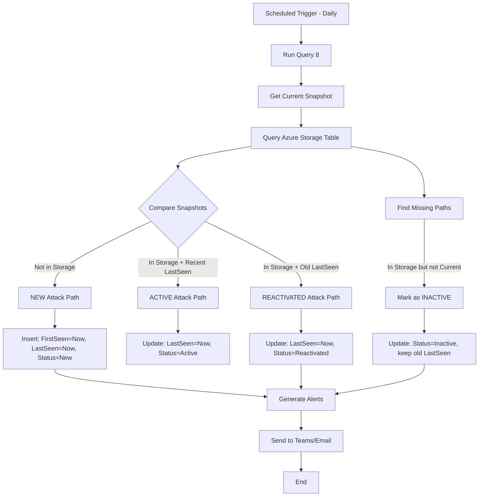

# MSEM Attack Path Chain Queries

This guide shows how to construct **complete attack path chains** by following edges through nodes, matching what MSEM portal displays.

---

## 🔗 Understanding Attack Path Structure

### Basic Structure
```
Node (Device) 
   ↓ Edge (can rdp)
Node (User Cookie) 
   ↓ Edge (can authenticate as)
Node (User) 
   ↓ Edge (has permission to)
Node (Storage Account)
```

### Data Structure
- **Nodes**: `ExposureGraphNodes` → NodeId, NodeName, NodeLabel (type), Categories, **NodeProperties** (JSON with rawData)
  - NodeProperties.rawData contains: exposureScore (string: High/Medium/Low/None), deviceName, lastSeen, firstSeenByInventory
- **Edges**: `ExposureGraphEdges` → SourceNodeId, TargetNodeId, EdgeLabel (relationship type)
- **Path**: Chain of Nodes connected by Edges

---
- **Edges**: `ExposureGraphEdges` -> EdgeLabel in ('contains', 'can authenticate to','member of','has role on','has credentials of', 'can authenticate as','frequently logged in','can impersonate as','affecting','runs on','routes traffic to', 'can rdp', 'can admin to', 'has permission to', 'can execute code')
- **Nodes**: `ExposureGraphNodes` -> NodeLabel in ('user','ec2.instance','computer-account','entra-userCookie','device', 'group','subscriptions', 'microsoft.logic/workflows','manageidentity','aws-userCookie','serviceprincipal','Microsoft Entra OAth App','resourcegroups','microsoft.hybridcompute/machines','microsoft.network/virtualnetworks','mdcSecurityRecommendation','mdcManagementRecommendation','Cve','microsoft.network/virtualnetworks/subnets','SaaS Application','mdcAuditingRecommendation','IP address','microsoft.keyvault/vaults','FileShare','microsoft.web/serverfarms','microsoft.resources/deployments','azure-logic-app-shared-access-signature','microsoft.authorization/locks','microsoft.compute/virtualmachines','microsoft.network/networkinterfaces','microsoft.web/site_azurefunction','microsoft.operationalinsights/workspaces','dataSensitivityScan','aws-access-key','microsoft.storage/storageaccounts','mdcSoftwareScanningtool','mde-healthFinding','ad-domain','microft.network/publicipaddresses','microsoft.network/networksecuritygroups','microsoft.automation/automationaccounts')

### Additional Node Fields (Entry Point Devices - in NodeProperties.rawData)
- **exposureScore**: MSEM calculated exposure score (Medium, Low, High, None) - `tostring(NodeProperties.rawData.exposureScore)`
- **deviceName**: Device name (alternative to NodeName) - `tostring(NodeProperties.rawData.deviceName)`
- **lastSeen**: Last time device was seen - `NodeProperties.rawData.lastSeen`
- **firstSeenByInventory**: When device first appeared in MSEM - `NodeProperties.rawData.firstSeenByInventory`

**Access Pattern**: Extract nested fields using `NodeProperties.rawData.<fieldname>` and convert types as needed

## 📊 Query 1: Simple 2-Hop Attack Paths

**Purpose**: Find direct attack paths (Source → Target)

```kql
// Get 2-hop attack paths with node details
let Edges = ExposureGraphEdges
    | where EdgeLabel in (
        'can authenticate as', 'can rdp', 'can admin to', 'has permission to', 'can execute code',
        'can authenticate to', 'has credentials of', 'can impersonate as', 'frequently logged in',
        'has role on', 'member of'
    )
    | extend SourceNodeId = tostring(SourceNodeId), TargetNodeId = tostring(TargetNodeId)
    | project SourceNodeId, TargetNodeId, EdgeLabel;
let Nodes = ExposureGraphNodes
    | extend NodeId = tostring(NodeId)
    | extend 
        exposureScore = tostring(NodeProperties.rawData.exposureScore),
        deviceName = tostring(NodeProperties.rawData.deviceName),
        lastSeen = NodeProperties.rawData.lastSeen,
        firstSeenByInventory = NodeProperties.rawData.firstSeenByInventory
    | project NodeId, NodeName, NodeLabel, Categories, exposureScore, deviceName, lastSeen, firstSeenByInventory;
Edges
| join kind=inner (Nodes) on $left.SourceNodeId == $right.NodeId
| project-rename SourceNodeName = NodeName, SourceNodeType = NodeLabel, SourceCategories = Categories, 
    SourceExposure = exposureScore, SourceDeviceName = deviceName, 
    SourceLastSeen = lastSeen, SourceFirstSeen = firstSeenByInventory
| join kind=inner (Nodes) on $left.TargetNodeId == $right.NodeId
| project-rename TargetNodeName = NodeName, TargetNodeType = NodeLabel, TargetCategories = Categories,
    TargetExposure = exposureScore, TargetDeviceName = deviceName,
    TargetLastSeen = lastSeen, TargetFirstSeen = firstSeenByInventory
| extend 
    AttackPathName = strcat(SourceNodeName, ' → ', TargetNodeName),
    AttackPathDescription = strcat(SourceNodeType, ' can access ', TargetNodeType, ' via ', EdgeLabel),
    PathLength = 2,
    // Enhanced risk scoring with CriticalityLevel and exposureScore
    BaseRiskScore = case(
        // Critical: Key infrastructure and secrets
        TargetNodeType in ('microsoft.keyvault/vaults', 'microsoft.storage/storageaccounts', 'aws-access-key', 'serviceprincipal'), 95,
        // High: Compute and logic resources
        TargetNodeType in ('microsoft.compute/virtualmachines', 'ec2.instance', 'microsoft.logic/workflows', 'microsoft.automation/automationaccounts'), 85,
        // High: Identity resources
        TargetNodeType in ('user', 'manageidentity', 'Microsoft Entra OAth App', 'entra-userCookie', 'aws-userCookie'), 80,
        // Medium: Network and groups
        TargetNodeType in ('microsoft.network/virtualnetworks', 'group', 'subscriptions', 'resourcegroups'), 65,
        // Medium: Other Azure resources
        TargetNodeType has_any ('microsoft.', 'aws-'), 60,
        40
    ),
    ExposureBonus = case(
        TargetExposure == 'High', 15,
        TargetExposure == 'Medium', 10,
        TargetExposure == 'Low', 5,
        0  // None or empty
    )
| extend 
    RiskScore = BaseRiskScore + ExposureBonus,
    RiskLevel = case(
        BaseRiskScore + ExposureBonus >= 95, 'Critical',
        BaseRiskScore + ExposureBonus >= 80, 'High',
        BaseRiskScore + ExposureBonus >= 60, 'Medium',
        'Low'
    )
| project 
    AttackPathName,
    AttackPathDescription,
    PathLength,
    RiskScore,
    RiskLevel,
    SourceNodeId,
    SourceNodeName,
    SourceNodeType,
    SourceExposure,
    SourceDeviceName,
    EdgeLabel,
    TargetNodeId,
    TargetNodeName,
    TargetNodeType,
    TargetExposure,
    TargetDeviceName,
    SourceCategories,
    TargetCategories,
    TargetLastSeen,
    TargetFirstSeen
| order by RiskScore desc
| take 100
```

---

## 📊 Query 2: Multi-Hop Attack Paths (3+ Hops)

**Purpose**: Construct complete attack path chains by recursively following edges

```kql
// Build 3-hop attack paths
let Edges = ExposureGraphEdges
    | where EdgeLabel in ('can authenticate as', 'can authenticate to', 'has credentials of', 'can impersonate as', 'frequently logged in', 'can rdp', 'can admin to', 'has permission to', 'can execute code', 'has role on', 'member of')
    | extend SourceNodeId = tostring(SourceNodeId), TargetNodeId = tostring(TargetNodeId)
    | project SourceNodeId, TargetNodeId, EdgeLabel;
let Nodes = ExposureGraphNodes
    | extend NodeId = tostring(NodeId)
    | project NodeId, NodeName, NodeLabel, Categories;
// Hop 1: Start → Intermediate1
let Hop1 = Edges
    | join kind=inner (Nodes) on $left.SourceNodeId == $right.NodeId
    | project 
        StartNodeId = SourceNodeId,
        StartNodeName = NodeName,
        StartNodeType = NodeLabel,
        Edge1 = EdgeLabel,
        Intermediate1Id = TargetNodeId;
// Hop 2: Intermediate1 → Intermediate2
let Hop2 = Hop1
    | join kind=inner (Edges) on $left.Intermediate1Id == $right.SourceNodeId
    | join kind=inner (Nodes) on $left.Intermediate1Id == $right.NodeId
    | project 
        StartNodeId,
        StartNodeName,
        StartNodeType,
        Edge1,
        Intermediate1Id,
        Intermediate1Name = NodeName,
        Intermediate1Type = NodeLabel,
        Edge2 = EdgeLabel,
        Intermediate2Id = TargetNodeId;
// Hop 3: Intermediate2 → End
let Hop3 = Hop2
    | join kind=inner (Edges) on $left.Intermediate2Id == $right.SourceNodeId
    | join kind=inner (Nodes) on $left.Intermediate2Id == $right.NodeId
    | project 
        StartNodeId,
        StartNodeName,
        StartNodeType,
        Edge1,
        Intermediate1Id,
        Intermediate1Name,
        Intermediate1Type,
        Edge2,
        Intermediate2Id,
        Intermediate2Name = NodeName,
        Intermediate2Type = NodeLabel,
        Edge3 = EdgeLabel,
        EndNodeId = TargetNodeId;
// Final: Get end node details
Hop3
| join kind=inner (Nodes) on $left.EndNodeId == $right.NodeId
| project 
    AttackPathName = strcat(StartNodeName, ' → ', Intermediate1Name, ' → ', Intermediate2Name, ' → ', NodeName),
    AttackStory = strcat(
        'Attacker starts from ', StartNodeType, ' (', StartNodeName, '), ',
        'uses ', Edge1, ' to access ', Intermediate1Type, ' (', Intermediate1Name, '), ',
        'then ', Edge2, ' to reach ', Intermediate2Type, ' (', Intermediate2Name, '), ',
        'and finally ', Edge3, ' to compromise ', NodeLabel, ' (', NodeName, ')'
    ),
    PathLength = 4,
    StartNode = StartNodeName,
    StartNodeType,
    Hop1_Edge = Edge1,
    Hop1_Node = Intermediate1Name,
    Hop1_NodeType = Intermediate1Type,
    Hop2_Edge = Edge2,
    Hop2_Node = Intermediate2Name,
    Hop2_NodeType = Intermediate2Type,
    Hop3_Edge = Edge3,
    EndNode = NodeName,
    EndNodeType = NodeLabel,
    RiskScore = case(
        NodeLabel in ('microsoft.keyvault/vaults', 'microsoft.storage/storageaccounts', 'aws-access-key', 'serviceprincipal', 'azure-logic-app-shared-access-signature'), 95,
        NodeLabel in ('microsoft.compute/virtualmachines', 'ec2.instance', 'microsoft.logic/workflows', 'microsoft.automation/automationaccounts', 'microsoft.hybridcompute/machines'), 85,
        NodeLabel in ('user', 'manageidentity', 'Microsoft Entra OAuth App', 'entra-userCookie', 'aws-userCookie', 'computer-account'), 80,
        NodeLabel in ('microsoft.network/virtualnetworks', 'microsoft.network/networksecuritygroups', 'group', 'subscriptions', 'resourcegroups', 'IP address'), 65,
        NodeLabel startswith 'microsoft.' or NodeLabel startswith 'aws-', 60,
        50
    )
| extend RiskLevel = case(
    RiskScore >= 90, 'Critical',
    RiskScore >= 75, 'High',
    RiskScore >= 60, 'Medium',
    'Low'
)
| order by RiskScore desc
| take 50
```

---

## 📊 Query 3: Attack Paths to Critical Resources

**Purpose**: Find all paths leading to high-value targets (storage accounts, key vaults, etc.)

```kql
// Find paths ending at critical Azure resources
let CriticalResourceTypes = dynamic([
    'microsoft.storage/storageaccounts',
    'microsoft.keyvault/vaults',
    'microsoft.compute/virtualmachines',
    'microsoft.logic/workflows',
    'microsoft.automation/automationaccounts',
    'ec2.instance',
    'aws-access-key',
    'serviceprincipal',
    'manageidentity',
    'azure-logic-app-shared-access-signature'
]);
let CriticalNodes = ExposureGraphNodes
    | extend NodeId = tostring(NodeId)
    | where NodeLabel has_any (CriticalResourceTypes)
    | project NodeId, CriticalNodeName = NodeName, CriticalNodeType = NodeLabel, Categories;
let Edges = ExposureGraphEdges
    | where EdgeLabel in ('can authenticate as', 'can authenticate to', 'has credentials of', 'can impersonate as', 'frequently logged in', 'can rdp', 'can admin to', 'has permission to', 'can execute code', 'has role on', 'member of', 'contains', 'affecting')
    | extend SourceNodeId = tostring(SourceNodeId), TargetNodeId = tostring(TargetNodeId);
let Nodes = ExposureGraphNodes
    | extend NodeId = tostring(NodeId)
    | project NodeId, NodeName, NodeLabel;
// Find edges leading to critical resources
Edges
| join kind=inner (CriticalNodes) on $left.TargetNodeId == $right.NodeId
| join kind=inner (Nodes) on $left.SourceNodeId == $right.NodeId
| summarize 
    IncomingPaths = count(),
    EdgeTypes = make_set(EdgeLabel),
    SourceNodes = make_set(NodeName),
    SourceTypes = make_set(NodeLabel)
    by TargetNodeId, CriticalNodeName, CriticalNodeType, Categories
| extend 
    RiskScore = IncomingPaths * 10 + array_length(Categories) * 5,
    AttackPathDescription = strcat(
        IncomingPaths, ' attack path(s) lead to ', CriticalNodeType, ' "', CriticalNodeName, '" ',
        'via ', array_length(EdgeTypes), ' different method(s)'
    )
| extend RiskLevel = case(
    RiskScore >= 100, 'Critical',
    RiskScore >= 50, 'High',
    RiskScore >= 20, 'Medium',
    'Low'
)
| project 
    CriticalResource = CriticalNodeName,
    ResourceType = CriticalNodeType,
    IncomingAttackPaths = IncomingPaths,
    AttackMethods = EdgeTypes,
    ExposureCategories = Categories,
    RiskScore,
    RiskLevel,
    AttackPathDescription,
    SourceNodeTypes = SourceTypes
| order by RiskScore desc
```

---

## 📊 Query 4: Attack Path Summary (Matches MSEM Dashboard)

**Purpose**: Get counts and statistics matching MSEM overview page

```kql
// Attack path summary statistics
let Edges = ExposureGraphEdges
    | where EdgeLabel in ('can authenticate as', 'can authenticate to', 'has credentials of', 'can impersonate as', 'frequently logged in', 'can rdp', 'can admin to', 'has permission to', 'can execute code', 'has role on', 'member of')
    | extend SourceNodeId = tostring(SourceNodeId), TargetNodeId = tostring(TargetNodeId);
let Nodes = ExposureGraphNodes
    | extend NodeId = tostring(NodeId);
let PathStats = Edges
    | join kind=inner (Nodes) on $left.TargetNodeId == $right.NodeId
    | extend 
        IsCriticalTarget = NodeLabel in ('microsoft.keyvault/vaults', 'microsoft.storage/storageaccounts', 'aws-access-key', 'serviceprincipal', 'azure-logic-app-shared-access-signature', 'microsoft.compute/virtualmachines', 'ec2.instance', 'microsoft.logic/workflows', 'microsoft.automation/automationaccounts'),
        IsHighRiskEdge = EdgeLabel in ('can admin to', 'has permission to', 'can execute code', 'can authenticate as', 'has credentials of')
    | summarize 
        TotalAttackPaths = count(),
        CriticalTargetPaths = countif(IsCriticalTarget),
        HighRiskPaths = countif(IsHighRiskEdge),
        UniqueTargets = dcount(TargetNodeId),
        UniqueEdgeTypes = dcount(EdgeLabel)
        by EdgeLabel;
PathStats
| extend 
    Timestamp = now(),
    PathCategory = case(
        EdgeLabel == 'can admin to', 'Administrative Access',
        EdgeLabel == 'can rdp', 'Remote Access',
        EdgeLabel in ('can authenticate as', 'can authenticate to', 'has credentials of', 'can impersonate as'), 'Authentication',
        EdgeLabel == 'has permission to', 'Permission-Based',
        EdgeLabel == 'can execute code', 'Code Execution',
        EdgeLabel in ('member of', 'has role on'), 'Group Membership',
        EdgeLabel == 'frequently logged in', 'User Activity',
        'Other'
    )
| project 
    Timestamp,
    PathCategory,
    EdgeType = EdgeLabel,
    TotalAttackPaths,
    CriticalTargetPaths,
    HighRiskPaths,
    UniqueTargets,
    RiskScore = (CriticalTargetPaths * 10) + (HighRiskPaths * 5)
| order by RiskScore desc
```

---

## 📊 Query 5: Device-to-Resource Attack Paths (Your Example)

**Purpose**: Find paths from devices to cloud resources (like your example)

```kql
// Paths starting from devices and ending at cloud resources
let StartDevices = ExposureGraphNodes
    | extend NodeId = tostring(NodeId)
    | where NodeLabel in ('device', 'microsoft.compute/virtualmachines', 'microsoft.hybridcompute/machines', 'ec2.instance', 'computer-account')
    | project DeviceNodeId = NodeId, DeviceName = NodeName;
let EndResources = ExposureGraphNodes
    | extend NodeId = tostring(NodeId)
    | where NodeLabel in ('microsoft.storage/storageaccounts', 'microsoft.keyvault/vaults', 'microsoft.logic/workflows', 'microsoft.automation/automationaccounts', 'serviceprincipal', 'manageidentity', 'aws-access-key')
    | project ResourceNodeId = NodeId, ResourceName = NodeName, ResourceType = NodeLabel;
let Edges = ExposureGraphEdges
    | where EdgeLabel in ('can authenticate as', 'can authenticate to', 'has credentials of', 'can impersonate as', 'frequently logged in', 'can rdp', 'can admin to', 'has permission to', 'can execute code', 'has role on', 'member of')
    | extend SourceNodeId = tostring(SourceNodeId), TargetNodeId = tostring(TargetNodeId);
// Build 2-hop paths: Device → Intermediate → Resource
let Hop1 = Edges
    | join kind=inner (StartDevices) on $left.SourceNodeId == $right.DeviceNodeId
    | project DeviceNodeId, DeviceName, Edge1 = EdgeLabel, IntermediateId = TargetNodeId;
let Hop2 = Hop1
    | join kind=inner (Edges) on $left.IntermediateId == $right.SourceNodeId
    | join kind=inner (ExposureGraphNodes | extend NodeId = tostring(NodeId) | project NodeId, NodeName, NodeLabel) 
        on $left.IntermediateId == $right.NodeId
    | project DeviceNodeId, DeviceName, Edge1, IntermediateId, IntermediateName = NodeName, IntermediateType = NodeLabel, 
        Edge2 = EdgeLabel, ResourceNodeId = TargetNodeId;
// Match with end resources
Hop2
| join kind=inner (EndResources) on $left.ResourceNodeId == $right.ResourceNodeId
| extend 
    AttackPathName = strcat(DeviceName, ' → ', IntermediateName, ' → ', ResourceName),
    AttackStory = strcat(
        'Device "', DeviceName, '" ', Edge1, ' ', IntermediateType, ' "', IntermediateName, 
        '" which ', Edge2, ' ', ResourceType, ' "', ResourceName, '"'
    ),
    PathLength = 3,
    RiskScore = case(
        ResourceType in ('microsoft.keyvault/vaults', 'microsoft.storage/storageaccounts', 'aws-access-key'), 95,
        ResourceType in ('microsoft.logic/workflows', 'microsoft.automation/automationaccounts', 'serviceprincipal'), 85,
        ResourceType in ('manageidentity', 'Microsoft Entra OAuth App'), 80,
        70
    ),
    RiskLevel = case(
        ResourceType in ('microsoft.keyvault/vaults', 'microsoft.storage/storageaccounts', 'aws-access-key'), 'Critical',
        ResourceType in ('microsoft.logic/workflows', 'microsoft.automation/automationaccounts', 'serviceprincipal'), 'High',
        'Medium'
    )
| project 
    AttackPathName,
    AttackStory,
    PathLength,
    RiskScore,
    RiskLevel,
    StartDevice = DeviceName,
    IntermediateEntity = IntermediateName,
    IntermediateType,
    TargetResource = ResourceName,
    ResourceType,
    Edge1,
    Edge2
| order by RiskScore desc
| take 100
```

---

## 📊 Query 6: Generate Attack Path Metadata (Name, Description, Risk)

**Purpose**: Create enriched attack path metadata similar to MSEM UI

```kql
// Generate attack path metadata with risk assessment
let Edges = ExposureGraphEdges
    | where EdgeLabel in ('can authenticate as', 'can authenticate to', 'has credentials of', 'can impersonate as', 'frequently logged in', 'can rdp', 'can admin to', 'has permission to', 'can execute code', 'has role on', 'member of')
    | extend SourceNodeId = tostring(SourceNodeId), TargetNodeId = tostring(TargetNodeId);
let Nodes = ExposureGraphNodes
    | extend NodeId = tostring(NodeId)
    | extend 
        // Extract from NodeProperties.rawData
        exposureScore = tostring(NodeProperties.rawData.exposureScore),
        deviceName = tostring(NodeProperties.rawData.deviceName),
        lastSeen = NodeProperties.rawData.lastSeen,
        firstSeenByInventory = NodeProperties.rawData.firstSeenByInventory
    | extend 
        IsHighValue = NodeLabel in ('microsoft.keyvault/vaults', 'microsoft.storage/storageaccounts', 'aws-access-key', 'serviceprincipal', 'azure-logic-app-shared-access-signature', 'microsoft.compute/virtualmachines', 'ec2.instance', 'microsoft.logic/workflows', 'microsoft.automation/automationaccounts'),
        IsSensitive = array_length(Categories) >= 3,
        IsPrivileged = NodeLabel in ('user', 'manageidentity', 'serviceprincipal', 'Microsoft Entra OAuth App', 'group', 'computer-account')
    | project NodeId, NodeName, NodeLabel, Categories, IsHighValue, IsSensitive, IsPrivileged, exposureScore, deviceName, lastSeen, firstSeenByInventory;
Edges
| join kind=inner (Nodes) on $left.SourceNodeId == $right.NodeId
| project-rename 
    SourceName = NodeName, SourceType = NodeLabel, SourceIsHighValue = IsHighValue, 
    SourceIsSensitive = IsSensitive, SourceCategories = Categories, SourceIsPrivileged = IsPrivileged,
    SourceExposure = exposureScore, SourceDeviceName = deviceName,
    SourceLastSeen = lastSeen, SourceFirstSeen = firstSeenByInventory
| join kind=inner (Nodes) on $left.TargetNodeId == $right.NodeId
| project-rename 
    TargetName = NodeName, TargetType = NodeLabel, TargetIsHighValue = IsHighValue, 
    TargetIsSensitive = IsSensitive, TargetCategories = Categories, TargetIsPrivileged = IsPrivileged,
    TargetExposure = exposureScore, TargetDeviceName = deviceName,
    TargetLastSeen = lastSeen, TargetFirstSeen = firstSeenByInventory
| extend 
    // Generate attack path ID (similar to MSEM)
    AttackPathId = strcat(SourceNodeId, '_to_', TargetNodeId),
    
    // Generate human-readable name
    AttackPathName = strcat(SourceName, ' → ', TargetName),
    
    // Generate description
    AttackPathDescription = strcat(
        SourceType, ' can access ', TargetType, ' via "', EdgeLabel, '"'
    ),
    
    // Generate attack story
    AttackStory = strcat(
        'An attacker with access to ', SourceType, ' "', SourceName, '" ',
        'can leverage ', EdgeLabel, ' relationship ',
        'to compromise ', TargetType, ' "', TargetName, '"',
        case(
            TargetIsHighValue, '. This target is a high-value cloud resource.',
            TargetIsSensitive, '. This target has multiple exposure categories.',
            ''
        )
    ),
    
    // Calculate risk score
    BaseRisk = 20,
    TargetValueRisk = case(TargetIsHighValue, 40, 0),
    SensitivityRisk = array_length(TargetCategories) * 10,
    ExposureRisk = case(
        TargetExposure == 'High', 20,
        TargetExposure == 'Medium', 15,
        TargetExposure == 'Low', 10,
        0  // None or empty
    ),
    EdgeRisk = case(
        EdgeLabel in ('can admin to', 'can execute code', 'has credentials of'), 30,
        EdgeLabel in ('has permission to', 'can rdp', 'can authenticate as', 'can impersonate as'), 20,
        EdgeLabel in ('can authenticate to', 'has role on', 'frequently logged in'), 15,
        EdgeLabel == 'member of', 10,
        5
    ),
    
    PathLength = 2
| extend 
    TotalRiskScore = BaseRisk + TargetValueRisk + SensitivityRisk + ExposureRisk + EdgeRisk,
    RiskLevel = case(
        BaseRisk + TargetValueRisk + SensitivityRisk + ExposureRisk + EdgeRisk >= 100, 'Critical',
        BaseRisk + TargetValueRisk + SensitivityRisk + ExposureRisk + EdgeRisk >= 80, 'High',
        BaseRisk + TargetValueRisk + SensitivityRisk + ExposureRisk + EdgeRisk >= 50, 'Medium',
        'Low'
    ),
    
    // Remediation guidance
    RemediationGuidance = case(
        EdgeLabel == 'can admin to', 'Review and restrict administrative access',
        EdgeLabel == 'can execute code', 'Implement code execution controls',
        EdgeLabel == 'has permission to', 'Review and minimize permissions',
        EdgeLabel == 'can rdp', 'Secure RDP access with MFA and network controls',
        EdgeLabel in ('can authenticate as', 'can authenticate to'), 'Review authentication delegation',
        EdgeLabel == 'has credentials of', 'Secure credential storage and rotation',
        EdgeLabel == 'can impersonate as', 'Review impersonation permissions',
        EdgeLabel == 'has role on', 'Review role assignments',
        EdgeLabel == 'member of', 'Review group membership',
        EdgeLabel == 'frequently logged in', 'Monitor user activity patterns',
        'Review and restrict access'
    )
| project 
    Timestamp = now(),
    AttackPathId,
    AttackPathName,
    AttackPathDescription,
    AttackStory,
    PathLength,
    TotalRiskScore,
    RiskLevel,
    EdgeType = EdgeLabel,
    SourceNodeId,
    SourceName,
    SourceType,
    SourceExposure,
    SourceDeviceName,
    SourceFirstSeen,
    TargetNodeId,
    TargetName,
    TargetType,
    TargetExposure,
    TargetDeviceName,
    TargetFirstSeen,
    SourceCategories,
    TargetCategories,
    RemediationGuidance
| order by TotalRiskScore desc
| take 100
```

---

## 📊 Query 7: New Entry Point Devices (Detect Recent Threats)

**Purpose**: Find newly discovered entry point devices and their attack paths

```kql
// Find entry point devices discovered in last 7 days
let RecentDevices = ExposureGraphNodes
    | extend NodeId = tostring(NodeId)
    | where NodeLabel in ('device', 'microsoft.compute/virtualmachines', 'microsoft.hybridcompute/machines', 'ec2.instance', 'computer-account')
    | extend 
        // Extract from NodeProperties.rawData
        exposureScore = tostring(NodeProperties.rawData.exposureScore),
        deviceName = tostring(NodeProperties.rawData.deviceName),
        lastSeen = NodeProperties.rawData.lastSeen,
        firstSeenByInventory = NodeProperties.rawData.firstSeenByInventory
    | where isnotempty(firstSeenByInventory)
    | where firstSeenByInventory >= ago(7d)  // Discovered in last 7 days
    | project 
        DeviceNodeId = NodeId, 
        DeviceName = coalesce(deviceName, NodeName), 
        DeviceType = NodeLabel, 
        exposureScore, 
        firstSeenByInventory, 
        lastSeen, 
        Categories;
let Edges = ExposureGraphEdges
    | where EdgeLabel in ('can authenticate as', 'can authenticate to', 'has credentials of', 'can impersonate as', 'frequently logged in', 'can rdp', 'can admin to', 'has permission to', 'can execute code', 'has role on', 'member of')
    | extend SourceNodeId = tostring(SourceNodeId), TargetNodeId = tostring(TargetNodeId);
let Nodes = ExposureGraphNodes
    | extend NodeId = tostring(NodeId)
    | project NodeId, NodeName, NodeLabel, Categories;
// Find all attack paths FROM these new devices
Edges
| join kind=inner (RecentDevices) on $left.SourceNodeId == $right.DeviceNodeId
| join kind=inner (Nodes) on $left.TargetNodeId == $right.NodeId
| extend 
    AttackPathId = strcat(DeviceNodeId, '_to_', TargetNodeId),
    AttackPathName = strcat(DeviceName, ' [NEW] → ', NodeName),
    AttackPathDescription = strcat('Newly discovered ', DeviceType, ' can access ', NodeLabel, ' via ', EdgeLabel),
    AttackStory = strcat(
        'NEW ENTRY POINT: Device "', DeviceName, '" was first discovered on ', format_datetime(firstSeenByInventory, 'yyyy-MM-dd'), '. ',
        'This device can ', EdgeLabel, ' ', NodeLabel, ' "', NodeName, '". ',
        case(
            exposureScore == 'High', 'Device has HIGH exposure score. ',
            exposureScore == 'Medium', 'Device has MEDIUM exposure score. ',
            exposureScore == 'Low', 'Device has LOW exposure score. ',
            ''
        ),
        'Immediate review recommended.'
    ),
    DaysSinceDiscovery = datetime_diff('day', now(), firstSeenByInventory),
    // Enhanced risk scoring for NEW devices
    BaseRiskScore = case(
        NodeLabel in ('microsoft.keyvault/vaults', 'microsoft.storage/storageaccounts', 'aws-access-key', 'serviceprincipal'), 95,
        NodeLabel in ('microsoft.compute/virtualmachines', 'ec2.instance', 'microsoft.logic/workflows', 'microsoft.automation/automationaccounts'), 85,
        NodeLabel in ('user', 'manageidentity', 'Microsoft Entra OAuth App', 'entra-userCookie', 'aws-userCookie'), 80,
        NodeLabel in ('microsoft.network/virtualnetworks', 'group', 'subscriptions', 'resourcegroups'), 65,
        60
    ),
    NewDeviceBonus = 25,  // Additional risk because it's a NEW entry point
    ExposureBonus = case(
        exposureScore == 'High', 20,
        exposureScore == 'Medium', 15,
        exposureScore == 'Low', 10,
        0  // None or empty
    )
| extend 
    TotalRiskScore = BaseRiskScore + NewDeviceBonus + ExposureBonus,
    RiskLevel = case(
        BaseRiskScore + NewDeviceBonus + ExposureBonus >= 110, 'Critical',
        BaseRiskScore + NewDeviceBonus + ExposureBonus >= 90, 'High',
        BaseRiskScore + NewDeviceBonus + ExposureBonus >= 70, 'Medium',
        'Low'
    ),
    RemediationGuidance = strcat(
        'IMMEDIATE ACTION - New entry point discovered. ',
        case(
            EdgeLabel == 'can admin to', 'Review and restrict administrative access. ',
            EdgeLabel == 'can execute code', 'Implement code execution controls. ',
            EdgeLabel == 'has permission to', 'Review and minimize permissions. ',
            EdgeLabel == 'can rdp', 'Secure RDP access with MFA. ',
            EdgeLabel in ('can authenticate as', 'can authenticate to'), 'Review authentication delegation. ',
            EdgeLabel == 'has credentials of', 'Secure credential storage. ',
            ''
        ),
        'Verify device legitimacy and isolate if suspicious.'
    )
| project 
    Timestamp = now(),
    AlertSeverity = 'High - New Entry Point',
    AttackPathId,
    AttackPathName,
    AttackPathDescription,
    AttackStory,
    TotalRiskScore,
    RiskLevel,
    DeviceNodeId,
    DeviceName,
    DeviceType,
    exposureScore,
    firstSeenByInventory,
    DaysSinceDiscovery,
    lastSeen,
    EdgeType = EdgeLabel,
    TargetNodeId,
    TargetName = NodeName,
    TargetType = NodeLabel,
    RemediationGuidance,
    DeviceCategories = Categories,
    TargetCategories = Categories1
| order by TotalRiskScore desc, DaysSinceDiscovery asc
```

---

## 🎯 Logic App Recommendation - Implementing Status Tracking

**Problem**: MSEM tables don't have Status field (New/Active/Inactive), so we can't track attack path lifecycle.

**Solution**: Implement our own status tracking using Azure Storage Table snapshots.

---

## 📊 Query 8: Attack Path Snapshot with Lifecycle Tracking

**Purpose**: Generate complete attack path snapshot with metadata for lifecycle tracking

```kql
// Generate comprehensive attack path snapshot for lifecycle tracking
let Edges = ExposureGraphEdges
    | where EdgeLabel in ('can authenticate as', 'can authenticate to', 'has credentials of', 'can impersonate as', 'frequently logged in', 'can rdp', 'can admin to', 'has permission to', 'can execute code', 'has role on', 'member of')
    | extend SourceNodeId = tostring(SourceNodeId), TargetNodeId = tostring(TargetNodeId);
let Nodes = ExposureGraphNodes
    | extend NodeId = tostring(NodeId)
    | extend 
        exposureScore = tostring(NodeProperties.rawData.exposureScore),
        deviceName = tostring(NodeProperties.rawData.deviceName),
        firstSeenByInventory = NodeProperties.rawData.firstSeenByInventory
    | extend 
        IsHighValue = NodeLabel in ('microsoft.keyvault/vaults', 'microsoft.storage/storageaccounts', 'aws-access-key', 'serviceprincipal', 'azure-logic-app-shared-access-signature', 'microsoft.compute/virtualmachines', 'ec2.instance', 'microsoft.logic/workflows', 'microsoft.automation/automationaccounts')
    | project NodeId, NodeName, NodeLabel, Categories, IsHighValue, exposureScore, deviceName, firstSeenByInventory;
Edges
| join kind=inner (Nodes) on $left.SourceNodeId == $right.NodeId
| project-rename 
    SourceName = NodeName, SourceType = NodeLabel, SourceCategories = Categories,
    SourceIsHighValue = IsHighValue, SourceExposure = exposureScore, SourceDeviceName = deviceName,
    SourceFirstSeen = firstSeenByInventory
| join kind=inner (Nodes) on $left.TargetNodeId == $right.NodeId
| project-rename 
    TargetName = NodeName, TargetType = NodeLabel, TargetCategories = Categories,
    TargetIsHighValue = IsHighValue, TargetExposure = exposureScore, TargetDeviceName = deviceName,
    TargetFirstSeen = firstSeenByInventory
| extend 
    // Generate unique attack path ID
    AttackPathId = hash_sha256(strcat(SourceNodeId, '|', EdgeLabel, '|', TargetNodeId)),
    
    // Metadata
    AttackPathName = strcat(SourceName, ' → ', TargetName),
    AttackPathDescription = strcat(SourceType, ' ', EdgeLabel, ' ', TargetType),
    
    // Risk calculation
    BaseRisk = 20,
    TargetValueRisk = case(TargetIsHighValue, 40, 0),
    SensitivityRisk = array_length(TargetCategories) * 10,
    ExposureRisk = case(
        TargetExposure == 'High', 20,
        TargetExposure == 'Medium', 15,
        TargetExposure == 'Low', 10,
        0
    ),
    EdgeRisk = case(
        EdgeLabel in ('can admin to', 'can execute code', 'has credentials of'), 30,
        EdgeLabel in ('has permission to', 'can rdp', 'can authenticate as', 'can impersonate as'), 20,
        EdgeLabel in ('can authenticate to', 'has role on', 'frequently logged in'), 15,
        EdgeLabel == 'member of', 10,
        5
    )
| extend 
    TotalRiskScore = BaseRisk + TargetValueRisk + SensitivityRisk + ExposureRisk + EdgeRisk,
    RiskLevel = case(
        BaseRisk + TargetValueRisk + SensitivityRisk + ExposureRisk + EdgeRisk >= 100, 'Critical',
        BaseRisk + TargetValueRisk + SensitivityRisk + ExposureRisk + EdgeRisk >= 80, 'High',
        BaseRisk + TargetValueRisk + SensitivityRisk + ExposureRisk + EdgeRisk >= 50, 'Medium',
        'Low'
    ),
    SnapshotTimestamp = now()
| project 
    AttackPathId,
    AttackPathName,
    AttackPathDescription,
    SourceNodeId,
    SourceName,
    SourceType,
    SourceExposure,
    EdgeLabel,
    TargetNodeId,
    TargetName,
    TargetType,
    TargetExposure,
    TotalRiskScore,
    RiskLevel,
    SourceCategories,
    TargetCategories,
    SnapshotTimestamp
```

---

## 🏗️ Complete Solution Architecture

### Azure Storage Table Schema

**Table Name**: `MSEMAttackPathSnapshots`

| Column | Type | Description |
|--------|------|-------------|
| PartitionKey | String | "AttackPath" (fixed) |
| RowKey | String | AttackPathId (SHA256 hash) |
| AttackPathName | String | Human-readable path name |
| AttackPathDescription | String | Path description |
| SourceNodeId | String | Source node ID |
| SourceName | String | Source node name |
| SourceType | String | Source node type |
| EdgeLabel | String | Edge relationship type |
| TargetNodeId | String | Target node ID |
| TargetName | String | Target node name |
| TargetType | String | Target node type |
| RiskScore | Int | Calculated risk score |
| RiskLevel | String | Critical/High/Medium/Low |
| **FirstSeenTimestamp** | DateTime | When path first appeared |
| **LastSeenTimestamp** | DateTime | When path last appeared |
| **Status** | String | **New/Active/Inactive/Reactivated** |
| **DaysSinceFirstSeen** | Int | Age of attack path |
| **DaysSinceLastSeen** | Int | Days since last observed |

---

## 🔄 Logic App Implementation (⭐ RECOMMENDED SOLUTION)

### **Workflow: Daily Attack Path Snapshot with Status Tracking**



---

## 📋 Logic App Steps Implementation

### **Step 1: Run Query 8 (HTTP - Advanced Hunting API)**
- Method: POST
- URL: `https://api.security.microsoft.com/api/advancedhunting/run`
- Authentication: Managed Identity
- Body: Query 8 KQL
- Output: CurrentSnapshot (array of attack paths)

### **Step 2: Query Existing Paths (Azure Storage Table)**
- Action: Get entities from Azure Table Storage
- Table: MSEMAttackPathSnapshots
- Filter: PartitionKey eq 'AttackPath'
- Output: PreviousSnapshot

### **Step 3: Classify Each Current Path (For Each Loop)**

```javascript
// Pseudo-logic for each path in CurrentSnapshot
if (AttackPathId NOT in PreviousSnapshot) {
    Status = "New"
    FirstSeenTimestamp = Now
    LastSeenTimestamp = Now
    Alert = TRUE
    AlertType = "🆕 NEW Attack Path Discovered"
}
else if (PreviousSnapshot[AttackPathId].LastSeenTimestamp < (Now - 7 days)) {
    Status = "Reactivated"
    FirstSeenTimestamp = PreviousSnapshot[AttackPathId].FirstSeenTimestamp  // Keep original
    LastSeenTimestamp = Now
    Alert = TRUE
    AlertType = "⚠️ Attack Path REACTIVATED"
}
else {
    Status = "Active"
    FirstSeenTimestamp = PreviousSnapshot[AttackPathId].FirstSeenTimestamp  // Keep original
    LastSeenTimestamp = Now
    Alert = FALSE  // Only alert if RiskScore increased
}
```

### **Step 4: Find Inactive Paths**

```javascript
// For each path in PreviousSnapshot
if (AttackPathId NOT in CurrentSnapshot) {
    Status = "Inactive"
    // Keep existing FirstSeen and LastSeen (don't update)
    Alert = TRUE
    AlertType = "✅ Attack Path REMEDIATED (Inactive)"
}
```

### **Step 5: Update Storage Table**
- Insert/Update entities in MSEMAttackPathSnapshots
- Batch operation for performance

### **Step 6: Generate Alerts**

**Alert on:**
- ✅ **New Paths** (Status = New)
- ✅ **Reactivated Paths** (Status = Reactivated)  
- ✅ **Inactive Paths** (Status = Inactive) - Good news!
- ⚠️ **High-Risk Active Paths** (RiskScore >= 100)

---

## 📧 Alert Templates

### New Attack Path Alert
```
🆕 NEW ATTACK PATH DETECTED
━━━━━━━━━━━━━━━━━━━━━━━━━━━━━━
Attack Path: [AttackPathName]
Risk Level: [RiskLevel] (Score: [RiskScore])
First Seen: [FirstSeenTimestamp]

Path Details:
[SourceName] ([SourceType]) 
   ↓ [EdgeLabel]
[TargetName] ([TargetType])

Status: NEW
Action Required: Immediate investigation
```

### Reactivated Attack Path Alert
```
⚠️ ATTACK PATH REACTIVATED
━━━━━━━━━━━━━━━━━━━━━━━━━━━━━━
Attack Path: [AttackPathName]
Risk Level: [RiskLevel] (Score: [RiskScore])
First Seen: [FirstSeenTimestamp]
Last Seen Previously: [PreviousLastSeen]
Inactive Duration: [DaysInactive] days
Reactivated: [Now]

Status: REACTIVATED
Warning: Previously remediated path has returned!
```

### Remediated Attack Path (Good News!)
```
✅ ATTACK PATH REMEDIATED
━━━━━━━━━━━━━━━━━━━━━━━━━━━━━━
Attack Path: [AttackPathName]
Risk Level: [RiskLevel] (Score: [RiskScore])
First Seen: [FirstSeenTimestamp]
Last Seen: [LastSeenTimestamp]
Inactive Duration: [DaysInactive] days

Status: INACTIVE
Good News: Attack path no longer detected!
Note: Monitoring continues for reactivation.
```

---

## 🎯 Why This Solution Works

### ✅ Solves Your Key Concerns:

1. **NEW Detection**: Paths not in storage = genuinely new
2. **ACTIVE Tracking**: Paths seen in current AND previous run = persistent threat
3. **INACTIVE Detection**: Paths in storage but not current run = remediated
4. **REACTIVATED Detection**: Paths inactive >7 days but back now = regression
5. **No False Positives**: Hash-based AttackPathId ensures same path = same ID
6. **Full Lifecycle Visibility**: Track from discovery → active → remediation → reactivation

### ✅ Additional Benefits:

- **Trend Analysis**: DaysSinceFirstSeen shows path age
- **Remediation Validation**: Inactive status confirms fix worked
- **Regression Alerts**: Reactivated status catches regressions
- **Risk Prioritization**: Focus on NEW high-risk paths
- **Compliance Reporting**: Full audit trail of all attack paths

---

## 🚀 Next Steps - Implementation Options

### Option A: Full Lifecycle Tracking (⭐ RECOMMENDED)
1. **Logic App** with Query 8 + Azure Storage Table
2. **Daily runs** with snapshot comparison
3. **All status types**: New/Active/Inactive/Reactivated
4. **Complete visibility** into attack path lifecycle

### Option B: New Entry Points Only (Simpler)
1. **Logic App** with Query 7 (new devices via firstSeenByInventory)
2. **No storage needed** - uses built-in field
3. **Limited scope**: Only detects new entry point devices
4. **Quick to implement** but misses path lifecycle

### Option C: Hybrid Approach
1. **Query 7** for new entry point devices (immediate)
2. **Query 8** for full attack path lifecycle (comprehensive)
3. **Best of both worlds** but more complex

---

## 📝 Important Notes

### Fields Not in KQL Tables
These are **calculated by MSEM backend**, not available in ExposureGraphNodes/Edges:
- ❌ **Status** (New/Active/Inactive) - Not in tables, calculated by MSEM
- ❌ **Attack Path Name** - Must be generated from node names
- ❌ **Attack Story** - Must be generated from path components
- ❌ **Risk Score** - Must be calculated based on node types and edge types
- ❌ **Remediation Steps** - Must be defined based on edge types

### What IS Available in Tables
- ✅ **NodeId, NodeName, NodeLabel** (ExposureGraphNodes)
- ✅ **Categories** (exposure categories on nodes)
- ✅ **NodeProperties.rawData.exposureScore** (string: High/Medium/Low/None) - `tostring()`
- ✅ **NodeProperties.rawData.deviceName** (alternative name field for devices) - `tostring()`
- ✅ **NodeProperties.rawData.lastSeen** (last time device was observed)
- ✅ **NodeProperties.rawData.firstSeenByInventory** (when device first appeared in MSEM) - **KEY for detecting "NEW" devices**
- ✅ **SourceNodeId, TargetNodeId, EdgeLabel** (ExposureGraphEdges)

**Note**: Extract nested fields using `NodeProperties.rawData.<fieldname>` and convert types using `tostring()` for string fields

### Best Approach
Use **Query 6** for comprehensive attack path metadata OR **Query 7** (⭐ RECOMMENDED) for automatic detection of new entry points using `firstSeenByInventory`.

---

## 🚀 Ready to Implement?

I can create complete Logic App ARM templates for:

### ⭐ Option A: Full Attack Path Lifecycle Tracking (RECOMMENDED)
**Solves your Status problem completely!**
- Creates Azure Storage Table for snapshots
- Implements NEW/ACTIVE/INACTIVE/REACTIVATED status logic
- Daily snapshot comparisons
- Alerts on: New paths, Reactivated paths, Remediated paths
- Full lifecycle visibility and audit trail
- **Addresses your concern**: "without status we can't do anything"

### Option B: New Entry Point Devices Only (Quick Start)
- Uses Query 7 with firstSeenByInventory field
- No storage needed
- Alerts on newly discovered devices in last 7 days
- Limited scope but quick to implement

### Option C: Hybrid Solution (Maximum Coverage)
- Query 7 for new device alerts (immediate)
- Query 8 for full lifecycle tracking (comprehensive)
- Both stored state and time-based detection

**Which option would you like me to create?** Option A (Full Lifecycle) is recommended since it completely solves the Status field problem you identified.
