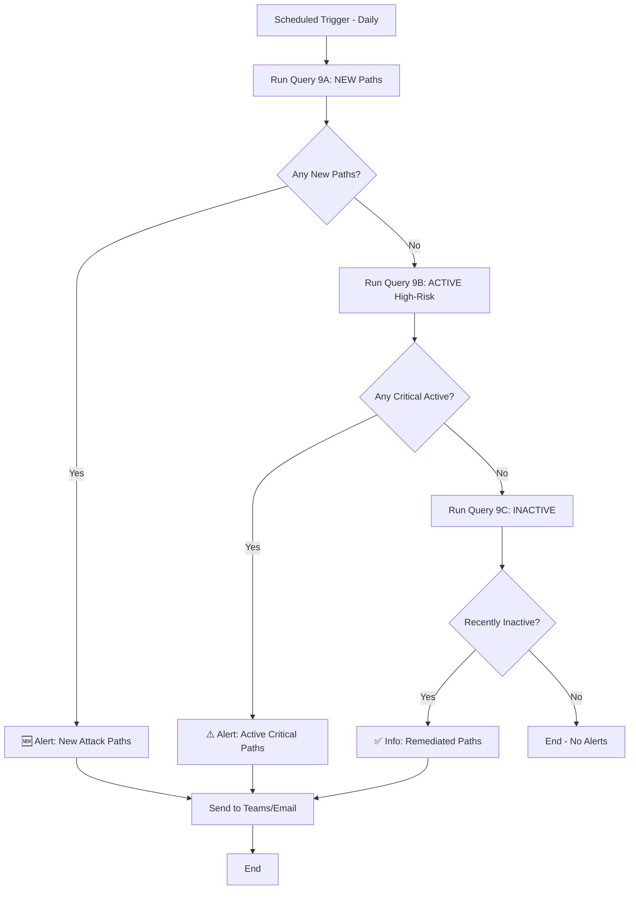

# MSEM Attack Path Chain Queries

This guide shows how to construct **complete attack path chains** by following edges through nodes, matching what MSEM portal displays.

## 🎯 Key Insights (Updated)

### Attack Path Grouping
**MSEM groups attack paths by EntryPoint (device) → unique FinalTarget:**
- One EntryPoint can have multiple paths to different FinalTargets
- **FinalTarget = High-value resources** (storage accounts, key vaults)
- **Intermediate nodes** (users, cookies) are NOT counted as targets
- Each complete chain = Unique attack path
- Status calculated per EntryPoint based on `firstSeenByInventory` + `lastSeen`

### Attack Path Structure (CRITICAL!)
**Multi-hop chains** (not simple 2-hop):
```
Device (EntryPoint)
   ↓ Edge 1
Intermediate Node 1 (e.g., entra-userCookie)
   ↓ Edge 2
Intermediate Node 2 (e.g., user)  ← Users are INTERMEDIATE, not targets!
   ↓ Edge 3
FinalTarget (storage/keyvault)     ← THIS is the target
```

**Example from real data**:
- device (a3f79) → entra-userCookie (36c56) → user (dbc6c) → storage account (2e17099)

### Status Logic (Discovered from MSEM Logs)
- **New**: firstSeen ≤ 7 days AND lastSeen = today
- **Active**: firstSeen > 7 days AND lastSeen = today
- **Inactive**: firstSeen > 7 days AND lastSeen > 7 days

### Critical Field Locations
- ✅ `exposureScore`: `NodeProperties.rawData.exposureScore` (string)
- ✅ `criticalityLevel`: `NodeProperties.rawData.criticalityLevel.criticalityLevel` ⚠️ **Double nested!**
- ✅ `deviceName`: `NodeProperties.rawData.deviceName`
- ✅ `firstSeenByInventory`: `NodeProperties.rawData.firstSeenByInventory` (Status calculation)
- ✅ `lastSeen`: `NodeProperties.rawData.lastSeen` (Status calculation)

### Recommended Queries
- ⭐ **Query 7B**: Multi-hop paths to storage/keyvault (all statuses)
- ⭐ **Query 7C**: NEW multi-hop paths to storage/keyvault (ALERTS)
- ⚠️ **Query 8, 9A, 9B, 9C**: 2-hop queries (may show users as targets - less accurate)

---

## ⚡ Quick Start - What to Use

**For Logic App Alerts**: Use **Query 7C** 
- Shows: Device → userCookie → user → **storage/keyvault**
- Filters: NEW paths only (discovered ≤ 7 days)
- Target: Only high-value resources (storage accounts, key vaults)
- Users are intermediate nodes, NOT targets ✅

**For Analysis**: Use **Query 7B**
- Same as 7C but shows all statuses (NEW/ACTIVE/INACTIVE)
- Great for dashboards and trending

---

## 🔗 Understanding Attack Path Structure

### Basic Structure
```
Node (Device) 
   ↓ Edge (can rdp)
Node (User Cookie) 
   ↓ Edge (can authenticate as)
Node (User) 
   ↓ Edge (has permission to)
Node (Storage Account)
```

### Data Structure
- **Nodes**: `ExposureGraphNodes` → NodeId, NodeName, NodeLabel (type), Categories, **NodeProperties** (JSON with rawData)
  - NodeProperties.rawData contains: exposureScore (string: High/Medium/Low/None), deviceName, lastSeen, firstSeenByInventory
- **Edges**: `ExposureGraphEdges` → SourceNodeId, TargetNodeId, EdgeLabel (relationship type)
- **Path**: Chain of Nodes connected by Edges

---
- **Edges**: `ExposureGraphEdges` -> EdgeLabel in ('contains', 'can authenticate to','member of','has role on','has credentials of', 'can authenticate as','frequently logged in','can impersonate as','affecting','runs on','routes traffic to', 'can rdp', 'can admin to', 'has permission to', 'can execute code')
- **Nodes**: `ExposureGraphNodes` -> NodeLabel in ('user','ec2.instance','computer-account','entra-userCookie','device', 'group','subscriptions', 'microsoft.logic/workflows','manageidentity','aws-userCookie','serviceprincipal','Microsoft Entra OAth App','resourcegroups','microsoft.hybridcompute/machines','microsoft.network/virtualnetworks','mdcSecurityRecommendation','mdcManagementRecommendation','Cve','microsoft.network/virtualnetworks/subnets','SaaS Application','mdcAuditingRecommendation','IP address','microsoft.keyvault/vaults','FileShare','microsoft.web/serverfarms','microsoft.resources/deployments','azure-logic-app-shared-access-signature','microsoft.authorization/locks','microsoft.compute/virtualmachines','microsoft.network/networkinterfaces','microsoft.web/site_azurefunction','microsoft.operationalinsights/workspaces','dataSensitivityScan','aws-access-key','microsoft.storage/storageaccounts','mdcSoftwareScanningtool','mde-healthFinding','ad-domain','microft.network/publicipaddresses','microsoft.network/networksecuritygroups','microsoft.automation/automationaccounts')

### Additional Node Fields (Entry Point Devices - in NodeProperties.rawData)
- **exposureScore**: MSEM calculated exposure score (Medium, Low, High, None) - `tostring(NodeProperties.rawData.exposureScore)`
- **deviceName**: Device name (alternative to NodeName) - `tostring(NodeProperties.rawData.deviceName)`
- **lastSeen**: Last time device was seen - `NodeProperties.rawData.lastSeen`
- **firstSeenByInventory**: When device first appeared in MSEM - `NodeProperties.rawData.firstSeenByInventory`
- **criticalityLevel**: Asset criticality level - `tostring(NodeProperties.rawData.criticalityLevel.criticalityLevel)` ⚠️ **Double nested!**

**Access Pattern**: Extract nested fields using `NodeProperties.rawData.<fieldname>` and convert types as needed
**Note**: criticalityLevel is double-nested: `NodeProperties.rawData.criticalityLevel.criticalityLevel`

### Attack Path Grouping Structure
**MSEM groups attack paths by EntryPoint (device) with unique Targets:**
- One EntryPoint → Multiple Targets = Multiple attack paths
- Each EntryPoint-Target combination = Unique attack path
- AttackPathId = `hash_sha256(EntryPointNodeId | EdgeLabel | TargetNodeId)`


## 📊 Query 1: Attack Paths to Critical Resources

**Purpose**: Find all paths leading to high-value targets (storage accounts, key vaults, etc.)

```kql
// Find paths ending at critical Azure resources using graph-match
let CriticalResourceTypes = dynamic([
    'microsoft.storage/storageaccounts',
    'microsoft.keyvault/vaults',
    'microsoft.compute/virtualmachines',
    'microsoft.logic/workflows',
    'microsoft.automation/automationaccounts',
    'ec2.instance',
    'aws-access-key',
    'serviceprincipal',
    'manageidentity',
    'azure-logic-app-shared-access-signature'
]);
ExposureGraphEdges
| where EdgeLabel in ('can authenticate as', 'can authenticate to', 'has credentials of', 'can impersonate as', 'frequently logged in', 'can rdp', 'can admin to', 'has permission to', 'can execute code', 'has role on', 'member of', 'contains', 'affecting')
| make-graph SourceNodeId --> TargetNodeId with ExposureGraphNodes on NodeId
| graph-match (SourceNode)-[Edge]->(TargetNode)
    where TargetNode.NodeLabel has_any (CriticalResourceTypes)
    project 
        SourceNodeId = SourceNode.NodeId,
        SourceNodeName = SourceNode.NodeName,
        SourceNodeType = SourceNode.NodeLabel,
        EdgeLabel = Edge.EdgeLabel,
        TargetNodeId = TargetNode.NodeId,
        CriticalNodeName = TargetNode.NodeName,
        CriticalNodeType = TargetNode.NodeLabel,
        Categories = TargetNode.Categories
| summarize 
    IncomingPaths = count(),
    EdgeTypes = make_set(EdgeLabel),
    SourceNodes = make_set(SourceNodeName),
    SourceTypes = make_set(SourceNodeType)
    by TargetNodeId, CriticalNodeName, CriticalNodeType, Categories
| extend 
    RiskScore = IncomingPaths * 10 + array_length(Categories) * 5,
    AttackPathDescription = strcat(
        IncomingPaths, ' attack path(s) lead to ', CriticalNodeType, ' "', CriticalNodeName, '" ',
        'via ', array_length(EdgeTypes), ' different method(s)'
    )
| extend RiskLevel = case(
    RiskScore >= 100, 'Critical',
    RiskScore >= 50, 'High',
    RiskScore >= 20, 'Medium',
    'Low'
)
| project 
    CriticalResource = CriticalNodeName,
    ResourceType = CriticalNodeType,
    IncomingAttackPaths = IncomingPaths,
    AttackMethods = EdgeTypes,
    ExposureCategories = Categories,
    RiskScore,
    RiskLevel,
    AttackPathDescription,
    SourceNodeTypes = SourceTypes
| order by RiskScore desc
```

---

## 📊 Query 2: Attack Path Summary (Matches MSEM Dashboard)

**Purpose**: Get counts and statistics matching MSEM overview page

```kql
// Attack path summary statistics using graph-match
ExposureGraphEdges
| where EdgeLabel in ('can authenticate as', 'can authenticate to', 'has credentials of', 'can impersonate as', 'frequently logged in', 'can rdp', 'can admin to', 'has permission to', 'can execute code', 'has role on', 'member of')
| make-graph SourceNodeId --> TargetNodeId with ExposureGraphNodes on NodeId
| graph-match (SourceNode)-[Edge]->(TargetNode)
    project 
        EdgeLabel = Edge.EdgeLabel,
        TargetNodeId = TargetNode.NodeId,
        TargetNodeLabel = TargetNode.NodeLabel
| extend 
    IsCriticalTarget = TargetNodeLabel in ('microsoft.keyvault/vaults', 'microsoft.storage/storageaccounts', 'aws-access-key', 'serviceprincipal', 'azure-logic-app-shared-access-signature', 'microsoft.compute/virtualmachines', 'ec2.instance', 'microsoft.logic/workflows', 'microsoft.automation/automationaccounts'),
    IsHighRiskEdge = EdgeLabel in ('can admin to', 'has permission to', 'can execute code', 'can authenticate as', 'has credentials of')
| summarize 
    TotalAttackPaths = count(),
    CriticalTargetPaths = countif(IsCriticalTarget),
    HighRiskPaths = countif(IsHighRiskEdge),
    UniqueTargets = dcount(TargetNodeId)
    by EdgeLabel
| extend 
    Timestamp = now(),
    PathCategory = case(
        EdgeLabel == 'can admin to', 'Administrative Access',
        EdgeLabel == 'can rdp', 'Remote Access',
        EdgeLabel in ('can authenticate as', 'can authenticate to', 'has credentials of', 'can impersonate as'), 'Authentication',
        EdgeLabel == 'has permission to', 'Permission-Based',
        EdgeLabel == 'can execute code', 'Code Execution',
        EdgeLabel in ('member of', 'has role on'), 'Group Membership',
        EdgeLabel == 'frequently logged in', 'User Activity',
        'Other'
    )
| project 
    Timestamp,
    PathCategory,
    EdgeType = EdgeLabel,
    TotalAttackPaths,
    CriticalTargetPaths,
    HighRiskPaths,
    UniqueTargets,
    RiskScore = (CriticalTargetPaths * 10) + (HighRiskPaths * 5)
| order by RiskScore desc
```

---

## 📊 Query 3: Device-to-Resource Attack Paths (Your Example)

**Purpose**: Find paths from devices to cloud resources (like your example)

```kql
// Multi-hop paths from devices to cloud resources using graph-match
let DeviceTypes = dynamic(['device', 'microsoft.compute/virtualmachines', 'microsoft.hybridcompute/machines', 'ec2.instance', 'computer-account']);
let ResourceTypes = dynamic(['microsoft.storage/storageaccounts', 'microsoft.keyvault/vaults', 'microsoft.logic/workflows', 'microsoft.automation/automationaccounts', 'serviceprincipal', 'manageidentity', 'aws-access-key']);
ExposureGraphEdges
| where EdgeLabel in ('can authenticate as', 'can authenticate to', 'has credentials of', 'can impersonate as', 'frequently logged in', 'can rdp', 'can admin to', 'has permission to', 'can execute code', 'has role on', 'member of')
| make-graph SourceNodeId --> TargetNodeId with ExposureGraphNodes on NodeId
| graph-match (Device)-[Edge1]->(Intermediate)-[Edge2]->(Resource)
    where Device.NodeLabel has_any (DeviceTypes) and set_has_element(Device.Categories, "device") and
          Resource.NodeLabel has_any (ResourceTypes) and
          Edge1.EdgeLabel in ('can authenticate as', 'can authenticate to', 'has credentials of', 'can impersonate as', 'frequently logged in', 'can rdp', 'can admin to', 'has role on', 'member of') and
          Edge2.EdgeLabel in ('can authenticate as', 'can authenticate to', 'has credentials of', 'can impersonate as', 'has permission to', 'can execute code', 'has role on')
    project 
        DeviceNodeId = Device.NodeId,
        DeviceName = Device.NodeName,
        DeviceType = Device.NodeLabel,
        Edge1Label = Edge1.EdgeLabel,
        IntermediateId = Intermediate.NodeId,
        IntermediateName = Intermediate.NodeName,
        IntermediateType = Intermediate.NodeLabel,
        Edge2Label = Edge2.EdgeLabel,
        ResourceNodeId = Resource.NodeId,
        ResourceName = Resource.NodeName,
        ResourceType = Resource.NodeLabel
| extend 
    AttackPathName = strcat(DeviceName, ' → ', IntermediateName, ' → ', ResourceName),
    AttackStory = strcat(
        'Device "', DeviceName, '" ', Edge1Label, ' ', IntermediateType, ' "', IntermediateName, 
        '" which ', Edge2Label, ' ', ResourceType, ' "', ResourceName, '"'
    ),
    PathLength = 3,
    RiskScore = case(
        ResourceType in ('microsoft.keyvault/vaults', 'microsoft.storage/storageaccounts', 'aws-access-key'), 95,
        ResourceType in ('microsoft.logic/workflows', 'microsoft.automation/automationaccounts', 'serviceprincipal'), 85,
        ResourceType in ('manageidentity', 'Microsoft Entra OAuth App'), 80,
        70
    ),
    RiskLevel = case(
        ResourceType in ('microsoft.keyvault/vaults', 'microsoft.storage/storageaccounts', 'aws-access-key'), 'Critical',
        ResourceType in ('microsoft.logic/workflows', 'microsoft.automation/automationaccounts', 'serviceprincipal'), 'High',
        'Medium'
    )
| project 
    AttackPathName,
    AttackStory,
    PathLength,
    RiskScore,
    RiskLevel,
    StartDevice = DeviceName,
    IntermediateEntity = IntermediateName,
    IntermediateType,
    TargetResource = ResourceName,
    ResourceType,
    Edge1 = Edge1Label,
    Edge2 = Edge2Label
| order by RiskScore desc
| take 100
```

---

## 📊 Query 4: Generate Attack Path Metadata (Name, Description, Risk)

**Purpose**: Create enriched attack path metadata similar to MSEM UI

```kql
// Generate attack path metadata with risk assessment using graph-match
ExposureGraphEdges
| where EdgeLabel in ('can authenticate as', 'can authenticate to', 'has credentials of', 'can impersonate as', 'frequently logged in', 'can rdp', 'can admin to', 'has permission to', 'can execute code', 'has role on', 'member of')
| make-graph SourceNodeId --> TargetNodeId with ExposureGraphNodes on NodeId
| graph-match (SourceNode)-[Edge]->(TargetNode)
    project 
        SourceNodeId = SourceNode.NodeId,
        SourceName = SourceNode.NodeName,
        SourceType = SourceNode.NodeLabel,
        SourceCategories = SourceNode.Categories,
        SourceProperties = SourceNode.NodeProperties,
        EdgeLabel = Edge.EdgeLabel,
        TargetNodeId = TargetNode.NodeId,
        TargetName = TargetNode.NodeName,
        TargetType = TargetNode.NodeLabel,
        TargetCategories = TargetNode.Categories,
        TargetProperties = TargetNode.NodeProperties
| extend 
    // Extract from NodeProperties.rawData
    SourceExposure = tostring(SourceProperties.rawData.exposureScore),
    SourceDeviceName = tostring(SourceProperties.rawData.deviceName),
    SourceLastSeen = todatetime(SourceProperties.rawData.lastSeen),
    SourceFirstSeen = todatetime(SourceProperties.rawData.firstSeenByInventory),
    SourceCriticalityLevel = tostring(SourceProperties.rawData.criticalityLevel.criticalityLevel),
    TargetExposure = tostring(TargetProperties.rawData.exposureScore),
    TargetDeviceName = tostring(TargetProperties.rawData.deviceName),
    TargetLastSeen = todatetime(TargetProperties.rawData.lastSeen),
    TargetFirstSeen = todatetime(TargetProperties.rawData.firstSeenByInventory),
    TargetCriticalityLevel = tostring(TargetProperties.rawData.criticalityLevel.criticalityLevel),
    // Boolean flags
    SourceIsHighValue = SourceType in ('microsoft.keyvault/vaults', 'microsoft.storage/storageaccounts', 'aws-access-key', 'serviceprincipal', 'azure-logic-app-shared-access-signature', 'microsoft.compute/virtualmachines', 'ec2.instance', 'microsoft.logic/workflows', 'microsoft.automation/automationaccounts'),
    TargetIsHighValue = TargetType in ('microsoft.keyvault/vaults', 'microsoft.storage/storageaccounts', 'aws-access-key', 'serviceprincipal', 'azure-logic-app-shared-access-signature', 'microsoft.compute/virtualmachines', 'ec2.instance', 'microsoft.logic/workflows', 'microsoft.automation/automationaccounts'),
    TargetIsSensitive = array_length(TargetCategories) >= 3
| extend 
    // Generate attack path ID (similar to MSEM)
    AttackPathId = strcat(SourceNodeId, '_to_', TargetNodeId),
    
    // Generate human-readable name
    AttackPathName = strcat(SourceName, ' → ', TargetName),
    
    // Generate description
    AttackPathDescription = strcat(
        SourceType, ' can access ', TargetType, ' via "', EdgeLabel, '"'
    ),
    
    // Generate attack story
    AttackStory = strcat(
        'An attacker with access to ', SourceType, ' "', SourceName, '" ',
        'can leverage ', EdgeLabel, ' relationship ',
        'to compromise ', TargetType, ' "', TargetName, '"',
        case(
            TargetIsHighValue, '. This target is a high-value cloud resource.',
            TargetIsSensitive, '. This target has multiple exposure categories.',
            ''
        )
    ),
    
    // Calculate risk score
    BaseRisk = 20,
    TargetValueRisk = case(TargetIsHighValue, 40, 0),
    SensitivityRisk = array_length(TargetCategories) * 10,
    ExposureRisk = case(
        TargetExposure == 'High', 20,
        TargetExposure == 'Medium', 15,
        TargetExposure == 'Low', 10,
        0  // None or empty
    ),
    EdgeRisk = case(
        EdgeLabel in ('can admin to', 'can execute code', 'has credentials of'), 30,
        EdgeLabel in ('has permission to', 'can rdp', 'can authenticate as', 'can impersonate as'), 20,
        EdgeLabel in ('can authenticate to', 'has role on', 'frequently logged in'), 15,
        EdgeLabel == 'member of', 10,
        5
    ),
    
    PathLength = 2
| extend 
    TotalRiskScore = BaseRisk + TargetValueRisk + SensitivityRisk + ExposureRisk + EdgeRisk,
    RiskLevel = case(
        BaseRisk + TargetValueRisk + SensitivityRisk + ExposureRisk + EdgeRisk >= 100, 'Critical',
        BaseRisk + TargetValueRisk + SensitivityRisk + ExposureRisk + EdgeRisk >= 80, 'High',
        BaseRisk + TargetValueRisk + SensitivityRisk + ExposureRisk + EdgeRisk >= 50, 'Medium',
        'Low'
    ),
    
    // Remediation guidance
    RemediationGuidance = case(
        EdgeLabel == 'can admin to', 'Review and restrict administrative access',
        EdgeLabel == 'can execute code', 'Implement code execution controls',
        EdgeLabel == 'has permission to', 'Review and minimize permissions',
        EdgeLabel == 'can rdp', 'Secure RDP access with MFA and network controls',
        EdgeLabel in ('can authenticate as', 'can authenticate to'), 'Review authentication delegation',
        EdgeLabel == 'has credentials of', 'Secure credential storage and rotation',
        EdgeLabel == 'can impersonate as', 'Review impersonation permissions',
        EdgeLabel == 'has role on', 'Review role assignments',
        EdgeLabel == 'member of', 'Review group membership',
        EdgeLabel == 'frequently logged in', 'Monitor user activity patterns',
        'Review and restrict access'
    )
| project 
    Timestamp = now(),
    AttackPathId,
    AttackPathName,
    AttackPathDescription,
    AttackStory,
    PathLength,
    TotalRiskScore,
    RiskLevel,
    EdgeType = EdgeLabel,
    SourceNodeId,
    SourceName,
    SourceType,
    SourceExposure,
    SourceCriticalityLevel,
    SourceDeviceName,
    SourceFirstSeen,
    TargetNodeId,
    TargetName,
    TargetType,
    TargetExposure,
    TargetCriticalityLevel,
    TargetDeviceName,
    TargetFirstSeen,
    SourceCategories,
    TargetCategories,
    RemediationGuidance
| order by TotalRiskScore desc
| take 100
```

---

## 📊 Query 5: New Entry Point Devices (Detect Recent Threats)

**Purpose**: Find newly discovered entry point devices and their attack paths

```kql
// Find entry point devices discovered in last 7 days using graph-match
let DeviceTypes = dynamic(['device', 'microsoft.compute/virtualmachines', 'microsoft.hybridcompute/machines', 'ec2.instance', 'computer-account']);
let RecentDevices = ExposureGraphNodes
| where NodeLabel has_any (DeviceTypes) and (Categories has "device" and set_has_element(Categories, "device"))
| extend 
    // Extract from NodeProperties.rawData
    exposureScore = tostring(NodeProperties.rawData.exposureScore),
    deviceName = tostring(NodeProperties.rawData.deviceName),
    lastSeen = todatetime(NodeProperties.rawData.lastSeen),
    firstSeenByInventory = todatetime(NodeProperties.rawData.firstSeenByInventory)
| where isnotempty(firstSeenByInventory)
| where firstSeenByInventory >= ago(7d)  // Discovered in last 7 days
| project 
    DeviceNodeId = NodeId, 
    DeviceName = coalesce(deviceName, NodeName), 
    DeviceType = NodeLabel, 
    exposureScore, 
    firstSeenByInventory, 
    lastSeen, 
    Categories;
ExposureGraphEdges
| where EdgeLabel in ('can authenticate as', 'can authenticate to', 'has credentials of', 'can impersonate as', 'frequently logged in', 'can rdp', 'can admin to', 'has permission to', 'can execute code', 'has role on', 'member of')
| make-graph SourceNodeId --> TargetNodeId with ExposureGraphNodes on NodeId
| graph-match (Device)-[Edge]->(Target)
    where Device.NodeId in ((RecentDevices | project DeviceNodeId))
    project 
        DeviceNodeId = Device.NodeId,
        EdgeLabel = Edge.EdgeLabel,
        TargetNodeId = Target.NodeId,
        TargetName = Target.NodeName,
        TargetType = Target.NodeLabel,
        TargetCategories = Target.Categories
| join kind=inner (RecentDevices) on DeviceNodeId
| extend 
    AttackPathId = strcat(DeviceNodeId, '_to_', TargetNodeId),
    AttackPathName = strcat(DeviceName, ' [NEW] → ', TargetName),
    AttackPathDescription = strcat('Newly discovered ', DeviceType, ' can access ', TargetType, ' via ', EdgeLabel),
    AttackStory = strcat(
        'NEW ENTRY POINT: Device "', DeviceName, '" was first discovered on ', format_datetime(firstSeenByInventory, 'yyyy-MM-dd'), '. ',
        'This device can ', EdgeLabel, ' ', TargetType, ' "', TargetName, '". ',
        case(
            exposureScore == 'High', 'Device has HIGH exposure score. ',
            exposureScore == 'Medium', 'Device has MEDIUM exposure score. ',
            exposureScore == 'Low', 'Device has LOW exposure score. ',
            ''
        ),
        'Immediate review recommended.'
    ),
    DaysSinceDiscovery = datetime_diff('day', now(), firstSeenByInventory),
    // Enhanced risk scoring for NEW devices
    BaseRiskScore = case(
        TargetType in ('microsoft.keyvault/vaults', 'microsoft.storage/storageaccounts', 'aws-access-key', 'serviceprincipal'), 95,
        TargetType in ('microsoft.compute/virtualmachines', 'ec2.instance', 'microsoft.logic/workflows', 'microsoft.automation/automationaccounts'), 85,
        TargetType in ('user', 'manageidentity', 'Microsoft Entra OAuth App', 'entra-userCookie', 'aws-userCookie'), 80,
        TargetType in ('microsoft.network/virtualnetworks', 'group', 'subscriptions', 'resourcegroups'), 65,
        60
    ),
    NewDeviceBonus = 25,  // Additional risk because it's a NEW entry point
    ExposureBonus = case(
        exposureScore == 'High', 20,
        exposureScore == 'Medium', 15,
        exposureScore == 'Low', 10,
        0  // None or empty
    )
| extend 
    TotalRiskScore = BaseRiskScore + NewDeviceBonus + ExposureBonus,
    RiskLevel = case(
        BaseRiskScore + NewDeviceBonus + ExposureBonus >= 110, 'Critical',
        BaseRiskScore + NewDeviceBonus + ExposureBonus >= 90, 'High',
        BaseRiskScore + NewDeviceBonus + ExposureBonus >= 70, 'Medium',
        'Low'
    ),
    RemediationGuidance = strcat(
        'IMMEDIATE ACTION - New entry point discovered. ',
        case(
            EdgeLabel == 'can admin to', 'Review and restrict administrative access. ',
            EdgeLabel == 'can execute code', 'Implement code execution controls. ',
            EdgeLabel == 'has permission to', 'Review and minimize permissions. ',
            EdgeLabel == 'can rdp', 'Secure RDP access with MFA. ',
            EdgeLabel in ('can authenticate as', 'can authenticate to'), 'Review authentication delegation. ',
            EdgeLabel == 'has credentials of', 'Secure credential storage. ',
            ''
        ),
        'Verify device legitimacy and isolate if suspicious.'
    )
| project 
    Timestamp = now(),
    AlertSeverity = 'High - New Entry Point',
    AttackPathId,
    AttackPathName,
    AttackPathDescription,
    AttackStory,
    TotalRiskScore,
    RiskLevel,
    DeviceNodeId,
    DeviceName,
    DeviceType,
    exposureScore,
    firstSeenByInventory,
    DaysSinceDiscovery,
    lastSeen,
    EdgeType = EdgeLabel,
    TargetNodeId,
    TargetName,
    TargetType,
    RemediationGuidance,
    DeviceCategories = Categories,
    TargetCategories
| order by TotalRiskScore desc, DaysSinceDiscovery asc
```

---

## 📊 Query 6: NEW Attack Paths - Comprehensive Detection (All Entry Points)

**Purpose**: Detect ALL newly discovered attack paths (not just from new devices) - this tracks new relationships

```kql
// Find NEW attack paths discovered in the last 7 days
// Tracks new relationships between existing or new nodes
ExposureGraphEdges
| where EdgeLabel in ('can authenticate as', 'can authenticate to', 'has credentials of', 'can impersonate as', 'frequently logged in', 'can rdp', 'can admin to', 'has permission to', 'can execute code', 'has role on', 'member of')
| make-graph SourceNodeId --> TargetNodeId with ExposureGraphNodes on NodeId
| graph-match (SourceNode)-[Edge]->(TargetNode)
    project 
        SourceNodeId = SourceNode.NodeId,
        SourceName = SourceNode.NodeName,
        SourceType = SourceNode.NodeLabel,
        SourceProperties = SourceNode.NodeProperties,
        SourceCategories = SourceNode.Categories,
        EdgeLabel = Edge.EdgeLabel,
        TargetNodeId = TargetNode.NodeId,
        TargetName = TargetNode.NodeName,
        TargetType = TargetNode.NodeLabel,
        TargetProperties = TargetNode.NodeProperties,
        TargetCategories = TargetNode.Categories
| extend 
    // Extract timing information from NodeProperties
    SourceFirstSeen = todatetime(SourceProperties.rawData.firstSeenByInventory),
    SourceLastSeen = todatetime(SourceProperties.rawData.lastSeen),
    SourceExposure = tostring(SourceProperties.rawData.exposureScore),
    SourceDeviceName = tostring(SourceProperties.rawData.deviceName),
    TargetFirstSeen = todatetime(TargetProperties.rawData.firstSeenByInventory),
    TargetLastSeen = todatetime(TargetProperties.rawData.lastSeen),
    TargetExposure = tostring(TargetProperties.rawData.exposureScore),
    TargetDeviceName = tostring(TargetProperties.rawData.deviceName),
    TargetCriticalityLevel = tostring(TargetProperties.rawData.criticalityLevel.criticalityLevel)
| extend 
    // Calculate days since discovery for both nodes
    DaysSinceSourceFirstSeen = datetime_diff('day', now(), SourceFirstSeen),
    DaysSinceSourceLastSeen = datetime_diff('day', now(), SourceLastSeen),
    DaysSinceTargetFirstSeen = datetime_diff('day', now(), TargetFirstSeen),
    DaysSinceTargetLastSeen = datetime_diff('day', now(), TargetLastSeen)
// Filter for NEW attack paths (either source OR target discovered in last 7 days)
| where (isnotempty(SourceFirstSeen) and DaysSinceSourceFirstSeen <= 7) or
        (isnotempty(TargetFirstSeen) and DaysSinceTargetFirstSeen <= 7)
| extend 
    // Determine what's new
    NewEntryPoint = (isnotempty(SourceFirstSeen) and DaysSinceSourceFirstSeen <= 7),
    NewTarget = (isnotempty(TargetFirstSeen) and DaysSinceTargetFirstSeen <= 7),
    IsSourceActive = (DaysSinceSourceLastSeen <= 1),
    IsTargetActive = (DaysSinceTargetLastSeen <= 1),
    // Calculate risk scoring
    TargetIsHighValue = TargetType in ('microsoft.keyvault/vaults', 'microsoft.storage/storageaccounts', 'aws-access-key', 'serviceprincipal', 'azure-logic-app-shared-access-signature'),
    TargetIsCritical = TargetType in ('microsoft.compute/virtualmachines', 'ec2.instance', 'microsoft.logic/workflows', 'microsoft.automation/automationaccounts')
| extend 
    // Generate attack path metadata
    AttackPathId = hash_sha256(strcat(SourceNodeId, '|', EdgeLabel, '|', TargetNodeId)),
    AttackPathName = strcat(
        case(NewEntryPoint, '[NEW ENTRY] ', ''), 
        coalesce(SourceDeviceName, SourceName), 
        ' → ', 
        case(NewTarget, '[NEW TARGET] ', ''), 
        coalesce(TargetDeviceName, TargetName)
    ),
    AttackPathDescription = strcat(
        case(NewEntryPoint, 'NEW Entry Point: ', 'Existing Entry: '),
        SourceType, ' can access ',
        case(NewTarget, 'NEW Target: ', ''),
        TargetType, ' via "', EdgeLabel, '"'
    ),
    AttackStory = strcat(
        '🆕 NEW ATTACK PATH DISCOVERED\n',
        case(
            NewEntryPoint and NewTarget, 
            strcat('Both entry point "', SourceName, '" and target "', TargetName, '" are newly discovered.\n'),
            NewEntryPoint, 
            strcat('New entry point "', SourceName, '" discovered (', format_datetime(SourceFirstSeen, 'yyyy-MM-dd'), ').\n'),
            NewTarget,
            strcat('New target "', TargetName, '" discovered (', format_datetime(TargetFirstSeen, 'yyyy-MM-dd'), ').\n'),
            ''
        ),
        'Attack Path: ', SourceType, ' "', SourceName, '" ',
        EdgeLabel, ' ', TargetType, ' "', TargetName, '"\n',
        case(
            TargetIsHighValue, '⚠️ HIGH-VALUE TARGET: This is a critical cloud resource!\n',
            TargetIsCritical, '⚠️ CRITICAL RESOURCE: Requires immediate attention\n',
            ''
        ),
        case(
            SourceExposure == 'High', '🔴 Source has HIGH exposure score\n',
            SourceExposure == 'Medium', '🟡 Source has MEDIUM exposure score\n',
            ''
        ),
        case(
            TargetExposure == 'High', '🔴 Target has HIGH exposure score\n',
            TargetExposure == 'Medium', '🟡 Target has MEDIUM exposure score\n',
            ''
        )
    ),
    // Calculate comprehensive risk score
    BaseRisk = 30,  // Base risk for NEW path
    TargetValueRisk = case(
        TargetIsHighValue, 50,
        TargetIsCritical, 40,
        20
    ),
    NewnessRisk = case(
        NewEntryPoint and NewTarget, 30,  // Both new = highest risk
        NewEntryPoint, 25,
        NewTarget, 20,
        10
    ),
    ExposureRisk = case(
        SourceExposure == 'High', 20,
        SourceExposure == 'Medium', 15,
        TargetExposure == 'High', 20,
        TargetExposure == 'Medium', 15,
        0
    ),
    EdgeRisk = case(
        EdgeLabel in ('can admin to', 'can execute code', 'has credentials of'), 30,
        EdgeLabel in ('has permission to', 'can rdp', 'can authenticate as', 'can impersonate as'), 25,
        EdgeLabel in ('can authenticate to', 'has role on'), 20,
        15
    )
| extend 
    TotalRiskScore = BaseRisk + TargetValueRisk + NewnessRisk + ExposureRisk + EdgeRisk,
    RiskLevel = case(
        BaseRisk + TargetValueRisk + NewnessRisk + ExposureRisk + EdgeRisk >= 120, 'Critical',
        BaseRisk + TargetValueRisk + NewnessRisk + ExposureRisk + EdgeRisk >= 100, 'High',
        BaseRisk + TargetValueRisk + NewnessRisk + ExposureRisk + EdgeRisk >= 70, 'Medium',
        'Low'
    ),
    Status = 'NEW',
    RemediationGuidance = case(
        EdgeLabel == 'can admin to', 'URGENT: Review and restrict administrative access immediately',
        EdgeLabel == 'can execute code', 'URGENT: Implement code execution controls',
        EdgeLabel == 'has permission to', 'Review and minimize permissions',
        EdgeLabel == 'can rdp', 'Secure RDP access with MFA and network controls',
        EdgeLabel in ('can authenticate as', 'can authenticate to'), 'Review authentication delegation and MFA requirements',
        EdgeLabel == 'has credentials of', 'Secure credential storage and implement rotation',
        EdgeLabel == 'can impersonate as', 'Review impersonation permissions',
        'Review and restrict access as appropriate'
    )
| project 
    Timestamp = now(),
    Status,
    AlertSeverity = case(RiskLevel == 'Critical', 'Critical - Immediate Action Required', 'High - Review Within 24 Hours'),
    AttackPathId,
    AttackPathName,
    AttackPathDescription,
    AttackStory,
    TotalRiskScore,
    RiskLevel,
    NewEntryPoint,
    NewTarget,
    IsSourceActive,
    IsTargetActive,
    SourceNodeId,
    SourceName,
    SourceType,
    SourceExposure,
    SourceFirstSeen,
    DaysSinceSourceFirstSeen,
    EdgeType = EdgeLabel,
    TargetNodeId,
    TargetName,
    TargetType,
    TargetExposure,
    TargetCriticalityLevel,
    TargetFirstSeen,
    DaysSinceTargetFirstSeen,
    SourceCategories,
    TargetCategories,
    RemediationGuidance
| order by TotalRiskScore desc, DaysSinceSourceFirstSeen asc, DaysSinceTargetFirstSeen asc
```

---

## 📊 Query 7A: Multi-Hop Attack Paths (3-Hop Discovery)

**Purpose**: Discover complete 3-hop attack chains (Entry → Intermediate → Target)

```kql
// Find 3-hop attack paths using graph-match
ExposureGraphEdges
| where EdgeLabel in ('can authenticate as', 'can authenticate to', 'has credentials of', 'can impersonate as', 'frequently logged in', 'can rdp', 'can admin to', 'has permission to', 'can execute code', 'has role on', 'member of')
| make-graph SourceNodeId --> TargetNodeId with ExposureGraphNodes on NodeId
| graph-match (EntryNode)-[Edge1]->(IntermediateNode)-[Edge2]->(TargetNode)
    where (EntryNode.Categories has "device" and set_has_element(EntryNode.Categories, "device")) and
          Edge1.EdgeLabel in ('can authenticate as', 'can authenticate to', 'has credentials of', 'can rdp', 'can admin to', 'frequently logged in', 'member of', 'has role on') and
          Edge2.EdgeLabel in ('can authenticate as', 'can authenticate to', 'has credentials of', 'has permission to', 'can execute code', 'can admin to', 'has role on')
    project 
        EntryNodeId = EntryNode.NodeId,
        EntryName = EntryNode.NodeName,
        EntryType = EntryNode.NodeLabel,
        EntryProperties = EntryNode.NodeProperties,
        EntryCategories = EntryNode.Categories,
        Edge1Label = Edge1.EdgeLabel,
        IntermediateNodeId = IntermediateNode.NodeId,
        IntermediateName = IntermediateNode.NodeName,
        IntermediateType = IntermediateNode.NodeLabel,
        IntermediateCategories = IntermediateNode.Categories,
        Edge2Label = Edge2.EdgeLabel,
        TargetNodeId = TargetNode.NodeId,
        TargetName = TargetNode.NodeName,
        TargetType = TargetNode.NodeLabel,
        TargetProperties = TargetNode.NodeProperties,
        TargetCategories = TargetNode.Categories
| extend 
    // Extract metadata
    EntryFirstSeen = todatetime(EntryProperties.rawData.firstSeenByInventory),
    EntryLastSeen = todatetime(EntryProperties.rawData.lastSeen),
    EntryExposure = tostring(EntryProperties.rawData.exposureScore),
    EntryDeviceName = tostring(EntryProperties.rawData.deviceName),
    TargetExposure = tostring(TargetProperties.rawData.exposureScore),
    TargetCriticalityLevel = tostring(TargetProperties.rawData.criticalityLevel.criticalityLevel),
    // Calculate timing
    DaysSinceEntryFirstSeen = datetime_diff('day', now(), todatetime(EntryProperties.rawData.firstSeenByInventory)),
    DaysSinceEntryLastSeen = datetime_diff('day', now(), todatetime(EntryProperties.rawData.lastSeen))
| extend 
    // Generate attack path metadata
    AttackPathId = hash_sha256(strcat(EntryNodeId, '|', Edge1Label, '|', IntermediateNodeId, '|', Edge2Label, '|', TargetNodeId)),
    AttackPathName = strcat(coalesce(EntryDeviceName, EntryName), ' → ', IntermediateName, ' → ', TargetName),
    AttackPathDescription = strcat(
        '3-Hop Attack Chain: ', EntryType, ' → ', IntermediateType, ' → ', TargetType
    ),
    AttackStory = strcat(
        '🎯 MULTI-HOP ATTACK PATH\n',
        'Entry Point: ', EntryType, ' "', coalesce(EntryDeviceName, EntryName), '"\n',
        '  ↓ ', Edge1Label, '\n',
        'Intermediate: ', IntermediateType, ' "', IntermediateName, '"\n',
        '  ↓ ', Edge2Label, '\n',
        'Final Target: ', TargetType, ' "', TargetName, '"\n'
    ),
    PathLength = 3,
    // Calculate risk
    TargetIsHighValue = TargetType in ('microsoft.keyvault/vaults', 'microsoft.storage/storageaccounts', 'aws-access-key', 'serviceprincipal'),
    TargetIsCritical = TargetType in ('microsoft.compute/virtualmachines', 'ec2.instance', 'microsoft.logic/workflows', 'microsoft.automation/automationaccounts')
| extend 
    BaseRisk = 20,
    TargetValueRisk = case(
        TargetIsHighValue, 50,
        TargetIsCritical, 40,
        20
    ),
    MultiHopRisk = 25,  // Additional risk for multi-hop complexity
    ExposureRisk = case(
        EntryExposure == 'High' or TargetExposure == 'High', 20,
        EntryExposure == 'Medium' or TargetExposure == 'Medium', 15,
        0
    ),
    TotalRiskScore = 20 + case(TargetIsHighValue, 50, TargetIsCritical, 40, 20) + 25 + 
                     case(EntryExposure == 'High' or TargetExposure == 'High', 20, 
                          EntryExposure == 'Medium' or TargetExposure == 'Medium', 15, 0)
| extend 
    RiskLevel = case(
        TotalRiskScore >= 100, 'Critical',
        TotalRiskScore >= 80, 'High',
        TotalRiskScore >= 50, 'Medium',
        'Low'
    ),
    Status = case(
        isnotempty(EntryFirstSeen) and DaysSinceEntryFirstSeen <= 7 and DaysSinceEntryLastSeen <= 1, 'NEW',
        isnotempty(EntryLastSeen) and DaysSinceEntryLastSeen <= 1, 'ACTIVE',
        'INACTIVE'
    )
| project 
    Timestamp = now(),
    Status,
    AttackPathId,
    AttackPathName,
    AttackPathDescription,
    AttackStory,
    PathLength,
    TotalRiskScore,
    RiskLevel,
    EntryNodeId,
    EntryPointName = coalesce(EntryDeviceName, EntryName),
    EntryPointType = EntryType,
    EntryExposure,
    EntryFirstSeen,
    DaysSinceEntryFirstSeen,
    Edge1 = Edge1Label,
    IntermediateNodeId,
    IntermediateName,
    IntermediateType,
    Edge2 = Edge2Label,
    TargetNodeId,
    FinalTargetName = TargetName,
    FinalTargetType = TargetType,
    TargetExposure,
    TargetCriticalityLevel
| order by TotalRiskScore desc
| take 100
```

---

## 📊 Query 7B: Multi-Hop Paths to Storage/KeyVault (All Statuses)

**Purpose**: Track all attack paths to high-value cloud resources (storage accounts, key vaults)

```kql
// Multi-hop paths specifically to storage accounts and key vaults
let HighValueTargets = dynamic(['microsoft.storage/storageaccounts', 'microsoft.keyvault/vaults']);
ExposureGraphEdges
| where EdgeLabel in ('can authenticate as', 'can authenticate to', 'has credentials of', 'can impersonate as', 'frequently logged in', 'can rdp', 'can admin to', 'has permission to', 'can execute code', 'has role on', 'member of')
| make-graph SourceNodeId --> TargetNodeId with ExposureGraphNodes on NodeId
| graph-match (EntryNode)-[Edge1]->(IntermediateNode)-[Edge2]->(TargetNode)
    where (EntryNode.Categories has "device" and set_has_element(EntryNode.Categories, "device")) and
          TargetNode.NodeLabel has_any (HighValueTargets) and
          Edge1.EdgeLabel in ('can authenticate as', 'can authenticate to', 'has credentials of', 'can rdp', 'can admin to', 'frequently logged in', 'member of', 'has role on') and
          Edge2.EdgeLabel in ('can authenticate as', 'can authenticate to', 'has credentials of', 'has permission to', 'can execute code', 'has role on')
    project 
        EntryNodeId = EntryNode.NodeId,
        EntryName = EntryNode.NodeName,
        EntryType = EntryNode.NodeLabel,
        EntryProperties = EntryNode.NodeProperties,
        Edge1Label = Edge1.EdgeLabel,
        IntermediateNodeId = IntermediateNode.NodeId,
        IntermediateName = IntermediateNode.NodeName,
        IntermediateType = IntermediateNode.NodeLabel,
        Edge2Label = Edge2.EdgeLabel,
        TargetNodeId = TargetNode.NodeId,
        TargetName = TargetNode.NodeName,
        TargetType = TargetNode.NodeLabel,
        TargetProperties = TargetNode.NodeProperties,
        TargetCategories = TargetNode.Categories
| extend 
    // Extract metadata
    EntryFirstSeen = todatetime(EntryProperties.rawData.firstSeenByInventory),
    EntryLastSeen = todatetime(EntryProperties.rawData.lastSeen),
    EntryExposure = tostring(EntryProperties.rawData.exposureScore),
    EntryDeviceName = tostring(EntryProperties.rawData.deviceName),
    TargetExposure = tostring(TargetProperties.rawData.exposureScore),
    // Calculate timing
    DaysSinceEntryFirstSeen = datetime_diff('day', now(), todatetime(EntryProperties.rawData.firstSeenByInventory)),
    DaysSinceEntryLastSeen = datetime_diff('day', now(), todatetime(EntryProperties.rawData.lastSeen))
| extend 
    // Determine status
    Status = case(
        isnotempty(EntryFirstSeen) and DaysSinceEntryFirstSeen <= 7 and DaysSinceEntryLastSeen <= 1, 'NEW',
        isnotempty(EntryLastSeen) and DaysSinceEntryLastSeen <= 1, 'ACTIVE',
        DaysSinceEntryLastSeen > 7, 'INACTIVE',
        'UNKNOWN'
    ),
    // Generate attack path metadata
    AttackPathId = hash_sha256(strcat(EntryNodeId, '|', Edge1Label, '|', IntermediateNodeId, '|', Edge2Label, '|', TargetNodeId)),
    AttackPathName = strcat(coalesce(EntryDeviceName, EntryName), ' → ', IntermediateName, ' → ', TargetName),
    AttackPathDescription = strcat(
        'Attack chain to ', TargetType, ': Device → ', IntermediateType, ' → ', TargetType
    ),
    AttackStory = strcat(
        '🎯 HIGH-VALUE TARGET ATTACK PATH\n',
        case(
            DaysSinceEntryFirstSeen <= 7 and DaysSinceEntryLastSeen <= 1, '🆕 NEW PATH ',
            DaysSinceEntryLastSeen <= 1, '✅ ACTIVE PATH ',
            '❌ INACTIVE PATH '
        ),
        '(', Status, ')\n\n',
        'Entry Device: "', coalesce(EntryDeviceName, EntryName), '"\n',
        '  First Seen: ', case(isnotempty(EntryFirstSeen), format_datetime(EntryFirstSeen, 'yyyy-MM-dd'), 'Unknown'), '\n',
        '  Last Seen: ', case(isnotempty(EntryLastSeen), format_datetime(EntryLastSeen, 'yyyy-MM-dd'), 'Unknown'), '\n',
        '  Exposure: ', EntryExposure, '\n\n',
        '↓ ', Edge1Label, '\n\n',
        'Intermediate: ', IntermediateType, ' "', IntermediateName, '"\n\n',
        '↓ ', Edge2Label, '\n\n',
        '🎯 FINAL TARGET: ', TargetType, ' "', TargetName, '"\n',
        '  Categories: ', array_length(TargetCategories), ' exposure categories\n',
        '  Exposure: ', TargetExposure, '\n'
    ),
    PathLength = 3,
    TotalRiskScore = 95,  // Maximum risk for paths to storage/keyvault
    RiskLevel = 'Critical'
| project 
    Timestamp = now(),
    Status,
    AlertSeverity = case(
        Status == 'NEW', 'Critical - New Attack Path to High-Value Resource',
        Status == 'ACTIVE', 'High - Active Attack Path to High-Value Resource',
        'Info - Inactive Attack Path'
    ),
    AttackPathId,
    AttackPathName,
    AttackPathDescription,
    AttackStory,
    PathLength,
    TotalRiskScore,
    RiskLevel,
    EntryNodeId,
    EntryPointName = coalesce(EntryDeviceName, EntryName),
    EntryPointType = EntryType,
    EntryExposure,
    EntryFirstSeen,
    DaysSinceEntryFirstSeen,
    EntryLastSeen,
    DaysSinceEntryLastSeen,
    Edge1 = Edge1Label,
    IntermediateNodeId,
    IntermediateName,
    IntermediateType,
    Edge2 = Edge2Label,
    TargetNodeId,
    FinalTargetName = TargetName,
    FinalTargetType = TargetType,
    TargetExposure,
    TargetCategories
| order by 
    case(Status == 'NEW', 1, Status == 'ACTIVE', 2, 3),
    DaysSinceEntryFirstSeen asc
```

---

## 📊 Query 7C: NEW Multi-Hop Paths to Storage/KeyVault (For Alerts)

**Purpose**: **RECOMMENDED FOR LOGIC APP** - Detect NEW attack paths to storage/keyvault only

```kql
// NEW multi-hop paths to storage accounts and key vaults - FOR ALERTING
let HighValueTargets = dynamic(['microsoft.storage/storageaccounts', 'microsoft.keyvault/vaults']);
ExposureGraphEdges
| where EdgeLabel in ('can authenticate as', 'can authenticate to', 'has credentials of', 'can impersonate as', 'frequently logged in', 'can rdp', 'can admin to', 'has permission to', 'can execute code', 'has role on', 'member of')
| make-graph SourceNodeId --> TargetNodeId with ExposureGraphNodes on NodeId
| graph-match (EntryNode)-[Edge1]->(IntermediateNode)-[Edge2]->(TargetNode)
    where (EntryNode.Categories has "device" and set_has_element(EntryNode.Categories, "device")) and
          TargetNode.NodeLabel has_any (HighValueTargets) and
          Edge1.EdgeLabel in ('can authenticate as', 'can authenticate to', 'has credentials of', 'can rdp', 'can admin to', 'frequently logged in', 'member of', 'has role on') and
          Edge2.EdgeLabel in ('can authenticate as', 'can authenticate to', 'has credentials of', 'has permission to', 'can execute code', 'has role on')
    project 
        EntryNodeId = EntryNode.NodeId,
        EntryName = EntryNode.NodeName,
        EntryType = EntryNode.NodeLabel,
        EntryProperties = EntryNode.NodeProperties,
        Edge1Label = Edge1.EdgeLabel,
        IntermediateNodeId = IntermediateNode.NodeId,
        IntermediateName = IntermediateNode.NodeName,
        IntermediateType = IntermediateNode.NodeLabel,
        Edge2Label = Edge2.EdgeLabel,
        TargetNodeId = TargetNode.NodeId,
        TargetName = TargetNode.NodeName,
        TargetType = TargetNode.NodeLabel,
        TargetProperties = TargetNode.NodeProperties,
        TargetCategories = TargetNode.Categories
| extend 
    // Extract metadata
    EntryFirstSeen = todatetime(EntryProperties.rawData.firstSeenByInventory),
    EntryLastSeen = todatetime(EntryProperties.rawData.lastSeen),
    EntryExposure = tostring(EntryProperties.rawData.exposureScore),
    EntryDeviceName = tostring(EntryProperties.rawData.deviceName),
    TargetExposure = tostring(TargetProperties.rawData.exposureScore),
    // Calculate timing
    DaysSinceEntryFirstSeen = datetime_diff('day', now(), todatetime(EntryProperties.rawData.firstSeenByInventory)),
    DaysSinceEntryLastSeen = datetime_diff('day', now(), todatetime(EntryProperties.rawData.lastSeen))
// Filter for NEW paths only (discovered in last 7 days AND currently active)
| where isnotempty(EntryFirstSeen) and DaysSinceEntryFirstSeen <= 7 and DaysSinceEntryLastSeen <= 1
| extend 
    Status = 'NEW',
    // Generate attack path metadata
    AttackPathId = hash_sha256(strcat(EntryNodeId, '|', Edge1Label, '|', IntermediateNodeId, '|', Edge2Label, '|', TargetNodeId)),
    AttackPathName = strcat('[NEW] ', coalesce(EntryDeviceName, EntryName), ' → ', IntermediateName, ' → ', TargetName),
    AlertMessage = strcat(
        '🚨 CRITICAL: NEW ATTACK PATH TO ', toupper(TargetType), '\n\n',
        '═══════════════════════════════════════════\n',
        '📍 ENTRY POINT\n',
        '═══════════════════════════════════════════\n',
        'Device: ', coalesce(EntryDeviceName, EntryName), '\n',
        'Type: ', EntryType, '\n',
        'First Discovered: ', format_datetime(EntryFirstSeen, 'yyyy-MM-dd HH:mm'), ' (', DaysSinceEntryFirstSeen, ' days ago)\n',
        'Last Seen: ', format_datetime(EntryLastSeen, 'yyyy-MM-dd HH:mm'), '\n',
        'Exposure Level: ', EntryExposure, '\n\n',
        '═══════════════════════════════════════════\n',
        '🔗 ATTACK CHAIN\n',
        '═══════════════════════════════════════════\n',
        '1️⃣ Entry Device: ', coalesce(EntryDeviceName, EntryName), '\n',
        '   ↓ ', Edge1Label, '\n',
        '2️⃣ Via: ', IntermediateType, ' "', IntermediateName, '"\n',
        '   ↓ ', Edge2Label, '\n',
        '3️⃣ 🎯 TARGET: ', TargetType, ' "', TargetName, '"\n\n',
        '═══════════════════════════════════════════\n',
        '⚠️ TARGET DETAILS\n',
        '═══════════════════════════════════════════\n',
        'Resource: ', TargetName, '\n',
        'Type: ', TargetType, '\n',
        'Exposure Categories: ', array_length(TargetCategories), '\n',
        'Exposure Level: ', TargetExposure, '\n\n',
        '═══════════════════════════════════════════\n',
        '🛡️ RECOMMENDED ACTIONS\n',
        '═══════════════════════════════════════════\n',
        '1. Verify legitimacy of entry device\n',
        '2. Review ', Edge1Label, ' permissions\n',
        '3. Audit ', Edge2Label, ' access to ', TargetType, '\n',
        '4. Enable enhanced monitoring on ', TargetName, '\n',
        '5. Consider applying conditional access policies\n',
        '6. Review and restrict network access if applicable\n'
    ),
    PathLength = 3,
    TotalRiskScore = 95,
    RiskLevel = 'Critical'
| project 
    Timestamp = now(),
    Status,
    AlertSeverity = 'Critical',
    AlertPriority = 'P1 - Immediate Action Required',
    AttackPathId,
    AttackPathName,
    AlertMessage,
    PathLength,
    TotalRiskScore,
    RiskLevel,
    EntryNodeId,
    EntryPointName = coalesce(EntryDeviceName, EntryName),
    EntryPointType = EntryType,
    EntryExposure,
    EntryFirstSeen,
    DaysSinceEntryFirstSeen,
    Edge1 = Edge1Label,
    IntermediateNodeId,
    IntermediateName,
    IntermediateType,
    Edge2 = Edge2Label,
    TargetNodeId,
    FinalTargetName = TargetName,
    FinalTargetType = TargetType,
    TargetExposure,
    TargetCategoriesCount = array_length(TargetCategories)
| order by DaysSinceEntryFirstSeen asc
```

---

## 🎯 Logic App Recommendation - Status Already Available! ✅

**Great News**: MSEM calculates Status from existing fields - no complex storage needed!

**Status Logic** (from MSEM actual behavior):
- **New**: `firstSeenByInventory` within 7 days AND `lastSeen` = today
- **Active**: `firstSeenByInventory` > 7 days ago AND `lastSeen` = today
- **Inactive**: Both `firstSeenByInventory` and `lastSeen` > 7 days ago

---

## 🏗️ Simplified Logic App Architecture

### **No Storage Table Needed!** ✅

Status is calculated directly from:
- `firstSeenByInventory` (from NodeProperties.rawData)
- `lastSeen` (from NodeProperties.rawData)
- Current date comparison

### Logic App Workflow (Simplified)



### Logic App Steps (Simplified)

**Step 1: Run Query 9A (NEW Attack Paths)**
- Method: POST to Advanced Hunting API
- Query: Query 9A (filters: firstSeen ≤ 7 days, lastSeen = today)
- Output: NewAttackPaths array

**Step 2: Check if Any Results**
- Condition: `length(NewAttackPaths) > 0`
- If Yes → Step 3 (Alert)
- If No → Continue to Step 4

**Step 3: Send NEW Attack Path Alerts**
- Action: Post to Teams/Send Email
- Message: Use AlertMessage field from query
- Priority: Critical

**Step 4: Run Query 9B (ACTIVE High-Risk)**
- Query: Query 9B (filters: firstSeen > 7 days, lastSeen = today, RiskScore >= 80)
- Output: HighRiskActivePaths array

**Step 5: Send Active High-Risk Alerts** (if any)
- Action: Post to Teams/Send Email
- Priority: High

**Step 6: Run Query 9C (INACTIVE Paths)** (Optional - for reporting)
- Query: Query 9C (filters: firstSeen > 7 days, lastSeen > 7 days)
- Output: InactivePaths array
- Use for: Weekly remediation reports

---

## 📧 Alert Templates (Based on Status Queries)

### NEW Attack Path Alert (Query 9A)
```
🆕 NEW ATTACK PATH DETECTED
━━━━━━━━━━━━━━━━━━━━━━━━━━━━━━
Entry Point: [EntryPointName] ([EntryPointType])
Target: [TargetName] ([TargetType])
Method: [EdgeLabel]
Risk Score: [RiskScore]

Timeline:
First Discovered: [EntryPointFirstSeen]
Days Since Discovery: [DaysSinceEntryPointFirstSeen]
Entry Point Exposure: [EntryPointExposure]

Status: NEW
Priority: CRITICAL
⚠️ ACTION REQUIRED: Immediate investigation needed!

View in MSEM Portal → Attack Paths
```

### ACTIVE High-Risk Path Alert (Query 9B)
```
⚠️ ACTIVE HIGH-RISK ATTACK PATH
━━━━━━━━━━━━━━━━━━━━━━━━━━━━━━
Entry Point: [EntryPointName] ([EntryPointType])
Target: [TargetName] ([TargetType])
Method: [EdgeLabel]
Risk Score: [RiskScore]

Timeline:
First Discovered: [EntryPointFirstSeen]
Days Active: [DaysActive]
Entry Point Exposure: [EntryPointExposure]

Status: ACTIVE (Persistent)
Priority: HIGH
📊 Monitor for remediation progress

View in MSEM Portal → Attack Paths
```

### INACTIVE Path Report (Query 9C - Weekly Summary)
```
✅ ATTACK PATH REMEDIATION REPORT
━━━━━━━━━━━━━━━━━━━━━━━━━━━━━━
Inactive Paths Detected: [Count]

Recently Inactive (Last 7-14 days):
• [EntryPointName] → [TargetName] (Inactive: [InactiveDuration] days)
• [EntryPointName] → [TargetName] (Inactive: [InactiveDuration] days)

Status: INACTIVE
Good News: These attack paths no longer detected!
📈 Remediation efforts showing results

View Full Report in MSEM Portal
```

---

## 🎯 Why This Solution Works

### ✅ Key Discovery: Status Fields Already Available!

**MSEM stores the data we need:**
- `firstSeenByInventory` → When entry point first appeared
- `lastSeen` → Last time entry point was active
- Simple date math → Calculate Status

**Status Logic** (from actual MSEM behavior):
```kql
Status = case(
    DaysSinceFirstSeen <= 7 and IsLastSeenToday, 'New',      // ← NEW paths
    DaysSinceFirstSeen > 7 and IsLastSeenToday, 'Active',    // ← ACTIVE paths
    DaysSinceFirstSeen > 7 and DaysSinceLastSeen > 7, 'Inactive',  // ← INACTIVE paths
    'Unknown'
)
```

### ✅ Benefits:

1. **NEW Detection**: firstSeen ≤ 7 days + lastSeen = today → Alert immediately
2. **ACTIVE Tracking**: firstSeen > 7 days + lastSeen = today → Monitor high-risk
3. **INACTIVE Detection**: Both > 7 days → Remediation confirmed
4. **No External Storage**: Everything calculated from MSEM data
5. **Simple Logic App**: Just run queries and send alerts
6. **Real-Time**: Matches MSEM portal exactly

### ✅ Attack Path Grouping:

**EntryPoint → Target** = Unique attack path (per your observation)
- Same entry point can have multiple targets
- Each combination tracked separately
- AttackPathId = `hash_sha256(EntryPointNodeId | EdgeLabel | TargetNodeId)`

---

## 🚀 Next Steps - Implementation Options (UPDATED)

### ⭐ Option A: NEW Multi-Hop Paths to Storage/KeyVault (RECOMMENDED)
**Query**: Query 7C (NEW multi-hop paths to high-value targets)
**Logic App**:
- Daily trigger
- Run Query 7C → Get NEW 3-hop attack paths ending at storage/keyvault
- If results exist → Send CRITICAL alert to Teams
- **No storage needed!**

**Why Recommended**:
- ✅ Matches MSEM structure: Device → Intermediates → Storage/KeyVault
- ✅ Users/cookies are intermediate nodes, NOT targets
- ✅ Only alerts on paths to actual high-value resources
- ✅ Example: device → entra-userCookie → user → storage account

**Use Case**: Detect newly discovered attack paths to your most critical assets
**Benefit**: Actionable alerts on real threats to storage/keyvault

---

### Option B: All Multi-Hop Paths with Status Filtering
**Query**: Query 7B (all multi-hop paths) with status filtering in Logic App
**Logic App**:
- Daily trigger
- Run Query 7B → Get all 3-hop paths to storage/keyvault
- Filter by Status: NEW → Critical alert, ACTIVE → High alert, INACTIVE → Weekly report
- **No storage needed!**

**Use Case**: Full lifecycle monitoring of paths to high-value resources
**Benefit**: Complete visibility from discovery to remediation

---

### Option C: Combined Monitoring (Multi-hop + 2-hop)
**Queries**: Query 7C (multi-hop NEW) + Query 9A (2-hop NEW)
**Logic App**:
- Daily trigger
- Run Query 7C first → Multi-hop paths to storage/keyvault (CRITICAL)
- Run Query 9A second → 2-hop paths to other resources (HIGH)
- Different alert priorities based on target type
- **No storage needed!**

**Use Case**: Comprehensive coverage - prioritize storage/keyvault, monitor everything else
**Benefit**: Nothing falls through the cracks, but storage/keyvault gets highest priority

---

## 📝 Important Notes

### ✅ Status CAN Be Calculated!

**Update**: User discovered that **Status is calculable from existing fields**:
- `firstSeenByInventory` (from NodeProperties.rawData) → When entry point first appeared
- `lastSeen` (from NodeProperties.rawData) → Last activity timestamp

**Status Logic**:
- **New**: firstSeen ≤ 7 days AND lastSeen = today
- **Active**: firstSeen > 7 days AND lastSeen = today
- **Inactive**: firstSeen > 7 days AND lastSeen > 7 days

### Fields Not in KQL Tables
These are still **calculated by MSEM backend**:
- ❌ **Attack Path Name** - Must be generated from node names
- ❌ **Attack Story** - Must be generated from path components
- ❌ **Risk Score** - Must be calculated based on node types and edge types
- ❌ **Remediation Steps** - Must be defined based on edge types

### What IS Available in Tables
- ✅ **NodeId, NodeName, NodeLabel** (ExposureGraphNodes)
- ✅ **Categories** (exposure categories on nodes)
- ✅ **NodeProperties.rawData.exposureScore** (string: High/Medium/Low/None) - `tostring()`
- ✅ **NodeProperties.rawData.deviceName** (alternative name field for devices) - `tostring()`
- ✅ **NodeProperties.rawData.lastSeen** (last time device was observed)
- ✅ **NodeProperties.rawData.firstSeenByInventory** (when device first appeared in MSEM) - **KEY for Status calculation**
- ✅ **NodeProperties.rawData.criticalityLevel.criticalityLevel** (asset criticality) - **Double nested!** - `tostring()`
- ✅ **SourceNodeId, TargetNodeId, EdgeLabel** (ExposureGraphEdges)

**Note**: Extract nested fields using `NodeProperties.rawData.<fieldname>` and convert types using `tostring()` for string fields
**Critical**: criticalityLevel is double-nested: `NodeProperties.rawData.criticalityLevel.criticalityLevel`

### Best Approach
✅ **Query 8** for all attack paths with Status calculated, OR
✅ **Query 9A/9B/9C** for filtered status queries (NEW/ACTIVE/INACTIVE)

---
